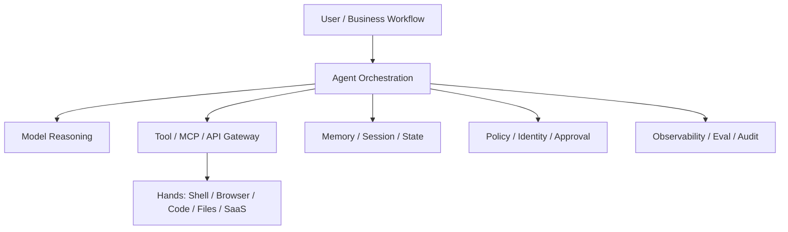
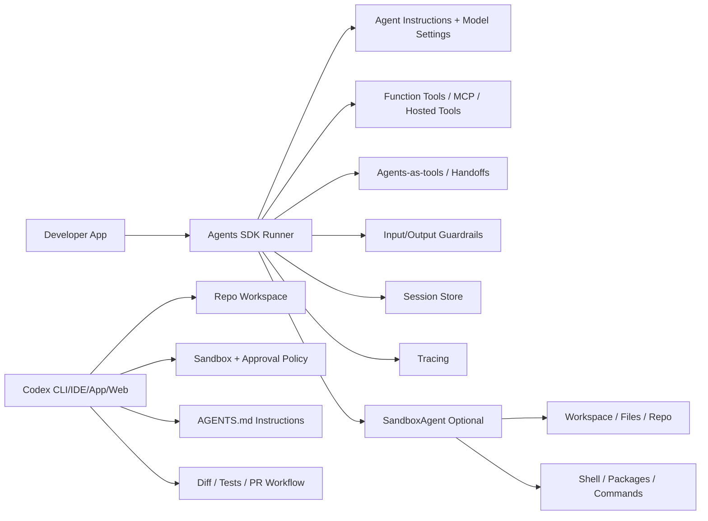
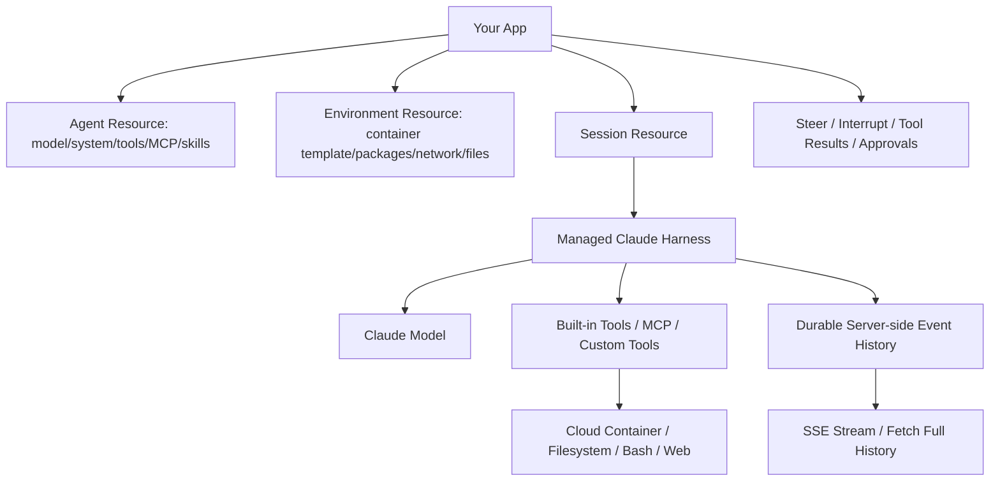
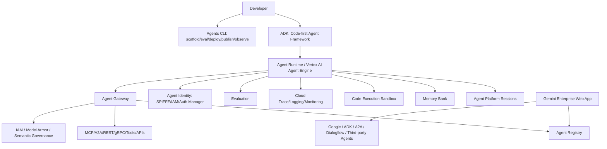
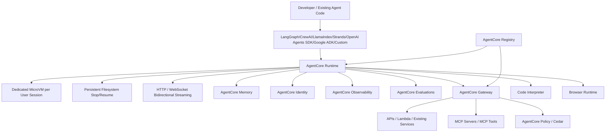
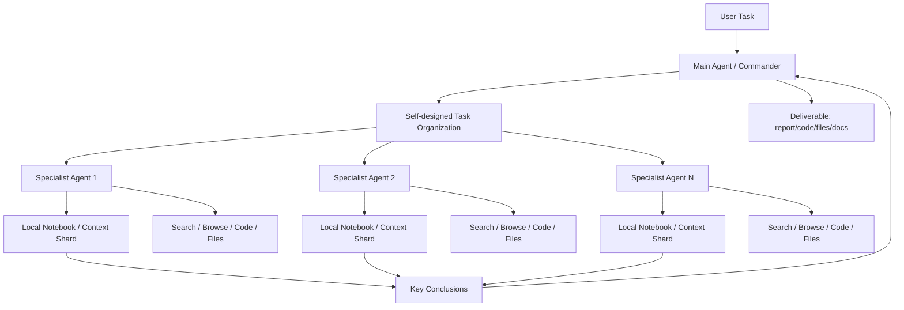

# Agent Platform Research Report

截至日期：2026-05-08
范围：OpenAI Agents SDK + Codex、Claude Managed Agents、Google Gemini Enterprise Agent Platform / ADK、AWS Bedrock AgentCore、Kimi K2.6 Agent Swarm / Kimi Agent SDK。

## 结论先行

这五个系统不是同一类产品：

| 对象 | 本质定位 | 它主要解决的问题 | 不应该误解成什么 |
| --- | --- | --- | --- |
| OpenAI Agents SDK + Codex | SDK + 编程/代码执行产品组合 | 让开发者用少量抽象构建 Agent 应用；让代码 Agent 在本地、IDE、App、Web 中受控修改代码 | 不是一个完整企业 Agent PaaS |
| Claude Managed Agents | 托管 Agent harness + 云端环境 + 持久 session API | 免自建 agent loop、sandbox、tool execution，让 Claude 做长时异步任务 | 不是通用多云治理平台 |
| Google Gemini Enterprise Agent Platform | 企业 Agent 开发、部署、治理、观测平台；ADK 是开发框架 | 在 Google Cloud / Gemini Enterprise 中统一开发、注册、部署、身份、网关、治理、观测和评测 | 不是轻量 SDK；不是完全云无关方案 |
| AWS Bedrock AgentCore | 模型/框架中立的托管 Agent 基础设施平台 | 把任意框架/模型的 Agent 生产化：Runtime、Memory、Gateway、Identity、Browser、Code Interpreter、Observability、Evaluation、Policy、Registry | 不是单一 Agent 框架 |
| Kimi K2.6 Agent Swarm | 产品/模型层的并行 Agent 模式 + CLI/SDK 生态 | 用大量子 Agent 并行分解广域搜索、批量处理、长文档、复杂编程任务 | 不是企业级运行时治理平台 |

一句话选型：

| 平台 | 一句话核心价值 |
| --- | --- |
| OpenAI Agents SDK + Codex | 对开发团队，OpenAI 把“Agent 应用编排”和“代码变更执行”拆成 SDK 与 Codex 两层，让企业最快把模型能力落到工具调用、handoff、guardrail、代码修改和开发工作流里，商业价值是缩短从原型到工程自动化的路径。 |
| Claude Managed Agents | 对需要长时间异步工作的团队，Claude Managed Agents 把 Agent loop、云容器、工具执行、事件流和持久 session 托管起来，让企业少建一整套 harness/sandbox 基础设施，商业价值是降低长任务 Agent 的平台建设门槛。 |
| Google Gemini Enterprise Agent Platform | 对已在 Google Cloud / Workspace / Vertex AI 生态内的企业，Google 把 Agent 开发、部署、身份、网关、注册、治理、观测、评测和企业数据连接合为一个控制面，商业价值是让 Agent 进入企业 IT 治理体系而不是散落在个人工具里。 |
| AWS Bedrock AgentCore | 对需要模型/框架中立、强安全和大规模生产运行的企业，AgentCore 把任意 Agent 框架包装进 AWS 托管运行时、身份、内存、网关、策略、注册和观测体系，商业价值是把 Agent 从 demo 变成可审计、可扩展、可管控的生产服务。 |
| Kimi Agent Swarm | 对广域搜索、批量处理和复杂产出任务，Kimi 用训练过的 orchestrator 自动调度大量子 Agent 并行工作，商业价值是用并行吞吐换取更快、更广覆盖的研究、内容、数据和代码产出。 |

## 研究方法和证据边界

本报告以官方文档、官方 GitHub 仓库、官方工程博客和产品帮助中心为主证据。由于当前工作区没有这些云平台的企业账号、API key、AgentCore/Gemini Enterprise/Managed Agents beta 权限，本报告没有声称完成真实云端压测或带账单的 hands-on 实验；但在每个平台章节都给出可复现实验路径。

重要时间敏感点：

- Google Gemini Enterprise agents overview 页面标注最后更新为 2026-05-01。
- Google Agent Gateway overview 页面标注最后更新为 2026-05-05。
- Claude Managed Agents 文档要求 `managed-agents-2026-04-01` beta header。
- Kimi K2.6 Agent Swarm 帮助中心写明 K2.6 于 2026-04-20 发布，并把 Agent Swarm 标为 Beta。
- OpenAI Codex GitHub 仓库显示 2026-05-07 有最新 release。

## 0. 核心架构与设计哲学

### 总体分层

可以把 Agent 系统拆成 7 层：



五个平台的差别在于各自“占据哪几层”：

| 平台 | Orchestration | Model | Hands | State/Memory | Governance | Observability/Eval |
| --- | --- | --- | --- | --- | --- | --- |
| OpenAI Agents SDK | 强，代码内编排 | OpenAI 优先，也支持第三方模型 | 函数、MCP、sandbox agents、Codex 产品层 | SDK sessions，多后端 | Guardrails/HITL，企业治理需外部补 | Tracing 强 |
| Codex | 面向代码任务的产品编排 | OpenAI 模型 | 本地/IDE/App/Web sandbox、shell、文件、git | 会话、AGENTS.md、工作区 | sandbox + approval + enterprise config | 产品侧日志/会话，平台级审计有限 |
| Claude Managed Agents | 托管 harness | Claude | 托管容器、bash、文件、web、MCP/custom tools | 服务端 event log + filesystem | permission policy、token vault/proxy 思路 | Console trace/usage，仍是 beta |
| Google Gemini Enterprise / ADK | ADK + Agent Runtime + Enterprise registry | Gemini 优先，ADK 支持多模型 | Tools、MCP、A2A、Code Execution、connectors | Sessions、Memory Bank、RAG、Example Store | IAM、SPIFFE identity、Gateway、Model Armor、Semantic Governance | Cloud Trace/Logging/Monitoring、Evaluation |
| AWS Bedrock AgentCore | 框架中立 Runtime + platform services | 任意 FM，包括 Claude/Gemini/OpenAI 等 | Gateway、Browser、Code Interpreter、MCP/A2A | Memory、persistent filesystem | Identity、Policy/Cedar、Registry、IAM/IdP | OTEL/OpenInference/CloudWatch、Evaluations |
| Kimi Swarm | 模型/产品内置并行 orchestrator | Kimi K2.6 | Web/文件/代码/Office/Kimi CLI tools | 子 Agent notebook/context sharding | 产品权限/配额为主 | 产品可视化任务列表，企业审计弱 |

### 设计哲学差异

**OpenAI Agents SDK：少数强原语 + Python-first。**
OpenAI Agents SDK 的设计哲学是“足够少的原语，足够强的组合力”：Agent、tool、handoff、guardrail、session、trace。开发者用 Python 语言本身组织流程，而不是被迫学习大型 DSL。Codex 则把这个理念落到代码任务：受控地读文件、改文件、跑命令、使用项目说明。

**Claude Managed Agents：把 brain、hands、session 解耦。**
Anthropic 的工程文章明确把 Managed Agents 设计为 session、harness、sandbox 三个可替换接口。核心观点是：模型能力在变，harness 假设会过期，所以应该稳定接口，而不是把 Claude、工具、容器、状态耦合进一个“宠物容器”。这就是 Managed Agents 的“meta-harness”设计。

**Google：企业控制面优先。**
Google 的重点不是只给一个 SDK，而是把 Agent 放进企业已有的 IAM、VPC-SC、Cloud Trace、Cloud Logging、Agent Registry、Gateway、Model Armor、connectors、Vertex AI / Gemini Enterprise 体系。ADK 负责开发体验，Agent Runtime 负责生产运行，Agent Gateway/Identity 负责治理。

**AWS：模型/框架中立的生产底座。**
AgentCore 的哲学是“你可以继续用任意框架和模型，但生产运行、身份、工具、内存、策略、注册、观测交给 AWS 管”。它不试图成为唯一 Agent SDK，而是成为任意 Agent 的 serverless runtime + governance fabric。

**Kimi：水平扩展 Agent 智能。**
Kimi Swarm 的哲学不是先做企业控制面，而是突破单 Agent 串行瓶颈：用一个 orchestrator 调度最多数百个子 Agent 并行搜索、阅读、写作、编码。关键设计是 PARL：训练指挥者，而不是重新训练每个 specialist。

## 1. OpenAI Agents SDK + Codex

### 解决什么问题

OpenAI Agents SDK 解决的是“如何把模型调用变成可组合 Agent 应用”的问题：

- 自动处理 agent loop：模型提出 tool call，SDK 执行工具，把结果送回模型，循环到完成。
- 用普通 Python 定义 agent、tool、handoff、guardrail。
- 用 sessions 保存多轮上下文。
- 用 tracing 调试、观测、评估 Agent workflow。
- 用 SandboxAgent 在真实文件/仓库/隔离工作区中执行编码、审查、文档任务。

Codex 解决的是“如何让代码 Agent 真正进入开发工作区”的问题：

- 在终端、IDE、桌面 App、Web 中读取项目、修改代码、运行命令。
- 用 sandbox mode 和 approval policy 控制权限边界。
- 用 `AGENTS.md` 给仓库级/目录级开发规范。
- 支持本地工作区、云端 Codex Web、IDE extension、GitHub/Slack/Linear 等产品集成。

二者关系：Agents SDK 是开发者框架，Codex 是代码 Agent 产品/运行界面。可以把 Codex 看成一个成熟的 coding harness，而不是 Agents SDK 的简单示例。

### 架构设计



关键思想：

- SDK 不强行托管你的业务服务；你的应用仍然拥有数据库、工具授权、部署、监控集成。
- Agent orchestration 是库内能力；企业治理和运行时隔离需要你组合外部系统，或使用 Codex/ChatGPT 企业能力。
- Codex 的安全边界由 sandbox 与 approval policy 协作实现：sandbox 是技术限制，approval 是越界确认流程。

### 实现原理和细节

OpenAI Agents SDK 的运行链路可以抽象为：

1. `Runner.run(agent, input, session, run_config)` 创建一次 agent run。
2. Runner 读取 session history，合并新输入。
3. 调用模型。
4. 如果模型要求工具调用，SDK 基于 schema 执行 Python function / MCP tool / hosted tool。
5. 工具结果回填到模型上下文。
6. 如果触发 handoff，则把控制权交给另一个 agent。
7. Guardrails 可并行检查输入/输出，失败则中断。
8. Run items、tool calls、handoff、trace span 被记录，最终返回 `final_output` 或 interruption state。

Sessions 的实现是 pluggable：SQLite、Redis、SQLAlchemy、MongoDB、Dapr、EncryptedSession、OpenAI Conversations API session、Responses compaction session 等。它适合保存“对话/工具调用历史”，不是完整业务状态数据库。

SandboxAgent 的实现把 Agent 放入隔离工作区：

- manifest 描述输入文件、repo、workspace entry、snapshot。
- sandbox client 可以是本地 Unix、Docker 等。
- capabilities 控制 filesystem、shell、memory、skills、compaction 等。
- 可 resume sandbox session，或从 snapshot 启动。

Codex 的实现细节更多在产品侧：

- CLI 可通过 `npm install -g @openai/codex` 或 Homebrew 安装。
- `AGENTS.md` 按 global -> repo root -> 当前目录逐层发现和合并，靠近当前目录的说明覆盖更上层说明。
- Linux/WSL sandbox 依赖 bubblewrap 或 helper；macOS 使用 Seatbelt；Windows 使用原生 Windows sandbox / WSL2 组合。
- 常见权限模式包括 `read-only`、`workspace-write`、`danger-full-access`；approval policy 包括 `untrusted`、`on-request`、`never`。

### 开发者使用路径

最小 SDK 路径：

```python
from agents import Agent, Runner

agent = Agent(
    name="Researcher",
    instructions="Research the topic and return concise findings."
)

result = Runner.run_sync(agent, "Compare MCP and A2A.")
print(result.final_output)
```

多 Agent 路径：

```python
from agents import Agent, Runner

researcher = Agent(name="Researcher", instructions="Find evidence and cite sources.")
writer = Agent(name="Writer", instructions="Write a structured report.")

manager = Agent(
    name="Manager",
    instructions="Delegate research to Researcher, then ask Writer to draft.",
    tools=[
        researcher.as_tool(tool_name="research", tool_description="Research a topic"),
        writer.as_tool(tool_name="write", tool_description="Write final report"),
    ],
)

result = Runner.run_sync(manager, "Prepare an agent platform comparison report.")
```

Codex 路径：

```bash
npm install -g @openai/codex
codex
```

然后在仓库根目录放置：

```markdown
# AGENTS.md

## Repository Expectations

- Run tests before changing behavior.
- Prefer small, reviewable diffs.
- Do not add dependencies without approval.
```

### 多 Agent 协调

OpenAI Agents SDK 提供两种主要模式：

- **Agents as tools**：manager agent 把 specialist 当工具调用，适合中心化控制、结构清晰的工作流。
- **Handoffs**：当前 agent 把会话移交给另一个 agent，适合客服路由、领域专家接管、人机交互连续性。

它的强项是“简单、可读、Python-native”；弱项是没有像 Temporal/LangGraph 那样默认提供完整 durable workflow kernel。要实现跨小时/跨天可靠 workflow，需要应用侧补持久化、幂等、重试、队列和审计。

### Hands 层

OpenAI 的 hands 层分成三类：

- Function tools：开发者的 Python 函数。
- MCP tools：连接外部工具服务器。
- Sandbox/Codex：真实文件、shell、repo、测试命令、包管理器。

Codex 比纯 SDK 更接近“hands runtime”：它把文件系统、shell、git、审批、项目说明组合成开发工作流。

### 记忆、状态与持久化

- SDK sessions 是多轮上下文记忆。
- Sandbox session / snapshot 是执行工作区记忆。
- Codex 使用项目文件、会话记录、AGENTS.md、配置、工作区 diff 形成任务状态。
- 业务状态、长周期任务状态、审计事件、审批记录仍需开发者或企业平台自建。

### 安全、治理与企业特性

已有能力：

- Guardrails。
- Human-in-the-loop。
- Codex sandbox。
- Codex approval policy。
- Codex 企业管理配置、权限、MCP、hooks 等产品能力。

未完整覆盖：

- 跨组织统一 Agent registry。
- 每个工具调用的企业级 policy-as-code。
- 端到端数据血缘、工具调用血缘、artifact provenance。
- 多云身份、细粒度资源授权、VPC 内工具访问治理。

### 性能、成本与生产就绪度

Agents SDK 适合快速生产化轻中等复杂 Agent 应用，因为抽象少、调试链路清楚、tracing 完整。成本由模型 token、工具调用、sandbox 资源、外部 API 共同决定。它不会自动替你做预算控制、fan-out 限流、长任务资源调度。

Codex 的生产就绪度体现在开发工作流：代码修改、审查、测试、IDE、本地/云端协同。它不是一个通用 Agent hosting runtime。

### 生态

- OpenAI Responses API、Chat Completions、Realtime、Voice。
- MCP。
- Codex CLI/IDE/App/Web。
- GitHub、Slack、Linear 等产品集成。
- Python session 后端、tracing、eval/fine-tuning/distillation 工具链。

### 适用场景与局限

适合：

- 快速构建 Agent 应用。
- 客服/运营/研究/自动化工具调用。
- 代码 Agent、代码审查、仓库修复、测试运行。
- 需要开发者完全控制业务逻辑和工具授权的产品。

局限：

- 企业控制面不完整。
- Durable execution、multi-tenant isolation、tool policy、registry、billing guardrail 需要自建。
- SandboxAgent 和 Codex 是强能力，但不能替代企业工作流治理。
- 多 Agent 更偏框架组合，不是自动解决组织级协同。

### 演进路线

OpenAI 的方向很清晰：

- Agents SDK 从轻量编排继续加入 sandbox、sessions、tracing、HITL、realtime。
- Codex 从 CLI 扩展到 IDE、App、Web、GitHub/Slack/Linear、企业治理和自动化。
- 未来更可能形成“SDK 编排 + Codex hands + ChatGPT/Codex 企业工作流”的组合，而不是单独一个 PaaS。

## 2. Claude Managed Agents

### 解决什么问题

Claude Managed Agents 解决的是：企业想让 Claude 做长时间、多工具、异步、可中断/可恢复任务，但不想自己先造 agent loop、容器环境、工具执行层、事件流、session 持久化。

官方文档把它定义为托管基础设施中的预构建、可配置 agent harness，特别适合长运行任务和异步工作。

### 架构设计



核心概念：

- **Agent**：模型、系统提示、工具、MCP servers、skills。
- **Environment**：容器模板、预装包、网络访问、挂载文件。
- **Session**：在环境中执行具体任务的运行实例。
- **Events**：用户消息、工具结果、状态更新、agent 输出。

Anthropic 工程文章进一步给出设计哲学：

- session 是 append-only log，不等于 Claude context window。
- harness 是 brain，sandbox/tools 是 hands。
- hands 不应持有凭证，凭证应在 vault/proxy 中。
- harness 和 sandbox 都应该是可失败、可替换、可恢复的 cattle，而不是不可丢失的 pet。

### 实现原理和细节

一次典型调用：

1. 创建 Agent：定义 model、system prompt、tools、MCP servers、skills。
2. 创建 Environment：指定 Python/Node/Go 等包、网络规则、文件挂载。
3. 创建 Session：引用 Agent 与 Environment。
4. 发送 user event。
5. Claude 通过托管 harness 自主调用 bash、文件、web、MCP/custom tools。
6. 服务端通过 SSE 流式返回状态、工具调用、输出。
7. event history 服务端持久化，可完整拉取。
8. 用户可以中途追加事件进行 steering，也可以 interrupt。
9. 如果 custom tool 或 permission policy 需要外部动作，session 会进入 idle / requires_action，等待客户端提交 tool result 或 approval。

重要细节：

- 文档要求 `managed-agents-2026-04-01` beta header。
- Outcomes 与 multiagent 处于 research preview，需要申请。
- Create endpoints 和 read endpoints 有组织级 rpm 限制，另受组织 spend/rate tier 限制。

### 开发者使用路径

伪代码路径：

```python
# 伪代码，具体以 Anthropic SDK / API Reference 为准
agent = client.beta.managed_agents.agents.create(
    model="claude-sonnet-...",
    system_prompt="You are a coding and research agent.",
    tools=["bash", "file", "web_fetch"],
    mcp_servers=[...],
)

env = client.beta.managed_agents.environments.create(
    image="python-node-go",
    network_policy={...},
    mounted_files=[...],
)

session = client.beta.managed_agents.sessions.create(
    agent_id=agent.id,
    environment_id=env.id,
)

client.beta.managed_agents.sessions.events.create(
    session_id=session.id,
    event={"type": "user.message", "content": "Build and test this feature."},
)

for event in client.beta.managed_agents.sessions.stream(session.id):
    handle(event)
```

从上手角度，Claude Managed Agents 比自建 Claude agent loop 更短，因为 agent loop、tool execution、container、session log 已被托管；但比直接 Messages API 更重，因为你要理解 Agent、Environment、Session、Event 四个资源。

### 多 Agent 协调

当前公开文档明确提到 multiagent 是 research preview。也就是说：

- 普通可用路径更像“一个托管 Claude Agent + 多工具 + 长任务 session”。
- 多 Agent 组织、handoff、子任务协调不是当前最稳的公开主路径。
- 如果企业需要复杂多 Agent DAG，现阶段可能要在客户端应用层编排多个 Managed Agent sessions，或等待 Anthropic multiagent 能力成熟。

### Hands 层

Claude Managed Agents 的 hands 层很强：

- Bash。
- 文件 read/write/edit/glob/grep。
- Web search/fetch。
- MCP servers。
- Custom tools。
- 托管容器环境。

它和 Codex 类似，都面向“能真实执行”的 Agent。但 Claude Managed Agents 更偏 API 平台，Codex 更偏开发者产品。

### 记忆、状态与持久化

三类状态：

- **Session event log**：服务端持久事件历史，是恢复和审计的事实源。
- **Environment filesystem**：长任务中的文件、产物、代码、临时状态。
- **Claude context window**：每次模型调用的工作上下文，是 event log 的投影，不是全部历史。

这个设计的关键价值是：即使 harness 崩溃，也能通过 session log 恢复；即使 context 被压缩，原始 event log 仍可查询。

### 安全、治理与企业特性

已有能力：

- 工具 permission policy。
- Custom tool confirmation flow。
- MCP token proxy / vault 思路。
- 容器环境隔离。
- 服务端 event history。
- 使用量 accounting 和 console trace。

局限：

- Beta。
- 多 Agent preview。
- 企业级 registry、跨云 IAM、策略语言、组织级工具目录不如 Google/AWS 完整。
- 运行时细节由 Anthropic 托管，企业可控性不如自建或 AWS/GCP 原生控制面。

### 性能、成本与生产就绪度

Managed Agents 的性能优势来自：

- brain 与 hands 解耦后，不需要每个 session 一开始就启动容器。
- session log 外置，harness 可无状态扩展。
- prompt caching、compaction、context management 由托管 harness 优化。

但由于是 beta，生产落地要谨慎：

- 评估 endpoint 限速。
- 明确数据保留、区域、合规、网络策略。
- 对长任务建立超时、预算、人工中断、审计流程。

### 生态

- Claude API。
- Claude SDK。
- MCP。
- Anthropic skills。
- Built-in bash/file/web tools。
- 与 Claude Code 的理念相近，但文档明确要求合作方不要把自己的产品伪装成 Claude Code。

### 适用场景与局限

适合：

- 长时间研究。
- 代码迁移/现代化。
- 数据处理、报告生成。
- 需要 API 接入托管 Claude 工作环境的产品。
- 不想自建 sandbox/harness 的团队。

局限：

- 仍是 beta。
- 多 Agent 能力不应作为确定性主路径。
- 对非 Claude 模型没有中立性。
- 深度企业治理不如 Google/AWS 平台化。
- 自定义运行时边界受平台抽象限制。

### 演进路线

Claude Managed Agents 很可能沿着三条线发展：

- 更稳定的 session/harness/sandbox 接口。
- 更丰富的 many brains / many hands / multiagent 能力。
- 更强的 token vault、MCP proxy、企业权限、长任务观测与恢复能力。

## 3. Google Gemini Enterprise Agent Platform / ADK

### 解决什么问题

Google 的 Agent 体系同时解决三类问题：

- **开发者问题**：用 ADK 快速构建、测试、评估、部署 Agent。
- **生产运行问题**：用 Agent Runtime 部署、管理、扩缩容、观测 Agent。
- **企业治理问题**：用 Gemini Enterprise、Agent Registry、Agent Identity、Agent Gateway、IAM、Semantic Governance、Model Armor 统一管理 Google、第三方、内部团队、ADK、A2A、Dialogflow Agent。

它不是“一个 SDK”，而是“企业 Agent 生命周期平台”。

### 架构设计



核心哲学：

- ADK 让 Agent 像软件一样开发：代码优先、可测试、可版本化、可部署。
- Agent Runtime 让 Agent 像服务一样运行：deploy、scale、observe、evaluate。
- Agent Identity / Gateway 让 Agent 像企业主体一样治理：每个 Agent 有身份、权限、审计、网络出入口。
- Gemini Enterprise 让 Agent 像企业应用一样分发：注册、共享、启用、禁用、面向员工可见。

### 实现原理和细节

ADK 层：

- `Agent` / `LlmAgent` 定义模型、instruction、tools。
- `sub_agents` 定义多 Agent 层级。
- workflow agents 支持 sequential、loop、parallel。
- tools 支持 function、OpenAPI、MCP、Google Search、Google 生态工具。
- HITL tool confirmation 可在工具执行前确认。
- events、artifacts、sessions、memory 构成运行上下文。
- `adk eval` 支持评测。
- Dev UI 用于测试、调试、展示。

Agent Runtime 层：

- 支持不同 Python frameworks，包括 ADK、LangChain、LangGraph、LlamaIndex、AG2、自定义 framework。
- Runtime 可自定义 container image 与 build-time install scripts。
- 提供 managed runtime、authentication/IAM、VPC-SC 等安全能力。
- Sessions 存储用户和 Agent 的交互，作为对话上下文事实源。
- Memory Bank 从 session 中生成、存储、检索长期记忆。
- Code Execution 提供安全隔离的代码执行 sandbox。
- Observability 接入 Cloud Trace、Cloud Monitoring、Cloud Logging，并支持 OpenTelemetry。
- Evaluation 提供离线/在线评测、模拟用户、指标、质量告警、prompt 优化。

治理层：

- Agent Identity 基于 SPIFFE，为每个 Agent 分配强证明身份。
- Agent Identity Auth Manager 管理 API key、OAuth 2-legged / 3-legged、用户委托权限。
- Agent Gateway 是 agentic interaction 的 ingress/egress 控制点。
- Gateway 支持 MCP、A2A、REST、gRPC 的协议中介。
- Gateway 结合 Registry、IAM、IAP、Model Armor、Semantic Governance 做授权和安全防护。
- 默认未注册/未授权的远程 MCP servers、agents、tools 会被阻断，除非显式放开。

### 开发者使用路径

ADK 快速路径：

```python
from google.adk import Agent
from google.adk.tools import google_search

agent = Agent(
    name="researcher",
    model="gemini-flash-latest",
    instruction="You help users research topics thoroughly.",
    tools=[google_search],
)
```

多 Agent：

```python
from google.adk.agents import LlmAgent

planner = LlmAgent(name="planner", model="gemini-2.5-flash", ...)
researcher = LlmAgent(name="researcher", model="gemini-2.5-flash", ...)
writer = LlmAgent(name="writer", model="gemini-2.5-flash", ...)

coordinator = LlmAgent(
    name="coordinator",
    model="gemini-2.5-flash",
    instruction="Coordinate planning, research, and writing.",
    sub_agents=[planner, researcher, writer],
)
```

生产路径：

1. 安装 `google-adk` 或使用 Agents CLI。
2. 本地开发、用 Dev UI 测试。
3. 用 eval set 和 `adk eval` 做质量评测。
4. 部署到 Agent Runtime / Cloud Run / GKE。
5. 配置 Agent Identity。
6. 注册到 Agent Registry / Gemini Enterprise。
7. 通过 Agent Gateway 管控 tool/MCP/A2A/REST/gRPC 访问。
8. 接入 Observability、Evaluation、Memory Bank。

### 多 Agent 协调

Google 的多 Agent 能力比 OpenAI SDK 更“平台化”：

- ADK 支持 sub_agents、workflow agents、parallel agents、agent routing。
- Agent Runtime 支持 A2A。
- Gemini Enterprise 可注册 A2A agents、ADK agents、Dialogflow agents。
- Gateway 能治理 agents 与 tools、agents 与 agents 之间的通信。

但复杂度也更高。真正企业落地时，需要区分：

- ADK 内部多 Agent：一个应用内部协作。
- A2A 跨 Agent：不同 Agent 服务之间互操作。
- Gemini Enterprise 注册管理：员工可见和企业生命周期管理。
- Gateway 治理：运行时访问控制与安全检查。

### Hands 层

Hands 能力包括：

- ADK function tools。
- OpenAPI tools。
- MCP tools。
- Google Search grounding。
- Google / SaaS connectors。
- Code Execution sandbox。
- Agent Gateway 出入口代理。
- A2A / REST / gRPC tool or agent endpoints。

Google 的强项不是单个 shell，而是企业 API、数据源、身份、网络、安全体系的整合。

### 记忆、状态与持久化

Google 的状态分层最完整之一：

- ADK session/state/events/artifacts。
- Agent Platform Sessions：交互事实源。
- Memory Bank：长期记忆、memory profiles、memory revisions。
- RAG Engine / Vector Search / data stores：企业知识检索。
- Example Store：few-shot examples 动态检索。
- Cloud Logging/Trace：观测事实。

这使它适合企业知识型 Agent，但也带来配置复杂度和供应商绑定。

### 安全、治理与企业特性

Google 是五者中企业治理最系统的方案之一：

- Agent Identity：SPIFFE-based agent identity。
- IAM allow/deny、Principal Access Boundary、VPC Service Controls。
- Auth Manager：OAuth/API key/用户委托。
- Agent Gateway：mTLS、DPoP、IAP、MCP/A2A/REST/gRPC policy mediation。
- Model Armor：prompt injection、敏感信息泄漏等防护。
- Semantic Governance：上下文感知策略。
- Agent Registry：agent/tool/MCP 元数据和注册治理。
- Gemini Enterprise：agent enable/disable/share/delete/lifecycle。

局限也明确：

- 一些能力处于 Preview / Pre-GA。
- Gateway 对 agentic protocol attribute 条件的支持存在协议范围限制，例如部分条件主要支持 MCP。
- Gemini Enterprise 的 Client-to-Agent gateway mode 有限制。
- 深度依赖 Google Cloud IAM、网络、日志、部署模型。

### 性能、成本与生产就绪度

生产就绪度强：

- Managed runtime。
- Cloud Trace/Logging/Monitoring。
- Evaluation 和 online monitors。
- Agents CLI 的 scaffold/eval/deploy/publish/observe。
- Terraform / Cloud Build 自动化路径。

成本维度复杂：

- 模型调用。
- Agent Runtime compute。
- Code Execution。
- Memory Bank / RAG / Vector Search / data stores。
- Cloud Logging/Trace/Monitoring。
- Gateway / IAM / security services。

Google 平台适合有云治理能力的企业，不适合希望最小依赖、极简上手的小团队。

### 生态

- ADK Python/TypeScript/Go/Java。
- Vertex AI / Agent Engine / Agent Runtime。
- Gemini Enterprise。
- Google Workspace / enterprise connectors。
- Cloud Run / GKE。
- LangChain、LangGraph、LlamaIndex、AG2。
- MCP、A2A。
- Cloud Trace/Logging/Monitoring、Model Armor、IAM、VPC-SC。

### 适用场景与局限

适合：

- Google Cloud 客户。
- 企业内部 Agent 门户。
- RAG/企业知识/Workspace 数据 Agent。
- 需要强身份、网关、审计、治理的 Agent。
- 需要把 ADK、A2A、Dialogflow、第三方 Agent 统一注册管理。

局限：

- 平台复杂度高。
- 供应商绑定强。
- 预览能力多，生产使用需逐项确认 SLA/支持。
- 对非 Google Cloud 环境不如 AWS AgentCore 的“任意框架/任意模型”表述中立。
- 轻量开发体验不如 OpenAI Agents SDK 简洁。

### 演进路线

Google 的路线会继续向“企业 Agent 操作系统”演进：

- ADK 2.0、graph workflows、collaborative agents。
- Agent Runtime 更完整的框架支持。
- Agent Gateway 成为 agentic network control point。
- Agent Identity 成为比 service account 更细的 agent principal。
- Gemini Enterprise 成为企业 agent gallery / registry / governance front door。

## 4. AWS Bedrock AgentCore

### 解决什么问题

AWS Bedrock AgentCore 解决的是：企业已经有各种 Agent 框架、模型和工具，但缺少一个能安全大规模运行、治理、观测、评测、注册、授权的统一基础设施。

它的关键承诺是：

- 任意 framework。
- 任意 foundation model。
- 托管 runtime。
- session isolation。
- memory。
- MCP gateway。
- identity。
- code interpreter。
- browser。
- observability。
- evaluations。
- policy。
- registry。

### 架构设计



核心哲学：

- AWS 不要求你放弃已有 Agent 框架。
- Runtime 负责把本地 agent code 变成云原生部署。
- Gateway 负责把企业 API/Lambda/服务变成 MCP-compatible tools。
- Policy 在工具调用前做确定性控制。
- Identity 连接企业 IdP。
- Registry 管理 agents、MCP servers、tools、skills、custom resources。

### 实现原理和细节

AgentCore Runtime：

- Framework agnostic：LangGraph、CrewAI、Strands、LlamaIndex、自定义等。
- Model flexibility：Bedrock 内外模型，包括 Claude、Gemini、OpenAI 等。
- Protocol support：MCP、A2A。
- Session isolation：每个用户 session 在 dedicated microVM 中运行，CPU/memory/filesystem 隔离，结束后 microVM 终止并清理内存。
- Long-running：支持最长 8 小时的长任务。
- Persistent filesystem：stop/resume 后文件、包、构建产物可保留。
- Consumption-based pricing：按实际消耗资源计费，强调等待 LLM 响应时的资源计费优化。
- Built-in auth：入站认证和出站 OAuth/API key。
- 100MB payload。
- HTTP + WebSocket bidirectional streaming。
- Agent-specific tracing：捕获 reasoning steps、tool invocations、model interactions。

AgentCore Gateway：

- 把 API、Lambda、现有服务转换为 MCP-compatible tools。
- 连接已有 MCP servers。
- 支持 auth、composition、semantic tool selection、observability、audit。

AgentCore Policy：

- 用自然语言或 Cedar 定义细粒度策略。
- 与 Gateway 集成，在每次 tool call 前拦截。

AgentCore Memory：

- 支持 short-term memory 和 long-term memory。
- 支持跨 Agent 共享 memory store。

AgentCore Registry：

- 组织级 catalog。
- 管理 agents、MCP servers、tools、skills、custom resources。
- publish/review/approve 流程。
- hybrid semantic + keyword search。

### 开发者使用路径

典型路径：

1. 保留现有 Agent 代码，例如 LangGraph / CrewAI / OpenAI Agents SDK。
2. 用 AgentCore SDK 加少量适配，把本地 agent handler 包成 Runtime service contract。
3. 部署到 AgentCore Runtime。
4. 如果需要工具，把 Lambda/OpenAPI/内部 API 接入 AgentCore Gateway，暴露为 MCP tools。
5. 配置 Identity 连接 Okta/Entra/Auth0/Cognito。
6. 配置 Policy/Cedar 约束工具访问。
7. 配置 Memory。
8. 接入 Observability 和 Evaluations。
9. 把 Agent/tool/MCP server 发布到 Registry。

伪代码形态：

```python
# 伪代码：重点表达开发者心智模型
from bedrock_agentcore import Runtime
from my_agent import graph

runtime = Runtime.from_handler(
    handler=lambda request: graph.invoke(request),
    auth="agentcore-identity",
    memory="shared-memory-store",
)

runtime.deploy(name="research-coding-agent")
```

### 多 Agent 协调

AgentCore 的多 Agent 思路是底座式：

- 你的 framework 可以是 LangGraph/CrewAI/Strands/OpenAI Agents SDK/Google ADK，自身负责编排。
- Runtime 支持 multi-agent workloads。
- Protocol 层支持 MCP 和 A2A。
- Registry 管理可发现 agents/tools。
- Gateway 和 Policy 管理跨 agent/tool 的访问。

也就是说，AgentCore 不强调自己发明一种新的 multi-agent DSL；它提供生产运行和治理承载。

### Hands 层

AWS 的 hands 层非常完整：

- Code Interpreter：Python/JavaScript/TypeScript 隔离代码执行。
- Browser：云端浏览器环境，可和 Playwright/BrowserUse 等配合。
- Gateway：企业 API/Lambda/SaaS/MCP tools。
- Runtime session filesystem。
- Shell commands in Runtime sessions。
- A2A/MCP servers。

相比 Google，AWS 更突出“任意框架/任意模型 + AWS 托管隔离 session”；相比 Claude/OpenAI，它更像可组合平台服务。

### 记忆、状态与持久化

状态分层：

- Runtime session state。
- Persistent filesystem stop/resume。
- AgentCore Memory short-term/long-term。
- Gateway tool metadata。
- Registry catalog。
- Observability traces/spans。
- Evaluations sessions/traces/spans。

AgentCore 的状态能力强在“平台组件齐全”，但业务语义状态仍由企业应用定义。

### 安全、治理与企业特性

AgentCore 是五者中最接近企业 infra 平台的方案之一：

- dedicated microVM session isolation。
- Built-in Identity，对接 Cognito、Okta、Microsoft Entra ID、Auth0 等。
- Inbound auth / outbound auth。
- Gateway tool access。
- Policy/Cedar 拦截 every tool call。
- Registry publish/review/approve。
- CloudWatch / OTEL / OpenInference。
- AWS IAM / VPC / KMS / CloudTrail 等生态可叠加。

局限：

- 强 AWS 绑定。
- 企业配置复杂度高。
- 服务组合多，成本面多。
- Agent 行为正确性、提示注入防御、工具语义安全仍需应用层评测和策略。

### 性能、成本与生产就绪度

生产就绪度强：

- Serverless runtime。
- Long-running up to 8 hours。
- Session isolation。
- Persistent filesystem。
- WebSocket streaming。
- 100MB payload。
- Observability/evaluations。
- Consumption-based pricing。

成本需要关注：

- Runtime active processing。
- Memory。
- Gateway。
- Code Interpreter。
- Browser。
- Model token。
- CloudWatch/observability。
- 外部 API。
- Fan-out 多 Agent 带来的并发放大。

### 生态

- AWS Bedrock。
- 外部模型：OpenAI/Gemini/Claude 等。
- CrewAI、LangGraph、LlamaIndex、Strands、Google ADK、OpenAI Agents SDK。
- MCP、A2A、AG-UI server 部署。
- Cognito、Okta、Entra、Auth0。
- CloudWatch、OTEL、OpenInference。
- Lambda、OpenAPI、SaaS。

### 适用场景与局限

适合：

- AWS 大客户。
- 多团队内部 Agent 平台。
- 需要任意模型/任意框架。
- 高安全隔离、长任务、工具治理、企业 IdP。
- 需要把现有 API/Lambda 变成 MCP tools。
- 需要平台化 registry、policy、eval、observability。

局限：

- 不是最轻量上手方案。
- 强依赖 AWS 组织能力。
- 对小团队可能过重。
- Agent 编排本身仍依赖上层 framework。
- 不能自动保证任务正确性、业务安全和成本收敛。

### 演进路线

AgentCore 很可能继续扩展成 AWS 的“agentic infrastructure layer”：

- 更多框架模板。
- 更强 MCP/A2A/AG-UI 支持。
- 更细粒度 policy。
- 更完整 eval/monitor/prompt optimization。
- Registry marketplace 化。
- Browser/code/runtime/memory 联动。

## 5. Kimi K2.6 Agent Swarm / Kimi Agent SDK

### 解决什么问题

Kimi Swarm 解决的是单 Agent 串行瓶颈：

- 一个 Agent 顺序搜索、读文档、写报告、改代码，会被工具调用和上下文窗口拖慢。
- 人工预设 multi-agent workflow 又容易变成复杂 if-else。
- Kimi 试图让主 Agent 自动生成组织结构，调度大量子 Agent 并行执行。

官方帮助中心将其描述为 horizontal scaling architecture，最多协调 300 个子 Agent，并支持每个任务 4,000+ tool calls，声称比单 Agent 顺序执行快约 4.5 倍。

### 架构设计



核心设计：

- Commander/Coach 负责全局策略和任务分配。
- Specialists/Players 负责局部任务。
- “Freeze players, train only coach”：保留子 Agent 能力，主要训练 orchestrator。
- PARL 奖励三件事：最终质量、真实并行度、子任务完成率。
- 用 critical steps metric 约束“最慢子 Agent 阶段”，避免假并行。
- 用 context sharding 让子 Agent 在自己的 notebook 中记录细节，只向 orchestrator 汇报关键结论。

### 实现原理和细节

Kimi Swarm 的关键不是传统软件架构，而是模型/训练/产品能力结合：

- Orchestrator 会动态决定是否拆任务、拆多少、怎么拆。
- 子 Agent 不预定义固定角色，角色由任务动态生成。
- 子 Agent 并行执行工具调用。
- Orchestrator 汇总局部结论形成最终答案或产物。
- 产品 UI 展示任务列表、子 Agent 生成、并行执行和最终 deliverables。
- 任务可生成代码项目、文件夹、数据分析、Office docs，并可预览/下载/分享。

Kimi Agent SDK 则是另一层：

- 多语言 Go/Node/Python SDK。
- 暴露 Kimi Code / Kimi CLI agent runtime。
- SDK 是 thin client，复用 CLI 配置、tools、skills、MCP servers。
- 支持实时流式响应、approval、tool calls、programmatic sessions。
- 示例中包括 KAOS sandbox backends，如 BoxLite、E2B、Sprites。

### 开发者使用路径

产品路径：

1. 打开 Kimi Agent Swarm。
2. 输入广域任务，例如“读 100 篇资料并产出行业报告”。
3. 观察主 Agent 自动拆分任务和生成子 Agent。
4. 等待产物生成，下载/预览/分享。
5. 需要时切回单 Agent 继续细化。

SDK 路径：

```bash
pip install kimi-agent-sdk
# 或
npm install @moonshot-ai/kimi-agent-sdk
# 或
go get github.com/MoonshotAI/kimi-agent-sdk/go
```

伪代码：

```python
# 伪代码，表达 SDK 心智模型
from kimi_agent_sdk import KimiAgent

agent = KimiAgent()
session = agent.create_session()

for event in session.run("Research 50 sources and produce a structured report."):
    if event.type == "approval_required":
        session.approve(event.id)
    elif event.type == "tool_call":
        log(event)
    elif event.type == "message":
        print(event.content)
```

### 多 Agent 协调

这是 Kimi 的最强项：

- 并行 fan-out 是内置能力，不要求开发者手写固定 workflow。
- 它适合“横向可拆”的任务：广域搜索、批量下载、100+ 文档阅读、长文写作、批量代码审查。
- 它不适合强事务、强一致性、强审批、强资源隔离的企业工作流，至少从公开资料看不是主打。

### Hands 层

Hands 能力主要通过 Kimi 产品和 Kimi CLI/SDK 体现：

- Web search/browse。
- 文件/文档/表格/PPT 产物。
- 复杂编程、前端开发、代码审查、重构。
- Kimi CLI tools/skills/MCP servers。
- SDK 可接入 sandbox backends。

### 记忆、状态与持久化

Kimi Swarm 的状态重点是并行任务过程：

- 子 Agent notebook/context shard。
- Orchestrator 汇总结果。
- 产品侧任务列表与 deliverables。
- CLI/SDK session。

公开资料没有显示它有 Google/AWS 那样的企业 Memory Bank、Agent Registry、policy-bound event log、跨团队 audit fabric。

### 安全、治理与企业特性

已有：

- 产品配额。
- 审批/tool call surfaced by SDK。
- CLI configuration/tools/skills/MCP 复用。

不足：

- 企业身份治理不清晰。
- 工具访问策略、agent registry、细粒度审计、数据血缘不如 AWS/Google。
- 大规模 fan-out 会放大 prompt injection、成本、质量漂移、重复劳动、数据来源可信度问题。
- Beta 能力，不宜直接作为强合规生产底座。

### 性能、成本与生产就绪度

性能：

- 对可并行任务有明显潜力。
- 官方声称大规模搜索场景 critical steps 减少、BrowseComp 准确率提升。

成本：

- 最多 300 子 Agent、4,000+ tool calls 意味着成本和配额消耗会显著放大。
- 对不适合拆分的任务，fan-out 可能浪费资源。

生产就绪度：

- 作为产品任务模式很强。
- 作为企业 agent runtime/governance platform 还不完整。

### 生态

- Kimi Agent Swarm 产品。
- Kimi Code / Kimi CLI。
- Kimi Agent SDK Go/Node/Python。
- CLI tools、skills、MCP servers。
- KAOS sandbox examples。

### 适用场景与局限

适合：

- 大规模信息检索。
- 批量文件/网页处理。
- 100+ 文档阅读。
- 长文写作。
- 多视角评审。
- 前端开发、代码审查、重构等可拆分编码任务。
- Office 自动化。

局限：

- 不适合强一致事务。
- 不适合高度敏感数据和复杂企业权限边界，除非另有企业控制面。
- 并行不等于正确，最终合成仍可能遗漏或幻觉。
- 子 Agent 之间上下文分片可能造成局部最优和全局冲突。
- 公开资料显示它更像产品/模型能力，不是完整 enterprise PaaS。

### 演进路线

Kimi 的路线会围绕“并行智能”继续增强：

- 更强 orchestrator 训练。
- 更好的真实并行奖励。
- 更低重复率的任务拆分。
- 更强子 Agent 记忆压缩和结果合并。
- CLI/SDK 与 sandbox/MCP/skills 生态扩展。
- 未来若补上企业身份、策略、审计、registry，才会向企业平台靠近。

## 6. 同一任务的横向实现对比

设定同一任务：构建一个“复杂报告 + 代码项目”的 Agent workflow：研究资料、设计方案、实现代码、运行测试、生成最终报告。

| 维度 | OpenAI Agents SDK + Codex | Claude Managed Agents | Google Gemini Enterprise / ADK | AWS Bedrock AgentCore | Kimi Swarm |
| --- | --- | --- | --- | --- | --- |
| 入口 | Python SDK + Codex CLI/IDE/Web | API 创建 Agent/Environment/Session | ADK/Agents CLI/Gemini Enterprise | AgentCore SDK/console/API | Kimi 产品/SDK |
| 研究 | Researcher agent + web/MCP tools | Claude web search/fetch/tools | ADK tool + Google Search/RAG/connectors | 任意框架 + Gateway tools | Swarm 自动 fan-out |
| 编码 | Codex 最强，直接改 repo 跑测试 | 托管容器 bash/file/edit | ADK + Code Execution/Runtime | Runtime + Code Interpreter + shell | Kimi Code/CLI/Swarm |
| 多 Agent | agents-as-tools/handoff | multiagent preview | sub_agents/workflow/A2A | 依赖上层框架 + A2A/Registry | 内置大规模并行 |
| 状态 | Sessions + workspace + Codex history | server-side event log + filesystem | Sessions + Memory Bank + artifacts | Runtime state + Memory + filesystem | notebooks/context shards |
| 治理 | guardrails/approval/sandbox，企业治理需补 | permission/custom tool flow，beta | Identity/Gateway/IAM/Model Armor/Semantic Governance | Identity/Policy/Gateway/Registry/microVM | 产品权限/配额为主 |
| 观测 | tracing/Codex logs | console trace/event stream | Cloud Trace/Logging/Monitoring/Eval | OTEL/CloudWatch/Evaluations | 产品过程可视化 |
| 最适合 | 开发者快速构建 + 代码 Agent | 托管长任务 Claude Agent | Google 生态企业 Agent | AWS 生态生产 Agent 平台 | 超大 fan-out 研究/批处理 |
| 最大风险 | 生产平台能力要自建 | beta/多 Agent preview | 复杂/锁定 Google | 复杂/锁定 AWS | 治理不足、成本 fan-out |

### 五个平台实现方式的本质差异

- OpenAI：你写 agent app，Codex 帮你把代码任务做实。
- Claude：你配置托管 agent，Anthropic 帮你跑 harness 和 sandbox。
- Google：你进入一个 Google Cloud 企业 Agent 生命周期平台。
- AWS：你把已有 agent code 放进 AWS agentic infrastructure。
- Kimi：你把任务交给并行 Agent 组织，追求吞吐和覆盖面。

## 7. 按用户指定 0-10 维度总表

| 维度 | OpenAI Agents SDK + Codex | Claude Managed Agents | Google Gemini Enterprise / ADK | AWS Bedrock AgentCore | Kimi Swarm |
| --- | --- | --- | --- | --- | --- |
| 0 核心架构与哲学 | 少原语、Python-first、Codex hands 产品化 | brain/hands/session 解耦的托管 meta-harness | 企业控制面 + ADK 开发框架 + Runtime/Gateway/Identity | 任意框架/模型的生产基础设施 | 水平扩展，训练 commander 调度 specialists |
| 1 实现原理细节 | Runner loop、tool schema、handoff、guardrails、sessions、sandbox；Codex sandbox/approval/AGENTS.md | Agent/Environment/Session/Event；SSE；server event log；requires_action；托管容器 | ADK agent/events/tools/sessions；Runtime deploy/scale；Identity/Gateway/Memory/Eval | microVM session、Gateway MCP、Identity、Memory、Policy/Cedar、Registry、Browser/Code | PARL、critical steps、context sharding、notebooks、CLI/SDK |
| 2 开发者路径 | `pip install openai-agents`；Codex npm/brew；代码最简 | API/SDK 创建四类资源 | `pip install google-adk` / Agents CLI / Cloud deploy | 包装现有 framework 到 Runtime，配置平台服务 | 产品输入任务；SDK 调 CLI runtime |
| 3 Orchestration | agents-as-tools、handoff、manager pattern | 单 Agent 长任务强，多 Agent preview | sub_agents、workflow、parallel、A2A、registry | 由 LangGraph/CrewAI/ADK 等承担，AgentCore 承载 | 内置最多数百子 Agent 并行 |
| 4 Hands 层 | function/MCP/SandboxAgent/Codex shell-file-git | bash/file/web/MCP/custom tools/cloud container | function/OpenAPI/MCP/connectors/Code Execution/Gateway | Gateway/API/Lambda/MCP/Browser/Code Interpreter/shell | web/browse/code/files/Office/CLI tools/MCP |
| 5 记忆状态 | SDK sessions、sandbox state、Codex workspace | event log + filesystem + context projection | Sessions、Memory Bank、RAG、artifacts、Example Store | Memory、persistent filesystem、traces、registry metadata | context shards/notebooks/session/deliverables |
| 6 安全治理 | guardrails/HITL/sandbox/approval；平台级治理需外接 | permission policy、vault/proxy 思路、beta | SPIFFE identity、IAM、Gateway、Model Armor、Semantic Governance、VPC-SC | microVM、Identity、Policy/Cedar、Gateway intercept、Registry | 配额/审批/tool surfaced，企业治理弱 |
| 7 性能成本生产 | SDK 轻，Codex 生产化代码工作流；长任务 infra 自建 | 长任务托管，TTFT 架构优化；beta/rate limit | 企业级生产栈强但成本/配置复杂 | 生产 infra 最完整之一，消费计费但组合成本复杂 | 并行快但 tool/token 成本放大 |
| 8 集成生态 | OpenAI API、MCP、Codex IDE/App/Web/GitHub | Claude API、MCP、skills、built-in tools | Google Cloud、Workspace、Vertex、ADK、多语言、A2A/MCP | AWS、Bedrock、任意 FM、主流框架、MCP/A2A/OTEL | Kimi CLI/Code/SDK、MCP、sandbox examples |
| 9 场景优势/局限 | 快速 Agent app + coding；企业平台弱 | 长任务托管；beta 和 Claude 绑定 | Google 企业生态强；复杂/锁定 | AWS 生产化强；复杂/锁定 | 广域并行强；治理/确定性弱 |
| 10 演进路线 | SDK + Codex + 企业开发工作流融合 | 更强 many brains/hands/session 稳定接口 | 企业 Agent OS、Gateway/Identity/Registry 成熟 | AWS agentic infra layer | 并行 Agent 训练与 SDK 生态 |

## 8. 它们共同解决不了的问题

### 1. 正确性不是平台自动保证的

Agent 能跑工具不等于结果正确。复杂任务仍需要：

- eval set。
- golden tasks。
- regression tests。
- tool result verification。
- citation/evidence checking。
- human review。

Google/AWS 有评测平台，OpenAI 有 tracing/eval 生态，Claude 有 session trace，Kimi 有并行提升；但没有一个能自动保证业务正确性。

### 2. Prompt injection 与工具语义安全仍难

网关、Model Armor、approval、policy 能降低风险，但无法完全理解“这个工具调用在业务上是否应该发生”。例如：

- 读 Jira 可以，改 Jira 是否可以？
- 读 GitHub issue 可以，merge PR 是否可以？
- 访问 CRM 可以，导出客户数据是否可以？
- 子 Agent 读到恶意网页后是否污染最终报告？

最终仍需业务策略、最小权限、数据分类、审计和人工审批。

### 3. 长期记忆质量不等于存储能力

Memory Bank、Sessions、SDK sessions、notebooks 都是载体。问题在于：

- 记什么？
- 什么时候忘？
- 错误记忆如何撤销？
- 多用户/多 Agent 记忆如何隔离？
- 记忆如何被审计、纠错、版本化？

### 4. Fan-out 成本治理仍未完全解决

Kimi Swarm 把 fan-out 做到产品核心；Google/AWS/OpenAI/Claude 也都可构造多 Agent 并行。真正难点是：

- 什么时候不该并行？
- 子任务上限如何设？
- 工具调用预算如何硬限制？
- 低价值子 Agent 如何早停？
- 多 Agent 结果冲突如何裁决？

### 5. 可复现性仍困难

Agent 任务受模型版本、工具结果、网页变化、环境状态、时间、权限影响。平台可以保存 traces、event logs、snapshots，但完全复现仍难，尤其是：

- 外部 API 返回变化。
- 网页内容变化。
- 模型升级。
- 非确定性工具。
- 并行竞态。

### 6. 企业组织流程不是技术平台能单独解决的

Agent 是否能上线，最终取决于：

- 谁批准 Agent？
- 谁拥有工具权限？
- 谁承担错误责任？
- 审计日志谁看？
- 事故如何回滚？
- 成本超限谁处理？

Google/AWS 提供更完整的企业控制面，但组织制度仍需企业自己设计。

## 9. 选型建议

### 选择 OpenAI Agents SDK + Codex，如果：

- 你是开发者团队，想快速构建 Agent 应用。
- 你需要清晰的 Python 编排、tool calling、handoff、guardrails、tracing。
- 你要做代码修改、测试、重构、PR、IDE/CLI 工作流。
- 你能接受企业控制面自己补。

不要选它作为唯一企业 Agent PaaS，如果你最关心的是跨团队 registry、tool policy、IAM、audit、memory governance。

### 选择 Claude Managed Agents，如果：

- 你主要使用 Claude。
- 你要长时间异步任务。
- 你不想自建 sandbox/harness/session/event stream。
- 你的任务需要文件、bash、web、MCP。

不要把它当成成熟多 Agent 企业平台；当前 beta 和 research preview 边界要纳入风险。

### 选择 Google Gemini Enterprise / ADK，如果：

- 你已经深度使用 Google Cloud、Workspace、Vertex AI。
- 你需要企业 Agent 门户、registry、identity、gateway、IAM、observability、evaluation。
- 你需要把 ADK/A2A/Dialogflow/第三方 Agent 统一纳入 Gemini Enterprise。
- 你能接受 Google Cloud 平台复杂度。

不要选它，如果你要极简 SDK、纯本地/self-hosted、强云无关。

### 选择 AWS Bedrock AgentCore，如果：

- 你已经在 AWS。
- 你有多个 Agent 框架和模型，不想统一重写。
- 你需要强隔离、长任务、runtime、memory、gateway、identity、policy、registry、observability。
- 你要把现有 Lambda/API/SaaS 工具 MCP 化。

不要选它，如果你只是做一个轻量 Agent 原型，或者团队没有 AWS 平台治理能力。

### 选择 Kimi Swarm，如果：

- 任务能横向拆分。
- 你关心速度、覆盖面、批量处理。
- 你要快速做研究、长文、文档、批量代码审查。
- 你可以接受产品式工作流和配额成本。

不要把它当成企业合规 Agent runtime；它更像强并行 Agent 能力，而不是治理平台。

## 10. 推荐实验路线

### 实验 A：Single-agent

任务：读取 5 篇公开资料，输出结构化摘要。

- OpenAI：一个 `Agent` + web/MCP tool + session。
- Claude：一个 Agent + Environment + Session。
- Google：一个 ADK Agent + Google Search tool。
- AWS：一个简单 LangGraph/Strands agent 部署 AgentCore Runtime。
- Kimi：单 Agent 或 Swarm off。

记录：

- 首次上手时间。
- 代码量。
- 工具配置复杂度。
- tracing/event 可读性。
- 单次成本。

### 实验 B：Multi-agent handoff

任务：Planner -> Researcher -> Critic -> Writer。

- OpenAI：agents-as-tools / handoff。
- Claude：客户端层创建多个 sessions，或申请 multiagent preview。
- Google：ADK `sub_agents` / workflow agents。
- AWS：LangGraph/CrewAI 内部多 Agent，AgentCore 承载。
- Kimi：Swarm 自动生成子 Agent。

记录：

- 编排是否显式可控。
- 子 Agent 是否可观测。
- 子任务失败如何恢复。
- 人工审批是否可插入。

### 实验 C：Research + coding + verification

任务：研究一个 GitHub issue，修改代码，跑测试，生成报告。

- OpenAI：Codex 最自然；SDK 可作为 manager。
- Claude：Managed Agents cloud container。
- Google：ADK + Code Execution / Agent Runtime。
- AWS：AgentCore Runtime + Code Interpreter / shell。
- Kimi：Kimi Code/CLI + Swarm research。

记录：

- 是否能真实改文件。
- sandbox 权限边界。
- 测试命令可控性。
- diff/review 体验。
- 长任务恢复。

### 实验 D：Enterprise governance

任务：Agent 只能读 Jira，不能写 Jira；只能读 GitHub public repo，不能读 private repo；超过 50 次 tool call 需要审批。

- OpenAI：应用层 policy + guardrails + MCP wrapper。
- Claude：permission policy/custom tool requires_action。
- Google：Agent Gateway + IAM + Registry + Model Armor/Semantic Governance。
- AWS：AgentCore Gateway + Policy/Cedar + Identity。
- Kimi：需要产品/SDK 自建约束，公开资料下能力较弱。

记录：

- 策略定义位置。
- 执行点是否强制。
- 审计日志是否完整。
- 是否能 dry-run。
- 是否支持 per-agent identity。

## 11. 对 AgentRuntimeFabric 的启发

如果本仓库的 AgentRuntimeFabric 要做开源替代，不应把差异化定位成“又一个 Agent SDK”。以上平台说明：

- SDK 编排已经有 OpenAI/Google。
- 托管 harness 已经有 Claude。
- 企业平台已经有 Google/AWS。
- 并行 Agent 产品能力已经有 Kimi。

更清晰的开源机会是：

- 自托管。
- 可替换模型和 Agent SDK。
- 可替换 runtime backend。
- 统一 workspace lineage。
- 每个 tool/shell/network/secret 动作都有 policy-bound execution。
- 事件、diff、artifact、approval、secret grant、runtime snapshot 形成 EvidenceGraph。
- MCP/A2A/AG-UI 都作为边界协议，不泄漏为内部事实模型。
- 对代码变更 Agent 做 kill-and-recover、审计、review、rollback、replay。

一句话：ARF 若要成立，价值不在“让 Agent 会调用工具”，而在“让会改代码、会跑工具的 Agent 在开源、自托管、可审计、可恢复、可治理的控制面里工作”。

## 12. 来源

OpenAI：

- OpenAI Agents SDK documentation: https://openai.github.io/openai-agents-python/
- OpenAI Agents SDK sandbox concepts: https://openai.github.io/openai-agents-python/sandbox/guide/
- OpenAI Agents SDK sessions: https://openai.github.io/openai-agents-python/sessions/
- OpenAI Codex sandboxing: https://developers.openai.com/codex/concepts/sandboxing
- OpenAI Codex AGENTS.md guide: https://developers.openai.com/codex/guides/agents-md
- OpenAI Codex GitHub: https://github.com/openai/codex

Anthropic / Claude：

- Claude Managed Agents overview: https://platform.claude.com/docs/en/managed-agents/overview
- Anthropic engineering, Scaling Managed Agents: https://www.anthropic.com/engineering/managed-agents

Google：

- Gemini Enterprise agents overview: https://docs.cloud.google.com/gemini/enterprise/docs/agents-overview
- Gemini Enterprise Agent Runtime: https://docs.cloud.google.com/gemini-enterprise-agent-platform/build/runtime
- Agent Identity overview: https://docs.cloud.google.com/gemini-enterprise-agent-platform/govern/agent-identity-overview
- Agent Gateway overview: https://docs.cloud.google.com/gemini-enterprise-agent-platform/govern/gateways/agent-gateway-overview
- Agent Development Kit docs: https://adk.dev/
- Google ADK Python GitHub: https://github.com/google/adk-python

AWS：

- Amazon Bedrock AgentCore overview: https://docs.aws.amazon.com/bedrock-agentcore/latest/devguide/what-is-bedrock-agentcore.html
- AgentCore Runtime: https://docs.aws.amazon.com/bedrock-agentcore/latest/devguide/agents-tools-runtime.html

Kimi：

- K2.6 Agent Swarm Beta help: https://www.kimi.com/help/agent/agent-swarm
- Kimi Agent SDK GitHub: https://github.com/MoonshotAI/kimi-agent-sdk
