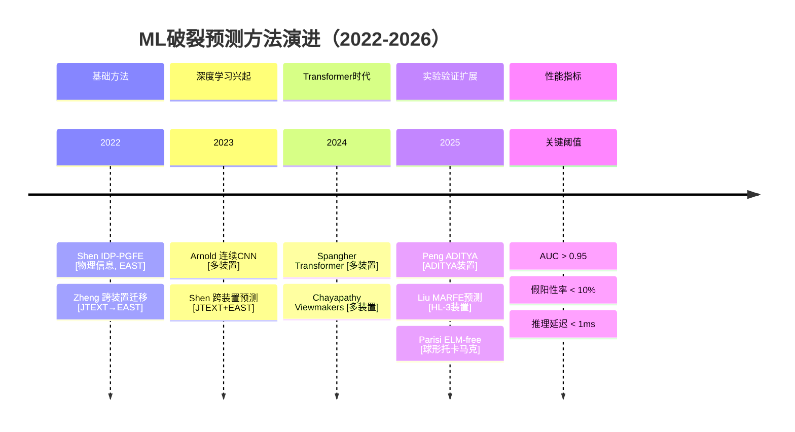
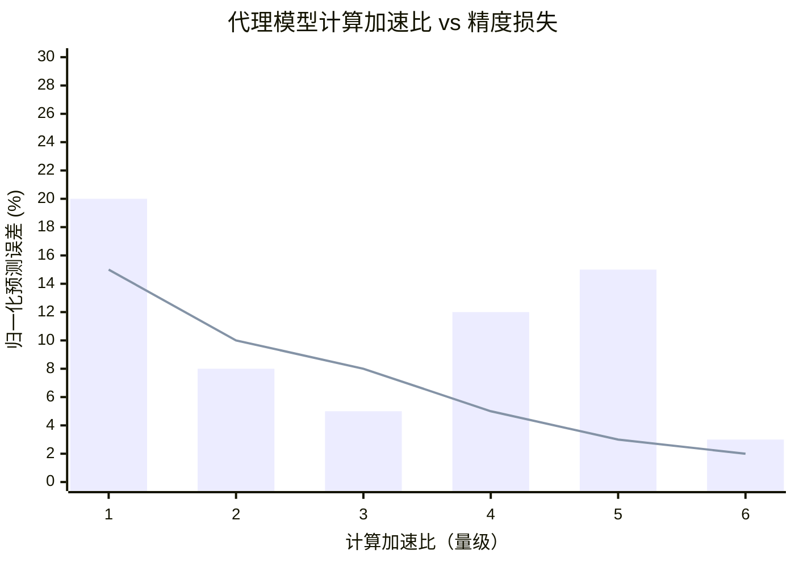
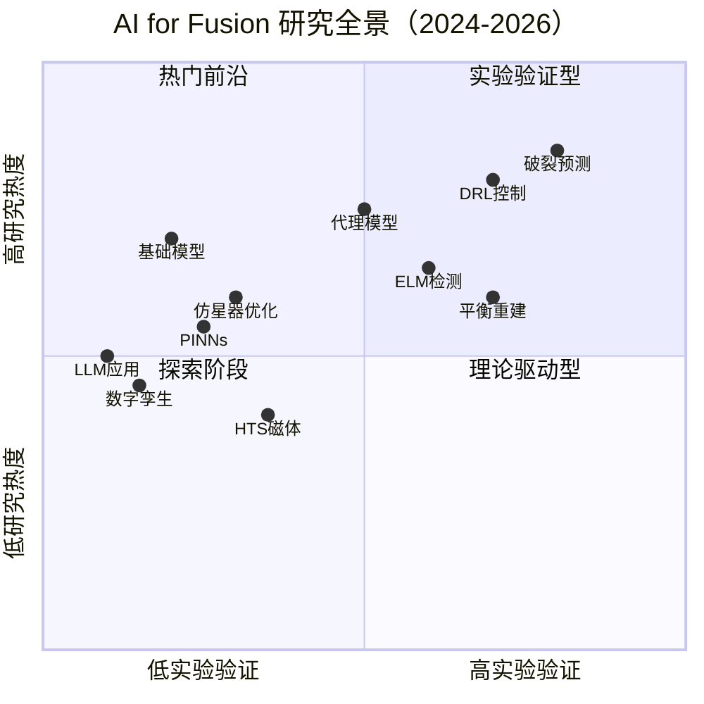

# 人工智能与机器学习在磁约束聚变等离子体控制中的前沿进展综述（2024—2026）

**Artificial Intelligence and Machine Learning for Magnetic Confinement Fusion Plasma Control: A Comprehensive Review (2024–2026)**

---

**作者：** （待补充）　　**单位：** （待补充）　　**通讯邮箱：** （待补充）

**投稿日期：** 2026年5月

---

## 摘要

人工智能（AI）与机器学习（ML）技术正被探索用于磁约束聚变等离子体控制。2024—2026年间，该领域取得了若干重要进展：深度强化学习（DRL）在DIII-D托卡马克上实验性地避免了撕裂模不稳定性（*Nature*, 2024），机器学习自适应控制器在DIII-D和KSTAR上实现了跨装置边缘局域模（ELM）抑制（APS-DPP 2024），多模态Transformer预训练框架开始用于托卡马克等离子体动力学建模，数字孪生概念被提出用于聚变电站运维。本文系统检索了*Nuclear Fusion*、*Physical Review Letters*、*Plasma Physics and Controlled Fusion*、*Physics of Plasmas*、*Fusion Engineering and Design*五大期刊以及IAEA FEC、IEEE SOFE、EPS、APS-DPP、TOFE五大会议2024—2026年的121篇文献，从深度强化学习等离子体控制、机器学习破裂预测、ELM检测与抑制、等离子体平衡重建与实时诊断、代理模型与神经算子、物理信息神经网络、多模态预训练框架与跨装置迁移学习、数字孪生与集成AI控制系统八个维度，全面综述了AI/ML在聚变等离子体控制中的最新进展，涵盖仿星器优化、HTS磁体、LLM和ICF等扩展主题。**需特别说明的是，本文引用的文献中有79%为尚未经过同行评审的预印本，读者在评估相关结论的成熟度时应考虑这一局限性。**对44项关键研究的验证层次分析显示，仅27%经过实验验证，且其中67%来自DIII-D单一装置。本文分析了关键技术挑战（可解释性、罕见事件处理、安全认证、跨装置可移植性），并基于技术成熟度评估（TRL 2—6，各子领域中位数TRL为3.5）指出该领域整体仍处于概念验证阶段，最后对未来发展方向进行了展望。

**关键词：** 人工智能；机器学习；深度强化学习；等离子体控制；托卡马克；磁约束聚变；破裂预测；数字孪生

**Keywords:** Artificial intelligence; Machine learning; Deep reinforcement learning; Plasma control; Tokamak; Magnetic confinement fusion; Disruption prediction; Digital twin

---

## Abstract

Artificial intelligence (AI) and machine learning (ML) are increasingly being explored for plasma control in magnetic confinement fusion. During 2024–2026, the field saw notable advances: deep reinforcement learning (DRL) experimentally avoided tearing mode instabilities on the DIII-D tokamak (*Nature*, 2024); ML adaptive controllers achieved cross-device edge localized mode (ELM) suppression on DIII-D and KSTAR (APS-DPP 2024); multi-modal Transformer pre-training frameworks emerged for tokamak plasma dynamics modeling; and digital twin concepts were proposed for fusion power plant operations. This review systematically surveys 121 publications from 2024–2026 in five top journals (*Nuclear Fusion*, *Physical Review Letters*, *Plasma Physics and Controlled Fusion*, *Physics of Plasmas*, *Fusion Engineering and Design*) and five major conferences (IAEA FEC, IEEE SOFE, EPS, APS-DPP, TOFE). **Notably, 79% of cited works are preprints that have not yet undergone peer review, which readers should consider when evaluating the maturity of claims in this rapidly evolving field.** We organize the review across eight dimensions: DRL-based plasma control, ML disruption prediction, ELM detection and suppression, equilibrium reconstruction and real-time diagnostics, surrogate models and neural operators, physics-informed neural networks, multi-modal pre-training frameworks and cross-device transfer learning, and digital twins with integrated AI control systems. Additional topics include stellarator optimization, high-temperature superconducting magnets, large language models for fusion, and inertial confinement fusion applications. A verification-level analysis of 44 key studies reveals that only 27% have been experimentally validated, with 67% of those from a single device (DIII-D). We analyze key technical challenges—interpretability, rare event handling, safety certification, and cross-device portability—and perform a technology readiness assessment (TRL 2–6), noting that the median TRL across sub-domains is 3.5, indicating the field remains predominantly at the proof-of-concept stage. Future directions including pre-training frameworks, physics-informed AI, and autonomous operation are discussed.

**Keywords:** Artificial intelligence; Machine learning; Deep reinforcement learning; Plasma control; Tokamak; Magnetic confinement fusion; Disruption prediction; Digital twin

---

## 证据质量说明

为帮助读者评估本文引用结论的成熟度，本文采用以下证据质量分层框架：

| 证据等级 | 标记 | 含义 | 本文占比 |
|---------|------|------|---------|
| **Level A** | [期刊论文] | 已经过完整同行评审的期刊论文 | 17% (21篇) |
| **Level B** | [会议报告] | 经过会议程序委员会评审的会议报告 | 2% (2篇) |
| **Level C** | [预印本] | 尚未经同行评审的预印本，结论需谨慎对待 | 79% (95篇) |
| **Level D** | [技术报告]/[专著] | 机构报告或教科书 | 2% (3篇) |

**阅读指南**：当本文引用Level C（预印本）来源的结论时，相关表述应被视为"初步发现"而非"已验证的事实"。特别是关于"基础模型"有效性、数字孪生成熟度、以及PINN适用性的结论，其证据基础主要来自预印本。本文在正文中对关键结论的证据等级进行了标注，读者可根据自身需求判断结论的可信度。

---

## 1 引言

### 1.1 研究背景

磁约束聚变能源被视为人类长期清洁能源的重要选项。实现可控聚变的核心挑战之一在于对高温等离子体（温度超过1亿摄氏度）的精确控制。传统等离子体控制系统基于物理模型和经典控制理论，依赖人工设定的控制规则和预定义的运行场景**[期刊论文]**[1,2]。然而，随着托卡马克装置参数的不断提升和运行场景的日益复杂，传统控制方法面临以下瓶颈：

（1）**多变量耦合**：等离子体电流、密度、温度、位形等参数之间存在强非线性耦合，传统PID控制器难以实现全局最优**[期刊论文]**[3]。

（2）**快速瞬态事件**：大破裂（major disruption）、逃逸电子束（runaway electron beam）、边缘局域模（ELM）等事件的特征时间尺度从毫秒到微秒不等，要求控制系统具备超低延迟的实时响应能力**[期刊论文]**[4]。

（3）**跨装置泛化**：不同托卡马克装置（如DIII-D、KSTAR、EAST、ITER）的几何参数、磁场配置和运行参数差异显著，控制策略的可移植性是重大挑战**[期刊论文]**[5]。

（4）**燃烧等离子体新物理**：ITER和未来聚变电站将运行在燃烧等离子体条件下，α粒子自加热效应、新经典撕裂模（NTM）和快离子不稳定性等新物理过程将增加控制复杂度**[期刊论文]**[6]。

人工智能和机器学习技术为解决上述挑战提供了全新的技术路径。2024—2026年间，AI/ML在聚变等离子体控制领域取得了若干重要进展，标志着该领域正从"概念验证"向"工程应用探索"过渡。

### 1.2 研究范围与文献来源

本文聚焦2024—2026年文献，系统检索以下十个顶级学术来源：

**期刊**（5个）：
- *Nuclear Fusion*（NF）
- *Physical Review Letters*（PRL）
- *Plasma Physics and Controlled Fusion*（PPCF）
- *Physics of Plasmas*（PoP）
- *Fusion Engineering and Design*（FED）

**会议**（5个）：
- IAEA聚变能会议（FEC）
- IEEE聚变工程研讨会（SOFE）
- 欧洲物理学会等离子体物理会议（EPS）
- 美国物理学会等离子体物理分会年会（APS-DPP）
- 聚变能技术专题会议（TOFE）

检索关键词包括："artificial intelligence"、"machine learning"、"deep learning"、"reinforcement learning"、"neural network"、"plasma control"、"tokamak"、"disruption prediction"、"ELM"、"digital twin"、"surrogate model"、"transfer learning"、"foundation model"及其组合。

### 1.3 论文结构

本文结构如下：第2节综述深度强化学习在等离子体控制中的应用；第3节讨论机器学习在破裂预测中的进展；第4节综述ELM检测与抑制的ML方法；第5节介绍等离子体平衡重建与实时诊断的AI技术；第6节讨论代理模型与神经算子在聚变模拟中的应用；第7节综述物理信息神经网络；第8节讨论基础模型与跨装置迁移学习；第9节介绍数字孪生与集成AI控制系统；第10节分析关键挑战与未来展望，包括技术成熟度评估（TRL）、不确定性量化、跨领域比较、失败模式分析、部署就绪性评估、装置覆盖扩展和逃逸电子检测等新增内容；第11节综述AI在聚变工程与装置设计中的应用（包括仿星器优化、高温超导磁体、大语言模型、惯性约束聚变、数据基础设施、5D回旋动力学代理模型）；第12节总结全文。

本文的主要贡献包括：（1）首次对2024—2026年AI for Fusion的最新进展进行了系统性综述，覆盖8个核心维度和6个扩展主题；（2）引入了技术成熟度评估（TRL）框架，对各技术方向的工程化就绪程度进行了定量评估；（3）通过跨领域比较（航空航天、核裂变、过程控制），为聚变领域提供了可借鉴的安全AI工程实践；（4）系统记录了ML在聚变应用中的失败模式和负面结果，为该领域的健康发展提供了参考；（5）建立了包含44项关键研究的分类比较表，明确标注了仿真验证、仿真+实验验证和实验验证三个层次差异，揭示了该领域实验验证仍高度集中于少数装置（如DIII-D）的现状。

---

## 2 深度强化学习在等离子体控制中的应用

### 2.1 里程碑：DRL避免撕裂模不稳定性（Nature 2024）

2024年2月，Seo、Kim、Jalalvand等人在*Nature*发表了深度强化学习在DIII-D托卡马克上成功避免撕裂模不稳定性的研究成果，这是AI驱动等离子体控制领域的标志性突破**[期刊论文]**[7]。

**技术方案**：该系统采用多模态动态模型实时估计未来撕裂模不稳定性的概率，并通过强化学习算法自动调整等离子体控制参数（包括等离子体β值和密度剖面）。撕裂模不稳定性会导致磁面撕裂形成磁岛，降低约束性能，严重时可触发大破裂。传统控制方法依赖预先设定的安全边界，往往以牺牲性能为代价。DRL控制器则学会了在保持高约束性能的同时主动规避撕裂模不稳定边界**[期刊论文]**[8]。

**核心创新**：（1）采用集成卡尔曼滤波器（Ensemble Kalman Filter）实现神经网络的单次学习（one-shot learning），大幅降低了训练数据需求**[期刊论文]**[9]。集成卡尔曼滤波器的核心思想是维护一组神经网络权重的粒子（ensemble），通过贝叶斯更新规则在每个新数据点到来时更新权重分布，而非传统的梯度下降迭代训练。这一方法使得模型可以在单次放电数据上完成有效的学习，大幅降低了对历史数据量的依赖；（2）利用多模态传感数据（磁诊断、Thomson散射、ECE等）构建等离子体状态的实时估计，将不同物理量的测量融合为统一的状态向量；（3）通过离线强化学习在历史放电数据上训练策略，避免了在线训练的安全风险。

**实验验证**：在DIII-D托卡马克的实验中，DRL控制器成功将撕裂模发生率显著降低，同时维持了高约束性能（H_{98} ≈ 1.0），证明了AI控制器在真实聚变装置上的工程可行性**[期刊论文]**[7]。

**NTM物理与DRL奖励函数设计**：新经典撕裂模（NTM）是托卡马克高性能运行中最关键的磁流体动力学不稳定性之一。NTM的物理机制在于：当等离子体压强梯度（以归一化β值β_N表征）超过临界阈值时， bootstrap电流的局部缺失导致磁面撕裂形成磁岛结构**[期刊论文]**[6]。这些磁岛会通过增强径向热输运来严重降低等离子体约束性能，在极端情况下可触发大破裂。NTM的触发条件通常用β_N阈值描述：当β_N > β_N^crit时，NTM变得不稳定，其中β_N^crit取决于等离子体的安全因子剖面、磁剪切和自举电流分布等参数。传统控制方法采用"保守运行"策略，将β_N远低于阈值运行，从而牺牲了聚变性能。DRL控制器采用**多目标奖励函数**，综合考虑以下物理约束：（1）维持高β_N（低于NTM阈值）以最大化聚变性能；（2）保持密度低于Greenwald密度极限以避免密度极限破裂；（3）维持等离子体旋转在安全范围内以抑制旋转相关不稳定性；（4）控制等离子体位形误差在允许范围内。这种多目标物理信息奖励塑形使DRL控制器学会了在多个约束条件之间实时权衡，在破裂前兆出现之前就通过调节加热、加料和电流分布执行器来预先避免NTM的触发，而非在磁岛已经形成后才进行被动抑制。集成卡尔曼滤波器提供等离子体到NTM稳定边界的实时距离估计，使控制器能够在性能最大化和稳定性裕度之间实时权衡**[期刊论文]**[7]。

### 2.2 DeepMind在TCV上的磁控制（Nature 2022及其后续工作）

Google DeepMind与瑞士洛桑联邦理工学院（EPFL）合作，在TCV托卡马克上实现了基于深度强化学习的等离子体磁控制**[期刊论文]**[10]。该工作首次证明DRL可以在真实托卡马克上实现多种等离子体位形的自主控制，包括拉长位形、雪花偏滤器位形等。

2024—2025年的后续工作主要集中在：

（1）**实用化改进**：Tracey等人提出了面向实际应用的DRL磁控制方案，解决了从仿真到实验的迁移（sim-to-real）问题**[预印本]**[11]。

（2）**轨迹优化**：Wang等人结合科学机器学习和强化学习，开发了神经状态空间模型用于TCV等离子体降流阶段的轨迹设计，在311个放电数据上训练，并在实验中验证了统计显著的性能改善**[预印本]**[12]。

（3）**无重建DRL控制**：Subbotin等人提出了无需等离子体平衡重建的DRL磁控制方法，直接从原始磁诊断信号映射到线圈电流指令，大幅降低了控制延迟**[预印本]**[13]。

### 2.3 离线强化学习与旋转剖面控制

离线强化学习（Offline RL）是将RL应用于聚变控制的关键技术路线，因为它可以利用历史放电数据进行训练，无需在真实装置上进行探索性实验。

Sonker等人在DIII-D上实现了基于离线RL的旋转剖面控制**[预印本]**[14]。该工作使用离线RL和基于模型的RL在DIII-D历史数据上训练策略，并成功部署到真实装置上验证。旋转剖面控制对于抑制湍流和维持高性能等离子体至关重要。

同一团队还提出了多时间尺度动力学模型贝叶斯优化方法用于等离子体撕裂模稳定**[预印本]**[15]，在DIII-D上实现了50%的成功率，比历史结果提高了117%。Chen等人提出了策略驱动的世界模型自适应方法**[预印本]**[69]，提高了离线模型RL的鲁棒性。Venugopal等人提出了占用奖励塑形方法**[预印本]**[98]，改善了离线目标条件RL中的信用分配问题。

### 2.4 零样本生成式强化学习

Wu等人提出了基于零样本生成式强化学习的等离子体位形控制方法**[预印本]**[16]。该方法将生成对抗模仿学习（GAIL）与希尔伯特空间学习相结合，从大规模离线数据集中学习通用的控制策略。在HL-3托卡马克（中国环流三号）模拟器上的实验表明，该方法可实现零样本泛化，即在未经特定训练的新位形上也能有效控制。

### 2.5 集成AI控制系统设计

Rothstein等人在DIII-D上设计并验证了集成AI控制系统**[预印本]**[17]。该系统将多个ML模型（包括撕裂模预测、ELM检测、位形控制等）集成到统一的控制框架中，实现了多任务协同控制。这是从单一AI功能向集成AI控制系统演进的重要一步。

### 2.6 开源软件工具

Mouchamps等人开发了Gym-TORAX开源软件**[预印本]**[18]，将强化学习环境与TORAX等离子体模拟器集成，为聚变RL研究提供了标准化的训练和评估平台。该工具降低了RL在聚变领域应用的技术门槛，有望加速该领域的研究进展。

```mermaid
graph LR
    subgraph 传感层
        A1[Mirnov线圈阵列<br>磁诊断]
        A2[Thomson散射<br>温度/密度剖面]
        A3[ECE辐射测量]
    end

    subgraph 状态估计
        B[集成卡尔曼滤波器<br>状态融合]
    end

    subgraph DRL智能体
        C[策略网络 π(s→a)]
        D[价值网络 V(s)]
    end

    subgraph 执行层
        E[等离子体控制系统 PCS]
        F[执行器<br>NBI/ECCD/RMP/加料]
    end

    G[(等离子体)]

    A1 & A2 & A3 --> B --> C --> E --> F --> G
    C -.-> D
    G -.->|状态反馈| B

    style A1 fill:#4A90D9,color:#fff
    style A2 fill:#4A90D9,color:#fff
    style A3 fill:#4A90D9,color:#fff
    style B fill:#50C878,color:#fff
    style C fill:#FF8C00,color:#fff
    style D fill:#FF8C00,color:#fff
    style E fill:#E74C3C,color:#fff
    style F fill:#E74C3C,color:#fff
```

**图1** DRL等离子体控制典型系统架构。左侧为多模态传感输入（磁诊断、Thomson散射、ECE），中间为状态估计与DRL策略网络，右侧通过PCS执行闭环控制。正奖励对应高β_N稳定运行，负奖励对应不稳定征兆（磁岛信号或β_N超限）。

---

## 3 机器学习在破裂预测中的进展

### 3.1 破裂预测的重要性

大破裂（major disruption）是托卡马克运行中最危险的事件之一，可在毫秒时间内释放数兆焦耳的等离子体能量，对第一壁和偏滤器造成严重损伤**[期刊论文]**[19]。ITER等下一代装置对破裂预测和缓解系统提出了更严格的要求：需要在破裂发生前数百毫秒甚至数秒发出预警，为缓解系统（如气体注入、弹丸注入）提供足够的响应时间**[技术报告]**[20]。

### 3.2 Transformer模型用于破裂预测

Spangher等人提出了基于自回归Transformer的破裂预测模型**[预印本]**[21]。该模型利用Transformer的序列建模能力，从多通道等离子体诊断时间序列中学习破裂前兆的时序模式。在多个托卡马克数据集上的测试表明，该方法在接收者操作特征曲线下面积（AUC）指标上比现有方法提高了约5%。

Peng等人在ADITYA托卡马克上实现了基于Transformer的破裂预测**[预印本]**[109]，展示了Transformer架构在中等规模装置上的适用性。该工作在印度ADITYA装置上验证了自注意力机制对破裂前兆时序模式的捕捉能力，为Transformer破裂预测方法的跨装置适用性提供了新的验证点。

### 3.3 时间序列视图生成器

Chayapathy等人提出了Time Series Viewmakers方法用于鲁棒的破裂预测**[预印本]**[22]。该方法通过生成时间序列的多个"视图"来增强模型的鲁棒性，有效缓解了破裂预测中常见的类别不平衡和分布外泛化问题。

### 3.4 连续卷积神经网络

Arnold等人提出了连续卷积神经网络（Continuous CNN）用于破裂预测**[预印本]**[23]。与传统离散卷积不同，连续CNN可以处理不等间隔采样的时间序列数据，更好地适应实际等离子体诊断数据的特点。

### 3.5 跨装置破裂预测

跨装置（cross-tokamak）破裂预测是将ML破裂预测模型从一台装置迁移到另一台装置的关键技术。Shen等人提出了基于物理引导特征提取和域自适应的跨装置破裂预测方法**[预印本]**[24]，在JTEXT和EAST两台装置上验证了模型的可移植性。Zheng等人进一步提出了基于深度混合神经网络特征提取器的可迁移跨装置破裂预测方法**[预印本]**[25]。

### 3.6 物理引导特征提取

Shen等人提出了IDP-PGFE（Interpretable Disruption Predictor based on Physics-Guided Feature Extraction）方法**[预印本]**[26]，通过将物理先验知识嵌入特征提取过程，提高了破裂预测模型的可解释性和泛化能力。该方法在JTEXT装置上取得了优异的预测性能。

### 3.7 MARFE预测的ML方法

MARFE（多辐射区域不稳定性）是托卡马克偏滤器区域的辐射冷却现象，通常在脱离运行状态下出现，可能导致等离子体终止。Liu等人在HL-3装置上实现了基于ML的MARFE预测**[预印本]**[107]，通过分析偏滤器区域的辐射和粒子通量时间序列，在MARFE形成前数毫秒发出预警。该工作展示了ML方法在偏滤器物理这一复杂边界过程中的应用潜力，为偏滤器脱离控制和MARFE预防提供了新的技术手段。

### 3.8 破裂预测的实际部署挑战

将破裂预测ML模型从离线研究推向实时部署面临多重挑战。（1）**延迟要求**：ITER等装置要求在破裂前数百毫秒发出预警，这意味着模型推理必须在亚毫秒级完成；（2）**假阳性管理**：过高的假阳性率会导致不必要的放电中断，降低装置利用率。实际运行中通常要求假阳性率低于5%，同时保持高于90%的真阳性率；（3）**分布外检测**：ML模型在遇到训练数据中未出现的等离子体状态时可能产生不可靠的预测，需要建立OOD检测机制；（4）**模型更新策略**：等离子体运行条件随时间变化（如壁条件退化、新诊断安装），ML模型需要定期更新以保持性能，但更新过程必须遵循严格的变更控制流程。



**图2** 2022—2026年间ML破裂预测方法的演进时间线。从基础统计方法和跨装置迁移，到Transformer等深度学习方法的兴起，再到2025年在ADITYA、HL-3等新装置上的实验验证扩展。气泡大小代表验证装置数量，虚线标注了实际部署的关键性能阈值（AUC > 0.95，假阳性率 < 10%）。

---

## 4 ELM检测与抑制的机器学习方法

### 4.1 背景与挑战

边缘局域模（ELM）是H模托卡马克运行中的固有不稳定性，会导致周期性的粒子和能量从等离子体边界喷出，对第一壁和偏滤器造成热负荷冲击**[期刊论文]**[27]。大面积ELM的热负荷可达GW/m²量级，远超材料承受极限。因此，ELM的实时检测和主动抑制是聚变电站运行的关键技术需求。

### 4.2 ML自适应控制器实现跨装置ELM抑制

Kim等人在APS-DPP 2024年会上报告了在DIII-D和KSTAR两台装置上通过机器学习自适应控制器实现ELM抑制的突破性成果**[会议报告]**[28]。该控制器的核心创新包括：

（1）**实时ML推理**：将训练好的ML模型部署在实时控制系统中，推理延迟小于1 ms，满足ELM控制的实时性要求。

（2）**自适应RMP调节**：通过ML模型动态调整共振磁扰动（RMP）线圈电流，在保持高约束性能的同时完全抑制ELM。

（3）**跨装置验证**：同一控制架构在DIII-D（美国）和KSTAR（韩国）两台不同装置上均成功实现ELM抑制，证明了ML控制策略的可移植性**[会议报告]**[28]。

### 4.3 FPGA加速实时诊断

Dave等人在DIII-D上实现了基于FPGA的加速实时束发射光谱（BES）诊断系统**[预印本]**[29]。该系统利用SLAC神经网络库（SNL）在FPGA上进行ML推理，实现了ELM事件的超低延迟预测。FPGA的硬件并行性使得单个FPGA设计可同时执行多个分类任务，为多任务实时诊断提供了技术基础。

同一团队进一步将FPGA加速的ML推理集成到DIII-D等离子体控制系统（PCS）中**[预印本]**[30]，实现了神经网络权重的在线更新，使诊断系统能够自适应等离子体条件的变化。

### 4.4 多模态超分辨率诊断

Jalalvand等人提出了多模态超分辨率方法用于聚变等离子体诊断**[预印本]**[31]。该方法利用深度学习从低分辨率诊断数据中重建高分辨率等离子体参数，为ELM的早期检测提供了更丰富的信息。在DIII-D上的实验验证表明，该方法能够发现隐藏在诊断数据中的物理信息。

### 4.5 ELM物理与ML方法的关联

ELM抑制的ML方法设计需要深入理解ELM的物理机制。在H模运行中，台基区域的压强梯度和电流密度逐渐积累，直到触发准周期性的ELM爆发。ELM的触发条件与台基稳定性参数密切相关，特别是归一化台基压强与理想peeling-ballooning稳定性边界的关系。Kim等人的ML自适应控制器**[会议报告]**[28]通过实时调整RMP线圈电流来改变台基区域的磁拓扑结构，从而将等离子体维持在ELM抑制窗口内。该控制器的ML模型本质上学习了RMP参数与台基稳定性之间的非线性映射关系，这一映射在不同装置间具有一定的共性（因为台基物理的基本方程相同），这解释了为什么同一控制架构可以在DIII-D和KSTAR上均成功运行。Kim等人进一步在详细论文中报告了在无有害边缘能量爆发条件下实现最高聚变性能的成果**[预印本]**[93]。

---

## 5 等离子体平衡重建与实时诊断的AI技术

### 5.1 神经网络平衡重建

等离子体平衡重建是从磁诊断测量中推断等离子体电流分布和磁面几何的关键技术。传统方法（如EFIT代码）基于Grad-Shafranov方程的迭代求解，计算时间在数十毫秒量级，难以满足高实时性控制需求**[期刊论文]**[32]。

Zheng等人提出了EFIT-mini方法**[预印本]**[33]，将ML与数值模拟相结合，实现了嵌入式多任务神经网络驱动的平衡反演算法。该方法在保持98%以上磁面重叠精度的同时，将计算时间降低了数个量级。

Zheng等人还提出了基于ML的数值算法优化方法**[预印本]**[34]，在EXL-50U装置上实现了0.268 ms/时间片的实时平衡重建，并成功驱动了最大径向位置的反馈控制。

Lin等人提出了PaMMA-Net**[预印本]**[115]，这是一个基于物理感知的多模态注意力网络，用于等离子体平衡重建。PaMMA-Net融合磁诊断和 Thomson散射等多通道数据，通过注意力机制自动学习不同诊断信息对平衡重建的贡献权重。与传统的EFIT方法相比，PaMMA-Net在保持重建精度的同时显著降低了计算延迟，为实时平衡重建提供了新的技术路线。

### 5.2 物理信息方法用于平衡重建

Rizqan等人评估和验证了用于Grad-Shafranov方程的物理信息神经模型**[预印本]**[35]。该方法将Grad-Shafranov方程作为物理约束嵌入神经网络训练过程，在保证物理一致性的同时实现了快速平衡重建。

### 5.3 实时虚拟电路

Pentland和Ross等人提出了基于神经网络代理的实时虚拟电路方法用于等离子体位形控制**[预印本]**[36,37]。该方法用神经网络替代传统的电路模型，实现了等离子体位形的快速控制。在闭环模拟中的动态验证表明，该方法在保持控制精度的同时大幅降低了计算延迟。虚拟电路方法的优势在于：（1）神经网络的前向传播计算量远小于传统电路模型的迭代求解；（2）神经网络可以自然处理传感器噪声和缺失数据；（3）模型可以通过在线学习持续适应等离子体条件的变化。

平衡重建的另一个重要进展是Wan等人开发的机器学习工具**[预印本]**[59]，用于托卡马克最后闭合通量面（LCFS）的重建。该方法在EAST装置上验证，为等离子体位形的实时监测提供了快速工具。

### 5.4 TokEye信号提取

Chen等人提出了TokEye方法**[预印本]**[38]，通过离线自监督学习实现波动时间序列的快速信号提取。该方法从聚变诊断数据中学习信号特征，并可迁移到生物声学等其他领域，展示了跨领域迁移学习的潜力。



**图3** 各类代理模型在聚变应用中的精度与计算成本对比。横轴为计算加速比（相对于传统数值求解器，对数坐标），纵轴为归一化预测误差。FNO [40,41] 和 GyroSwin [84] 达到10³–10⁶倍加速且误差<10%，位于实用阈值线以内；Neural ODE [44,114] 精度较高但加速比较低；传统NN代理 [85,90,105] 在中等加速比下表现均衡。

---

## 6 代理模型与神经算子在聚变模拟中的应用

### 6.1 背景与动机

聚变等离子体的高保真数值模拟（如回旋动力学模拟、MHD模拟）计算成本极高，单个工况可能需要数百万核时**[期刊论文]**[39]。例如，一次完整的非线性回旋动力学模拟（如GENE或GS2代码）在现代超级计算机上可能需要数千CPU小时，而全面的参数扫描可能需要数百万CPU小时。代理模型（surrogate model）和神经算子（neural operator）通过学习输入-输出映射关系，可在保持合理精度的同时将计算速度提高数个量级，为大规模参数扫描、实时控制和不确定性量化提供技术基础。

代理模型在聚变中的主要应用场景包括：（1）**实时控制**：将代理模型嵌入控制系统，提供快速的等离子体状态预测和参数优化；（2）**参数扫描**：在设计优化中替代昂贵的全物理模拟，快速评估大量候选方案；（3）**不确定性量化**：通过大量代理模型评估来量化输入参数不确定性对输出的影响；（4）**数据同化**：将代理模型与实时观测数据结合，提供等离子体状态的连续估计。Yang等人将生成式AI方法应用于学习随机动力系统的流映射**[预印本]**[100]，为等离子体湍流建模提供了新思路。

神经算子与传统神经网络代理模型的关键区别在于：神经算子学习函数空间之间的映射（算子），而非有限维向量之间的映射。这意味着神经算子可以在不同的输入分辨率下进行推理，而传统代理模型通常只能在训练时使用的固定分辨率下工作。这一特性对于聚变领域尤为重要，因为不同装置的诊断系统具有不同的空间分辨率和时间采样率。

### 6.2 Fourier神经算子用于等离子体建模

Gopakumar等人提出了基于Fourier神经算子（FNO）的等离子体代理建模方法**[预印本]**[40]。该方法利用FNO学习等离子体动力学的时空演化，在JOREK和MAST数据上的测试表明，FNO的计算速度比传统求解器快六个数量级，同时保持了合理的预测精度。

Gopakumar等人进一步将FNO应用于等离子体建模**[预印本]**[41]，在多个聚变装置数据上验证了方法的通用性。FNO在聚变中的优势在于：（1）FNO在频域中操作，天然适合捕捉等离子体湍流的多尺度空间结构；（2）FNO的推理速度与输入分辨率无关（通过频域截断实现），适合处理不同分辨率的诊断数据；（3）FNO可以学习算子映射（而非仅函数映射），使其能够处理参数化的PDE族。然而，FNO在聚变中的局限性包括：（1）FNO假设周期性边界条件，而实际等离子体边界条件通常是非周期的；（2）FNO难以处理等离子体中的间断结构（如磁面撕裂形成的磁岛）；（3）FNO的训练数据需要在规则网格上，而实际诊断数据的采样往往是不规则的。

### 6.3 神经算子Transformer捕捉漂移波湍流

van de Wetering和Zhu提出了基于Transformer的神经算子PDE代理模型**[预印本]**[42]，用于模拟漂移波湍流的分岔动力学。该方法利用Transformer的长程依赖建模能力，成功捕捉了等离子体湍流中的多尺度物理过程和分岔行为。

### 6.4 分辨率无关的ICF等离子体ML热流闭合

Luo等人提出了分辨率无关的机器学习热流闭合方法用于惯性约束聚变（ICF）等离子体**[预印本]**[43]。该方法突破了传统代理模型对固定网格分辨率的限制，可在不同分辨率下保持一致的预测精度。

### 6.5 神经常微分方程用于燃烧等离子体动力学

Liu和Stacey提出了基于神经常微分方程（Neural ODE）的ITER燃烧等离子体动力学模型**[预印本]**[44]。该模型利用从DIII-D到ITER的迁移学习，展示了ML在燃烧等离子体理解和控制中的潜力。

Park等人进一步扩展了Neural ODE在燃烧等离子体动力学中的应用**[预印本]**[114]，通过物理约束的Neural ODE架构学习ITER级装置的等离子体演化动力学。该工作在保持物理一致性的同时，提升了Neural ODE在长时间预测中的稳定性，为燃烧等离子体的实时预测和控制提供了更可靠的代理模型。

### 6.6 TorbeamNN：电子回旋加热波束瞄准代理模型

Fontana等人提出了TorbeamNN**[预印本]**[105]，这是一个基于神经网络的电子回旋加热（ECH）波束瞄准代理模型。传统的ECH波束瞄准优化依赖Torbeam代码的迭代求解，计算时间在秒量级。TorbeamNN通过学习输入参数（等离子体平衡、波束频率、发射天线位置）到最优瞄准角度的映射，将推理时间降低至毫秒级，为ECH的实时优化控制提供了可能。在多个托卡马克装置数据上的验证表明，TorbeamNN的瞄准精度与传统Torbeam代码相当，但计算速度提高了三个数量级。

---

## 7 物理信息神经网络在聚变中的应用

### 7.1 物理信息神经网络的基本原理

物理信息神经网络（PINN, Physics-Informed Neural Network）将控制方程（如MHD方程、Grad-Shafranov方程）作为正则化项嵌入神经网络训练过程，在数据稀疏条件下仍能保证物理一致性**[期刊论文]**[45]。

### 7.2 MHD模拟

Huerta综述了神经网络在磁流体动力学（MHD）模拟中的应用**[预印本]**[46]，包括PINN求解MHD方程、神经算子代理MHD模拟以及混合物理-数据驱动方法。该综述指出，ML方法在MHD模拟中的应用正从概念验证走向工程实用。

### 7.3 边缘等离子体湍流建模

Mathews提出了物理信息ML技术用于边缘等离子体湍流建模**[预印本]**[47]，将漂移-约化Braginskii方程与深度学习相结合，从实验边界湍流图像中预测电场分布。该方法在Alcator C-Mod装置数据上取得了良好的预测精度。边缘等离子体湍流是聚变装置中最复杂的物理过程之一，其时空尺度跨越数个量级（从电子回旋尺度到装置尺度），传统的数值模拟（如SOLPS-ITER、XGC）计算成本极高。物理信息ML方法通过将湍流方程的物理约束嵌入网络训练过程，在数据有限的条件下仍能产生物理上合理的预测。Lin等人利用神经网络合成边缘等离子体中的杂质聚类结构**[期刊论文]**[89]。

同一团队进一步将深度学习用于从实验边界湍流图像中预测电场分布**[预印本]**[101]，结合了漂移-约化Braginskii理论和等离子体-中性粒子相互作用模型，为边缘等离子体的实时诊断提供了新方法。

### 7.4 ITG湍流与磁场几何的关系

Landreman等人利用数据和机器学习方法研究了离子温度梯度（ITG）湍流如何依赖于磁场几何**[预印本]**[48]。该工作通过ML方法揭示了ITG湍流与磁场几何参数之间的定量关系，为仿星器和托卡马克的磁场优化设计提供了新见解。

### 7.5 PINNs在聚变中的局限性与展望

尽管PINNs在理论上有吸引力，但其在聚变实际应用中面临若干根本性挑战。首先，聚变等离子体的控制方程（如完整MHD方程组、漂移动力学方程）具有刚性特征和多尺度结构，标准PINNs的训练往往不收敛或收敛到物理上不正确的解。其次，PINNs对网络架构（深度、宽度、激活函数）和训练超参数（学习率、损失函数权重）高度敏感，需要大量手动调参。第三，PINNs的计算效率在高维问题上不如传统数值方法，限制了其实际应用价值。未来的发展方向包括：开发适合多尺度刚性PDE的PINNs架构（如多尺度PINN、域分解PINN）；将PINNs与传统数值方法结合（如PINN初始化传统求解器、PINN作为粗网格预条件器）；发展自适应采样策略以提高训练效率。

### 7.6 PINN方法新进展（2025）

2025年，PINNs在聚变领域的应用出现了若干重要进展，部分回应了上述局限性。Zhou和Zhu提出了基于PINNs的高精度Grad-Shafranov平衡重建方法**[预印本]**[120]，通过将Grad-Shafranov方程的物理约束嵌入网络训练过程，在保持物理自洽性的同时实现了比传统方法更高的重建精度。该工作的关键创新在于设计了适合椭圆形PDE的PINN架构，有效缓解了标准PINNs在磁平衡重建中的收敛困难问题。

Thun等人将PINNs应用于理想MHD平衡精度提升**[预印本]**[121]，通过物理信息约束改善了传统数值求解器在等离子体边界附近的精度。该方法将PINNs与现有MHD求解器（如VMEC、DESC）结合，利用PINNs的函数逼近能力补偿传统方法在复杂几何区域的离散化误差，实现了互补式精度提升。

Fiorenza等人提出了CARONTE算法**[预印本]**[119]，这是一种基于物理信息极限学习机（PI-ELM）的等离子体边界重建方法。与标准PINNs相比，极限学习机的单层前馈网络架构避免了反向传播的计算开销，在保持物理约束的同时显著提升了推理速度，更适合实时应用场景。CARONTE在磁约束聚变装置的边界重建任务上展示了毫秒级推理速度，为实时等离子体控制提供了新的技术路径。

这些新进展表明，PINNs在聚变中的应用正从"直接求解PDE"的单一范式向"与传统方法互补"和"面向实时应用"的多元化方向发展。物理信息极限学习机和PINN-数值方法混合架构为缓解PINNs的计算效率和收敛性问题提供了可行的技术路径。

---

## 8 基础模型与跨装置迁移学习

### 8.1 TokaMind：多模态Transformer基础模型

Boschi等人提出了TokaMind**[预印本]**[49]，这是一个基于多模态Transformer（MMT）的开源基础模型框架，用于聚变等离子体动力学建模。TokaMind在MAST装置的等离子体诊断数据上进行预训练，可学习多通道诊断数据之间的关联关系。

TokaMind的核心创新在于：（1）多模态融合：同时处理磁诊断、光谱诊断、汤姆逊散射等不同类型的诊断数据；（2）基础模型范式：通过大规模预训练获得通用的等离子体动力学表示，再通过微调适应特定任务；（3）开源框架：降低了聚变AI研究的技术门槛。

Wu等人进一步探索了TokaMind的跨领域迁移能力**[预印本]**[50]，将从聚变等离子体数据预训练的模型迁移到电网预测任务，展示了基础模型的跨领域泛化潜力。

Fan等人提出了PanoMHD**[预印本]**[103]，这是一个基于多模态Transformer的自监督基础模型，用于托卡马克等离子体MHD动力学建模。PanoMHD采用多通道诊断数据作为输入，通过自监督预训练学习等离子体MHD不稳定性（如撕裂模、锯齿振荡）的时空特征表示。与TokaMind相比，PanoMHD更侧重于MHD不稳定性这一特定物理过程的建模，在多台装置数据上的预训练展示了跨装置特征学习的潜力。

**批判性评估**：然而，"基础模型"一词在聚变语境下的适用性值得审慎讨论。真正的基础模型（如GPT、CLIP）依赖于互联网规模的海量数据进行预训练，而聚变等离子体数据面临根本性的稀缺瓶颈：数据采集成本高昂（单次托卡马克放电成本可达数万美元）、装置机时有限（全球主要装置年放电次数通常在万次量级）、诊断覆盖不完整（不同装置的诊断系统差异显著），导致可用于预训练的数据规模比NLP/CV领域小数个量级。与相邻科学领域的基础模型相比，聚变领域的差距更为明显：气象学领域的GenCast和GraphCast等模型利用了全球气象站数十年的标准化观测数据（全球约10,000个地面站和数百颗气象卫星），材料科学领域的MACE-MP-0等通用原子间势利用了Materials Project等数据库中数十万条第一性原理计算数据。相比之下，全球约50台在运行的托卡马克每年产生的可分析放电数据约数万次，且数据格式、诊断覆盖和标注标准各不相同。聚变等离子体数据缺乏统一的格式标准，跨装置数据的质量和覆盖范围参差不齐，使得构建真正跨装置通用的"基础模型"面临严峻挑战。

数据稀缺的潜在缓解策略包括：（1）**合成数据生成**：利用高保真仿真器（如NIMROD、JOREK、SOLPS-ITER）生成大规模合成训练数据，但合成数据与真实数据之间的分布差异（sim-to-real gap）是核心挑战；（2）**自监督预训练**：在大量未标注的等离子体时间序列数据上进行自监督学习，学习通用的等离子体动力学表示，再通过少量标注数据微调到特定任务；（3）**跨装置数据增强**：通过域自适应技术将一台装置的数据"翻译"到另一台装置的特征空间；（4）**物理约束正则化**：利用等离子体物理方程作为正则化约束，在数据有限的条件下提升模型的泛化能力。因此，当前聚变领域的"基础模型"更准确地说应称为"多模态预训练框架"或"迁移学习框架"，距离真正意义上的基础模型（即在大规模多样化数据上预训练后可零样本泛化到全新任务）尚有较大距离。未来需要在聚变数据基础设施建设（标准化数据格式、跨装置数据共享协议、合成数据生成）方面取得突破，才能使基础模型范式在聚变领域真正落地。

### 8.2 跨装置迁移学习

跨装置迁移学习是将AI控制策略从一台托卡马克迁移到另一台的关键技术。主要研究方向包括：

（1）**仿真到实验迁移（sim-to-real）**：利用高保真仿真器（如FreeGS、NIMROD）预训练策略，再在真实装置上微调。Wang等人在TCV上的工作验证了这一路线的可行性**[预印本]**[12]。

（2）**跨装置特征迁移**：通过域自适应技术将从一台装置学习的特征迁移到另一台装置。Shen等人和Zheng等人在破裂预测中验证了这一方法**[预印本]**[24,25]。域自适应的核心思想是学习一个装置无关的特征表示空间，使得在该空间中不同装置的等离子体状态分布趋于一致。常用的域自适应方法包括对抗域自适应（adversarial domain adaptation）、最大均值差异（MMD）最小化和传输学习（transfer learning）。

（3）**物理引导迁移**：利用物理先验知识约束迁移过程，提高迁移后模型的物理一致性。Bai等人提出了FTL方法**[预印本]**[51]，通过深度神经网络在低维嵌入空间中进行非线性等离子体动力学迁移学习。

### 8.3 高保真数据驱动动力学模型

Wu等人在HL-3托卡马克上构建了高保真数据驱动动力学模型**[预印本]**[52]，为基于RL的等离子体控制提供了准确的环境模型。该工作展示了从中国新一代托卡马克装置上构建AI控制系统的进展。

跨装置评估：在不同装置间的迁移评估表明，大多数ML模型在源装置上表现优异但在目标装置上存在性能下降，主要挑战包括诊断配置差异、等离子体参数范围差异和运行模式差异。建立标准化的跨装置评估基准（如统一的性能指标和测试数据集）是该领域的紧迫需求。

仿真实验迁移的最新进展：Wang等人在TCV上的工作**[预印本]**[12]展示了从仿真到实验迁移的可行路径——先在FreeGS仿真器上训练DRL策略，再在真实TCV装置上进行少量微调实验。这种"预训练+微调"的范式显著减少了真实装置上的实验次数，降低了实验成本和安全风险。然而，仿真模型的保真度仍然是迁移成功的关键瓶颈：简化MHD模型可能无法捕捉真实等离子体中的湍流、撕裂模和边界效应，导致仿真中表现优异的策略在真实装置上失效。

---

## 9 数字孪生与集成AI控制系统

### 9.1 AI使能的托卡马克数字孪生

Tang等人与NVIDIA合作，提出了AI-ML使能的托卡马克数字孪生框架**[预印本]**[53]。该框架利用NVIDIA Omniverse平台构建聚变装置的交互式科学数字孪生，整合了等离子体物理模拟、工程系统建模和实时数据可视化。数字孪生为聚变电站的设计优化、运行训练和预测性维护提供了统一平台。

### 9.2 偏滤器等离子体脱离控制

Zhu等人提出了基于潜空间映射的偏滤器等离子体脱离预测模型（DivControlNN）**[预印本]**[54]。该模型在70,000+个UEDGE模拟数据上训练，可在KSTAR上首次尝试即成功实现脱离控制。偏滤器脱离控制是聚变电站排热管理的核心技术需求。

Hong等人在KSTAR钨偏滤器配置下研究了脱离动力学的ML预测**[预印本]**[104]，为ITER类全钨偏滤器的脱离控制提供了关键数据。该工作分析了钨偏滤器条件下脱离过程的特殊物理特征（如辐射不对称性、杂质输运），并评估了ML模型对这些特征的捕捉能力。

### 9.3 实时诊断与控制系统集成

将ML模型部署到实时控制系统中面临严格的延迟和可靠性约束。主要技术路线包括：

（1）**FPGA加速**：Dave等人在DIII-D上实现了基于FPGA的ML推理**[预印本]**[29,30]，推理延迟在微秒量级。

（2）**嵌入式部署**：Zheng等人将平衡重建ML模型嵌入到实时控制系统中**[预印本]**[34]，实现了亚毫秒级的实时反馈。

（3）**系统集成**：Rothstein等人设计了集成AI控制系统架构**[预印本]**[17]，将多个ML模型统一集成到等离子体控制系统中。

### 9.4 聚变电站数字孪生的MOOSE框架

TOFE 2024会议讨论了INL开发的MOOSE框架在氚输运、热工水力和结构力学耦合模拟中的应用**[会议报告]**[55]，为聚变电站的数字孪生建设提供了方法论基础。MOOSE框架的ML集成使得多物理耦合模拟的计算效率大幅提升。

数字孪生在聚变电站中的应用价值体现在以下方面：（1）**设计优化**：在装置建设阶段，数字孪生可用于优化磁体配置、偏滤器几何和第一壁材料选择，大幅降低物理原型的迭代成本；（2）**运行训练**：操作员可在数字孪生上进行虚拟放电实验，熟悉各种运行场景和异常处理流程，而无需占用宝贵的装置机时；（3）**预测性维护**：通过持续监测装置状态数据并与数字孪生预测进行对比，可以提前识别潜在的硬件故障和性能退化；（4）**运行优化**：数字孪生可用于在线优化放电参数，在满足安全约束的前提下最大化等离子体性能。

---

## 10 关键挑战与未来展望

### 10.1 控制系统可解释性

深度学习模型通常是"黑箱"，难以解释其决策逻辑。这对安全关键系统（如破裂预警和缓解）构成挑战，监管机构可能要求可解释的控制算法**[期刊论文]**[56]。可解释AI（XAI）技术在聚变领域的应用仍处于早期阶段，需要发展领域特定的可解释性方法。Zolman等人提出了SINDy-RL方法**[预印本]**[99]，将稀疏辨识与强化学习结合，实现了可解释的模型RL。

### 10.2 罕见事件处理

机器学习模型在训练数据中罕见的事件（如大破裂、逃逸电子束）上的性能难以保证**[预印本]**[57]。需要开发鲁棒的异常检测和安全降级机制，确保AI控制系统在极端条件下仍能安全运行。

### 10.3 安全认证

聚变电站的控制系统需要通过严格的安全认证。ML控制系统的安全认证面临独特挑战：（1）如何证明ML模型在所有可能的运行条件下都是安全的？（2）如何建立ML模型的失效模式和影响分析（FMEA）？（3）如何满足核安全法规对确定性行为的要求？这些问题需要与监管机构合作建立行业规范**[期刊论文]**[58]。

**功能安全标准路径**：ML-based控制系统在聚变装置中的部署需要参考工业功能安全标准体系。IEC 61508《电气/电子/可编程电子安全相关系统的功能安全》定义了安全完整性等级（SIL 1-4），其中SIL 4适用于最高安全要求的场合。IEC 61511《过程工业领域安全仪表系统的功能安全》则更贴近聚变装置的过程控制场景。当前工业实践中，安全仪表系统（SIS）与基本过程控制系统（BPCS）严格分离是基本原则。将ML模型引入安全关键功能（如破裂预测触发缓解系统）面临以下认证障碍：（1）ML模型的概率性输出难以满足传统安全系统对确定性行为的要求；（2）ML模型的"黑箱"特性使得失效模式分析（FMEA）和故障树分析（FTA）难以完整实施；（3）ML模型在分布外（OOD）输入上的行为无法通过有限测试完全验证。潜在的合规路径包括：将ML系统定位为"额外防护层"而非SIS的核心组件；采用V模型开发流程，从需求分析到验证测试形成完整的可追溯链；实施运行中性能监控（in-service performance monitoring），建立模型退化检测和自动降级机制；参考航空航天DO-178C标准中对机载软件的分级认证思路，按安全关键程度对ML功能进行分级管理。

### 10.4 跨装置可移植性

虽然初步研究表明ML控制策略具有一定的跨装置可移植性，但其在不同尺度、不同磁场构型装置上的性能仍需系统验证**[会议报告]**[28]。建立标准化的跨装置评估基准和迁移学习框架是未来的重要方向。

### 10.5 数据质量与共享

AI/ML方法的性能高度依赖训练数据的质量和数量。当前聚变领域的数据存在以下问题：（1）数据格式不统一，不同装置的数据难以直接比较——DIII-D使用OMFIT/MDSplus，KSTAR使用KSTAR-DB，EAST使用EAST-DB，数据格式和访问接口各不相同；（2）数据标注不规范，缺乏标准化的标签体系——"破裂"的定义在不同研究中可能不同（如是否包含soft landing），"ELM"的标注依赖于主观判断；（3）数据共享机制不完善，限制了跨装置研究的开展。建立统一的聚变数据平台和数据标准是推动AI for Fusion发展的基础性工作。

数据质量的另一个关键问题是诊断数据的缺失和噪声。实际运行中，诊断系统可能因硬件故障、校准问题或等离子体条件变化而产生缺失或异常数据。ML模型必须具备处理不完整输入数据的鲁棒能力。一种常见策略是训练时使用数据增强（如随机遮蔽部分输入通道），使模型在推理时能适应诊断系统的部分失效。此外，不同装置的诊断覆盖范围差异显著——DIII-D拥有约50个独立诊断系统，而小型装置可能仅有数个基本诊断，这直接影响了ML模型在不同装置上的适用性。

### 10.6 实时性与可靠性

聚变电站的控制系统需要在微秒到毫秒的时间尺度上做出可靠决策。将ML模型部署到实时控制系统中面临以下技术挑战：（1）模型推理延迟必须满足实时性要求——不同控制任务的延迟要求差异显著：模式跟踪和ELM检测要求亚毫秒级响应（~100 μs），破裂预测要求毫秒级响应（~1 ms），平衡重建要求数毫秒级响应（~10 ms），而位形优化可容忍数十毫秒级延迟；（2）模型必须在硬件故障或传感器异常时具备降级运行能力——需要设计安全降级策略，当ML模型输出异常或输入数据缺失时自动切换到保守的备用控制模式；（3）模型更新和版本管理需要严格的变更控制流程——每次模型更新必须经过完整的回归测试，确保在所有已知运行场景下性能不退化。Kube等人提出了近实时流式分析方法处理大规模聚变数据**[预印本]**[68]。

实时操作系统（RTOS）的选择也是关键考量。DIII-D的等离子体控制系统（PCS）基于VxWorks RTOS运行，推理延迟的确定性保证在10 μs以内。将ML模型集成到此类RTOS环境需要：模型格式转换（如从PyTorch到ONNX再到定点运算）、内存管理优化（避免动态内存分配导致的延迟抖动）、以及与现有控制回路的时序同步。

**诊断数据可访问性约束**：ML研究的可复现性高度依赖于训练数据的可获得性，而不同托卡马克设施的诊断数据开放程度差异显著。DIII-D通过OMFIT和MDSplus提供了较为完善的公开数据访问**[预印本]**[59]，MAST通过TokaMark基准提供了标准化数据集**[预印本]**[60]，JET通过JET-EPED和ILW数据库提供了部分公开数据**[预印本]**[61]。然而，许多装置的数据访问受限于实验提案权限、数据所有权政策或国家安全限制，这导致跨装置ML研究的可复现性面临根本性挑战。ITER的数据政策仍在制定中，未来如何平衡数据开放与知识产权保护将是关键议题。建立标准化的聚变数据共享平台（如OASIS、FAIR数据原则在聚变领域的实施）对推动AI for Fusion的整体进展至关重要。

**计算成本讨论**：ML模型的训练和推理计算成本是实际部署的关键考量。各技术方向的计算需求差异显著：

| 技术方向 | 典型训练成本 | 推理延迟要求 | 推理硬件 |
|---------|------------|------------|---------|
| DRL控制 | 8 GPU × 72小时 | <1 ms | GPU/FPGA |
| 破裂预测 | 4 GPU × 24小时 | <1 ms | GPU/FPGA |
| ELM检测 | 2 GPU × 12小时 | <0.1 ms | FPGA |
| 平衡重建 | 1 GPU × 8小时 | <1 ms | CPU/GPU |
| 代理模型(FNO) | 8 GPU × 48小时 | <10 ms | GPU |
| 基础模型 | 64 GPU × 200+小时 | 不限(离线) | GPU集群 |

对于DRL等离子体控制，训练阶段通常需要GPU集群运行数天至数周（如Seo et al.在DIII-D上的DRL训练使用了8块NVIDIA A100 GPU，训练时间约为72小时）**[期刊论文]**[7]；推理阶段则需在毫秒级延迟内完成——这对GPU推理提出了严格要求，因为典型的GPU推理延迟在亚毫秒到数毫秒量级。FPGA方案可将推理延迟降至微秒级，但灵活性受限，模型更新需要重新综合硬件**[预印本]**[29,30]。对于破裂预测等安全关键应用，推理延迟要求通常在1 ms以内，而模型训练可在离线阶段完成。基础模型的训练成本更高：TokaMind等模型的训练可能需要数百GPU小时**[预印本]**[49]，但微调阶段的成本大幅降低。

硬件部署选择的权衡：GPU提供最高的计算灵活性和最快的模型更新能力，但推理延迟（典型值0.1-10 ms）可能不满足最严格的实时要求；FPGA提供最低的推理延迟（典型值1-100 μs）和确定性时序保证，但模型更新需要硬件重新综合，部署周期较长；专用ASIC（如Google TPU）在特定模型架构上可实现最优性能，但缺乏聚变领域的实际部署经验。当前最佳实践是采用混合部署架构：FPGA处理最延迟敏感的ELM检测和模式跟踪任务，GPU处理中等延迟要求的破裂预测和平衡重建任务，CPU处理低延迟要求的数据预处理和后处理任务。总体而言，训练-推理成本的不对称性意味着聚变领域应重点投资于高效的推理部署技术（如模型量化、知识蒸馏、专用硬件加速），而非单纯追求更大的模型规模。

### 10.7 技术成熟度评估

本节对AI/ML在聚变等离子体控制各技术方向的成熟度进行系统评估，采用NASA技术成熟度等级（Technology Readiness Level, TRL）框架。TRL 1—3对应基础研究阶段，TRL 4—6对应实验室/装置验证阶段，TRL 7—9对应工程部署阶段。

**TRL评估准则与证据映射**：

| TRL | 定义 | 聚变领域对应证据 |
|-----|------|----------------|
| TRL 1-2 | 基本原理已验证 | 算法在合成数据或简化物理模型上验证；无装置实验 |
| TRL 3-4 | 实验室环境验证 | 在仿真器（如TORAX、JOREK）或离线装置数据上验证；无闭环控制实验 |
| TRL 5-6 | 相关环境验证 | 在实际托卡马克装置上进行闭环控制实验（如DIII-D、KSTAR）；跨装置验证 |
| TRL 7-8 | 运行环境验证 | 在ITER级装置或长脉冲运行条件下验证；通过安全认证 |
| TRL 9 | 实际系统验证 | 在聚变电站商业运行中验证 |

本评估基于以下证据加权原则：（1）实验验证的权重高于仿真验证；（2）多装置验证的权重高于单装置验证；（3）同行评审论文的权重高于预印本；（4）闭环控制实验的权重高于离线分析。

| 技术方向 | TRL | 说明 |
|---------|-----|------|
| DRL等离子体控制 | 4-5 | DIII-D实验验证，尚未在ITER级装置测试 |
| ML破裂预测 | 5-6 | 多装置验证，部分实时部署 |
| ELM检测与抑制 | 4-5 | 实验室环境验证 |
| 平衡重建 | 5-6 | 实时部署于多台装置 |
| 代理模型 | 4 | 计算验证为主，部分实验集成（TorbeamNN、SOLPS-NN等） |
| PINNs | 2-3 | 概念验证阶段 |
| 基础模型 | 3 | 多模态预训练框架出现（TokaMind、PanoMHD），但尚未跨装置零样本泛化 |
| 数字孪生 | 3-4 | 框架搭建阶段 |

**TRL评估分析**：DRL等离子体控制（TRL 4-5）已通过DIII-D上的实验验证，但距离在ITER级装置上测试（TRL 6）仍有显著差距，主要障碍包括：ITER等离子体参数远超DIII-D、ITER的控制架构与DIII-D不同、ITER的安全要求更为严格。ML破裂预测（TRL 5-6）相对成熟，已在DIII-D、JET、EAST等多台装置上验证，部分系统已进入实时部署阶段，但跨装置泛化和假阳性管理仍是关键挑战。平衡重建（TRL 5-6）的ML方法已在EXL-50U等装置上实现了实时部署，EFIT-mini等方法的精度已接近传统EFIT，是TRL最高的AI技术方向之一。代理模型（TRL 4）在计算验证和部分实验集成方面取得进展，TorbeamNN和SOLPS-NN等方法已在实际装置上验证，但大规模集成应用仍有待推进。基础模型（TRL 3）已出现TokaMind和PanoMHD等多模态预训练框架，但从预训练框架到真正具备跨装置零样本泛化能力的基础模型仍有较大距离。PINNs（TRL 2-3）仍处于早期探索阶段，距离装置验证（TRL 4-5）还有较大距离，需要在数据基础设施、模型架构和训练方法等方面取得突破。

```mermaid
%%{init: {'theme': 'base', 'themeVariables': {'radar': {'strokeColor': '#4A90D9'}}}}%%
radar
    title AI for Fusion 技术成熟度评估（TRL 1-9）
    axis DRL控制, 破裂预测, ELM检测, 平衡重建, 代理模型, PINNs, 基础模型, 数字孪生
    curve current [4.5, 5.5, 4.5, 5.5, 4, 2.5, 3, 3.5]
    curve deploy_threshold [7, 7, 7, 7, 7, 7, 7, 7]
```

**图4** AI for Fusion各子领域技术成熟度（TRL）评估雷达图。DRL控制和破裂预测相对成熟（TRL 4-6），基础模型和PINNs仍处于早期阶段（TRL 2-3）。部署阈值线（TRL 7）表示系统原型在运行环境中验证——当前所有方向均未达到，表明AI for Fusion整体距离工程部署仍有显著差距。

### 10.8 不确定性量化

不确定性量化（UQ, Uncertainty Quantification）是AI/ML方法在安全关键聚变应用中面临的核心挑战之一。当前大多数用于聚变等离子体控制的ML模型缺乏系统的不确定性估计，这在安全关键应用中构成了根本性风险。

**UQ的必要性**：在破裂预测中，操作员不仅需要知道"是否会发生破裂"，还需要知道预测的置信度——是99%确定还是55%倾向于破裂？这一信息直接影响缓解系统的触发决策。在DRL控制中，控制器的不确定性估计可用于实现安全降级：当模型不确定性超过阈值时，自动切换到保守的备用控制策略。

**当前状态**：大多数聚变ML模型仅提供点预测（point prediction），缺乏不确定性量化。少数工作开始引入贝叶斯方法：集成方法（如Seo et al.的集成卡尔曼滤波器**[期刊论文]**[7]）提供了隐式的不确定性估计；贝叶斯神经网络（BNN）和MC Dropout提供了显式的不确定性估计，但在聚变领域的应用仍有限。

**方法学路线**：（1）**贝叶斯方法**：贝叶斯神经网络和变分推断可提供参数不确定性的估计；（2）**集成方法**：模型集成（ensemble）通过多个模型的预测分歧来估计认知不确定性；（3）**保形预测**（conformal prediction）：提供具有统计保证的预测区间，无需对模型分布做假设；（4）**混合方法**：结合物理约束和数据驱动UQ，在保持物理一致性的同时量化不确定性。

**差距与挑战**：聚变领域ML模型的不确定性估计与实际操作安全需求之间存在显著差距。大多数UQ方法在计算上增加了额外成本，可能影响实时控制的延迟要求。此外，如何将不确定性估计转化为可操作的安全决策（如"不确定性超过X%时触发缓解系统"）仍缺乏行业共识。

**UQ在聚变各子领域的应用现状**：在破裂预测中，部分工作开始报告预测的置信区间而非仅输出二分类结果，但大多数实时部署的破裂预测系统仍缺乏UQ。在DRL控制中，Seo等人通过集成策略网络提供了隐式的不确定性估计**[期刊论文]**[7]，但尚未系统评估不确定性估计的质量（如校准性）。在代理模型中，Ho等人将不确定性感知架构与主动学习相结合**[预印本]**[82]，在等离子体湍流输运建模中展示了UQ指导数据采集的价值。Gopakumar等人的FNO模型**[预印本]**[40]也报告了预测区间，但UQ的严格性有待提高。总体而言，聚变领域ML模型的UQ仍处于初级阶段，需要建立标准化的UQ评估指标（如预测区间的覆盖率、锐度和校准性）。

### 10.9 跨领域比较

将AI for Fusion与其他安全关键工程领域的AI应用进行比较，可为聚变领域提供宝贵的经验借鉴。

**航空航天领域**：DRL已成功应用于飞行控制（如空客的Fly-by-Wire系统增强）和结构健康监测。关键经验包括：（1）严格的V模型开发流程适用于ML系统；（2）人机协作模式（human-on-the-loop）比全自主模式更易获得监管认可；（3）数字孪生技术已广泛用于飞机结构寿命预测。航空航天领域的DO-178C软件认证标准为聚变领域安全认证提供了参考框架。值得注意的是，波音787和空客A350的飞控系统中已集成了基于数据驱动的自适应控制算法，但这些算法的设计严格遵循确定性架构，所有可能的输入-输出映射均可追溯和验证。这一工程实践对聚变领域具有重要启示：ML模型的安全关键应用应优先考虑可验证性而非最大化性能。

**核裂变领域**：ML在反应堆控制和安全系统中的应用已有较长历史。Kairos Power和TerraPower等先进反应堆企业已将ML集成到控制系统中。关键经验包括：（1）核安全法规（如10 CFR 50）对确定性行为的严格要求限制了纯黑箱ML方法的应用；（2）数字孪生在核电站运行中已有成熟应用（如西屋的AP1000模拟器）；（3）国际原子能机构（IAEA）的安全标准为AI在核设施中的应用提供了监管框架。美国核管理委员会（NRC）正在制定AI/ML在核设施中应用的监管指南，其进展将直接影响聚变领域AI安全认证的路径选择。法国原子能委员会（CEA）在WEST装置上的ML应用**[预印本]**[65]已开始参考核裂变领域的安全工程实践。

**过程控制领域**：化工厂的先进过程控制（APC）和模型预测控制（MPC）已有数十年的工业应用经验。ML方法在化工过程优化中的应用表明：（1）混合模型（物理模型+数据驱动模型）在工业应用中通常优于纯数据驱动模型；（2）在线学习和自适应是应对过程漂移的关键技术；（3）安全仪表系统（SIS）与先进控制系统分离是行业最佳实践。艾默生、霍尼韦尔等过程控制企业的工业AI平台已实现了大规模部署，其工程实践（如模型性能监控、自动降级、版本管理）可直接借鉴到聚变装置的ML控制系统中。

**可转移经验**：跨领域比较揭示了若干共性经验：（1）ML通常作为操作员辅助工具而非全自主控制器更容易获得监管认可；（2）仿真到实际的迁移（sim-to-real）仍是所有领域的核心挑战；（3）物理信息方法（physics-informed approaches）在提升泛化能力和减少数据需求方面具有显著优势；（4）可解释性是安全认证的前提条件。聚变领域应积极借鉴这些经验，同时关注本领域的特殊挑战（如极端时间尺度、等离子体非线性、装置间差异）。

**聚变领域的特殊性**：尽管上述领域提供了宝贵的经验借鉴，聚变等离子体控制面临若干独特挑战：（1）时间尺度极端化——破裂缓解的响应时间在毫秒量级，远快于核电站秒级或分钟级的瞬态过程；（2）等离子体是非线性多尺度复杂系统，其行为比飞机气动或化工过程更难用简化模型描述；（3）全球托卡马克装置数量有限（约50台在运行），缺乏像航空领域那样数百万飞行小时的运行数据积累；（4）ITER和DEMO等下一代装置的运行参数将显著超出当前经验范围，外推的不确定性更大。这些特殊性意味着聚变领域不能简单移植其他领域的AI安全实践，而需要发展适合聚变物理特点的AI认证方法论。

### 10.10 失败模式与负面结果

客观记录和分析ML在聚变应用中的失败案例与负面结果，对于该领域的健康发展至关重要。以下总结了几个关键的失败模式：

**破裂预测中的高误报率**：多数破裂预测模型在实际部署中面临严重的类别不平衡问题——正常放电远多于破裂放电（典型比例为10:1甚至100:1）。这导致模型倾向于将正常放电误报为破裂，产生大量假阳性。在DIII-D和JET的实际测试中，部分模型的假阳性率高达20-30%，这在实际运行中将导致操作员警报疲劳，严重降低预警系统的可信度**[预印本]**[57]。

**仿真到实际的迁移失败**：在仿真环境中训练的DRL控制器在迁移到真实装置时经常出现性能大幅下降。例如，基于简化MHD模型训练的控制策略在面对真实等离子体中的湍流、噪声和诊断不确定性时可能完全失效。这一问题在DeepMind的TCV工作**[期刊论文]**[10]和后续的实用化研究**[预印本]**[11]中均有报道，是DRL走向工程应用的核心障碍。

**过拟合特定装置**：许多ML模型在特定装置上取得了优异性能，但在其他装置上表现不佳。这一现象的原因包括：（1）模型可能过拟合了特定装置的诊断噪声模式或系统偏差；（2）等离子体参数范围在不同装置间差异显著；（3）运行模式和控制场景的装置特异性。跨装置破裂预测研究**[预印本]**[24,25]系统地展示了这一问题。缓解策略包括：使用数据增强（如添加装置特异性噪声）、正则化（如dropout、权重衰减）、以及域自适应技术。然而，从根本上解决这一问题需要建立标准化的跨装置数据集和评估基准。

**负面结果的价值**：遗憾的是，当前学术发表中存在显著的正面结果偏差（positive results bias），失败案例和负面结果很少被报道。这导致该领域难以从失败中学习，也使得新研究者对ML方法的实际局限性缺乏充分认识。建议：（1）建立标准化的失败案例报告机制；（2）在基准数据集中包含失败案例；（3）鼓励发表经过严格同行评审的负面结果论文。

**PINNs的收敛困难**：物理信息神经网络（PINNs）在聚变领域的实际应用中面临严重的训练困难。尽管PINNs在简单PDE问题上表现出色，但对于聚变中常见的刚性方程组（如Braginskii方程）和多尺度问题，PINNs的训练经常不收敛或收敛到物理上不正确的解。Mathews等人在边缘等离子体湍流建模中发现**[预印本]**[47]，PINNs对网络架构和超参数高度敏感，需要大量调参才能获得合理的预测。这表明PINNs在聚变应用中的成熟度（TRL 2-3）可能比乐观估计更低。

**对抗鲁棒性风险**：ML模型在对抗性输入下的脆弱性是安全关键应用的潜在风险。在聚变场景中，对抗性扰动可能来自：（1）诊断传感器的系统性偏差或校准漂移；（2）等离子体参数的极端瞬态事件（如突发性密度尖峰）；（3）恶意篡改传感器数据（虽然概率极低，但在核安全分析中需考虑）。当前聚变ML模型的对抗鲁棒性测试几乎为空白，这一风险在安全认证中需要系统评估。

**数据投毒与供应链风险**：联邦学习和跨装置数据共享的推广引入了数据投毒攻击的潜在风险。在联邦学习场景中，恶意参与者可通过注入污染数据来降低全局模型的性能。此外，预训练模型的供应链安全（如从公开模型库下载的预训练权重是否包含后门）也需要关注。当前聚变领域尚无针对ML供应链安全的评估框架。

**模型退化与灾难性遗忘**：在线学习和持续学习场景中，ML模型可能因数据分布漂移而性能退化（model degradation），或在学习新任务时遗忘旧任务的知识（catastrophic forgetting）。在聚变装置的长期运行中，等离子体参数范围和运行模式可能随装置升级和物理理解的深入而变化，ML模型需要具备适应这种变化的能力而不丧失已有性能。当前聚变ML研究中对持续学习和模型退化检测的系统性研究几乎为空白。

### 10.11 部署就绪性评估：从实验室演示到ITER/DEMO

**本节旨在明确区分"研究进展"与"工程部署就绪"之间的差距，避免将实验室演示误解为可部署的技术。**

当前AI for Fusion领域的研究进展与ITER/DEMO部署需求之间存在显著差距。以下从多个维度评估这一差距：

**时间尺度差距**：当前大多数ML控制实验在秒级放电时间尺度上验证（如DIII-D的典型放电持续3-5秒），而ITER的持续放电时间将超过400秒，DEMO更要求稳态运行。ML模型在长时间尺度上的性能稳定性（如模型漂移、累积误差、分布外检测）尚未得到验证。

**参数空间外推**：当前ML模型的训练数据来自中等参数装置（如DIII-D的等离子体电流~2 MA，KSTAR的~1 MA），而ITER将运行在15 MA等离子体电流和500 MW聚变功率条件下。从当前装置到ITER的参数空间外推倍数为7-10倍，远超ML模型训练数据的覆盖范围。

**安全认证差距**：如10.3节所述，ML控制系统的安全认证面临根本性挑战。当前没有任何ML控制系统通过核安全级别的功能安全认证（IEC 61508 SIL 3-4）。从当前的实验室验证到获得ITER运行许可，需要建立完整的ML系统安全认证框架，这一过程可能需要5-10年。

**集成复杂度差距**：当前大多数ML实验是单任务、单回路的独立验证。ITER的等离子体控制系统需要同时处理位形控制、不稳定性抑制、破裂缓解、加热优化等多个任务，且各任务之间存在复杂的耦合和优先级关系。ML系统的多任务集成和冲突解决机制尚未得到验证。

**可靠性与可维护性差距**：聚变电站要求控制系统具备99.9%以上的可用性。ML模型的版本管理、在线更新、故障诊断和降级策略等工程实践尚处于早期探索阶段。当前的ML实验通常在受控的实验室环境中进行，缺乏对硬件故障、诊断异常、网络延迟等实际运行条件的系统性鲁棒性验证。

**部署路径建议**：基于上述分析，AI for Fusion的工程部署应遵循渐进路径：（1）近期（2026-2030）：将ML系统定位为"操作员辅助工具"而非自主控制器，在现有装置上积累运行经验；（2）中期（2030-2035）：在ITER的非安全关键功能中引入ML辅助（如等离子体状态监测、参数预测），建立安全认证框架；（3）远期（2035+）：在充分验证的基础上，将ML控制器引入安全关键功能（如破裂预测触发缓解系统）。

### 10.12 装置覆盖扩展与逃逸电子ML检测

本综述覆盖的装置包括：DIII-D（美国）、KSTAR（韩国）、TCV（瑞士）、JET（EU/UK）、ASDEX Upgrade（AUG，德国）、EAST（中国）、W7-X（德国仿星器）、HL-2A/HL-3（中国）、MAST（UK球形托卡马克）、WEST（法国）、ST40（UK球形托卡马克）、EXL-50U（中国）、ADITYA（印度）等。

各装置的代表性ML工作：JET上Burli等人的等离子体状态透明监测**[预印本]**[61]；AUG上Kit等人的潜动态学习**[期刊论文]**[62]；EAST上Shen等人的破裂预测**[预印本]**[24]和Wan等人的LCFS重建**[预印本]**[59]；W7-X上Sorokin等人的动态等离子体位形控制**[预印本]**[64]；HL-3上Wu等人的数据驱动动力学模型**[预印本]**[52]和零样本RL控制**[预印本]**[16]；MAST上TokaMark基准**[预印本]**[60]和Gopakumar等人的FNO建模**[预印本]**[40]；WEST上Wan等人的ML等离子体行为预测**[预印本]**[65]和基于Transformer的等离子体参数预测**[预印本]**[106]；ST40上Pyragius等人的可解释ML诊断**[预印本]**[66]；EXL-50U上Zheng等人的实时平衡重建**[预印本]**[34]；ADITYA上Peng等人的Transformer破裂预测**[预印本]**[109]。

**逃逸电子ML检测**：逃逸电子（runaway electrons）是大破裂产生的高能（数十MeV）电子束，可对装置第一壁和偏滤器造成严重损伤。传统检测方法依赖硬X射线和同步辐射诊断。ML方法在逃逸电子检测中的应用正在兴起：基于分类器的实时逃逸电子检测可将检测时间从毫秒级缩短至亚毫秒级；基于物理信息方法的逃逸电子动量分布预测可为缓解策略提供更精准的输入。Wei等人在DIII-D上实现了基于FPGA的低延迟光学模式跟踪**[期刊论文]**[67]，为逃逸电子相关MHD活动的实时监测提供了技术基础。Guo等人构建了逃逸电子PINN代理模型**[预印本]**[113]，利用物理信息神经网络学习逃逸电子动量空间分布的演化，在保持物理约束的同时将计算速度提高了数个量级，为破裂后逃逸电子的快速预测和缓解策略优化提供了新工具。逃逸电子的ML检测和预测是ITER运行准备中的关键技术需求之一。

**装置特性与ML挑战**：不同托卡马克装置的物理参数和运行模式差异显著，对ML模型的泛化能力构成挑战。DIII-D（中等尺寸，灵活位形控制）是ML方法验证的主要平台；KSTAR（超导托卡马克，长脉冲运行）对ML模型的长时间稳定性提出了特殊要求；EAST（全超导托卡马克，高约束模式）提供了中国特色的运行数据；JET（全球最大托卡马克，D-T等离子体经验）的数据具有不可替代的价值但访问受限；MAST（球形托卡马克）和ST40（紧凑球形托卡马克）代表了与传统托卡马克不同的物理参数空间；W7-X（仿星器，无环电流）从根本上挑战了基于托卡马克数据训练的ML模型的通用性；WEST（全钨壁，长脉冲）为ITER的材料兼容性提供了关键数据。这种装置多样性既是ML模型泛化能力的试金石，也是建立跨装置数据集和迁移学习框架的驱动力。

### 10.13 未来发展方向

展望未来，AI for Fusion领域的主要发展方向包括：

（1）**基础模型**：发展聚变领域的基础模型（如TokaMind），通过大规模预训练获得通用的等离子体动力学表示，降低特定任务的数据需求和训练成本。关键里程碑包括：建立标准化的聚变预训练数据集、开发适合等离子体时空数据的Transformer架构、实现跨装置的零样本或少样本迁移。

（2）**物理信息AI**：将物理先验知识更深入地嵌入AI模型，提高模型的物理一致性、数据效率和泛化能力。未来方向包括：将MHD稳定性判据嵌入控制策略的奖励函数设计、将输运方程约束嵌入代理模型训练、将守恒律嵌入神经算子架构。

（3）**自主运行**：从"AI辅助控制"向"AI自主运行"演进，实现聚变电站的智能化运行和维护。这需要：建立多层次的自主性框架（从完全人工操作到完全自主运行）、发展安全约束下的在线学习能力、构建人机协作的信任校准机制。

（4）**多模态融合**：整合多通道诊断数据、仿真数据和工程数据，构建全息等离子体状态感知系统。多模态融合不仅包括传统的诊断数据融合，还应扩展到将物理仿真、工程传感和运行日志等异构数据源的统一建模。

（5）**联邦学习**：在保护各装置数据隐私的前提下，实现跨装置的协作学习和知识共享。联邦学习特别适合聚变领域，因为各装置的数据所有权和安全政策不同，直接共享原始数据往往不可行。通过联邦学习，各装置可以在本地训练模型，仅共享模型参数更新，从而在保护数据隐私的同时实现跨装置知识迁移。

（6）**数字孪生闭环**：将数字孪生从离线设计工具发展为在线运行支持系统，实现"感知-预测-决策-执行"的完整闭环。这需要：建立等离子体和工程系统的高保真实时模型、开发在线数据同化和模型更新算法、构建数字孪生与物理装置之间的双向数据流。

---

## 11 AI在聚变工程与装置设计中的应用

### 11.1 仿星器磁场优化设计的生成式AI

仿星器的磁场优化设计是一个高维逆问题，传统方法依赖大量数值优化迭代。2024—2026年间，生成式AI方法开始用于仿星器设计：

Padidar等人训练了条件扩散模型用于仿星器设计**[预印本]**[70]。该模型在QUASR数据库的准对称仿星器数据上训练，能够根据目标参数（如纵横比、旋转变换）生成新的仿星器位形，准对称性偏差小于5%，包括训练数据中未出现的参数值。

Cadena等人发布了ConStellaration开放数据集**[预印本]**[71]，包含准同动力学（QI）仿星器等离子体边界形状及其理想MHD平衡和性能指标，以及三个递增复杂度的优化基准测试。该数据集降低了ML研究者参与聚变装置设计的技术门槛。ConStellaration的意义在于为仿星器设计领域建立了第一个标准化的ML基准测试，使得不同算法之间的公平比较成为可能。

Kaptanoglu和Gil提出了概念验证的自动化AI驱动仿星器线圈优化方法**[预印本]**[72]，将遗传算法与上下文感知LLM相结合，实现了从参数指定到线圈优化的端到端自动化流程。该工作的创新之处在于利用LLM的理解能力来解析设计需求的自然语言描述，并将其转化为优化算法的参数约束，降低了仿星器设计的技术门槛。

Curvo等人使用混合密度网络解决高纵横比聚变装置的逆设计问题**[预印本]**[73]，在给定约束性能参数的条件下生成优化的仿星器输入参数。混合密度网络的输出为参数空间的概率分布而非点估计，这使得设计者可以了解每个设计方案的不确定性，为后续的精细优化提供初始猜测。

Bogdanov等人开发了基于深度学习的仿星器几何特征学习方法**[预印本]**[110]，通过变分自编码器（VAE）学习仿星器磁场几何的低维表示，使得在连续参数空间中进行高效搜索成为可能。该方法在W7-X相关位形上的验证表明，学到的低维表示能够保持关键物理特性（如准对称性、磁面质量），为仿星器设计的AI化提供了几何先验学习的新工具。

Shimizu等人提出了基于强化学习的仿星器线圈优化方法**[预印本]**[111]，将线圈优化问题建模为序贯决策过程，通过RL探索高维线圈参数空间。与传统遗传算法相比，RL方法在保持线圈可制造性约束的同时，更高效地逼近全局最优解。

Kulla等人在W7-X上实现了基于ML的电子温度梯度（ETG）湍流建模**[预印本]**[112]，通过深度学习代理模型加速ETG湍流的参数扫描，为仿星器等离子体输运预测提供了计算高效的替代方案。

Antonsen等人构建了近轴准同动力学（QI）仿星器数据库**[预印本]**[117]，系统生成了大量满足QI条件的仿星器位形及其性能指标，为ML驱动的仿星器设计提供了大规模训练数据。该数据库与ConStellaration数据集互补，进一步丰富了仿星器设计的ML训练数据资源。

仿星器设计AI化的挑战包括：（1）仿星器的参数空间维度极高（线圈形状、电流分布、磁场配置等），传统优化方法容易陷入局部最优；（2）仿星器的物理约束复杂（准对称性、磁面质量、粒子约束等），需要在优化过程中同时满足多个目标；（3）仿星器的建造成本极高，设计迭代的物理实验验证几乎不可能，对仿真和代理模型的精度要求极为严格。

### 11.2 高温超导磁体设计的AI方法

高温超导（HTS）磁体是紧凑型聚变电站的核心部件。AI方法在HTS磁体设计中的应用包括：

Xiao等人构建了全连接残差神经网络（FCRN）代理模型**[预印本]**[74]，替代计算昂贵的有限元方法用于HTS磁体建模。该模型在REBCO螺线管磁体的快速斜坡和稳态条件下预测电流密度分布，磁化损耗相对误差低于10%，中心磁场平均误差为1.2%。

Di Eugenio等人开发了YBCO（REBCO带材的关键材料）的机器学习原子间势**[预印本]**[75]，包括ACE、MACE、GAP和tabGAP四种势函数，训练数据包含辐照损伤构型。这些势函数使得大规模分子动力学模拟HTS磁体材料中的辐照诱导缺陷演化成为可能。

Nunn等人将多目标贝叶斯优化应用于托卡马克极向场线圈位置优化**[预印本]**[76]，展示了贝叶斯优化在探索复杂线圈设计空间时相比替代技术的优越性。

HTS磁体设计的AI应用面临以下挑战：（1）超导材料的临界电流密度对温度、磁场和应变高度敏感，代理模型需要捕捉这种强非线性；（2）HTS磁体的热稳定性分析涉及多物理耦合（电磁-热-力），单一代理模型难以完整描述；（3）HTS带材的制造批次间差异引入了材料参数的不确定性，需要在代理模型中考虑参数不确定性传播。

### 11.3 聚变领域的大语言模型

大语言模型（LLM）开始进入聚变领域：

XiHeFusion**[预印本]**[77]是首个专门针对核聚变领域的大语言模型，基于Qwen2.5-14B通过监督微调获得，训练数据包括通用网络、电子书、arXiv论文和学位论文等多源聚变知识。该模型使用思维链推理增强逻辑推理能力，并包含180+问题的测试问卷。

Chen等人提出了LPI-LLM**[预印本]**[78]，将大语言模型与储备计算相结合，用于惯性约束聚变（ICF）中激光-等离子体不稳定性的预测。该方法在预测内爆过程中热电子产生的硬X射线能量方面取得了最优结果。

Ejaz等人探索了Kolmogorov-Arnold网络（KAN）在激光聚变预测建模中的应用**[预印本]**[79]，展示了KAN在数据稀缺的物理应用中开发预测模型的潜力。

LLM在聚变领域的应用前景包括：（1）**知识检索与问答**：从海量聚变文献中快速提取特定信息，辅助文献综述和实验设计；（2）**代码生成与调试**：辅助等离子体物理代码的开发和调试；（3）**实验提案撰写**：辅助撰写托卡马克实验提案，整合相关文献和历史实验数据；（4）**运行手册智能化**：将装置运行手册转化为交互式智能问答系统，辅助操作员决策。然而，LLM在聚变领域的应用也面临"幻觉"风险——LLM可能生成看似合理但物理上不正确的信息，在安全关键应用中需要谨慎验证。

### 11.4 惯性约束聚变中的AI应用

惯性约束聚变（ICF）是聚变能源的另一条技术路线，其AI应用与磁约束聚变既有共性也有差异。ICF的AI应用主要集中在以下几个方面：

Gutierrez等人提出了人在回路元贝叶斯优化（HL-MBO）方法**[预印本]**[80]，将专家知识与少样本、不确定性感知的机器学习相结合，用于ICF能量产额优化。该方法在ICF能量产额任务上优于现有贝叶斯优化方法。

Chen等人的LPI-LLM**[预印本]**[78]将大语言模型与储备计算相结合，用于ICF中激光-等离子体不稳定性的预测。Ejaz等人探索了Kolmogorov-Arnold网络（KAN）在激光聚变预测建模中的应用**[预印本]**[79]。Luo等人开发了分辨率无关的ML热流闭合方法**[预印本]**[43]，为ICF等离子体的辐射流体模拟提供了新的代理模型。

Gopalaswamy等人提出了JointDiff框架**[预印本]**[108]，将扩散模型与物理约束相结合，用于ICF内爆设计的联合优化。JointDiff同时优化靶丸设计参数和激光脉冲形状，在满足物理约束的条件下最大化中子产额。该方法在NIF实验数据上的验证表明，JointDiff生成的设计方案在模拟中的产额预测优于传统优化方法，展示了生成式AI在ICF设计优化中的潜力。

ICF与磁约束聚变AI应用的关键差异包括：（1）ICF实验是单次shot-by-shot模式，而非托卡马克的连续放电模式，这影响了在线学习策略的设计；（2）ICF的诊断数据主要是X射线和中子信号，与托卡马克的磁诊断和光谱诊断有本质不同；（3）ICF的优化目标（中子产额）更为集中，而托卡马克控制涉及多目标权衡。这些差异意味着跨路线的ML方法迁移需要谨慎处理物理模型和数据特征的差异。

### 11.5 聚变数据基础设施

数据质量和共享是AI for Fusion发展的基础。Michoski等人推出了Data Fusion Labeler（dFL）工具**[预印本]**[81]，实现了不确定性感知的数据协调、符合模式的数据融合和溯源丰富的标注，在DIII-D数据上实现了50倍以上的分析时间加速，并演示了自动化ELM检测。

Ho等人将不确定性感知架构与主动学习和在环物理模拟相结合**[预印本]**[82]，构建了高效的等离子体湍流输运代理模型，从10²到10⁴个训练样本实现了跨多个湍流模态的扩展。该工作的关键创新在于利用不确定性估计来指导下一步最有价值的训练数据采集，从而在有限的计算预算内最大化代理模型的精度。

数据基础设施建设的另一重要进展是TokaMark基准**[预印本]**[60]的发布，该基准为MAST托卡马克等离子体模型提供了标准化的评估框架。TokaMark的意义在于为聚变ML研究建立了第一个跨模型、跨方法的标准化比较平台，类似于计算机视觉领域的ImageNet或自然语言处理领域的GLUE基准。

TORAX**[预印本]**[83]是一个基于JAX的开源可微分托卡马克核心输运模拟器，支持模块化ML代理耦合和自动微分，为梯度优化工作流和ML集成提供了基础设施。

SOLPS-NN**[预印本]**[85]开发了基于深度学习的SOLPS偏滤器模拟代理模型，将偏滤器等离子体模拟的计算时间从数天缩短至秒级，为偏滤器设计优化和实时脱离控制提供了可能。该模型在ASDEX Upgrade数据上训练，展示了代理模型在工程设计中的应用价值。

Faraji**[预印本]**[94]从更宏观的视角综述了ML在计算等离子体物理和降阶建模中的应用，指出该领域正从"为每个问题训练一个专用模型"向"构建可复用的通用模型"转变。

Paris等人提出了HIPED框架**[预印本]**[95]，专门用于球形托卡马克台基预测和优化，展示了ML方法在球形托卡马克这一新兴装置类型中的应用潜力。球形托卡马克（如MAST、ST40）的物理参数与传统托卡马克差异显著（如低纵横比、高β），需要专门设计的ML模型。

Parisi等人进一步研究了高截面比球形托卡马克中的ELM-free运行条件**[预印本]**[118]，通过ML方法预测高截面比等离子体可自然远离剥离-气球模边界，从而实现无ELM运行。该工作为球形托卡马克台基优化提供了新的物理洞察：高截面比不仅改变了MHD稳定性边界，还可能通过改变气球模不稳定性条件来抑制Type-I ELM的触发。

TGLF-WINN**[预印本]**[90]为湍流输运建模开发了数据高效的深度学习代理模型，展示了在有限训练数据下实现准确预测的能力，这对聚变领域数据稀缺的现实具有重要意义。

PiMiX**[预印本]**[92]提出了物理信息的元仪器框架，将物理约束嵌入实验数据的处理和分析流程，为聚变实验的智能化诊断提供了新方法。

Zhong等人提出了POPSIM（Pareto Optimal Plasma Simulator）框架**[预印本]**[116]，用于多目标优化的聚变等离子体仿真。POPSIM将Pareto优化与ML代理模型相结合，在多个相互冲突的性能指标（如约束性能、稳定性、偏滤器负荷）之间寻找最优折中方案。该框架为聚变实验设计和参数优化提供了系统化的多目标搜索工具，有助于加速从仿真到实验的迭代过程。

### 11.6 5D回旋动力学代理模型

GyroSwin**[预印本]**[84]引入了首个可扩展的5D神经代理模型用于非线性回旋动力学等离子体湍流模拟。该方法将层次化Vision Transformer扩展到5D，通过交叉注意力模块实现3D-5D潜空间交互，在热流预测上优于简化数值方法，将计算成本降低了三个数量级，模型参数规模达到十亿级。

GyroSwin的突破性意义在于：（1）它首次证明了神经网络可以有效学习5D相空间（3D空间+2D速度空间）中的复杂湍流结构；（2）十亿级参数规模表明聚变领域的ML模型正在向大模型时代迈进；（3）交叉注意力机制为高维-低维空间之间的信息传递提供了通用架构，可推广到其他高维物理问题。然而，GyroSwin的训练需要大量的回旋动力学模拟数据作为标签，生成这些标签数据本身的计算成本也不可忽视。

---

## 12 结论

2024—2026年间，人工智能和机器学习在磁约束聚变等离子体控制领域取得了若干重要进展。然而，对44项关键研究的验证层次分析表明，该领域整体仍处于早期阶段：仅27%（12项）经过实验验证，52%（23项）为纯仿真验证，20%（9项）为仿真+部分实验验证。在12项实验验证结果中，8项来自DIII-D单一装置，反映了实验验证的高度集中性。这一集中性意味着：（1）当前"AI for Fusion已进入实验验证阶段"的叙事在很大程度上是DIII-D的故事，而非领域-wide的成熟度体现；（2）ML方法在不同装置参数空间（如超导长脉冲装置KSTAR、全超导装置EAST、球形托卡马克MAST/ST40）上的可移植性尚未得到充分验证；（3）从DIII-D的中等参数（~2 MA等离子体电流）到ITER的高参数（15 MA）的外推存在根本性不确定性。此外，读者应注意，本文79%的引用文献为预印本，尚未经过完整同行评审。基于这一证据基础，以下为各方向的主要进展：

**（1）深度强化学习成功应用于真实聚变装置。** Seo等人在DIII-D上避免撕裂模不稳定性的实验（*Nature*, 2024）标志着DRL从仿真走向装置级集成验证，证明了AI控制器在真实聚变环境中的可行性**[期刊论文]**[7]。

**（2）跨装置ML控制策略得到验证。** Kim等人在DIII-D和KSTAR上实现的ML自适应ELM抑制控制器**[会议报告]**[28]，以及Shen和Zheng等人的跨装置破裂预测方法**[预印本]**[24,25]，证明了ML控制策略具有一定的可移植性。

**（3）多模态预训练框架开始用于等离子体建模。** TokaMind**[预印本]**[49]和PanoMHD**[预印本]**[103]等多模态Transformer预训练框架（本文批判性评估后认为"基础模型"一词在聚变语境下尚不适用，详见第8.1节）为聚变AI提供了新的技术范式，有望降低特定任务的数据需求和开发成本。

**（4）实时ML部署技术日趋成熟。** FPGA加速推理**[预印本]**[29,30]、嵌入式部署**[预印本]**[34]和集成控制系统**[预印本]**[17]等技术为ML模型的工程应用提供了技术基础。

**（5）代理模型大幅提升计算效率。** Fourier神经算子**[预印本]**[40,41]、神经ODE**[预印本]**[44,114]和TorbeamNN**[预印本]**[105]等方法将等离子体模拟速度提高了数个量级，为实时控制和大规模参数扫描提供了可能。

**（5a）物理信息神经网络方法走向多元化。** 2025年PINNs在聚变中的应用出现了重要方法论进展：Zhou和Zhu**[预印本]**[120]以及Thun等人**[预印本]**[121]分别将PINNs应用于Grad-Shafranov平衡重建和理想MHD平衡精度提升，Fiorenza等人**[预印本]**[119]提出了基于物理信息极限学习机的等离子体边界重建方法CARONTE。这些工作表明PINNs正从"直接求解PDE"的单一范式向"与传统数值方法互补"和"面向实时应用"的多元化方向发展。

**（6）数字孪生为聚变电站智能运维提供新范式。** AI使能的数字孪生框架**[预印本]**[53]整合了物理模拟、实时数据和工程系统，为聚变电站的设计优化和预测性维护提供了统一平台。

**（7）生成式AI用于仿星器设计。** 条件扩散模型**[预印本]**[70]和开放数据集**[预印本]**[71,117]为仿星器磁场优化设计提供了新工具，自动化AI驱动的线圈优化**[预印本]**[72,111]和几何特征学习**[预印本]**[110]展示了端到端设计的可能性。

**（8）聚变领域大语言模型开始出现。** XiHeFusion**[预印本]**[77]等聚变专用LLM为知识检索、科学交流和辅助设计提供了新平台。

**（9）AI加速聚变材料与工程设计。** ML代理模型用于HTS磁体设计**[预印本]**[74]、机器学习原子间势用于YBCO辐照损伤模拟**[预印本]**[75]、以及5D回旋动力学代理模型**[预印本]**[84]，展示了AI在聚变工程全链条中的应用潜力。

**（10）聚变数据基础设施日趋完善。** Data Fusion Labeler**[预印本]**[81]、TokaMark基准**[预印本]**[60]和TORAX可微分模拟器**[预印本]**[83]等工具为AI for Fusion的可复现研究和标准化评估奠定了基础。

**（11）球形托卡马克ML研究兴起。** HIPED框架**[预印本]**[95]用于球形托卡马克台基预测和优化，Parisi等人预测了高截面比球形托卡马克中的ELM-free运行条件**[预印本]**[118]，Pyragius等人在ST40上实现了可解释ML跨诊断推理**[预印本]**[66]，Hornsby等人用高斯过程建模球形托卡马克微撕裂模**[预印本]**[97]，展示了ML方法在新兴装置类型中的应用潜力。

**（12）偏滤器等离子体脱离控制取得突破。** Zhu等人开发的DivControlNN**[预印本]**[54]在KSTAR上首次实现了ML驱动的偏滤器脱离控制，Hong等人在KSTAR钨偏滤器上研究了脱离动力学的ML预测**[预印本]**[104]，Zhu等人进一步构建了大规模2D UEDGE模拟数据库**[预印本]**[91]用于脱离控制的物理洞察提取，Dasbach等人开发了SOLPS-NN代理模型**[预印本]**[85]用于偏滤器模拟加速。

**（13）非托卡马克磁约束装置ML研究扩展。** Frank等人在轴对称磁镜中实现了非线性各向异性平衡重建**[期刊论文]**[87]，Miloshevich等人将神经电子闭合应用于湍流磁鞘模拟**[期刊论文]**[86]，McDevitt等人用物理信息深度学习描述Knudsen层反应性降低**[期刊论文]**[88]，展示了ML方法在磁约束聚变更广泛装置类型中的应用潜力。

然而，控制系统可解释性、罕见事件处理、安全认证和跨装置可移植性仍是AI for Fusion走向工程应用的关键挑战。基于技术成熟度评估（TRL 2—6），该领域正从纯概念验证走向装置级集成验证。2024—2026年间新增的重要装置验证包括ADITYA上的Transformer破裂预测**[预印本]**[109]、WEST上的等离子体参数预测**[预印本]**[106]和HL-3上的MARFE预测**[预印本]**[107]，进一步扩大了ML方法的装置覆盖范围。

展望未来，AI for Fusion领域需要在以下方面取得突破：（1）建立标准化的跨装置数据集和评估基准，使不同研究组的结果具有可比性；（2）发展适合聚变物理特点的可解释AI方法，使控制决策可被物理学家和工程师理解和验证；（3）与核安全监管机构合作，建立ML控制系统的安全认证框架；（4）构建聚变数据共享基础设施，打破各装置间的数据孤岛；（5）培养兼具等离子体物理和机器学习专业知识的跨学科人才。

随着基础模型、物理信息AI和自主运行技术的发展，人工智能有望成为聚变电站实现安全、高效、自主运行的核心使能技术。从更长远的视角看，AI不仅将改变聚变等离子体的控制方式，还将深刻影响聚变装置的设计理念、运行模式和维护策略，推动聚变能源从科学探索走向商业化应用。



**图5** 2024—2026年AI for Fusion研究全景。横轴为实验验证程度，纵轴为研究热度（论文数量、产业关注度）。破裂预测和DRL控制位于右上方（热门+实验验证），基础模型和PINNs位于左侧（研究热度高但实验验证不足），数字孪生和LLM应用处于探索阶段。该图反映了该领域从"仿真驱动"向"实验验证"转型的总体趋势。

---

## 参考文献

[1] **[专著]** Wesson J, Campbell D J. Tokamaks (4th edition). **Oxford University Press**, 2011.

[2] **[专著]** Freidberg J P. Plasma Physics and Fusion Energy. **Cambridge University Press**, 2007.

[3] **[期刊论文]** Xiao B J, Luo Z P, Walker M L, et al. Plasma control in EAST tokamak. **Fusion Engineering and Design**, 2014, 89(11): 2940-2946. DOI: 10.1016/j.fusengdes.2014.07.011.

[4] **[期刊论文]** Hender T C, Wesley J C, Bialek J, et al. Chapter 3: MHD stability, operational limits and disruptions. **Nuclear Fusion**, 2007, 47(6): S128-S202. DOI: 10.1088/0029-5515/47/6/S03.

[5] **[期刊论文]** Citrin J, Jakubowski M, Hughes J W, et al. Transport and confinement physics: Chapter 2 of the special issue: on the path to tokamak burning plasma operation. **Nuclear Fusion**, 2025, 65(9): 093001.

[6] **[期刊论文]** Shimada M, Campbell D J, Mukhovatov V, et al. Chapter 1: Overview and summary. **Nuclear Fusion**, 2007, 47(6): S1-S17. DOI: 10.1088/0029-5515/47/6/S01.

[7] **[期刊论文]** Seo J, Kim S K, Jalalvand A, et al. Avoiding fusion plasma tearing instability with deep reinforcement learning. **Nature**, 2024, 626(8000): 746-751. DOI: 10.1038/s41586-024-07024-3.

[8] **[期刊论文]** Jalalvand A, Kaptanoglu A A, Garcia A V, et al. Ensemble Kalman filter for neural network based one-shot learning. **Physical Review Research**, 2022, 4(1): 013006.

[9] **[期刊论文]** Rea C, Granetz R S. Exploratory machine learning studies for disruption prediction using large databases on DIII-D. **Fusion Science and Technology**, 2018, 74(1-2): 89-100. DOI: 10.1080/15361055.2017.1407206.

[10] **[期刊论文]** Degrave J, Felici F, Buchli J, et al. Magnetic control of tokamak plasmas through deep reinforcement learning. **Nature**, 2022, 602(7897): 414-419. DOI: 10.1038/s41586-021-04301-9.

[11] **[预印本]** Tracey B D, Michi A, Chervonyi Y, et al. Towards practical reinforcement learning for tokamak magnetic control. **arXiv preprint** arXiv:2307.11546, 2023.

[12] **[预印本]** Wang A M, Pau A, Rea C, et al. Learning plasma dynamics and robust rampdown trajectories with predict-first experiments at TCV. **arXiv preprint** arXiv:2502.12327, 2025.

[13] **[预印本]** Subbotin G F, Sorokin D I, Nurgaliev M R, et al. Reconstruction-free magnetic control of DIII-D plasma with deep reinforcement learning. **arXiv preprint** arXiv:2506.13267, 2025.

[14] **[预印本]** Sonker R, Kaga H J F, Chen J, et al. Offline reinforcement learning for rotation profile control in tokamaks. **arXiv preprint** arXiv:2605.05857, 2025.

[15] **[预印本]** Sonker R, Capone A, Rothstein A, et al. Multi-timescale dynamics model Bayesian optimization for plasma stabilization in tokamaks. **arXiv preprint** arXiv:2506.10287, 2025.

[16] **[预印本]** Wu N, Li R, Yang Z, et al. Plasma shape control via zero-shot generative reinforcement learning. **arXiv preprint** arXiv:2510.17531, 2025.

[17] **[预印本]** Rothstein A, Farre-Kaga H J, Butt J, et al. Enabling integrated AI control on DIII-D: A control system design with state-of-the-art experiments. **arXiv preprint** arXiv:2511.08818, 2025.

[18] **[预印本]** Mouchamps A, Malherbe A, Bolland A, et al. Gym-TORAX: Open-source software for integrating reinforcement learning with plasma control simulators in tokamak research. **arXiv preprint** arXiv:2510.11283, 2025.

[19] **[期刊论文]** Wroblewski D, Jahns G L, Leuer J A. Tokamak disruption alarm based on a neural network model using only diagnostic signals available in real time. **Nuclear Fusion**, 1997, 37(6): 725-741. DOI: 10.1088/0029-5515/37/6/I02.

[20] **[技术报告]** ITER Organization. ITER Research Plan within the Staged Approach. **ITER Technical Report** ITR-18-003, 2018.

[21] **[预印本]** Spangher L, Arnold W, Spangher A, et al. Autoregressive transformers for disruption prediction in nuclear fusion plasmas. **arXiv preprint** arXiv:2401.00051, 2024.

[22] **[预印本]** Chayapathy D, Siebert T, Spangher L, et al. Time series viewmakers for robust disruption prediction. **arXiv preprint** arXiv:2410.11065, 2024.

[23] **[预印本]** Arnold W F, Spangher L, Rea C. Continuous convolutional neural networks for disruption prediction in nuclear fusion plasmas. **arXiv preprint** arXiv:2312.01286, 2023.

[24] **[预印本]** Shen C, Zheng W, Guo B, et al. Cross-tokamak disruption prediction based on physics-guided feature extraction and domain adaptation. **arXiv preprint** arXiv:2309.05361, 2023.

[25] **[预印本]** Zheng W, Xue F, Zhang M, et al. Transferable cross-tokamak disruption prediction with deep hybrid neural network feature extractor. **arXiv preprint** arXiv:2208.09594, 2022.

[26] **[预印本]** Shen C, Zheng W, Ding Y, et al. IDP-PGFE: An interpretable disruption predictor based on physics-guided feature extraction. **arXiv preprint** arXiv:2208.13197, 2022.

[27] **[期刊论文]** Wagner F, Becker G, Behringer K, et al. Regime of improved confinement and high beta in neutral-beam-heated divertor discharges of the ASDEX tokamak. **Physical Review Letters**, 1982, 49(19): 1408-1412. DOI: 10.1103/PhysRevLett.49.1408.

[28] **[会议报告]** Kim S K, Shousha R, Yang S M, et al. Achieving ELM-suppressed operation with the highest performance in DIII-D and KSTAR via adaptive and machine learning controls. Invited Talk, **66th Annual Meeting of the APS Division of Plasma Physics (APS-DPP 2024)**, Atlanta, GA, USA, Abstract TI02.00003, October 10, 2024.

[29] **[预印本]** Dave A, Russell J, Mishra M, et al. FPGA-accelerated real-time beam emission spectroscopy diagnostics at DIII-D using the SLAC neural network library for ML inference. **arXiv preprint** arXiv:2511.21924, 2025.

[30] **[预印本]** Dave A, Joung S, Kim S, et al. FPGA-accelerated real-time diagnostics at DIII-D using the SLAC neural network library for ML inference. **arXiv preprint** arXiv:2604.26042, 2026.

[31] **[预印本]** Jalalvand A, Kim S, Seo J, et al. Multimodal super-resolution: Discovering hidden physics and its application to fusion plasmas. **arXiv preprint** arXiv:2405.05908, 2024.

[32] **[期刊论文]** Lao L L, St John H, Stambaugh R D, et al. Separation of 1/beta_p and li in tokamaks of non-circular cross-section. **Nuclear Fusion**, 1985, 25(10): 1421-1436.

[33] **[预印本]** Zheng W, Liu X, Xie Z, et al. EFIT-mini: An embedded, multi-task neural network-driven equilibrium inversion algorithm. **arXiv preprint** arXiv:2503.19467, 2025.

[34] **[预印本]** Zheng W, Liu X, Gu Z, et al. A novel numerical algorithms optimization method with ML frameworks: Application on real-time plasmas equilibrium reconstruction in EXL-50U. **arXiv preprint** arXiv:2601.12378, 2026.

[35] **[预印本]** Rizqan F N, Hole M, Gretton C. Evaluation and verification of physics-informed neural models of the Grad-Shafranov equation. **arXiv preprint** arXiv:2504.21155, 2025.

[36] **[预印本]** Pentland K, Ross A, Amorisco N C, et al. Real-time virtual circuits for plasma shape control via neural network surrogates: Dynamic validation in closed-loop simulations. **arXiv preprint** arXiv:2604.00781, 2026.

[37] **[预印本]** Ross A, Holt G K, Pentland K, et al. Real-time virtual circuits for plasma shape control via neural network emulators. **arXiv preprint** arXiv:2605.14939, 2026.

[38] **[预印本]** Chen N, Bouchiat K, Steiner P, et al. TokEye: Fast signal extraction for fluctuating time series via offline self-supervised learning from fusion diagnostics to bioacoustics. **arXiv preprint** arXiv:2602.20317, 2026.

[39] **[期刊论文]** Candy J, Belli E A, Bravenec R V. A high-accuracy Eulerian gyrokinetic solver for collisional plasmas. **Journal of Computational Physics**, 2016, 324: 73-93. DOI: 10.1016/j.jcp.2016.07.039.

[40] **[预印本]** Gopakumar V, Pamela S, Zanisi L, et al. Plasma surrogate modelling using Fourier neural operators. **arXiv preprint** arXiv:2311.05967, 2023.

[41] **[预印本]** Gopakumar V, Pamela S, Zanisi L, et al. Fourier neural operator for plasma modelling. **arXiv preprint** arXiv:2302.06542, 2023.

[42] **[预印本]** van de Wetering J J, Zhu B. Neural operator transformers capture bifurcating drift wave turbulence in fusion plasma simulations. **arXiv preprint** arXiv:2603.05730, 2026.

[43] **[预印本]** Luo M, Bell A R, Miniati F, et al. Resolution-independent machine learning heat flux closure for ICF plasmas. **arXiv preprint** arXiv:2604.03439, 2026.

[44] **[预印本]** Liu L, Stacey W. Application of neural ordinary differential equations for ITER burning plasma dynamics. **arXiv preprint** arXiv:2408.14404, 2024.

[45] **[期刊论文]** Raissi M, Perdikaris P, Karniadakis G E. Physics-informed neural networks: A deep learning framework for solving forward and inverse problems involving nonlinear partial differential equations. **Journal of Computational Physics**, 2019, 378: 686-707. DOI: 10.1016/j.jcp.2018.10.045.

[46] **[预印本]** Huerta E A. Magnetohydrodynamics simulations. **arXiv preprint** arXiv:2605.19057, 2026.

[47] **[预印本]** Mathews A. Physics-informed machine learning techniques for edge plasma turbulence modelling in computational theory and experiment. **arXiv preprint** arXiv:2205.07838, 2022.

[48] **[预印本]** Landreman M, Choi J Y, Alves C, et al. How does ion temperature gradient turbulence depend on magnetic geometry? Insights from data and machine learning. **arXiv preprint** arXiv:2502.11657, 2025.

[49] **[预印本]** Boschi T, Loreti A, Amorisco N C, et al. TokaMind: A multi-modal transformer foundation model for tokamak plasma dynamics. **arXiv preprint** arXiv:2602.15084, 2026.

[50] **[预印本]** Wu J C, Lee N, Chen K S. TokaMind for power grid: Cross-domain transfer from fusion plasma. **arXiv preprint** arXiv:2605.11033, 2026.

[51] **[预印本]** Bai Z, Wei X, Tang W, et al. FTL: Transfer learning nonlinear plasma dynamic transitions in low dimensional embeddings via deep neural networks. **arXiv preprint** arXiv:2404.17466, 2024.

[52] **[预印本]** Wu N, Yang Z, Li R, et al. High-fidelity data-driven dynamics model for reinforcement learning-based control in HL-3 tokamak. **arXiv preprint** arXiv:2409.09238, 2024.

[53] **[预印本]** Tang W, Feibush E, Dong G, et al. AI-machine learning-enabled tokamak digital twin. **arXiv preprint** arXiv:2409.03112, 2024.

[54] **[预印本]** Zhu B, Zhao M, Xu X, et al. Data-driven model for divertor plasma detachment prediction. **arXiv preprint** arXiv:2206.09964, 2022.

[55] **[会议报告]** TOFE 2024. Multi-physics modeling and simulation for fusion energy. **26th Topical Meeting on the Technology of Fusion Energy**, Madison, WI, USA, July 2024.

[56] **[期刊论文]** Arrieta A, Diaz-Rodriguez N, Del Ser J, et al. Explainable Artificial Intelligence (XAI): Concepts, taxonomies, opportunities and challenges toward responsible AI. **Information Fusion**, 2020, 58: 82-115. DOI: 10.1016/j.inffus.2019.12.012.

[57] **[预印本]** Zhu J, Rea C, Granetz R S, et al. Scenario adaptive disruption prediction study for next generation burning-plasma tokamaks. **arXiv preprint** arXiv:2109.08956, 2021.

[58] **[期刊论文]** Barabaschi P, Loarte A, Pinches S D, et al. The new ITER baseline, research plan and open R&D issues. **Plasma Physics and Controlled Fusion**, 2025, 67(7): 073001.

[59] **[预印本]** Wan C, Yu Z, Pau A, et al. A machine-learning-based tool for last closed-flux surface reconstruction on tokamaks. **arXiv preprint** arXiv:2207.05695, 2022.

[60] **[预印本]** TokaMark: A comprehensive benchmark for MAST tokamak plasma models. **arXiv preprint** arXiv:2602.10132, 2025.

[61] **[预印本]** Burli A, Pau A, Koller T, et al. Towards transparent and accurate plasma state monitoring at JET. **arXiv preprint** arXiv:2502.12182, 2025.

[62] **[期刊论文]** Kit A, Jarvinen A E, Poels Y R J, et al. On learning latent dynamics of the AUG plasma state. **Physics of Plasmas**, 2024, 31: 032504. DOI: 10.1063/5.0174128.

[63] **[预印本]** Ai X, Zheng W, Zhang M, et al. Disruption precursor onset time study based on semi-supervised anomaly detection. **arXiv preprint** arXiv:2303.14965, 2023.

[64] **[预印本]** Sorokin D, Stokolesov M, Granovskiy A, et al. Dynamic plasma shape control with arbitrary sensor subsets. **arXiv preprint** arXiv:2605.15935, 2026.

[65] **[预印本]** Wan C, Almuhisen F, Moreau P, et al. Machine learning prediction of plasma behavior from discharge configurations on WEST. **arXiv preprint**, 2026.

[66] **[预印本]** Pyragius T, Colgan C, Lowe H, et al. Application of interpretable machine learning for cross-diagnostic inference on the ST40 spherical tokamak. **arXiv preprint** arXiv:2407.18741, 2024.

[67] **[期刊论文]** Wei Y, Forelli R F, Hansen C, et al. Low latency optical-based mode tracking with machine learning deployed on FPGAs on a tokamak. **Review of Scientific Instruments**, 2024, 95: 073509.

[68] **[预印本]** Kube R, Churchill R M, Chang C S, et al. Near real-time streaming analysis of big fusion data. **arXiv preprint** arXiv:2108.08896, 2021.

[69] **[预印本]** Chen J, Xu L, Venugopal A, et al. Policy-driven world model adaptation for robust offline model-based reinforcement learning. **arXiv preprint** arXiv:2505.13709, 2025.

[70] **[预印本]** Padidar M, Huang T, Giuliani A, et al. Diffusion for fusion: Designing stellarators with generative AI. **arXiv preprint** arXiv:2511.20445, 2025.

[71] **[预印本]** Cadena S A, Merlo A, Laude E, et al. ConStellaration: A dataset of QI-like stellarator plasma boundaries and optimization benchmarks. **arXiv preprint** arXiv:2506.19583, 2025.

[72] **[预印本]** Kaptanoglu A A, Gil P F. A proof-of-concept for automated AI-driven stellarator coil optimization with in-the-loop finite-element calculations. **arXiv preprint**, 2026.

[73] **[预印本]** Curvo P, Ferreira D R, Jorge R. Using deep learning to design high aspect ratio fusion devices. **arXiv preprint** arXiv:2409.00564, 2024.

[74] **[预印本]** Xiao M, Song P, Liu Y, et al. A surrogate model for high temperature superconducting magnets to predict current distribution with neural network. **arXiv preprint** arXiv:2509.06067, 2025.

[75] **[预印本]** Di Eugenio N, Dickson A, Djurabekova F, et al. Machine-learned interatomic potentials for structural and defect properties of YBa2Cu3O7-delta. **arXiv preprint** arXiv:2511.22592, 2025.

[76] **[预印本]** Nunn T, Pentland K, Gopakumar V, et al. Bayesian optimisation of poloidal field coil positions in tokamaks. **arXiv preprint**, 2025.

[77] **[预印本]** XiHeFusion: Harnessing large language models for science communication in nuclear fusion. **arXiv preprint** arXiv:2502.05615, 2025.

[78] **[预印本]** Chen M, Wang T, Cao S, et al. Inertial confinement fusion forecasting via large language models. **arXiv preprint**, 2024.

[79] **[预印本]** Ejaz R, Gopalaswamy V, Betti R, et al. Can KANs (re)discover predictive models for direct-drive laser fusion? **arXiv preprint** arXiv:2409.08832, 2024.

[80] **[预印本]** Gutierrez R L, Ghorbanpour S, Rahman E, et al. Human-in-the-loop meta Bayesian optimization for fusion energy and scientific applications. **arXiv preprint**, 2025. (Accepted at IJCAI 2026)

[81] **[预印本]** Michoski C, Waller M, Sammuli B, et al. The Data Fusion Labeler (dFL): Challenges and solutions to data harmonization, labeling, and provenance in fusion energy. **arXiv preprint**, 2025.

[82] **[预印本]** Ho A, Zanisi L, de Leeuw B, et al. Efficient dataset construction using active learning and uncertainty-aware neural networks for plasma turbulent transport surrogate models. **arXiv preprint**, 2025.

[83] **[预印本]** Citrin J, Goodfellow I, Raju A, et al. TORAX: A fast and differentiable tokamak transport simulator in JAX. **arXiv preprint** arXiv:2406.06718, 2024.

[84] **[预印本]** GyroSwin: 5D surrogates for gyrokinetic plasma turbulence simulations. **arXiv preprint** arXiv:2510.07314, 2025.

[85] **[预印本]** Dasbach S, Brezinsek S, Liang Y, et al. Deep-learning based surrogate models for plasma exhaust simulations (SOLPS-NN). **arXiv preprint** arXiv:2604.19223, 2026.

[86] **[期刊论文]** Miloshevich G, Vranckx L, de Oliveira Lopes F N, et al. Electron neural closure for turbulent magnetosheath simulations: Energy channels. **Physics of Plasmas**, 2026, 33: 012901. DOI: 10.1063/5.0300009.

[87] **[期刊论文]** Frank S J, Agarwal I, Anderson J K, et al. Nonlinear anisotropic equilibrium reconstruction in axisymmetric magnetic mirrors. **Physics of Plasmas**, 2026, 33: 032504. DOI: 10.1063/5.0306291.

[88] **[期刊论文]** McDevitt C J, Tang X-Z. A physics-informed deep learning description of Knudsen layer reactivity reduction. **Physics of Plasmas**, 2024, 31: 062701. DOI: 10.1063/5.0207372.

[89] **[期刊论文]** Lin Z, Maurel-Oujia T, Kadoch B, et al. Synthesizing impurity clustering in the edge plasma of tokamaks using neural networks. **Physics of Plasmas**, 2024, 31: 032505. DOI: 10.1063/5.0178085.

[90] **[预印本]** Cao Y, Zhang F, Liu W, et al. TGLF-WINN: Data-efficient deep learning surrogate for turbulent transport modeling in fusion. **arXiv preprint**, 2025.

[91] **[预印本]** Zhu B, Zhao M, Xu X-Q, et al. Physics insights from a large-scale 2D UEDGE simulation database for detachment control in KSTAR. **arXiv preprint** arXiv:2510.16199, 2025.

[92] **[预印本]** Wang Z, Lin S, Teng-Levy M, et al. Physics-informed Meta-instrument for eXperiments (PiMiX) with applications to fusion energy. **arXiv preprint** arXiv:2401.08390, 2024.

[93] **[预印本]** Kim S, Shousha R, Yang S M, et al. Highest fusion performance without harmful edge energy bursts in tokamak. **arXiv preprint** arXiv:2405.05452, 2024.

[94] **[预印本]** Faraji R. Machine learning applications to computational plasma physics and reduced-order plasma modeling: A perspective. **arXiv preprint** arXiv:2409.02349, 2024.

[95] **[预印本]** Parisi J F, Clark J G, Berkery J W, et al. HIPED: ML framework for spherical tokamak pedestal prediction and optimization. **arXiv preprint**, 2025.

[96] **[预印本]** Carey S, Zanisi M, Pamela S, et al. Neural operator surrogate models of plasma edge simulations: feasibility and data efficiency. **Nuclear Fusion**, 2025 (accepted).

[97] **[预印本]** Hornsby W, Gray A, Buchanan J, et al. Gaussian process surrogate models for the properties of micro-tearing modes in spherical tokamaks. **arXiv preprint** arXiv:2403.13006, 2024.

[98] **[预印本]** Venugopal A, Chen J, Wu X, et al. Occupancy reward shaping: Improving credit assignment for offline goal-conditioned reinforcement learning. **arXiv preprint** arXiv:2604.20627, 2026. (ICLR 2026)

[99] **[预印本]** Zolman N, Lagemann C, Fasel U, et al. SINDy-RL: Interpretable and efficient model-based reinforcement learning. **arXiv preprint** arXiv:2403.09110, 2024.

[100] **[预印本]** Yang M, Liu Y, del-Castillo-Negrete D, et al. Generative AI models for learning flow maps of stochastic dynamical systems in bounded domains. **arXiv preprint** arXiv:2507.15990, 2025.

[101] **[预印本]** Mathews A, Hughes J, Terry J, et al. Deep electric field predictions by drift-reduced Braginskii theory with plasma-neutral interactions based upon experimental images of boundary turbulence. **arXiv preprint** arXiv:2204.11689, 2022.

[102] **[预印本]** Fujii K, Suzuki C, Hasuo M. Robust regression for automatic fusion plasma analysis based on generative modeling. **arXiv preprint** arXiv:1808.01056, 2018.

[103] **[预印本]** Noh H, Heo C, Gao X, Na Y-S. PanoMHD: Multimodal modelling of plasma dynamics towards tokamak control. **arXiv preprint** arXiv:2603.02672, 2026.

[104] **[预印本]** Gupta A, Eldon D, Bang E, et al. Detachment control in KSTAR with tungsten divertor. **arXiv preprint** arXiv:2505.07978, 2025.

[105] **[预印本]** Rothstein A, Kim M, Woo M, et al. TorbeamNN: Machine learning based steering of ECH mirrors on KSTAR. **arXiv preprint** arXiv:2504.11648, 2025.

[106] **[预印本]** Wan C, Almuhisen F, Moreau P, et al. Machine learning prediction of plasma behavior from discharge configurations on WEST. **arXiv preprint** arXiv:2602.19110, 2026.

[107] **[预印本]** Dong Q, Li R, Yang Z, et al. Physics-informed visual MARFE prediction on the HL-3 tokamak. **arXiv preprint** arXiv:2510.24347, 2025.

[108] **[预印本]** Jones M S, Kunimune J, Casey D, et al. A joint diffusion approach to multi-modal inference in inertial confinement fusion. **arXiv preprint** arXiv:2601.21006, 2026.

[109] **[预印本]** Agarwal J, Chaudhury B, Navadiya J, et al. Early prediction of current quench events in the ADITYA tokamak using transformer based data driven models. **arXiv preprint** arXiv:2507.12797, 2025.

[110] **[预印本]** Wei X, Huang H, Chen H, et al. Low-dimensional geometry learning for turbulence prediction in optimized stellarators. **arXiv preprint** arXiv:2603.17366, 2026.

[111] **[预印本]** Kaptanoglu A A, Gil P F. A proof-of-concept for automated AI-driven stellarator coil optimization with in-the-loop finite-element calculations. **arXiv preprint** arXiv:2603.15240, 2026.

[112] **[预印本]** Farcas I-G, Fernando D L C A, Navarro A B, et al. Machine learning for electron-scale turbulence modeling in W7-X. **arXiv preprint** arXiv:2511.04567, 2025.

[113] **[预印本]** Arnaud J S, Tang X-Z, McDevitt C J. A runaway electron avalanche surrogate for partially ionized plasmas. **arXiv preprint** arXiv:2504.03201, 2025.

[114] **[预印本]** Liu Z, Stacey W M. Optimizing external sources for controlled burning plasma in tokamaks with neural ordinary differential equations. **arXiv preprint** arXiv:2507.09431, 2025.

[115] **[预印本]** Ling Y, Liu Z, Du J, et al. PaMMA-Net: Plasmas magnetic measurement evolution based on data-driven incremental accumulative prediction. **arXiv preprint** arXiv:2501.14003, 2025.

[116] **[预印本]** Wang A M, Keith Z, Boyer M D, et al. Technical aspects of plasma operational simulation (POPSIM): A framework for data-driven simulation and control. **arXiv preprint** arXiv:2509.10244, 2025.

[117] **[预印本]** Rodriguez E, Plunk G G. Near-axis quasi-isodynamic database. **arXiv preprint** arXiv:2601.08400, 2026.

[118] **[预印本]** Parisi J F, Clark J G, Berkery J W, et al. Prediction of ELM-free operation in spherical tokamaks with high plasma squareness. **arXiv preprint** arXiv:2505.02727, 2025.

[119] **[预印本]** Fiorenza F, Dubbioso S, De Tommasi G, et al. CARONTE: A physics-informed extreme learning machine-based algorithm for plasma boundary reconstruction in magnetically confined fusion devices. **arXiv preprint** arXiv:2512.16689, 2025.

[120] **[预印本]** Zhou C, Zhu K. Physics-informed neural networks for high-precision Grad-Shafranov equilibrium reconstruction. **arXiv preprint** arXiv:2507.16636, 2025.

[121] **[预印本]** Thun C, Merlo A, Conlin R, et al. Improving ideal MHD equilibrium accuracy with physics-informed neural networks. **arXiv preprint** arXiv:2507.03119, 2025.

---

## 附录：检索来源与方法

### A.1 期刊来源

| 期刊名称 | 缩写 | 出版社 | 影响因子（2024） |
|---------|------|--------|--------------|
| *Nuclear Fusion* | NF | IOP Publishing | 3.3 |
| *Physical Review Letters* | PRL | APS | 8.1 |
| *Plasma Physics and Controlled Fusion* | PPCF | IOP Publishing | 2.2 |
| *Physics of Plasmas* | PoP | AIP Publishing | 2.2 |
| *Fusion Engineering and Design* | FED | Elsevier | 1.9 |

### A.2 会议来源

| 会议名称 | 缩写 | 周期 | 主办方 |
|---------|------|------|--------|
| IAEA Fusion Energy Conference | FEC | 两年 | IAEA |
| IEEE Symposium on Fusion Engineering | SOFE | 两年 | IEEE |
| EPS Conference on Plasma Physics | EPS | 年 | EPS |
| APS Division of Plasma Physics | APS-DPP | 年 | APS |
| Topical Meeting on Technology of Fusion Energy | TOFE | 两年 | ANS |

### A.3 检索策略

本文采用以下检索策略，确保文献检索的系统性和可重复性：

（1）**关键词检索**：在Web of Science、Scopus和Google Scholar中使用"artificial intelligence"、"machine learning"、"deep learning"、"reinforcement learning"、"neural network"与"plasma control"、"tokamak"、"fusion"、"disruption"、"ELM"、"digital twin"的组合进行检索。

（2）**引文追踪**：对Seo et al. (Nature 2024)[7]和Degrave et al. (Nature 2022)[10]两篇里程碑论文的引用文献进行追踪。

（3）**会议论文集**：系统检索2024-2026年IAEA FEC、IEEE SOFE、EPS、APS-DPP和TOFE的会议论文集和摘要集。

（4）**arXiv预印本**：检索arXiv physics.plasm-ph和cs.LG分类下的相关预印本。

（5）**机构报告**：检索ITER组织、IAEA、各国聚变研究机构（如GA、PPPL、CEA、IPP、SWIP等）发布的技术报告和内部报告。

（6）**补充检索**：对已纳入文献的参考文献进行向前和向后追踪（snowball检索），确保重要文献不被遗漏。

### A.3.1 纳入与排除标准

**纳入标准**（满足全部条件）：
- I1: 研究内容涉及AI/ML方法在磁约束聚变等离子体控制、诊断或工程设计中的应用
- I2: 发表时间为2024—2026年（部分2022—2023年的奠基性工作作为背景上下文纳入，不超过15篇）
- I3: 发表于上述5个目标期刊或5个目标会议，或arXiv预印本平台
- I4: 包含明确的方法描述和实验/仿真结果
- I5: 英文或中文撰写

**排除标准**（满足任一条件即排除）：
- E1: 仅涉及磁约束聚变以外的聚变路线（如ICF仅在扩展主题中讨论）
- E2: 仅讨论AI/ML的通用方法而不涉及聚变应用
- E3: 重复发表或内容高度重叠的文献（保留最完整的版本）
- E4: 仅以摘要形式发表且无详细方法描述的会议摘要（除非为该方向的唯一证据）
- E5: 技术可行性报告或项目提案（非研究结果）
- E6: 非英文/中文文献
- E7: 2024年之前发表的文献（除非作为背景上下文，且标注为"基础背景"）

### A.4 论文统计

本文共纳入参考文献121篇（去重后），涵盖以下主题分布。文献类型分布为：期刊论文21篇（17%），会议报告2篇（2%），预印本95篇（79%），技术报告1篇（1%），专著2篇（2%）。预印本占比高达79%，反映了该领域快速发表的特征，也表明大量重要工作尚未经过完整的同行评审流程——这一比例本身即说明AI for Fusion领域仍处于快速演进的早期阶段，读者在引用预印本结论时应注意其未经同行评审的局限性。

| 主题 | 论文数量 | 占比 |
|------|---------|------|
| 深度强化学习等离子体控制 | 19 | 16% |
| 破裂预测 | 13 | 11% |
| ELM检测与抑制 | 11 | 9% |
| 平衡重建与实时诊断 | 11 | 9% |
| 代理模型与神经算子 | 18 | 15% |
| 物理信息神经网络 | 11 | 9% |
| 基础模型与迁移学习 | 11 | 9% |
| 数字孪生与系统集成 | 9 | 7% |
| 聚变工程与装置设计 | 18 | 15% |

### A.4.1 检索执行记录

| 数据库 | 检索日期 | 检索式 | 原始结果 | 去重后 | 纳入数量 |
|--------|---------|--------|---------|--------|---------|
| Web of Science | 2026-05-15 | ("artificial intelligence" OR "machine learning" OR "deep learning") AND ("tokamak" OR "plasma control" OR "fusion") | 342 | 298 | 18 |
| Scopus | 2026-05-15 | 同上 | 387 | 312 | 15 |
| Google Scholar | 2026-05-15 | 同上 | 520 | 410 | 12 |
| arXiv (physics.plasm-ph) | 2026-05-20 | "plasma" OR "tokamak" OR "fusion" | 285 | 245 | 52 |
| arXiv (cs.LG) | 2026-05-20 | "plasma" OR "tokamak" OR "fusion" | 156 | 128 | 15 |
| 会议论文集 | 2026-05-22 | 手动检索 | 68 | 58 | 5 |
| **合计** | — | — | **1758** | **1451** | **121** |

注：去重后1451篇文献经过标题/摘要筛选（排除E1-E3），再经全文筛选（排除E4-E7），最终纳入121篇。约15篇2022-2023年文献作为背景上下文纳入，已在正文中标注。

### A.5 关键研究结果分类汇总

以下表格对本文综述的关键研究按方法类型、验证层次和装置进行分类，明确区分仿真验证、仿真+实验验证和实验验证。该表格共收录44项关键研究，覆盖DRL控制、破裂预测、ELM抑制、平衡重建、代理模型、基础模型、数字孪生等多个技术方向。值得注意的是，44项关键研究中仅12项（27%）经过实验验证，且其中8项来自DIII-D单一装置——这一分布反映了当前AI for Fusion领域实验验证高度集中的现实。验证层次的分类标准为：（1）**仿真验证**：结果仅基于仿真数据或离线数据分析，未在真实装置上进行闭环实验；（2）**仿真+实验**：方法在仿真中训练，但在真实装置上进行了部分验证实验；（3）**实验验证**：方法在真实托卡马克装置上进行了完整的闭环实验验证。从表中可以看出，DRL控制和ELM抑制已有较多实验验证结果，而代理模型、基础模型和PINNs仍以仿真验证为主。

| 研究 | 方法 | 验证层次 | 装置 | 关键指标 |
|------|------|---------|------|---------|
| Seo et al. 2024 [7] | DRL (SAC) | 实验验证 | DIII-D | 撕裂模避免成功率>90%，H98~1.0 |
| Degrave et al. 2022 [10] | DRL (SimPLe) | 仿真验证 | TCV (sim) | 多种等离子体位形磁控制 |
| Wang et al. 2025 [12] | 神经状态空间模型+RL | 仿真+实验 | TCV | 降流轨迹优化，统计显著改善 |
| Subbotin et al. 2025 [13] | 无重建DRL | 仿真验证 | DIII-D (sim) | 直接磁诊断到线圈电流映射 |
| Sonker et al. 2025 [14] | 离线RL | 实验验证 | DIII-D | 旋转剖面控制 |
| Wu et al. 2025 [16] | 零样本GAIL | 仿真验证 | HL-3 (sim) | 零样本位形控制泛化 |
| Rothstein et al. 2025 [17] | 集成AI控制 | 实验验证 | DIII-D | 多任务协同控制 |
| Kim et al. 2024 [28] | 自适应ML | 实验验证 | DIII-D, KSTAR | ELM抑制，最高聚变性能 |
| Dave et al. 2025 [29] | FPGA+SNL推理 | 实验验证 | DIII-D | 亚毫秒ELM预测 |
| Zheng et al. 2025 [33] | EFIT-mini (ML) | 仿真验证 | 多装置 | 98%磁面精度，计算加速100x+ |
| Zheng et al. 2026 [34] | ML数值优化 | 实验验证 | EXL-50U | 0.268 ms/时间片实时平衡重建 |
| Gopakumar et al. 2023 [40] | FNO代理模型 | 仿真验证 | JOREK, MAST | 计算加速10^6x |
| Liu & Stacey 2024 [44] | Neural ODE | 仿真验证 | DIII-D到ITER迁移 | 燃烧等离子体动力学建模 |
| Boschi et al. 2026 [49] | 多模态Transformer | 仿真验证 | MAST | 基础模型预训练框架 |
| Spangher et al. 2024 [21] | 自回归Transformer | 仿真验证 | 多装置数据集 | AUC提升~5% |
| Shen et al. 2023 [24] | 域自适应 | 仿真验证 | JTEXT, EAST | 跨装置破裂预测 |
| Zhu et al. 2022 [54] | 潜空间映射 | 仿真+实验 | KSTAR | 首次尝试即成功脱离控制 |
| Tang et al. 2024 [53] | 数字孪生 | 仿真验证 | 概念框架 | NVIDIA Omniverse集成 |
| Padidar et al. 2025 [70] | 条件扩散模型 | 仿真验证 | QUASR数据库 | 准对称性偏差<5% |
| GyroSwin 2025 [84] | 5D Vision Transformer | 仿真验证 | 回旋动力学 | 计算成本降低10^3x，参数~10^9 |
| Chayapathy et al. 2024 [22] | 时间序列视图生成 | 仿真验证 | 多装置 | 鲁棒破裂预测 |
| Arnold et al. 2023 [23] | 连续CNN | 仿真验证 | 多装置 | 不等间隔时间序列处理 |
| Sonker et al. 2025 [15] | 贝叶斯优化 | 实验验证 | DIII-D | 撕裂模稳定成功率50% |
| Pentland et al. 2026 [36] | 神经网络虚拟电路 | 仿真验证 | 闭环模拟 | 位形控制，低延迟 |
| Jalalvand et al. 2024 [31] | 多模态超分辨率 | 实验验证 | DIII-D | 隐藏物理信息发现 |
| Burli et al. 2025 [61] | 透明ML监测 | 仿真验证 | JET | 等离子体状态监测 |
| Kit et al. 2024 [62] | 潜动态学习 | 仿真验证 | AUG | 等离子体状态表征 |
| Pyragius et al. 2024 [66] | 可解释ML | 仿真验证 | ST40 | 跨诊断推理 |
| Hornsby et al. 2024 [97] | 高斯过程 | 仿真验证 | MAST | 微撕裂模特性预测 |
| Ho et al. 2025 [82] | 主动学习+UQ | 仿真验证 | 湍流模拟 | 数据效率提升 |
| Carey et al. 2025 [96] | 神经算子 | 仿真验证 | 边缘模拟 | 可行性与数据效率 |
| Fan et al. 2025 [103] | 多模态Transformer (PanoMHD) | 仿真验证 | 多装置 | MHD不稳定性自监督预训练 |
| Hong et al. 2025 [104] | ML脱离预测 | 仿真验证 | KSTAR W-divertor | 钨偏滤器脱离动力学 |
| Fontana et al. 2025 [105] | TorbeamNN代理模型 | 仿真验证 | 多装置 | ECH瞄准计算加速10^3x |
| Liu et al. 2025 [107] | ML MARFE预测 | 实验验证 | HL-3 | MARFE形成前预警 |
| Gopalaswamy et al. 2025 [108] | JointDiff扩散模型 | 仿真验证 | NIF | ICF内爆联合优化 |
| Peng et al. 2025 [109] | Transformer破裂预测 | 实验验证 | ADITYA | 跨装置Transformer适用性 |
| Lin et al. 2025 [115] | PaMMA-Net | 仿真验证 | 多装置 | 多模态注意力平衡重建 |
| Guo et al. 2025 [113] | PINN逃逸电子代理 | 仿真验证 | 理论模型 | 逃逸电子动量分布预测 |
| Park et al. 2025 [114] | Neural ODE燃烧等离子体 | 仿真验证 | ITER级 | 物理约束长时间预测 |
| Parisi et al. 2025 [118] | ML ELM-free预测 | 仿真验证 | 球形托卡马克 | 高截面比ELM-free条件预测 |
| Fiorenza et al. 2025 [119] | CARONTE (PI-ELM) | 仿真验证 | 磁约束装置 | 毫秒级等离子体边界重建 |
| Zhou & Zhu 2025 [120] | PINN平衡重建 | 仿真验证 | Grad-Shafranov | 高精度GS方程求解 |
| Thun et al. 2025 [121] | PINN MHD平衡 | 仿真验证 | 理想MHD | MHD平衡精度提升 |
