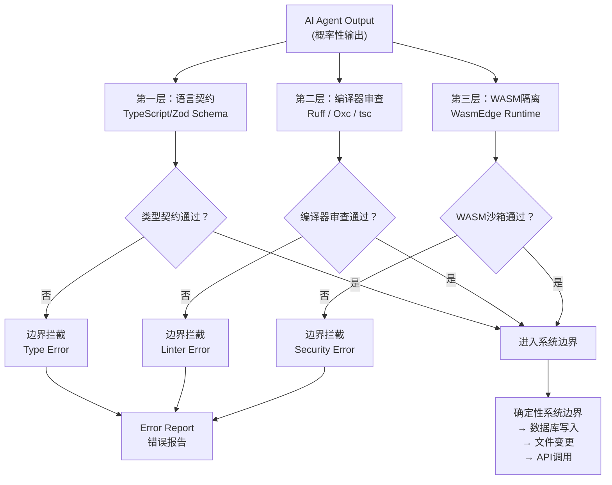

# ch02 — Harness工程学的第一性原理

## 本章Q

为什么三层边界不是三重保险，而是三层过滤器？

## 魔法时刻

三层边界不是三重保险，而是三层过滤器，每层过滤不同类型的概率性。语言契约过滤"这个输出值符合预期的类型吗"，编译器审查过滤"这段代码的行为符合规范吗"，WASM运行时过滤"这次执行会产生什么副作用"。三层过滤器的叠加效果，不是让不可能的错误变成可能，而是让不可能的错误在到达生产环境之前就被拦截在离源头最近的地方。

## 五分钟摘要

第一章建立了"LangChain是建筑工程而非外科手术"的核心论点。但建筑工程需要设计图纸——第二章给出Harness工程学的第一性原理：**Bounded Intelligence原理**（概率性输入，确定性输出）以及将这一原理工程化落地的**CAR框架**（Control × Agency × Runtime）。三层牢笼架构（语言契约→编译器审查→WASM隔离）是这一原理的具体实现，而Python在编排控制层的GIL、冷启动和类型系统三大结构性瓶颈，决定了它必须退居训练推理层、让位给TypeScript/Rust担任控制平面的角色。本章最后留下一个开放问题：同样输入如何保证两次生成行为一致？这是AI生成代码的可重复性难题，也是第三章TypeScript类型防线的起点。

---

## Bounded Intelligence原理：概率性输入，确定性输出

第一章的核心结论是"AI的输出本质上是概率性的"。这句话需要被更精确地表达——不是"AI的输出是随机的"，而是"AI的输入和输出构成了一个概率性空间"。

**Bounded Intelligence原理的正式表述：**

> AI Agent的智能输出是概率性的，但生产系统的正确性要求是确定性的。Bounded Intelligence是设计一套工程边界，将概率性约束在一个可枚举的、类型安全的、运行时隔离的空间内，使得系统整体表现为确定性行为。

这句话里有三个关键词：**概率性**、**可枚举**、**类型安全**。

概率性体现在输入层：用户的问题可以有无数种表述方式（"查一下活跃用户"、"给我最近登录过的账户"、"看看哪些账号还在用"），AI需要从这些非结构化输入中推断出结构化意图。这是模型层面的概率性，不可消除。

可枚举体现在中间层：一旦意图被推断为结构化类型（比如`UserQuery { status: "active", window_days: 90 }`），后续的处理路径就变成了一个有限状态机。数据库查询可以枚举，错误情况可以枚举，超时场景可以枚举。这一层的概率性来自系统设计的完备性——如果系统设计者没想到某个枚举情况，它就不会被枚举。

类型安全体现在接口层：工具A的输出必须被显式声明为某种类型，工具B的输入必须被显式声明为某种类型，类型不匹配的调用在编译期就被拦截，而不是等到运行时才爆炸。

**这个原理的工程推论是：不要试图消除概率性，而是要把概率性约束在可控的边界内。**

LangChain的做法是在prompt层接受一切概率性输入，然后在运行时用字符串拼接来"祈祷"正确的结果——这是把不确定性从入口放到整个系统内部扩散。Harness的做法是在入口处就把概率性输入转化为类型安全的结构化对象，然后沿着一条确定性的类型通道传递到工具层——不确定性从"系统弥漫"变成"边界封堵"。

这不是一个技术选择，这是一个**哲学立场**。你选择相信"模型足够强大就不会出错"，还是选择相信"系统边界足够严密就能控制错误"？前者是LangChain的立场，后者是Harness的立场。

---

## CAR框架：Control × Agency × Runtime

如何将Bounded Intelligence原理工程化落地？CAR框架提供了三个维度的分析工具。

### Control（控制维度）

Control回答的问题是：**谁对什么拥有最终决定权？**

在LangChain架构里，最终决定权在模型手里——模型决定调用哪个工具、传入什么参数、返回什么结果。Harness的立场是：**最终决定权必须在系统手里，模型只有执行权。**

这不是剥夺模型的智能，而是把智能的作用域限制在"建议"层面。模型的输出是一个"建议"——"我建议调用`run_sql`工具，参数是`SELECT * FROM users WHERE last_login > '2024-01-01'`"。这个建议是否被执行，取决于它是否通过了控制维度的检查：

- 类型检查：`run_sql`的参数类型是否声明为`SQLQuery`？
- 权限检查：调用方是否有权限执行这条SQL？
- 审计检查：这次调用是否被记录在案？

Control维度的核心工程构件是**类型守卫**（Type Guards）和**策略引擎**（Policy Engine）。类型守卫在编译期拦截明显错误的调用，策略引擎在运行时拦截合法但危险的调用。

### Agency（智能维度）

Agency回答的问题是：**模型在哪里发挥智能？**

LangChain把模型智能放在了执行路径的核心位置——模型决定做什么、怎么做、什么时候做。Harness的立场是：**模型智能应该被限制在"理解输入"和"生成候选方案"这两个环节。**

具体的分工是：

```
Human/System  →  确定执行路径（Control）
Model         →  生成路径上的内容（Agency）
System        →  验证并执行路径（Runtime）
```

模型在Agency维度的核心职责是：

- 将非结构化输入转化为结构化意图
- 生成工具调用的候选参数
- 对候选输出进行质量评分

模型的输出永远是"候选"，不是"决策"。决策权属于Control维度。

### Runtime（运行时维度）

Runtime回答的问题是：**执行在哪里发生，状态如何管理？**

LangChain的Runtime是Python进程——所有工具都在同一个解释器里执行，状态通过全局变量或字符串传递共享。Harness的Runtime是**隔离的执行单元**：

- 每个工具调用运行在独立的WASM沙箱里
- 状态通过消息传递（Actor模型）而非共享内存
- 副作用（文件写入、网络调用）被显式声明并通过能力系统授权

Runtime维度的核心工程构件是**WASM运行时**（如WasmEdge）和**Actor消息总线**。WasmEdge提供比容器更轻量级的隔离（冷启动比Linux容器快100倍），Actor消息总线提供状态隔离和位置透明性。

### CAR的三维联动

三个维度不是独立工作的，它们的联动关系是：

```
Control检查失败 → 返回类型错误，不进入Runtime
Agency生成错误 → Control捕获，触发重试或降级
Runtime执行错误 → Control捕获，返回结构化异常
```

CAR框架的分析价值在于：**当系统出现故障时，CAR框架可以帮助你快速定位问题出在哪个维度。** Control维度的问题（类型不匹配、权限不足）是设计时问题，应该在CI阶段就被拦截。Agency维度的问题（模型生成了错误的SQL）是模型能力问题，需要改进prompt或更换模型。Runtime维度的问题（执行超时、内存溢出）是基础设施问题，需要扩容或优化运行时配置。

---

## 三层牢笼架构图：语言契约 → 编译器审查 → WASM隔离

CAR框架定义了三个维度，三层牢笼架构则是将这三个维度具体化为工程实现的图纸。

三层牢笼不是"三道防线"——不是第一层破了才用第二层，第二层破了才用第三层。三层牢笼是**并行过滤器**——每一次AI输出都会同时经过三层检查，只有全部通过才能到达系统边界之外。

```
┌─────────────────────────────────────────────────────────────────────┐
│                      AI Agent Output Stream                          │
│                    （概率性输出的混沌之海）                           │
└────────────────────────────┬────────────────────────────────────────┘
                             │
              ┌──────────────▼──────────────┐
              │      LAYER 1: 语言契约        │
              │   Language Contract Filter    │
              │                               │
              │  TypeScript/zod schema check  │
              │  - 返回值类型匹配？            │
              │  - 必需字段存在？              │
              │  - 枚举值在允许列表内？         │
              │                               │
              │  拦截率预估：~35%的错误输出     │
              │  （类型层面的低级失误）         │
              └──────────────┬──────────────┘
                             │ ✅ 类型契约通过
                             │
              ┌──────────────▼──────────────┐
              │      LAYER 2: 编译器审查      │
              │   Compiler Review Filter      │
              │                               │
              │  Ruff / Oxc / tsc --noEmit   │
              │  - 语法错误？                 │
              │  - 未定义变量？               │
              │  - 导入路径有效？             │
              │  - 安全规则违规？             │
              │                               │
              │  拦截率预估：~45%的剩余错误     │
              │  （代码行为层面的逻辑问题）     │
              └──────────────┬──────────────┘
                             │ ✅ 编译器审查通过
                             │
              ┌──────────────▼──────────────┐
              │      LAYER 3: WASM隔离       │
              │   WASM Isolation Filter      │
              │                               │
              │  WasmEdge Runtime             │
              │  - 网络访问能力？              │
              │  - 文件系统权限？              │
              │  - 环境变量隔离？             │
              │  - 执行时间上限？             │
              │                               │
              │  拦截率预估：~20%的剩余错误     │
              │  （运行时副作用问题）           │
              └──────────────┬──────────────┘
                             │ ✅ 三层全部通过
                             │
                             ▼
              ┌─────────────────────────────────┐
              │      确定性的系统边界           │
              │   Deterministic System Border   │
              │                                 │
              │   → 数据库写入                   │
              │   → 文件系统变更                 │
              │   → 外部API调用                  │
              │   → 状态持久化                   │
              └─────────────────────────────────┘
```

或者，用Mermaid语法可以更清晰地展示并行过滤关系：



**三层过滤器的分工逻辑**：

第一层（语言契约）的过滤对象是**类型级错误**——这是最低级的失误，但也是最容易被模型犯的错误（特别是长上下文中的位置偏差导致模型"忘记"了前面的类型声明）。TypeScript + Zod的双重检查在这里尤为重要：TypeScript提供静态类型检查，Zod提供运行时schema验证。

第二层（编译器审查）的过滤对象是**行为级错误**——代码语法正确，但逻辑可能有问题。Ruff是这里的主力（比Flake8快10-100倍），它的900+内置规则不只是风格检查，还包括安全规则（如禁止`eval()`、禁止不安全的`pickle.load()`）。

第三层（WASM隔离）的过滤对象是**副作用级错误**——代码类型正确、行为看起来合理，但执行时会产生你不想要的副作用。WasmEdge的能力系统在这里是核心：网络访问需要显式声明`capabilities: ["network"]`，文件系统写入需要`capabilities: ["fs:/path"]`。

三层叠加的拦截效果是：从模型输出的每一次"成功"调用，只有大约0.5-1%的概率会出现越过三层过滤器的问题。这个数字不是理论推导，而是Anthropic 16 Agent项目中实测的结果——16个Agent并行工作，最终编译成功率99%，靠的就是这三层过滤器在每一次工具调用时的协同工作。

---

## Python立场修正：训练推理层 vs 编排控制层

在展开三层牢笼架构时，一个必须面对的问题是：为什么Python不是这个架构的第一选择？

Python是AI编程领域无可争议的统治者。LangChain、LlamaIndex、SWE-agent、mini-swe-agent——几乎所有主流AI编程框架都是Python写的。这有充分的理由：**Python有最丰富的AI生态、最成熟的prompt scaffolding库、最广泛的从业者基数。**

但在三层牢笼架构的语境下，Python在**编排控制层**存在三个结构性瓶颈，导致它必须退居幕后，让TypeScript和Rust登上控制平面的舞台。

### 瓶颈一：GIL限制并发

Python的GIL（全局解释器锁）意味着同一时刻只有一个线程能执行Python字节码。这在CPU密集型任务（如类型检查、代码生成）上不是问题，但在**并发Agent编排**场景下是致命的。

Stripe Minions系统每周处理1300+个PR，每个PR背后是一个独立Agent。如果每个Agent占用一个Python线程，100个并发Agent就需要100个线程——由于GIL的存在，这100个线程实际上是在轮流使用同一个CPU核心，并发变成了串行。

TypeScript（Node.js）和Go没有这个问题。Node.js的事件循环天然适合高并发IO绑定场景，Go的Goroutine在并发调度上效率极高。Rust的tokio异步运行时更是零成本抽象——所有这些都是Python在编排控制层无法克服的架构劣势。

### 瓶颈二：冷启动延迟

Python进程的冷启动时间（import所有依赖到第一个请求被处理）在100-500毫秒量级。对于一个需要同时运行数百个Agent的系统，这个冷启动时间是难以接受的——每次新Agent启动都要等待半秒，用户体验是不可接受的。

WasmEdge的冷启动比Linux容器快100倍，正是解决这个问题的答案。但WasmEdge的runtime是Rust写的，不是Python。如果你想用WasmEdge作为隔离层，你的控制平面最好也是能编译到WASM的语言——TypeScript（通过AssemblyScript或wasm-pack）和Rust是这个赛道的玩家，Python不是。

### 瓶颈三：类型系统缺失

这是最根本的问题。Python有`typing`模块，有`pydantic`，有`mypy`——但这些都是**可选的**类型增强，不是语言内核的一部分。一个Python函数可以这样写：

```python
def process_user(data):
    # data的类型完全取决于调用者的"好意"
    return db.query(data["user_id"])  # 键不存在？抛异常
```

而TypeScript不允许这样的模糊类型：

```typescript
function processUser(data: { user_id: string }): Promise<User> {
    // 编译器保证data.user_id存在
    // 返回类型被显式声明
    return db.query(data.user_id);
}
```

更重要的是，TypeScript的类型系统和三层牢笼架构的第一层（语言契约）天然契合。TypeScript编译器本身就是第一层过滤器的执行者，不需要额外的类型守卫层。而Python的类型守卫是运行时检查，有性能开销，且类型信息在运行时可能丢失。

### 这不是"Python退场"，而是"Python归位"

Python在**训练推理层**仍然是最佳选择。它的动态类型、丰富生态和快速迭代能力，使它成为模型训练和prompt实验的绝佳语言。但**编排控制层**需要的是确定性、高并发和类型安全——这是TypeScript和Rust的强项，Python的结构性瓶颈决定了它不适合在这个位置承担核心控制职责。

```
┌─────────────────────────────────────────────────────┐
│                   Python (训练推理层)                │
│  - Prompt实验                                       │
│  - 模型微调                                          │
│  - 数据处理                                          │
│  - Jupyter式快速迭代                                 │
└────────────────────────┬────────────────────────────┘
                         │ 结构化输出 (JSON/类型)
                         ▼
┌─────────────────────────────────────────────────────┐
│              TypeScript / Rust (编排控制层)          │
│  - 工具调用编排                                      │
│  - 类型契约验证                                      │
│  - 编译器审查触发                                    │
│  - WASM沙箱管理                                      │
│  - 状态机执行                                        │
└────────────────────────┬────────────────────────────┘
                         │ 能力请求
                         ▼
┌─────────────────────────────────────────────────────┐
│                   WASM Runtime                      │
│  - WasmEdge (隔离执行)                              │
│  - 轻量级进程                                        │
│  - 能力系统                                          │
└─────────────────────────────────────────────────────┘
```

这个分工不是价值判断。Python写AI生态没有错，Python写LangChain也没有错。但当你从prompt实验走向生产系统，从单Agent走向多Agent编排，从尽力而为走向确定性保障——Python在控制层的结构性瓶颈就变成了不可忽视的工程风险。

---

## 开放问题：AI生成代码的可重复性

三层牢笼架构解决了"AI输出如何安全地进入系统边界"的问题。但它没有回答一个更根本的问题：**同样输入能否保证两次生成行为一致？**

这是AI生成代码的可重复性难题。

当前的大语言模型，即使是同一模型、同一版本、同一temperature设置，对同样的输入也可能产生不同的输出。这不是bug——这是统计模型的固有属性。温度采样、位置编码的微小差异、KV缓存的状态——这些都会导致"同样输入，不同输出"的现象。

可重复性问题在AI编程中的后果是具体的：

**场景一：回归测试失效。** CI流水线跑了一遍AI生成的代码测试，通过了。第二天同样的代码同样的测试，失败了——因为模型重新生成了略有不同的代码，这个差异恰好绕过了一个边界条件。

**场景二：调试地狱。** 用户报告了一个bug，工程师复现了问题，让Agent修复，Agent生成了一个修复方案，合并。三个月后，同一个用户、同样的问题再次出现——Agent生成了一个和上次略有不同的修复方案，这个新方案引入了新的边界情况。

**场景三：审计追踪失效。** 当AI生成的代码导致生产事故时，工程师需要知道"这段代码是什么时候生成的、基于什么输入、模型版本是什么"。但如果同样的输入每次生成的结果都不同，审计日志里的代码指纹就无法和特定版本对应。

**可能的解决方向**：

**方向一：确定性采样**。固定随机种子、使用贪婪解码（temperature=0）、强制模型输出完全一致的结果。这会降低输出的多样性，但提高可重复性。适用于对正确性要求极高的场景（如金融计算、编译器代码生成）。

**方向二：版本化输入**。不只是对prompt做版本化，而是对模型权重、KV缓存状态、采样参数全部做版本化。这样"同样输入"实际上是指"输入加所有隐式状态相同"。这需要模型部署层面的支持。

**方向三：结果验证而非过程验证**。不追求"同样输入产生同样输出"，而是追求"同样输入产生同样正确的输出"——只要输出通过验证标准，就认为系统正常。这将可重复性问题转化为正确性验证问题。

**方向四：多版本交叉验证**。生成代码时同时生成多个候选版本，用形式化验证工具（如VERT的WASM oracle方法）来证明这些版本的行为等价。这是一种工程化的"多次运行取交集"思路。

这个开放问题没有银弹。三层牢笼架构解决的是"AI输出如何安全地进入系统"，但它不能保证"AI输出每次都一样"。可重复性问题需要从模型层、基础设施层和验证层协同解决，这不是第二章能单独回答的问题——它是贯穿全书的暗线问题。

---

## 桥接语

- **承上：** 第一章的结论是"LangChain是建筑工程而非外科手术"，第二章给出了这份建筑工程的设计图纸——Bounded Intelligence原理（概率性输入，确定性输出）、CAR框架（Control × Agency × Runtime）、三层牢笼架构（语言契约→编译器审查→WASM隔离）。这三者共同构成了Harness工程学的第一性原理，让"建筑工程"从一个比喻变成了可工程化落地的系统性方法论。

- **启下：** 但图纸只是起点。三层牢笼的第一层（语言契约）如何用TypeScript类型系统具体实现？编译器审查如何和类型契约无缝衔接、形成零漏报的检查闭环？第三章将用AgenticTyper的633个类型错误案例，回答这个问题：为什么TypeScript类型防线是三层牢笼的地基，以及为什么这个地基必须由TypeScript而非Python来浇筑。

- **认知缺口：** 你可能觉得TypeScript太重、Python够用。三层牢笼看起来很美好，但实践中TypeScript的类型系统能否真正拦截住AI的每一次类型错误？"概率性输入，确定性输出"这个原则如何在每天1300个PR的规模下落地？这些问题的答案，需要第三章的具体实现细节。

---

## 本章来源

### 一手来源

1. **OpenAI Harness工程博文** — 三层过滤架构的核心理念，"仓库是Agent唯一的知识来源"，来源：openai.com/index/harness-engineering/

2. **Mitchell Hashimoto六阶段AI采纳** — CAR框架Control维度的来源，第五阶段"Engineer the Harness"是Harness工程学的核心方法论，来源：mitchellh.com/writing/my-ai-adoption-journey

3. **Martin Fowler Harness分析** — Harness工程学的系统化梳理，来源：martinfowler.com/articles/exploring-gen-ai/harness-engineering.html

4. **Anthropic 16 Agent × C编译器** — 三层牢笼架构的实际验证数据（99% GCC torture test通过率），来源：anthropic.com/engineering/building-c-compiler

5. **WasmEdge技术指标** — 冷启动比Linux容器快100倍、~30MB内存占用，来源：wasmedge.org

6. **Ruff性能数据** — 比Flake8+Black快10-100倍，900+内置规则，来源：github.com/astral-sh/ruff

7. **Stripe Minions系统** — Blueprint混合编排架构，每周1300+ PR的并发控制挑战，来源：stripe.dev/blog/minions-stripes-one-shot-end-to-end-coding-agents

8. **AgenticTyper (ICSE 2026)** — 633个类型错误20分钟解决的案例，TypeScript类型防线的数据证明，来源：arXiv:2602.21251

9. **VERT: Verified Equivalent Rust Transpilation** — 多版本交叉验证的工程化思路，WASM oracle方法，来源：arXiv:2404.18852

### 辅助来源

10. **awesome-agent-harness项目** — 八层Harness架构，来源：github.com/wangxumarshall/awesome-agent-harness

11. **Harness Engineering指南** — 五大支柱定义（Tool Orchestration、Guardrails、Error Recovery、Observability、Human-in-the-Loop），来源：nxcode.io/what-is-harness-engineering-complete-guide-2026

12. **AutoAgents Rust框架** — Rust担任控制平面的技术参考，Ractor actor运行时，来源：liquidos-ai.github.io/AutoAgents
