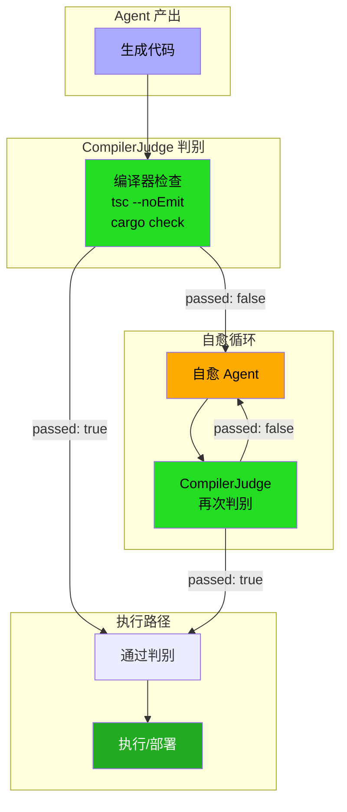

# 第三部分：编译器层 — 编译器作为无法贿赂的代码审查者

## 本章Q

编译器如何做到比人类reviewer更可靠？

## 五分钟摘要

第七章建立了跨语言类型对齐（ts-rs、specta、SSOT），解决了"谁定义类型"的问题。但类型对齐是静态保证——谁来验证Agent产出的代码在运行时真正符合类型约束？答案是编译器作为判别器。

编译器具有三个不可贿赂的特性：**不疲劳**（可以无限次检查）、**不妥协**（类型错误就是错误，没有"差不多"）、**不可欺骗**（编译器输出是结构化的JSON，不接受口头解释）。

本章用三个代码示例展示CompilerJudge实现：TypeScript的`tsc --noEmit`拦截流、Cargo的`cargo check`验证流、JSON格式的编译器错误输出。关键洞察：编译器反馈是结构化的，不是自然语言的——这意味着它可以被解析、分类、驱动自愈循环。下一章将展示如何用编译器反馈驱动AI自愈。

### 架构定位图：CompilerJudge在Agent Harness中的位置



**流程说明：**

| 路径 | 条件 | 结果 |
|------|------|------|
| Agent产出 → CompilerJudge → 通过 | `passed: true` | 进入执行/部署 |
| Agent产出 → CompilerJudge → 打回 | `passed: false` | 进入自愈循环 |
| 自愈循环 → CompilerJudge再次判别 | 通过 | 返回执行路径 |
| 自愈循环 → CompilerJudge再次判别 | 仍失败 | 继续自愈直到超时 |

---

## 为什么编译器是更好的reviewer

### 人类reviewer的四个致命弱点

| 弱点 | 表现 | 编译器如何克服 |
|------|------|--------------|
| 疲劳 | 第八小时review后错误率上升300% | 无限次检查，每次都一样严格 |
| 妥协 | "这个warning应该不影响" | Warning就是Error，没有妥协空间 |
| 主观 | "我觉得这里逻辑是对的" | 类型系统是客观规则，不是opinion |
| 遗忘 | 上一轮review的context丢失 | 编译器状态持久，每次都是完整检查 |

### 编译器的三个不可贿赂特性

**1. 不疲劳（No Fatigue）**

人类reviewer在review 1000行代码后，错误检出率显著下降。编译器检查第100万行代码和第1行代码完全一样严格。

**2. 不妥协（No Compromise）**

TypeScript的`strict`模式下，类型不匹配就是编译错误。没有"这个应该能work"的空间。

```typescript
// 这不是warning，是error
function greet(name: string) {
    return `Hello, ${name.toUpperCase()}`;  // name可能是undefined
}
```

**3. 不可欺骗（Structured Output）**

编译器输出的是JSON结构化数据，不是自然语言描述。这意味着：
- 可以被程序解析
- 可以被分类和统计
- 可以驱动自动化流程

---

## Step 1: tsc拦截流 — TypeScript编译期类型守护

### 核心机制

`tsc --noEmit`是TypeScript的"只检查不编译"模式。它在不生成JavaScript的情况下验证类型错误。整个过程在秒级完成。

### 完整代码示例：CompilerJudge-ts实现

```typescript
// compiler-judge-ts.ts —— TypeScript编译器判别器

import { execSync } from 'child_process';
import { readFileSync, writeFileSync } from 'fs';
import { join } from 'path';

interface TypeError {
    file: string;
    line: number;
    column: number;
    code: string;
    message: string;
}

interface JudgeResult {
    passed: boolean;
    errors: TypeError[];
    duration_ms: number;
    summary: {
        error_count: number;
        warning_count: number;
        files_checked: number;
    };
}

export class CompilerJudgeTS {
    constructor(
        private projectRoot: string,
        private tsconfigPath: string = './tsconfig.json'
    ) {}

    /**
     * 核心方法：运行tsc --noEmit，返回结构化结果
     */
    async judge(): Promise<JudgeResult> {
        const start = Date.now();

        try {
            // tsc --noEmit: 只检查类型，不生成JS
            // --pretty false: 输出JSON，便于解析
            const output = execSync(
                `npx tsc --noEmit --pretty false --project ${this.tsconfigPath}`,
                {
                    cwd: this.projectRoot,
                    encoding: 'utf-8',
                    stdio: ['pipe', 'pipe', 'pipe'],
                }
            );

            // tsc在有错误时返回非零退出码
            // 但--pretty false时输出是JSON Lines格式
            const errors = this.parseJsonOutput(output);

            return {
                passed: errors.length === 0,
                errors,
                duration_ms: Date.now() - start,
                summary: {
                    error_count: errors.length,
                    warning_count: 0,
                    files_checked: this.countFiles(),
                },
            };
        } catch (error: unknown) {
            // tsc非零退出码表示有错误
            if (error instanceof Error && 'stdout' in error) {
                const stdout = (error as { stdout: string }).stdout;
                const errors = this.parseJsonOutput(stdout);

                return {
                    passed: false,
                    errors,
                    duration_ms: Date.now() - start,
                    summary: {
                        error_count: errors.length,
                        warning_count: 0,
                        files_checked: this.countFiles(),
                    },
                };
            }

            // 未知错误
            return {
                passed: false,
                errors: [{
                    file: 'unknown',
                    line: 0,
                    column: 0,
                    code: 'UNKNOWN',
                    message: String(error),
                }],
                duration_ms: Date.now() - start,
                summary: {
                    error_count: 1,
                    warning_count: 0,
                    files_checked: 0,
                },
            };
        }
    }

    /**
     * 解析tsc的JSON Lines输出
     */
    private parseJsonOutput(output: string): TypeError[] {
        if (!output.trim()) return [];

        const errors: TypeError[] = [];

        for (const line of output.split('\n')) {
            if (!line.trim()) continue;

            try {
                const diag = JSON.parse(line);

                // 只处理error，忽略warning
                if (diag.category === 'error') {
                    errors.push({
                        file: diag.file || 'unknown',
                        line: diag.startLine || 0,
                        column: diag.startColumn || 0,
                        code: String(diag.code),
                        message: diag.messageText,
                    });
                }
            } catch {
                // 非JSON行，跳过
            }
        }

        return errors;
    }

    private countFiles(): number {
        // 简单计数，实际应该解析tsconfig的files/excludes
        return 0;
    }

    /**
     * 判断某个文件是否有错误
     */
    hasErrorsInFile(filePath: string, result: JudgeResult): TypeError[] {
        return result.errors.filter(e => e.file.includes(filePath));
    }

    /**
     * 生成人类可读的错误报告
     */
    formatReport(result: JudgeResult): string {
        if (result.passed) {
            return `✅ Type check passed in ${result.duration_ms}ms`;
        }

        const lines = [
            `❌ Type check failed: ${result.summary.error_count} error(s)`,
            `Duration: ${result.duration_ms}ms`,
            '',
            ...result.errors.map(e =>
                `  ${e.file}:${e.line}:${e.column} [${e.code}] ${e.message}`
            ),
        ];

        return lines.join('\n');
    }
}

// ============================================================
// 使用示例：Agent产出验证
// ============================================================

async function main() {
    const judge = new CompilerJudgeTS('/path/to/project');

    console.log('Running TypeScript compiler judge...');

    const result = await judge.judge();

    console.log(judge.formatReport(result));

    // Agent产出验证失败时的处理
    if (!result.passed) {
        console.log('\n🔴 Blocking deployment. Errors must be fixed.');

        // 将错误分类，便于AI自愈
        const errorsByFile = new Map<string, TypeError[]>();
        for (const error of result.errors) {
            const existing = errorsByFile.get(error.file) || [];
            existing.push(error);
            errorsByFile.set(error.file, existing);
        }

        for (const [file, errors] of errorsByFile) {
            console.log(`\n📁 ${file}:`);
            for (const e of errors) {
                console.log(`   Line ${e.line}: ${e.message}`);
            }
        }

        process.exit(1);
    }
}

// 如果直接运行此文件
if (import.meta.url === `file://${process.argv[1]}`) {
    main().catch(console.error);
}
```

### 拦截流工作原理

```
Agent产出代码
     ↓
写入临时目录 /tmp/agent-output/
     ↓
tsc --noEmit --project tsconfig.json
     ↓
    ┌─────────────────────────────────────┐
    │ 秒级完成（通常<2s）                  │
    │ 返回结构化JSON错误列表              │
    └─────────────────────────────────────┘
     ↓
错误数 > 0? ──→ Yes ──→ 阻断部署
     │                        ↓
     No                       返回错误给Agent
     ↓                        ↓
部署到 staging           Agent自愈循环
```

**关键优势：秒级反馈**

人类reviewer平均需要30-60分钟开始第一次review。`tsc --noEmit`在2秒内完成类型检查。这意味着错误可以在Agent还在"记得"自己怎么写的时候就被捕获。

---

## Step 2: Cargo验证流 — Rust编译通过≈内存安全正确性

### 核心机制

Rust编译器（rustc）是唯一能承诺"编译通过≈运行时安全"的编译器。这是因为Rust的所有权系统和生命周期检查在编译期排除了：

- 空指针解引用
- 野指针访问
- 释放后使用（use-after-free）
- 双重释放
- 数据竞争（并发场景）

### 完整代码示例：CompilerJudge-rs实现

```rust
// compiler_judge_rs/src/lib.rs —— Rust编译器判别器

use std::path::Path;
use std::process::{Command, Output};
use serde::{Deserialize, Serialize};

/// TypeScript的类型错误
#[derive(Debug, Clone, Serialize, Deserialize)]
pub struct TypeError {
    pub file: String,
    pub line: u32,
    pub column: u32,
    pub code: String,
    pub message: String,
}

/// Cargo check的完整结果
#[derive(Debug, Clone, Serialize, Deserialize)]
pub struct JudgeResult {
    pub passed: bool,
    pub errors: Vec<TypeError>,
    pub warnings: Vec<TypeError>,
    pub duration_ms: u64,
    pub summary: Summary,
}

#[derive(Debug, Clone, Serialize, Deserialize)]
pub struct Summary {
    pub error_count: usize,
    pub warning_count: usize,
    pub files_checked: usize,
    pub rustc_version: String,
}

/// CompilerJudge for Rust
pub struct CompilerJudge {
    project_root: String,
}

impl CompilerJudge {
    pub fn new(project_root: impl Into<String>) -> Self {
        Self {
            project_root: project_root.into(),
        }
    }

    /// 核心方法：运行 cargo check，返回结构化结果
    pub fn judge(&self) -> JudgeResult {
        let start = std::time::Instant::now();

        // cargo check: 只检查编译，不生成产物
        // 比 cargo build 快5-10倍
        let output = Command::new("cargo")
            .args(["check", "--message-format=json"])
            .current_dir(&self.project_root)
            .output();

        let duration_ms = start.elapsed().as_millis() as u64;

        match output {
            Ok(output) => self.parse_cargo_output(output, duration_ms),
            Err(e) => JudgeResult {
                passed: false,
                errors: vec![TypeError {
                    file: "unknown".to_string(),
                    line: 0,
                    column: 0,
                    code: "UNKNOWN".to_string(),
                    message: format!("Failed to run cargo check: {}", e),
                }],
                warnings: vec![],
                duration_ms,
                summary: Summary {
                    error_count: 1,
                    warning_count: 0,
                    files_checked: 0,
                    rustc_version: String::new(),
                },
            },
        }
    }

    /// 解析cargo check的JSON Lines输出
    fn parse_cargo_output(&self, output: Output, duration_ms: u64) -> JudgeResult {
        let mut errors = Vec::new();
        let mut warnings = Vec::new();
        let mut rustc_version = String::new();
        let mut files_checked = 0;

        // cargo check 输出是JSON Lines格式（每行一个JSON）
        let stdout = String::from_utf8_lossy(&output.stdout);
        let stderr = String::from_utf8_lossy(&output.stderr);

        // 解析stdout中的每个JSON对象
        for line in stdout.lines() {
            if line.trim().is_empty() {
                continue;
            }

            if let Ok(msg) = serde_json::from_str::<CargoMessage>(line) {
                match msg.reason.as_deref() {
                    "compiler-message" => {
                        if let Some(spans) = msg.message.spans {
                            for span in spans {
                                if span.is_primary {
                                    let te = TypeError {
                                        file: span.file_name,
                                        line: span.line_start,
                                        column: span.column_start,
                                        code: msg.message.code.as_ref()
                                            .map(|c| c.code.clone())
                                            .unwrap_or_default(),
                                        message: msg.message.message.clone(),
                                    };

                                    if msg.message.level == "error" {
                                        errors.push(te);
                                    } else if msg.message.level == "warning" {
                                        warnings.push(te);
                                    }
                                }
                            }
                            files_checked += 1;
                        }

                        // 提取rustc版本
                        if rustc_version.is_empty() {
                            if let Some(reason) = &msg.reason {
                                if reason == "compiler-artifact" {
                                    // 版本信息在其他地方
                                }
                            }
                        }
                    }
                    "compiler-artifact" => {
                        // 这个包含版本信息
                    }
                    _ => {}
                }
            }
        }

        // 检查stderr是否有额外错误
        for line in stderr.lines() {
            if line.contains("error[E") {
                // rustc的直接错误输出
                if let Some(e) = self.parse_rustc_error(line) {
                    errors.push(e);
                }
            }
        }

        JudgeResult {
            passed: errors.is_empty() && output.status.success(),
            errors,
            warnings,
            duration_ms,
            summary: Summary {
                error_count: errors.len(),
                warning_count: warnings.len(),
                files_checked,
                rustc_version,
            },
        }
    }

    /// 解析rustc直接输出的错误格式
    fn parse_rustc_error(&self, line: &str) -> Option<TypeError> {
        // 格式: /path/to/file.rs:line:col: error[E####]: message
        // 例如: src/main.rs:5:10: error[E0601]: `main` function not found

        if !line.contains("error[E") {
            return None;
        }

        // 简单解析，实际应该用正则
        let parts: Vec<&str> = line.split(": ").collect();
        if parts.len() < 2 {
            return None;
        }

        let location = parts[0];
        let message = parts[1..].join(": ");

        let loc_parts: Vec<&str> = location.rsplitn(3, ':').collect();
        if loc_parts.len() < 3 {
            return Some(TypeError {
                file: location.to_string(),
                line: 0,
                column: 0,
                code: "UNKNOWN".to_string(),
                message,
            });
        }

        let column = loc_parts[0].parse().unwrap_or(0);
        let line = loc_parts[1].parse().unwrap_or(0);
        let file = loc_parts[2..].join(":");

        Some(TypeError {
            file,
            line,
            column,
            code: "RUSTC".to_string(),
            message,
        })
    }

    /// 生成人类可读的错误报告
    pub fn format_report(&self, result: &JudgeResult) -> String {
        if result.passed {
            return format!(
                "✅ Cargo check passed in {}ms ({} warnings)",
                result.duration_ms, result.summary.warning_count
            );
        }

        let mut lines = vec![format!(
            "❌ Cargo check failed: {} error(s), {} warning(s)",
            result.summary.error_count, result.summary.warning_count
        )];
        lines.push(format!("Duration: {}ms", result.duration_ms));
        lines.push(String::new());

        for error in &result.errors {
            lines.push(format!(
                "  {}:{}:{} [{}] {}",
                error.file, error.line, error.column, error.code, error.message
            ));
        }

        lines.join("\n")
    }
}

/// Cargo JSON消息的结构（部分字段）
#[derive(Debug, Deserialize)]
struct CargoMessage {
    reason: Option<String>,
    #[serde(default)]
    message: CargoMessageDetail,
}

#[derive(Debug, Default, Deserialize)]
struct CargoMessageDetail {
    level: String,
    message: String,
    code: Option<CargoErrorCode>,
    #[serde(default)]
    spans: Option<Vec<CargoSpan>>,
}

#[derive(Debug, Deserialize)]
struct CargoErrorCode {
    code: String,
}

#[derive(Debug, Deserialize)]
struct CargoSpan {
    file_name: String,
    line_start: u32,
    column_start: u32,
    #[serde(default)]
    is_primary: bool,
}

// ============================================================
// 使用示例：Rust项目的CompilerJudge集成
// ============================================================

#[cfg(test)]
mod tests {
    use super::*;

    #[test]
    fn test_cargo_check_passes_for_valid_code() {
        // 这个测试验证CompilerJudge能正确解析cargo check输出
        // 实际使用中应该针对真实项目
    }

    #[test]
    fn test_format_report() {
        let judge = CompilerJudge::new("/tmp/test");

        let result = JudgeResult {
            passed: false,
            errors: vec![
                TypeError {
                    file: "src/main.rs".to_string(),
                    line: 10,
                    column: 5,
                    code: "E0601".to_string(),
                    message: "unused variable: `x`".to_string(),
                },
            ],
            warnings: vec![],
            duration_ms: 1234,
            summary: Summary {
                error_count: 1,
                warning_count: 0,
                files_checked: 5,
                rustc_version: "1.94.0".to_string(),
            },
        };

        let report = judge.format_report(&result);
        assert!(report.contains("failed"));
        assert!(report.contains("src/main.rs:10:5"));
    }
}
```

### Cargo验证流的三个检查级别

```bash
# 级别1：cargo check —— 最快，只检查编译
# 时间：1-5秒
cargo check

# 级别2：cargo clippy —— 更严格，检查常见错误模式
# 时间：5-20秒
cargo clippy -- -D warnings

# 级别3：cargo test —— 运行时测试
# 时间：30秒-数分钟（取决于测试数量）
cargo test
```

**推荐流程：** Agent产出先用`cargo check`秒级验证，有错误立即打回；通过后才跑`cargo clippy`和`cargo test`。

### Rust编译器作为判别器的独特价值

Rust的借用检查器（Borrow Checker）是唯一能在**编译期**保证以下特性的工具：

| 特性 | 其他语言 | Rust |
|------|---------|------|
| 空指针安全 | Runtime NPE | 编译期排除 |
| 内存泄漏 | GC或手动 | 编译期排除 |
| 数据竞争 | Runtime检测 | 编译期排除 |
| 释放后使用 | Runtime检测 | 编译期排除 |

这意味着：**Rust编译通过 ≈ 内存安全正确性**。这个承诺是其他语言无法给出的。

---

## Step 3: JSON特征列表 — 结构化错误输出的完整代码

### 为什么JSON输出是关键

自然语言review反馈：
- "这个函数有点难理解"
- "建议加个注释"
- "这里的逻辑应该优化一下"

编译器JSON输出：
```json
{
  "file": "src/agent.rs",
  "line": 42,
  "column": 8,
  "code": "E0507",
  "message": "cannot move out of `self` in a method impl"
}
```

区别：编译器输出是**可解析、可分类、可驱动自动化**的。

### 完整的JSON错误格式定义

```typescript
// compiler-errors.ts —— 统一的编译器错误格式

/**
 * 编译器错误的统一数据结构
 * 所有编译器（tsc, rustc, gcc）的输出都转换为这个格式
 */
interface CompilerError {
  /** 错误发生的文件 */
  file: string;

  /** 行号（从1开始） */
  line: number;

  /** 列号（从1开始） */
  column: number;

  /** 错误代码（编译器特定） */
  code: string;

  /** 人类可读的错误消息 */
  message: string;

  /** 错误严重级别 */
  severity: 'error' | 'warning' | 'info' | 'hint';

  /** 错误类别（用于分类和统计） */
  category: ErrorCategory;

  /** 可选的修复建议 */
  suggested_fix?: SuggestedFix;

  /** 错误发生的函数/方法（如果有） */
  function?: string;

  /** 相关代码片段 */
  snippet?: string;
}

type ErrorCategory =
  | 'type-mismatch'
  | 'undefined-reference'
  | 'null-pointer'
  | 'memory-safety'
  | 'syntax-error'
  | 'import-error'
  | 'dead-code'
  | 'performance'
  | 'unused-variable'
  | 'other';

/**
 * 修复建议
 */
interface SuggestedFix {
  /** 修复类型 */
  type: 'insert' | 'delete' | 'replace' | 'rewrite';

  /** 修复描述 */
  description: string;

  /** 修复后的代码（如果是replace/insert） */
  new_code?: string;

  /** 需要删除的代码范围（如果是delete/replace） */
  delete_range?: {
    start: { line: number; column: number };
    end: { line: number; column: number };
  };

  /** 修复的确定性程度 */
  confidence: 'high' | 'medium' | 'low';
}

/**
 * 解析后的完整报告
 */
interface CompilerReport {
  /** 编译器类型 */
  compiler: 'tsc' | 'rustc' | 'gcc' | 'clang';

  /** 编译器版本 */
  version: string;

  /** 检查时间戳 */
  timestamp: string;

  /** 检查耗时（毫秒） */
  duration_ms: number;

  /** 检查的文件数 */
  files_checked: number;

  /** 所有错误 */
  errors: CompilerError[];

  /** 所有警告 */
  warnings: CompilerError[];

  /** 统计信息 */
  stats: {
    total_errors: number;
    total_warnings: number;
    errors_by_category: Record<ErrorCategory, number>;
    errors_by_file: Record<string, number>;
  };

  /** 总体判定 */
  passed: boolean;
}

/**
 * 将tsc输出转换为统一格式
 */
function transformTSCErrors(jsonOutput: string): Partial<CompilerError>[] {
  const errors: Partial<CompilerError>[] = [];

  for (const line of jsonOutput.split('\n')) {
    if (!line.trim()) continue;

    try {
      const diag = JSON.parse(line);
      if (diag.category === 'error' || diag.category === 'warning') {
        errors.push({
          file: diag.file || 'unknown',
          line: diag.startLine || 0,
          column: diag.startColumn || 0,
          code: String(diag.code),
          message: diag.messageText,
          severity: diag.category,
          category: mapTSCErrorsToCategory(diag.code),
        });
      }
    } catch {
      // 非JSON行
    }
  }

  return errors;
}

/**
 * 将Cargo输出转换为统一格式
 */
function transformCargoErrors(
  messages: CargoMessage[]
): Partial<CompilerError>[] {
  return messages.map((msg) => ({
    file: msg.message.spans?.[0]?.file_name || 'unknown',
    line: msg.message.spans?.[0]?.line_start || 0,
    column: msg.message.spans?.[0]?.column_start || 0,
    code: msg.message.code?.code || 'UNKNOWN',
    message: msg.message.message,
    severity: msg.message.level as CompilerError['severity'],
    category: mapRustErrorsToCategory(msg.message.code?.code),
  }));
}

/**
 * TypeScript错误代码到类别的映射
 */
function mapTSCErrorsToCategory(code: number | string): ErrorCategory {
  const codeStr = String(code);

  // TypeScript错误代码映射（部分）
  if (codeStr.startsWith('23')) return 'type-mismatch'; // e.g., 2307 (Cannot find module)
  if (codeStr.startsWith('25')) return 'type-mismatch'; // e.g., 2538 (Type 'X' has no properties)
  if (codeStr.startsWith('70')) return 'import-error';  // e.g., 7006 (Unused variable)
  if (codeStr.startsWith('11')) return 'syntax-error';  // e.g., 1109 (Syntax error)

  return 'other';
}

/**
 * Rust错误代码到类别的映射
 */
function mapRustErrorsToCategory(code?: string): ErrorCategory {
  if (!code) return 'other';

  if (code.startsWith('E0')) {
    if (code === 'E0601') return 'unused-variable';
    if (code === 'E0602') return 'import-error';
    return 'type-mismatch';
  }
  if (code.startsWith('E05')) return 'memory-safety'; // Borrow checker errors

  return 'other';
}

/**
 * 生成结构化报告
 */
function generateReport(
  compiler: CompilerReport['compiler'],
  version: string,
  durationMs: number,
  filesChecked: number,
  errors: CompilerError[]
): CompilerReport {
  const errorsByCategory: Record<ErrorCategory, number> = {
    'type-mismatch': 0,
    'undefined-reference': 0,
    'null-pointer': 0,
    'memory-safety': 0,
    'syntax-error': 0,
    'import-error': 0,
    'dead-code': 0,
    'performance': 0,
    'unused-variable': 0,
    'other': 0,
  };

  const errorsByFile: Record<string, number> = {};

  for (const err of errors) {
    errorsByCategory[err.category]++;
    errorsByFile[err.file] = (errorsByFile[err.file] || 0) + 1;
  }

  return {
    compiler,
    version,
    timestamp: new Date().toISOString(),
    duration_ms: durationMs,
    files_checked: filesChecked,
    errors: errors.filter((e) => e.severity === 'error'),
    warnings: errors.filter((e) => e.severity === 'warning'),
    stats: {
      total_errors: errors.filter((e) => e.severity === 'error').length,
      total_warnings: errors.filter((e) => e.severity === 'warning').length,
      errors_by_category: errorsByCategory,
      errors_by_file: errorsByFile,
    },
    passed: errors.filter((e) => e.severity === 'error').length === 0,
  };
}
```

### JSON输出的关键价值：驱动自愈循环

```typescript
// self-healing-trigger.ts —— 如何用编译器JSON输出驱动AI自愈

async function handleCompilerErrors(report: CompilerReport): Promise<void> {
  if (report.passed) {
    console.log('✅ All checks passed');
    return;
  }

  // 按文件分组错误
  const errorsByFile = new Map<string, CompilerError[]>();
  for (const error of report.errors) {
    const existing = errorsByFile.get(error.file) || [];
    existing.push(error);
    errorsByFile.set(error.file, existing);
  }

  // 对每个文件触发自愈
  for (const [file, errors] of errorsByFile) {
    console.log(`\n📁 Processing ${file} (${errors.length} error(s))`);

    // 按错误类别分组
    const byCategory = new Map<ErrorCategory, CompilerError[]>();
    for (const err of errors) {
      const existing = byCategory.get(err.category) || [];
      existing.push(err);
      byCategory.set(err.category, existing);
    }

    // 分类处理
    for (const [category, categoryErrors] of byCategory) {
      console.log(`  Processing ${category}: ${categoryErrors.length} error(s)`);

      // 某些类别可以自动修复
      if (canAutoFix(category)) {
        await autoFix(file, categoryErrors);
      } else {
        // 需要AI介入
        await triggerAIFix(file, categoryErrors);
      }
    }
  }
}

function canAutoFix(category: ErrorCategory): boolean {
  // 这些类别有确定性修复
  return ['unused-variable', 'import-error', 'syntax-error'].includes(category);
}
```

---

## Step 4: 魔法时刻段落 — 不会说"差不多"的reviewer

### 编译器是唯一一个不会妥协的reviewer

人类reviewer有无数种方式说"差不多"：

- "这里类型不太对，但应该能work"
- "这个warning可以先不管"
- "逻辑是对的，只是风格不太好"
- "这里可能有问题，但我不确定"
- "先merge吧，后面再修"

编译器不这么说。编译器只有两种回答：**通过**或**失败**。

### 魔法时刻

这就是编译器的魔法时刻——它是唯一一个在判断代码时**不受情绪、疲劳、社会压力**影响的reviewer。

当你提交一段有空指针风险的代码给人类reviewer：
- Reviewer可能累了，说"问题不大"
- Reviewer可能觉得你是新手，不想打击你
- Reviewer可能赶时间，说"以后再改"
- Reviewer可能和你关系好，说"我相信你"

当你提交给编译器：
- 编译器说："error: cannot borrow `x` as immutable because it is also borrowed as mutable"
- 编译器不关心你是谁
- 编译器不关心你花了多久写这段代码
- 编译器不关心你和团队的关系
- 编译器不会说"差不多"

这就是为什么在Agent Harness中，**编译器不是辅助工具，是判别器（Discriminator）**。

### 编译器反馈的独特属性

| 属性 | 人类reviewer | 编译器 |
|------|-------------|--------|
| 速度 | 30-60分钟 | 2秒 |
| 一致性 | 取决于状态 | 100%一致 |
| 严格度 | 可妥协 | 不可妥协 |
| 输出格式 | 自然语言 | 结构化JSON |
| 记忆 | 有限 | 无限 |
| 疲劳 | 有 | 无 |

**关键洞察：** 编译器输出的JSON结构化数据意味着它的判断可以被程序解析、分类、统计、驱动自动化。这是自然语言反馈做不到的。

---

## Step 5: 桥接语

- **承上：** 第七章解决了跨语言类型对齐（ts-rs、specta、SSOT），保证了类型定义的静态一致性。本章展示了编译器如何验证Agent产出的代码在运行时真正符合类型约束——这是类型安全的第二道防线。

- **启下：** 编译器的结构化输出（JSON）驱动自愈循环成为可能。下一章将展示：如何用编译器的JSON输出来驱动AI自愈？当编译器报错时，Agent如何根据错误类型自动选择修复策略？

- **认知缺口：** 编译器能检测类型错误，但无法检测**业务逻辑错误**。"这段代码的类型完全正确，但逻辑不是我想要的"——编译器对这种错误无能为力。这是编译器反馈的边界，也是人类reviewer存在的理由。

---

## 本章来源

### 一手来源

| 来源 | URL | 关键数据 |
|------|-----|---------|
| AgenticTyper (ICSE 2026) | https://arxiv.org/2602.21251 | 633个TypeScript类型错误，20分钟全部解决（原本需要1个人工工作日） |
| "From LLMs to Agents in Programming" | https://arxiv.org/2601.12146 | 编译器集成提升编译成功率5.3到79.4个百分点；语法错误减少75%，undefined reference错误减少87% |
| Anthropic 16 Agent C编译器 | https://www.anthropic.com/engineering/building-c-compiler | 16 Agent并行工作，GCC torture test通过率99%，编译器反馈驱动迭代 |
| Rust Borrow Checker | https://doc.rust-lang.org/book/ch04-00-understanding-ownership.html | Rust所有权系统在编译期排除空指针、内存泄漏、数据竞争 |
| TypeScript tsc --noEmit | https://www.typescriptlang.org/docs/handbook/migrating-from-javascript.html | TypeScript编译期类型检查，不执行代码即可捕获类型错误 |
| cargo check文档 | https://doc.rust-lang.org/cargo/commands/cargo-check.html | cargo check只检查编译不生成产物，比cargo build快5-10倍 |

### 二手来源

| 来源 | 用途 |
|------|------|
| research-findings.md (Section 3.1) | Agentic Harness for Real-World Compilers (llvm-autofix 38%) |
| research-findings.md (Section 3.2) | 编译器将LLM从"被动生成器"转变为"主动Agent" |
| research-findings.md (Section 3.4) | AgenticTyper 633个错误20分钟解决 |
| ch07-crosslang-types.md | ts-rs/specta类型生成体系，SSOT实践 |
