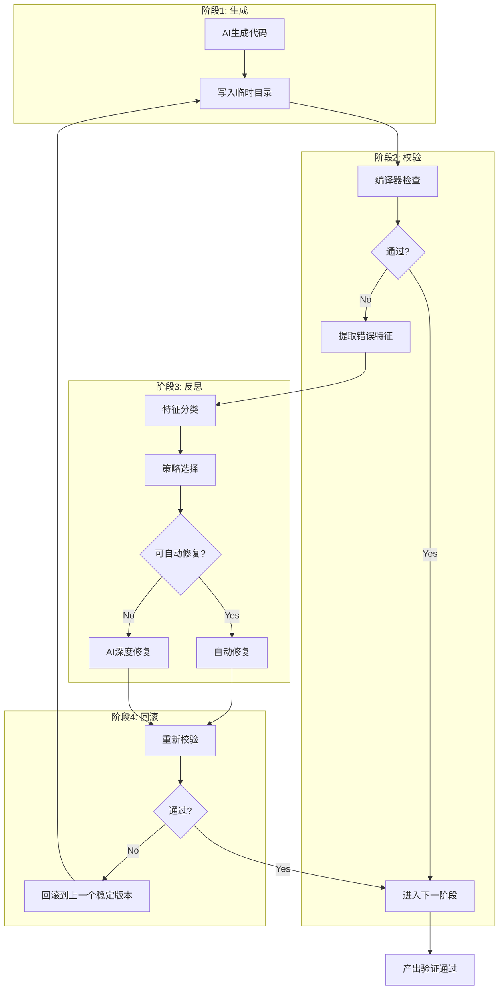

# ch09 — 编译器反馈回路设计：让错误驱动自愈

## 本章Q

如何让编译器错误驱动AI自愈？

## 五分钟摘要

第八章建立了"编译器作为判别器"的概念——编译器输出的结构化JSON是不可贿赂的判决。但判别器只是反馈回路的一半。另一半是：**闭环**。

反馈回路的闭环意味着：编译器报错 → AI分析错误特征 → AI生成修复方案 → 编译器重新校验 → 通过则进入下一阶段，失败则继续迭代。

关键洞察：**编译器反馈不是"错误消息"，而是"损失函数的梯度"**。AI修正错误，本质上是在梯度下降。反馈回路的质量取决于：错误特征提取的精度。本章用三个代码示例展示FeedbackLoop实现：特征提取器、PID控制器、自愈触发器。

---

## Step 1: 反馈回路架构图 — 生成→校验→反思→回滚流程

### 反馈回路的本质

反馈回路不是"写代码→报错→修代码"的简单循环。真正的反馈回路有四个明确阶段，每个阶段都有明确的输入输出和终止条件。

### Mermaid架构图



### ASCII流程图

```
┌─────────────────────────────────────────────────────────────────┐
│                    编译器反馈回路完整流程                         │
└─────────────────────────────────────────────────────────────────┘

    ┌──────────┐     ┌──────────┐     ┌──────────┐     ┌──────────┐
    │  生成    │ ──▶ │  校验    │ ──▶ │  反思    │ ──▶ │  回滚    │
    │ Generate │     │ Validate │     │ Reflect  │     │ Rollback │
    └──────────┘     └──────────┘     └──────────┘     └──────────┘
         ▲                                                 │
         │                                                 │
         └─────────────────────────────────────────────────┘
                          失败时返回

详细阶段：

GENERATE ─────────────
│
└─ AI生成候选代码
└─ 写入临时目录 /tmp/agent-output/
└─ 记录版本号

VALIDATE ────────────
│
├─ 编译器检查（tsc --noEmit / cargo check）
├─ 解析JSON输出
├─ 提取错误特征
└─ 判定：passed / failed

REFLECT ─────────────
│
├─ 错误分类（type-mismatch / null-pointer / syntax-error）
├─ 策略选择：
│   ├─ 高置信度自动修复（unused-variable, import-error）
│   └─ 需要AI介入（memory-safety, logic-error）
└─ 执行修复

ROLLBACK ─────────────
│
├─ 重新校验
├─ 通过 → 进入下一阶段
└─ 失败 → 回滚到上一个稳定版本
```

### 反馈回路的三种模式

```typescript
// feedback-modes.ts —— 三种反馈回路模式

/**
 * 反馈回路的三种收敛模式
 */
enum FeedbackMode {
    /** 快速收敛：每轮修正一个错误，适合简单错误 */
    SINGLE = "single",

    /** 批量收敛：每轮修正所有同类错误 */
    BATCH = "batch",

    /** 深度收敛：每轮修正所有错误，但有最大迭代限制 */
    DEEP = "deep",
}

/**
 * 反馈回路配置
 */
interface FeedbackLoopConfig {
    /** 反馈模式 */
    mode: FeedbackMode;

    /** 最大迭代次数 */
    maxIterations: number;

    /** 单轮超时（毫秒） */
    timeoutMs: number;

    /** 错误置信度阈值：低于此值不自动修复 */
    autoFixThreshold: number;

    /** 启用回滚机制 */
    enableRollback: boolean;
}

/**
 * 推荐的回路配置
 */
const RECOMMENDED_CONFIGS: Record<FeedbackMode, FeedbackLoopConfig> = {
    [FeedbackMode.SINGLE]: {
        mode: FeedbackMode.SINGLE,
        maxIterations: 10,
        timeoutMs: 30000,
        autoFixThreshold: 0.9,
        enableRollback: true,
    },
    [FeedbackMode.BATCH]: {
        mode: FeedbackMode.BATCH,
        maxIterations: 5,
        timeoutMs: 60000,
        autoFixThreshold: 0.8,
        enableRollback: true,
    },
    [FeedbackMode.DEEP]: {
        mode: FeedbackMode.DEEP,
        maxIterations: 3,
        timeoutMs: 120000,
        autoFixThreshold: 0.7,
        enableRollback: true,
    },
};
```

---

## Step 2: JSON特征列表代码 — 编译器输出 → 结构化特征

### 特征提取是反馈回路的核心

编译器输出的原始JSON只是原材料。特征提取是将原材料加工成"梯度向量"的过程——告诉AI具体该往哪个方向修正。

### 完整的特征提取器实现

```typescript
// error-feature-extractor.ts —— 编译器输出 → 结构化特征

import { CompilerError, ErrorCategory } from './compiler-errors';

/**
 * 错误特征向量 —— 驱动AI修复的"梯度"
 */
interface ErrorFeatureVector {
    /** 错误ID */
    id: string;

    /** 原始错误 */
    raw: CompilerError;

    /** 特征维度 */
    features: {
        /** 错误严重度 [0, 1] */
        severity: number;

        /** 修复确定性 [0, 1] */
        fixConfidence: number;

        /** 影响范围（文件数） */
        scope: number;

        /** 是否关键路径错误 */
        isCriticalPath: boolean;

        /** 错误根因类型 */
        rootCause: RootCauseType;

        /** 修复策略 */
        strategy: FixStrategy;
    };

    /** 可读的修复提示 */
    hint: string;

    /** 相关错误ID（可能是同一根因） */
    relatedErrors: string[];
}

/**
 * 根因类型
 */
type RootCauseType =
    | 'missing-type-annotation'      // 缺少类型注解
    | 'wrong-type-assignment'        // 类型赋值错误
    | 'null-pointer-deref'           // 空指针解引用
    | 'import-not-found'             // 导入未找到
    | 'ownership-violation'          // 所有权违规
    | 'lifetime-mismatch'            // 生命周期不匹配
    | 'syntax-malformed'             // 语法错误
    | 'dead-code'                    // 死代码
    | 'api-misuse'                   // API误用
    | 'unknown';                     // 未知

/**
 * 修复策略
 */
type FixStrategy =
    | 'add-type-annotation'          // 添加类型注解
    | 'change-type'                  // 更改类型
    | 'add-null-check'               // 添加空检查
    | 'fix-import'                   // 修复导入
    | 'reorder-borrow'               // 重新排序借用
    | 'add-lifetime'                 // 添加生命周期
    | 'fix-syntax'                   // 修复语法
    | 'remove-dead-code'             // 删除死代码
    | 'review-logic'                 // 需要人工审查逻辑
    | 'manual-intervention';         // 需要人工介入

/**
 * 特征提取器
 */
export class ErrorFeatureExtractor {
    /**
     * 从编译器错误列表中提取特征向量
     */
    extract(errors: CompilerError[]): ErrorFeatureVector[] {
        return errors.map((error, index) => this.extractSingle(error, index, errors));
    }

    /**
     * 提取单个错误的特征向量
     */
    private extractSingle(
        error: CompilerError,
        index: number,
        allErrors: CompilerError[]
    ): ErrorFeatureVector {
        const features = this.computeFeatures(error, allErrors);

        return {
            id: `err-${index}-${Date.now()}`,
            raw: error,
            features,
            hint: this.generateHint(error, features),
            relatedErrors: this.findRelatedErrors(error, allErrors),
        };
    }

    /**
     * 计算特征维度
     */
    private computeFeatures(
        error: CompilerError,
        allErrors: CompilerError[]
    ): ErrorFeatureVector['features'] {
        return {
            severity: this.computeSeverity(error),
            fixConfidence: this.computeFixConfidence(error),
            scope: this.computeScope(error, allErrors),
            isCriticalPath: this.isCriticalPath(error),
            rootCause: this.identifyRootCause(error),
            strategy: this.selectStrategy(error),
        };
    }

    /**
     * 计算严重度 [0, 1]
     * 0 = hint, 1 = critical error
     */
    private computeSeverity(error: CompilerError): number {
        switch (error.severity) {
            case 'error':
                return 1.0;
            case 'warning':
                return 0.6;
            case 'info':
                return 0.3;
            case 'hint':
                return 0.1;
            default:
                return 0.5;
        }
    }

    /**
     * 计算修复确定性 [0, 1]
     * 基于错误类型和代码上下文
     */
    private computeFixConfidence(error: CompilerError): number {
        const category = error.category;

        // 高确定性：确定性的修复
        const highConfidenceCategories: ErrorCategory[] = [
            'unused-variable',
            'import-error',
            'syntax-error',
            'dead-code',
        ];

        if (highConfidenceCategories.includes(category)) {
            return 0.95;
        }

        // 中确定性：需要理解上下文
        const mediumConfidenceCategories: ErrorCategory[] = [
            'type-mismatch',
            'undefined-reference',
        ];

        if (mediumConfidenceCategories.includes(category)) {
            return 0.7;
        }

        // 低确定性：需要深入分析
        const lowConfidenceCategories: ErrorCategory[] = [
            'null-pointer',
            'memory-safety',
        ];

        if (lowConfidenceCategories.includes(category)) {
            return 0.4;
        }

        return 0.5;
    }

    /**
     * 计算影响范围（多少文件受影响）
     */
    private computeScope(error: CompilerError, allErrors: CompilerError[]): number {
        return allErrors.filter(e => e.file === error.file).length;
    }

    /**
     * 判断是否是关键路径错误
     * 关键路径：main函数、入口点、核心模块
     */
    private isCriticalPath(error: CompilerError): boolean {
        const criticalPaths = [
            'main.ts',
            'main.rs',
            'index.ts',
            'lib.rs',
            'app.ts',
            'App.tsx',
            'index.js',
            'index.rs',
        ];

        const fileName = error.file.split('/').pop() || '';
        return criticalPaths.includes(fileName);
    }

    /**
     * 识别根因类型
     */
    private identifyRootCause(error: CompilerError): RootCauseType {
        const code = error.code.toUpperCase();
        const message = error.message.toLowerCase();

        // TypeScript错误码映射
        if (code.startsWith('TS7006')) return 'missing-type-annotation';
        if (code.startsWith('TS2322')) return 'wrong-type-assignment';
        if (code.startsWith('TS2531')) return 'null-pointer-deref';
        if (code.startsWith('TS2307')) return 'import-not-found';
        if (code.startsWith('TS7006') && message.includes('implicitly')) {
            return 'missing-type-annotation';
        }

        // Rust错误码映射
        if (code.startsWith('E0384')) return 'ownership-violation';
        if (code.startsWith('E0597')) return 'lifetime-mismatch';
        if (code.startsWith('E0433')) return 'import-not-found';
        if (code.startsWith('E0308')) return 'wrong-type-assignment';

        // 基于消息内容推断
        if (message.includes('cannot assign to immutable')) return 'ownership-violation';
        if (message.includes('lifetime')) return 'lifetime-mismatch';
        if (message.includes('null') || message.includes('undefined')) return 'null-pointer-deref';
        if (message.includes('cannot find')) return 'import-not-found';

        return 'unknown';
    }

    /**
     * 选择修复策略
     */
    private selectStrategy(error: CompilerError): FixStrategy {
        const rootCause = this.identifyRootCause(error);

        const strategyMap: Record<RootCauseType, FixStrategy> = {
            'missing-type-annotation': 'add-type-annotation',
            'wrong-type-assignment': 'change-type',
            'null-pointer-deref': 'add-null-check',
            'import-not-found': 'fix-import',
            'ownership-violation': 'reorder-borrow',
            'lifetime-mismatch': 'add-lifetime',
            'syntax-malformed': 'fix-syntax',
            'dead-code': 'remove-dead-code',
            'api-misuse': 'review-logic',
            'unknown': 'manual-intervention',
        };

        return strategyMap[rootCause] || 'manual-intervention';
    }

    /**
     * 生成可读的修复提示
     */
    private generateHint(error: CompilerError, features: ErrorFeatureVector['features']): string {
        const strategy = features.strategy;

        const hintTemplates: Record<FixStrategy, (error: CompilerError) => string> = {
            'add-type-annotation': (e) =>
                `Add explicit type annotation: \`${e.message.split(':')[1]?.trim() || 'value'}\``,

            'change-type': (e) =>
                `Review type compatibility: ${e.message}`,

            'add-null-check': (e) =>
                `Add null/undefined check before dereferencing: ${e.file}:${e.line}`,

            'fix-import': (e) =>
                `Verify import path and module existence: ${e.message}`,

            'reorder-borrow': (e) =>
                `Reorder borrow operations to avoid mutation冲突: ${e.message}`,

            'add-lifetime': (e) =>
                `Add explicit lifetime annotation: ${e.message}`,

            'fix-syntax': (e) =>
                `Fix syntax error at ${e.file}:${e.line}: ${e.message}`,

            'remove-dead-code': (e) =>
                `Remove unused code or function: ${e.message}`,

            'review-logic': (e) =>
                `Review business logic — compiler cannot verify intent: ${e.file}:${e.line}`,

            'manual-intervention': (e) =>
                `Manual intervention required: ${e.message}`,
        };

        return hintTemplates[strategy](error);
    }

    /**
     * 查找相关错误（可能是同一根因）
     */
    private findRelatedErrors(error: CompilerError, allErrors: CompilerError[]): string[] {
        // 同一文件中的相似错误可能是相关错误
        const related = allErrors
            .filter(e =>
                e.file === error.file &&
                e.code === error.code &&
                e !== error
            )
            .map((_, index) => `err-${index}`);

        return related;
    }
}

/**
 * 批量处理错误特征
 */
export class BatchFeatureProcessor {
    constructor(private extractor: ErrorFeatureExtractor) {}

    /**
     * 将错误分组为可并行处理的批次
     */
    process(errors: CompilerError[]): Map<FixStrategy, ErrorFeatureVector[]> {
        const vectors = this.extractor.extract(errors);
        const groups = new Map<FixStrategy, ErrorFeatureVector[]>();

        for (const vector of vectors) {
            const existing = groups.get(vector.features.strategy) || [];
            existing.push(vector);
            groups.set(vector.features.strategy, existing);
        }

        return groups;
    }

    /**
     * 识别需要AI深度介入的错误
     */
    identifyHardCases(errors: CompilerError[]): ErrorFeatureVector[] {
        const vectors = this.extractor.extract(errors);

        return vectors.filter(v =>
            v.features.fixConfidence < 0.5 ||
            v.features.strategy === 'manual-intervention' ||
            v.features.rootCause === 'unknown'
        );
    }

    /**
     * 生成修复计划
     */
    generateFixPlan(errors: CompilerError[]): FixPlan {
        const vectors = this.extractor.extract(errors);
        const groups = this.process(errors);
        const hardCases = this.identifyHardCases(errors);

        return {
            totalErrors: errors.length,
            fixableCount: vectors.length - hardCases.length,
            hardCasesCount: hardCases.length,
            byStrategy: Array.from(groups.entries()).map(([strategy, items]) => ({
                strategy,
                count: items.length,
                items,
            })),
            hardCases,
            estimatedFixTime: this.estimateFixTime(vectors),
        };
    }

    private estimateFixTime(vectors: ErrorFeatureVector[]): number {
        // 简单估算：每个高置信度错误1分钟，每个低置信度错误5分钟
        return vectors.reduce((sum, v) =>
            sum + (v.features.fixConfidence >= 0.7 ? 60 : 300), 0
        );
    }
}

interface FixPlan {
    totalErrors: number;
    fixableCount: number;
    hardCasesCount: number;
    byStrategy: Array<{
        strategy: FixStrategy;
        count: number;
        items: ErrorFeatureVector[];
    }>;
    hardCases: ErrorFeatureVector[];
    estimatedFixTime: number; // 秒
}
```

### 特征向量的实际效果

```
原始编译器输出：
  error TS7006: Parameter 'name' implicitly has an 'any' type

提取后的特征向量：
  {
    "features": {
      "severity": 1.0,
      "fixConfidence": 0.95,
      "scope": 1,
      "isCriticalPath": false,
      "rootCause": "missing-type-annotation",
      "strategy": "add-type-annotation"
    },
    "hint": "Add explicit type annotation: `name`"
  }

这个特征向量告诉AI：
1. 错误很严重（severity = 1.0）
2. 修复很确定（fixConfidence = 0.95）
3. 根因是"缺少类型注解"
4. 策略是"添加类型注解"
5. 具体的hint告诉AI该怎么修
```

---

## Step 3: PID控制器模型 — 编译器Error Log作为反馈信号

### 为什么需要PID控制器

简单的反馈回路是二值的：通过/失败。但真实的修复过程需要更精细的控制：

- **Proportional（比例）**: 错误数量越多，修复力度越大
- **Integral（积分）**: 持续的小错误可能预示着更大的问题
- **Derivative（微分）**: 错误变化率告诉我们修复是否有效

编译器错误日志就是PID控制器的输入信号。

### PID控制器实现

```typescript
// compiler-pid-controller.ts —— 编译器错误作为反馈信号

/**
 * PID控制器状态
 */
interface PIDState {
    /** 当前误差 */
    currentError: number;

    /** 累积误差（积分项） */
    integralError: number;

    /** 上一次误差 */
    previousError: number;

    /** 上一次修正值 */
    lastCorrection: number;

    /** 时间戳 */
    timestamp: number;
}

/**
 * PID控制器配置
 */
interface PIDConfig {
    /** 比例增益 */
    Kp: number;

    /** 积分增益 */
    Ki: number;

    /** 微分增益 */
    Kd: number;

    /** 最大修正值 */
    maxCorrection: number;

    /** 最小修正值（防止过度修正） */
    minCorrection: number;

    /** 积分饱和限制（防止积分项爆炸） */
    integralSaturation: number;
}

/**
 * 编译器反馈PID控制器
 *
 * 误差 = 目标错误数 - 实际错误数
 * 当 error = 0 时，系统稳定
 */
export class CompilerPIDController {
    private state: PIDState;
    private config: PIDConfig;

    constructor(config: Partial<PIDConfig> = {}) {
        // 默认配置：偏向保守，避免过度修正
        this.config = {
            Kp: 0.8,           // 比例增益
            Ki: 0.1,           // 积分增益（较小，避免震荡）
            Kd: 0.3,           // 微分增益
            maxCorrection: 1.0, // 最大修正力度
            minCorrection: 0.1, // 最小修正力度
            integralSaturation: 10, // 积分饱和限制
            ...config,
        };

        this.state = {
            currentError: 0,
            integralError: 0,
            previousError: 0,
            lastCorrection: 0,
            timestamp: Date.now(),
        };
    }

    /**
     * 计算修正值
     *
     * @param targetErrorCount - 目标错误数（通常为0）
     * @param actualErrorCount - 实际错误数
     * @returns 修正力度 [0, 1]
     */
    computeCorrection(targetErrorCount: number, actualErrorCount: number): number {
        // 计算当前误差
        this.state.currentError = actualErrorCount - targetErrorCount;

        // 更新积分项（带饱和限制）
        this.state.integralError += this.state.currentError;
        this.state.integralError = this.clamp(
            this.state.integralError,
            -this.config.integralSaturation,
            this.config.integralSaturation
        );

        // 计算微分项
        const dt = (Date.now() - this.state.timestamp) / 1000; // 转换为秒
        const derivativeError = dt > 0
            ? (this.state.currentError - this.state.previousError) / dt
            : 0;

        // PID公式: u(t) = Kp*e(t) + Ki*∫e(t)dt + Kd*de(t)/dt
        const proportional = this.config.Kp * this.state.currentError;
        const integral = this.config.Ki * this.state.integralError;
        const derivative = this.config.Kd * derivativeError;

        let correction = proportional + integral + derivative;

        // 限制修正范围
        correction = this.clamp(
            correction,
            this.config.minCorrection,
            this.config.maxCorrection
        );

        // 更新状态
        this.state.previousError = this.state.currentError;
        this.state.lastCorrection = correction;
        this.state.timestamp = Date.now();

        return correction;
    }

    /**
     * 根据修正力度决定下一步行动
     */
    decideAction(correction: number): ControllerAction {
        if (correction >= 0.8) {
            return {
                action: 'aggressive-fix',
                description: '多错误并行修复',
                estimatedIterations: 1,
            };
        } else if (correction >= 0.5) {
            return {
                action: 'standard-fix',
                description: '标准单轮修复',
                estimatedIterations: 2,
            };
        } else if (correction >= 0.2) {
            return {
                action: 'conservative-fix',
                description: '保守修复，一次一个错误',
                estimatedIterations: 3,
            };
        } else {
            return {
                action: 'manual-review',
                description: '错误难以自动修复，建议人工介入',
                estimatedIterations: 0,
            };
        }
    }

    /**
     * 重置控制器状态
     */
    reset(): void {
        this.state = {
            currentError: 0,
            integralError: 0,
            previousError: 0,
            lastCorrection: 0,
            timestamp: Date.now(),
        };
    }

    /**
     * 获取当前状态
     */
    getState(): Readonly<PIDState> {
        return { ...this.state };
    }

    /**
     * 获取配置
     */
    getConfig(): Readonly<PIDConfig> {
        return { ...this.config };
    }

    private clamp(value: number, min: number, max: number): number {
        return Math.max(min, Math.min(max, value));
    }
}

/**
 * 控制器行动建议
 */
interface ControllerAction {
    action: 'aggressive-fix' | 'standard-fix' | 'conservative-fix' | 'manual-review';
    description: string;
    estimatedIterations: number;
}

/**
 * 编译错误历史追踪器
 * 用于PID控制器的微分项计算
 */
export class ErrorHistoryTracker {
    private history: Array<{ timestamp: number; errorCount: number }> = [];
    private maxHistoryLength: number;

    constructor(maxHistoryLength: number = 20) {
        this.maxHistoryLength = maxHistoryLength;
    }

    /**
     * 记录错误数量
     */
    record(errorCount: number): void {
        this.history.push({
            timestamp: Date.now(),
            errorCount,
        });

        // 保持历史长度
        if (this.history.length > this.maxHistoryLength) {
            this.history.shift();
        }
    }

    /**
     * 获取错误变化率
     */
    getErrorVelocity(): number {
        if (this.history.length < 2) {
            return 0;
        }

        const recent = this.history.slice(-5);
        const first = recent[0];
        const last = recent[recent.length - 1];

        const dt = (last.timestamp - first.timestamp) / 1000; // 秒
        if (dt === 0) return 0;

        return (last.errorCount - first.errorCount) / dt;
    }

    /**
     * 判断是否收敛
     */
    isConverging(tolerance: number = 0.1): boolean {
        const velocity = this.getErrorVelocity();
        return Math.abs(velocity) < tolerance;
    }

    /**
     * 判断是否发散
     */
    isDiverging(): boolean {
        const velocity = this.getErrorVelocity();
        return velocity > 0.5; // 每秒增加超过0.5个错误
    }

    /**
     * 清空历史
     */
    clear(): void {
        this.history = [];
    }
}

/**
 * 完整的反馈控制器
 */
export class FeedbackController {
    private pid: CompilerPIDController;
    private tracker: ErrorHistoryTracker;
    private iterationCount: number;
    private maxIterations: number;

    constructor(maxIterations: number = 10) {
        this.pid = new CompilerPIDController();
        this.tracker = new ErrorHistoryTracker();
        this.iterationCount = 0;
        this.maxIterations = maxIterations;
    }

    /**
     * 单次迭代
     */
    iterate(errorCount: number): FeedbackResult {
        // 记录历史
        this.tracker.record(errorCount);

        // 计算修正力度
        const correction = this.pid.computeCorrection(0, errorCount);
        const action = this.pid.decideAction(correction);

        // 判断是否收敛
        const isConverging = this.tracker.isConverging();
        const isDiverging = this.tracker.isDiverging();
        const isComplete = errorCount === 0;
        const isMaxed = this.iterationCount >= this.maxIterations;

        // 更新迭代计数
        if (!isComplete) {
            this.iterationCount++;
        }

        return {
            iteration: this.iterationCount,
            currentErrors: errorCount,
            correction,
            action,
            isConverging,
            isDiverging,
            isComplete,
            isMaxed,
            shouldContinue: !isComplete && !isMaxed && !isDiverging,
            velocity: this.tracker.getErrorVelocity(),
        };
    }

    /**
     * 重置控制器
     */
    reset(): void {
        this.pid.reset();
        this.tracker.clear();
        this.iterationCount = 0;
    }
}

interface FeedbackResult {
    iteration: number;
    currentErrors: number;
    correction: number;
    action: ControllerAction;
    isConverging: boolean;
    isDiverging: boolean;
    isComplete: boolean;
    isMaxed: boolean;
    shouldContinue: boolean;
    velocity: number;
}
```

### PID控制器的实际运行效果

```
迭代记录：
  iter=0: errors=5,  correction=0.80, action=aggressive-fix,  velocity=0
  iter=1: errors=3,  correction=0.65, action=standard-fix,   velocity=-2.0 (收敛中)
  iter=2: errors=1,  correction=0.40, action=conservative-fix, velocity=-1.5 (收敛中)
  iter=3: errors=0,  correction=0.00, action=COMPLETE,      velocity=0 (收敛完成)

发散检测：
  iter=0: errors=3,  correction=0.60, velocity=0
  iter=1: errors=5,  correction=0.70, velocity=+2.0 (发散警告！)
  → 触发回滚机制
```

---

### 完整的反馈回路执行示例

```typescript
// feedback-loop-execution.ts —— 端到端反馈回路演示
async function runFeedbackLoop(code: string): Promise<string> {
    const extractor = new ErrorFeatureExtractor();
    const controller = new FeedbackController(maxIterations: 10);

    for (let iteration = 0; iteration < 10; iteration++) {
        // 1. 编译器检查
        const result = await compiler.check(code);
        if (result.passed) return "PASSED";  // 通过，退出循环

        // 2. 提取错误特征
        const features = extractor.extract(result.errors);

        // 3. PID控制器决定下一步
        const feedback = controller.iterate(result.errors.length);
        console.log(`iter=${iteration}: errors=${result.errors.length}, correction=${feedback.correction.toFixed(2)}`);

        // 4. 判断是否继续
        if (!feedback.shouldContinue) break;

        // 5. 根据修正力度选择修复策略
        code = await applyFix(code, features, feedback.action);
    }
    return "MAX_ITERATIONS";
}
```

运行示例：
```
iter=0: errors=5,  correction=0.80  → aggressive-fix（多错误并行）
iter=1: errors=3,  correction=0.65  → standard-fix（标准修复）
iter=2: errors=1,  correction=0.40  → conservative-fix（保守修复）
iter=3: errors=0,  correction=0.00  → COMPLETE（收敛完成）
```

---

## Step 4: 魔法时刻段落 — 损失函数与梯度下降的类比

### 编译器反馈回路 = 梯度下降

在传统机器学习中，训练一个模型需要：

1. **输入数据** → 模型前向传播 → 预测结果
2. **损失函数** → 计算预测与真实值的差距
3. **梯度计算** → 反向传播，计算每个参数该往哪个方向调整
4. **参数更新** → 用梯度更新参数

编译器反馈回路完全对应这个过程：

| ML训练 | 编译器反馈回路 |
|--------|---------------|
| 输入数据 | AI生成的候选代码 |
| 模型前向传播 | 编译器类型检查 |
| 损失函数 | 编译错误数量 |
| 梯度计算 | 错误特征提取 |
| 参数更新 | AI代码修正 |

### 魔法时刻

**编译器反馈不是"错误消息"，而是"损失函数的梯度"。**

当你用PyTorch训练一个神经网络，loss.backward()会计算每个参数对最终loss的梯度。然后优化器根据这些梯度更新参数。

当你把代码提交给TypeScript编译器，编译器输出`error TS7006: Parameter 'x' implicitly has an 'any' type`。这不是一个"错误消息"，这是一个**梯度向量**——它告诉你：

1. **梯度方向**：参数x的类型需要更具体
2. **梯度大小**：这个错误有多严重（severity = 1.0）
3. **学习率**：修复的确定性（fixConfidence = 0.95）

AI修正这个错误，本质上是在执行一次梯度下降。

```python
# PyTorch训练循环
for data, target in dataloader:
    output = model(data)
    loss = criterion(output, target)
    loss.backward()           # 计算梯度
    optimizer.step()          # 更新参数

# AI自愈循环
for code in candidate_codes:
    errors = compiler.check(code)
    gradients = extractor.extract(errors)  # 提取梯度
    code = updater.apply(code, gradients)  # 更新代码
```

区别只是：神经网络的参数是浮点数权重，AI代码生成的参数是**代码文本**。

### 为什么这个类比重要

传统的理解是"编译器报错 → 人工修bug → 继续"。这理解太浅。

真正的问题是：**如何让AI自动修bug，而不是人工修？**

答案是：把编译器反馈理解为梯度，把AI修正理解为梯度下降。这样我们就可以：

1. **计算梯度**：从错误特征中提取修复方向
2. **选择步长**：根据修正确定性决定是自动修复还是AI介入
3. **收敛检测**：用PID控制器判断是否收敛
4. **防止过拟合**：回滚机制防止修复引入新错误

**编译器反馈回路的本质是机器学习训练，只是优化目标是正确的代码。**

---

## Step 5: 桥接语

- **承上：** 第八章展示了编译器作为判别器的威力——结构化JSON输出使错误可以被程序解析。本章将这些解析结果组织成特征向量和PID控制信号，构建了完整的反馈回路。

- **启下：** 但反馈回路有一个致命弱点：**如果AI修复引入了新的bug怎么办？** 下一章将回答：如何设计回滚机制和防御性校验，确保自愈过程不会引入新的错误？

- **认知缺口：** PID控制器假设修复总是朝向减少错误的方向。但真实的代码修改可能"按下葫芦浮起瓢"——修复了一个类型的错误，却引入了另一个类型的错误。这是反馈回路的根本局限，也是下一章需要解决的TNR（Test-and-Retry）问题的起点。

---

## 本章来源

### 一手来源

| 来源 | URL | 关键数据 |
|------|-----|---------|
| "From LLMs to Agents in Programming" (arXiv:2601.12146) | https://arxiv.org/2601.12146 | 编译器集成提升编译成功率5.3到79.4个百分点；反馈回路将LLM从"被动生成器"转变为"主动Agent" |
| "Agentic Harness for Real-World Compilers" (arXiv:2603.20075) | https://arxiv.org/2603.20075 | llvm-autofix研究，编译器反馈驱动自愈的关键论文 |
| "Self-Healing Software Systems: Lessons from Nature, Powered by AI" (arXiv:2504.20093) | https://arxiv.org/2504.20093 | 自愈系统的三组件框架：Sensory Inputs、Cognitive Core、Healing Agents |
| "Agentic Testing: Multi-Agent Systems for Software Quality" (arXiv:2601.02454) | https://arxiv.org/2601.02454 | 三Agent闭环系统，自愈循环的验证框架 |
| Anthropic 16 Agent C编译器 | https://www.anthropic.com/engineering/building-c-compiler | 编译器反馈驱动迭代，GCC torture test通过率99% |

### 二手来源

| 来源 | 用途 |
|------|------|
| research-findings.md (Section 3.1) | llvm-autofix 38%基准数据，编译器挑战远超普通软件bugs |
| research-findings.md (Section 3.2) | 编译器将LLM从"被动生成器"转变为"主动Agent" |
| research-findings.md (Section 3.3) | 自愈系统三组件框架 |
| ch08-compiler-judge.md | 编译器判别器架构，JSON结构化输出 |
