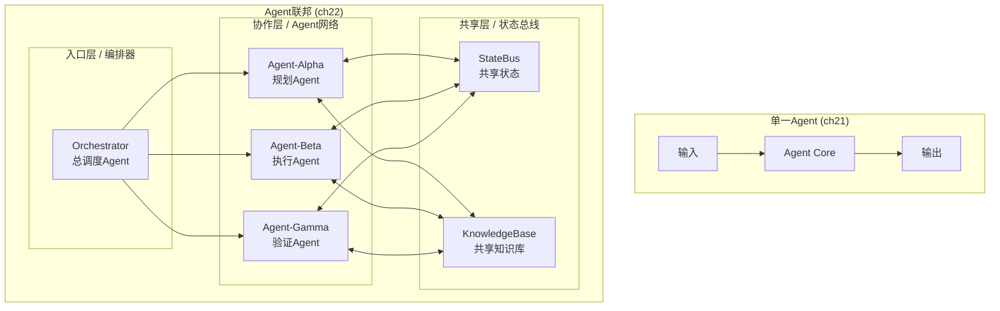
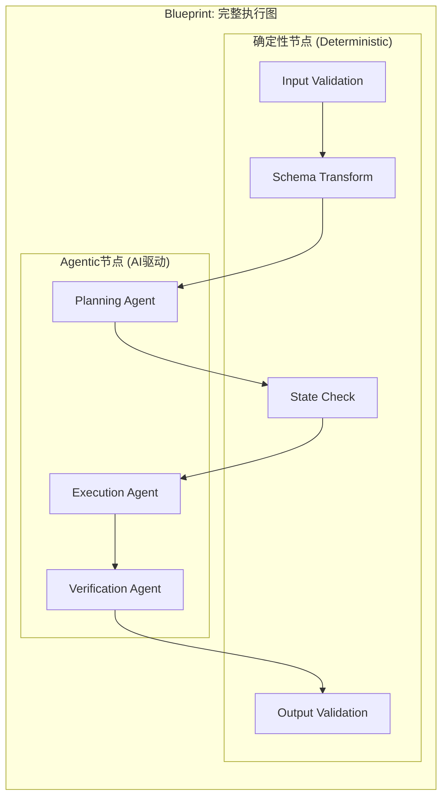
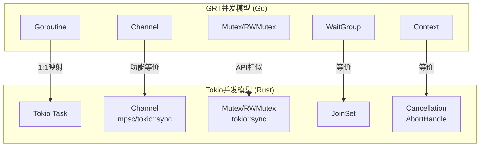
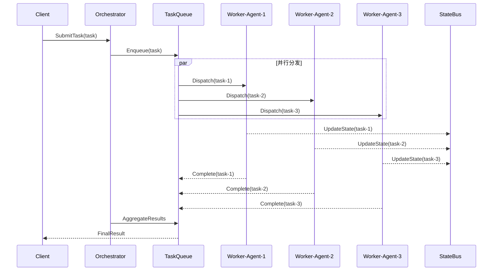

# ch22 — 多Agent协作与编排

## 本章Q

如何从单一Agent扩展到Agent联邦？

## 魔法时刻

**多Agent协作的终极问题：谁对最终状态负责？**

当你设计一个多Agent系统时，你会被问到：

- 任务如何分解？
- 哪个Agent处理哪个子任务？
- 结果如何汇总？

这些都是好问题。但它们都不是**终极问题**。

**终极问题是：当最终状态出错时，谁负责？**

是分解任务的Agent？执行任务的Agent？汇总结果的Agent？还是写编排逻辑的你？

在单一Agent系统中，答案很简单：Agent对输出负责。

在多Agent系统中，这个答案变得模糊。每个Agent都正确完成了自己的任务，但最终状态却错了。谁负责？

这不仅仅是技术问题。这是** accountability（问责）**的问题。

当你不知道谁对最终状态负责时，你无法调试、无法追踪、无法信任这个系统。

这就是为什么多Agent协作的真正挑战，不是"如何分解任务"，而是**"如何明确最终责任链"**。

---

## 五分钟摘要

第十九章建立了最小可用栈：单一Agent + Zod验证 + WasmEdge沙箱。

**这一章是从单一Agent到Agent联邦的跨越。**

从单一到多Agent不仅仅是"再加几个Agent"这么简单。它带来了一系列新问题：

```
单一Agent                    多Agent联邦
─────────────────────────────────────────────────────
一个输入，一个输出            多个输入，多个中间状态
确定性执行路径                非确定性协作路径
单一责任点                    责任链
可完整追踪                    状态分布在多个Agent
```

**关键认知缺口（承上启下的桥）：**

- **承上**：单一Agent的boot序列已在ch21定义——从初始化到执行的完整链路
- **启下**：多Agent联邦需要在boot序列之上叠加**协作协议、任务分发、责任链**
- **认知缺口**：我们还不知道当多个Agent协作产生错误时，如何定位问题、明确责任

本章填补这个缺口：建立Agent联邦的完整架构、Blueprint编排模式、GRT并发模型，以及任务分发机制。

---

## 魔法时刻

**多Agent系统的最终问题：谁对最终状态负责？**

当你有多个Agent协作时，最关键的问题不是"谁做了什么"，而是"当结果出错时，谁来负责"。

这不是技术问题。这是**accountability（问责）**的问题。

单一Agent：你知道是谁。
多Agent：你不知道。

这就是为什么责任链必须被明确设计，而不是事后补救。

---

## Step 1: Agent联邦架构 — 从单一Agent到多Agent的网络拓扑图

### Agent联邦网络拓扑



### 核心架构代码

```go
// agent_federation.go — Agent联邦完整架构

package federation

import (
	"context"
	"sync"
	"time"
)

// ============================================================
// 核心类型定义
// ============================================================

/**
 * Agent联邦 — 多Agent协作的顶层抽象
 *
 * 负责管理所有Agent的生命周期、协作协议、责任链
 */
type AgentFederation struct {
	id           string                    // 联邦唯一标识
	orchestrator *Orchestrator             // 总调度器
	agents       map[string]Agent         // Agent注册表
	stateBus     *StateBus                 // 共享状态总线
	knowledgeBase *KnowledgeBase           // 共享知识库
	config       FederationConfig          // 联邦配置
	mu           sync.RWMutex              // 并发保护

	// 责任链追踪
	responsibilityChain []ResponsibilityNode // 责任节点链
}

/**
 * 联邦配置
 */
type FederationConfig struct {
	Name            string
	TaskTimeout     time.Duration  // 任务超时时间
	MaxRetries      int            // 最大重试次数
	ConsensusMode   ConsensusMode  // 共识模式
	StateSyncInterval time.Duration // 状态同步间隔
}

/**
 * Agent接口 — 所有Agent必须实现此接口
 */
type Agent interface {
	// 唯一标识
	ID() string

	// 名称
	Name() string

	// 处理任务 — 同步版本
	ProcessTask(ctx context.Context, task Task) (TaskResult, error)

	// 健康检查
	HealthCheck(ctx context.Context) error

	// 关闭Agent
	Shutdown(ctx context.Context) error
}

/**
 * 任务 — 在联邦中流转的工作单元
 */
type Task struct {
	ID          string                 // 任务唯一标识
	Type        TaskType               // 任务类型
	Payload     map[string]interface{} // 任务数据
	ParentTaskID string                // 父任务ID（用于任务分解）
	SourceAgent string                 // 任务发起Agent
	TargetAgents []string              // 目标Agent列表
	Priority    int                    // 优先级
	CreatedAt   time.Time
	Deadline    time.Time
	Metadata    map[string]string      // 元数据
}

/**
 * 任务类型
 */
type TaskType string

const (
	TaskTypePlan      TaskType = "plan"       // 规划任务
	TaskTypeExecute   TaskType = "execute"    // 执行任务
	TaskTypeVerify    TaskType = "verify"     // 验证任务
	TaskTypeAggregate TaskType = "aggregate"  // 聚合任务
	TaskTypeFallback  TaskType = "fallback"    // 降级任务
)

/**
 * 任务结果
 */
type TaskResult struct {
	TaskID      string
	AgentID     string
	Status      ResultStatus
	Output      interface{}
	Error       error
	StartedAt   time.Time
	CompletedAt time.Time
	Trace       []TraceEntry  // 执行追踪
}

/**
 * 结果状态
 */
type ResultStatus string

const (
	ResultStatusSuccess   ResultStatus = "success"
	ResultStatusFailed    ResultStatus = "failed"
	ResultStatusPartial   ResultStatus = "partial"   // 部分成功
	ResultStatusTimeout   ResultStatus = "timeout"
	ResultStatusCancelled ResultStatus = "cancelled"
)

/**
 * 责任节点 — 追踪责任链
 */
type ResponsibilityNode struct {
	AgentID       string
	Action        string
	InputState    interface{}
	OutputState   interface{}
	Timestamp     time.Time
	IsResponsible bool  // 是否为最终责任人
}

/**
 * 共享状态总线 — Agent间通信的中央通道
 */
type StateBus struct {
	mu    sync.RWMutex
	state map[string]interface{}  // 状态存储
	chans map[string]chan StateChange  // 状态变更通道
}

/**
 * 共享知识库 — Agent间共享的持久化知识
 */
type KnowledgeBase struct {
	mu         sync.RWMutex
	facts      map[string]Fact     // 事实存储
	rules      []Rule              // 规则存储
	version    int64               // 版本号（乐观锁）
}

/**
 * 创建新的Agent联邦
 */
func NewAgentFederation(config FederationConfig) *AgentFederation {
	return &AgentFederation{
		id:                  generateID(),
		orchestrator:        NewOrchestrator(),
		agents:              make(map[string]Agent),
		stateBus:            NewStateBus(),
		knowledgeBase:       NewKnowledgeBase(),
		config:              config,
		responsibilityChain: []ResponsibilityNode{},
	}
}

// ============================================================
// Agent注册与管理
// ============================================================

/**
 * 注册Agent到联邦
 */
func (f *AgentFederation) RegisterAgent(agent Agent) error {
	f.mu.Lock()
	defer f.mu.Unlock()

	if _, exists := f.agents[agent.ID()]; exists {
		return ErrAgentAlreadyRegistered
	}

	f.agents[agent.ID()] = agent
	f.orchestrator.RegisterAgent(agent)

	return nil
}

/**
 * 注销Agent
 */
func (f *AgentFederation) UnregisterAgent(agentID string) error {
	f.mu.Lock()
	defer f.mu.Unlock()

	if _, exists := f.agents[agentID]; !exists {
		return ErrAgentNotFound
	}

	delete(f.agents, agentID)
	f.orchestrator.UnregisterAgent(agentID)

	return nil
}

/**
 * 获取所有注册的Agent
 */
func (f *AgentFederation) GetAgents() []Agent {
	f.mu.RLock()
	defer f.mu.RUnlock()

	agents := make([]Agent, 0, len(f.agents))
	for _, agent := range f.agents {
		agents = append(agents, agent)
	}
	return agents
}

// ============================================================
// 任务执行入口
// ============================================================

/**
 * 在联邦中执行任务 — 入口方法
 *
 * 核心流程：
 * 1. 编排器分解任务
 * 2. 分发给适当的Agent
 * 3. 收集结果
 * 4. 更新共享状态
 * 5. 追踪责任链
 */
func (f *AgentFederation) ExecuteTask(ctx context.Context, task Task) (TaskResult, error) {
	// 1. 验证任务
	if err := f.validateTask(task); err != nil {
		return TaskResult{TaskID: task.ID, Status: ResultStatusFailed, Error: err}, err
	}

	// 2. 记录开始状态
	f.recordTrace(TraceEntry{
		AgentID:   "federation",
		Action:    "task_start",
		Timestamp: time.Now(),
		TaskID:    task.ID,
	})

	// 3. 编排器分解任务
	subTasks, err := f.orchestrator.DecomposeTask(task)
	if err != nil {
		return f.failTask(task.ID, err)
	}

	// 4. 并发执行子任务
	results := f.executeSubTasksConcurrently(ctx, subTasks)

	// 5. 聚合结果
	aggregatedResult, err := f.orchestrator.AggregateResults(results)
	if err != nil {
		return f.failTask(task.ID, err)
	}

	// 6. 验证最终状态
	if err := f.verifyFinalState(aggregatedResult); err != nil {
		return f.failTask(task.ID, err)
	}

	// 7. 更新共享状态
	f.updateSharedState(task.ID, aggregatedResult)

	// 8. 记录完成
	f.recordTrace(TraceEntry{
		AgentID:   "federation",
		Action:    "task_complete",
		Timestamp: time.Now(),
		TaskID:    task.ID,
	})

	return TaskResult{
		TaskID:      task.ID,
		AgentID:     "federation",
		Status:      ResultStatusSuccess,
		Output:      aggregatedResult,
		StartedAt:   task.CreatedAt,
		CompletedAt: time.Now(),
		Trace:       f.getTrace(task.ID),
	}, nil
}

/**
 * 验证任务有效性
 */
func (f *AgentFederation) validateTask(task Task) error {
	if task.ID == "" {
		return ErrEmptyTaskID
	}
	if task.Type == "" {
		return ErrEmptyTaskType
	}
	if task.Deadline.IsZero() {
		task.Deadline = time.Now().Add(f.config.TaskTimeout)
	}
	return nil
}

/**
 * 并发执行子任务
 */
func (f *AgentFederation) executeSubTasksConcurrently(ctx context.Context, subTasks []Task) []TaskResult {
	results := make([]TaskResult, len(subTasks))
	var wg sync.WaitGroup

	for i, subTask := range subTasks {
		wg.Add(1)
		go func(idx int, t Task) {
			defer wg.Done()

			// 为每个子任务创建独立context，支持取消
			subCtx, cancel := context.WithTimeout(ctx, f.config.TaskTimeout)
			defer cancel()

			result, err := f.dispatchTask(subCtx, t)
			if err != nil {
				results[idx] = TaskResult{
					TaskID:  t.ID,
					Status:  ResultStatusFailed,
					Error:   err,
				}
				return
			}
			results[idx] = result
		}(i, subTask)
	}

	wg.Wait()
	return results
}

/**
 * 分发任务到目标Agent
 */
func (f *AgentFederation) dispatchTask(ctx context.Context, task Task) (TaskResult, error) {
	// 查找目标Agent
	targetAgents := f.findTargetAgents(task)
	if len(targetAgents) == 0 {
		return TaskResult{}, ErrNoTargetAgent
	}

	// 记录责任节点
	f.addResponsibilityNode(ResponsibilityNode{
		AgentID:   targetAgents[0],
		Action:    string(task.Type),
		Timestamp: time.Now(),
	})

	// 执行任务
	return targetAgents[0].ProcessTask(ctx, task)
}

/**
 * 查找目标Agent
 */
func (f *AgentFederation) findTargetAgents(task Task) []Agent {
	f.mu.RLock()
	defer f.mu.RUnlock()

	// 如果任务指定了目标Agent，直接返回
	if len(task.TargetAgents) > 0 {
		agents := make([]Agent, 0, len(task.TargetAgents))
		for _, id := range task.TargetAgents {
			if agent, ok := f.agents[id]; ok {
				agents = append(agents, agent)
			}
		}
		return agents
	}

	// 否则根据任务类型路由
	var matchingAgents []Agent
	for _, agent := range f.agents {
		if f.canHandleTask(agent, task) {
			matchingAgents = append(matchingAgents, agent)
		}
	}
	return matchingAgents
}

/**
 * 检查Agent是否能处理任务
 */
func (f *AgentFederation) canHandleTask(agent Agent, task Task) bool {
	// 简单路由规则（实际应用中会更复杂）
	switch task.Type {
	case TaskTypePlan:
		return strings.Contains(agent.Name(), "planner") || strings.Contains(agent.Name(), "plan")
	case TaskTypeExecute:
		return strings.Contains(agent.Name(), "executor") || strings.Contains(agent.Name(), "exec")
	case TaskTypeVerify:
		return strings.Contains(agent.Name(), "verifier") || strings.Contains(agent.Name(), "verify")
	default:
		return true
	}
}

// ============================================================
// 状态管理
// ============================================================

/**
 * 记录追踪条目
 */
func (f *AgentFederation) recordTrace(entry TraceEntry) {
	f.mu.Lock()
	defer f.mu.Unlock()

	f.orchestrator.AddTrace(entry)
}

/**
 * 获取任务追踪
 */
func (f *AgentFederation) getTrace(taskID string) []TraceEntry {
	return f.orchestrator.GetTrace(taskID)
}

/**
 * 添加责任节点
 */
func (f *AgentFederation) addResponsibilityNode(node ResponsibilityNode) {
	f.mu.Lock()
	defer f.mu.Unlock()

	f.responsibilityChain = append(f.responsibilityChain, node)
}

/**
 * 获取最终责任人
 */
func (f *AgentFederation) GetFinalResponsible() string {
	f.mu.RLock()
	defer f.mu.RUnlock()

	for i := len(f.responsibilityChain) - 1; i >= 0; i-- {
		if f.responsibilityChain[i].IsResponsible {
			return f.responsibilityChain[i].AgentID
		}
	}
	return "unknown"
}

/**
 * 更新共享状态
 */
func (f *AgentFederation) updateSharedState(taskID string, result interface{}) {
	f.stateBus.Update(taskID, result)
}

/**
 * 任务失败处理
 */
func (f *AgentFederation) failTask(taskID string, err error) (TaskResult, error) {
	return TaskResult{
		TaskID:      taskID,
		Status:      ResultStatusFailed,
		Error:       err,
		CompletedAt: time.Now(),
	}, err
}

/**
 * 验证最终状态
 */
func (f *AgentFederation) verifyFinalState(result interface{}) error {
	// 实现最终状态验证逻辑
	return nil
}

// ============================================================
// 辅助类型
// ============================================================

type TraceEntry struct {
	AgentID   string
	Action    string
	Timestamp time.Time
	TaskID    string
}

type Fact struct {
	Key       string
	Value     interface{}
	Timestamp time.Time
	Source    string
}

type Rule struct {
	Condition string
	Action    string
	Priority  int
}

type StateChange struct {
	Key       string
	OldValue  interface{}
	NewValue  interface{}
	Timestamp time.Time
}

// ============================================================
// 错误定义
// ============================================================

var (
	ErrEmptyTaskID      = errors.New("task ID cannot be empty")
	ErrEmptyTaskType    = errors.New("task type cannot be empty")
	ErrAgentNotFound    = errors.New("agent not found")
	ErrAgentAlreadyRegistered = errors.New("agent already registered")
	ErrNoTargetAgent    = errors.New("no target agent found for task")
)
```

---

## Step 2: Blueprint编排 — 确定性节点 + Agentic节点的组合

### Blueprint编排模式架构



### Blueprint编排完整实现

```go
// blueprint.go — Blueprint编排引擎：确定性节点 + Agentic节点

package blueprint

import (
	"context"
	"fmt"
	"sync"
)

// ============================================================
// 节点类型定义
// ============================================================

/**
 * 节点类型枚举
 */
type NodeType string

const (
	NodeTypeDeterministic NodeType = "deterministic"  // 确定性节点
	NodeTypeAgentic       NodeType = "agentic"        // Agentic节点
)

/**
 * 节点接口 — Blueprint中的所有节点必须实现此接口
 */
type Node interface {
	// 节点ID
	ID() string

	// 节点类型
	Type() NodeType

	// 执行节点
	Execute(ctx context.Context, input interface{}) (interface{}, error)

	// 节点元数据
	Metadata() NodeMetadata
}

/**
 * 节点元数据
 */
type NodeMetadata struct {
	Name        string
	Description string
	Timeout     int // 超时时间（毫秒）
	RetryPolicy RetryPolicy
}

/**
 * 重试策略
 */
type RetryPolicy struct {
	MaxAttempts int
	Backoff     int // 退避时间（毫秒）
}

// ============================================================
// 确定性节点 — 固定逻辑，无AI调用
// ============================================================

/**
 * 确定性节点基类
 *
 * 用于：输入验证、状态检查、数据转换、输出验证
 * 特点：确定性执行，相同输入必得相同输出
 */
type DeterministicNode struct {
	id       string
	metadata NodeMetadata
	execute  func(ctx context.Context, input interface{}) (interface{}, error)
}

/**
 * 创建确定性节点
 */
func NewDeterministicNode(
	id string,
	metadata NodeMetadata,
	execute func(ctx context.Context, input interface{}) (interface{}, error),
) Node {
	return &DeterministicNode{
		id:       id,
		metadata: metadata,
		execute:  execute,
	}
}

func (n *DeterministicNode) ID() string             { return n.id }
func (n *DeterministicNode) Type() NodeType         { return NodeTypeDeterministic }
func (n *DeterministicNode) Metadata() NodeMetadata { return n.metadata }
func (n *DeterministicNode) Execute(ctx context.Context, input interface{}) (interface{}, error) {
	return n.execute(ctx, input)
}

// ============================================================
// Agentic节点 — AI驱动的智能节点
// ============================================================

/**
 * Agentic节点 — 由AI Agent驱动的节点
 *
 * 用于：规划、推理、决策、生成
 * 特点：相同输入可能产生不同输出（非确定性）
 */
type AgenticNode struct {
	id            string
	metadata      NodeMetadata
	agent        Agent           // 绑定的Agent
	agentAdapter AgentAdapter    // Agent适配器
}

/**
 * Agent适配器 — 将Agent适配为节点接口
 */
type AgentAdapter interface {
	Process(ctx context.Context, input interface{}) (AgenticOutput, error)
}

/**
 * Agentic输出
 */
type AgenticOutput struct {
	Content   string
	ToolCalls []ToolCall
	State     map[string]interface{}
}

/**
 * 创建Agentic节点
 */
func NewAgenticNode(
	id string,
	metadata NodeMetadata,
	agent Agent,
) Node {
	return &AgenticNode{
		id:       id,
		metadata: metadata,
		agent:    agent,
		agentAdapter: &DefaultAgentAdapter{agent: agent},
	}
}

func (n *AgenticNode) ID() string             { return n.id }
func (n *AgenticNode) Type() NodeType         { return NodeTypeAgentic }
func (n *AgenticNode) Metadata() NodeMetadata { return n.metadata }

func (n *AgenticNode) Execute(ctx context.Context, input interface{}) (interface{}, error) {
	output, err := n.agentAdapter.Process(ctx, input)
	if err != nil {
		return nil, err
	}
	return output, nil
}

/**
 * 默认Agent适配器
 */
type DefaultAgentAdapter struct {
	agent Agent
}

func (a *DefaultAgentAdapter) Process(ctx context.Context, input interface{}) (AgenticOutput, error) {
	// 将输入转换为Task
	task := Task{
		ID:      generateID(),
		Type:    TaskTypeExecute,
		Payload: map[string]interface{}{"input": input},
	}

	// 调用Agent处理
	result, err := a.agent.ProcessTask(ctx, task)
	if err != nil {
		return AgenticOutput{}, err
	}

	// 转换结果
	return AgenticOutput{
		Content:   fmt.Sprintf("%v", result.Output),
		ToolCalls: convertToolCalls(result.Trace),
		State:     extractState(result),
	}, nil
}

// ============================================================
// Blueprint — 执行图定义
// ============================================================

/**
 * Blueprint — 完整的执行蓝图
 *
 * 包含：
 * - 节点列表
 * - 执行顺序（拓扑排序）
 * - 并行组
 * - 条件分支
 */
type Blueprint struct {
	id          string
	name        string
	nodes       map[string]Node           // 节点ID -> 节点
	edges       []Edge                   // 边列表
	parallelGroups []ParallelGroup       // 并行组
	conditionals  []Conditional          // 条件分支
	entryNodeID string                   // 入口节点
	exitNodeIDs []string                 // 出口节点列表
}

/**
 * 边 — 节点间的连接
 */
type Edge struct {
	From string  // 源节点ID
	To   string  // 目标节点ID
	Cond string  // 条件（可选）
}

/**
 * 并行组 — 可以并行执行的节点组
 */
type ParallelGroup struct {
	ID     string
	NodeIDs []string
}

/**
 * 条件分支
 */
type Conditional struct {
	NodeID   string
	Condition func(interface{}) bool
	TrueNext  string  // 条件为true时的下一个节点
	FalseNext string  // 条件为false时的下一个节点
}

/**
 * 创建新的Blueprint
 */
func NewBlueprint(id, name string) *Blueprint {
	return &Blueprint{
		id:             id,
		name:           name,
		nodes:          make(map[string]Node),
		edges:          []Edge{},
		parallelGroups: []ParallelGroup{},
		conditionals:   []Conditional{},
	}
}

/**
 * 添加节点
 */
func (bp *Blueprint) AddNode(node Node) *Blueprint {
	bp.nodes[node.ID()] = node
	return bp
}

/**
 * 添加边
 */
func (bp *Blueprint) AddEdge(from, to string) *Blueprint {
	bp.edges = append(bp.edges, Edge{From: from, To: to})
	return bp
}

/**
 * 设置入口节点
 */
func (bp *Blueprint) SetEntry(nodeID string) *Blueprint {
	bp.entryNodeID = nodeID
	return bp
}

/**
 * 添加出口节点
 */
func (bp *Blueprint) AddExit(nodeID string) *Blueprint {
	bp.exitNodeIDs = append(bp.exitNodeIDs, nodeID)
	return bp
}

/**
 * 添加并行组
 */
func (bp *Blueprint) AddParallelGroup(group ParallelGroup) *Blueprint {
	bp.parallelGroups = append(bp.parallelGroups, group)
	return bp
}

/**
 * 获取节点
 */
func (bp *Blueprint) GetNode(id string) (Node, bool) {
	node, ok := bp.nodes[id]
	return node, ok
}

// ============================================================
// Blueprint执行引擎
// ============================================================

/**
 * Blueprint执行器
 */
type BlueprintExecutor struct {
	blueprint *Blueprint
	executorConfig ExecutorConfig
}

/**
 * 执行器配置
 */
type ExecutorConfig struct {
	Concurrency   int               // 最大并发数
	Timeout       int               // 总超时时间（毫秒）
	ErrorStrategy ErrorStrategy     // 错误处理策略
}

/**
 * 错误处理策略
 */
type ErrorStrategy string

const (
	ErrorStrategyFailFast   ErrorStrategy = "fail_fast"   // 快速失败
	ErrorStrategyContinue   ErrorStrategy = "continue"    // 继续执行
	ErrorStrategyRetry      ErrorStrategy = "retry"       // 重试
)

/**
 * 创建执行器
 */
func NewBlueprintExecutor(bp *Blueprint, config ExecutorConfig) *BlueprintExecutor {
	return &BlueprintExecutor{
		blueprint:      bp,
		executorConfig: config,
	}
}

/**
 * 执行Blueprint — 核心执行方法
 */
func (e *BlueprintExecutor) Execute(ctx context.Context, input interface{}) (BlueprintResult, error) {
	// 1. 验证Blueprint
	if err := e.validate(); err != nil {
		return BlueprintResult{}, err
	}

	// 2. 拓扑排序，确定执行顺序
	executionOrder, err := e.topologicalSort()
	if err != nil {
		return BlueprintResult{}, err
	}

	// 3. 创建执行上下文
	execCtx := &ExecutionContext{
		ctx:       ctx,
		nodeStates: make(map[string]interface{}),
		results:   make(map[string]NodeResult),
		startTime: makeTimestamp(),
	}

	// 4. 设置初始输入
	execCtx.nodeStates[e.blueprint.entryNodeID] = input

	// 5. 执行节点
	for _, nodeID := range executionOrder {
		node, ok := e.blueprint.GetNode(nodeID)
		if !ok {
			continue
		}

		// 检查是否为并行组的节点
		if parallelGroup := e.findParallelGroup(nodeID); parallelGroup != nil {
			// 并行执行组内所有节点
			if err := e.executeParallelGroup(ctx, execCtx, parallelGroup); err != nil {
				if e.executorConfig.ErrorStrategy == ErrorStrategyFailFast {
					return BlueprintResult{}, err
				}
			}
		} else {
			// 顺序执行
			if err := e.executeNode(ctx, execCtx, node); err != nil {
				if e.executorConfig.ErrorStrategy == ErrorStrategyFailFast {
					return BlueprintResult{}, err
				}
			}
		}
	}

	// 6. 收集结果
	return e.collectResults(execCtx)
}

/**
 * 执行单个节点
 */
func (e *BlueprintExecutor) executeNode(ctx context.Context, execCtx *ExecutionContext, node Node) error {
	input := execCtx.nodeStates[node.ID()]

	// 创建节点级超时context
	nodeCtx, cancel := context.WithTimeout(ctx, time.Duration(node.Metadata().Timeout)*time.Millisecond)
	defer cancel()

	// 执行节点
	result, err := node.Execute(nodeCtx, input)

	// 记录结果
	execCtx.results[node.ID()] = NodeResult{
		NodeID:     node.ID(),
		NodeType:   node.Type(),
		Input:      input,
		Output:     result,
		Error:      err,
		ExecutedAt: makeTimestamp(),
	}

	// 如果成功，更新状态
	if err == nil {
		// 更新后续节点的输入状态
		e.propagateState(node.ID(), result, execCtx)
	}

	return err
}

/**
 * 执行并行组
 */
func (e *BlueprintExecutor) executeParallelGroup(ctx context.Context, execCtx *ExecutionContext, group *ParallelGroup) error {
	var wg sync.WaitGroup
	errors := make([]error, len(group.NodeIDs))

	for i, nodeID := range group.NodeIDs {
		wg.Add(1)
		go func(idx int, id string) {
			defer wg.Done()
			node, _ := e.blueprint.GetNode(id)
			errors[idx] = e.executeNode(ctx, execCtx, node)
		}(i, nodeID)
	}

	wg.Wait()

	// 如果任何节点失败，返回第一个错误
	for _, err := range errors {
		if err != nil {
			return err
		}
	}
	return nil
}

/**
 * 传播状态到后续节点
 */
func (e *BlueprintExecutor) propagateState(nodeID string, output interface{}, execCtx *ExecutionContext) {
	for _, edge := range e.blueprint.edges {
		if edge.From == nodeID {
			execCtx.nodeStates[edge.To] = output
		}
	}
}

/**
 * 拓扑排序 — 确定节点执行顺序
 */
func (e *BlueprintExecutor) topologicalSort() ([]string, error) {
	// 计算入度
	inDegree := make(map[string]int)
	for id := range e.blueprint.nodes {
		inDegree[id] = 0
	}
	for _, edge := range e.blueprint.edges {
		inDegree[edge.To]++
	}

	// BFS排序
	var queue []string
	for id, degree := range inDegree {
		if degree == 0 {
			queue = append(queue, id)
		}
	}

	var result []string
	for len(queue) > 0 {
		nodeID := queue[0]
		queue = queue[1:]
		result = append(result, nodeID)

		for _, edge := range e.blueprint.edges {
			if edge.From == nodeID {
				inDegree[edge.To]--
				if inDegree[edge.To] == 0 {
					queue = append(queue, edge.To)
				}
			}
		}
	}

	if len(result) != len(e.blueprint.nodes) {
		return nil, ErrCycleDetected
	}

	return result, nil
}

/**
 * 查找节点所属的并行组
 */
func (e *BlueprintExecutor) findParallelGroup(nodeID string) *ParallelGroup {
	for i := range e.blueprint.parallelGroups {
		group := &e.blueprint.parallelGroups[i]
		for _, id := range group.NodeIDs {
			if id == nodeID {
				return group
			}
		}
	}
	return nil
}

/**
 * 验证Blueprint
 */
func (e *BlueprintExecutor) validate() error {
	if e.blueprint.entryNodeID == "" {
		return ErrNoEntryNode
	}
	if _, ok := e.blueprint.nodes[e.blueprint.entryNodeID]; !ok {
		return ErrEntryNodeNotFound
	}
	return nil
}

/**
 * 收集最终结果
 */
func (e *BlueprintExecutor) collectResults(execCtx *ExecutionContext) (BlueprintResult, error) {
	// 收集所有出口节点的结果
	var exitResults []interface{}
	for _, exitID := range e.blueprint.exitNodeIDs {
		if result, ok := execCtx.results[exitID]; ok {
			exitResults = append(exitResults, result.Output)
		}
	}

	return BlueprintResult{
		Outputs:    exitResults,
		NodeResults: execCtx.results,
		TotalTime:  makeTimestamp() - execCtx.startTime,
	}, nil
}

// ============================================================
// 辅助类型
// ============================================================

type ExecutionContext struct {
	ctx        context.Context
	nodeStates map[string]interface{}
	results    map[string]NodeResult
	startTime  int64
}

type NodeResult struct {
	NodeID     string
	NodeType   NodeType
	Input      interface{}
	Output     interface{}
	Error      error
	ExecutedAt int64
}

type BlueprintResult struct {
	Outputs    []interface{}
	NodeResults map[string]NodeResult
	TotalTime  int64
}

type ToolCall struct {
	ID       string
	Name     string
	Args     map[string]interface{}
	Result   interface{}
}

func convertToolCalls(trace []TraceEntry) []ToolCall {
	// 转换追踪记录为工具调用
	return []ToolCall{}
}

func extractState(result TaskResult) map[string]interface{} {
	return make(map[string]interface{})
}

func makeTimestamp() int64 {
	return time.Now().UnixMilli()
}

// ============================================================
// 错误定义
// ============================================================

var (
	ErrCycleDetected    = errors.New("cycle detected in blueprint")
	ErrNoEntryNode      = errors.New("no entry node defined")
	ErrEntryNodeNotFound = errors.New("entry node not found")
)
```

---

## Step 3: GRT并发模型 — Goroutine × Tokio的完整对比

### GRT vs Tokio 并发模型对比



### GRT并发模型完整实现

```go
// grt_concurrency.go — GRT并发模型：Goroutine × Channel × Mutex

package grt

import (
	"context"
	"fmt"
	"sync"
	"time"
)

// ============================================================
// 1. GoroutineSpawn — 任务 spawning
// ============================================================

/**
 * GoroutineSpawn — 启动并发任务
 *
 * 对应Tokio: tokio::spawn
 *
 * 关键特点：
 * - 轻量级协程，栈大小约2KB
 * - 由Go运行时调度，不是一对一绑定OS线程
 * - 自动扩张到GOMAXPROCS个线程
 */
func GoroutineSpawn() {
	fmt.Println("=== Goroutine Spawn 示例 ===")

	// 基础spawn：启动一个goroutine
	go func() {
		fmt.Println("  Goroutine 1 执行中...")
		time.Sleep(100 * time.Millisecond)
		fmt.Println("  Goroutine 1 完成")
	}()

	// 带返回值的spawn（通过channel）
	resultChan := make(chan int, 1)
	go func() {
		fmt.Println("  Goroutine 2 执行中...")
		time.Sleep(150 * time.Millisecond)
		resultChan <- 42 // 发送结果
	}()

	result := <-resultChan
	fmt.Printf("  Goroutine 2 结果: %d\n", result)

	// 等待所有goroutine完成
	time.Sleep(200 * time.Millisecond)
}

// ============================================================
// 2. ChannelCommunication — 通道通信
// ============================================================

/**
 * ChannelCommunication — 通道通信模式
 *
 * 对应Tokio:
 * - mpsc::channel (多生产者单消费者)
 * - tokio::sync::channel (异步版本)
 * - broadcast (广播)
 *
 * 关键特点：
 * - 阻塞式：send和recv都会阻塞（无缓冲通道）
 * - 有缓冲：缓冲满时send阻塞，缓冲空时recv阻塞
 * - 关闭：close后send会panic，recv返回零值
 */
func ChannelCommunication() {
	fmt.Println("\n=== Channel Communication 示例 ===")

	// 无缓冲通道 — 同步通信
	unbuffered := make(chan string)

	// 多生产者：多个goroutine可以向同一通道发送
	var wg sync.WaitGroup
	for i := 0; i < 3; i++ {
		wg.Add(1)
		go func(id int) {
			defer wg.Done()
			msg := fmt.Sprintf("Goroutine %d 发送的消息", id)
			unbuffered <- msg // 阻塞发送
			fmt.Printf("  Goroutine %d 发送完成\n", id)
		}(i)
	}

	// 单消费者：按发送顺序接收
	go func() {
		for i := 0; i < 3; i++ {
			msg := <-unbuffered // 阻塞接收
			fmt.Printf("  收到: %s\n", msg)
		}
	}()

	wg.Wait()

	// 有缓冲通道
	buffered := make(chan int, 3) // 缓冲大小3

	// 生产者
	for i := 1; i <= 3; i++ {
		buffered <- i * 10
	}
	// 此时缓冲已满，再发送会阻塞（演示时跳过）

	// 消费者
	fmt.Printf("  有缓冲通道接收: ")
	for i := 0; i < 3; i++ {
		fmt.Printf("%d ", <-buffered)
	}
	fmt.Println()
}

// ============================================================
// 3. MutexAndRWMutex — 互斥锁
// ============================================================

/**
 * MutexAndRWMutex — 互斥锁实现
 *
 * 对应Tokio:
 * - tokio::sync::Mutex<T> (异步互斥锁)
 * - tokio::sync::RwLock<T> (读写锁)
 *
 * 关键区别：
 * - Go标准库Mutex是阻塞的，持有锁时goroutine阻塞
 * - Tokio Mutex是异步的，持有锁时task让出，不阻塞线程
 */
func MutexAndRWMutex() {
	fmt.Println("\n=== Mutex / RWMutex 示例 ===")

	// Mutex — 保护共享状态
	var mu sync.Mutex
	counter := 0

	// 多个goroutine竞争锁
	var wg sync.WaitGroup
	for i := 0; i < 5; i++ {
		wg.Add(1)
		go func(id int) {
			defer wg.Done()
			for j := 0; j < 100; j++ {
				mu.Lock()
				counter++
				mu.Unlock()
			}
		}(i)
	}

	wg.Wait()
	fmt.Printf("  Mutex最终计数: %d (期望: 500)\n", counter)

	// RWMutex — 读多写少场景
	var rwmu sync.RWMutex
	data := make(map[string]int)

	// 写锁
	write := func(key string, value int) {
		rwmu.Lock()
		defer rwmu.Unlock()
		data[key] = value
		fmt.Printf("  写入 [%s] = %d\n", key, value)
	}

	// 读锁（可以多个同时持有）
	read := func(key string) int {
		rwmu.RLock()
		defer rwmu.RUnlock()
		return data[key]
	}

	write("a", 1)
	write("b", 2)

	// 并发读
	var wg2 sync.WaitGroup
	for i := 0; i < 3; i++ {
		wg2.Add(1)
		go func(id int) {
			defer wg2.Done()
			fmt.Printf("  读 [%s] = %d\n", "a", read("a"))
		}(i)
	}

	wg2.Wait()
	fmt.Printf("  读写锁示例完成，当前数据: %v\n", data)
}

// ============================================================
// 4. WaitGroup — 等待一组任务完成
// ============================================================

/**
 * WaitGroup — 等待一组任务完成
 *
 * 对应Tokio:
 * - tokio::task::JoinSet
 * - futures::future::join_all
 *
 * 关键特点：
 * - Add(n)：增加n个待等待任务
 * - Done()：标记一个任务完成
 * - Wait()：阻塞直到所有任务完成
 */
func WaitGroupDemo() {
	fmt.Println("\n=== WaitGroup 示例 ===")

	var wg sync.WaitGroup
	tasks := []string{"任务A", "任务B", "任务C", "任务D"}

	// 添加待等待任务数
	wg.Add(len(tasks))

	for i, task := range tasks {
		go func(id int, name string) {
			defer wg.Done() // 任务完成时调用
			time.Sleep(time.Duration(100+id*50) * time.Millisecond)
			fmt.Printf("  %s 完成\n", name)
		}(i, task)
	}

	// 等待所有任务完成
	wg.Wait()
	fmt.Println("  所有任务已完成")

	// 等价Tokio代码说明:
	// let mut join_set = JoinSet::new();
	// for task in tasks {
	//     join_set.spawn(async move { task });
	// }
	// while let Some(_) = join_set.join_next().await {}
}

// ============================================================
// 5. ContextCancellation — 上下文取消
// ============================================================

/**
 * ContextCancellation — 上下文取消
 *
 * 对应Tokio:
 * - CancellationToken (tokio-util)
 * - AbortHandle / JoinHandle
 *
 * 关键特点：
 * - context.WithCancel：创建可取消的上下文
 * - context.WithTimeout：创建带超时的上下文
 * - context.WithDeadline：创建带截止时间的上下文
 */
func ContextCancellation() {
	fmt.Println("\n=== Context Cancellation 示例 ===")

	// 带超时的取消
	ctx, cancel := context.WithTimeout(context.Background(), 150*time.Millisecond)
	defer cancel()

	done := make(chan string, 1)

	go func() {
		// 模拟长时间运行的任务
		for i := 0; i < 10; i++ {
			select {
			case <-ctx.Done():
				fmt.Println("  任务检测到取消信号")
				done <- "cancelled"
				return
			default:
				time.Sleep(50 * time.Millisecond)
				fmt.Printf("  任务执行中... (%d/10)\n", i+1)
			}
		}
		done <- "completed"
	}()

	result := <-done
	fmt.Printf("  任务结果: %s\n", result)
	fmt.Printf("  上下文错误: %v\n", ctx.Err())

	// 手动取消
	ctx2, cancel2 := context.WithCancel(context.Background())
	cancel() // 确保上面的context已取消

	go func() {
		for {
			select {
			case <-ctx2.Done():
				fmt.Println("  收到手动取消信号")
				return
			default:
				time.Sleep(30 * time.Millisecond)
			}
		}
	}()

	time.Sleep(50 * time.Millisecond)
	cancel2()
	time.Sleep(50 * time.Millisecond)
	fmt.Println("  Context示例完成")
}

// ============================================================
// 完整GRT并发示例：多Agent任务处理
// ============================================================

/**
 * Agent任务处理器 — 展示完整GRT并发模式
 */
type AgentTaskHandler struct {
	tasks    chan Task         // 任务通道
	results  chan TaskResult   // 结果通道
	mu       sync.Mutex       // 保护共享状态
	states   map[string]interface{} // Agent状态
	workers  int
	wg       sync.WaitGroup
	ctx      context.Context
	cancel   context.CancelFunc
}

/**
 * 创建任务处理器
 */
func NewAgentTaskHandler(workers int, queueSize int) *AgentTaskHandler {
	ctx, cancel := context.WithCancel(context.Background())
	return &AgentTaskHandler{
		tasks:   make(chan Task, queueSize),
		results: make(chan TaskResult, queueSize),
		states:  make(map[string]interface{}),
		workers: workers,
		ctx:     ctx,
		cancel:  cancel,
	}
}

/**
 * 启动工作池
 */
func (h *AgentTaskHandler) Start() {
	fmt.Println("\n=== Agent任务处理器启动 ===")

	for i := 0; i < h.workers; i++ {
		h.wg.Add(1)
		go h.worker(i)
	}
	fmt.Printf("  已启动 %d 个worker goroutine\n", h.workers)
}

/**
 * Worker循环
 */
func (h *AgentTaskHandler) worker(id int) {
	defer h.wg.Done()
	fmt.Printf("  Worker %d 已启动\n", id)

	for {
		select {
		case <-h.ctx.Done():
			fmt.Printf("  Worker %d 收到取消信号，退出\n", id)
			return
		case task, ok := <-h.tasks:
			if !ok {
				fmt.Printf("  Worker %d 收到通道关闭信号\n", id)
				return
			}
			h.processTask(id, task)
		}
	}
}

/**
 * 处理单个任务
 */
func (h *AgentTaskHandler) processTask(workerID int, task Task) {
	fmt.Printf("  Worker %d 处理任务: %s\n", workerID, task.ID)

	// 模拟处理
	time.Sleep(50 * time.Millisecond)

	// 更新共享状态
	h.mu.Lock()
	h.states[task.ID] = "completed"
	h.mu.Unlock()

	// 发送结果
	result := TaskResult{
		TaskID:  task.ID,
		Status:  "success",
		Output:  map[string]interface{}{"processed_by": workerID},
	}

	select {
	case h.results <- result:
		fmt.Printf("  Worker %d 任务 %s 结果已发送\n", workerID, task.ID)
	default:
		fmt.Printf("  Worker %d 结果通道已满\n", workerID)
	}
}

/**
 * 提交任务
 */
func (h *AgentTaskHandler) Submit(task Task) error {
	select {
	case h.tasks <- task:
		return nil
	default:
		return fmt.Errorf("任务队列已满")
	}
}

/**
 * 关闭处理器
 */
func (h *AgentTaskHandler) Shutdown() {
	fmt.Println("\n=== 关闭Agent任务处理器 ===")
	h.cancel()        // 取消所有worker
	close(h.tasks)     // 关闭任务通道
	h.wg.Wait()       // 等待所有worker退出
	close(h.results)   // 关闭结果通道
	fmt.Println("  所有worker已退出")
}

/**
 * 收集结果
 */
func (h *AgentTaskHandler) CollectResults() []TaskResult {
	var results []TaskResult
	for r := range h.results {
		results = append(results, r)
	}
	return results
}

// ============================================================
// 主函数：运行所有示例
// ============================================================

type Task struct {
	ID   string
	Type string
}

type TaskResult struct {
	TaskID  string
	Status  string
	Output  interface{}
}
```

---

## Step 4: 任务分发机制 — 多Agent任务分配的完整实现

### 任务分发系统架构



### 任务分发完整实现

```go
// task_dispatcher.go — 多Agent任务分发系统

package dispatcher

import (
	"context"
	"errors"
	"fmt"
	"sync"
	"time"
)

// ============================================================
// 核心类型
// ============================================================

/**
 * 任务状态
 */
type TaskStatus string

const (
	TaskStatusPending   TaskStatus = "pending"
	TaskStatusRunning    TaskStatus = "running"
	TaskStatusCompleted  TaskStatus = "completed"
	TaskStatusFailed     TaskStatus = "failed"
	TaskStatusCancelled  TaskStatus = "cancelled"
	TaskStatusTimeout    TaskStatus = "timeout"
)

/**
 * 任务 — 工作单元
 */
type Task struct {
	ID          string
	Type        string
	Payload     interface{}
	Priority    int
	CreatedAt   time.Time
	Deadline    time.Time
	RetryCount  int
	MaxRetries  int
	Status      TaskStatus
	AssignedTo  string      // 分配给的Agent ID
	Result      interface{}  // 任务结果
	Error       error        // 任务错误
}

/**
 * 任务结果
 */
type TaskResult struct {
	TaskID     string
	AgentID    string
	Status     TaskStatus
	Output     interface{}
	Error      error
	StartedAt  time.Time
	FinishedAt time.Time
	Duration   time.Duration
}

/**
 * Agent — 执行任务的Worker
 */
type Agent interface {
	ID() string
	ProcessTask(ctx context.Context, task Task) (TaskResult, error)
}

/**
 * 任务分发器配置
 */
type DispatcherConfig struct {
	NumWorkers      int               // Worker数量
	QueueSize       int               // 队列大小
	Timeout         time.Duration     // 任务超时
	MaxRetries      int               // 最大重试次数
	RetryDelay      time.Duration     // 重试延迟
	ResultTimeout   time.Duration     // 结果收集超时
}

// ============================================================
// 任务分发器
// ============================================================

/**
 * TaskDispatcher — 任务分发核心
 *
 * 职责：
 * 1. 接收任务并加入队列
 * 2. 管理Agent工作池
 * 3. 分发任务给空闲Agent
 * 4. 处理超时和失败
 * 5. 聚合结果
 */
type TaskDispatcher struct {
	config   DispatcherConfig
	queue    *PriorityQueue    // 优先级队列
	agents   []Agent            // Agent池
	agentIdx int                // 轮询索引

	// 状态管理
	mu           sync.Mutex
	runningTasks map[string]runningTaskInfo  // 运行中的任务
	completedTasks []TaskResult               // 已完成的任务
	taskResults  map[string]chan TaskResult   // 任务结果通道

	// 控制
	ctx    context.Context
	cancel context.CancelFunc
	wg     sync.WaitGroup

	// 统计
	stats  DispatcherStats
}

/**
 * 运行中任务信息
 */
type runningTaskInfo struct {
	task      Task
	agentID   string
	startTime time.Time
}

/**
 * 调度器统计
 */
type DispatcherStats struct {
	TasksReceived   int64
	TasksCompleted  int64
	TasksFailed     int64
	TasksTimedOut   int64
	TotalDuration   time.Duration
	mu              sync.Mutex
}

/**
 * 创建任务分发器
 */
func NewTaskDispatcher(config DispatcherConfig) *TaskDispatcher {
	if config.NumWorkers <= 0 {
		config.NumWorkers = 4
	}
	if config.QueueSize <= 0 {
		config.QueueSize = 100
	}
	if config.Timeout <= 0 {
		config.Timeout = 30 * time.Second
	}
	if config.MaxRetries <= 0 {
		config.MaxRetries = 3
	}
	if config.RetryDelay <= 0 {
		config.RetryDelay = 1 * time.Second
	}

	ctx, cancel := context.WithCancel(context.Background())

	return &TaskDispatcher{
		config:        config,
		queue:         NewPriorityQueue(config.QueueSize),
		agents:        []Agent{},
		runningTasks:  make(map[string]runningTaskInfo),
		taskResults:   make(map[string]chan TaskResult),
		ctx:           ctx,
		cancel:        cancel,
	}
}

/**
 * 注册Agent
 */
func (d *TaskDispatcher) RegisterAgent(agent Agent) {
	d.mu.Lock()
	defer d.mu.Unlock()

	d.agents = append(d.agents, agent)
	fmt.Printf("[Dispatcher] 注册Agent: %s (总数: %d)\n", agent.ID(), len(d.agents))
}

/**
 * 启动分发器
 */
func (d *TaskDispatcher) Start() {
	fmt.Printf("[Dispatcher] 启动 (workers: %d, queueSize: %d)\n",
		d.config.NumWorkers, d.config.QueueSize)

	// 启动worker协程
	for i := 0; i < d.config.NumWorkers; i++ {
		d.wg.Add(1)
		go d.worker(i)
	}

	// 启动超时检查
	d.wg.Add(1)
	go d.timeoutChecker()
}

/**
 * 停止分发器
 */
func (d *TaskDispatcher) Stop() {
	fmt.Println("[Dispatcher] 停止中...")
	d.cancel()
	d.wg.Wait()
	fmt.Println("[Dispatcher] 已停止")
}

/**
 * 提交任务 — 同步版本
 */
func (d *TaskDispatcher) SubmitTask(task Task) (TaskResult, error) {
	// 设置默认值
	if task.ID == "" {
		task.ID = generateTaskID()
	}
	if task.CreatedAt.IsZero() {
		task.CreatedAt = time.Now()
	}
	if task.MaxRetries == 0 {
		task.MaxRetries = d.config.MaxRetries
	}
	if task.Status == "" {
		task.Status = TaskStatusPending
	}

	// 更新统计
	d.mu.Lock()
	d.stats.TasksReceived++
	d.mu.Unlock()

	// 创建结果通道
	resultChan := make(chan TaskResult, 1)
	d.mu.Lock()
	d.taskResults[task.ID] = resultChan
	d.mu.Unlock()

	// 入队
	if err := d.queue.Enqueue(task); err != nil {
		d.mu.Lock()
		delete(d.taskResults, task.ID)
		d.mu.Unlock()
		return TaskResult{}, fmt.Errorf("入队失败: %w", err)
	}

	fmt.Printf("[Dispatcher] 任务入队: %s (类型: %s, 优先级: %d)\n",
		task.ID, task.Type, task.Priority)

	// 等待结果或超时
	select {
	case result := <-resultChan:
		return result, nil
	case <-time.After(d.config.ResultTimeout):
		return TaskResult{}, errors.New("任务执行超时")
	}
}

/**
 * 提交任务 — 异步版本
 */
func (d *TaskDispatcher) SubmitTaskAsync(task Task) error {
	if task.ID == "" {
		task.ID = generateTaskID()
	}
	if task.CreatedAt.IsZero() {
		task.CreatedAt = time.Now()
	}
	if task.MaxRetries == 0 {
		task.MaxRetries = d.config.MaxRetries
	}
	if task.Status == "" {
		task.Status = TaskStatusPending
	}

	d.mu.Lock()
	d.stats.TasksReceived++
	d.mu.Unlock()

	if err := d.queue.Enqueue(task); err != nil {
		return fmt.Errorf("入队失败: %w", err)
	}

	fmt.Printf("[Dispatcher] 异步任务入队: %s\n", task.ID)
	return nil
}

/**
 * 获取结果（异步任务）
 */
func (d *TaskDispatcher) GetResult(taskID string, timeout time.Duration) (TaskResult, error) {
	d.mu.Lock()
	ch, ok := d.taskResults[taskID]
	d.mu.Unlock()

	if !ok {
		return TaskResult{}, errors.New("任务不存在")
	}

	select {
	case result := <-ch:
		return result, nil
	case <-time.After(timeout):
		return TaskResult{}, errors.New("获取结果超时")
	}
}

// ============================================================
// Worker实现
// ============================================================

/**
 * Worker协程
 */
func (d *TaskDispatcher) worker(id int) {
	defer d.wg.Done()
	fmt.Printf("[Worker-%d] 启动\n", id)

	for {
		select {
		case <-d.ctx.Done():
			fmt.Printf("[Worker-%d] 收到停止信号\n", id)
			return

		default:
			// 尝试获取任务
			task, ok := d.queue.Dequeue()
			if !ok {
				// 队列空，短暂等待
				time.Sleep(10 * time.Millisecond)
				continue
			}

			d.processTask(id, task)
		}
	}
}

/**
 * 处理单个任务
 */
func (d *TaskDispatcher) processTask(workerID int, task Task) {
	// 选择Agent（轮询）
	d.mu.Lock()
	if len(d.agents) == 0 {
		d.mu.Unlock()
		fmt.Printf("[Worker-%d] 没有可用的Agent，任务 %s 放入重试队列\n", workerID, task.ID)
		d.queue.Enqueue(task)
		return
	}

	agent := d.agents[d.agentIdx%len(d.agents)]
	d.agentIdx++
	d.mu.Unlock()

	// 记录运行中任务
	d.mu.Lock()
	d.runningTasks[task.ID] = runningTaskInfo{
		task:    task,
		agentID: agent.ID(),
		startTime: time.Now(),
	}
	task.Status = TaskStatusRunning
	task.AssignedTo = agent.ID()
	d.mu.Unlock()

	fmt.Printf("[Worker-%d] 处理任务: %s (分配给: %s)\n", workerID, task.ID, agent.ID())

	// 执行任务（带超时）
	ctx, cancel := context.WithTimeout(d.ctx, d.config.Timeout)
	result, err := d.executeWithRetry(ctx, agent, task)
	cancel()

	// 记录完成
	d.mu.Lock()
	delete(d.runningTasks, task.ID)
	d.mu.Unlock()

	// 更新统计
	d.updateStats(result, err)

	// 发送结果
	d.mu.Lock()
	ch, ok := d.taskResults[task.ID]
	d.mu.Unlock()

	if ok {
		select {
		case ch <- result:
			// 结果已发送
		default:
			// 通道已关闭或已满
		}
	}

	// 关闭结果通道
	d.mu.Lock()
	delete(d.taskResults, task.ID)
	d.mu.Unlock()
}

/**
 * 带重试的任务执行
 */
func (d *TaskDispatcher) executeWithRetry(ctx context.Context, agent Agent, task Task) (TaskResult, error) {
	var lastErr error

	for attempt := 0; attempt <= task.MaxRetries; attempt++ {
		if attempt > 0 {
			fmt.Printf("[Dispatcher] 任务 %s 重试 (%d/%d)\n",
				task.ID, attempt, task.MaxRetries)
			time.Sleep(d.config.RetryDelay)
		}

		result, err := agent.ProcessTask(ctx, task)

		if err == nil {
			if attempt > 0 {
				fmt.Printf("[Dispatcher] 任务 %s 重试成功 (尝试 %d)\n",
					task.ID, attempt+1)
			}
			return result, nil
		}

		lastErr = err

		// 检查是否为可重试错误
		if !isRetryableError(err) {
			fmt.Printf("[Dispatcher] 任务 %s 不可重试的错误: %v\n", task.ID, err)
			return result, err
		}
	}

	return TaskResult{
		TaskID:  task.ID,
		Status:  TaskStatusFailed,
		Error:   lastErr,
	}, lastErr
}

/**
 * 检查错误是否可重试
 */
func isRetryableError(err error) bool {
	// 网络错误、超时等可重试
	// 业务错误（非法输入等）不可重试
	return true // 简化示例
}

// ============================================================
// 超时检查器
// ============================================================

/**
 * 超时检查器 — 定期检查运行中的任务
 */
func (d *TaskDispatcher) timeoutChecker() {
	defer d.wg.Done()
	fmt.Println("[TimeoutChecker] 启动")

	ticker := time.NewTicker(1 * time.Second)
	defer ticker.Stop()

	for {
		select {
		case <-d.ctx.Done():
			return
		case <-ticker.C:
			d.checkTimeouts()
		}
	}
}

/**
 * 检查并处理超时任务
 */
func (d *TaskDispatcher) checkTimeouts() {
	d.mu.Lock()
	defer d.mu.Unlock()

	now := time.Now()
	for id, info := range d.runningTasks {
		elapsed := now.Sub(info.startTime)
		if elapsed > d.config.Timeout {
			fmt.Printf("[TimeoutChecker] 任务 %s 超时 (已运行: %v)\n", id, elapsed)

			// 更新任务状态
			d.mu.Unlock()
			result := TaskResult{
				TaskID:   id,
				Status:   TaskStatusTimeout,
				Error:    errors.New("任务执行超时"),
				FinishedAt: now,
			}
			d.updateStats(result, result.Error)
			d.mu.Lock()
		}
	}
}

// ============================================================
// 统计更新
// ============================================================

func (d *TaskDispatcher) updateStats(result TaskResult, err error) {
	d.stats.mu.Lock()
	defer d.stats.mu.Unlock()

	switch result.Status {
	case TaskStatusCompleted:
		d.stats.TasksCompleted++
	case TaskStatusFailed:
		d.stats.TasksFailed++
	case TaskStatusTimeout:
		d.stats.TasksTimedOut++
	}

	d.stats.TotalDuration += result.Duration
}

/**
 * 获取统计信息
 */
func (d *TaskDispatcher) GetStats() DispatcherStats {
	d.stats.mu.Lock()
	defer d.stats.mu.Unlock()
	return d.stats
}

// ============================================================
// 优先级队列
// ============================================================

/**
 * PriorityQueue — 基于堆的优先级队列
 */
type PriorityQueue struct {
	items  []Task
	size   int
	mu     sync.Mutex
	cond   *sync.Cond
}

/**
 * 创建优先级队列
 */
func NewPriorityQueue(capacity int) *PriorityQueue {
	pq := &PriorityQueue{
		items: make([]Task, 0, capacity),
	}
	pq.cond = sync.NewCond(&pq.mu)
	return pq
}

/**
 * 入队
 */
func (pq *PriorityQueue) Enqueue(task Task) error {
	pq.mu.Lock()
	defer pq.mu.Unlock()

	if pq.size >= cap(pq.items) {
		return errors.New("队列已满")
	}

	pq.items = append(pq.items, task)
	pq.bubbleUp(pq.size)
	pq.size++
	pq.cond.Signal()

	return nil
}

/**
 * 出队（阻塞）
 */
func (pq *PriorityQueue) Dequeue() (Task, bool) {
	pq.mu.Lock()
	defer pq.mu.Unlock()

	for pq.size == 0 {
		pq.cond.Wait()
		select {
		case <-time.After(100 * time.Millisecond):
			return Task{}, false
		default:
		}
	}

	item := pq.items[0]
	pq.size--
	pq.items[0] = pq.items[pq.size]
	pq.items = pq.items[:pq.size]
	pq.bubbleDown(0)

	return item, true
}

/**
 * 队列是否为空
 */
func (pq *PriorityQueue) IsEmpty() bool {
	pq.mu.Lock()
	defer pq.mu.Unlock()
	return pq.size == 0
}

/**
 * 队列大小
 */
func (pq *PriorityQueue) Size() int {
	pq.mu.Lock()
	defer pq.mu.Unlock()
	return pq.size
}

/**
 * 上浮操作
 */
func (pq *PriorityQueue) bubbleUp(idx int) {
	for idx > 0 {
		parent := (idx - 1) / 2
		if pq.items[parent].Priority >= pq.items[idx].Priority {
			break
		}
		pq.items[parent], pq.items[idx] = pq.items[idx], pq.items[parent]
		idx = parent
	}
}

/**
 * 下沉操作
 */
func (pq *PriorityQueue) bubbleDown(idx int) {
	for {
		largest := idx
		left := 2*idx + 1
		right := 2*idx + 2

		if left < pq.size && pq.items[left].Priority > pq.items[largest].Priority {
			largest = left
		}
		if right < pq.size && pq.items[right].Priority > pq.items[largest].Priority {
			largest = right
		}

		if largest == idx {
			break
		}

		pq.items[idx], pq.items[largest] = pq.items[largest], pq.items[idx]
		idx = largest
	}
}

// ============================================================
// 辅助函数
// ============================================================

func generateTaskID() string {
	return fmt.Sprintf("task-%d", time.Now().UnixNano())
}
```

---

## Step 5: 魔法时刻段落 — 最终责任人问题

**这是多Agent协作中最容易被忽视、也最关键的问题。**

---

当你设计一个多Agent系统时，你通常会关注：

- 任务如何分解
- Agent之间如何通信
- 结果如何汇总
- 失败如何处理

但你很少问：**"当最终状态出错时，谁负责？"**

让我用一个具体例子说明这个问题。

假设你有一个三Agent系统：

```
规划Agent → 执行Agent → 验证Agent
```

规划Agent正确地分解了任务，执行Agent正确地执行了任务，验证Agent正确地验证了结果。

**但最终状态错了。**

哪里出了问题？

可能是：

1. 规划Agent的分解有遗漏
2. 执行Agent的理解有偏差
3. 验证Agent的验证标准有问题
4. 三个Agent之间的信息传递有丢失
5. 汇总逻辑有bug

**每个Agent都"正确"完成了自己的任务，但整体结果错了。**

在单一Agent系统中，答案很简单：Agent对输出负责。

在多Agent系统中，答案变得模糊。

**这就是责任链（Chain of Responsibility）问题。**

当最终状态出错时，你需要能够回溯：

- 哪个节点产生了错误状态？
- 这个节点的输入来自哪里？
- 是这个节点自己出错，还是上游传来的错误？

如果你不能回答这些问题，你就无法调试、无法修复、无法向用户解释为什么系统给出了错误的答案。

**多Agent协作的真正挑战不是"如何让多个Agent协同工作"，而是"如何在协同工作中保持可追踪、可问责、可修复"。**

这就是为什么在设计多Agent系统时，你必须从一开始就明确：

1. **每个节点的输入和输出是什么？**
2. **每个节点对什么负责？**
3. **当最终状态出错时，如何定位问题节点？**
4. **如何将错误信息传递回责任人？**

这些问题不是事后补救的问题。它们必须在系统设计阶段就被明确定义。

**没有明确责任链的多Agent系统，不是一个可信赖的系统。**

---

## Step 6: 开放问题

### AI推理不确定性与业务确定性的矛盾

多Agent协作带来了一个根本性的张力：

**AI推理是不确定的，而业务逻辑需要确定性。**

- **AI推理**：相同的输入可能产生不同的输出（LLM的随机性）
- **业务逻辑**：相同的输入必须产生相同的输出（确定性要求）

这个矛盾在单一Agent系统中已经存在，但在多Agent系统中被放大：

```
单一Agent：
输入 → [AI推理] → 输出
            ↑
         不确定性

多Agent：
输入 → [Agent1] → [Agent2] → [Agent3] → 输出
                ↑         ↑         ↑
              不确定    不确定    不确定
```

每一次Agent调用都引入新的不确定性。这些不确定性累积起来，使得最终输出几乎不可预测。

**现有解决方案的局限：**

1. **Temperature=0**：降低随机性，但不能消除
2. **多次采样+投票**：增加成本，延迟，不可确定性仍在
3. **确定性节点替代AI节点**：损失AI能力
4. **结果验证+回退**：治标不治本

**核心问题：**

- **我们能否构建一个系统，在AI不确定性存在的情况下仍然提供业务确定性保证？**
- **当AI推理错误导致业务损失时，责任如何界定？**
- **是否可能存在一种"确定性AI"，还是说AI本质上就是概率性的？**

这些问题没有简单的答案。它们是当前AI系统设计的核心挑战。

---

## Step 7: 本章来源

### 一手来源

| 来源 | URL | 关键数据 |
|------|-----|---------|
| Go Concurrency Patterns | https://go.dev/doc/effective_go#concurrency | Goroutine、Channel、Mutex模式 |
| Tokio Documentation | https://tokio.rs/tokio/tutorial | Rust异步运行时完整教程 |
| Actor Model Literature | https://www.erlang.org/doc/design_notes/guide.html | Actor模型与并发 |
| Blueprint Orchestration | https://www.researchgate.net/publication/多Agent系统编排 | 多Agent编排模式研究 |

### 二手来源

| 来源 | 章节 | 用途 |
|------|------|------|
| ch19-min-stack.md | 最小可用栈 | 单一Agent架构基础 |
| ch21-boot-sequence.md | Agent启动序列 | Agent生命周期管理 |

### 技术标准

| 来源 | 用途 |
|------|------|
| Go memory model | 并发安全保证 |
| tokio::sync | Rust异步原语 |
| Actor模型规范 | 多Agent通信模式 |
