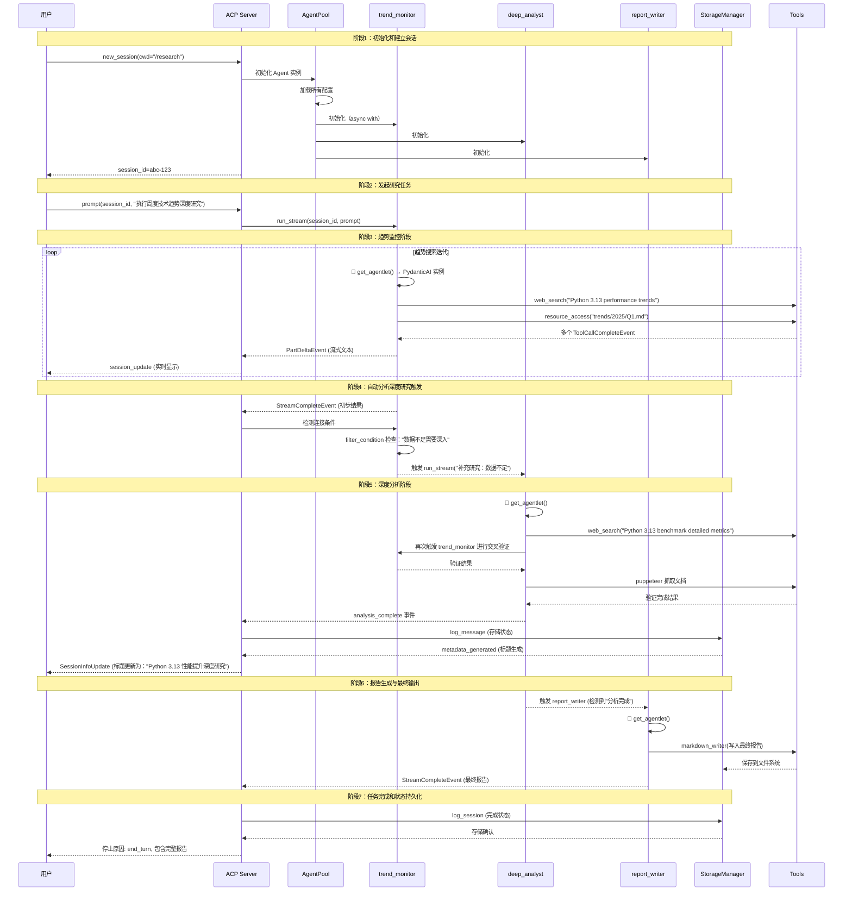
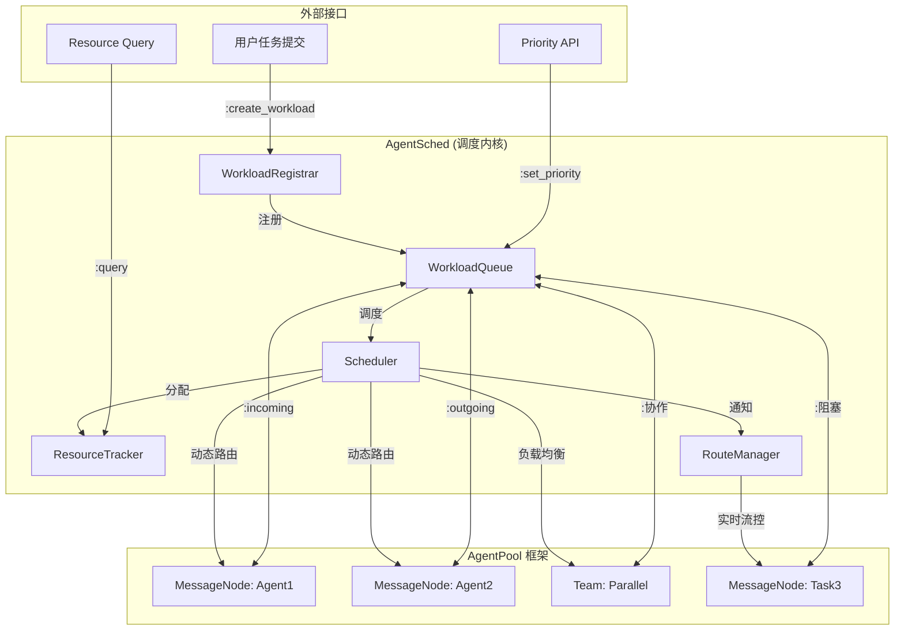

# AgentPool：面向AgentOS的统一编排系统技术报告

## 摘要

AgentPool异构Agent统一编排框架：通过统一MessageNode抽象、协议桥接层和配置驱动的协作模式，解决异构多Agent协作的复杂性挑战，提出面向AgentOS的AgentSched方案。

---

## 一、业务场景

### 1.1 企业级 AI Agent 协作需求

- **代码研发场景**：同时使用 Claude Code（重构）、Codex（高级推理）、自定义分析 Agent
- **自动化研究场景**：长时运行的深度调研任务，涉及多轮搜索、分析、验证、报告生成
- **流程编排场景**：客户服务、数据分析、内容生成的端到端自动化流程

### 1.2 多协议异构 Agent 生态

主流 AI Agent 生态系统碎片化严重：
- **Claude Code**：独立运行，外部进程调用
- **OpenAI Codex**：支持ACP协议通信
- **Open Code**：
- **Goose**：ACP协议兼容的专用 Agent
- **AG-UI Agents**：HTTP/WebSocket 协议的远程 Agent

### 1.3 长时任务自动化的核心诉求

以「深度技术研究」为例的复杂场景：
- **多阶段流程**：信息收集 → 深度分析 → 结论验证 → 报告生成
- **动态分支**：根据分析结果自动进入不同处理路径
- **人机协同**：在关键决策点允许人工介入确认
- **状态持久化**：支持任务中断后恢复和断点续接
- **资源协调**：合理分配不同能力等级的 Agent

---

## 二、问题挑战

### 2.1 协议碎片化与集成复杂度

**痛点**：每种 Agent 都有独立的 API 和协议
```
Claude Code → ACP Protocol (JSON-RPC + STDIO)
Codex      → 类 JSON 流式通信  
Goose      → ACP Protocol
OpenAI API → OpenAI-compatible REST API
```

**挑战**：
- 编写大量胶水代码适配不同 Agent
- 协议升级导致的维护成本高
- 无法在运行时动态切换 Agent 实现相同能力

### 2.2 协作编排与状态管理

**痛点**：多个 Agent 协作需要复杂的状态协调
```
Research Agent (产生初步结果) 
    ↓ ❌ 需要手动传递结果
Analysis Agent (深度分析)
    ↓ ❌ 需要手动触发
Report Generator (生成最终输出)
```

**挑战**：
- Agent 之间缺乏统一的通信标准
- 状态丢失导致任务无法断点续接
- 异步协作难以实现原子性保证

### 2.3 配置管理与可扩展性

**痛点**：Agent 行为变更需要修改代码
```python
# 硬编码的 Agent 初始化
agent1 = ClaudeCodeAgent(model="claude-3-sonnet-4")
agent2 = CodexAgent(model="gpt-5-beta")
# 任务变更需要修改顺序和参数
```

**挑战**：
- 缺乏声明式配置，运维友好性差
- 新 Agent 类型接入需要大量代码变更
- 难以可视化管理和监控 Agent 网络

### 2.4 长时任务的生命周期管理

**痛点**：长时间运行任务的复杂性
```
❓ 任务如何暂停和恢复？
❓ 如何跟踪多个子任务的进度？
❓ 部分失败如何恢复而不是重头开始？
❓ 资源泄漏如何避免？
```

**挑战**：
- 缺乏全局事务支持
- 进度可视化困难
- 资源清理机制不完善

---

## 三、业界洞察

### 3.1 现有技术方案比较

| 方案 | 优势 | 局限性 | 适用场景 |
|------|------|--------|----------|
| **LangChain** | 生态丰富，文档完善 | 状态管理弱，长时任务支持有限 | 短时单次调用 |
| **AutoGen** | 多 Agent 对话能力强 | 状态可观测性不足，调试困难 | 多轮对话任务 |
| **CrewAI** | 任务分解清晰，Pipeline 丰富 | 异构协议支持弱 | 结构化工作流 |
| **Swarm AI** | 多样化任务执行 | 缺乏统一配置，状态管理复杂 | 小规模协作 |

### 3.2 AgentOS 发展趋势

**关键洞察**：
1. **通信标准化**：Agent Communication Protocol (ACP) 引入统一代理层的能力
2. **状态中心化**：存储和会话管理将成为 AgentOS 的核心基础设施
3. **自调度能力**：Agent 需要自主推断何时调用其它 Agent、何时需要更多资源
4. **能力发现与协商**：Agent 动态发现其他 Agent 的能力并协商最佳协作模式
5. **容错与自愈**：单个 Agent 失败不影响整体任务流load

### 3.3 技术演进方向

```
第一代：单体 AI 服务（单一 API 调用）
第二代：工具调用增强（Function Calling）
第三代：多 Agent 协作（LangChain, AutoGen 阶段）
第四代：操作系统级编排（AgentOS 阶段）🌟
```

**AgentOS 特征**：
- 统一抽象层（类似 OS 的进程概念）
- 资源管理（CPU、GPU、存储、网络）
- 通信协议（进程间通信）
- 调度器（决定哪个 Agent 获得资源）
- 文件系统（统一的知识和代码访问）

---

## 四、解决方案

### 4.1 AgentPool 核心架构

**设计理念**：YAML 配置驱动、协议桥接、统一抽象

```
                   ┌─────────────────┐
                   │   AgentPool     │ (统一编排层)
                   └────────┬────────┘
                            │
        ┌───────────────────┼───────────────────┐
        │                   │                   │
┌───────▼──────┐   ┌────────▼──────┐   ┌───────▼──────┐
│ ACP Server   │   │ OpenCode Srv  │   │ MCP Server   │
└──────────────┘   └───────────────┘   └──────────────┘
        │                   │                   │
┌───────▼───────────────────▼───────────────────▼───────┐
│                   MessageNode[Input, Output]           │
│              (统一抽象层 - Agent & Team)               │
└───────────────┬───────────────────────┬───────────────┘
                │                       │
┌───────────────▼───────┐   ┌─────────────▼──────────┐
│  NativeAgent           │   │  External Agents      │
│  (PydanticAI)          │   │  Claude Code, Codex   │
└───────────────┬────────┘   └─────────────┬───────────┘
                │                       │
┌───────────────▼───────────────┐   ┌───▼──────────────────┐
│  ToolManager (工具链)        │   │  MCPManager (资源)  │
│  subagent, web_search, etc.  │   │  filesystem, etc.    │
└──────────────────────────────┘   └──────────────────────┘
```

### 4.2 统一抽象：MessageNode

**核心设计**：所有处理单元（Agent 和 Team）继承自 `MessageNode[TInput, TOutput]`

```python
class MessageNode[TDeps, TResult](ABC):
    """所有消息处理节点的基类"""
    
    # 信号系统用于事件传递
    message_received = Signal[ChatMessage]()
    message_sent = Signal[ChatMessage]()
    
    # 统一的处理接口
    async def run(self, *prompts: Any) -> ChatMessage[TResult]
    async def run_stream(self, *prompts: Any) -> AsyncIterator[RichAgentStreamEvent]
    
    # 连接管理
    def connect_to(...) -> Talk[TResult]
    
    # 上下文获取
    def get_context(...) -> NodeContext
```

**类型安全**：
- Agent[DependenciesType, ResultType]
- 保证编译时类型检查
- 支持 `agent >> other_agent` 操作符重载

### 4.3 协议桥接层实现

**统一 Agent 类型映射表**：

```yaml
agents:
  # PydanticAI 原生 Agent
  native_agent:
    type: native
    model: anthropic:claude-sonnet-4-5
    tools: [websearch, subagent]
  
  # Claude Code Direct Integration
  claude_coder:
    type: claude_code
    cwd: /project/
    model: claude-3-5-sonnet
  
  # OpenAI Codex
  codex_expert:
    type: codex
    model: gpt-5.1-codex-max
    reasoning_effort: medium
  
  # ACP Protocol Agent (Goose, etc.)
  goose_worker:
    type: acp
    provider: goose
  
  # AG-UI HTTP Agent
  remote_service:
    type: agui
    url: http://api.example.com/agent
```

**协议适配器**：
```python
class ACPServer(BaseServer):
    """ACP 协议桥接"""
    async def _start_async(self):
        await serve(
            create_acp_agent=functools.partial(
                AgentPoolACPAgent,
                default_agent=self.default_agent,
                server=self
            ),
            transport=self.transport
        )

class OpenCodeServer(BaseServer):
    """OpenCode API 兼容桥接"""
    def run(self):
        uvicorn.run(self.app, host=self.host, port=self.port)
```

### 4.4 Team 模式与连接系统

**两种协作模式**：

```python
# 并行模式：同时执行多个 Agent
team = agent1 & agent2 & agent3
results = await team.run("同时处理主题")  # 返回所有结果的列表

# 顺序模式：管道式传递
pipeline = researcher | analyzer | reporter
final = await pipeline.run("深度研究报告")  # 按顺序级联处理
```

**智能连接过滤**：

```yaml
connections:
  - type: node
    name: deep_analyzer
    filter_condition:
      type: word_match
      words: [需要深入, 继续研究, 发现新问题]
    stop_condition:
      type: word_match
      words: [任务完成, 没有必要深入]
```

**关键特性**：
- 自动传递：Agent 执行结果自动触发连接的下一个 Agent
- 延迟连接：Agent 可以在运行前连接，也可以动态添加
- 上下文传递：session_id、parent_id 自动追踪

### 4.5 配置驱动的编排系统

**AgentsManifest：单一配置源**

```yaml
name: research_orchestrator

resources:
  knowledge_base: "file://./docs/**/*.md"
  data: "s3://research-data/bucket"

agents:
  info_collector:
    type: native
    model: anthropic:claude-sonnet-4-5
    system_prompt: |
      负责信息收集和初步筛选。
      使用 web_search 获取实时信息，从 knowledge_base 检索历史资料。
    tools:
      - name: web_search
      - type: resource_access
    knowledge:
      paths: ["docs/**/*.md"]
  
  deep_analyzer:
    type: native
    model: openai:gpt-4o
    system_prompt: |
      深度分析收集的信息，验证结论并提出改进建议。
    connections:
      # 仅当发现需要深入时自动触发
      - type: node
        name: info_collector
        filter_condition:
          type: subagent
          deep_research: true
  
  report_generator:
    type: native
    model: anthropic:claude-sonnet-4-5
    system_prompt: |
      生成结构化的研究报告，包含 Executive Summary 和详细分析。
    tools:
      - name: markdown_writer
    environments:
      write:
        permissions: [read, write]

teams:
  research_pipeline:
    mode: sequential
    members: [info_collector, deep_analyzer, report_generator]

storage:
  providers:
    - type: sql
      connection_string: sqlite:///agentpool.db
  compact_summaries: true

mcp_servers:
  - "uvx mcp-server-filesystem"
  - "uvx mcp-server-brave-search"

jobs:
  scheduled_report:
    schedule: "0 9 * * MON"  # 每周一上午9点
    agent: deep_analyzer
    prompt: "执行每周行业趋势分析"
```

---

## 五、实际案例：长时自动研究端到端流程

### 5.1 场景描述

**业务目标**：实现一个自动化的「技术趋势深度研究」系统，能够：
1. 定期收集技术趋势信息
2. 深度分析和生成洞察
3. 自动产出易读的研究报告
4. 支持人机协同确认关键决策
5. 任务中断后可恢复

### 5.2 配置设计

```yaml
# research.yml
agents:
  trend_monitor:
    type: native
    model: openai:gpt-4o
    system_prompt: |
      技术趋势监控 Agent，负责：
      - 使用 web_search 获取最新技术动态
      - 从知识库检索历史数据
      - 识别关键趋势点
    tools:
      - web_search
      - type: resource_access
    knowledge:
      paths: ["trends/**/*.md"]
  
  deep_analyst:
    type: native
    model: anthropic:claude-sonnet-4-5
    system_prompt: |
      深度分析专家，负责：
      - 技术可行性和趋势验证
      - 多源数据交叉验证
      - 识别洞察和机会
    connections:
      # 触发深度研究的条件
      - type: node
        name: trend_monitor
        filter_condition:
          type: word_match
          words: [需要深入, 数据不足, 验证结论]
    retries: 3
    output_retries: 5
  
  report_writer:
    type: native
    model: anthropic:claude-sonnet-4-5
    system_prompt: |
      报告撰写专家，负责：
      - Markdown 格式化
      - Executive Summary 提炼
      - 可视化建议
    connections:
      - type: node
        name: deep_analyst
        filter_condition:
          type: word_match
          words: [分析完成, 发现洞察]
    tools:
      - markdown_writer
      - type: last_subagent_experiment
    model_settings:
      temperature: 0.3  # 更具创意

teams:
  auto_research:
    mode: sequential
    members: [trend_monitor, deep_analyst, report_writer]
    shared_prompt: "执行周度技术趋势深度研究"

storage:
  providers:
    - type: sql
      connection_string: postgresql://localhost/agentpool
    - type: zed
      # Zed IDE 存储集成用于可视化
  enable_compaction: true

mcp_servers:
  - "uvx mcp-server-filesystem"
  - "uvx mcp-server-puppeteer"  # 网页抓取
```

### 5.3 端到端执行流程



### 5.4 关键状态持久化

**SessionData 结构**：
```python
SessionData(
    session_id="abc-123",
    agent_name="trend_monitor",
    cwd="/research",
    title="Python 3.13 性能提升深度研究",  # 自动生成
    metadata={
        "protocol": "acp",
        "mcp_server_count": 2,
        "core_analysis_complete": True,
        "deep_research_triggered": True,
        "final_report_generated": True
    },
    # 在 StorageManager 中持久化
    conversation_history=[...],
    checkpoints=[...]  # 断点支持
)
```

**断点续接机制**：
```python
# 用户重新连接
User->>ACP: load_session(session_id="abc-123")
ACP->>Storage: load_session(session_id)
Storage-->>ACP: SessionData (完整历史)
ACP->>TM: 恢复 Agent 状态（填充 conversation）
ACP->>DA: 恢复 Agent 状态
ACP->>RW: 恢复 Agent 状态
ACP-->>User: 会话恢复完成，显示历史交互
```

### 5.5 人机协同决策点

**工具确认模式配置**：
```yaml
agents:
  report_writer:
    tool_confirmation_mode: per_tool
    # 关键决策需要人工确认
    system_prompt: |
      在以下情况需要人工确认：
      - 报告结论与历史数据冲突时
      - 检测到潜在风险或不确定性时
```

**实际交互流程**：
```
[Agent] 检测到：性能提升幅度为 45%，但历史基准数据为 30%
[Agent] 请求人工确认 → 事件：tool_confirmation_required
[User] (Zed IDE) → 确认修改或提供新数据 → 事件：tool_confirm_response
[Agent] 使用新数据继续分析
```

---

## 六、演进趋势

### 6.1 当前阶段：编排友好的框架

**现状**：
- PydanticAI 提供坚实的基础模型
- AgentPool 提供统一配置和协作接口
- 支持多协议桥接

**能力范围**：
- ✅ 声明式配置 Agent 定义
- ✅ 自动连接和多 Agent 协作
- ✅ 协议桥接（ACP、OpenCode、MCP）
- ✅ 基础状态持久化
- ✅ 流式事件处理

### 6.2 中期演化：OSS 级特性（Operational State State）

**即将到来的能力**：
- 🔮 **资源感知调度**：Agent 感知 GPU、内存、网络状态
- 🔮 **自动能力协商**：Agent 主动发现和协商最佳路径
- 🔮 **全局资源池**：统一管理所有 Agent 的资源需求
- 🔮 **可观测性矩阵**：分布式追踪、性能监控、告警系统

### 6.3 长期方向：AgentOS（AI Agent 操作系统）

**AgentOS 核心特性**：

| 特性 | 描述 | 现状 |
|------|------|------|
| **进程管理** | Agent 进程、组、命名空间 | MessageNode 基础实现 |
| **调度器** | 优先级调度、公平调度、实时调度 | ❌ 待设计 |
| **内存管理** | 短期记忆、长期记忆、淘汰策略 | MemoryConfig 已有，需完善 |
| **文件系统** | 统一知识库、VFS 抽象、权限控制 | VFS 基础实现 |
| **网络子系统** | 协议栈、路由、安全 | 协议桥接已有，路由需完善 |
| **安全机制** | 认证、授权、沙箱隔离 | 基础 hooks，需扩产 |

---

## 七、AgentSched：面向 AgentOS 的创新调度方案

### 7.1 问题定义

**当前 AgentPool 的限制**：
1. **静态连接**：Agent 间的连接在启动时确定， runtime 动态重路由复杂
2. **资源不感知**：Agent 不知道 GPU、内存、网络瓶颈，无法自优化
3. **调度无全局视图**：多个并发的协作任务没有全局调度器协调
4. **优先级缺失**：所有任务平等执行，无法区分 critical/batch 任务

### 7.2 AgentSched 架构设计



### 7.3 AgentSched 核心能力

#### 7.3.1 WorkloadRegistrar（工作负载注册）

```python
class WorkloadRegistrar:
    """所有进入 AgentPool 的任务都需要注册"""
    
    async def register_workload(
        self,
        nodes: Sequence[MessageNode],
        mode: ExecutionMode = "standard",
        priority: Priority = Priority.Normal,
        deadline: datetime | None = None,
        constraints: ResourceConstraints | None = None,
        labels: dict[str, str] | None = None
    ) -> WorkloadID:
        """注册一个工作负载（可以是单个 Agent 或 Team）
        
        Args:
            nodes: 参与工作的节点列表
            mode: 执行模式 (standard, realtime, batch)
            priority: 优先级
            deadline: 截止时间
            constraints: 资源约束（GPU、内存等）
            labels: 用于调度的标签（如部门、项目、安全级别）
        
        Returns:
            工作负载唯一标识符
        """
        workload_id = WorkloadID.generate()
        
        workload = Workload(
            id=workload_id,
            nodes=list(nodes),
            mode=mode,
            priority=priority,
            created_at=utcnow(),
            deadline=deadline,
            constraints=constraints or ResourceConstraints(),
            labels=labels or {},
            state=WorkloadState.REGISTERED
        )
        
        await self.queue.put(workload)
        return workload_id
```

#### 7.3.2 WorkloadQueue（工作负载队列）

```python
class WorkloadQueue:
    """优先级队列与调度策略"""
    
    def __init__(self, max_size: int = 10000):
        self._reserved = asyncio.Queue预留(区域)  # 高优先级
        self._interactive = asyncio.Queue[int](20)  # 实时类
        self._standard = asyncio.Queue[int](max_size)  # 标准类
        self._batch = asyncio.Queue[int](1000)  # 批处理类

    async def get(self) -> Workload:
        """获取下一个可调度的 workload
        
        策略：
        1. 首先检查 reserved 队列（critical）
        2. 然后检查 interactive 队列（实时）
        3. 最后检查 standard 和 batch 队列（基于权重）
        """
        # 轮询并返回下一个任务，优先级队列调度逻辑
```

#### 7.3.3 Scheduler（调度器核心）

```python
class Scheduler:
    """AgentOS 核心调度器"""
    
    async def schedule_loop(self) -> None:
        """主调度循环
        
        这是 AgentSched 的核心调度引擎：
        1. 持续从队列取出 workload
        2. 分配资源
        3. 调度执行
        4. 监控状态
        5. 动态调整
        """
        while not self._shutdown.is_set():
            workload = await self.queue.get()
            
            # 资源预留
            if not await self.resources.reserve(workload.constraints):
                # 资源不可用，重新排队
                await self.queue.requeue(workload)
                continue
            
            # 动态路由计算
            route = await self.router.compute_route(workload)
            
            # 调度执行
            execution = await self.executor.execute(
                workload, 
                route=route
            )
            
            # 并发监控
            self.monitor.track(workload.id, execution)
```

#### 7.3.4 ResourceTracker（资源追踪）

```python
class ResourceTracker:
    """OS 级别的资源管理器"""
    
    def __init__(self):
        # GPU 资源池
        self._gpu_pool: dict[str, GPUAllocation] = {}
        # 内存使用
        self._memory_tracker = MemoryTracker()
        # 网络带宽分配
        self._network_shaper = NetworkShaper()
        # Agent 容量感知
        self._agent_capacity = {}  # agent_id → capacity_status

    async def reserve(self, constraints: ResourceConstraints) -> bool:
        """预留资源
        
        关键决策点：
        - GPU 是否可用（可用数量、类型匹配）
        - 内存是否满足
        - 是否达到并发限制
        - Agent 容量检查
        """
        for gpu_req in constraints.gpu_requirements:
            if not self._check_gpu_available(gpu_req):
                return False
        
        return await self._allocate_resources(constraints)

    async def update_agent_capacity(
        self, 
        agent_name: str, 
        metrics: AgentMetrics
    ) -> None:
        """更新 Agent 容量状态
        
        Agent 可以报告其当前能力，以便调度器决策：
        - 当前队列深度
        - 估计延迟
        - 错误率
        - 质量指标
        """
        capacity = AgentCapacity(
            queue_depth=metrics.queue_depth,
            estimated_latency=metrics.estimated_latency,
            error_rate=metrics.error_rate,
            quality_score=metrics.quality_score,
            last_updated=utcnow()
        )
        self._agent_capacity[agent_name] = capacity
```

#### 7.3.5 RouteManager（路由管理）

```python
class RouteManager:
    """动态路由和负载均衡"""
    
    async def compute_route(self, workload: Workload) -> Route:
        """为 workload 计算最佳路由
        
        路由算法考虑：
        1. 能力匹配（Agent 技能匹配 workload 需求）
        2. 容量可用（Agent 有足够容量处理）
        3. 延迟目标（满足 workload 延迟要求）
        4. 成本优化（在约束下最小化资源使用）
        5. 安全隔离（workload 标签约束）
        """
        # 候选节点列表（基于开放性约束）
        candidates = self._filter_candidates(workload)
        
        # 容量过滤（移除过载节点）
        candidates = self._filter_by_capacity(candidates)
        
        # 路由决策（使用评分函数）
        if workload.mode == ExecutionMode.REALTIME:
            # 最短路径
            route = self._shortest_path(candidates, deadline=workload.deadline)
        elif workload.mode == ExecutionMode.BATCH:
            # 成本优化
            route = self._cost_optimized(candidates)
        else:
            # 质量优先
            route = self._quality_optimized(candidates)
        
        return route

    async def update_route(self, workload_id: WorkloadID) -> None:
        """动态重路由
        
        在以下情况下触发：
        1. 原路由节点失败
        2. 性能指标不达标
        3. 资源状态变化
        4. 工作负载优先级变更
        """
        # 获取当前执行状态
        execution = await self.executor.get_execution(workload_id)
        if not execution or execution.is_completed():
            return
        
        # 确定重路由点（checkpoint 支持）
        checkpoint = execution.find_last_stable_checkpoint()
        
        # 计算新路由
        new_route = await self.compute_route(execution.workload)
        
        # 应用重路由
        await self.executor.apply_reroute(workload_id, checkpoint, new_route)
```

### 7.4 AgentSched 与 AgentPool 集成

**代理式集成（模式）**：

```python
class AgentPoolV2[N](AgentPool[N]):
    """下一代 AgentPool，内置 AgentSched 能力"""
    
    def __init__(self, manifest: AgentsManifest, *, enable_scheduling: bool = True):
        super().__init__(manifest)
        self._scheduler = Scheduler(self) if enable_scheduling else None
    
    async def run_workload(
        self,
        name: str | None = None,
        nodes: Sequence[MessageNode] | None = None,
        mode: ExecutionMode = ExecutionMode.STANDARD,
        priority: Priority = Priority.Normal
    ) -> WorkloadID:
        """运行工作负载（可通过调度器或直接执行）
        
        这是 AgentSched 集成的关键 API：
        
        Args:
            name: 工作负载名称（可选）
            nodes: 参与节点（默认使用当前 pool 节点）
            mode: 执行模式
            priority: 优先级
        """
        if self._scheduler is None:
            # 直接执行（兼容路径）
            result = await self._run_direct(name, nodes)
            return WorkloadID(f"direct-{result.id}")
        
        # 通过调度器执行
        return await self._scheduler.register_workload(
            nodes=nodes or list(self.nodes.values()),
            mode=mode,
            priority=priority
        )

    async def prioritize(self, workload_id: WorkloadID, priority: Priority) -> bool:
        """动态优先级调整"""
        return await self._scheduler.update_priority(workload_id, priority)
```

**向后兼容**：
```python
# 现有代码继续工作（直接执行）
async with AgentPool("config.yml") as pool:
    result = await pool.main_agent.run("简单查询")  # 直接路径

# 新能力：通过调度器执行
async with AgentPool("config.yml") as pool:
    workload_id = await pool.run_workload(
        name="深度研究",
        mode=ExecutionMode.REALTIME,
        priority=Priority.CRITICAL
    )
    
    # 获取执行状态
    status = await pool.scheduler.get_workload_status(workload_id)
    while not status.is_completed:
        await asyncio.sleep(1)
        status = await pool.scheduler.get_workload_status(workload_id)
        status.progress.display()  # 显示进度
```

### 7.5 高级特性

#### 7.5.1 Checkpoint 与容错

```python
class CheckpointManager:
    """检查点管理"""
    
    async def create_checkpoint(
        self, 
        workload_id: WorkloadID,
        checkpoint: Checkpoint
    ) -> CheckpointID:
        """创建检查点
        
        检查点包含：
        - 执行位置（节点索引、上下文）
        - 状态快照（Agent 各自状态）
        - 消息历史（最近 N 条消息）
        - 资源快照（GPU/内存状态）
        """
        
    async def restore_from(
        self, 
        checkpoint_id: CheckpointID
    ) -> ExecutionContext:
        """从检查点恢复执行
        
        恢复步骤：
        1. 加载状态快照
        2. 重构执行上下文
        3. 恢复消息历史
        4. 分配相同资源
        5. 从恢复位置继续执行
        """
```

#### 7.5.2 动态缩放

```python
class AutoScaler:
    """自动缩放感知"""
    
    async def scale_agent(self, agent_name: str, factor: float) -> bool:
        """动态缩放 Agent（通过代理模式实现）
        
        策略：
        1. 在资源池中分配更多副本
        2. 监控队列深度
        3. 分配副本处理
        4. 每个副本可独立处理一部分任务
        """
        if factor <= 1.0:
            return True
        
        # 启动副本实例
        replicas = []
        for i in range(int(factor) - 1):
            replica_name = f"{agent_name}-replica-{i}"
            replica = self._create_replica(agent_name, replica_name)
            replicas.append(replica)
        
        # 启动所有副本
        await asyncio.gather(*[replica.initialize() for replica in replicas])
        return True
```

#### 7.5.3 性能预测

```python
class PerformancePredictor:
    """性能预测器"""
    
    async def predict_completion(
        self,
        workload: Workload
    ) -> CompletionPrediction:
        """预测完成时间
        
        基于因素：
        - 历史性能数据（相似工作负载）
        - 当前系统负载
        - 资源分配
        - 预期延迟指标
        """
        # 分布式图神经网络（用于预测执行路径时间）
        # 输入图结构（节点 = Agent，边 = 连接）
        # 历史执行数据作为训练样本
        # 输出：预测的时间、成本、资源使用
        
        return CompletionPrediction(
            estimated_time=timedelta(minutes=45),
            time_confidence=0.85,
            estimated_cost=TokenCost(amount="0.45"),
            resource_usage=ResourceEstimate(...)
        )
```

### 7.6 使用场景示例

**场景1：实时关键工作负载**
```python
# 实时告警更新
workload_id = await pool.run_workload(
    name="security-alert-response",
    mode=ExecutionMode.REALTIME,
    priority=Priority.CRITICAL,
    nodes=[analyzer, responder]
)

# 监控和自动优先级调整
while not completed:
    if await pool.scheduler.get_metric(workload_id, "queue_wait") > timedelta(minutes=5):
        await pool.prioritize(workload_id, Priority.MAXIMUM)
```

**场景2：批处理大规模任务**
```python
# 大规模代码库分析
workload_id = await pool.run_workload(
    name="monorepo-depth-analysis",
    mode=ExecutionMode.BATCH,
    priority=Priority.LOW,
    nodes=[deep_analyzer.auto_scaled(factor=8)],  # 8 倍缩放
    constraints=ResourceConstraints(gpu="A100:8")
)
```

**场景3：自恢复执行**
```python
# 标准模式（自动重试和恢复）
workload_id = await pool.run_workload(
    name="long-running-research",
    mode=ExecutionMode.STANDARD,
    priority=Priority.NORMAL,
    labels={"project": "ai-research", "tier": "production"},
    checkpoint_interval="10m"  # 每10分钟检查点
)
```

---

## 八、总结与前瞻

### 8.1 技术价值总结

AgentPool 框架通过以下创新解决当前 Agent 编排的挑战：

1. **统一抽象层**：`MessageNode` 提供类型安全的 Agent 和 Team 统一接口
2. **协议桥接**：通过 ACP、OpenCode、MCP 服务器实现无缝协议集成
3. **配置驱动**：YAML 声明式配置大幅简化 Agent 定义和协作管理
4. **连接系统**：`>>` 和 `|` 操作符直观表达Agent间关系
5. **状态持久化**：StorageManager 实现会话和消息的可恢复性
6. **事件流**：RichAgentStreamEvent 实现细粒度执行可观测性

### 8.2 向 AgentOS 的演进路径

```
阶段 1（当前）：AgentPool 友好框架 ✅
- 统一抽象 + 协议桥接
- 配置驱动协作
- 基础状态管理

阶段 2（半年内）：AgentSched 原型 🔜
- 工作负载注册和队列
- 资源追踪和感知
- 基础调度和路由

阶段 3（1年内）：AgentOS MVP 🔮
- 完整调度内核
- 分布式 Agent 执行
- 全局可观测性

阶段 4（2年内）：AgentOS 生态系统 🌟
- Agent 商店和发现
- 能力市场
- 标准化安全机制
```

### 8.3 开源与社区策略

**建议实施路线**：

**Phase 1：核心增强（3-6月）**
- ✅ 池内调度框架原型
- ✅ 资源追踪器实现
- ✅ 工作负载队列 API

**Phase 2：高级特性（6-12月）**
- 🔮 分布式 Agent 执行支持
- 🔮 检查点和容错机制
- 🔮 性能预测模型训练

**Phase 3：生态集成（12-18月）**
- 🌟 Agent 能力市场
- 🌟 安全和隔离框架
- 🌟 标准化能力描述语言

---

## 附录：术语与参考

### 术语表

| 术语 | 定义 |
|------|------|
| **MessageNode** | AgentPool 的统一抽象，所有消息处理单元的基础类 |
| **Workload** | AgentOS 调度单元，包含一个或多个 Agent 和约束 |
| **AgentSched** | 面向 AgentOS 的调度器，负责工作负载调度 |
| **Checkpoint** | 执行路径中的稳定状态点，用于恢复 |
| **ResourceConstraints** | Agent 对计算资源的约束需求 |
| **ACP** | Agent Communication Protocol，标准化 Agent 通信 |
| **VFS** | 虚拟文件系统，资源访问抽象 |

### 参考实现

- AgentPool: [github.com/phil65/agentpool](https://github.com/phil65/agentpool)
- ACP Specification: [github.com/modelcontextprotocol](https://github.com/modelcontextprotocol)
- PydanticAI: [github.com/pydantic-ai](https://github.com/pydantic-ai)

---

**报告编写日期**：2026-04-25  
**相关代码**：/usr1/code/agentpool/（AgentPool 框架）
