# AgentRuntimeFabric 架构设计说明书

| 项 | 内容 |
| --- | --- |
| 文档版本 | v1.0 |
| 文档状态 | 架构评审稿 |
| 编写日期 | 2026-05-07 |
| 基线材料 | `AgentRuntimeFabric-Architecture-Implementation.md` |
| 适用阶段 | 架构评审、MVP 拆解、开源治理、后续实现 |
| 目标读者 | 架构评审委员会、平台工程负责人、安全负责人、Runtime/Workflow/Agent 框架开发者、开源维护者 |

## 0. 执行摘要

AgentRuntimeFabric，以下简称 ARF，是开源、模型无关、可自托管的 Agent Runtime Fabric。它位于 Agent SDK/Harness 与 sandbox/runtime backend 之间，为长时运行、会修改代码仓库的 Agent 提供可恢复、可审计、受策略约束、backend 可替换的控制面。

ARF 的核心定位不是再实现一个 Agent SDK、聊天框架、sandbox 产品或 CI 系统，而是提供一个面向代码变更型 Agent 的开放 change-control runtime fabric:

> Every action is leased, every workspace change is lineage-tracked, every artifact is evidence, and every runtime backend is replaceable.

本架构设计基于以下关键判断：

- Durable workflow、sandbox snapshot、MCP、多 Agent、企业治理本身已经被主流和前沿方案验证，不应作为 ARF 的单点差异化。
- 开源生态仍缺少一个把 workflow、workspace lineage、policy lease、runtime adapter、ChangeSet、EvidenceGraph 和 replay 统一成开放 schema 的自托管控制面。
- ARF 首个可信闭环必须聚焦代码仓库变更任务，而不是泛化的聊天式 Agent 自动化。
- MVP 的第一性验证是 kill-and-recover: worker/runtime 真实失败后，任务能基于 `EventLog`、checkpoint、workspace snapshot 和 artifact 恢复，并能解释因果链。

本说明书采用架构评审视角组织，而非实现任务清单。文档先定义目的、问题背景、术语约定、架构驱动力和系统边界，再进入概念模型、关键技术方案、架构设计视图、治理机制和发布验收标准。

## 1. 简介

### 1.1 目的

本文的目的有四个：

| 目的 | 说明 |
| --- | --- |
| 架构评审 | 为领域专家评审 ARF 的长期边界、对象模型、安全模型和可演进性提供完整依据 |
| 实现对齐 | 为后续服务拆分、接口设计、schema 定义、contract tests 和 MVP 交付建立统一基线 |
| 开源治理 | 明确哪些对象和协议属于 ARF 公共契约，哪些外部能力必须通过 adapter 和防腐层接入 |
| 风险控制 | 明确 MVP 降级边界、威胁模型、运维失效场景和架构适应度函数，避免概念过多导致不可交付 |

本文不是：

- 不是 README、市场叙事或产品介绍页。
- 不是最终代码实现说明。
- 不是某个单一开源项目的 fork 改造方案。
- 不是对所有未来能力的承诺清单。

本文是架构级契约。实现可以演进，但核心对象、不变式、协议边界、质量目标和安全约束必须保持稳定或通过 ADR 显式变更。

### 1.2 问题背景与设计回答

ARF 要解决的问题是：当前大量 coding agent 和 agentic workflow 能够调用工具、运行命令、修改文件，但在长任务、失败恢复、权限治理、证据链、多人协作和 backend 替换方面缺少统一平台边界。典型问题包括：

- Agent 进程、worker 或 sandbox 退出后，任务上下文、文件现场、日志和决策原因丢失。
- Agent 直接拥有 shell、网络、secret 或 Git token，策略和审批依赖模型自觉遵守。
- 多个 Agent 在同一目录并发修改，无法追踪谁改了什么、为什么改、能否回滚。
- 工具调用、MCP server、runtime backend、workflow engine 各自有日志，但无法形成跨对象因果证据链。
- 使用某个云 sandbox 或托管平台后，核心状态、snapshot id、runtime id 和事件语义被供应商绑定。

ARF 的设计回答是：

- 用 `WorkflowRun` 和 `Task` 管理长任务生命周期。
- 用 `Workspace`、`WorkspaceBranch`、`Snapshot` 和 `ChangeSet` 管理代码现场和变更。
- 用 `PolicyDecision`、`ExecutionLease`、`Approval`、`SecretGrant` 管理跨边界执行权。
- 用 `RuntimeAdapter` 和 `RuntimeCapabilities` 接入异构 runtime backend。
- 用 `EventLog`、`Artifact`、`EvidenceGraph` 和 `Replay` 管理可审计事实和调试恢复。
- 用 `ContextPack`、`KnowledgeMount` 和 `Skill` 作为事实投影和经验复用，不让它们成为事实源或权限来源。

### 1.3 术语与命名约定

为避免后文在通用概念和 ARF 公共对象之间混用，本文采用以下命名约定：

| 术语类别 | 约定 |
| --- | --- |
| 产品和系统 | 首次写 `AgentRuntimeFabric`，后文统一写 `ARF` |
| ARF 公共对象 | 使用 PascalCase 和代码样式，例如 `WorkflowRun`、`Task`、`ExecutionLease`、`RuntimeInstance`、`WorkspaceBranch`、`ChangeSet`、`PolicyDecision`、`EventLog`、`EvidenceGraph` |
| ARF 公共协议和 schema | 使用英文专名，例如 Control API、Event Protocol、Runtime Protocol、Adapter Admission Protocol、Event Envelope、RuntimeCapabilities、AdapterMapping |
| 外部实现和通用概念 | 使用小写普通名词，例如 runtime backend、workflow engine、policy engine、adapter、snapshot、artifact、context、skill |
| 事实源 | 仅指 `EventLog`、`Workspace`、`Snapshot`、`Artifact`、`PolicyDecision`、`ExecutionLease` 等不可变或可审计事实；`EvidenceGraph`、timeline、summary、`ContextPack`、`Skill` 是投影或复用载体 |
| 控制面 | 中文统一写“控制面”；图中可保留 Control Plane 作为架构平面英文名 |

本文刻意保留部分英文工程术语，例如 runtime、adapter、schema、artifact、snapshot、lease、replay、backend、workflow。原因是这些词在实现接口、schema 字段、状态机和开源生态中是稳定边界；中文解释用于说明语义，不替代对象名。

### 1.4 文档结构

| 章节 | 内容 |
| --- | --- |
| 1. 简介 | 目的、问题背景、术语约定、文档结构、已有架构借鉴和反思 |
| 2. 架构驱动力与原则 | 架构目标、关键需求、质量属性、假设约束、目标优先级、架构原则 |
| 3. 系统上下文与用例模型 | 系统边界、外部接口、关键用例和用例详述 |
| 4. 概念模型 | 领域定义、核心对象、对象关系、生命周期、不变式、能力地图和状态机 |
| 5. 关键技术方案 | Workflow、workspace、policy、runtime、evidence、governance、context、replay 等关键方案 |
| 6. 系统架构设计模型 | 总体平面、协议架构、逻辑模型、技术模型、数据模型、代码模型、构建模型、部署模型 |
| 7. 架构治理 | 架构适应度函数、ADR、发布闸门、开放问题和延后能力 |
| 8. 结论 | 评审结论和 MVP 成功标准 |

### 1.5 已有架构借鉴和反思

ARF 的架构不是从零凭空设计。它借鉴行业已有系统的成熟边界，同时避免把外部系统的内部模型绑定为 ARF 的公共契约。

| 已有方案类别 | 可借鉴内容 | 对 ARF 的反思 |
| --- | --- | --- |
| Agent SDK 和 coding agent | Agent、tool calling、handoff、guardrail、模型调用、代码修改体验 | ARF 不应再做重 prompt runner。Agent SDK/Codex-like agent 应作为 Harness 或 AgentActor 前端接入 |
| Durable workflow | checkpoint、retry、timer、signal、human-in-the-loop、deterministic replay | Durable workflow 是必要底座，不是 ARF 独占卖点。ARF 要把 durable workflow 绑定到 workspace、policy、evidence 和 ChangeSet |
| Sandbox 和 workspace 平台 | 远程 VM、container、snapshot、pause/resume、port、file API | Snapshot 技术不是 ARF 核心壁垒。ARF 的价值在于 capability normalization、lineage、policy 和 evidence |
| MCP、A2A、AG-UI | 工具协议、Agent 间互操作、Agent-UI 事件流 | 协议解决连接，不自动解决授权、secret、workspace 写入和 replay。ARF 内部仍需 ToolCall、A2AEnvelope、EventLog |
| 托管企业 Agent 平台 | Runtime、Memory、Gateway、Identity、Observability、Policy、Registry 的完整产品形态 | ARF 不应宣称“企业平台能力独有”，而应提供开源、自托管、schema 可检查、backend 可替换的替代控制面 |
| OpenTelemetry 和日志平台 | trace、metrics、logs、span 查询和成本分析 | OTel 是观测基础设施，不是 replay 事实源。ARF replay 必须回到 EventLog、Snapshot、Artifact、PolicyDecision |

总结性反思：

1. ARF 的差异化不是“也有 workflow/sandbox/policy”，而是这些能力以开放事实模型组合在一起。
2. ARF 必须把 runtime backend 当作可替换资源，而不是事实源。
3. ARF 的首个产品楔子应是代码变更控制，因为它有明确的 workspace、diff、test、review、merge 和 rollback 语义。
4. ARF 必须用 contract tests、schema lint 和 Adapter Mapping ADR 防止外部项目污染核心模型。

## 2. 架构驱动力与原则

### 2.1 架构目标

| 目标 | 说明 | 首个可验证闭环 |
| --- | --- | --- |
| 可恢复 | 长任务不依赖 worker、HTTP request 或 runtime 存活 | kill worker/runtime 后从 checkpoint、event cursor、snapshot 恢复 |
| 可审计 | 每个跨边界动作都有身份、策略、租约、输入输出和产物证据 | EvidenceGraph 查询 action -> policy -> artifact -> snapshot -> ChangeSet |
| 受策略约束 | Agent 只能提出 intent，执行权由 PolicyDecision 和 ExecutionLease 授予 | lease bypass fixture 必须失败 |
| workspace-first | 代码现场、依赖、日志、artifact、snapshot 统一进入 workspace lineage | ChangeSet 绑定 base/head snapshot、diff、test artifact |
| backend 可替换 | Docker/gVisor/E2B/Modal/Daytona/Firecracker/OpenHands 等作为 adapter backend | fake + container adapter 通过同一 contract tests |
| 开源自托管 | 无云账号、无闭源控制面可运行核心 demo | `arf demo recovery --repo <fixture>` |
| 可演进 | Agent SDK、policy engine、workflow engine、runtime backend 可替换 | public schema 版本化，外部能力通过 ADR 和防腐层接入 |

### 2.2 关键架构需求

| 编号 | 架构需求 | 设计响应 |
| --- | --- | --- |
| AR-01 | 长任务 durable，不依赖进程内存 | Durable Workflow Kernel、checkpoint、DB outbox、event cursor |
| AR-02 | runtime 可销毁，workspace 可恢复 | WorkspaceService、SnapshotStore、ArtifactStore、RuntimeAdapter |
| AR-03 | 跨边界动作必须授权 | PolicyEngine、ExecutionLeaseService、SandboxDaemon/ToolGateway enforcer |
| AR-04 | 高风险动作 human-in-the-loop | ApprovalService、WaitingApproval 状态、pre-approval snapshot |
| AR-05 | 代码变更可 review、merge、rollback | ChangeSet、WorkspaceBranch、ReviewDecision、MergeQueue |
| AR-06 | 证据链可查询 | EventLog、Artifact provenance、EvidenceGraph projector、Replay API |
| AR-07 | 多 runtime backend 不污染核心模型 | RuntimeCapabilities、AdapterMapping ADR、schema lint、contract tests |
| AR-08 | secret 和网络出口可控 | SecretBroker、SecretGrant、EgressGateway、redaction pipeline |
| AR-09 | 外部内容不能注入策略 | ContextPack trust level、Semantic Firewall、policy/context 分区 |
| AR-10 | 运维可修复 | Admin transition API、dead letter、GC dry-run、runtime reclaim、audit event |

### 2.3 关键质量属性场景

| 质量属性 | 场景 | 目标/验收 |
| --- | --- | --- |
| 可恢复性 | worker 在 Task Running 中被 kill | 新 worker 从 checkpoint 和 EventLog cursor 恢复，Task 不丢失 |
| 可恢复性 | container runtime OOM 或 heartbeat lost | 创建新 runtime，mount 最近 snapshot，workspace checksum 一致 |
| 安全性 | Agent 请求执行未授权命令 | PolicyDecision deny，daemon 不执行，返回可解释错误 |
| 安全性 | 伪造或过期 lease 调用 daemon | daemon 拒绝并写 security event |
| 审计性 | Reviewer 追查某个 diff 来源 | EvidenceGraph 能返回命令、actor、policy、snapshot、artifact、test report |
| 可移植性 | Docker adapter 替换为 remote sandbox | public API、Event schema、ChangeSet schema 不变 |
| 可运维性 | outbox 堆积或 artifact 缺失 | operator 能查看 lag、dead letter、missing artifact event，并执行可审计 repair |
| 性能 | 普通命令执行链路增加 policy/lease | policy evaluation 可缓存，lease 短期复用，MVP 不引入高延迟远程依赖 |
| 成本 | 审批等待时间很长 | 可 snapshot 并释放 runtime，审批恢复后重新申请 lease 和 runtime |
| 可演进性 | 引入 OPA/Cedar/Vault/Temporal | 对外仍输出 PolicyDecision、SecretGrant、WorkflowRun，不泄漏 backend schema |

### 2.4 假设与约束

| 类别 | 假设/约束 |
| --- | --- |
| MVP 运行环境 | PostgreSQL、local object/file store、Docker/container adapter、最小 sandbox-daemon |
| Snapshot 语义 | MVP 只承诺 filesystem snapshot 和 event cursor 恢复，不承诺 process/memory resume |
| Agent 信任 | Agent 输出、repo 文档、issue、网页、日志均不可信，不能作为系统指令 |
| 安全默认值 | 网络默认拒绝，写路径默认限制，高风险动作默认审批 |
| Secret | MVP 可使用 fake broker，真实 secret broker 后续接入，但 SecretGrant 契约先稳定 |
| 多 Agent | MVP 不支持并发写，后续通过 WorkspaceBranch 和 MergeQueue 支持 |
| 外部 backend | 云 sandbox、workflow engine、policy engine 只能作为 adapter 或实现 backend，不能成为 ARF 事实源 |
| 数据保留 | Event envelope 长期保留，payload/artifact/snapshot 按 retention class 和 reachability GC |
| 一致性 | Metadata 保存 current state，EventLog 保存事实历史，状态推进使用 optimistic concurrency |

### 2.5 架构目标优先级

MVP 阶段质量属性优先级如下：

1. 正确性和安全边界。
2. 恢复能力和证据完整性。
3. 开源本地可运行体验。
4. 可观测和可运维。
5. 性能和成本优化。
6. 多 runtime backend、多 Agent、Knowledge/Skill 产品化。

此优先级意味着：如果某个能力会缩短 demo 时间但绕过 PolicyDecision、ExecutionLease、EventLog 或 ChangeSet，它应被拒绝。

### 2.6 架构原则

#### 2.6.1 战略性原则

| 原则 | 说明 | 影响 |
| --- | --- | --- |
| 开源控制面优先 | ARF 的核心价值是开放 schema、自托管和可替换 backend | 不能依赖云账号或闭源控制面才能跑通 MVP |
| Agent change-control first | 首个产品楔子聚焦代码变更，不做泛化聊天平台 | ChangeSet、workspace lineage、test artifact、review/rollback 是一等对象 |
| Evidence before automation | 可解释和可审计先于自动化程度 | 没有证据链的自动操作不能进入默认路径 |
| Policy as product primitive | 策略、审批、secret、egress 是核心产品对象，不是配置脚本 | 每个跨边界动作都有 PolicyDecision 和可审计结果 |
| Runtime as replaceable resource | runtime 是执行身体，不是长期事实源 | runtime id 只能作为 metadata，不进入业务主键 |
| Local-first adoption | 新用户必须能低门槛运行 recovery demo | MVP 使用 Docker、Postgres、本地文件对象存储 |
| Anti-lock-in by design | 外部系统能力通过 adapter 接入 | 引入外部项目必须有 mapping ADR、contract tests、schema lint |

#### 2.6.2 结构性原则

| 原则 | 说明 | 示例 |
| --- | --- | --- |
| 生命周期分离 | `WorkflowRun`、`Task`、`ExecutionLease`、`RuntimeInstance` 分别建模 | runtime lost 不导致 workflow failed |
| 控制面不执行 | Harness/Planner 只能产生 intent，不能直接 shell | 禁止 `Harness -> SSH -> Container` |
| 事实和投影分离 | `EventLog`、`Snapshot`、`Artifact`、`PolicyDecision` 是事实，summary、`ContextPack`、`EvidenceGraph` 是投影 | `EvidenceGraph` 缺边时标记 replay partial |
| 显式授权窗口 | action 通过短期 lease 执行 | lease expired 后 daemon 拒绝新 action |
| 幂等和补偿内建 | 外部副作用必须有 idempotency key 或 compensation | publish、push、merge、apply 不盲目重试 |
| Branch over shared directory | 并发写入必须有 WorkspaceBranch 隔离 | 多 Agent 不共享 `/workspace/repo` |
| Schema version first | public API、Event、Manifest、Adapter contract 都版本化 | breaking change 必须有 ADR |
| Capability driven routing | 不按厂商名猜能力，按 RuntimeCapabilities 决策 | memory snapshot unsupported 时返回 deterministic error |
| Operator actions are events | 手工 repair、override、GC、reclaim 都可审计 | `AdminOverride` 写入 EventLog |

## 3. 系统上下文与用例模型

### 3.1 上下文模型

ARF 位于用户入口、Agent 编排层、执行 backend 和治理系统之间。第 3 章只定义外部边界和行为场景；第 4 章再系统定义这些场景中出现的 ARF 公共对象。

#### 3.1.1 上下文图

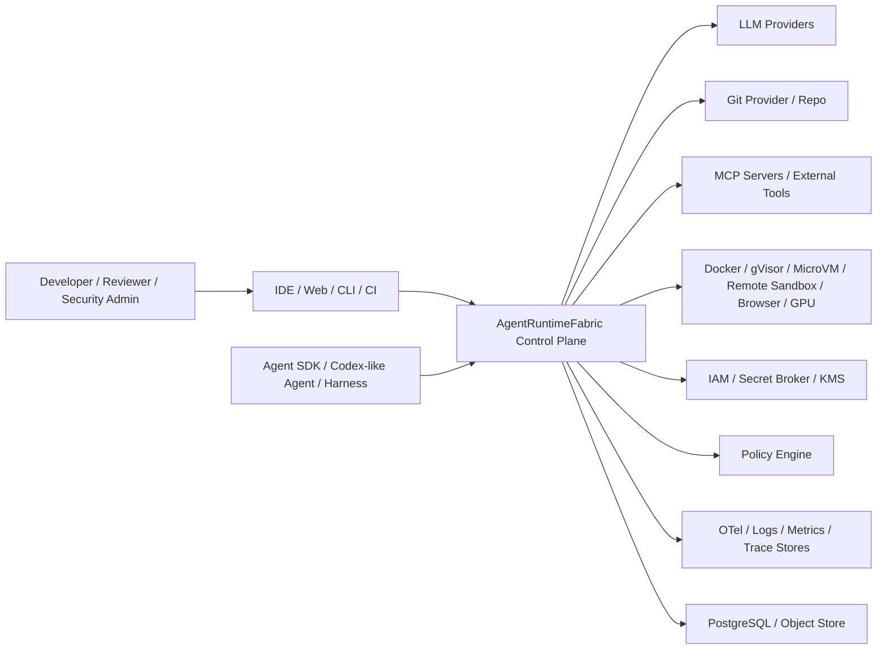
```mermaid
flowchart LR
    Dev[Developer / Reviewer / Security Admin] --> UI[IDE / Web / CLI / CI]
    UI --> ARF[AgentRuntimeFabric Control Plane]

    Agent[Agent SDK / Codex-like Agent / Harness] --> ARF

    ARF --> LLM[LLM Providers]
    ARF --> Git[Git Provider / Repo]
    ARF --> MCP[MCP Servers / External Tools]
    ARF --> Runtime[Docker / gVisor / MicroVM / Remote Sandbox / Browser / GPU]
    ARF --> IAM[IAM / Secret Broker / KMS]
    ARF --> Policy[Policy Engine]
    ARF --> Obs[OTel / Logs / Metrics / Trace Stores]
    ARF --> Store[PostgreSQL / Object Store]
```

系统边界内包含：

- public Control API。
- Durable Workflow Kernel。
- Governance Fabric。
- Workspace、Snapshot、Artifact、ChangeSet 服务。
- RuntimeAdapter、SandboxDaemon、ToolGateway。
- EventLog、EvidenceGraph、Replay。
- AgentOps projection 和 CLI/minimal UI。

系统边界外包含：

- LLM provider。
- Git provider。
- MCP server 和外部工具。
- runtime backend。
- 企业 IAM、Vault/KMS、policy rule engine。
- OTel、日志和指标 backend。

### 3.2 外部接口描述

| 接口 | 调用方 | 被调用方 | 承载对象 | 稳定语义 |
| --- | --- | --- | --- | --- |
| Control API | IDE/Web/CLI/CI/AgentOps | API Gateway | `Session`, `Task`, `Approval`, `Comment`, `Blocker` | 外部入口表达目标和协作状态，不能直接获得执行权 |
| Event Protocol | 所有服务 | EventLog/Outbox | `Event`, `payload_ref`, `correlation_id`, `causation_id` | append-only、可重放、可投影、可审计 |
| Runtime Protocol | Workflow/RuntimeService | RuntimeAdapter/SandboxDaemon | `RuntimeAction`, `ExecutionLease`, `ActionEvent` | 执行必须绑定 lease，输出结构化事件 |
| Tool/MCP Protocol | Harness/ToolGateway | MCP server/外部工具 | `ToolCall`, `PolicyDecision`, `SecretGrant`, `Artifact` | 工具调用先过策略和密钥代理 |
| Governance API | Workflow/ToolGateway/Daemon | Policy/Approval/Secret/Egress | `PolicyDecision`, `Approval`, `SecretGrant` | 授权、审批和密钥是可审计事实 |
| A2A Protocol | AgentActor/Reviewer/MergeQueue | Mailbox/AgentActor | `A2AEnvelope`, `Ack`, `Retry` | Agent 间协作异步、可恢复、有 backpressure |
| Context Protocol | Harness | LLM provider | `ContextPack`, `ArtifactRef`, `TrustLevel` | 上下文是事实投影，带来源和 trust level |
| Evidence API | Reviewer/CLI/UI/Operator | EvidenceGraph/Replay | `EvidenceEdge`, `ReplayFrame`, `ChangeSetRef` | 查询必须能回到原始 event/payload/artifact/snapshot |
| Adapter Admission | Adapter author | Runtime registry | `RuntimeCapabilities`, `AdapterMapping`, `ContractResult` | 外部 backend 先映射、测试、准入，再参与路由 |
| Admin API | Operator/SRE | Workflow/Runtime/Storage/Governance | `AdminOverride`, `GCReport`, `RepairEvent` | 所有 repair 都写 event，不能无痕改库 |

### 3.3 关键系统用例

| 用例 | 主要参与者 | 触发 | 成功结果 |
| --- | --- | --- | --- |
| UC-01 创建代码变更任务 | Developer、API Gateway、WorkflowKernel | 用户提交 repo 和目标 | 创建 Session、WorkflowRun、Task、WorkspaceBranch、base snapshot |
| UC-02 执行受策略约束命令 | Harness、PolicyEngine、LeaseService、SandboxDaemon | Agent 提出 shell intent | 生成 PolicyDecision、ExecutionLease、Action events、stdout/stderr artifact |
| UC-03 runtime 失败恢复 | RuntimeAdapter、WorkflowKernel、WorkspaceService | heartbeat lost/OOM/preempted | 新 runtime 从 snapshot restore，Task 继续 |
| UC-04 高风险动作审批 | PolicyEngine、ApprovalService、Human Approver | git push/publish/merge/production API | Workflow 等待审批，授权后发放 lease，等待期间可释放 runtime |
| UC-05 生成和评审 ChangeSet | WorkspaceService、ChangeSetService、Reviewer | 文件变更和测试完成 | ChangeSet 关联 diff、test artifact、policy、snapshot、review decision |
| UC-06 Replay 和 debug restore | Developer、Operator、ReplayEngine | 任务失败或需审计 | 重建 timeline，恢复失败点 snapshot 到 debug runtime |
| UC-07 多 Agent 分支协作 | Planner、AgentActors、Mailbox、MergeQueue | 任务可并行拆分 | 每个 Agent 在独立 branch 工作，merge 前测试和 review |
| UC-08 RuntimeAdapter 准入 | Adapter developer、Architecture owner | 新 backend 接入 | Mapping ADR、capability matrix、contract tests、schema lint 通过 |
| UC-09 Knowledge/Skill 复用 | Planner、SemanticContext、SkillRegistry | 需要引用知识或复用成功路径 | `ContextPack` 带来源和 trust level，`Skill` 不绕过 policy |
| UC-10 运维修复 | Operator | outbox 堆积、snapshot 爆仓、runtime 泄漏 | repair action 写入 EventLog，状态可解释 |

### 3.4 用例详述

#### UC-02 执行受策略约束命令

主成功路径：

1. Harness 从 `ContextPack` 和任务状态生成 `shell.execute` intent。
2. WorkflowKernel 调用 PolicyEngine，输入 subject/action/resource/context。
3. PolicyEngine 返回 `PolicyDecision(effect=allow)`。
4. ExecutionLeaseService 根据 decision 发放短期 `ExecutionLease`。
5. RuntimeAdapter 将 action 和 lease 发送给 SandboxDaemon。
6. SandboxDaemon 校验 lease、action scope、TTL 和 runtime identity。
7. SandboxDaemon 执行命令，流式写入 `ActionStarted`、`ActionOutput`、`ActionFinished`。
8. ArtifactStore 保存 stdout/stderr，记录 checksum 和 provenance。
9. EvidenceGraph 投影 action、policy、lease、runtime、artifact 的因果边。
10. WorkflowKernel 根据 exit code 推进 Task。

异常路径：

- policy deny: Task blocked 或 failed，返回 `POLICY_DENIED`。
- approval required: Task/WorkflowRun 进入 WaitingApproval。
- lease expired: daemon 拒绝 action，WorkflowKernel 可重新申请 lease。
- runtime lost: 进入 UC-03。
- artifact upload failed: Action 标记 partial，Task 阻塞或重试。

#### UC-03 runtime 失败恢复

主成功路径：

1. RuntimeAdapter 或 heartbeat monitor 检测 runtime lost。
2. EventLog 写入 `RuntimeLost`。
3. WorkflowKernel 将 Task 或 WorkflowRun 置为 Recovering。
4. SnapshotStore 查找最近可用 snapshot，并校验 manifest。
5. RuntimeAdapter allocate 新 `RuntimeInstance`。
6. WorkspaceService restore branch/head 到新 runtime。
7. Artifact/Event tail 构造 recovery context。
8. WorkflowKernel 从 checkpoint 和 event cursor 继续。
9. EvidenceGraph 记录 `restored_from`、`executed_on`、`continued_by` 等边。

异常路径：

- snapshot 缺失或 checksum mismatch: Task 进入 recovery error，operator 可选择 debug restore 或 retry from base。
- recovery budget exceeded: WorkflowRun failed，需要人工处理。
- adapter 不支持 restore: route 到支持能力的 fallback backend，或返回 deterministic error。

#### UC-05 ChangeSet 生成和评审

主成功路径：

1. Task 创建时记录 `base_snapshot_id`。
2. WorkspaceService 监听文件变更并生成 diff artifact。
3. ArtifactStore 保存测试报告、日志、截图、patch。
4. ChangeSetService 创建或更新 ChangeSet。
5. Reviewer 或 policy gate 读取 diff、test artifact、policy evidence。
6. ReviewDecision 写入 EventLog。
7. MergeQueue 在 CAS/version check 通过后 merge。
8. SnapshotStore 创建 post-merge snapshot 或 rollback snapshot。

关键约束：

- ChangeSet 不能没有 base snapshot。
- ReadyForReview 必须至少有 diff artifact。
- Merged 必须记录 merge actor、merge event、head snapshot 和测试结果。
- rollback 不能只删除文件，必须引用 base snapshot 或创建 rollback snapshot。

## 4. 概念模型

### 4.1 领域定义

ARF 所处领域可以定义为：面向长时、自主、会执行跨边界动作的 Agent 工作流控制面。这里的“跨边界动作”包括 shell 命令、文件写入、MCP tool、网络访问、secret 使用、Git/PR 操作、发布动作、浏览器自动化和外部 API 写操作。

ARF 的领域核心不是模型推理，而是以下五类问题：

| 问题域 | 核心问题 | ARF 对象 |
| --- | --- | --- |
| 长任务生命 | 任务不能依赖 HTTP request、进程或 runtime 存活 | `WorkflowRun`, `Task`, `Checkpoint` |
| 工程现场 | 代码、依赖、日志、artifact、snapshot 必须可恢复、可分支、可回滚 | `Workspace`, `WorkspaceBranch`, `Snapshot`, `Artifact`, `ChangeSet` |
| 执行授权 | Agent 不能默认拥有 shell、网络和 secret | `PolicyDecision`, `ExecutionLease`, `Approval`, `SecretGrant` |
| backend 可替换 | container、gVisor、microVM、remote sandbox、browser、GPU backend 能力不同 | `RuntimeAdapter`, `RuntimeInstance`, `RuntimeCapabilities`, `AdapterMapping` |
| 证据和调试 | 失败必须能解释谁在什么策略下执行了什么，产生了什么变更和产物 | `Event`, `EvidenceEdge`, `EvidenceGraph`, `ReplayFrame` |

### 4.2 核心对象模型

| 对象 | 语义 | 核心字段 |
| --- | --- | --- |
| `Session` | 用户目标容器，承载一次业务意图 | `session_id`, `owner_identity`, `goal`, `policy_bundle_id`, `workflow_run_id`, `status` |
| `WorkflowRun` | durable workflow 实例，承载长任务状态和恢复游标 | `workflow_run_id`, `session_id`, `state`, `cursor`, `checkpoint_ref`, `task_graph_ref` |
| `Task` | 可调度、可审计的工作单元 | `task_id`, `workflow_run_id`, `status`, `risk`, `assignee_actor_id`, `workspace_branch_id` |
| `AgentActor` | 一次协作中的 Agent 身份实例 | `actor_id`, `agent_spec_id`, `role`, `mailbox_id`, `lease_state` |
| `ExecutionLease` | 短期执行授权窗口 | `lease_id`, `task_id`, `runtime_id`, `identity_id`, `policy_version`, `allowed_actions`, `expires_at` |
| `RuntimeInstance` | 实际执行资源，可销毁、可替换 | `runtime_id`, `backend`, `status`, `runner_id`, `daemon_id`, `resource_spec`, `heartbeat_at` |
| `Workspace` | 长期工程现场事实容器 | `workspace_id`, `repo_ref`, `base_snapshot_id`, `head_snapshot_id`, `retention_policy` |
| `WorkspaceBranch` | 多 Agent 或多任务隔离写入分支 | `branch_id`, `workspace_id`, `parent_branch_id`, `head_snapshot_id`, `lock_state`, `merge_state` |
| `Snapshot` | 可恢复检查点 | `snapshot_id`, `workspace_id`, `branch_id`, `parent_snapshot_id`, `class`, `delta_ref`, `checksum` |
| `Artifact` | 交付物和证据载体 | `artifact_id`, `task_id`, `snapshot_id`, `type`, `uri`, `checksum`, `provenance` |
| `ChangeSet` | 代码变更证据单元 | `changeset_id`, `base_snapshot_id`, `head_snapshot_id`, `diff_artifact_id`, `test_artifacts`, `review_decision_id`, `merge_state` |
| `PolicyDecision` | 单次动作授权事实 | `decision_id`, `subject`, `action`, `resource`, `effect`, `reason`, `policy_version` |
| `Approval` | 人类或策略审批状态机 | `approval_id`, `task_id`, `requested_action`, `status`, `approver`, `expires_at` |
| `SecretGrant` | 短期密钥授权元数据 | `grant_id`, `subject`, `secret_ref`, `scope`, `ttl`, `broker_event_id` |
| `ToolCall` | 工具调用意图和结果 | `tool_call_id`, `task_id`, `tool_name`, `input_ref`, `result_ref`, `policy_decision_id` |
| `Event` | append-only 系统事实 | `event_id`, `type`, `actor`, `subject`, `payload_ref`, `causation_id`, `correlation_id` |
| `EvidenceEdge` | 事实间因果边投影 | `edge_id`, `from_type`, `from_id`, `to_type`, `to_id`, `relation`, `source_event_id` |
| `RuntimeCapabilities` | backend 能力声明 | `backend`, `isolation_class`, `snapshot_classes`, `supports_reconnect`, `port_modes`, `limits` |
| `ContextPack` | 面向模型输入的可追溯上下文投影 | `context_pack_id`, `source_refs`, `trust_levels`, `summary_ref`, `policy_version` |
| `Skill` | 成功路径沉淀，不是权限来源 | `skill_id`, `version`, `steps_ref`, `provenance`, `approval_status` |

#### 4.2.1 核心对象分层清单

核心对象必须按事实边界、生命周期边界和写入所有权分层。评审时不能只看对象名称是否完整，更要看对象是否承担了正确的职责。

| 对象层 | 核心对象 | 生命周期所有者 | 是否事实源 | 核心问题 |
| --- | --- | --- | --- | --- |
| 入口目标层 | `Session` | API Gateway / WorkflowKernel | 是 | 用户要完成什么目标，目标归属于谁，使用哪个 policy bundle |
| 长任务层 | `WorkflowRun`, `Task` | WorkflowKernel | 是 | 长任务如何计划、调度、暂停、恢复、失败、重试 |
| Agent 协作层 | `AgentActor`, `A2AEnvelope`, `Mailbox` | Scheduler / Collaboration service | 是 | 哪个 Agent 以什么角色参与，消息如何 ack/retry/backpressure |
| 授权治理层 | `PolicyDecision`, `ExecutionLease`, `Approval`, `SecretGrant` | Governance Fabric | 是 | 谁在什么策略版本下被允许做什么，授权何时失效 |
| 执行资源层 | `RuntimeInstance`, `RuntimeCapabilities`, `AdapterMapping` | Runtime service / Adapter registry | 部分是 | 哪个 runtime backend 执行，能力是什么，如何防止 vendor schema 泄漏 |
| 工程现场层 | `Workspace`, `WorkspaceBranch`, `Snapshot` | WorkspaceService / SnapshotStore | 是 | 代码现场如何分支、锁定、恢复、回滚和 GC |
| 变更控制层 | `ChangeSet`, `ReviewDecision`, `MergeQueue` | ChangeSetService / Reviewer / MergeQueue | 是 | 一组代码变更从哪里来，经过哪些测试/审批/评审，是否合并或回滚 |
| 工具与产物层 | `ToolCall`, `Artifact` | ToolGateway / ArtifactStore | 是 | 工具调用和命令输出如何成为可校验证据 |
| 事件证据层 | `Event`, `EvidenceEdge`, `ReplayFrame` | EventLog / EvidenceGraph / ReplayEngine | `Event` 是事实，edge/frame 是投影 | 如何重建因果链和调试现场 |
| 上下文复用层 | `ContextPack`, `KnowledgeMount`, `Skill` | Semantic Context / SkillRegistry | 否，属于投影或复用载体 | 如何把事实压缩给模型使用，但不扩大权限或替代证据 |

#### 4.2.2 核心对象语义约束

| 对象 | 正确语义 | 常见错误建模 | 评审判定 |
| --- | --- | --- | --- |
| `Session` | 用户目标和协作容器 | 把 Session 当 runtime session 或 chat transcript | Session 不能持有 shell、secret、端口等执行权 |
| `WorkflowRun` | durable 状态机实例 | 把 worker process、Temporal id 或 HTTP request 当 WorkflowRun | WorkflowRun 必须能从 checkpoint/event cursor 恢复 |
| `Task` | 可调度和可审计工作单元 | 把 Task 当一次命令或一个 container | Task 可以跨多个 runtime action 和多个 runtime instance |
| `ExecutionLease` | 动作级短期授权窗口 | 把 lease 当长期 runtime credential | lease 必须有 TTL、allowed_actions、policy_version 和 revocation path |
| `RuntimeInstance` | 临时执行资源 | 把 runtime 当 workspace、task 或事实源 | runtime lost 不能导致 workspace/event/artifact 丢失 |
| `Workspace` | 工程现场事实容器 | 把 Git branch、container overlay 或本地目录直接当 Workspace | Workspace 必须有 lineage、snapshot、retention、branch 语义 |
| `Snapshot` | 可恢复检查点 | 把压缩包或 provider snapshot id 当完整语义 | Snapshot 必须有 class、parent、producer_event、checksum |
| `ChangeSet` | 代码变更证据单元 | 把模型总结或普通 patch 文件当 ChangeSet | ChangeSet 字段必须来自 diff/test/artifact/event/review/merge 事实 |
| `PolicyDecision` | 一次授权事实 | 把 policy config 或 allowlist 规则当 decision | 每次跨边界动作都要生成不可变 decision |
| `Artifact` | 产物和证据载体 | 把日志文本直接塞到 event payload | artifact 必须有 URI、checksum、type、provenance |
| `EvidenceEdge` | 事实关系投影 | 把 `EvidenceGraph` 当事实源 | 每条 edge 必须有 source_event_id，可重新投影 |
| `ContextPack` | 模型输入投影 | 把 context summary 当审计事实或权限来源 | `ContextPack` 必须有 source refs 和 trust levels |

### 4.3 对象关系图

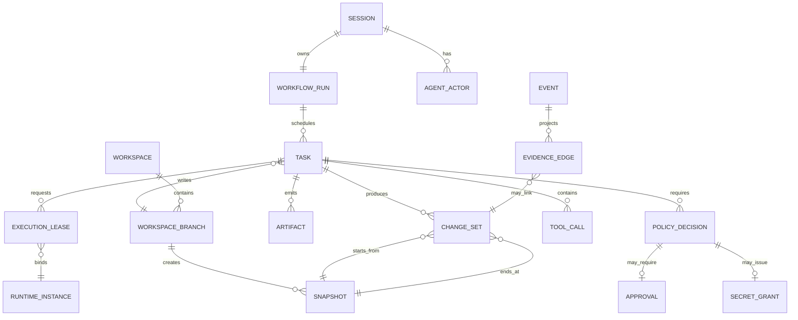
```mermaid
erDiagram
    SESSION ||--|| WORKFLOW_RUN : owns
    WORKFLOW_RUN ||--o{ TASK : schedules
    SESSION ||--o{ AGENT_ACTOR : has
    TASK ||--o{ EXECUTION_LEASE : requests
    EXECUTION_LEASE }o--|| RUNTIME_INSTANCE : binds
    TASK }o--|| WORKSPACE_BRANCH : writes
    WORKSPACE ||--o{ WORKSPACE_BRANCH : contains
    WORKSPACE_BRANCH ||--o{ SNAPSHOT : creates
    TASK ||--o{ ARTIFACT : emits
    TASK ||--o{ POLICY_DECISION : requires
    POLICY_DECISION ||--o| APPROVAL : may_require
    POLICY_DECISION ||--o| SECRET_GRANT : may_issue
    TASK ||--o{ TOOL_CALL : contains
    TASK ||--o{ CHANGE_SET : produces
    CHANGE_SET }o--|| SNAPSHOT : starts_from
    CHANGE_SET }o--|| SNAPSHOT : ends_at
    EVENT ||--o{ EVIDENCE_EDGE : projects
    EVIDENCE_EDGE }o--|| CHANGE_SET : may_link
```

#### 4.3.1 对象关系语义

| 关系 | 语义 | 关键约束 |
| --- | --- | --- |
| `Session -> WorkflowRun` | 一个用户目标对应一个当前主 workflow run，可创建 retry/new run | 终止态 run 不能被原地复活；重试需要新 run 或显式 retry relation |
| `WorkflowRun -> Task` | WorkflowRun 调度 Task DAG | Task 状态推进必须写 Event，不能只改 current state |
| `Task -> ExecutionLease` | Task 为具体 action 请求短期执行权 | lease 不能跨 task 复用，不能扩大 action scope |
| `ExecutionLease -> RuntimeInstance` | lease 绑定具体 runtime 执行资源 | runtime lost 时旧 lease 失效，恢复后重新发放 |
| `Task -> WorkspaceBranch` | Task 在指定 branch 上写入 | 并发写不能绕过 branch/lock 直接共享目录 |
| `WorkspaceBranch -> Snapshot` | branch 产生 snapshot lineage | snapshot 必须有 parent，base snapshot 缺失时 branch 不可恢复 |
| `Task -> Artifact` | Task 的命令、工具、测试、review 产生产物 | artifact 必须有 checksum 和 producer event |
| `Task -> PolicyDecision` | Task 内所有跨边界 action 都需要 decision | deny/approval_required 也是事实，不是异常日志 |
| `PolicyDecision -> Approval` | 高风险 decision 可要求审批 | approval 结果固定到后续 execution context |
| `PolicyDecision -> SecretGrant` | 允许 secret 使用时通过 grant 暴露最小权限 | grant metadata 可审计，secret value 不入库 |
| `Task -> ChangeSet` | Task 对 workspace 的变更聚合为 ChangeSet | ChangeSet 不能脱离 base/head snapshot |
| `Event -> EvidenceEdge` | event 被投影为因果边 | projection 可重建；缺边导致 replay partial |

### 4.4 四层生命周期分离

ARF 最重要的概念修正是把早期容易混淆的 `Runtime` 生命周期拆成四层：

| 生命周期 | 对象 | 生命周期特征 | 不能混淆为 |
| --- | --- | --- | --- |
| 业务目标生命 | `Session` | 用户目标、协作上下文、最终结果 | HTTP request |
| 长任务生命 | `WorkflowRun`, `Task` | durable、可暂停、可恢复、可重试 | worker 进程 |
| 授权窗口生命 | `ExecutionLease`, `PolicyDecision`, `Approval` | 短期、可撤销、绑定策略版本和动作范围 | runtime 权限 |
| 执行资源生命 | `RuntimeInstance` | 可销毁、可迁移、可替换 | workspace 或 task 本身 |

关键含义：

- `RuntimeInstance` lost 不等于 `Task` failed。
- `Task` blocked 不等于 `WorkflowRun` failed。
- `Approval` waiting 不应强制占用 runtime。
- `ExecutionLease` expired 不应删除 workspace 或 artifact。

### 4.5 领域不变式

以下不变式是 ARF 架构评审和实现验收的硬约束：

1. 任何 shell、MCP、network、secret、Git、PR、publish 动作都必须有 `PolicyDecision`。
2. 任何 runtime action 都必须绑定有效 `ExecutionLease`。
3. `RuntimeInstance` 不是事实源，长期事实只能来自 `EventLog`、`Workspace`、`Snapshot`、`Artifact`、`PolicyDecision`。
4. `ChangeSet` 必须由平台基于真实 diff、snapshot、artifact、review 和 event 生成，不能由模型自报。
5. `EvidenceGraph` 是事实投影，不是事实源。每条 `EvidenceEdge` 必须能回到 `source_event_id`。
6. `ContextPack`、summary、embedding、`Skill` suggestion 都是投影或复用载体，不能覆盖事实和策略。
7. 外部 runtime、workflow、agent SDK、MCP server 的 id 和 schema 不能成为 ARF public API 或核心事实表主键。
8. 多 Agent 并发写入必须通过 `WorkspaceBranch` 隔离，不能共享同一可写目录。
9. Secret value 不进入模型上下文、workspace、普通环境变量、stdout/stderr 或 artifact。
10. 所有 operator repair 和 admin override 都必须写入 EventLog。

### 4.6 能力地图

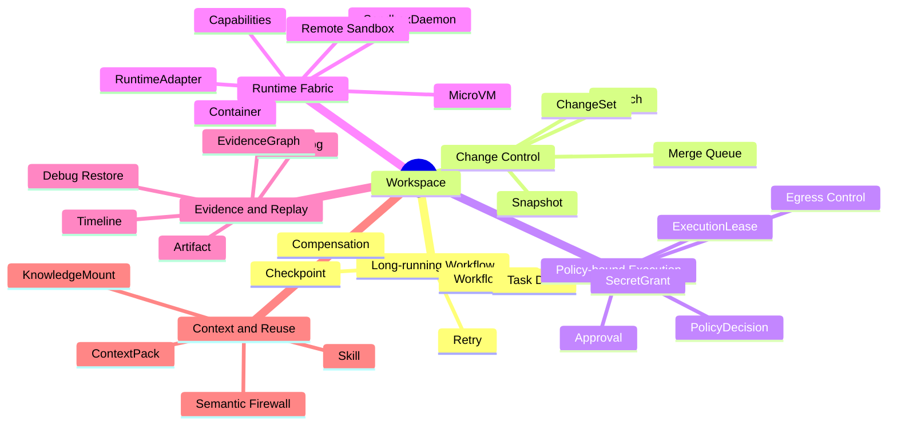
```mermaid
mindmap
  root((ARF))
    Long-running Workflow
      WorkflowRun
      Task DAG
      Checkpoint
      Retry
      Compensation
    Change Control
      Workspace
      Branch
      Snapshot
      ChangeSet
      Merge Queue
    Policy-bound Execution
      PolicyDecision
      ExecutionLease
      Approval
      SecretGrant
      Egress Control
    Runtime Fabric
      RuntimeAdapter
      Capabilities
      SandboxDaemon
      Container
      MicroVM
      Remote Sandbox
    Evidence and Replay
      EventLog
      Artifact
      EvidenceGraph
      Timeline
      Debug Restore
    Context and Reuse
      ContextPack
      KnowledgeMount
      Semantic Firewall
      Skill
```

### 4.7 核心状态机模型

状态机是 ARF 的架构骨架。它们的目标不是画出所有可能分支，而是明确对象生命周期、可恢复点、非法转移、审计事件和 operator repair 边界。

#### 4.7.1 状态机设计总则

| 原则 | 说明 |
| --- | --- |
| 状态推进必须显式 | 每次状态变化都要有 actor、before、after、reason、event_id |
| current state 与 event history 分离 | Metadata 表保存当前态，EventLog 保存事实历史 |
| 终止态不可原地复活 | `Completed`、`Failed`、`Cancelled`、`Merged` 等终止态后续通过 retry/new run/rollback 表达 |
| 恢复不是重放内存 | 恢复依据 checkpoint、event cursor、snapshot、artifact，不依赖进程内存 |
| 等待态不强占资源 | WaitingApproval、Blocked、Suspended 可释放 runtime |
| 所有非法转移必须可测试 | 状态机不是文档装饰，必须落成单元测试和集成测试 |
| admin override 是事件 | 人工修复不能直接改库后无审计链 |

#### 4.7.2 WorkflowRun 状态机

目标：管理一次长任务 workflow 的总体生命，确保任务能跨 worker crash、approval wait、runtime lost 和人工暂停继续。

原则：

- WorkflowRun 不代表进程，也不代表 runtime。
- WorkflowRun 的 cursor/checkpoint 是恢复锚点。
- WaitingApproval、Suspended、Recovering 是正常状态，不是异常日志。

功能：

- Task DAG 编排。
- checkpoint 和 recovery budget 管理。
- approval wait、retry、compensation、review gate。
- worker crash 后恢复调度。

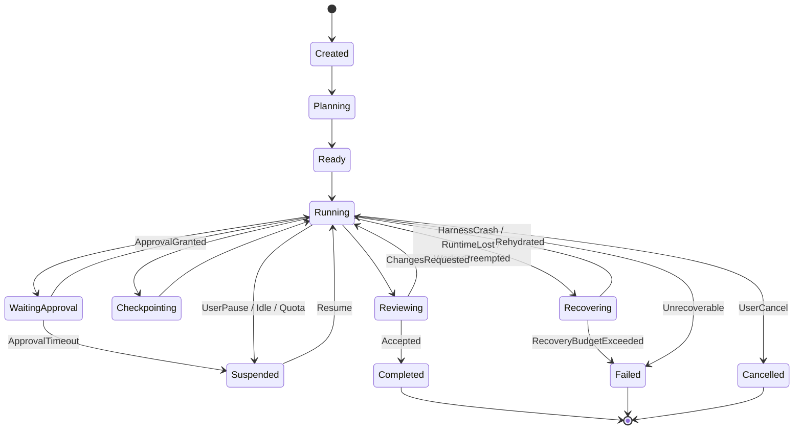
```mermaid
stateDiagram-v2
    [*] --> Created
    Created --> Planning
    Planning --> Ready
    Ready --> Running
    Running --> WaitingApproval
    WaitingApproval --> Running: ApprovalGranted
    WaitingApproval --> Suspended: ApprovalTimeout
    Running --> Checkpointing
    Checkpointing --> Running
    Running --> Suspended: UserPause / Idle / Quota
    Suspended --> Running: Resume
    Running --> Recovering: HarnessCrash / RuntimeLost / WorkerPreempted
    Recovering --> Running: Rehydrated
    Recovering --> Failed: RecoveryBudgetExceeded
    Running --> Reviewing
    Reviewing --> Running: ChangesRequested
    Reviewing --> Completed: Accepted
    Running --> Failed: Unrecoverable
    Running --> Cancelled: UserCancel
    Completed --> [*]
    Failed --> [*]
    Cancelled --> [*]
```

| 状态 | 语义 | 允许的关键动作 | 必须记录 |
| --- | --- | --- | --- |
| `Created` | run 已创建但未规划 | validate input、bind policy bundle | `WorkflowRunCreated` |
| `Planning` | 构造 Task DAG 和 workspace plan | create tasks、choose agent/environment | `PlanningStarted/Finished` |
| `Running` | 至少一个 Task 可推进 | schedule task、request lease、checkpoint | task events、cursor |
| `WaitingApproval` | 等待人类或策略审批 | release runtime、create pre-approval snapshot | approval ref、policy version |
| `Suspended` | 用户、quota 或超时暂停 | resume、cancel、admin inspect | suspend reason |
| `Recovering` | 正在从 checkpoint/snapshot 恢复 | allocate runtime、restore workspace、rehydrate context | recovery attempt、budget |
| `Reviewing` | 进入验收或 ChangeSet review | run gates、request changes、accept | review decision |
| `Completed/Failed/Cancelled` | 终止态 | create retry/new run | terminal reason |

#### 4.7.3 Task 状态机

目标：管理一个可调度、可审计工作单元从创建、执行、阻塞、审批、评审到终止的生命周期。

原则：

- Task 是调度和审计边界，不是一次命令。
- Task 可跨多个 runtime action、多个 artifact 和多个 recovery attempt。
- Task retry 必须显式记录，不允许悄悄创建不可追踪任务。

功能：

- 表达排队、分配、运行、阻塞、审批、快照、评审和重试。
- 绑定 workspace branch、risk profile、agent actor。
- 为 ChangeSet、PolicyDecision、Artifact 建立共同 subject。

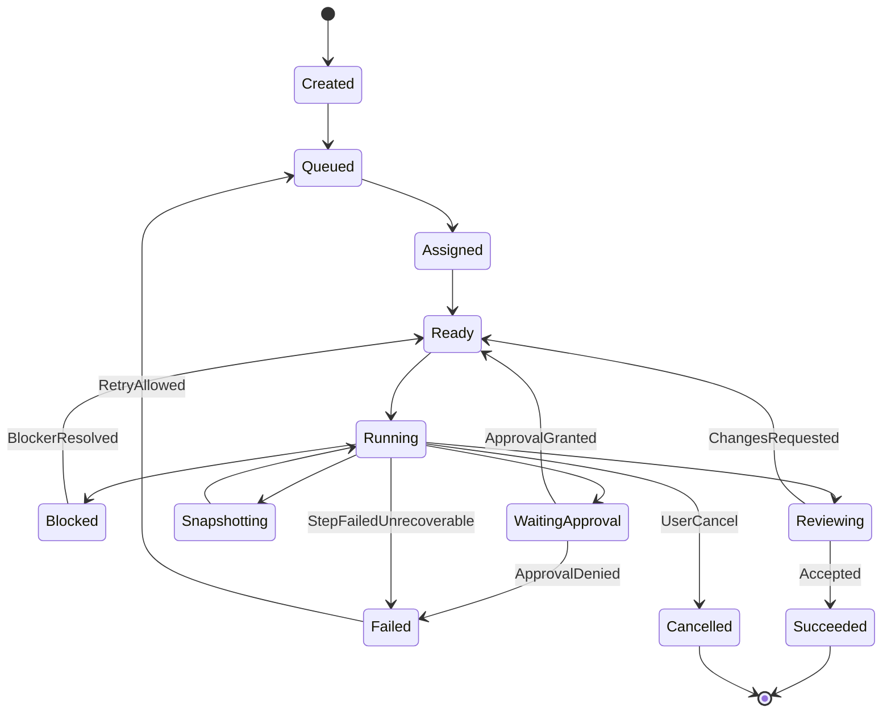
```mermaid
stateDiagram-v2
    [*] --> Created
    Created --> Queued
    Queued --> Assigned
    Assigned --> Ready
    Ready --> Running
    Running --> Blocked
    Blocked --> Ready: BlockerResolved
    Running --> WaitingApproval
    WaitingApproval --> Ready: ApprovalGranted
    WaitingApproval --> Failed: ApprovalDenied
    Running --> Snapshotting
    Snapshotting --> Running
    Running --> Reviewing
    Reviewing --> Succeeded: Accepted
    Reviewing --> Ready: ChangesRequested
    Running --> Failed: StepFailedUnrecoverable
    Running --> Cancelled: UserCancel
    Failed --> Queued: RetryAllowed
    Succeeded --> [*]
    Cancelled --> [*]
```

| 状态 | 目标 | 退出条件 | 关键约束 |
| --- | --- | --- | --- |
| `Queued` | 等待调度资源 | scheduler 选择 actor/runtime profile | 不分配 runtime 也可排队 |
| `Assigned` | 已绑定 AgentActor 和 workspace branch | actor ready | assignee 变更写 event |
| `Running` | 正在推进任务步骤 | step done、blocked、approval、review、failure | action 必须经 policy/lease |
| `Blocked` | 等待外部条件或人工输入 | blocker resolved | blocker 是事件，不是 UI-only 状态 |
| `WaitingApproval` | 等待高风险动作审批 | approval granted/denied | 等待期间可释放 runtime |
| `Snapshotting` | 创建恢复点 | snapshot committed/failed | 失败不能伪造 snapshot |
| `Reviewing` | 进入验收或代码评审 | accepted/changes requested | 必须有 artifact/diff evidence |

#### 4.7.4 ExecutionLease 状态机

目标：把执行权建模为短期、可撤销、可审计的授权窗口，阻止 Agent 或 Harness 直接拥有 shell、network、secret 和 tool 权限。

原则：

- lease 是 action scope，不是长期 credential。
- lease 绑定 task、runtime、identity、policy version 和 allowed actions。
- daemon/tool gateway 只执行有效 lease 覆盖的动作。

功能：

- 管理 policy evaluation、approval required、grant、active、renew、revoke、expire、release。
- 支持等待审批时不占 runtime。
- 支持策略撤销和租约过期的执行面强制拒绝。

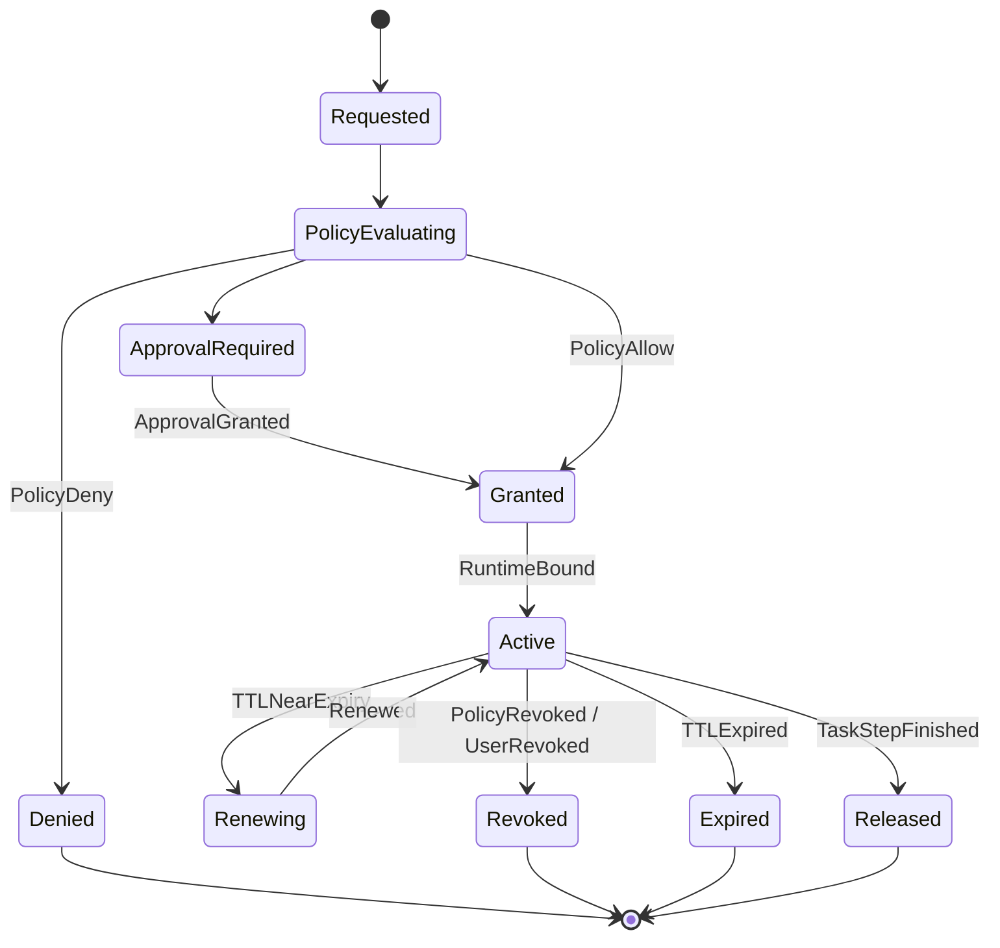
```mermaid
stateDiagram-v2
    [*] --> Requested
    Requested --> PolicyEvaluating
    PolicyEvaluating --> ApprovalRequired
    ApprovalRequired --> Granted: ApprovalGranted
    PolicyEvaluating --> Granted: PolicyAllow
    PolicyEvaluating --> Denied: PolicyDeny
    Granted --> Active: RuntimeBound
    Active --> Renewing: TTLNearExpiry
    Renewing --> Active: Renewed
    Active --> Revoked: PolicyRevoked / UserRevoked
    Active --> Expired: TTLExpired
    Active --> Released: TaskStepFinished
    Denied --> [*]
    Revoked --> [*]
    Expired --> [*]
    Released --> [*]
```

| 状态 | 语义 | 执行面行为 |
| --- | --- | --- |
| `Requested` | action 请求授权 | 不可执行 |
| `PolicyEvaluating` | 策略评估中 | 不可执行 |
| `ApprovalRequired` | 需要审批 | 不可执行，可释放 runtime |
| `Granted` | 已授权但未绑定 runtime action | 尚不可执行或待绑定 |
| `Active` | 可执行窗口 | daemon/tool gateway 可接受覆盖范围内 action |
| `Renewing` | TTL 即将到期，续租中 | 按 policy 可继续或暂停 |
| `Revoked/Expired/Released/Denied` | 终止态 | 新 action 一律拒绝 |

#### 4.7.5 RuntimeInstance 状态机

目标：管理实际执行资源的生命周期，同时保证 runtime 丢失不会污染任务事实和 workspace 事实。

原则：

- RuntimeInstance 是 disposable compute。
- runtime 状态不能替代 Task/WorkflowRun 状态。
- runtime teardown 不删除 workspace、snapshot、artifact、event。

功能：

- allocate、boot、daemon ready、mount workspace、ready/busy、snapshotting、hibernating、lost、reclaimed。
- 暴露 heartbeat、resource usage、ports、capability。
- 触发 recovery 流程和 fallback routing。

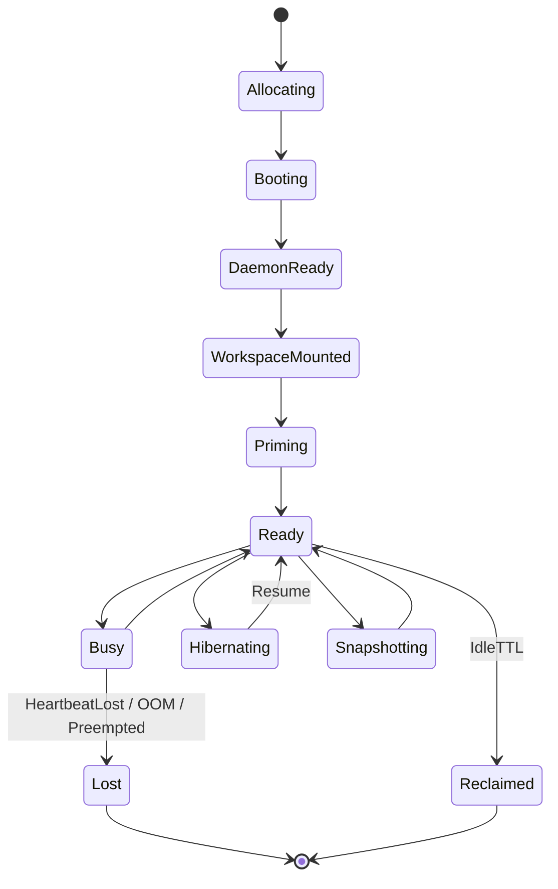
```mermaid
stateDiagram-v2
    [*] --> Allocating
    Allocating --> Booting
    Booting --> DaemonReady
    DaemonReady --> WorkspaceMounted
    WorkspaceMounted --> Priming
    Priming --> Ready
    Ready --> Busy
    Busy --> Ready
    Ready --> Hibernating
    Hibernating --> Ready: Resume
    Ready --> Snapshotting
    Snapshotting --> Ready
    Busy --> Lost: HeartbeatLost / OOM / Preempted
    Ready --> Reclaimed: IdleTTL
    Lost --> [*]
    Reclaimed --> [*]
```

| 状态 | 目标 | 关键事件 |
| --- | --- | --- |
| `Allocating/Booting` | 获得 backend 资源并启动环境 | `RuntimeAllocated`, `RuntimeBooted` |
| `DaemonReady` | sandbox-daemon 可接受控制协议 | `DaemonReady` |
| `WorkspaceMounted` | workspace branch 已挂载 | `WorkspaceMounted` |
| `Ready/Busy` | 可执行或正在执行 action | `ActionStarted/Finished` |
| `Snapshotting` | 创建 runtime/workspace snapshot | `SnapshotStarted/Committed/Failed` |
| `Hibernating` | 空闲降本或 backend pause | `RuntimePaused/Resumed` |
| `Lost` | 心跳丢失、OOM、抢占 | `RuntimeLost` |
| `Reclaimed` | idle TTL 或 operator 回收 | `RuntimeReclaimed` |

#### 4.7.6 WorkspaceBranch 与 Merge 状态机

目标：用 branch、lock、test、review、merge、conflict 和 rollback 管理多任务/多 Agent 对同一代码现场的并发修改。

原则：

- WorkspaceBranch 不是 Git branch 的同义词；Git 只是实现手段之一。
- 合并前必须有 diff、test artifact、review decision。
- 并发写必须通过 branch/lock 隔离。

功能：

- branch fork、lock、review request、testing、mergeable、merge、conflict、abandon。
- 支持 reachability 和 snapshot GC。
- 支持 MergeQueue 和 Reviewer actor。

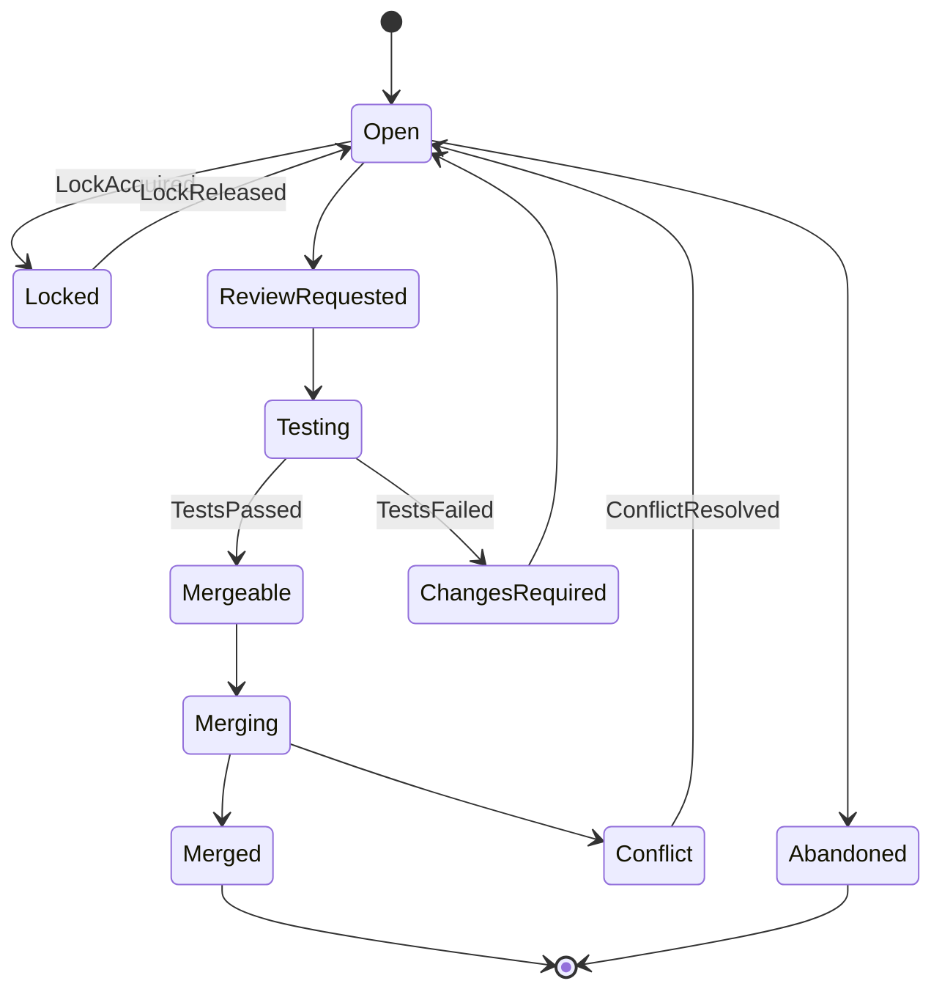
```mermaid
stateDiagram-v2
    [*] --> Open
    Open --> Locked: LockAcquired
    Locked --> Open: LockReleased
    Open --> ReviewRequested
    ReviewRequested --> Testing
    Testing --> Mergeable: TestsPassed
    Testing --> ChangesRequired: TestsFailed
    ChangesRequired --> Open
    Mergeable --> Merging
    Merging --> Merged
    Merging --> Conflict
    Conflict --> Open: ConflictResolved
    Open --> Abandoned
    Merged --> [*]
    Abandoned --> [*]
```

| 状态 | 语义 | 评审关注 |
| --- | --- | --- |
| `Open` | branch 可继续写入 | 是否绑定 base snapshot |
| `Locked` | 文件或目录锁定 | 锁是否有 owner、TTL、scope |
| `ReviewRequested` | 请求评审 | 是否有 diff artifact |
| `Testing` | 合并前门禁 | test artifact 是否可追溯 |
| `Mergeable` | 可合并候选 | policy gate 是否通过 |
| `Merging` | CAS/version check 合并中 | 防止 base 漂移 |
| `Conflict` | 合并冲突 | conflict artifact 是否生成 |
| `Merged/Abandoned` | 终止态 | snapshot 和 retention 是否更新 |

#### 4.7.7 Approval 状态机

目标：把人类审批和策略审批建模为可审计、可超时、可恢复的 workflow 节点，而不是 UI 弹窗。

原则：

- ApprovalRequested 必须包含 action、resource、risk、policy_version、diff/artifact 引用。
- 审批结果固定到后续 execution context。
- 审批等待期间不强制占用 runtime。

功能：

- 创建审批请求。
- 跟踪 pending、granted、denied、expired、cancelled。
- 支持审批超时后的 workflow suspend/fail。

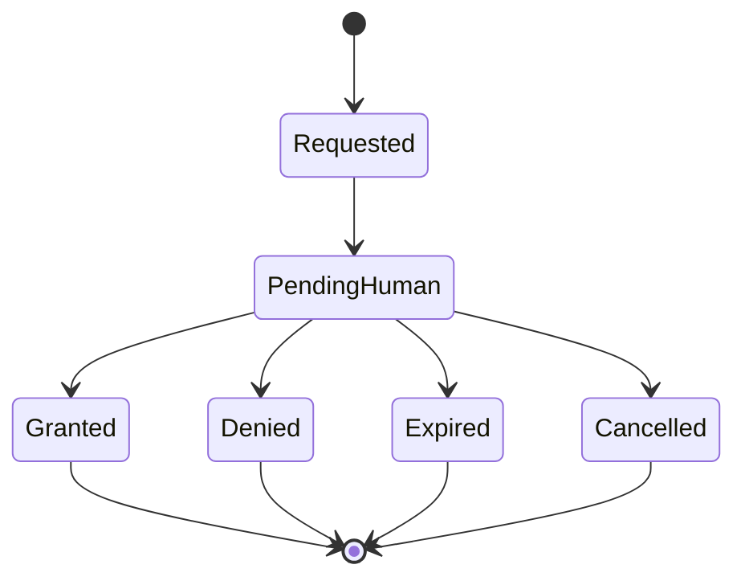
```mermaid
stateDiagram-v2
    [*] --> Requested
    Requested --> PendingHuman
    PendingHuman --> Granted
    PendingHuman --> Denied
    PendingHuman --> Expired
    PendingHuman --> Cancelled
    Granted --> [*]
    Denied --> [*]
    Expired --> [*]
    Cancelled --> [*]
```

| 状态 | 语义 | 必备证据 |
| --- | --- | --- |
| `Requested` | policy 判定需要审批 | requested action、resource、risk、policy version |
| `PendingHuman` | 等待审批人 | approver candidates、expires_at |
| `Granted` | 批准 | approver、decision time、scope |
| `Denied` | 拒绝 | reason、policy decision ref |
| `Expired/Cancelled` | 超时或取消 | timeout/cancel actor、后续 workflow transition |

#### 4.7.8 ChangeSet 状态机

目标：把 Agent 对代码仓库的修改组织成可评审、可测试、可合并、可回滚的证据单元。

原则：

- ChangeSet 必须绑定 base snapshot。
- ReadyForReview 必须有 diff artifact；高风险变更必须有 PolicyDecision 或 Approval。
- Merged/RolledBack 必须有 snapshot 证据。

功能：

- 收集 diff。
- 关联测试 artifact。
- 进入 review/approval。
- merge、conflict、rollback。
- 投影 EvidenceGraph。

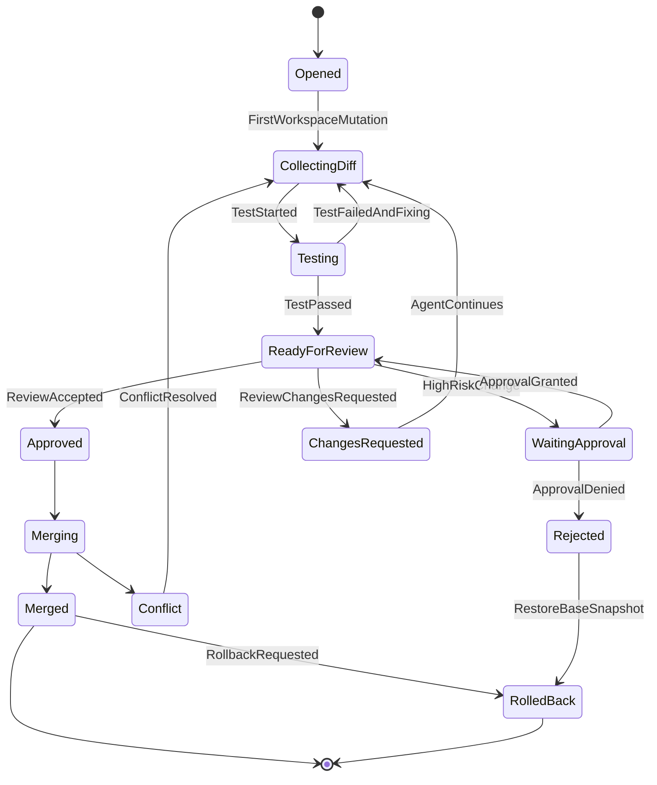
```mermaid
stateDiagram-v2
    [*] --> Opened
    Opened --> CollectingDiff: FirstWorkspaceMutation
    CollectingDiff --> Testing: TestStarted
    Testing --> CollectingDiff: TestFailedAndFixing
    Testing --> ReadyForReview: TestPassed
    ReadyForReview --> WaitingApproval: HighRiskChange
    WaitingApproval --> ReadyForReview: ApprovalGranted
    WaitingApproval --> Rejected: ApprovalDenied
    ReadyForReview --> Approved: ReviewAccepted
    ReadyForReview --> ChangesRequested: ReviewChangesRequested
    ChangesRequested --> CollectingDiff: AgentContinues
    Approved --> Merging
    Merging --> Merged
    Merging --> Conflict
    Conflict --> CollectingDiff: ConflictResolved
    Merged --> RolledBack: RollbackRequested
    Rejected --> RolledBack: RestoreBaseSnapshot
    Merged --> [*]
    RolledBack --> [*]
```

| 状态 | 目标 | 不允许 |
| --- | --- | --- |
| `Opened` | 创建变更单元并绑定 base snapshot | 无 base snapshot 进入变更 |
| `CollectingDiff` | 收集文件变更和 patch | 模型自报 diff 替代真实 diff |
| `Testing` | 验证变更 | 测试结果无 artifact |
| `ReadyForReview` | 等待评审 | 无 diff artifact |
| `WaitingApproval` | 等待高风险审批 | secret 或 publish 绕过 approval |
| `Approved` | 准备合并 | 无 review decision |
| `Merging/Conflict` | 合并或冲突处理 | 覆盖目标 branch |
| `Merged/RolledBack` | 终止结果 | 无 merge/rollback snapshot |

#### 4.7.9 Adapter Admission 状态机

目标：控制外部 runtime/sandbox/workflow/agent backend 接入，确保能力可验证、schema 不污染核心模型、许可证和安全风险可控。

原则：

- 没有 Mapping ADR 的 adapter 不能进入 registry。
- 没有通过 contract tests 的 adapter 不能参与路由。
- 远程、闭源或云 runtime 可以作为 backend，但不能成为 ARF 控制面事实源。

功能：

- adapter 提案。
- mapping 编写。
- contract testing。
- security/license review。
- admitted、quarantined、deprecated。

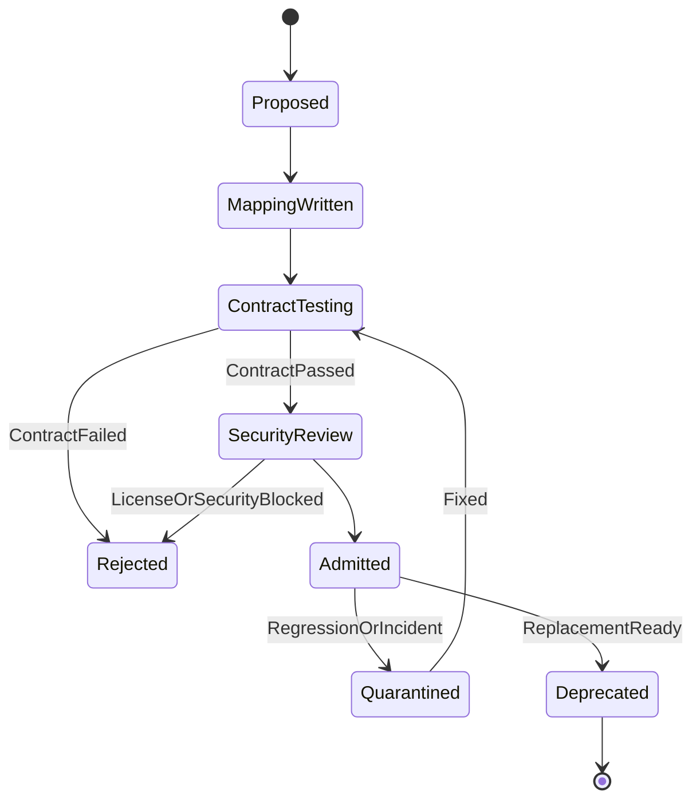
```mermaid
stateDiagram-v2
    [*] --> Proposed
    Proposed --> MappingWritten
    MappingWritten --> ContractTesting
    ContractTesting --> Rejected: ContractFailed
    ContractTesting --> SecurityReview: ContractPassed
    SecurityReview --> Rejected: LicenseOrSecurityBlocked
    SecurityReview --> Admitted
    Admitted --> Quarantined: RegressionOrIncident
    Quarantined --> ContractTesting: Fixed
    Admitted --> Deprecated: ReplacementReady
    Deprecated --> [*]
```

| 状态 | 目标 | 准入证据 |
| --- | --- | --- |
| `Proposed` | 提交 backend 接入意图 | owner、backend、use case |
| `MappingWritten` | 明确 external -> ARF 映射 | Mapping ADR、schema exposure analysis |
| `ContractTesting` | 验证能力和错误语义 | adapter contract result |
| `SecurityReview` | 审查隔离、secret、egress、license | security checklist、license ADR |
| `Admitted` | 可参与 runtime routing | capability matrix、health check |
| `Quarantined` | 因回归或事故禁用 | incident event、fallback route |
| `Deprecated` | 被替代并退出 | migration notes |

## 5. 关键技术方案

### 5.1 Durable Workflow Kernel

职责：

- 管理 `WorkflowRun` 和 `Task` 状态机。
- 保存 checkpoint、event cursor、retry policy、recovery budget。
- 调度 Task DAG、approval wait、timeout、compensation 和 review/merge gate。
- 从 EventLog 和 checkpoint 恢复，而不是依赖 worker 本地内存。

MVP 方案：

- PostgreSQL 保存 current state、checkpoint 和 outbox。
- append-only EventLog 保存事实历史。
- worker 使用 optimistic concurrency 推进状态。
- 所有写 API 支持 idempotency key。

后续替换路径：

- 可接入 Temporal/Restate-like engine，但对外仍暴露 `WorkflowRun`、`Task`、Event Envelope。
- 外部 workflow history 可投影到 ARF EventLog，但不能替代 EventLog。

### 5.2 Workspace Lineage 与 Snapshot

核心设计：

- `Workspace` 是长期工程现场，不等于 runtime 文件系统。
- `WorkspaceBranch` 是并发写入边界，不等于 Git branch。
- `Snapshot` 是恢复、分支、回滚、debug restore 的统一原语。
- `ChangeSet` 是代码变更的审计单元，绑定 base/head snapshot、diff、test、review、approval、merge/rollback。

MVP snapshot class:

| class | 含义 | MVP 支持 |
| --- | --- | --- |
| `fs-delta` | 文件系统增量 snapshot | 支持 |
| `fs-full` | 文件系统全量 snapshot | 可作为 fallback |
| `process` | 进程级恢复 | 不支持 |
| `memory` | 内存级 snapshot | 不支持 |

Snapshot manifest 必须包含：

- snapshot id。
- workspace id 和 branch id。
- parent snapshot。
- class。
- delta ref。
- producer event。
- runtime/environment spec。
- checksum。
- retention class。

### 5.3 PolicyBoundExecution

跨边界执行链路必须满足：

```text
intent -> PolicyDecision -> ExecutionLease -> SandboxDaemon/ToolGateway -> EventLog -> Artifact/EvidenceGraph
```

关键机制：

- PolicyEngine 对 action 做 deterministic risk classification。
- PolicyDecision 固定 policy version。
- ExecutionLease 绑定 task、runtime、identity、allowed actions、TTL。
- SandboxDaemon 和 ToolGateway 强制校验 lease。
- 高风险动作进入 Approval 状态机。
- lease 过期、撤销或伪造时，执行面拒绝动作。

高风险动作默认包括：

- `git push`、merge PR、release、publish。
- terraform apply、生产数据库、生产 API。
- 付款、删除数据、扩大网络出口。
- secret 读取或跨 trust domain 传输。

### 5.4 RuntimeAdapter 与防腐层

`RuntimeAdapter` 是 ARF 接入执行 backend 的唯一长期契约。

必备方法：

```text
describe_capabilities()
allocate(environment, workspace, policy_context)
connect(runtime_id)
reconnect(runtime_id)
mount_workspace(runtime_id, workspace_ref, branch_id, mode)
execute(runtime_id, action, lease_id, timeout)
stream(runtime_id, action_handle)
open_port(runtime_id, port, lease_id)
snapshot(runtime_id, class, consistency)
restore(snapshot_id, environment)
pause(runtime_id, reason)
resume(runtime_id)
teardown(runtime_id, reason)
```

防腐规则：

- 外部 `sandbox_id`、`snapshot_id`、workflow id 只能进入 metadata。
- adapter 输出事件必须转换为 ARF Event Envelope。
- `RuntimeCapabilities` 必须可测试，不可验证的能力标记为 `unknown` 或 `unsupported`。
- 每个 adapter 必须有 Mapping ADR 和 contract tests。
- schema lint 阻止 vendor schema 进入 public API 或核心事实表。

### 5.5 EventLog、Artifact 与 EvidenceGraph

`EventLog` 是事实源，`EvidenceGraph` 是查询投影。

Event Envelope 必须包含：

- `event_id`
- `type`
- `actor`
- `tenant_id`
- `session_id`
- `workflow_run_id`
- `task_id`
- `workspace_id`
- `runtime_id`
- `policy_decision_id`
- `payload_ref`
- `causation_id`
- `correlation_id`
- `schema_version`
- `timestamp`

EvidenceGraph 最小关系：

| relation | 含义 |
| --- | --- |
| `authorized_by` | action/tool/network/secret 由 PolicyDecision 或 Approval 授权 |
| `executed_on` | action 在 RuntimeInstance 上执行 |
| `modified` | action 或 ToolCall 修改文件或 ChangeSet |
| `produced` | action/test/review 产生 artifact |
| `snapshotted_as` | workspace 状态保存为 Snapshot |
| `restored_from` | runtime/workspace 从 Snapshot 恢复 |
| `reviewed_by` | ChangeSet 被 reviewer 或 policy 审查 |
| `merged_into` | ChangeSet 合入目标 branch/snapshot |
| `rolled_back_to` | ChangeSet 回滚到 Snapshot |
| `derived_context_from` | ContextPack 引用了 event/artifact/knowledge 来源 |

Replay completeness gate:

- 缺少 policy edge: 不可判定授权来源。
- 缺少 artifact checksum: 产物不可验证。
- 缺少 snapshot edge: 恢复点不可解释。
- 缺少 ChangeSet edge: diff 与任务不可关联。

### 5.6 Governance Fabric

Governance Fabric 包含：

| 组件 | 职责 |
| --- | --- |
| IdentityBroker | 区分 user、agent、tool、runtime、secret identity |
| PolicyEngine | 评估 action/resource/context，输出 PolicyDecision |
| ApprovalService | 管理 Approval 状态机、超时、人类回调 |
| SecretBroker | 发放短期 SecretGrant，不暴露 secret value |
| EgressGateway | 网络出口默认拒绝，按 policy 放行和审计 |
| AuditLedger | 安全事实、审批、secret grant、admin override 审计 |

治理原则：

- Agent 不继承用户全量权限。
- RuntimeIdentity 只拥有 task lease 内权限。
- SecretGrant 有 TTL、scope、broker event。
- policy rollback 不改变已发生 decision，只影响新 decision。

### 5.7 Semantic Context Plane

Semantic Context Plane 解决“模型需要上下文，但上下文不能成为事实源或策略源”的矛盾。

设计要点：

- `ContextPack` 引用 Event、Artifact、KnowledgeMount、Snapshot、ChangeSet。
- 每个来源有 `trust_level` 和 `source_ref`。
- 外部 repo、README、issue、网页、日志均作为 data，不作为 instruction。
- Prompt injection fixture 必须验证外部内容无法修改 system policy、approval 或 lease。
- summary 可删除或重建，原始 evidence 仍是事实源。

### 5.8 Idempotency、Effect Ledger 与补偿

外部副作用动作必须具备：

- idempotency key。
- pending event。
- action event。
- commit event 或 unknown outcome event。
- reconciliation 或 compensation strategy。

适用动作：

- Git push。
- PR merge。
- package publish。
- cloud resource apply。
- 生产数据库/API 写入。
- 付款和删除操作。

未知状态不能盲目重试，必须进入 manual recovery 或 reconciliation。

### 5.9 运维与失效处置

ARF 必须把 operator repair 作为内核能力。

| 失效 | 必备处置能力 |
| --- | --- |
| outbox 堆积 | lag 指标、dead letter、poison event 定位、cursor replay |
| workflow 卡死 | 查看 state/version/cursor，admin suspend/retry，写 AdminOverride |
| runtime 泄漏 | heartbeat、idle TTL、tenant/task 查询、reclaim audit |
| snapshot 爆仓 | lineage reachability、GC dry-run、retention policy、GC report |
| artifact 丢失 | checksum verify、missing artifact event、replay partial |
| policy 误杀 | policy version pinning、decision explain、approval override |
| adapter 回归 | backend quarantine、fallback route、contract dashboard |
| secret 泄漏疑似 | grant revoke、artifact redaction、incident event |

## 6. 系统架构设计模型

### 6.1 总体平面架构模型

ARF 采用多平面架构。每个平面拥有清晰的数据所有权、协议边界和失败隔离策略；跨平面交互必须通过稳定协议和事件事实，不允许共享临时目录、进程内存或外部 backend 私有对象。


```mermaid
flowchart TB
    subgraph L0[0. 外部参与者与触发源]
      direction LR
      Dev[Developer / Reviewer / Security Admin]
      AgentSDK[Agent SDK / Codex-like Agent]
      CI[CI / Git Webhook]
    end

    subgraph L1[1. AgentOps / Entry Plane: 入口、协作、投影视图]
      direction LR
      CLI[arf CLI]
      Web[Web Timeline / AgentOps UI]
      IDE[IDE Extension]
      ReviewUI[Review / Approval / Debug UI]
    end

    subgraph L2[2. API Plane: 公共边界与请求治理]
      direction LR
      Gateway[API Gateway]
      Auth[AuthN / AuthZ + Tenant]
      Guard[Idempotency / API Version / Rate Limit]
      CommandAPI[Command API]
      QueryAPI[Projection Query API]
    end

    subgraph L3[3. Workflow + Control + Context: durable 编排与无状态决策]
      direction LR
      Workflow[Workflow Plane<br/>Durable Workflow Kernel<br/>Task DAG / Checkpoint / Retry / Recovery]
      Control[Control Plane<br/>Stateless Harness / Planner / Router / Reviewer<br/>emits intent only]
      Context[Semantic Context Plane<br/>ContextPack / Semantic Firewall / Skill<br/>projection, not authority]
    end

    subgraph L4[4. Governance + Execution: 授权闸门与受控执行]
      direction LR
      Governance[Governance Fabric<br/>Identity / Policy / Approval / Secret / Egress<br/>PolicyDecision + ExecutionLease]
      Execution[Execution Plane<br/>RuntimeService / RuntimeAdapter / SandboxDaemon / ToolGateway<br/>validates lease before every action]
    end

    subgraph L5[5. State + Evidence: 事实源、投影和恢复依据]
      direction LR
      State[State Plane<br/>Metadata DB / EventLog + Outbox<br/>Workspace / Snapshot / Artifact]
      Evidence[Evidence / Observability Plane<br/>Evidence Projector / EvidenceGraph<br/>Replay / Timeline / Trace / Metrics]
    end

    subgraph L6[6. 可替换 backend 与企业基础设施]
      direction LR
      RuntimeBackend[Runtime backends<br/>Docker / gVisor / MicroVM / Remote Sandbox / Browser / GPU]
      ToolBackend[MCP Servers / External Tools]
      ModelBackend[LLM Providers]
      GitBackend[Git Provider / Repo]
      InfraBackend[IAM / Vault / KMS / Policy Rules / OTel / Object Store]
    end

    Dev --> CLI
    Dev --> Web
    Dev --> IDE
    Dev --> ReviewUI
    AgentSDK --> Gateway
    CI --> Gateway
    CLI --> Gateway
    Web --> Gateway
    IDE --> Gateway
    ReviewUI --> Gateway

    Gateway --> Auth
    Auth --> Guard
    Guard --> CommandAPI
    Guard --> QueryAPI

    CommandAPI -->|validated command| Workflow
    QueryAPI -->|timeline / replay query| Evidence
    Evidence -->|projection view| QueryAPI

    Workflow -->|task context / checkpoint cursor| Control
    Control -->|context refs| Context
    Context -->|ContextPack| Control
    Control -->|model call| ModelBackend
    Control -->|action intent / review decision| Workflow

    Workflow -->|evaluate action| Governance
    Governance -->|PolicyDecision / Approval / ExecutionLease| Workflow
    Workflow -->|RuntimeAction + ExecutionLease| Execution
    Execution -->|lease validation / secret / egress request| Governance
    Execution -->|normalized adapter calls| RuntimeBackend
    Execution -->|policy-bound ToolCall| ToolBackend
    Execution -->|lease-bound repo operation| GitBackend

    Workflow -->|state transition / checkpoint / command event| State
    Governance -->|policy / approval / lease / audit facts| State
    Execution -->|ActionEvent / ToolResult / Artifact / Snapshot| State
    State -->|event / artifact / snapshot refs| Context
    State -->|append-only facts + manifests| Evidence
    Evidence -->|debug restore / causal chain| ReviewUI

    Governance -->|identity / secret / policy bundle / audit export| InfraBackend
    State -->|object payload / metrics export| InfraBackend

    classDef actor fill:#fff7ed,stroke:#f97316,color:#7c2d12
    classDef entry fill:#eff6ff,stroke:#2563eb,color:#1e3a8a
    classDef api fill:#ecfeff,stroke:#0891b2,color:#164e63
    classDef orchestration fill:#f5f3ff,stroke:#7c3aed,color:#4c1d95
    classDef execution fill:#fef2f2,stroke:#dc2626,color:#7f1d1d
    classDef state fill:#f0fdf4,stroke:#16a34a,color:#14532d
    classDef external fill:#f8fafc,stroke:#64748b,color:#334155

    class Dev,AgentSDK,CI actor
    class CLI,Web,IDE,ReviewUI entry
    class Gateway,Auth,Guard,CommandAPI,QueryAPI api
    class Workflow,Control,Context orchestration
    class Governance,Execution execution
    class State,Evidence state
    class RuntimeBackend,ToolBackend,ModelBackend,GitBackend,InfraBackend external
```

图中主控制路径自上而下推进：入口只提交 command 或查询投影，Control Plane 只产生 intent，Workflow Plane 负责 durable 状态推进；任何 runtime、tool 或 repo 动作都必须先经过 Governance Fabric 生成 `PolicyDecision` 和 `ExecutionLease`。事实路径自执行、治理和 workflow 汇入 State Plane，再由 Evidence Plane 和 Semantic Context Plane 投影回 UI、replay 和模型上下文。

#### 6.1.1 平面职责总表

| 平面 | 核心职责 | 稳定输入 | 稳定输出 | 禁止事项 |
| --- | --- | --- | --- | --- |
| AgentOps / Entry Plane | 任务入口、进度、审批、review、debug restore 入口 | 用户目标、评论、审批动作 | Control API request、projection view | 不能直接调用 runtime 或修改事实表 |
| API Plane | 认证、租户、幂等、限流、API version | HTTP/gRPC request | Session/Task/Approval command event | 不编排 workflow，不执行命令 |
| Workflow Plane | durable 状态推进、Task DAG、checkpoint、retry、compensation | Control command、event cursor、state version | Workflow/Task events、scheduler decision | 不做 prompt 推理，不写 workspace 文件 |
| Control Plane | Harness、Planner、Router、Reviewer、AgentSpec | Task context、`ContextPack`、artifact refs | intent、plan、review decision | 不绕过 policy，不保存不可恢复事实 |
| Governance Fabric | identity、policy、approval、secret、egress、audit | subject/action/resource/context | `PolicyDecision`、`ExecutionLease`、`Approval`、`SecretGrant` | 不依赖模型自觉遵守权限 |
| Execution Plane | runtime 分配、workspace mount、action 执行、tool gateway | `RuntimeAction`、`ToolCall`、`ExecutionLease` | `ActionEvent`、`ToolResult`、`RuntimeEvent` | 不决定业务授权，不保存长期事实 |
| State Plane | metadata、event、workspace、snapshot、artifact | state mutation、event envelope、object payload | current state、append-only facts、manifest | 不把摘要当事实源 |
| Evidence / Observability Plane | evidence projection、timeline、replay、trace、debug restore | `EventLog`、`Artifact`、`Snapshot`、`PolicyDecision` | `EvidenceGraph`、`ReplayFrame`、metrics | 不修改原始事实 |
| Semantic Context Plane | context pack、knowledge、summary、semantic firewall、skill | event/artifact/knowledge refs | `ContextPack`、`Skill` suggestion | 不扩大权限，不替代证据 |

#### 6.1.2 AgentOps / API Plane 架构图

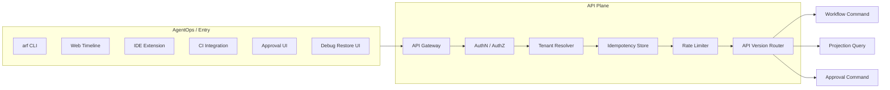
```mermaid
flowchart LR
    subgraph Entry[AgentOps / Entry]
      CLI[arf CLI]
      Web[Web Timeline]
      IDE[IDE Extension]
      CI[CI Integration]
      ApprovalUI[Approval UI]
      DebugUI[Debug Restore UI]
    end

    subgraph API[API Plane]
      Gateway[API Gateway]
      Auth[AuthN / AuthZ]
      Tenant[Tenant Resolver]
      Idem[Idempotency Store]
      Rate[Rate Limiter]
      Version[API Version Router]
    end

    Entry --> Gateway
    Gateway --> Auth
    Auth --> Tenant
    Tenant --> Idem
    Idem --> Rate
    Rate --> Version
    Version --> WorkflowCmd[Workflow Command]
    Version --> Query[Projection Query]
    Version --> ApprovalCmd[Approval Command]
```

AgentOps / API Plane 只负责入口和投影视图。审批、调试接管和 review 操作都必须转成 workflow/governance command，不能直接改 runtime、workspace 或事实表。

#### 6.1.3 Control Plane 架构图

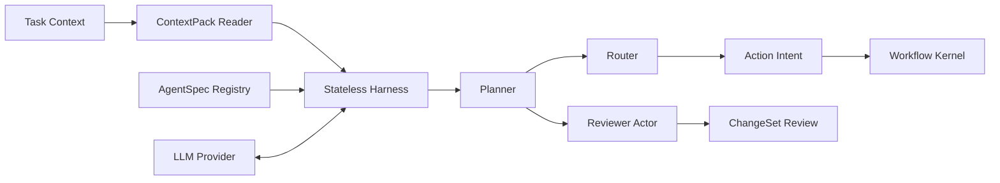
```mermaid
flowchart LR
    TaskCtx[Task Context] --> ContextBuilder[ContextPack Reader]
    ContextBuilder --> Harness[Stateless Harness]
    Harness --> Planner[Planner]
    Planner --> Router[Router]
    Router --> Intent[Action Intent]
    Planner --> Reviewer[Reviewer Actor]
    AgentSpec[AgentSpec Registry] --> Harness
    ModelProvider[LLM Provider] <--> Harness
    Intent --> WorkflowKernel[Workflow Kernel]
    Reviewer --> ChangeSet[ChangeSet Review]
```

Control Plane 的关键约束是无状态和不可执行。它可以调用模型、生成计划、提出 intent、执行 review，但不能直接拿到 shell、secret、network 或 workspace 写权限。

#### 6.1.4 Workflow Plane 架构图

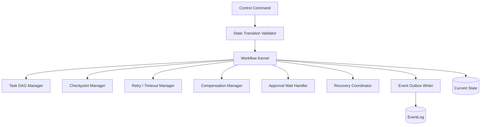
```mermaid
flowchart TB
    Command[Control Command] --> Validator[State Transition Validator]
    Validator --> Kernel[Workflow Kernel]
    Kernel --> TaskGraph[Task DAG Manager]
    Kernel --> Checkpoint[Checkpoint Manager]
    Kernel --> Retry[Retry / Timeout Manager]
    Kernel --> Compensation[Compensation Manager]
    Kernel --> ApprovalWait[Approval Wait Handler]
    Kernel --> Recovery[Recovery Coordinator]
    Kernel --> Outbox[Event Outbox Writer]
    Kernel --> Metadata[(Current State)]
    Outbox --> EventLog[(EventLog)]
```

Workflow Plane 的核心产物是状态转移和恢复游标。所有状态变化必须经过 validator，并写入 `EventLog`。

#### 6.1.5 Governance Fabric 架构图

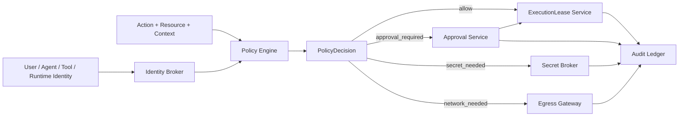
```mermaid
flowchart LR
    Subject[User / Agent / Tool / Runtime Identity] --> Identity[Identity Broker]
    Action[Action + Resource + Context] --> Policy[Policy Engine]
    Identity --> Policy
    Policy --> Decision[PolicyDecision]
    Decision -->|allow| Lease[ExecutionLease Service]
    Decision -->|approval_required| Approval[Approval Service]
    Approval --> Lease
    Decision -->|secret_needed| Secret[Secret Broker]
    Decision -->|network_needed| Egress[Egress Gateway]
    Lease --> Audit[Audit Ledger]
    Approval --> Audit
    Secret --> Audit
    Egress --> Audit
```

Governance Fabric 统一输出可审计事实：`PolicyDecision`、`Approval`、`ExecutionLease`、`SecretGrant`、`EgressDecision`。任何工具或 runtime backend 都不能绕过它。

#### 6.1.6 Execution Plane 架构图

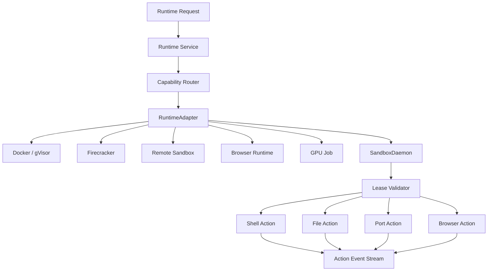
```mermaid
flowchart TB
    RuntimeRequest[Runtime Request] --> RuntimeSvc[Runtime Service]
    RuntimeSvc --> Capability[Capability Router]
    Capability --> Adapter[RuntimeAdapter]
    Adapter --> Container[Docker / gVisor]
    Adapter --> MicroVM[Firecracker]
    Adapter --> Remote[Remote Sandbox]
    Adapter --> Browser[Browser Runtime]
    Adapter --> GPU[GPU Job]
    Adapter --> Daemon[SandboxDaemon]
    Daemon --> LeaseCheck[Lease Validator]
    LeaseCheck --> Shell[Shell Action]
    LeaseCheck --> File[File Action]
    LeaseCheck --> Port[Port Action]
    LeaseCheck --> BrowserAction[Browser Action]
    Shell --> ActionEvents[Action Event Stream]
    File --> ActionEvents
    Port --> ActionEvents
    BrowserAction --> ActionEvents
```

Execution Plane 只执行已授权动作。`RuntimeAdapter` 负责屏蔽 backend 差异，`SandboxDaemon` 负责在执行面强制校验 lease。

#### 6.1.7 State Plane 架构图

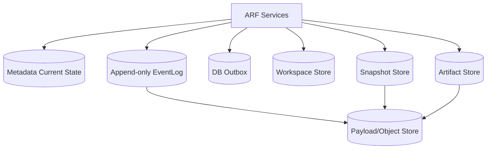
```mermaid
flowchart TB
    Current[(Metadata Current State)]
    EventLog[(Append-only EventLog)]
    Outbox[(DB Outbox)]
    Workspace[(Workspace Store)]
    Snapshot[(Snapshot Store)]
    Artifact[(Artifact Store)]
    Payload[(Payload/Object Store)]

    Services[ARF Services] --> Current
    Services --> EventLog
    Services --> Outbox
    Services --> Workspace
    Services --> Snapshot
    Services --> Artifact
    EventLog --> Payload
    Snapshot --> Payload
    Artifact --> Payload
```

State Plane 的基本规则是 current state 可覆盖更新，事实历史 append-only。payload 可以大对象化，但 envelope 和 manifest 必须可索引。

#### 6.1.8 Evidence / Observability Plane 架构图

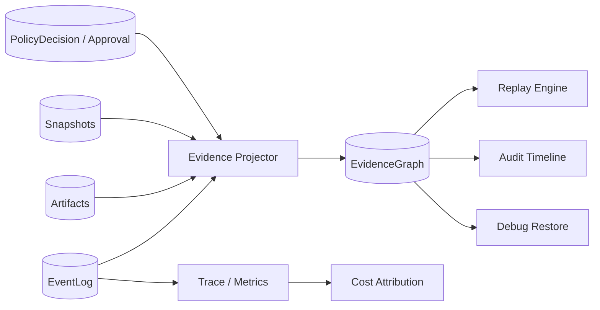
```mermaid
flowchart LR
    EventLog[(EventLog)] --> Projector[Evidence Projector]
    Artifacts[(Artifacts)] --> Projector
    Snapshots[(Snapshots)] --> Projector
    Policies[(PolicyDecision / Approval)] --> Projector
    Projector --> Graph[(EvidenceGraph)]
    Graph --> Replay[Replay Engine]
    Graph --> Timeline[Audit Timeline]
    Graph --> Debug[Debug Restore]
    EventLog --> Trace[Trace / Metrics]
    Trace --> Cost[Cost Attribution]
```

Evidence Plane 的关键边界是只投影事实，不产生事实。Replay 不等于重新执行所有命令，而是按 `Event`、`Artifact`、`Snapshot`、`PolicyDecision` 重建因果链。

#### 6.1.9 Semantic Context Plane 架构图

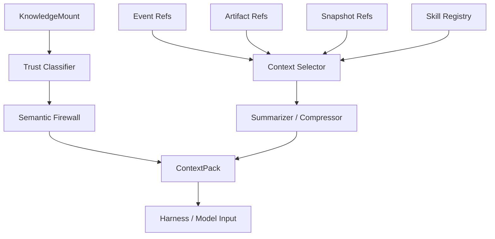
```mermaid
flowchart TB
    EventRefs[Event Refs] --> Selector[Context Selector]
    ArtifactRefs[Artifact Refs] --> Selector
    SnapshotRefs[Snapshot Refs] --> Selector
    Knowledge[KnowledgeMount] --> Trust[Trust Classifier]
    Skill[Skill Registry] --> Selector
    Trust --> SemanticFW[Semantic Firewall]
    Selector --> Summarizer[Summarizer / Compressor]
    SemanticFW --> ContextPack[ContextPack]
    Summarizer --> ContextPack
    ContextPack --> Harness[Harness / Model Input]
```

Semantic Context Plane 的输出只能是可追溯 `ContextPack`。它不修改 policy，不扩大 lease，不替代 `EventLog`。

### 6.2 协议架构模型

ARF 至少包含八类协议。协议的目的不是传输格式统一，而是边界语义统一：谁可以调用谁、能表达什么、不能表达什么、结果如何成为事实。

```mermaid
flowchart TB
    User[IDE / Web / CLI / CI] -->|Control API| API[API Gateway]
    API -->|Workflow Command| WF[Workflow Kernel]
    WF -->|Event Protocol| EL[(EventLog)]
    WF -->|Governance API| GOV[Governance Fabric]
    WF -->|Runtime Protocol| RT[RuntimeAdapter / Daemon]
    RT -->|Event Protocol| EL
    Harness[Harness / AgentActor] -->|Context Protocol| Model[LLM Provider]
    Harness -->|Tool/MCP Protocol| ToolGW[ToolGateway]
    ToolGW -->|Governance API| GOV
    ToolGW -->|Event Protocol| EL
    AgentA[AgentActor A] -->|A2A Protocol| Mailbox[Mailbox]
    Mailbox -->|A2A Protocol| AgentB[AgentActor B]
    EL -->|Evidence Protocol| Evidence[EvidenceGraph / Replay]
    AdapterDev[Adapter Author] -->|Adapter Admission Protocol| Registry[Runtime Registry]
```

#### 6.2.1 协议清单

| 协议 | 调用方向 | 主要对象 | 主要目标 | 禁止事项 |
| --- | --- | --- | --- | --- |
| Control API | 用户入口 -> API Gateway | `Session`, `Task`, `Approval`, `Comment` | 创建目标、查看进度、审批、接管 | 直接执行命令或打开 runtime |
| Workflow Command Protocol | API/Worker -> WorkflowKernel | `WorkflowRun`, `Task`, `Checkpoint` | durable 状态推进 | 依赖 worker 内存保存事实 |
| Event Protocol | 所有服务 -> EventLog | `Event`, `payload_ref` | append-only 事实记录 | 丢 event 后继续成功 |
| Governance API | Workflow/Tool/Runtime -> Governance | `PolicyDecision`, `Approval`, `ExecutionLease`, `SecretGrant` | 授权、审批、secret、egress | 模型自判权限 |
| Runtime Protocol | Workflow/RuntimeService -> Adapter/Daemon | `RuntimeAction`, `ExecutionLease`, `ActionEvent` | 执行已授权动作 | 无 lease action |
| Tool/MCP Protocol | Harness/ToolGateway -> MCP/Tool | `ToolCall`, `ToolResult`, `Artifact` | 工具连接和结果归档 | tool 直接拿 secret 或写 workspace |
| A2A Protocol | AgentActor/Reviewer/MergeQueue 之间 | `A2AEnvelope`, `Ack`, `Retry` | 可恢复协作消息 | 用普通 chat log 替代 mailbox |
| Context Protocol | Harness -> Model | `ContextPack`, `TrustLevel`, `ArtifactRef` | 可追溯模型输入 | 外部内容覆盖 system/policy |
| Evidence Protocol | Projector/UI/Replay -> EvidenceGraph | `EvidenceEdge`, `ReplayFrame` | 因果查询和 replay | 投影修改事实 |
| Adapter Admission Protocol | Adapter author -> Registry | `RuntimeCapabilities`, `AdapterMapping`, `ContractResult` | backend 准入和防腐 | vendor schema 进入 public API |

#### 6.2.2 Control API 协议图

```mermaid
sequenceDiagram
    participant U as User/CI/IDE
    participant API as API Gateway
    participant W as WorkflowKernel
    participant E as EventLog

    U->>API: POST /v1/sessions
    API->>API: auth + idempotency
    API->>W: CreateSession command
    W->>E: SessionCreated
    W-->>API: session_id, workflow_run_id
    API-->>U: 201 Created
```

#### 6.2.3 Workflow Command + Event Protocol 图

```mermaid
sequenceDiagram
    participant API as API Gateway
    participant W as WorkflowKernel
    participant DB as Metadata DB
    participant O as Outbox
    participant E as EventLog
    participant P as Projectors

    API->>W: WorkflowCommand(command_id, expected_state_version)
    W->>W: validate state transition
    W->>DB: compare-and-swap current state
    W->>O: append event envelope
    O->>E: publish/replay event
    E->>P: consume event batch
```

Workflow Command Protocol 保证状态推进有前置条件、幂等键和状态版本；Event Protocol 保证事实 append-only，可重放，可被投影。

#### 6.2.4 Governance + Runtime 协议图

```mermaid
sequenceDiagram
    participant W as WorkflowKernel
    participant G as Governance Fabric
    participant L as LeaseService
    participant A as RuntimeAdapter
    participant D as SandboxDaemon
    participant E as EventLog

    W->>G: Evaluate subject/action/resource
    G-->>W: PolicyDecision allow
    W->>L: Request ExecutionLease
    L-->>W: lease_id
    W->>A: execute(action, lease_id)
    A->>D: RuntimeAction + lease
    D->>D: validate lease
    D->>E: ActionStarted/Output/Finished
```

#### 6.2.5 Tool/MCP 协议图

```mermaid
sequenceDiagram
    participant H as Harness
    participant TG as ToolGateway
    participant G as Governance Fabric
    participant MCP as MCP Server
    participant AS as ArtifactStore
    participant E as EventLog

    H->>TG: ToolCall intent
    TG->>G: policy + secret/egress request
    G-->>TG: PolicyDecision / SecretGrant
    TG->>MCP: call tool with brokered grant
    MCP-->>TG: tool result
    TG->>AS: persist result artifact
    TG->>E: ToolCallFinished
```

#### 6.2.6 A2A 协议图

```mermaid
sequenceDiagram
    participant A as AgentActor A
    participant M as Mailbox
    participant B as AgentActor B
    participant E as EventLog

    A->>M: A2AEnvelope ReviewRequested
    M->>E: MessageEnqueued
    M->>B: deliver message
    B-->>M: Ack
    M->>E: MessageAcked
    B->>M: A2AEnvelope ReviewDecision
    M->>E: MessageEnqueued
```

#### 6.2.7 Context Protocol 图

```mermaid
sequenceDiagram
    participant W as WorkflowKernel
    participant C as ContextPack Builder
    participant SF as Semantic Firewall
    participant H as Harness
    participant M as LLM Provider
    participant E as EventLog

    W->>C: request context for task
    C->>C: load event/artifact/knowledge refs
    C->>SF: classify trust levels
    SF-->>C: safe context segments
    C-->>H: ContextPack with source refs
    H->>M: model call with ContextPack
    H->>E: ModelCallRecorded / IntentProposed
```

Context Protocol 的核心是来源可追溯和 trust level 分区。模型可以使用 ContextPack 生成计划，但不能让外部内容修改 policy、approval 或 lease。

#### 6.2.8 Evidence 协议图

```mermaid
sequenceDiagram
    participant EL as EventLog
    participant P as Evidence Projector
    participant EG as EvidenceGraph
    participant R as ReplayEngine
    participant UI as Timeline UI

    EL->>P: event batch
    P->>P: validate source refs
    P->>EG: upsert EvidenceEdges
    UI->>R: replay task/changeset
    R->>EG: query causality graph
    EG-->>R: edges + completeness
    R-->>UI: ReplayFrames
```

#### 6.2.9 Adapter Admission Protocol 图

```mermaid
sequenceDiagram
    participant Dev as Adapter Author
    participant Reg as Runtime Registry
    participant Lint as Schema Lint
    participant CT as Contract Suite
    participant Sec as Security Review
    participant Router as Capability Router

    Dev->>Reg: submit adapter + RuntimeCapabilities
    Reg->>Lint: validate mapping ADR and schema exposure
    Lint-->>Reg: pass/fail
    Reg->>CT: run adapter contract tests
    CT-->>Reg: ContractResult
    Reg->>Sec: license/security review
    Sec-->>Reg: approve/quarantine/reject
    Reg->>Router: admit capability profile
```

Adapter Admission Protocol 的输出是可路由 capability profile，而不是 vendor backend 的内部对象。任何 contract 失败、schema 泄漏或安全回归都会使 adapter 进入 rejected 或 quarantined。

### 6.3 逻辑模型

逻辑模型分为八个层次。

```mermaid
flowchart TB
    Entry[Entry Layer: CLI / Web / IDE / CI / AgentOps]
    API[API Layer: API Gateway / Auth / Idempotency]
    WF[Workflow Layer: Durable Workflow Kernel / Scheduler]
    CP[Control Layer: Harness / Planner / Reviewer]
    GOV[Governance Layer: Identity / Policy / Approval / Secret / Egress]
    EXEC[Execution Layer: RuntimeAdapter / SandboxDaemon / ToolGateway]
    STATE[State Layer: Metadata / EventLog / Workspace / Snapshot / Artifact]
    OBS[Evidence Layer: EvidenceGraph / Replay / Timeline / Debug]

    Entry --> API
    API --> WF
    WF <--> CP
    WF --> GOV
    CP --> GOV
    WF --> EXEC
    EXEC --> GOV
    EXEC --> STATE
    WF --> STATE
    STATE --> OBS
    GOV --> OBS
```

服务所有权：

| 服务 | 可写对象 | 不可直接写 |
| --- | --- | --- |
| API Gateway | idempotency record、入口事件 | Task current state、PolicyDecision、runtime |
| WorkflowKernel | WorkflowRun/Task current state、checkpoint、workflow events | workspace 文件、secret value、runtime 私有状态 |
| EventLog | event envelope、outbox cursor | 业务 current state |
| WorkspaceService | Workspace、WorkspaceBranch、snapshot metadata、lock/merge state | policy、approval、secret |
| ChangeSetService | ChangeSet、ChangeSetFile、review/merge/rollback 状态 | workspace 原始文件、policy rule |
| SnapshotStore | snapshot manifest、delta object、GC report | Task 状态、runtime 状态 |
| ArtifactStore | artifact manifest、payload object、checksum | Event envelope、PolicyDecision |
| PolicyEngine | PolicyDecision、risk classification | Approval final state、runtime execution |
| ExecutionLeaseService | ExecutionLease state、lease events | policy rules、daemon result |
| RuntimeAdapter | RuntimeInstance metadata、adapter events | workspace 长期事实、policy decision |
| SandboxDaemon | action observation events、stdout/stderr chunks | lease issuance、metadata current state |
| EvidenceGraph | EvidenceEdge projection、ReplayFrame projection | EventLog/Snapshot/Artifact 原始事实 |

### 6.4 技术模型

MVP 技术栈建议：

| 能力 | MVP 技术选择 | 后续替换路径 |
| --- | --- | --- |
| API | REST/OpenAPI + JSON Schema | gRPC、GraphQL projection |
| Metadata | PostgreSQL | 分库分表、托管 Postgres |
| EventLog | PostgreSQL append-only table + DB outbox | Kafka/Redpanda/NATS + projection store |
| Workflow | DB outbox worker + checkpoint table | Temporal/Restate-like adapter |
| Runtime | Docker container adapter | gVisor、Firecracker、E2B、Modal、Daytona、OpenHands adapter |
| Daemon | 自建最小 sandbox-daemon | OpenHands action executor adapter |
| Workspace | local dir + Git worktree + fs snapshot manifest | OverlayFS、ZFS/Btrfs、object-store delta |
| Artifact | local filesystem with checksum | S3-compatible object store |
| Policy | YAML allowlist + deterministic classifier | OPA、Cedar |
| Secret | fake broker | OpenBao、Vault、KMS |
| Observability | CLI timeline + Event/Evidence query | OpenTelemetry、Tempo/Jaeger、Loki/ClickHouse |
| CLI | `arf` CLI | Web timeline、AgentOps UI |

关键技术约束：

- 所有 public schema 存放在版本化包中。
- 所有 adapter 通过同一 contract suite。
- `RuntimeCapabilities` 参与调度，不通过 backend 名称硬编码。
- Event payload 大对象化，envelope 保持可索引。
- Snapshot 和 Artifact 均强制 checksum。

关键序列图：

```mermaid
sequenceDiagram
    participant H as Harness
    participant W as WorkflowKernel
    participant P as PolicyEngine
    participant L as LeaseService
    participant R as RuntimeAdapter
    participant D as SandboxDaemon
    participant E as EventLog
    participant A as ArtifactStore
    participant G as EvidenceGraph

    H->>W: shell.execute intent
    W->>P: evaluate(subject, action, resource)
    P-->>W: PolicyDecision allow
    W->>L: request lease
    L-->>W: ExecutionLease
    W->>R: execute(action, lease)
    R->>D: action + lease
    D->>D: validate lease
    D->>E: ActionStarted
    D->>E: ActionOutput
    D->>A: stdout/stderr artifact
    D->>E: ActionFinished
    E->>G: project edges
    W->>W: advance Task state
```

### 6.5 数据模型

数据分为事实、当前态、投影和大对象。

| 数据类别 | 存储 | 示例 | 一致性 |
| --- | --- | --- | --- |
| 当前态 | PostgreSQL metadata tables | session、workflow_run、task、runtime_instance current state | optimistic concurrency |
| 事实历史 | EventLog append-only table | CommandFinished、SnapshotCreated、ApprovalGranted | append-only + outbox |
| 大对象 | Object/File store | stdout、stderr、patch、snapshot delta、trace payload | checksum + manifest |
| 投影 | PostgreSQL/graph/projection tables | EvidenceEdge、ReplayFrame、timeline view | eventual consistency |
| 配置和策略 | Versioned tables/files | policy bundle、environment spec、agent spec | version pinned |

核心表建议：

| 表 | 主键 | 说明 |
| --- | --- | --- |
| `sessions` | `session_id` | 用户目标容器 |
| `workflow_runs` | `workflow_run_id` | durable workflow 状态 |
| `tasks` | `task_id` | 工作单元 |
| `events` | `event_id` | append-only event envelope |
| `event_payloads` | `payload_ref` | 可选，或放 object store |
| `workspaces` | `workspace_id` | 工程现场 |
| `workspace_branches` | `branch_id` | branch/lock/merge state |
| `snapshots` | `snapshot_id` | manifest 和 lineage |
| `artifacts` | `artifact_id` | manifest、checksum、provenance |
| `policy_decisions` | `decision_id` | 授权事实 |
| `execution_leases` | `lease_id` | 短期执行授权 |
| `approvals` | `approval_id` | 审批状态 |
| `secret_grants` | `grant_id` | secret grant metadata |
| `tool_calls` | `tool_call_id` | 工具调用 |
| `changesets` | `changeset_id` | 代码变更证据单元 |
| `evidence_edges` | `edge_id` | 因果投影 |
| `runtime_capabilities` | `adapter_id` | backend 能力声明 |
| `adapter_mappings` | `mapping_id` | 外部 schema 映射和 contract 结果 |

索引原则：

- EventLog envelope 索引 `tenant_id`、`session_id`、`workflow_run_id`、`task_id`、`correlation_id`、`causation_id`、`type`、`timestamp`。
- Artifact 按 `task_id`、`snapshot_id`、`type`、`checksum` 索引。
- Snapshot 按 `workspace_id`、`branch_id`、`parent_snapshot_id`、`retention_class` 索引。
- EvidenceEdge 按 `(from_type, from_id)` 和 `(to_type, to_id)` 双向索引。

数据治理：

- Event envelope 长期保留，敏感字段放 payload/artifact 并支持 redaction。
- Snapshot GC 前必须做 reachability analysis。
- Artifact manifest 长期保留，payload 按 retention class 过期。
- Redaction 通过事件表达，不无痕物理改事实。

### 6.6 代码模型

推荐仓库结构：

```text
agentruntimefabric/
  apps/
    api/
    worker/
    daemon/
    cli/
  services/
    workflow-kernel/
    workspace-service/
    changeset-service/
    policy-service/
    runtime-service/
    evidence-graph/
    observability-service/
  packages/
    event-schema/
    public-api-schema/
    runtime-adapter-sdk/
    adapter-contract-suite/
    policy-sdk/
    snapshot-manifest/
    artifact-provenance/
    evidence-edge/
    a2a-mailbox/
    context-pack/
  adapters/
    docker/
    gvisor/
    openhands/
    e2b/
    modal/
    daytona/
    firecracker/
  db/
    migrations/
    seeds/
  docs/
    architecture/
    adr/
    api/
  tests/
    unit/
    contract/
    integration/
    recovery/
    security/
```

代码级规则：

- Schema first: public API、Event、Manifest、Adapter contract 先定义 schema。
- Contract first: fake adapter 先通过 contract tests，再写真实 adapter。
- State machine explicit: 状态转移集中实现，非法转移有测试。
- Idempotency mandatory: 所有写 API 接受并验证 idempotency key。
- No hidden execution path: 任何执行 action 的代码必须依赖 lease 校验中间件。
- No secret value in logs: 日志和 artifact 写入前经过 redaction hook。
- Projection isolated: `EvidenceGraph`、timeline、context summary 不能修改事实表。
- ADR required: 新公共对象、新协议、新 backend 准入必须有 ADR。

### 6.7 构建模型

构建流水线必须覆盖 schema、状态机、adapter、安全和恢复。

```mermaid
flowchart LR
    Lint[Lint / Typecheck]
    Schema[Schema Compatibility]
    Unit[Unit Tests]
    State[State Machine Tests]
    Contract[Adapter Contract Tests]
    Sec[Security Fixtures]
    Int[Integration Tests]
    Recovery[Crash Recovery Tests]
    Build[Build Images / CLI]
    SBOM[SBOM / Signing]
    Release[Release Candidate]

    Lint --> Schema --> Unit --> State --> Contract --> Sec --> Int --> Recovery --> Build --> SBOM --> Release
```

必须测试类型：

| 测试 | 目标 |
| --- | --- |
| Schema compatibility | 新 schema 向后兼容，breaking change 有 ADR |
| State transition tests | WorkflowRun、Task、ExecutionLease、RuntimeInstance、ChangeSet 非法转移失败 |
| Idempotency tests | 重试不会创建重复 session/task/approval/artifact |
| Adapter contract tests | fake、Docker、remote adapter 同测 |
| Lease bypass tests | 无 lease、过期 lease、伪造 lease 全失败 |
| Policy deny tests | deny 不执行，写 PolicyDecision 和错误 |
| Secret redaction tests | secret 不进入 stdout/stderr/artifact/model context |
| Prompt injection tests | 外部内容不能修改 policy/system/approval |
| Recovery tests | 真实 kill worker/runtime 后恢复 |
| Replay completeness tests | 缺少关键 evidence edge 时返回 partial |
| GC dry-run tests | snapshot/artifact GC 不删除 active reference |

构建产物：

- API server image。
- worker image。
- sandbox-daemon image。
- CLI binary/package。
- migration artifact。
- schema bundle。
- adapter contract test package。
- SBOM 和镜像签名。

### 6.8 部署模型

#### 6.8.1 本地开发部署

```mermaid
flowchart TB
    CLI[arf CLI]
    API[api]
    Worker[worker]
    PG[(PostgreSQL)]
    Store[(local object store)]
    Docker[Docker Runtime]
    Daemon[SandboxDaemon in container]

    CLI --> API
    API --> PG
    API --> Store
    Worker --> PG
    Worker --> Store
    Worker --> Docker
    Docker --> Daemon
    Daemon --> PG
    Daemon --> Store
```

目标：

- 一条命令启动。
- 无云账号。
- 可运行 `arf demo recovery --repo <fixture>`。
- 适合作为开源贡献者默认环境。

#### 6.8.2 单节点开源部署

组件：

- API Gateway。
- Worker pool。
- PostgreSQL。
- S3-compatible object store。
- Docker/gVisor runtime pool。
- Policy service。
- EvidenceGraph projector。
- CLI/minimal web timeline。

适用：

- 小团队。
- 内网 POC。
- 非生产代码仓库自动化。

#### 6.8.3 多租户平台部署

```mermaid
flowchart TB
    Ingress[Ingress / API Gateway]
    Auth[AuthN/AuthZ]
    API[API replicas]
    Worker[Worker pool]
    Policy[Policy/Approval/Secret/Egress]
    RuntimeSvc[Runtime Service]
    RuntimePool[Runtime Pools: gVisor / MicroVM / Remote Sandbox]
    PG[(HA PostgreSQL)]
    Obj[(Object Store)]
    Event[Event Outbox / Stream]
    Projector[Evidence/Timeline Projectors]
    Obs[Observability Backend]

    Ingress --> Auth --> API
    API --> PG
    API --> Obj
    API --> Event
    Worker --> PG
    Worker --> Event
    Worker --> Policy
    Worker --> RuntimeSvc
    RuntimeSvc --> RuntimePool
    RuntimePool --> Obj
    RuntimePool --> Event
    Event --> Projector
    Projector --> PG
    API --> Obs
    Worker --> Obs
    RuntimePool --> Obs
```

部署隔离：

- API/worker 与 runtime pool 网络隔离。
- runtime 默认无网络出口，通过 EgressGateway 放行。
- secret 只通过 SecretBroker grant 使用。
- untrusted repo 使用 gVisor/microVM/remote sandbox profile。
- tenant 级 quota、runtime idle TTL、snapshot retention、artifact retention。

高可用和灾备：

- Metadata DB 使用备份和 point-in-time recovery。
- EventLog envelope 不丢失，outbox 可重放。
- Object store 使用 checksum verify 和 lifecycle policy。
- Worker stateless，可横向扩展。
- RuntimeInstance 可丢失，恢复依赖 snapshot 和 EventLog。

容量维度：

| 维度 | 扩展方式 |
| --- | --- |
| API 请求 | API replicas + rate limit |
| Workflow backlog | worker pool scale-out |
| Event projection | projector consumer group |
| Runtime capacity | runtime pool autoscale + idle TTL |
| Snapshot storage | retention class + GC + cold storage |
| Artifact/log storage | chunking + compression + lifecycle |
| Policy latency | decision cache + policy bundle version pinning |

## 7. 架构治理

### 7.1 架构适应度函数

后续 PR 或设计变更必须通过以下适应度函数：

| 适应度函数 | 失败条件 |
| --- | --- |
| State machine fitness | 新状态或转移没有非法转移测试 |
| Policy-bound fitness | 新 action 类型没有 PolicyDecision 和 ExecutionLease 校验 |
| Evidence fitness | 新 artifact、snapshot、diff、approval 没有 EvidenceGraph 投影 |
| Runtime anti-corruption fitness | public API 或核心表出现 vendor runtime/snapshot id 作为业务主键 |
| Recovery fitness | 新执行路径无法在 worker/runtime kill 后恢复 |
| Secret fitness | secret value 可能进入模型、workspace、日志或 artifact |
| Data governance fitness | 新数据类型没有 retention class、访问控制和 GC 策略 |
| Operability fitness | 新后台流程没有 dead letter、指标或 admin repair 路径 |


### 7.2 ADR 清单

首批必须落地的 ADR：

| ADR | 决策 | 状态 |
| --- | --- | --- |
| ADR-001 | Event envelope 与 payload 分离，envelope 可索引 | 必做 |
| ADR-002 | MVP workflow kernel 采用 DB outbox/minimal worker 还是 Temporal adapter | 待验证 |
| ADR-003 | MVP snapshot 只承诺 fs snapshot，不承诺 process/memory resume | 已决定 |
| ADR-004 | ExecutionLease 是所有 runtime action 的强制前置条件 | 已决定 |
| ADR-005 | PolicyDecision 是标准输出，OPA/Cedar/YAML 只是实现 | 已决定 |
| ADR-006 | WorkspaceBranch 不等价于 Git branch/worktree | 已决定 |
| ADR-007 | OpenTelemetry span 不是 replay 事实源 | 已决定 |
| ADR-008 | Secret value 永不进入模型、workspace、普通 env、stdout/stderr、artifact | 已决定 |
| ADR-009 | Context/Knowledge/Skill 不进入 MVP 执行路径 | 已决定 |
| ADR-010 | Adapter capability matrix 允许 backend 差异，但禁止 vendor schema 泄漏 | 必做 |
| ADR-011 | ARF 作为开源替代，云/闭源平台只能作为 backend | 已决定 |
| ADR-012 | ChangeSet 是代码变更 Agent 的核心产品对象 | 必做 |
| ADR-013 | EvidenceGraph 是 replay/audit 查询投影，不是事实源 | 必做 |

### 7.3 发布闸门

| 闸门 | 必须回答的问题 | 证据 |
| --- | --- | --- |
| Architecture Gate | 核心对象和状态机是否没有混淆 | schema、ADR、非法状态测试 |
| Recovery Gate | worker/runtime 被真实 kill 后能否恢复 | recovery integration test |
| Security Gate | 是否存在绕过 PolicyDecision/ExecutionLease 的路径 | lease bypass、policy deny、secret redaction fixture |
| Evidence Gate | command、artifact、snapshot、approval、ChangeSet 是否能串成因果链 | EvidenceGraph query fixture |
| Adapter Gate | backend 替换是否不影响核心对象 | fake + container adapter contract tests |
| Open-source Gate | 无云账号、无闭源控制面能否跑核心 demo | local stack、public schema |
| Operator Gate | 卡死、堆积、泄漏、GC 是否有处置路径 | admin API、dead letter、GC dry-run |
| Adoption Gate | 新用户能否快速跑通核心 demo | `arf demo recovery` |

### 7.4 开放问题

| 问题 | 备选方案 | 评估指标 |
| --- | --- | --- |
| Workflow engine | DB outbox/minimal worker、Temporal adapter、Restate-like runtime | 本地启动成本、恢复语义、debug 能力 |
| Snapshot 技术 | Git worktree + tar/delta、OverlayFS、ZFS/Btrfs、object-store delta | restore latency、checksum 成本、跨平台可用性 |
| Event store | PostgreSQL append-only、Kafka/Redpanda/NATS + projection | 一致性、部署成本、重放复杂度 |
| Policy engine | YAML allowlist、OPA、Cedar | latency、解释性、版本固定 |
| Sandbox isolation | Docker、gVisor、Firecracker、远程 sandbox | 安全等级、冷启动、文件挂载、成本 |
| Artifact storage | local FS、S3-compatible、database large object | checksum、retention、迁移 |
| UI 形态 | CLI first、minimal web timeline、full AgentOps | 首次成功时间、调试效率、实现成本 |

### 7.5 延后能力

前三个阶段不应进入主线的复杂度：

- 多 Agent 深度调度和自动语义合并。
- 生产级组织权限模型。
- memory snapshot、process hibernation、GPU checkpoint。
- Knowledge graph、semantic search、Skill 自动生成。
- 复杂 AgentOps 看板。
- 多租户计费。
- 自动 PR merge/release/publish。

如果 PR 引入这些能力，必须证明它不扩大核心接口、不绕过 PolicyDecision/ExecutionLease、不阻塞 MVP recovery demo。

## 8. 结论

ARF 的架构成立条件不是“Agent 能运行命令”，而是以下能力同时成立：

- 长任务可 durable 恢复。
- runtime 可销毁，workspace 和 event 仍保留事实。
- 每个跨边界动作都有 `PolicyDecision` 和 `ExecutionLease`。
- 代码变更被组织为 `ChangeSet`，并绑定 snapshot、diff、test、review、approval、merge/rollback。
- `EvidenceGraph` 能查询 action、artifact、snapshot、policy、approval、identity、runtime 的因果边。
- 外部 runtime backend 可替换，不污染核心 schema。
- 无云账号、无闭源控制面可跑通本地 recovery demo。

MVP 发布必须满足：

- `arf demo recovery` 一条命令跑通。
- kill workflow worker 后从 checkpoint/event cursor 恢复。
- kill container runtime 后从 fs snapshot 恢复，checksum 一致。
- 无有效 lease 的 `shell.execute` 被 daemon 拒绝。
- policy deny 返回可解释错误并写入 `PolicyDecision`。
- stdout/stderr/artifact 有 checksum 和 provenance。
- `ChangeSet` 记录 base/head snapshot、diff artifact、test artifact。
- `EvidenceGraph` 能查询 command、stdout/stderr、snapshot、policy、artifact、`ChangeSet` 因果链。
- outbox 停止再恢复后不丢 event。
- snapshot GC dry-run 能说明哪些 snapshot 不可删除及原因。
- README 明确非目标：不支持 memory snapshot、多 Agent、真实 secret broker、生产发布。

最终评审结论：ARF 应以“开源、自托管、可检查、可替换的 code-changing agent change-control runtime fabric”为长期定位。它的架构核心是 `WorkflowRun / Task / ExecutionLease / RuntimeInstance` 四层生命周期、`Workspace / Snapshot / ChangeSet` 工程现场模型、`PolicyDecision / ExecutionLease / Approval / SecretGrant` 治理模型、`RuntimeAdapter / RuntimeCapabilities` backend 防腐模型，以及 `EventLog / Artifact / EvidenceGraph / Replay` 证据模型。只要这些模型保持清晰并以 contract tests 和 recovery demo 证明，ARF 才能支撑国际顶级专家评审和后续开源实现。
