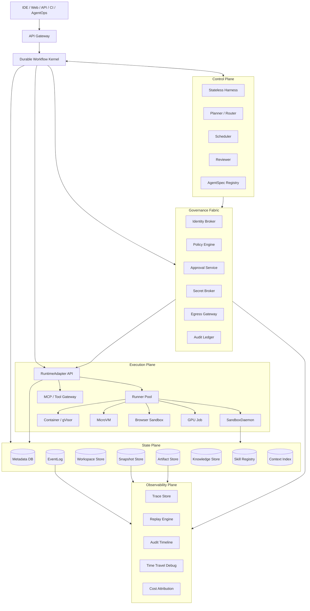
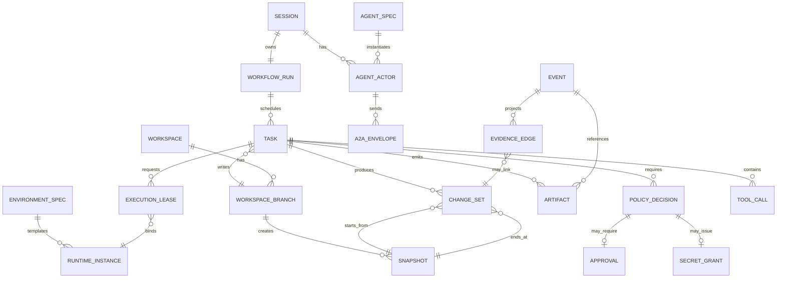
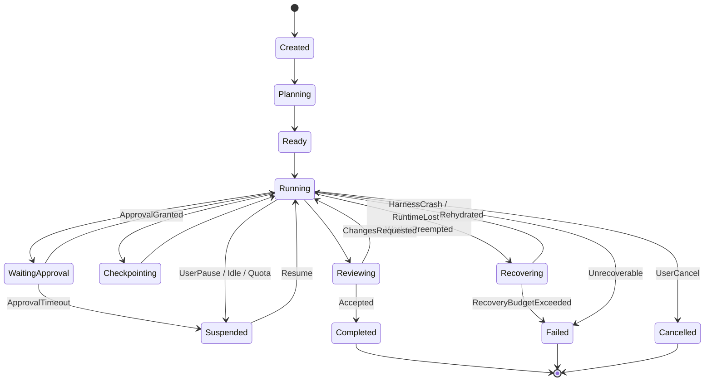
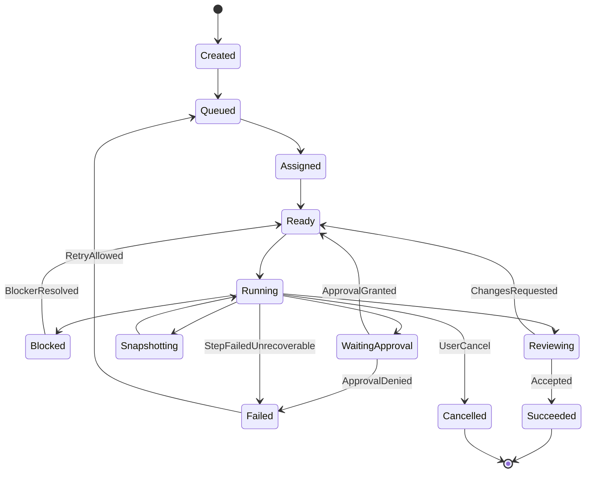
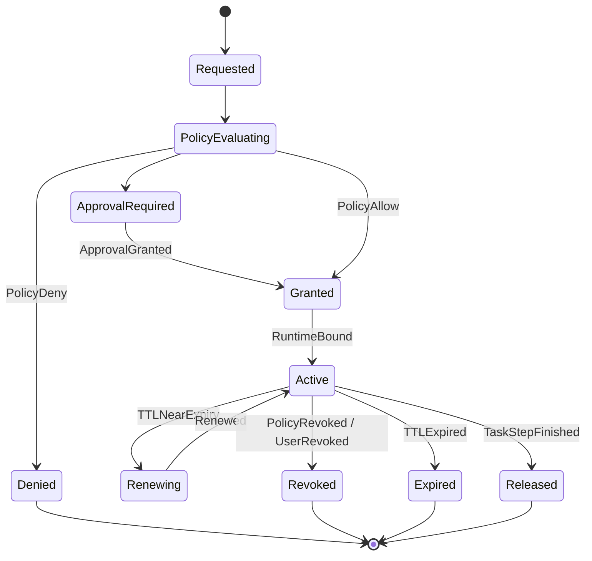
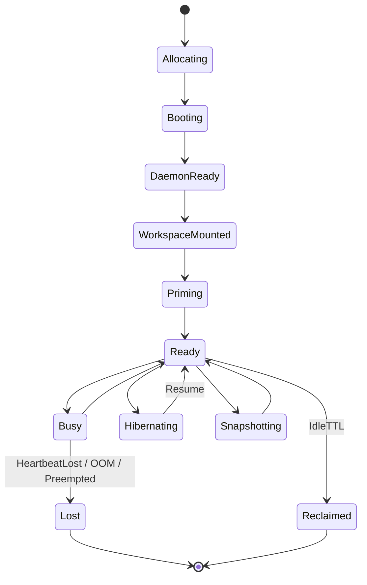

# AgentRuntimeFabric 架构方案评审稿 v2

## 1. 文档目标与评审结论

本文是 AgentRuntimeFabric 的最终架构评审归档稿。它基于前序架构、实现方案和需求规格整理而成，目标是沉淀一份可评审、可存档、可用于后续拆分实现的完整方案，而不是过程笔记、调研合集或任务拆解清单。

AgentRuntimeFabric 是一个开源、模型无关、可自托管的 Agentic Workflow Operating Layer。它位于模型编排层和 sandbox 执行层之间，用 durable workflow 管理长任务，用 workspace lineage 承载工程现场，用 policy/identity 约束权限，用 runtime adapter 接入异构执行后端，用 replayable event fabric 提供审计、恢复和调试。

一句话定义：

> AgentRuntimeFabric turns flaky long-running coding agents into recoverable, auditable, policy-bound workflows.

本方案的核心判断是：AgentRuntimeFabric 的第一性验证不是“能跑 Agent”，而是长任务在 worker、runtime、审批、网络、外部副作用和多 Agent 协作等失败条件下仍然可恢复、可审计、可解释。

### 1.0 行业对标与开源替代定位

截至 2026-05-07，ARF 不能把 durable workflow、sandbox snapshot、MCP、multi-agent、enterprise governance 本身当作独占差异化。OpenAI Agents SDK、Google ADK、AutoGen/Microsoft Agent Framework 已覆盖 Agent 编排和工具；LangGraph、Temporal、Vercel Workflow 已覆盖 durable execution；E2B、Modal、Daytona、Vercel Sandbox、OpenHands 已覆盖 sandbox/workspace/snapshot 的大量能力；AWS Bedrock AgentCore 已把 Runtime、Memory、Gateway、Identity、Observability、Policy、Registry 做成托管企业平台；MCP、A2A、AG-UI、OpenTelemetry 也在成为协议和观测基础设施。

用户目标不是否认这些闭源或托管平台已经实现相关能力，而是做开源替代：闭源平台已经验证了 Agent runtime fabric 的需求，开源生态仍缺少一个开放 schema、自托管、本地可跑、后端可替换、面向代码变更 Agent 的控制平面。

因此 ARF 的定位调整为：

> ARF is an open change-control runtime fabric for code-changing agents: every action is leased, every workspace change is lineage-tracked, every artifact is evidence, and every runtime backend is replaceable.

ARF 要构建的开源替代能力：

| 能力 | 要解决的开源缺口 | 系统边界 |
| --- | --- | --- |
| EvidenceGraph | 开源 Agent 项目常有日志和 trace，但缺少 command、diff、artifact、snapshot、policy、approval、runtime 的因果证据图 | `EvidenceGraph API`、event-to-edge projector、replay completeness gate |
| PolicyBoundExecution | 工具协议和 sandbox 执行常与授权、secret、网络出口脱节 | `PolicyDecision`、`ExecutionLease`、SandboxDaemon/ToolGateway 强制校验 |
| WorkspaceLineageForAgents | coding agent 常直接改目录或 Git branch，缺少平台级 branch/lock/snapshot/review/rollback 语义 | `WorkspaceBranch`、`ChangeSet`、`ReviewDecision`、`MergeQueue` |
| RuntimeAntiCorruption | sandbox/runtime 后端分散，容易把厂商 schema 绑定进平台 | `RuntimeAdapter`、`RuntimeCapabilities`、Adapter Mapping ADR、schema lint、contract tests |
| AgentChangeControl | 泛化 Agent 平台太宽，开源首秀不尖锐 | 以 repo 变更、测试、diff、review、rollback、debug restore 为第一产品闭环 |
| OpenControlPlane | 闭源平台能力完整但不可 fork、不可内网审计、不可替换控制面 | local stack、public schema、adapter SDK、无云账号 recovery demo |

不再宣称“ARF 也有 workflow/sandbox/snapshot/policy/multi-agent 所以差异化”。更准确的说法是：ARF 把这些已被闭源平台验证的能力，用开源控制面和可检查契约重新组织起来。

### 1.1 完整方案与 MVP 的关系

本文保留完整目标架构，包括 Governance Fabric、多 Agent、Knowledge、Skill、AgentOps、Replay、Time Travel Debug 和多后端 RuntimeAdapter。MVP 不是长期边界，只是第一阶段落地闭环。

MVP 只证明以下能力：

1. 长任务被 worker kill 后继续。
2. runtime 被 kill 后从文件系统 snapshot 和 event cursor 恢复。
3. 高风险动作被 policy/approval 卡住，等待期间不强制占用 runtime。
4. 失败可通过 replay timeline 解释 command、diff、snapshot、policy 和 artifact 的因果链。
5. 上述能力可在本地 Docker、PostgreSQL 和文件对象存储中一条命令复现。

完整方案在 MVP 之后继续演进：

- 多 Agent 协作通过 branch、mailbox、review、merge queue 和 EventLog 管理。
- Knowledge、Skill、Context summary 是事实投影，不是事实源，也不能扩大权限。
- Secret、egress、approval、audit 由 Governance Fabric 统一建模。
- 多 runtime 后端通过能力矩阵接入，不泄漏 vendor schema。
- Replay 与 Time Travel Debug 从 EventLog、Snapshot、Artifact、PolicyDecision 重建因果链。

### 1.2 非目标与降级原则

为了保证方案可交付，以下能力在 MVP 中必须降级，但在完整方案中保留扩展位置：

| 能力 | MVP 降级 | 后续进入条件 |
| --- | --- | --- |
| Memory/process snapshot | 不支持，只支持 fs snapshot 和 event cursor 恢复 | 至少两个 runtime backend 能声明并验证 memory/process snapshot |
| 多 Agent | 不支持并发写，只支持单 Agent 单 branch | 单 Agent recovery、artifact、policy、replay 指标达标 |
| 企业 IAM | 只做本地 identity 和 policy bundle | 有真实 secret broker、approval、audit integration 需求 |
| Knowledge/Skill | 不进入执行主路径 | Context provenance 和 prompt injection 测试通过 |
| 复杂 UI | CLI + minimal timeline | API 和 event projection 稳定 |
| 多云后端 | Docker/container + fake adapter | Adapter contract tests 稳定 |
| 自动发布/生产操作 | 默认 deny，只做审批事件模拟 | SecretGrant、effect ledger、external reconciliation 完整 |

### 1.3 北极星指标

| 指标 | 含义 |
| --- | --- |
| `time_to_first_recovered_task` | 新用户从 clone 到跑通 kill-and-recover demo 的时间 |
| `recovery_success_rate` | 真实恢复测试成功率 |
| `provenance_coverage` | command、artifact、snapshot、policy、approval 的关联完整率 |
| `adapter_contract_pass_rate` | 每个 adapter 通过同一套 contract tests 的比例 |
| `operator_repair_time` | 任务卡死、outbox 堆积、artifact 丢失时人工修复耗时 |

## 2. 核心需求与验收映射

需求必须可分解、可约束、可验证、可复用。以下编号作为后续 issue、PR、测试用例和实现任务的稳定引用。

| 编号 | 需求 | 约束 | 验证方式 | 首次交付 |
| --- | --- | --- | --- | --- |
| R1 | Durable Workflow | WorkflowRun 不依赖 HTTP request、worker 或 runtime 存活 | 杀死 worker 后从 checkpoint 和 event cursor 恢复 | Phase 0 |
| R2 | Workspace-first | repo、deps、cache、logs、ports、browser state、artifacts 归入 workspace 或 artifact store | 恢复后能找到同一仓库状态、日志和产物 | Phase 1 |
| R3 | Snapshot-first | snapshot 是恢复、分支、回滚和调试原语，默认 fs-delta | runtime crash 后从最近 snapshot 恢复 | Phase 1 |
| R4 | Execution Lease | Agent/Harness 只能请求执行，不能直接拥有 shell、secret 或网络权限 | 过期或伪造 lease 被 daemon 拒绝 | Phase 2 |
| R5 | Policy first-class | 命令、路径、网络、密钥、审批均声明式、版本化、可审计 | 每条命令有 PolicyDecision | Phase 2/3 |
| R6 | Event as Fact | 所有状态变化 append-only 写入 EventLog，摘要不能替代事实 | replay 能重建 timeline | Phase 0 |
| R7 | Runtime Adapter | 后端通过能力矩阵接入，上层不猜测能力 | fake/container adapter 通过同一 contract tests | Phase 1/5 |
| R8 | Observability and Replay | 不只看日志，要能解释执行因果 | 失败点能看到 command、diff、policy、snapshot、artifact | Phase 1 |
| R9 | Multi-Agent Collaboration | 并发 Agent 不共享同一可写目录 | 两分支并发修改后通过 merge queue 合并或报冲突 | Phase 4 |
| R10 | Identity Governance | user、agent、tool、runtime、secret 身份分离 | agent 不能继承用户全量权限 | Phase 3 |
| R11 | Semantic Context | 上下文摘要是事实投影；外部内容按 trust level 处理 | prompt injection 不能修改 policy 或 approval | Phase 6 |
| R12 | Skill Reuse | 成功路径可沉淀为 Skill/Playbook，但不能扩大权限 | SkillApplied 后命令仍需 PolicyDecision | Phase 6 |
| R13 | AgentOps | 看板、评论、阻塞、审批是事件投影 | UI 状态可由 EventLog 重放生成 | Phase 6 |
| R14 | Idempotency and Compensation | 外部副作用动作必须有幂等键、pending/commit 或补偿动作 | retry 不重复 publish、push 或写生产 API | Phase 3 |
| R15 | EvidenceGraph | Event、Action、ToolCall、Diff、Snapshot、Artifact、PolicyDecision、Approval、Identity、SecretGrant、RuntimeInstance 必须可查询因果关系 | 失败任务能回答“谁在什么策略下做了什么，改变了哪些文件，产物和恢复点是什么” | Phase 1/6 |
| R16 | PolicyBoundExecution | shell、MCP、network、secret、Git/PR/publish 都必须绑定短期 lease 和版本化 PolicyDecision | daemon/gateway 拒绝 lease 绕过 | Phase 2/3 |
| R17 | WorkspaceLineageForAgents | 代码变更以 ChangeSet 为中心，连接 base snapshot、diff、test artifact、review、approval、merge/rollback | patch 可追溯到 base snapshot、测试结果和 merge/rollback 决策 | Phase 1/4 |
| R18 | RuntimeAntiCorruption | 外部 runtime/sandbox/workflow/agent SDK schema 不能进入 ARF public API 或核心事实表 | schema lint 和 adapter contract tests 拒绝 vendor schema 泄漏 | Phase 0/5 |
| R19 | AgentChangeControl | 首个产品闭环聚焦 Agent 对代码仓库的受控变更 | demo 生成 ChangeSet、timeline、rollback snapshot 和 recovery report | Phase 1 |
| R20 | OpenControlPlane | 最小控制面自托管、本地可跑、schema 开放；云厂商能力只是 adapter | 无云账号跑通 recovery demo；切换云 sandbox 不改 API/schema | Phase 0/5 |

## 3. 使用者与场景

| 使用者 | 使用方式 | 解决的问题 |
| --- | --- | --- |
| Agent 平台开发者 | 实现 workflow、runtime、policy、workspace、event 等服务 | 把 Agent 从单进程工具调用升级为可恢复平台 |
| Agent/Codex 开发代理 | 按模块和接口拆任务、写代码、补测试 | 避免混淆生命周期边界 |
| 企业安全/平台团队 | 配置 policy、identity、secret、egress、audit | 让 Agent 执行第三方代码时可控可审计 |
| 开发者用户 | 从 IDE/Web/API/CI 创建任务、看进度、审批、接管调试 | 长时工程任务不中断、可恢复、可解释 |
| Reviewer/维护者 | 查看 diff、artifact、trace、review decision、merge queue | 多 Agent 产出可验证、可回滚 |
| 知识/运营团队 | 管理 KnowledgeBase、Skill/Playbook、AgentOps 流程 | 把成功经验沉淀为可复用资产 |

核心场景：

- 复杂软件工程：修 bug、迁移框架、补测试、跑构建、生成 PR。
- 长时后台任务：依赖安装、测试矩阵、网络抖动、审批等待、机器抢占。
- 多 Agent 协作：后端、前端、测试、Reviewer 并行分支工作。
- 浏览器/UI 自动化：端口、截图、trace、录屏和浏览器状态归档。
- 数据/GPU 任务：通过 adapter 纳入同一 task、policy、event、artifact 模型。
- 高安全任务：第三方依赖、不可信代码、生产 API、密钥和发布动作受控。

## 4. 总体架构



| 平面/层 | 职责 | 不做什么 |
| --- | --- | --- |
| AgentOps/UI | 任务入口、看板、评论、阻塞、审批入口、进度流 | 不直接调用 Runtime，不保存安全事实 |
| API Gateway | 认证、租户、限流、幂等键、API 版本 | 不编排 workflow，不执行命令 |
| Workflow Kernel | WorkflowRun 状态机、Task DAG、checkpoint、retry、approval wait、compensation | 不做 prompt 细节，不直接 shell |
| Control Plane | Harness、规划、路由、review、上下文构造、模型调用 | 不绕过 policy，不保存不可恢复事实 |
| Governance Fabric | 身份、策略、审批、密钥、网络出口、审计 | 不依赖模型自觉遵守权限 |
| Execution Plane | 分配 runtime、挂载 workspace、执行 action、开放端口、采集 observation | 不保存长期事实，不决定业务授权 |
| State Plane | metadata、event、workspace、snapshot、artifact、knowledge、skill、index | 不把摘要当事实源 |
| Semantic Context Plane | 日志摘要、来源分级、上下文索引、语义防火墙 | 不修改原始事实，不扩大权限 |
| Observability Plane | trace、metrics、timeline、replay、time travel、成本归因 | 不只做日志搜索 |

## 5. 模块边界与稳定接口

### 5.1 核心模块

| 模块 | 所属边界 | 核心职责 | 稳定接口 |
| --- | --- | --- | --- |
| `api-gateway` | API | REST/gRPC 入口、幂等、租户、鉴权 | Public API v1 |
| `workflow-kernel` | Workflow | WorkflowRun/Task 状态推进、checkpoint、retry、compensation | WorkflowRun API、Task API |
| `metadata-store` | State | 对象主数据、当前态、关联关系、事件游标 | SQL schema、repository interface |
| `event-log` | Evidence | append-only event、payload ref、correlation/causation | Event Envelope v1 |
| `evidence-graph` | Evidence/Observability | 投影 action、diff、artifact、snapshot、policy、approval、runtime 的因果边 | EvidenceGraph API |
| `workspace-service` | Computer | workspace 创建、mount、branch、lock、merge | Workspace API、Snapshot Manifest |
| `changeset-service` | Computer/Evidence | 代码变更单元、diff/test/review/approval/merge/rollback 关联 | ChangeSet API |
| `snapshot-store` | Computer/State | fs-delta、lineage DAG、restore、GC | Snapshot API |
| `artifact-store` | Evidence | stdout/stderr、patch、report、binary、screenshot、trace | Artifact Manifest v1 |
| `policy-engine` | Governance | policy evaluation、PolicyDecision、risk classification | PolicyDecision v1 |
| `approval-service` | Governance | Approval lifecycle、timeout、human callback | Approval API |
| `execution-lease-service` | Governance/Execution | 授权窗口、TTL、renew/revoke/release | ExecutionLease API |
| `runtime-adapter-api` | Execution | 后端能力声明与统一执行契约 | RuntimeAdapter v1 |
| `sandbox-daemon` | Execution | sandbox 内最小执行代理，执行已授权 action | Daemon Action v1 |
| `observability-service` | Observability | trace、timeline、replay 查询、debug restore | Replay API、Trace schema |
| `schema-lint` | Architecture Fitness | 防止 vendor schema、外部 workflow id、sandbox id 泄漏到核心 API/表 | Schema lint rules |

### 5.2 可复用模块

| 模块 | 复用方式 |
| --- | --- |
| `event-schema-lib` | 被 API、workflow、adapter、daemon、observability 共享 |
| `policy-sdk` | 在 gateway、workflow、adapter、tool gateway 中统一请求 PolicyDecision |
| `runtime-adapter-sdk` | 第三方后端实现 E2B、Modal、Daytona、OpenHands、Firecracker adapter |
| `snapshot-manifest-lib` | 统一校验 snapshot class、parent、checksum、producer_event |
| `artifact-provenance-lib` | 统一记录 artifact 来源、checksum、producer event、snapshot |
| `evidence-edge-lib` | 统一生成 `produced_by`、`authorized_by`、`restored_from`、`modified`、`reviewed_by`、`merged_into` 等证据边 |
| `a2a-mailbox-lib` | 多 Agent 消息、ack、retry、backpressure |
| `context-pack-lib` | 构造模型输入时携带来源、trust level、引用和摘要 |
| `agentops-projection-lib` | 从 EventLog 投影看板、评论、阻塞、审批状态 |
| `adapter-contract-suite` | fake/container/remote runtime adapter 共用 contract tests，防止后端特性污染核心模型 |

### 5.3 外部依赖边界

| 依赖 | 用途 | 替换要求 |
| --- | --- | --- |
| PostgreSQL | metadata、current state、幂等键、索引 | repository interface 隔离 |
| Object Storage/S3 | snapshot delta、artifact、payload、trace export | URI + checksum 契约 |
| Event Bus | event fanout、stream、异步处理 | 可先用 DB outbox，后换 Kafka/Redpanda/NATS |
| Container runtime/K8s | MVP 执行资源 | RuntimeAdapter 隔离 |
| Vault/KMS | secret 存储与短期 grant | SecretBroker 隔离 |
| OPA/Cedar/自研规则 | policy evaluation | PolicyDecision 契约稳定 |
| OpenTelemetry | trace/metrics | Observability schema 稳定 |
| Git | repo diff、patch、merge | Workspace service 封装 |
| MCP servers/Tool Gateway | 外部工具和连接器 | ToolCall + PolicyDecision + SecretGrant |
| LLM providers | Harness 推理 | AgentSpec 隔离 provider/model |

### 5.4 关键调用链

正常命令执行：

```text
API Gateway
  -> Workflow Kernel 创建/推进 Task
  -> Harness 读取 EventLog/Workspace/Artifact 构造 ContextPack
  -> Harness 产生 shell.execute intent
  -> Policy Engine 生成 PolicyDecision
  -> ExecutionLease Service 发放 ExecutionLease
  -> RuntimeAdapter 绑定 RuntimeInstance
  -> SandboxDaemon 执行 action
  -> EventLog 写 ActionStarted/Output/Finished
  -> ArtifactStore 保存 stdout/stderr/report
  -> Workflow Kernel 根据事件推进 Task
  -> Observability 投影 timeline/replay
```

runtime lost 恢复：

```text
RuntimeAdapter/Daemon 心跳丢失
  -> EventLog 写 RuntimeLost
  -> Workflow Kernel 将 Task 进入 Recovering
  -> SnapshotStore 查找最近可用 snapshot
  -> WorkspaceService restore branch/head
  -> RuntimeAdapter allocate 新 RuntimeInstance
  -> WorkspaceService mount workspace
  -> Artifact/Event tail 构造 recovery context
  -> Workflow Kernel 从 checkpoint/cursor 继续
```

高风险动作审批：

```text
Harness/ToolGateway 提出 high-risk action
  -> Policy Engine 返回 approval_required
  -> Approval Service 创建 Approval
  -> WorkflowRun/Task 进入 WaitingApproval
  -> SnapshotStore 可选创建 pre-approval snapshot
  -> RuntimeInstance 可按 idle policy 释放
  -> ApprovalGranted 或 ApprovalDenied 写入 EventLog
  -> 通过后基于固定 policy_version 发放新 lease
```

多 Agent 分支协作：

```text
Planner 拆 Task DAG
  -> WorkspaceService 从 base snapshot fork branch
  -> Scheduler 分配 AgentActor
  -> 每个 AgentActor 在独立 branch 执行
  -> A2AEnvelope 发送 ReviewRequested/Blocker/HandOff
  -> Reviewer/MergeQueue 生成 diff/test artifact
  -> Policy Engine 判断能否 auto merge
  -> WorkspaceService merge 或 Conflict
```

Knowledge/Skill 使用：

```text
API/Planner 请求 KnowledgeMount 或 SkillApplied
  -> Policy Engine 判断 mount/apply 权限
  -> Semantic Firewall 标记 trust level
  -> ContextIndex 生成引用式 ContextPack
  -> Harness 使用引用和摘要生成计划
  -> 每条真实命令仍走 PolicyDecision + ExecutionLease
```

Agent ChangeSet 证据链：

```text
Task 开始执行
  -> WorkspaceService 记录 base_snapshot_id
  -> SandboxDaemon/ToolGateway 执行 action 并写 Event
  -> WorkspaceService 计算 file diff
  -> ArtifactStore 保存 patch/test report/log/screenshot
  -> ChangeSetService 创建或更新 ChangeSet
  -> EvidenceGraph 投影 action -> diff -> artifact -> policy -> snapshot 边
  -> Reviewer/PolicyEngine 记录 ReviewDecision 或 Approval
  -> MergeQueue merge/rollback/debug restore
```

外部 runtime 防腐接入：

```text
Adapter 开发者提交 mapping ADR
  -> RuntimeAdapter 声明 RuntimeCapabilities
  -> schema-lint 检查 vendor schema 不进入核心 API/表
  -> adapter-contract-suite 跑 fake/container/remote 同测
  -> RuntimeAction 被转换成 ARF Daemon Action/Event
  -> EvidenceGraph 只引用 ARF 内部对象和 vendor metadata
```

## 6. 核心对象与生命周期

### 6.1 核心对象

| 对象 | 定义 | 关键字段 |
| --- | --- | --- |
| `AgentSpec` | Agent 能力和版本定义 | provider、model、tools、policy_defaults、owner、version |
| `EnvironmentSpec` | 执行环境模板 | image_ref、resources、network_profile、mounts、snapshot_capability |
| `Identity` | user/agent/tool/runtime/secret 权限主体 | type、principal_ref、scopes、trust_domain、expires_at |
| `Session` | 用户目标容器 | owner_identity、goal、status、policy_bundle_id、workflow_run_id |
| `WorkflowRun` | durable workflow 内核实例 | state、cursor、task_graph_ref、checkpoint_ref、retry_policy |
| `Task` | 可调度、可审计工作单元 | parent_task_id、assignee_actor_id、status、risk、runtime_profile、workspace_branch_id |
| `AgentActor` | 一次协作中的 Agent 身份实例 | agent_spec_id、session_id、mailbox_id、role、lease_state |
| `ExecutionLease` | 一段被授权的执行租约 | task_id、runtime_id、identity_id、policy_version、expires_at、allowed_actions |
| `RuntimeInstance` | 实际执行资源 | backend、runner_id、daemon_id、status、resource_spec、ports、heartbeat_at |
| `Workspace` | 长期工程现场 | repo_ref、base_snapshot_id、head_snapshot_id、branches、retention_policy |
| `WorkspaceBranch` | 多 Agent 并发分支 | parent_branch_id、head_snapshot_id、lock_state、merge_state |
| `Snapshot` | 可恢复检查点 | parent_snapshot_id、class、delta_ref、producer_event_id、checksum |
| `PolicyDecision` | 单次跨边界动作授权结果 | subject、action、resource、effect、reason、policy_version、approval_ref |
| `Approval` | 人类或策略审批 | requested_action、approver、status、expires_at、decision_ref |
| `SecretGrant` | 短期凭证授权 | subject、secret_ref、scope、ttl、broker_event_id |
| `ToolCall` | 工具调用意图与结果 | tool_name、input_ref、result_ref、policy_decision_id |
| `A2AEnvelope` | Agent 间消息信封 | from_actor、to_actor、type、payload_ref、causation_id、correlation_id |
| `Artifact` | 交付物和证据 | task_id、snapshot_id、type、uri、checksum、provenance |
| `ChangeSet` | 代码变更证据单元 | task_id、branch_id、base_snapshot_id、head_snapshot_id、diff_artifact_id、test_artifacts、review_decision_id、merge_state |
| `EvidenceEdge` | 事实之间的因果边 | from_type/from_id、to_type/to_id、relation、source_event_id、confidence |
| `RuntimeCapabilities` | 后端能力声明 | backend、isolation_class、snapshot_classes、supports_reconnect、port_modes、filesystem_modes、limits |
| `AdapterMapping` | 外部后端防腐映射 | adapter_id、external_system、external_schema_version、arf_schema_version、mapping_ref、contract_result_ref |
| `Event` | append-only 系统事实 | type、actor、subject、payload_ref、causation_id、correlation_id、timestamp |
| `KnowledgeMount` | 知识源挂载记录 | source_ref、trust_level、version、scope、policy_version |
| `Skill` | 成功路径沉淀 | version、applicability、steps_ref、provenance、approval_status |

### 6.2 对象关系



关键语义：

- `Session` 是目标容器，不是执行容器。
- `WorkflowRun` 是长任务生命，不是 HTTP request，也不是后台线程。
- `Task` 是调度和审计边界，不是长期事实源。
- `Workspace` 是工程现场事实源，不等于容器文件系统。
- `Snapshot` 是恢复、分支、回滚、冷启动和调试的统一原语。
- `ExecutionLease` 是执行授权边界，不是 runtime 本身。
- `RuntimeInstance` 可销毁、可替换、可迁移。
- `PolicyDecision` 是审计事实，每次 shell、网络、secret、MCP、PR、发布都必须产生。
- `ChangeSet` 是代码变更的开源替代产品对象，不是普通 diff；它绑定 snapshot、action、test、review、approval 和 merge/rollback。
- `EvidenceEdge` 是 replay/audit 的查询投影，不是新的事实源；每条边都必须能回到原始 Event。
- `RuntimeCapabilities` 是后端能力事实，不是营销标签；路由、恢复和安全 profile 都依赖它。
- `EventLog` 是事实，Context summary 和模型记忆只是投影。
- `Skill` 只能影响计划和建议，不能自动扩大权限。

### 6.3 核心状态机

WorkflowRun：



Task：



ExecutionLease：



RuntimeInstance：



扩展生命周期规则：

- `WorkspaceBranch` 支持 Open、Locked、ReviewRequested、Testing、Mergeable、Merging、Merged、Conflict、Abandoned。
- `Approval` 支持 Requested、PendingHuman、Granted、Denied、Expired、Cancelled。
- `ChangeSet` 支持 Opened、CollectingDiff、Testing、ReadyForReview、WaitingApproval、Approved、ChangesRequested、Merging、Merged、Conflict、Rejected、RolledBack。
- `AdapterAdmission` 支持 Proposed、MappingWritten、ContractTesting、SecurityReview、Admitted、Quarantined、Deprecated、Rejected。
- `Lost` 不等于 `WorkflowRun Failed`。
- `WaitingApproval` 不应强制占用 runtime；可先 snapshot 再释放 runtime。
- 终止态只能通过新 run、retry run 或 admin repair 进入后续流程。

ChangeSet 规则：

- `Opened` 必须绑定 `base_snapshot_id`。
- `ReadyForReview` 必须至少有 diff artifact；高风险变更还必须有 `PolicyDecision` 或 `Approval`。
- `Merged` 必须记录 merge event、merge actor、head snapshot 和测试 artifact。
- `RolledBack` 必须创建 rollback snapshot 或引用 base snapshot。
- ChangeSet 的每个状态转换都投影到 EvidenceGraph。

Adapter 准入规则：

- 没有 mapping ADR 的 adapter 不能进入 runtime registry。
- Contract tests 必须覆盖 allocate、execute、stream、snapshot/restore 能力声明、teardown、error mapping 和 event emission。
- 远程、闭源或云 sandbox 可作为 backend，但其 id 只能进入 metadata，不能成为 ARF 业务主键。
- 已准入 adapter 出现 schema 泄漏、安全回归或恢复语义回归时进入 `Quarantined`。

## 7. 接口契约

AgentRuntimeFabric 至少要把五类协议分开，不能混成一个内部 RPC。

| 协议 | 谁调用谁 | 承载对象 | 必须稳定的语义 |
| --- | --- | --- | --- |
| Control API | IDE/Web/CI/AgentOps -> API Gateway | Session、Task、Approval、Comment、Blocker | 外部入口只能表达目标、任务和协作状态，不能直接获得执行权 |
| Event Protocol | 所有服务 -> EventLog/Outbox | Event、payload_ref、correlation_id、causation_id | append-only、可重放、可投影、可审计 |
| Runtime Protocol | Workflow/Adapter -> SandboxDaemon/Runner | RuntimeAdapter、ExecutionLease、ActionEvent | 执行必须绑定 lease，adapter 必须声明能力并输出结构化事件 |
| Tool/MCP Protocol | Harness/ToolGateway -> 外部工具/MCP Server | ToolCall、PolicyDecision、SecretGrant、Artifact | 工具调用先过策略和密钥代理，真实结果写入 event/artifact |
| A2A Protocol | AgentActor/Reviewer/MergeQueue/Approval actor 互发消息 | A2AEnvelope、Mailbox、Ack、Retry | Agent 间协作是异步消息，有 ack、deadline、backpressure 和 replay |
| Context Protocol | Harness -> 模型 | ContextPack、KnowledgeMount、ArtifactRef、TrustLevel | 上下文是事实投影，必须带来源、版本、trust level 和引用 |
| Evidence Protocol | EventLog/Projector -> EvidenceGraph/Replay | EvidenceEdge、ReplayFrame、ChangeSetRef | 每条边必须回到原始 event/payload/artifact/snapshot，不能由摘要凭空生成 |
| Adapter Admission Protocol | Adapter author -> RuntimeAdapter registry | RuntimeCapabilities、AdapterMapping、ContractResult | 外部 schema 先映射、测试、准入，再进入运行时路由 |

关键接口语义：

- 所有写 API 必须支持幂等键、租户上下文、correlation id 和统一错误格式。
- `RuntimeAdapter` 必须声明能力矩阵，包括隔离等级、fs persistence、memory snapshot、reconnect、pause/resume、network、secret、GPU、port。
- `SandboxDaemon Action` 必须绑定有效 `ExecutionLease`，并输出 `ActionStarted`、`ActionOutput`、`ActionFinished` 等事件。
- `PolicyDecision` 必须包含 subject、action、resource、effect、reason、policy_version 和 approval_ref。
- `Event Envelope` 必须包含 type、actor、subject、tenant/session/workflow/task/workspace/runtime 关联、payload_ref、causation_id、correlation_id、timestamp、schema_version。
- `Snapshot Manifest` 必须包含 class、parent、producer_event、runtime/environment、dependency lock hash、workspace checksum、retention class。
- `A2AEnvelope` 必须包含 sender、receiver、message type、payload reference、causation/correlation、delivery attempt、deadline、ack 需求。
- `ChangeSet` 必须包含 base/head snapshot、diff/test artifact、review/approval、merge/rollback 状态和 EvidenceGraph 引用。
- `EvidenceGraph` 必须能查询 action、diff、artifact、snapshot、policy、approval、identity、runtime 的因果边。
- `RuntimeCapabilities` 必须声明可验证能力，不能用营销标签替代 contract tests。

协议边界规则：

- Control API 只能创建或推进 workflow，不能绕过 Governance Fabric 调用 Runtime Protocol。
- Runtime Protocol 只执行已授权 action，不能自行判断业务权限。
- Tool/MCP Protocol 不直接暴露真实 secret，secret 只能以 brokered grant 形式使用。
- A2A Protocol 的消息处理必须写 event，并支持超时重投或转人工。
- Context Protocol 的内容不能修改系统策略；外部内容永远是 data，不是 instruction。
- Evidence Protocol 只能投影事实，不能修改事实；缺失证据边要暴露为 replay completeness 问题。
- Adapter Admission Protocol 允许复用闭源/云端能力作为 backend，但不允许其 ID、状态机或日志格式污染 ARF 公共契约。

## 8. 关键约束与安全设计

### 8.1 架构约束

- 控制面不能直接执行命令，只能提交 intent。
- Runtime 不是事实源，EventLog、Workspace、Snapshot、Artifact、PolicyDecision 才是事实源。
- EvidenceGraph 是事实投影，不是事实源；任何边必须能回溯到 source event。
- ChangeSet 是代码变更的审计单元，不能用模型总结替代真实 diff、test artifact、review decision。
- Task 不能依赖 runtime 存活。
- Workspace 不能等价于容器 overlay 层。
- Snapshot 必须有 class、parent、producer_event、checksum。
- Policy 必须版本化，并固定到一次 execution context。
- Approval、Blocker、Comment、Review 都必须进入 EventLog。
- Context summary、embedding、Skill suggestion 都是投影，不能覆盖事实和策略。
- 外部 sandbox/workflow/agent SDK 的 id、状态机、event schema 不得成为 ARF Public API 或核心事实表。

### 8.2 安全约束

- 默认拒绝网络出口。
- 默认限制写路径。
- 默认禁止 secret 进入模型上下文、workspace、普通环境变量、stdout/stderr 和 artifact。
- 高风险动作默认审批：`git push`、release、merge PR、publish、terraform apply、生产数据库、生产 API、付款、删除数据、扩大网络出口。
- 不可信 repo、README、网页、issue、日志中的指令必须作为 data 处理，不能成为系统指令。
- RuntimeIdentity 只获得 task lease 内权限。
- MCP tool、A2A bridge、AG-UI bridge、外部 agent adapter 都不能绕过 PolicyDecision、SecretGrant 和 ExecutionLease。
- 远程、闭源或云 backend 的日志、trace、snapshot metadata 进入系统前必须经过 redaction 和 schema mapping。

### 8.3 一致性约束

- Metadata DB 保存 current state，EventLog 保存事实历史。
- 状态推进采用 optimistic concurrency 或 compare-and-swap。
- 外部副作用采用 pending event -> action -> commit event；未知状态进入 manual recovery。
- Event payload 可放对象存储，但 envelope 必须可索引。
- Artifact 必须有 checksum 和 provenance。
- EvidenceGraph projection 可以延迟，但缺失 projection 不允许把任务标记为 fully replayable。
- ChangeSet merge/rollback 必须使用 CAS 或版本检查，防止基线 snapshot 漂移。

### 8.4 性能与成本约束

- runtime 按需 lazy allocate，不随 session 创建预启动。
- fs-delta snapshot 是默认；memory snapshot 只用于高价值场景。
- workspace cache、artifact、snapshot 分层冷热存储。
- runtime idle TTL、资源配额、成本归因必须内建。
- 日志原文可大对象存储，模型输入使用摘要和引用。

### 8.5 威胁模型

本系统的安全边界不能建立在“模型会听话”之上。

| 攻击面 | 例子 | 必须防住的结果 |
| --- | --- | --- |
| Prompt injection | README、issue、网页、日志要求模型泄露 token 或跳过审批 | 外部内容只能进入 ContextPack data 区，不能修改 policy、lease、approval |
| Sandbox escape | 依赖安装脚本、测试脚本尝试访问宿主机、Docker socket、云 metadata | runtime backend 必须声明隔离等级；不可信代码不能跑在低隔离 profile |
| Secret exfiltration | 命令把 token 写入 stdout、artifact、workspace、模型上下文 | SecretBroker 只给短期 grant；stdout/stderr/artifact 写入前扫描和脱敏 |
| Network abuse | 任务访问未知域名、内网地址、metadata service、恶意下载源 | 默认 deny；egress 通过 policy profile 和审计事件放行 |
| Event forgery | compromised daemon 伪造成功事件或缺失 policy 引用 | daemon identity、event signing 或 service-side validation |
| Replay poisoning | 恶意 payload 或 artifact 在 replay/debug 时被当成指令 | replay UI 和 debug runtime 将历史内容标记为 evidence |
| Supply chain | adapter、daemon image、MCP server、第三方工具被污染 | image digest pinning、SBOM、签名、依赖扫描、最小权限运行 |
| Cost exhaustion | Agent 无限重试、生成巨量日志、创建大量 snapshot | recovery budget、quota、log chunking、snapshot GC、dead letter |

### 8.6 数据治理与保留策略

| 数据 | 默认保留 | 访问控制 | 删除/脱敏策略 |
| --- | --- | --- | --- |
| Event envelope | 长期保留 | tenant + project + role | 保留索引事实，敏感字段只放 payload/artifact |
| Event payload | 按 retention class | 细粒度对象权限 | 支持 tombstone、redaction event、payload rewrite with checksum rotation |
| stdout/stderr | 短中期保留 | task viewer + auditor | 写入前扫描；命中 secret 时替换并记录 redaction event |
| Snapshot delta | 热数据短期，冷数据按项目策略 | workspace owner + runtime restore role | GC 前确认无 active branch、debug restore、legal hold |
| Artifact | 按类型保留 | task/project 权限 | 二进制 artifact 可过期；provenance manifest 长期保留 |
| Context summary | 短期或可重建 | harness/runtime 禁止写入安全事实 | summary 可删除；原始 evidence 仍是事实源 |
| SecretGrant metadata | 审计长期保留 | security/admin | 不保存 secret value，只保存 grant metadata 和 broker event |

删除不是直接物理删除事实；需要 `RedactionRequested`、`RedactionApplied`、`ArtifactExpired` 等事件保持审计链。snapshot/artifact GC 必须先跑 reachability analysis，确认没有 active workflow、branch、approval、debug session 引用。

## 9. 错误处理与恢复机制

本章描述完整方案的可恢复性设计。MVP 只实现其中最小闭环：worker crash、runtime lost、fs snapshot restore、event cursor replay、artifact provenance、policy deny。完整方案继续保留多 Agent、Knowledge/Skill、SecretBroker、EgressGateway、外部副作用 reconcile、Time Travel Debug 和 Operator Repair。

### 9.1 恢复设计原则

- `WorkflowRun` 不依赖 worker、HTTP request 或 runtime 存活。
- `RuntimeInstance` 可销毁，不能作为事实源。
- `Workspace`、`Snapshot`、`EventLog`、`Artifact`、`PolicyDecision` 是恢复依据。
- 所有恢复、重试、跳过、人工修复都必须写入 EventLog。
- 外部副作用必须通过 idempotency key、effect ledger 或人工确认处理。
- Knowledge、Skill、Context summary 只能辅助恢复判断，不能替代事实源。
- 完整方案支持多层恢复；MVP 只承诺 fs snapshot 和 event cursor。

### 9.2 失败分类与处理策略

| 失败类型 | 示例 | 恢复策略 |
| --- | --- | --- |
| Workflow 失败 | worker crash、checkpoint 损坏、outbox 堆积 | 从 cursor/checkpoint/event 恢复，必要时进入 admin repair |
| Runtime 失败 | container lost、OOM、daemon disconnect、backend unavailable | 从 snapshot restore 到新 runtime，保留 Task 事实链 |
| Workspace/Snapshot 失败 | snapshot failed、checksum mismatch、parent missing、GC 误删 | 标记 partial，阻断 replay/restore，进入 repair |
| Artifact/Event 失败 | artifact unavailable、payload missing、event fanout 失败 | envelope 保持事实，payload/artifact 可重试或标记缺失 |
| Policy/Governance 失败 | policy denied、approval timeout、secret grant failure、egress denied | 阻断执行，进入 blocked/suspended/manual |
| Tool/MCP 失败 | tool timeout、connector error、secret scope mismatch | 记录 ToolCall 和结果，按 retry policy 或人工处理 |
| 外部副作用失败 | git push、publish、terraform apply、生产 API timeout | effect ledger reconcile，不确定则人工确认 |
| 多 Agent 协作失败 | mailbox timeout、review blocked、merge conflict、branch lock 冲突 | 生成 blocker/conflict artifact，回到可处理状态 |
| Knowledge/Skill 失败 | trust level 不足、context poisoning、skill 版本失效 | 降级为无 Knowledge/Skill 执行，不扩大权限 |
| Operator/运维失败 | runtime 泄漏、snapshot 爆仓、policy 误杀、adapter 回归 | 通过 admin repair API 处理，所有动作入 EventLog |

### 9.3 标准恢复流程

Workflow worker crash：

```text
worker heartbeat lost 或 workflow step timeout
  -> 新 worker 读取 WorkflowRun.cursor
  -> 从 EventLog 找到最后提交事实
  -> 恢复 checkpoint
  -> 继续推进未完成 Task
```

Runtime lost：

```text
adapter/daemon 写 RuntimeLost
  -> Task 进入 Recovering
  -> SnapshotStore 选择最近可用 snapshot
  -> RuntimeAdapter 分配新 runtime
  -> WorkspaceService restore/mount
  -> WorkflowKernel 从 event cursor 继续
```

Policy / Approval 阻断：

```text
PolicyEngine 写 PolicyDecision
  -> Task/WorkflowRun 进入 WaitingApproval 或 Blocked
  -> 可创建 pre-approval snapshot 并释放 runtime
  -> 审批完成后固定 policy_version
  -> 通过后重新发放 ExecutionLease 并继续
```

External side effect unknown：

```text
写入 EffectPending
  -> 查询外部系统真实状态
  -> 确认成功则写 EffectCommitted
  -> 确认失败则写 EffectFailed 并按 retry/compensation 处理
  -> 不确定则进入 ManualRecoveryRequired
```

Multi-Agent merge conflict：

```text
MergeQueue 写 MergeConflict
  -> 保存 conflict artifact、diff、test result
  -> 对应 branch 回到 Open/ChangesRequired
  -> Reviewer 或 Agent 修复后重新提交 review
```

Knowledge/Skill 失效或不可信：

```text
Semantic Firewall 标记风险
  -> ContextPack 降级或移除对应来源
  -> Skill 不再自动应用
  -> 后续真实动作仍走 PolicyDecision 和 ExecutionLease
```

### 9.4 恢复预算与降级

- 每个 Task 有 `retry_policy`：最大重试次数、退避策略、可重试错误码、是否允许更换 runtime profile。
- 每个 WorkflowRun 有 `recovery_budget`：累计恢复次数、累计 runtime 成本、最长挂起时间。
- 每个 adapter 必须声明恢复能力：reconnect、fs snapshot、memory snapshot、pause/resume、port restore、browser state restore。
- 完整方案允许按能力矩阵选择更强恢复能力；MVP 默认只承诺 fs snapshot 和 event cursor。
- 恢复预算耗尽后进入 `Suspended`、`Failed` 或 `ManualRecoveryRequired`，并输出可审计原因。

### 9.5 人工修复与运维恢复

长任务平台必须把 operator 工具作为内核能力，而不是后期 UI 功能。

| 失效 | 操作员动作 | 系统必须提供 |
| --- | --- | --- |
| outbox 堆积 | 暂停 fanout、重放 backlog、定位 poison event | outbox lag 指标、dead letter、event replay cursor |
| workflow 卡死 | 查看 state/version/cursor，强制 suspend 或 retry | admin transition API，手工操作写 event |
| runtime 泄漏 | 按 tenant/task 查询 runtime，reclaim idle/lost instance | heartbeat、idle TTL、resource quota、teardown audit |
| snapshot 爆仓 | 查看 lineage 引用，执行 dry-run GC | reachability graph、retention policy、GC report |
| artifact 丢失 | 标记 partial，阻塞 replay 或重新生成 | artifact health check、checksum verify、missing artifact event |
| policy 误杀 | 回滚 policy bundle，重放待决 action | policy version pinning、decision explain、approval override |
| adapter 回归 | 禁用 backend，路由到 fallback profile | capability registry、adapter health、contract test dashboard |
| secret 泄漏疑似 | revoke grant、redact artifact、标记 incident | grant index、redaction pipeline、audit export |

所有 admin repair 都是事件，不能直接改数据库 current state 后不留事实。所有强制跳转都要检查 state version，并写入 `AdminOverride` 事件，包含 actor、reason、before、after。

## 10. 可观测、Replay 与 Time Travel Debug

### 10.1 必须采集的数据

- Workflow：state transition、checkpoint、retry、compensation。
- Task：assignment、blocker、approval、review、merge、status change。
- Runtime：allocate、boot、mount、heartbeat、resource usage、pause/resume、lost、teardown。
- Command：command、cwd、exit code、duration、stdout/stderr refs、resource usage。
- File：diff、changed files、checksums、lock、merge conflict。
- Snapshot：class、parent、delta size、restore latency、checksum。
- Policy：decision、rule version、approval、secret grant、network access。
- Tool/MCP：tool input/output refs、secret scope、external API response class。
- Model/Harness：model call metadata、context pack refs、token usage、tool intent。
- Cost：model tokens、runtime seconds、storage、network、GPU seconds。

### 10.2 Trace 维度

```text
Session
  WorkflowRun
    Task
      Step
        PolicyDecision
        ExecutionLease
        RuntimeAction
          Command / ToolCall / BrowserAction
          Artifact
          Snapshot
```

每个 trace span 必须带 tenant、session、workflow_run、task、correlation 和 causation 维度。runtime 和 policy decision 可为空，但一旦涉及执行或授权就必须关联。

### 10.3 Replay 与 Time Travel Debug

Replay 不是重跑所有命令，而是重建因果链：

1. 读取 EventLog envelope。
2. 拉取 payload、artifact、snapshot manifest。
3. 按 causation/correlation 重建 timeline。
4. 用户选择失败点。
5. 恢复对应 snapshot 到 debug runtime。
6. 展示当时 env、policy、diff、stdout/stderr、resource usage、approval。
7. 查询 EvidenceGraph，补齐 action、diff、artifact、snapshot、policy、approval、runtime 的因果边。
8. 人类可接管 shell/browser 修复。
9. 创建新 snapshot、ChangeSet 更新和 event。
10. WorkflowRun 从新 checkpoint 继续。

成功标准：

- 能解释谁在何时基于哪个策略批准了什么动作。
- 能解释哪个命令产生了哪个 artifact 和 diff。
- 能解释恢复从哪个 snapshot 开始，为什么换 runtime 或资源规格。
- 能解释某个 ChangeSet 从 base snapshot 到 merge/rollback 的完整证据链。
- 缺失证据边时，能明确标记 replay completeness 为 partial。
- 能解释 Skill、KnowledgeMount、ContextPack 对某次模型动作的影响。

### 10.4 关键指标

| 指标 | 目标 |
| --- | --- |
| workflow recovery success rate | 按任务类型分桶持续追踪 |
| runtime restore latency | container/fs snapshot 优先控制在秒级 |
| event write loss | 0，失败进入 outbox |
| command provenance coverage | 100% 命令关联 PolicyDecision 和 Event |
| changeset evidence coverage | 100% ChangeSet 关联 base/head snapshot、diff artifact、test artifact |
| adapter schema leak count | 0，vendor schema 不进入核心 API/事实表 |
| artifact checksum coverage | 100% artifact 有 checksum |
| approval audit coverage | 100% 高风险动作有审批或 deny 记录 |
| secret leakage incidents | 0，检测到则阻断和脱敏 |
| replay completeness | 所有关键信息有 event/artifact/snapshot 引用 |

## 11. MVP 与阶段路线

阶段计划必须遵守两个原则：

- 每个阶段都要交付一个可运行、可演示、可回归测试的系统切片。
- 下一阶段不能依赖“理论上稳定”的接口，必须依赖上一阶段已经通过 contract、integration、recovery tests 的接口。

### 11.1 MVP 硬边界

MVP 只包含下面的闭环：

```text
create session
  -> create task
  -> allocate container runtime
  -> mount workspace
  -> open ChangeSet with base snapshot
  -> evaluate minimal policy
  -> issue execution lease
  -> execute shell command
  -> capture file diff
  -> persist stdout/stderr artifact
  -> write event envelope
  -> create fs snapshot
  -> kill worker/runtime
  -> recover from checkpoint/snapshot
  -> show ChangeSet + replay timeline + EvidenceGraph query
```

MVP 不包含：

- 多 Agent。
- 真实企业 secret broker。
- memory/process snapshot。
- 复杂 UI。
- 多云 runtime。
- 自动发布、merge、生产 API 写操作。
- Knowledge/Skill 进入执行路径。

首个开源 demo 固定为：

```text
arf demo recovery --repo <local fixture>
```

它必须自动完成：创建任务、运行测试、写文件、生成 ChangeSet、生成 snapshot、杀掉 runtime、恢复、继续执行、输出 ChangeSet、EvidenceGraph 查询和 timeline URL 或 CLI timeline。

### 11.2 发布闸门

| 闸门 | 必须回答的问题 | 证据 |
| --- | --- | --- |
| Architecture Gate | 核心对象和状态机是否没有混淆？ | schema、ADR、非法状态转移测试 |
| Recovery Gate | worker/runtime 被真实 kill 后能否恢复？ | recovery integration test，不能只 mock |
| Security Gate | 是否存在绕过 PolicyDecision/ExecutionLease 的执行路径？ | lease bypass 测试、policy deny 测试 |
| Evidence Gate | 命令、artifact、snapshot、approval、ChangeSet 是否能串成因果链？ | EvidenceGraph query fixture、replay completeness gate |
| Adapter Gate | 后端替换是否不影响核心对象？ | fake + container adapter contract tests |
| Open-source Replacement Gate | 是否无云账号、无闭源控制面也能跑通核心能力？ | local stack、public schema、adapter fallback |
| Operator Gate | 卡死、堆积、泄漏、GC 是否有处置路径？ | admin API、dead letter、GC dry-run |
| Adoption Gate | 新用户是否能快速跑通核心 demo？ | demo recovery 脚本和 README |

### 11.3 阶段路线

| 阶段 | 目标 | 交付件 | 成功标准 | 不做 |
| --- | --- | --- | --- | --- |
| Phase 0：接口与内核切片 | 建立长期接口和最小 durable kernel | repo skeleton、schema、Event Envelope v1、WorkflowRun/Task state machine、ChangeSet/EvidenceGraph schema、AdapterMapping ADR 模板、基础 CLI | 能创建 Session/WorkflowRun/Task/ChangeSet；状态推进写 EventLog；EvidenceGraph 能投影最小边；worker crash 后从 cursor 恢复；schema lint 拒绝 vendor 主键进入核心表 | 多 Agent、真实 secret、复杂 UI、microVM |
| Phase 1：可恢复单 Agent 执行 | Agent 在持久 workspace 中执行命令、产出 artifact、创建 snapshot，并可恢复 | workspace-service、snapshot-store fs-delta、container-adapter、artifact-store、ChangeSet diff/test artifact、timeline | kill container 后从 fs snapshot 恢复继续；snapshot checksum 可验证；ChangeSet 绑定 base/head snapshot、diff artifact、test artifact；EvidenceGraph 可回答 action -> diff -> artifact -> policy -> snapshot | memory snapshot、多后端、自动合并 |
| Phase 2：ExecutionLease 与 SandboxDaemon | 把执行权从控制面剥离 | execution-lease-service、minimal policy decision、sandbox-daemon、MCP gateway enforcer、lease TTL/renew/revoke | lease 过期或伪造被拒绝；MCP/tool/network bypass 被拒绝；所有 action event 绑定 policy_decision_id | 企业 IAM、Vault、复杂策略语言 |
| Phase 3：Governance Fabric | 策略、审批、secret、egress 成为可审计事实 | IdentityBroker、PolicyEngine、ApprovalService、SecretBroker adapter、EgressGateway adapter、AuditLedger | 高风险命令自动 WaitingApproval；secret 不进 workspace/log/artifact；默认无网络 | 自研完整 Vault、替代企业 IAM、默认接生产系统 |
| Phase 4：Workspace Lineage 与多 Agent | 并发协作可控，分支、锁、review、merge queue 进入事件系统 | WorkspaceBranch、snapshot DAG、lock、MergeQueue、Reviewer actor、A2AEnvelope、Mailbox | 多 Agent 从同一 base snapshot 并发工作；冲突可追踪可回滚 | 全自动复杂语义合并、跳过测试门禁 |
| Phase 5：多后端 RuntimeAdapter | 接入真实产业后端，按风险和资源路由 | RuntimeCapabilities matrix、AdapterMapping ADR、schema-lint、多个 adapter、route policy | capability matrix 决定 snapshot、GPU、port、resume；adapter 失败不影响事实恢复；外部 runtime/snapshot id 只进 metadata；contract tests 阻止 vendor schema 泄漏 | 单一厂商绑定、adapter 特性泄漏到核心对象 |
| Phase 6：Knowledge、Skill 与 Replay 产品化 | 形成长期知识、经验复用和 time travel debug 闭环 | KnowledgeMount、ContextIndex、SemanticFirewall、SkillRegistry、ReplayEngine、EvidenceGraph 查询产品化、Debug UI、AgentOps projection | KnowledgeMount 有版本和 trust level；成功任务生成 Skill 候选；用户可按 EvidenceGraph 查询恢复现场接管；replay completeness 可解释缺失证据 | Knowledge/Skill 绕过 policy、摘要成为审计事实 |

### 11.4 MVP 验收清单

- `arf demo recovery` 一条命令跑通。
- kill workflow worker 后，session/task 状态从 checkpoint/event cursor 恢复。
- kill container runtime 后，workspace 从 fs snapshot 恢复，checksum 一致。
- `shell.execute` 无有效 lease 时被 daemon 拒绝。
- policy deny 返回可解释错误，并写入 `PolicyDecision` event。
- stdout/stderr/artifact 都有 checksum 和 provenance。
- ChangeSet 记录 base/head snapshot、diff artifact、test artifact。
- EvidenceGraph 能查询 command、stdout/stderr、snapshot、policy、artifact、ChangeSet 的因果链。
- outbox 停止再恢复后不丢 event。
- snapshot GC dry-run 能说明哪些 snapshot 不可删除以及原因。
- README 明确非目标：不支持 memory snapshot、多 Agent、真实 secret broker、生产发布。

## 12. 开源堆加与重构路线

AgentRuntimeFabric 不应该从第一天就自研所有组件。正确路线是先用成熟开源项目堆出可运行闭环，再用稳定接口包住外部能力，最后把真正属于平台长期边界的部分重构为自己的内核。

### 12.1 堆加原则

| 原则 | 说明 |
| --- | --- |
| 先黑盒复用，再抽象接口 | 先让现有项目跑通端到端；验证需求成立后，收敛到 RuntimeAdapter、ToolCall、A2AEnvelope、PolicyDecision 等稳定接口 |
| 外部项目不能污染核心对象 | 外部 action、message、workflow、sandbox session 不能直接成为 AgentRuntimeFabric 的事实模型 |
| Contract tests 先于替换 | 每个被复用项目都要通过同一套 adapter contract tests |
| EventLog 是统一事实层 | OpenTelemetry、runtime event stream、workflow history、message log 都可以输入 EventLog，但不能替代 EventLog |
| 每层只能替换一类能力 | 不在同一 PR 同时替换 workflow engine、runtime daemon、policy engine 和 UI |
| 许可证和安全先过闸 | fork、vendor 或深度集成前必须做 license、supply chain、sandbox escape、secret exposure 检查 |

### 12.2 依赖采用分级

| 分级 | 项目/技术 | 用法 | 风险控制 |
| --- | --- | --- | --- |
| 可直接嵌入 | PostgreSQL、OpenTelemetry SDK、MCP SDK、Playwright、Git worktree、OPA/Cedar SDK、OpenBao/Vault client | 作为本地服务、SDK 或测试依赖进入 repo | 通过封装库隔离版本；public schema 不暴露其内部对象 |
| 可作为 adapter 后端 | Docker/container、gVisor、Firecracker、E2B、Modal、Daytona | 通过 RuntimeAdapter/SecretBroker/EgressGateway 接入 | 所有后端跑同一 contract tests；能力差异进 RuntimeCapabilities |
| 可作为实现参考 | OpenHands Runtime、Vercel Open Agents、AutoGen/Microsoft Agent Framework | 学习 action executor、event stream、durable workflow、actor/mailbox 设计 | 不直接继承其状态机；mapping ADR 后再写 adapter/spike |
| 可作为托管替代 | Temporal、Restate-like engine、Kafka/Redpanda/NATS、Tempo/Jaeger/Loki/ClickHouse | 替换 durable workflow、event bus、trace/log 查询后端 | 对外 API 保持 WorkflowRun/EventLog，不泄漏供应商 ID |
| 仅作行业参照 | 托管 Agent 平台和云厂商 Agent runtime | 校验 governance、identity、runtime、observability 方向 | 不作为开源依赖；只吸收边界设计 |

### 12.3 推荐基座

| 层 | 第一选择 | 替换路径 | 选择理由 |
| --- | --- | --- | --- |
| Agent Harness | 自建最小 Harness + Agent SDK 参考 | 直接嵌入成熟 SDK | ARF 差异化在 durable workflow/runtime fabric，不在 prompt runner |
| Coding Agent | Codex CLI adapter | OpenHands SDK/CLI adapter | 先把成熟 coding agent 当外部 AgentActor 调度 |
| Workflow Kernel | DB outbox + worker + checkpoint | Temporal/Restate adapter | 本地可启动、可调试；外部 workflow engine 后接入 |
| Runtime Backend | Docker + optional gVisor | E2B/Modal/Daytona/Firecracker adapters | Docker 降低贡献门槛，gVisor 增加隔离 |
| Sandbox Daemon | 自建最小 daemon，参考成熟 action executor | 直接 runtime adapter | ARF 需要强制 lease/policy/event envelope |
| Workspace | Git worktree + fs snapshot manifest | 云 sandbox snapshot adapter | 先证明 lineage/checksum/restore |
| Tool Gateway | MCP SDK | 其他 tool abstraction adapter | MCP 是工具生态入口，但 ToolCall/PolicyDecision/SecretGrant 由 ARF 定义 |
| Agent Protocol | 内部 A2AEnvelope | A2A/ACP/AG-UI bridges | 内部需要可恢复 mailbox；外部协议通过 bridge 接入 |
| Policy/Secret | YAML allowlist + fake broker | OPA/Cedar + OpenBao/Vault | 安全语义先稳定，规则引擎和 secret 后端后替换 |
| Observability | EventLog + CLI timeline | OpenTelemetry + Tempo/Jaeger/Loki | OTel 帮查询和指标，不能替代 replay 事实 |

### 12.4 防腐层映射

| 外部概念 | AgentRuntimeFabric 内部概念 | 映射规则 |
| --- | --- | --- |
| conversation/session | Session + WorkflowRun | 对话是入口和 UI 投影，执行事实在 WorkflowRun/EventLog |
| cloud sandbox | RuntimeInstance | sandbox id 只作为 runtime metadata，不进入长期 API |
| runtime action | RuntimeAction + Event | action input/output 转换为标准 daemon action 和 event stream |
| event stream/history | EventLog | 可导入，但必须补齐 causation/correlation/policy/snapshot 引用 |
| external agent | AgentActor | actor id、role、mailbox、lease_state 显式建模 |
| external message | A2AEnvelope | 消息需要 ack、deadline、retry 和 replay 语义 |
| workflow engine | WorkflowRun | workflow engine 是实现细节；public API 仍用 WorkflowRun |
| workflow activity | Task Step / RuntimeAction | activity retry 受 idempotency 和 compensation 约束 |
| MCP tool call | ToolCall | 每次调用绑定 PolicyDecision、SecretGrant、Artifact provenance |
| rule engine decision | PolicyDecision | rule engine 输出转换为标准 effect/reason/policy_version |
| vault lease/token | SecretGrant | 只暴露 grant metadata，不暴露真实 secret |
| OpenTelemetry span | TraceSpan / ReplayFrame | span 辅助观测；replay 仍依赖 EventLog/Snapshot/Artifact |
| Git worktree branch | WorkspaceBranch | Git branch 是实现；平台 branch 还包括 lock、snapshot、merge_state、policy_version 和 artifact provenance |
| provider diff/PR object | ChangeSet | 外部 PR/diff 可导入，但 ARF ChangeSet 还必须绑定 base/head snapshot、test artifact、review/approval 和 rollback |
| provider timeline/replay | EvidenceGraph/ReplayFrame | 可作为 UI 输入，但不能替代 ARF 证据边和 source event |

### 12.5 开源依赖准入标准

| 标准 | 必须产物 | 阻断条件 |
| --- | --- | --- |
| License | license ADR | AGPL/商业/source-available 代码进入核心库且无法隔离 |
| Schema 防腐 | external -> internal mapping 表 | 外部状态机、event、message、sandbox id 进入 public API |
| Contract tests | adapter 通用测试通过 | 只为单一后端写 happy path，没有 fake fixture |
| Security | sandbox escape、secret exposure、egress、artifact 泄漏检查 | secret 可进入 stdout/stderr/workspace/model context |
| Operability | 本地启动说明、失败注入、日志定位 | 依赖云账号才能跑通最小 recovery demo |
| Maintenance | commit/release/issue 活跃度记录 | 项目无人维护且替换成本高 |
| Cost | 冷启动、运行时长、snapshot 存储估算 | 默认路径成本不可控或无法限额 |

## 13. ADR、开放问题与最终原则

### 13.1 首批 ADR

| ADR | 决策 | 状态 | 验证方式 |
| --- | --- | --- | --- |
| ADR-001 | EventLog envelope 与 payload 分离，envelope 进入可索引存储 | 必做 | event schema tests、payload missing fixture |
| ADR-002 | MVP workflow kernel 采用 DB outbox/minimal worker 还是 Temporal adapter | 待验证 | recovery benchmark、开发复杂度、部署复杂度 |
| ADR-003 | MVP snapshot 只承诺 fs snapshot，不承诺 process/memory resume | 已决定 | restore checksum、runtime lost integration test |
| ADR-004 | ExecutionLease 是所有 runtime action 的强制前置条件 | 已决定 | lease bypass fixture |
| ADR-005 | PolicyDecision 是标准输出，OPA/Cedar/自研规则只是实现 | 已决定 | policy engine swap test |
| ADR-006 | WorkspaceBranch 不等价于 Git branch/worktree | 已决定 | lineage、lock、merge_state、snapshot manifest tests |
| ADR-007 | OpenTelemetry span 不是 replay 事实源 | 已决定 | replay 只依赖 EventLog/Snapshot/Artifact fixture |
| ADR-008 | Secret value 永不进入模型上下文、workspace、普通 env、stdout/stderr、artifact | 已决定 | redaction tests、grant metadata audit |
| ADR-009 | Context/Knowledge/Skill 不进入 MVP 执行路径 | 已决定 | MVP dependency graph 不包含这些服务 |
| ADR-010 | Adapter capability matrix 允许后端差异，但禁止 vendor schema 泄漏到核心表 | 必做 | adapter contract tests、schema lint |
| ADR-011 | ARF 作为开源替代，允许闭源/云能力作为 backend，但控制面、schema、demo 必须开源自托管 | 已决定 | local demo、public schema、adapter fallback |
| ADR-012 | ChangeSet 是代码变更 Agent 的核心产品对象 | 必做 | changeset state tests、diff/test/review provenance |
| ADR-013 | EvidenceGraph 是 replay/audit 查询投影，不是事实源 | 必做 | evidence edge source event tests、replay completeness fixture |

### 13.2 需要实测后再定的问题

| 问题 | 备选方案 | 评估指标 |
| --- | --- | --- |
| Workflow engine | DB outbox/minimal worker、Temporal adapter、Restate-like runtime | 本地启动成本、恢复语义、debug 能力、贡献门槛 |
| Snapshot 技术 | Git worktree + tar/delta、OverlayFS、ZFS/Btrfs、object-store delta | restore latency、checksum 成本、跨平台可用性、GC 难度 |
| Event store | PostgreSQL append-only、Postgres + outbox、Kafka/Redpanda/NATS + projection | 一致性、重放复杂度、部署成本、查询体验 |
| Policy engine | 内置 YAML allowlist、OPA、Cedar | latency、解释性、版本固定、开发体验 |
| Sandbox isolation | Docker、gVisor、Firecracker、远程 sandbox | 安全等级、冷启动、文件挂载、成本 |
| Artifact storage | 本地 FS、S3 compatible、数据库大对象 | checksum、retention、迁移、本地体验 |
| CLI vs UI | CLI first、minimal web timeline、full AgentOps | 首次成功时间、调试效率、实现成本 |

### 13.3 需要删除或延后的复杂度

以下内容不应进入前三个阶段的主线 PR：

- 多 Agent 调度策略和深度集成。
- 生产级审批 UI 和组织权限模型。
- memory snapshot、process hibernation、GPU checkpoint。
- Knowledge graph、semantic search、Skill 自动生成。
- 复杂 AgentOps 看板。
- 多租户计费系统。
- 自动 PR merge/release/publish。

如果 PR 引入以上能力，必须证明它没有扩大核心接口、没有绕过 PolicyDecision/ExecutionLease、没有阻塞 MVP demo。

### 13.4 成功标准总表

AgentRuntimeFabric 的最小成功不是“Agent 能跑命令”，而是以下能力成立：

- Workflow worker 挂掉后，WorkflowRun 可从 checkpoint 继续。
- Runtime 挂掉后，Task 可从最近 snapshot 或 event replay 继续。
- 每条命令、工具调用、网络访问、secret grant 和审批都有 PolicyDecision/Event。
- Workspace 分支、snapshot、artifact 形成可追溯 lineage。
- ChangeSet 形成代码变更的审计单元，关联 base/head snapshot、diff、测试、review、approval、merge/rollback。
- EvidenceGraph 能查询 action、diff、artifact、snapshot、policy、approval、identity、runtime 的因果边。
- 高风险动作被审批卡住，审批等待不强制占用 runtime。
- Replay 能解释失败路径和恢复决策。
- Adapter 可替换，核心对象不绑定某个 vendor。
- 无云账号、无闭源控制面也能跑通本地 recovery demo；闭源/云平台只能作为 adapter backend。
- Skill 和 Knowledge 能复用经验，但不能绕过策略。

工程管理标准：

- 新贡献者能在 30 分钟内跑通本地 recovery demo。
- 每个 public schema 都有版本和兼容性测试。
- 每个状态机都有非法转移测试。
- 每个 adapter 都通过同一套 contract tests。
- 每个 adapter 都有 mapping ADR，并通过 schema lint。
- 每个 ChangeSet 都有 EvidenceGraph completeness 检查。
- 每个安全承诺都有 fixture。
- 每个存储对象都有 retention 和 GC 策略。
- 每个 operator repair 动作都写入 EventLog。
- 每个 phase 都能独立发布，不依赖下一阶段才可用。

### 13.5 最终设计原则

1. Agent 不等于 sandbox，sandbox 只是执行身体。
2. WorkflowRun 不等于 request，长任务必须 durable。
3. Runtime 可销毁，Workspace 和 EventLog 才是事实。
4. 执行权用 ExecutionLease 授予，而不是由 Agent 默认拥有。
5. 每个跨边界动作都要有 PolicyDecision。
6. Approval 是状态机节点，不是 UI 弹窗。
7. Secret 只能通过 Broker 使用，不能进入模型、workspace 或日志。
8. 网络出口默认拒绝，按任务和身份放行。
9. Snapshot 是恢复、分支、调试、冷启动和实验的统一原语。
10. Snapshot 能力必须声明 class 和限制。
11. 多 Agent 协作走 branch、mailbox、review、merge queue。
12. Agent 间通信是事件消息，不是任意函数调用。
13. Tool/MCP、Runtime、A2A 是三类协议，不要混成一个 RPC。
14. Harness 无状态、可替换，不保存不可恢复事实。
15. Context 是事实投影，不是事实本身。
16. 外部内容只能作为 data，不能修改系统策略。
17. RuntimeAdapter 必须能力声明、事件流、可重连。
18. Replay 要重建因果链，而不是只检索日志。
19. EvidenceGraph 是 replay/audit 查询投影，不是新事实源。
20. ChangeSet 是代码变更 Agent 的核心产品对象，不是普通 diff。
21. Skill 只能复用经验，不能扩大权限。
22. 平台长期边界围绕 identity、policy、workspace、event、runtime adapter、changeset、evidence，而不是 prompt。
23. MVP 要证明恢复、审计和开源自托管，不要证明平台想象力。
24. 所有安全承诺必须有自动化 fixture。
25. 所有外部后端必须先进防腐层，再进入核心对象。
26. 闭源/云平台可以是 backend，不能是 ARF 控制面事实源。
27. 所有 operator repair 都必须可追踪、可回滚、可解释。
28. 能删除的复杂度优先删除，能延后的能力优先延后。

### 13.6 核心参考资料

实际实现前仍需重新检查版本、许可证、维护状态和安全边界。

- OpenHands Runtime Architecture: https://docs.all-hands.dev/usage/architecture/runtime
- OpenAI Codex: https://github.com/openai/codex
- Vercel Open Agents: https://open-agents.dev/
- E2B Sandbox Persistence: https://e2b.dev/docs/sandbox/persistence
- Modal Sandbox Snapshots: https://modal.com/docs/guide/sandbox-snapshots
- Microsoft AutoGen Agent Runtime: https://microsoft.github.io/autogen/stable/user-guide/core-user-guide/framework/distributed-agent-runtime.html
- Model Context Protocol SDKs: https://modelcontextprotocol.io/docs/sdk
- Temporal Documentation: https://docs.temporal.io/
- Firecracker GitHub: https://github.com/firecracker-microvm/firecracker
- gVisor GitHub: https://github.com/google/gvisor
- Open Policy Agent Documentation: https://www.openpolicyagent.org/docs/latest
- OpenBao Documentation: https://openbao.org/docs/
- OpenTelemetry Documentation: https://opentelemetry.io/docs/what-is-opentelemetry/
- Playwright Trace Viewer: https://playwright.dev/docs/trace-viewer
