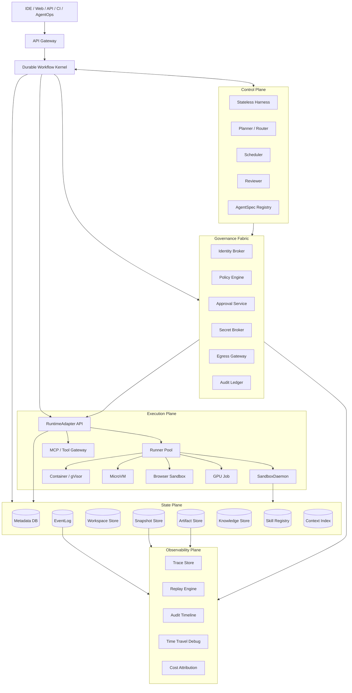
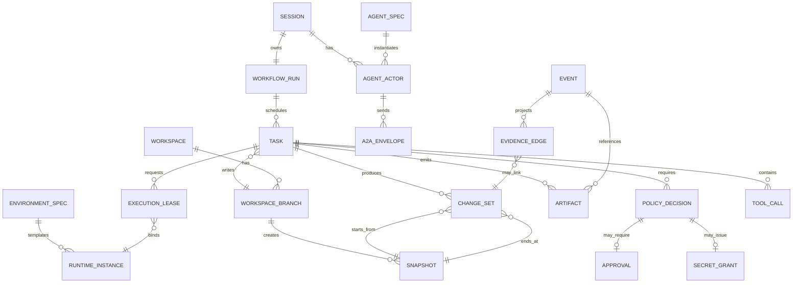
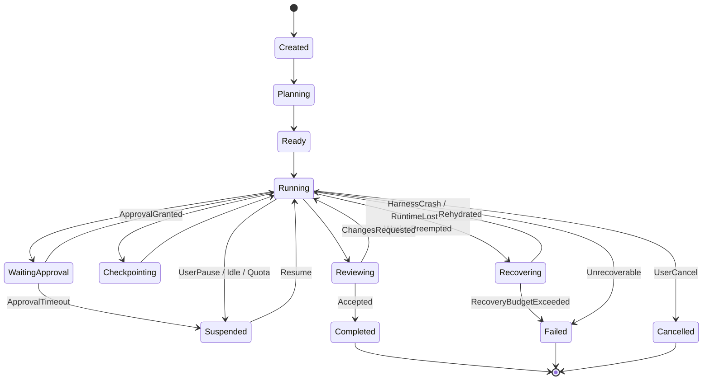
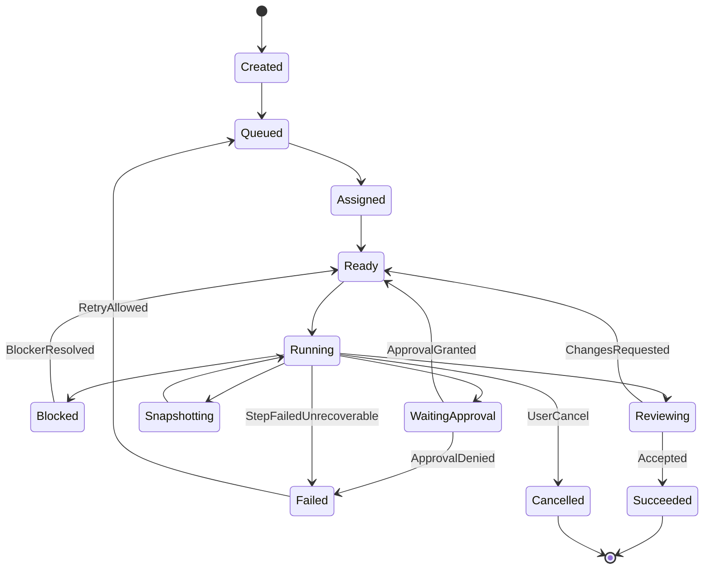
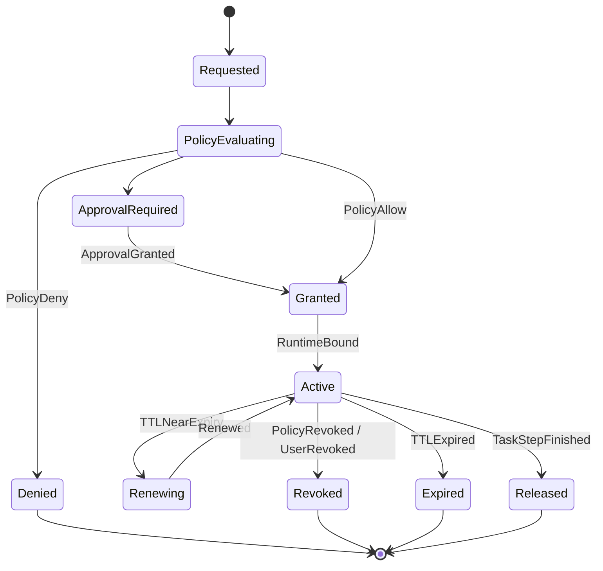
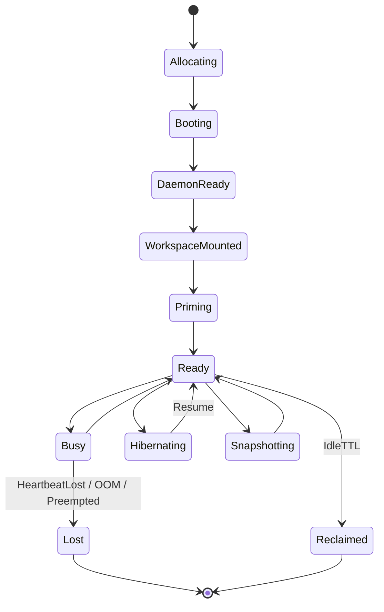
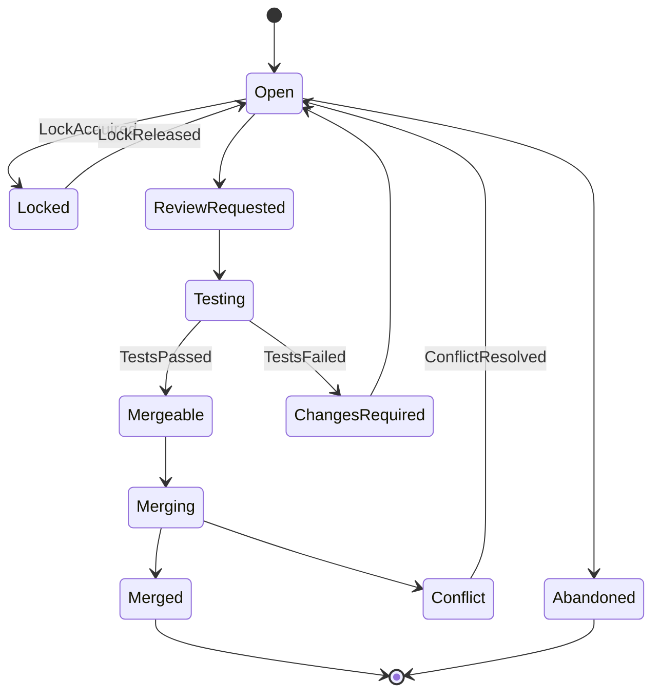
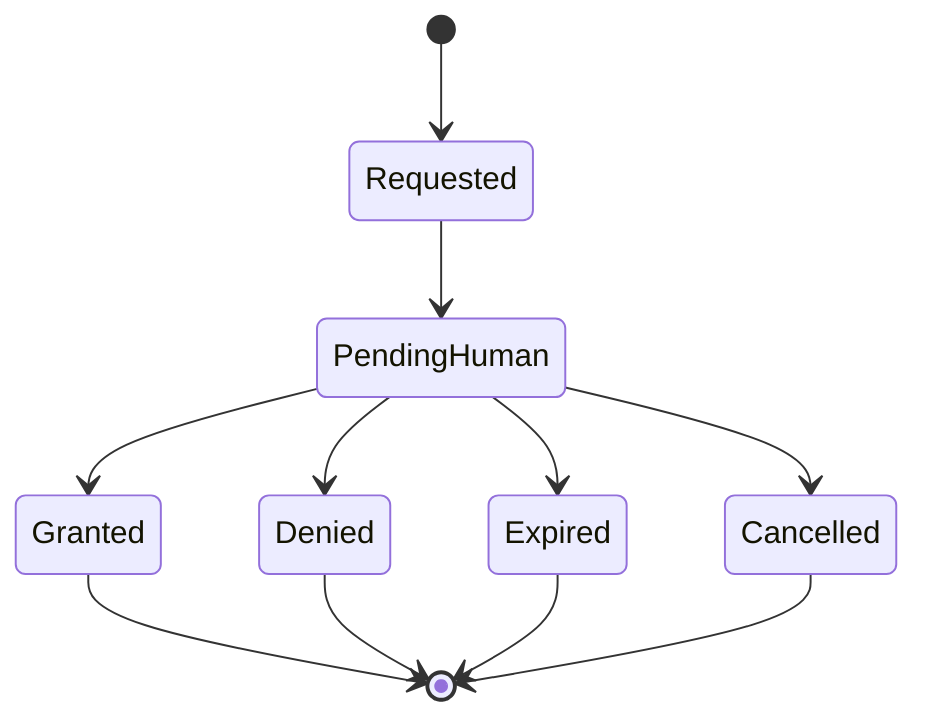
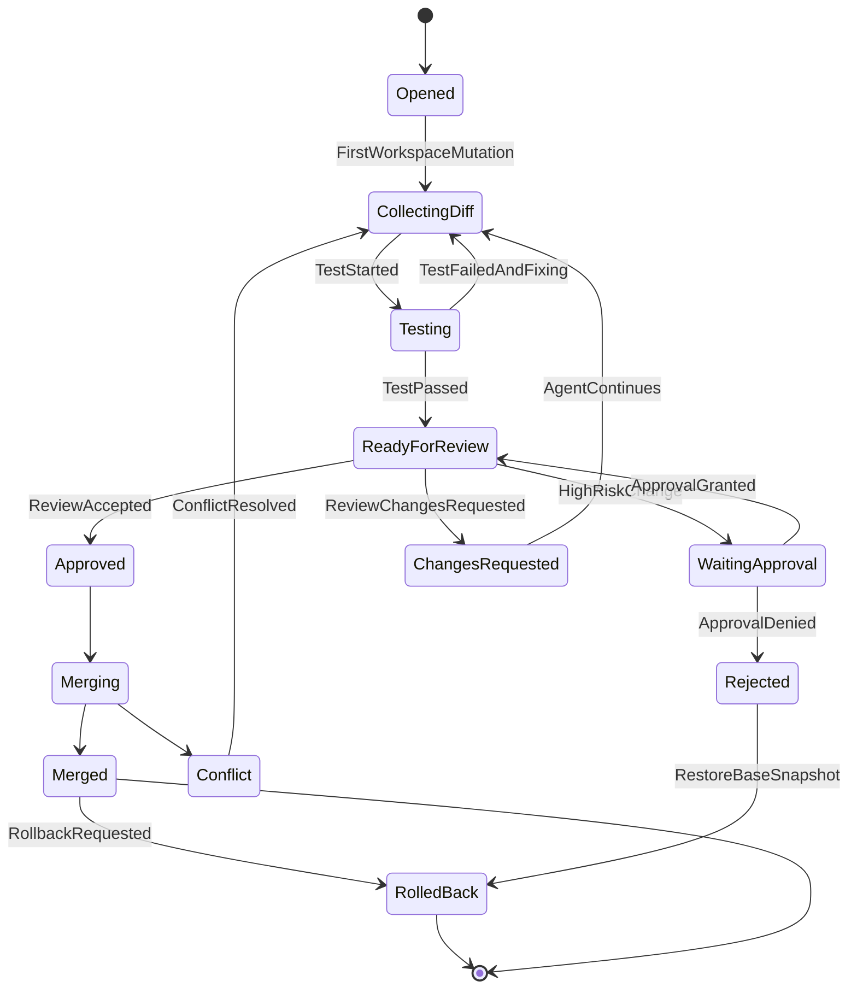
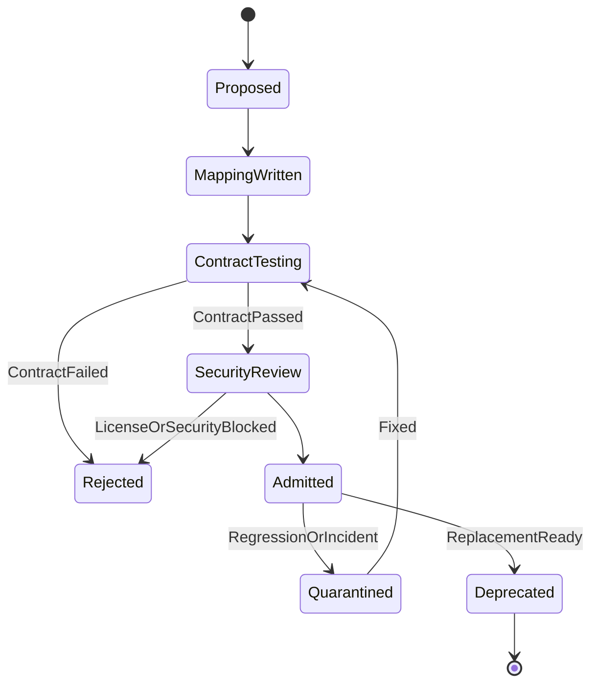

# AgentRuntimeFabric 架构设计、实现方案与需求实现规格

## 0. 文档定位

本文基于当前目录全部材料整理而成，包括 `insight-v1.md`、`insight-v2.md`、`insight-v3.md`、`insight-v4.md`、`insight-v5.md`、`AgentRuntimeFabric-v2.md` 和 `AgentRuntimeFabric-Solution.md`。当前目录是方案文档集合，尚无实现代码。因此本文的目标不是复述概念，而是把已有方案沉淀为可以基于开源实现、可以分解给 Codex 开发、可以测试验收的系统规格。

本文采用以下取舍：

- 保留：控制面与执行面分离、Workspace-first、Snapshot-first、Everything is Event、Policy first-class、Replayable execution。
- 升级：以 `AgentRuntimeFabric-v2.md` 的 `WorkflowRun / Task / ExecutionLease / RuntimeInstance` 四层生命周期为基线，替代早期“一个 Runtime 状态机覆盖所有生命周期”的混合模型。
- 保留但后置：AgentOps、KnowledgeBase、Skill Registry、Semantic Context Plane，它们是长期差异化能力，但不应阻塞最小内核。
- 明确边界：Harness、Planner、Router、Context Summarizer 是可替换策略；Workflow Kernel、EventLog、Workspace Lineage、PolicyDecision、RuntimeAdapter 是稳定平台内核。

### 0.1 对抗性评审摘要

当前方案的最大风险不是方向错误，而是“正确概念太多，最小闭环太晚”。优秀项目不会因为抽象完整而成功，只会因为它用很小的安装成本证明了一个高价值、难替代、可重复的能力。

本方案必须接受以下挑战：

| 挑战 | 为什么危险 | 设计修正 |
| --- | --- | --- |
| 范围过大 | Workflow、sandbox、policy、secret、A2A、Knowledge、AgentOps 同时推进会导致首个 release 无法稳定 | 第一阶段只证明 durable task + workspace snapshot + policy lease + replay timeline，不做多 Agent 和企业 IAM |
| 抽象先于证据 | `RuntimeAdapter`、`WorkspaceLineage`、`PolicyDecision` 如果没有 contract tests，会变成纸面接口 | 所有稳定接口必须先有 fake backend 和 contract tests，再接真实后端 |
| EventLog 成本被低估 | 每个动作都落 event 会带来 schema 演进、吞吐、查询和隐私成本 | 明确 envelope 索引字段、payload 大对象策略、PII/secret 脱敏和 event versioning |
| Snapshot 语义过强 | “从 snapshot 恢复继续”容易被误解为进程级恢复，MVP 很难保证 | MVP 只承诺文件系统和 artifact 恢复，process/memory resume 显式标为 unsupported |
| Policy 影响开发体验 | 每条命令都过策略可能让交互延迟、错误提示和本地开发体验变差 | MVP 采用本地 allowlist + explainable deny，策略评估必须低延迟、可缓存、可解释 |
| 多 Agent 过早 | 多 Agent 会放大 workspace、review、merge、消息可靠性问题 | 单 Agent recovery 和 replay 达标后再进入 A2A；多 Agent 是 Phase 4，不是开源首秀 |
| Adapter 最小公分母陷阱 | 为兼容所有后端而牺牲强能力，会让平台没有产品锐度 | 能力矩阵必须允许 capability-specific behavior，但核心对象不能泄漏 vendor schema |
| 安全承诺过满 | 默认无网络、无 secret 泄漏、企业级审计如果没有边界，会被安全团队质疑 | 把 MVP 安全承诺限定为 lease enforcement、secret 不进模型/日志、policy deny 可审计 |
| 运维模型缺失 | 长任务平台会引入 backlog、卡死任务、存储膨胀、GC、迁移和 on-call 成本 | 加入 SLO、GC、retention、dead letter、manual recovery 和 admin repair 工具 |
| 开源采用门槛 | 架构太像企业内核，个人开发者不知道为什么要装 | 首个 demo 必须是“一条命令启动，修复真实 repo，杀容器后继续，生成可审计 timeline” |

因此，AgentRuntimeFabric 的第一性验证不是“能跑 Agent”，而是：

1. 一个长任务被 worker kill 后继续。
2. 一个 runtime 被 kill 后从文件系统 snapshot 和 event cursor 恢复。
3. 一个高风险动作被 policy/approval 卡住，等待期间不占 runtime。
4. 一次失败能用 replay timeline 解释命令、diff、snapshot、policy 和 artifact 的因果链。
5. 上述能力在本地 Docker + PostgreSQL + 文件对象存储中一条命令可复现。

### 0.2 优秀开源项目视角的北极星

对外叙事应从“完整 Agent OS”收敛为一个更尖锐的承诺：

> AgentRuntimeFabric turns flaky long-running coding agents into recoverable, auditable, policy-bound workflows.

首个公开版本只服务一个高频场景：给一个 Git repo 创建任务，运行命令、修改文件、保存 artifact，故意杀掉 worker/runtime 后恢复，并展示可审计 timeline。只要这个闭环足够硬，后续的多 Agent、Knowledge、Skill、企业 Governance 才有可信基础。

北极星指标：

- `time_to_first_recovered_task`：新用户从 clone 到跑通一次 kill-and-recover demo 的时间。
- `recovery_success_rate`：真实恢复测试成功率，而不是 mock 测试通过率。
- `provenance_coverage`：命令、artifact、snapshot、policy、approval 的关联完整率。
- `adapter_contract_pass_rate`：每个 adapter 通过同一套 contract tests 的比例。
- `operator_repair_time`：任务卡死、event outbox 堆积、artifact 丢失时人工修复耗时。

### 0.2.1 行业对标后的真实结论

截至 2026-05-07，AgentRuntimeFabric 不能再把以下能力当作天然差异化：

| 能力 | 业界已有主流/前沿方案 | 对 ARF 的含义 |
| --- | --- | --- |
| Agent 编排、工具、handoff、guardrail、trace | OpenAI Agents SDK、Google ADK、AutoGen/Microsoft Agent Framework | ARF 不应再做一个重 prompt runner；这些 SDK 应作为 `Harness` 或 `AgentActor` 前端接入 |
| Durable execution、checkpoint、human-in-the-loop、time travel | LangGraph、Temporal、Vercel Workflow | Durable workflow 是必要底座，不是独占卖点；ARF 必须在其上补代码现场、策略租约和证据链 |
| 托管企业 Agent Runtime | AWS Bedrock AgentCore 的 Runtime、Memory、Gateway、Identity、Observability、Policy、Registry | “企业级 Agent 平台”不是 ARF 独有叙事；ARF 必须强调开源、自托管、schema 可检查和后端可替换 |
| Sandbox、workspace、snapshot、pause/resume | E2B、Modal Sandboxes、Daytona、Vercel Sandbox、OpenHands Runtime | Snapshot 技术不是 ARF 的核心壁垒；ARF 的壁垒是把不同后端能力归一到可审计的 `RuntimeCapabilities` 和 `SnapshotClass` |
| 工具协议生态 | MCP | MCP 解决工具连接，不自动解决授权、secret、审计和 workspace 写入边界；ARF 要把每次 tool call 纳入 PolicyDecision 和 provenance |
| Agent 间互操作和 UI 事件 | A2A、AG-UI | 外部协议可桥接，但不能替代内部可恢复 mailbox、ack/deadline/retry 和 EventLog 事实 |
| trace、metrics、logs | OpenTelemetry、Tempo、Jaeger、Loki、ClickHouse | 可观测基础设施可复用，但 replay 事实仍必须来自 EventLog、Snapshot、Artifact、PolicyDecision |

因此，ARF 的差异化不能写成“我们也有 workflow、sandbox、snapshot、policy、multi-agent”。这些都是入场券。真正要构建的是：面向代码变更型 Agent 的开放控制平面，把长任务恢复、权限租约、workspace lineage、证据链和 runtime 后端防腐合成一个可测试的系统。

更准确的开源定位是：闭源/托管平台已经证明了 Agent runtime fabric 的需求，但开源生态还缺少一个把这些能力用开放 schema、自托管控制面和可替换后端组织起来的项目。ARF 的机会不是证明闭源平台做不到，而是提供一个可 fork、可审计、可本地运行、可嵌入企业内网的开源替代。

| 维度 | 闭源/托管平台通常已有 | 当前开源生态常见缺口 | ARF 要补的开源替代 |
| --- | --- | --- | --- |
| 长任务运行 | 托管 durable workflow、队列、恢复、定时器 | 单项目有 durable workflow，但缺少 Agent workspace/action 事实模型 | `WorkflowRun + Task + EventLog + ChangeSet` 的开放 schema |
| 执行环境 | 托管 sandbox、browser、code interpreter、snapshot | 有 sandbox 项目，但和 policy/evidence/workspace lineage 脱节 | `RuntimeAdapter + RuntimeCapabilities + SnapshotClass` |
| 治理 | 托管 identity、gateway、policy、observability | 开源组件分散，缺少 Agent action 级租约和审计事实 | `PolicyDecision + ExecutionLease + SecretGrant + EgressDecision` |
| 代码变更控制 | 托管 PR flow、artifact、review、audit | 开源 coding agents 多偏交互式执行，缺少平台级 ChangeSet | `ChangeSet + ReviewDecision + MergeQueue + rollback snapshot` |
| 证据与调试 | 平台内置 trace/replay/timeline | OTel 只能观测，不表达 Agent 因果事实 | `EvidenceGraph + ReplayFrame + debug restore` |
| 可移植性 | 多数绑定云厂商、账号、runtime id、内部 schema | 开源库各自为政，互操作靠临时 glue code | 防腐层、adapter contract、schema lint、local-first demo |

### 0.2.2 必须构建出来的差异化能力

以下六个能力是 ARF 需要新增并硬化的开源替代能力，不应只停留在愿景或市场措辞里。

| 差异化能力 | 定义 | 必须落成的系统边界 | 最小验收 |
| --- | --- | --- | --- |
| EvidenceGraph | 用 typed graph 串起 Event、RuntimeAction、ToolCall、Diff、Snapshot、Artifact、PolicyDecision、Approval、Identity、SecretGrant、RuntimeInstance | `EvidenceGraph API`、event-to-edge projector、query fixtures | 给定一个失败任务，能查询“哪个 identity 在哪个 policy version 下执行了哪个命令，产生哪个 diff/artifact，从哪个 snapshot 恢复” |
| PolicyBoundExecution | shell、MCP、network、secret、Git/PR/publish 等跨边界动作必须先有短期 lease 和版本化 PolicyDecision | `ExecutionLease`、`PolicyDecision`、SandboxDaemon/ToolGateway 强制校验 | 绕过 daemon/tool gateway 的执行路径在测试中失败；审批等待期间可释放 runtime |
| WorkspaceLineageForAgents | 代码现场不是普通目录或 Git 分支，而是 branch、lock、snapshot、diff、test artifact、review、merge decision 的可恢复历史 | `WorkspaceBranch`、`ChangeSet`、`Snapshot Manifest`、`ReviewDecision` | 一个 Agent 产出的 patch 能追溯到 base snapshot、测试结果、审批和 merge/rollback 决策 |
| RuntimeAntiCorruption | Docker/gVisor/OpenHands/E2B/Modal/Daytona/Firecracker 等只能通过 capability matrix 接入，外部 schema 不进入核心事实模型 | `RuntimeAdapter v1`、`RuntimeCapabilities`、mapping ADR、schema lint、contract tests | fake、Docker 和至少一个远程 adapter 通过同一套 contract tests，核心表没有 vendor id 作为业务主键 |
| AgentChangeControl | ARF 的首个产品楔子是“管理 Agent 对代码仓库的变更”，而不是泛化聊天或泛化自动化 | `ChangeSet API`、diff/test/review artifact、rollback/debug restore | `arf demo recovery` 不只跑命令，还生成可审计 ChangeSet、失败恢复 timeline 和可回滚 snapshot |
| OpenControlPlane | 云 sandbox、托管 workflow、企业 IAM 都可作为 adapter；ARF 的最小控制平面必须本地可启动、自托管、schema 开放 | local stack、public schema、adapter SDK、dependency admission | 无云账号也能跑通 kill-and-recover demo；接入云后端不改变 Public API/Event schema |

这些能力共同形成新的定位：

> ARF is an open change-control runtime fabric for code-changing agents: every action is leased, every workspace change is lineage-tracked, every artifact is evidence, and every runtime backend is replaceable.

### 0.2.3 不再宣称的差异化

为了避免与现有方案正面同质化，以下表述应从外部叙事和 README 中删除或降级：

| 不再宣称 | 原因 | 替代表述 |
| --- | --- | --- |
| “ARF 提供 durable agent workflow” | LangGraph、Temporal、Vercel Workflow 已经成熟 | “ARF 把 durable workflow 用在代码变更 Agent 的 workspace、policy、evidence 控制面上” |
| “ARF 提供 sandbox snapshot/restore” | E2B、Modal、Daytona、Vercel Sandbox 已有强实现 | “ARF 归一化多后端 snapshot 能力，并把恢复决策纳入证据链” |
| “ARF 是企业级 Agent 平台” | AWS/Google/OpenAI 托管平台会更完整 | “ARF 是开源、自托管、后端可替换的 Agent change-control fabric” |
| “ARF 支持 MCP/A2A 所以可互操作” | MCP/A2A 是行业协议，不是壁垒 | “ARF 在协议之上补授权、secret、artifact、workspace lineage 和 replay 语义” |
| “ARF 的多 Agent 协作更强” | AutoGen、ADK、A2A、AgentPool 已在推进 | “ARF 的多 Agent 协作以可恢复 workspace branch、review 和 merge queue 为中心” |

### 0.3 非目标与降级原则

为了防止方案滑向不可交付，以下能力在 MVP 中必须降级：

| 能力 | MVP 降级 | 进入下一阶段的条件 |
| --- | --- | --- |
| Memory snapshot | 不支持，只支持 fs snapshot 和 command replay hints | 至少两个 runtime backend 能稳定声明并验证 memory snapshot |
| 多 Agent | 不支持并发写，只支持单 Agent 单 branch | 单 Agent recovery、artifact、policy、replay 指标达标 |
| 企业 IAM | 只做本地 identity 和 policy bundle | 有真实 secret broker、approval、audit integration 需求 |
| Knowledge/Skill | 只保留 schema 草案，不进入执行路径 | Context provenance 和 prompt injection 测试通过 |
| 复杂 UI | CLI + minimal web timeline | API 和 event projection 稳定，用户能通过 CLI 完成核心闭环 |
| 多云后端 | 只做 Docker/container + fake adapter | Adapter contract tests 稳定后再接 E2B/Modal/Firecracker 等 |
| 自动发布/生产操作 | 默认 deny，只做审批事件模拟 | SecretGrant、effect ledger、external reconciliation 完整 |

### 0.4 当前目录材料去粗存精

本文件不是把当前目录材料简单合并，而是按“事实保留、概念修正、实现降级、证据补强”的原则重新综合。

| 文件 | 采纳内容 | 修正/舍弃内容 | 在本文中的落点 |
| --- | --- | --- | --- |
| `insight-v1.md` | 企业架构文档结构、五平面、六对象、API/事件/安全/观测基本骨架 | 早期 `Runtime` 状态机混合了 Task、Workflow、Runtime 生命周期；snapshot 中 memory 默认能力过强 | 平面职责、对象基础、正反例 |
| `insight-v2.md` | 控制面、执行面、状态面、策略面、观测面解耦；Workspace-first、Snapshot-first | 对接口、错误恢复、幂等、外部副作用描述不足 | 总体架构、约束条件 |
| `insight-v3.md` | “脑/身体/记忆/神经系统”表达、Semantic Context Plane、多 Agent branch/lock、W-Volume 思路 | “LLM 为 CPU / Prompt 为指令集”的类比保留为叙事，不进入核心对象模型 | 一句话定义、Context Plane、Workspace Lineage |
| `insight-v4.md` | 技术对标：行业从 tool calling 走向 workflow/runtime 平台；各项目能力分层 | 第三方项目能力必须实现前再核验，不作为内核事实 | 开源堆加路线、参考资料 |
| `insight-v5.md` | 研发实现视角：服务域、对象字段、执行/恢复流程、存储/API、安全/部署/MVP | 六对象模型不足以表达 v2 的 lease、identity、actor、workflow kernel | 模块边界、I/O 契约、错误恢复 |
| `AgentRuntimeFabric-v2.md` | 最强架构基线：WorkflowRun/Task/ExecutionLease/RuntimeInstance 四层生命周期、RuntimeAdapter、Governance Fabric、A2AEnvelope、Workspace Lineage | Phase 描述需要补交付件、使用者、成功标准、不做事项；开源堆加需要防腐层 | 本文主体结构 |
| `AgentRuntimeFabric-Solution.md` | 业务场景、AgentOps、KnowledgeBase、Skill Registry、AgentSpec/EnvironmentSpec 分离、部署拓扑 | 产品愿景较重，MVP 需要砍掉 Knowledge/Skill/多 Agent 主路径 | 使用者场景、后期阶段、非目标 |
| `task_plan.md` | 任务目标和阶段要求 | 仅作为工作过程，不进入产品架构 | 文档定位 |
| `findings.md` | 已提取的共识、差异和 gap | 作为研究笔记，不替代本文规格 | 取舍依据 |
| `progress.md` | 已完成工作记录 | 作为过程记录，不进入系统设计 | 验证记录 |

去粗存精后的核心判断：

- 保留长期边界：`WorkflowRun`、`Task`、`ExecutionLease`、`RuntimeInstance`、`Workspace`、`Snapshot`、`EventLog`、`PolicyDecision`、`Artifact`。
- 修正早期混合模型：不再用一个 `Runtime` 状态机表达目标、任务、授权和资源生命周期。
- 降级过强承诺：MVP 不承诺 memory/process resume，只承诺 fs snapshot、event cursor 和 artifact 恢复。
- 后置产品能力：AgentOps、Knowledge、Skill、多 Agent、企业 IAM 是差异化能力，但不能阻塞 kill-and-recover MVP。
- 明确事实和投影：EventLog/Workspace/Snapshot/Artifact/PolicyDecision 是事实，summary、embedding、context pack、skill suggestion 是投影。

## 1. 一句话定义

AgentRuntimeFabric 是一个开源、模型无关、可自托管的 Agentic Workflow Operating Layer。它位于模型编排层和 sandbox 执行层之间，用 durable workflow 管理长任务，用 workspace lineage 承载工程现场，用 policy/identity 约束权限，用 runtime adapter 接入异构执行后端，用 replayable event fabric 提供审计、恢复和调试。

它不是：

- 不是另一个聊天式 Agent 框架。
- 不是把 Agent 放进一个远程 shell。
- 不是某个 sandbox、microVM、Kubernetes 或 CI/CD 的替代品。
- 不是把 prompt、模型路由、日志摘要策略固化成长期平台边界。

它要提供的是：

- 长任务可暂停、恢复、迁移、重试。
- 执行资源可销毁，Workspace、Snapshot、EventLog 和 Artifact 仍可恢复事实。
- 每个跨边界动作都有身份、策略、审批、租约和审计。
- 多 Agent 协作通过 branch、mailbox、review、merge queue 和 event log 管理。
- 用户和 Codex 能按明确接口继续实现模块、补测试、替换后端。

## 2. 需求分解

需求必须可分解、可约束、可验证、可复用。以下编号作为后续 issue、PR、测试用例和 Codex 任务的稳定引用。

| 编号 | 需求 | 约束 | 验证方式 | 可复用产物 |
| --- | --- | --- | --- | --- |
| R1 | Durable Workflow | WorkflowRun 不依赖 HTTP request、进程或 runtime 存活 | 杀死 workflow worker 后从 checkpoint 和 event cursor 恢复 | workflow-kernel、checkpoint schema |
| R2 | Workspace-first | repo、deps、cache、logs、ports、browser state、artifacts 必须归入 workspace 或 artifact store | 任务恢复后能找到同一仓库状态、日志和产物 | workspace-service、snapshot manifest |
| R3 | Snapshot-first | snapshot 是恢复、分支、回滚和调试原语，默认 fs-delta，memory snapshot 是可选能力 | runtime crash 后从最近 snapshot 恢复；分支从 snapshot fork | snapshot-store、lineage DAG |
| R4 | Execution Lease | Agent/Harness 只能请求执行，不能直接拥有 shell、secret 或网络权限 | lease 过期后 sandbox daemon 拒绝执行 | execution-lease、policy-decision |
| R5 | Policy first-class | 命令、路径、网络、密钥、审批均声明式、版本化、可审计 | 每条命令都有 PolicyDecision；高风险动作进入 Approval | policy-engine、approval-service |
| R6 | Event as Fact | 所有状态变化 append-only 写入 EventLog，摘要不能替代事实 | replay 能按 event 重建 timeline | event schema、event store |
| R7 | Runtime Adapter | 执行后端必须通过能力矩阵接入，不能让上层猜测能力 | 同一 task 可按 risk profile 路由到 container 或 microVM adapter | runtime-adapter-sdk |
| R8 | Observability and Replay | 不只看日志，要能解释为什么这样执行 | 失败点能看到 command、diff、policy、snapshot、artifact | trace、timeline、replay-engine |
| R9 | Multi-Agent Collaboration | 并发 Agent 不共享同一可写目录，必须从 base snapshot 分支 | 两个任务并行修改后通过 merge queue 合并或报冲突 | workspace-branch、A2AEnvelope |
| R10 | Identity Governance | user、agent、tool、runtime、secret 身份分离 | agent 不能继承用户全量权限；secret grant 有 TTL 和审计 | identity-broker、secret-broker |
| R11 | Semantic Context | 上下文摘要是事实投影，不是事实源；外部内容按 trust level 处理 | prompt injection 文本不能修改 policy 或 approval | context-index、semantic-firewall |
| R12 | Skill Reuse | 成功路径可沉淀为 Skill/Playbook，但不能扩大权限 | SkillApplied 后仍需 PolicyDecision 才能执行命令 | skill-registry |
| R13 | AgentOps | 看板、评论、阻塞、审批是事件投影，不维护第二套事实源 | UI 状态可从 EventLog 重放生成 | agentops-api、timeline projection |
| R14 | Idempotency and Compensation | 外部副作用动作必须有幂等键、pending/commit 事件或补偿动作 | retry 不重复发布包、重复 push 或重复写生产 API | effect ledger、compensation log |
| R15 | EvidenceGraph | Event、Action、ToolCall、Diff、Snapshot、Artifact、PolicyDecision、Approval、Identity、SecretGrant、RuntimeInstance 必须可查询因果关系 | 失败任务能回答“谁在什么策略下做了什么，改变了哪些文件，产物和恢复点是什么” | evidence-graph、edge projector |
| R16 | PolicyBoundExecution | 所有跨边界动作必须绑定短期 ExecutionLease 和版本化 PolicyDecision；MCP、shell、network、secret、Git/PR 统一处理 | 绕过 lease 的 shell/MCP/network 调用被 daemon/gateway 拒绝 | lease-enforcer、tool-gateway-enforcer |
| R17 | WorkspaceLineageForAgents | 代码变更以 ChangeSet 为中心，连接 base snapshot、diff、test artifact、review、approval、merge/rollback | 任一 patch 可追溯到 base snapshot、测试结果和 review/merge 决策 | changeset-service、review-ledger |
| R18 | RuntimeAntiCorruption | 外部 runtime/sandbox/workflow/agent SDK schema 不能进入 ARF public API 或核心事实表 | schema lint 拒绝 vendor id 作为业务主键；adapter contract tests 覆盖 fake/container/remote | adapter-contract-suite、mapping ADR |
| R19 | AgentChangeControl | 首个产品闭环聚焦 Agent 对代码仓库的受控变更，而不是泛化聊天自动化 | demo 生成 ChangeSet、timeline、rollback snapshot 和 recovery report | changeset API、debug restore |
| R20 | OpenControlPlane | 最小控制面必须自托管、本地可跑、schema 开放；云厂商能力只能作为 adapter | 无云账号跑通 recovery demo；切换云 sandbox 不改 Public API/Event schema | local-stack、public schema、adapter SDK |

### 2.1 需求追踪矩阵

每条需求必须能映射到核心模块、稳定接口、测试类型和交付阶段。没有测试映射的需求不能进入阶段验收。

| 需求 | 牵头模块 | 稳定接口/对象 | 必测场景 | 首次交付 |
| --- | --- | --- | --- | --- |
| R1 | `workflow-kernel` | `WorkflowRun`, `Checkpoint`, `Event Envelope` | kill worker 后从 cursor 恢复；非法状态转移被拒绝 | Phase 0 |
| R2 | `workspace-service` | `Workspace`, `Artifact Manifest` | runtime 重建后 repo/cache/log/artifact 仍可定位 | Phase 1 |
| R3 | `snapshot-store` | `Snapshot Manifest` | fs snapshot restore checksum 一致；parent 缺失进入 recovery error | Phase 1 |
| R4 | `execution-lease-service`, `sandbox-daemon` | `ExecutionLease`, `Daemon Action` | 无 lease/过期 lease/伪造 lease 被拒绝 | Phase 2 |
| R5 | `policy-engine`, `approval-service` | `PolicyDecision`, `Approval` | allow/deny/approval_required 全路径；policy version pinning | Phase 2/3 |
| R6 | `event-log` | `Event Envelope` | outbox 停止再恢复不丢 event；payload 缺失可诊断 | Phase 0 |
| R7 | `runtime-adapter-api` | `RuntimeAdapter`, `RuntimeCapabilities` | fake/container adapter 跑同一 contract tests | Phase 1/5 |
| R8 | `observability-service` | `Replay API`, `Trace schema` | replay 能串起 command、artifact、snapshot、policy | Phase 1 |
| R9 | `workspace-service`, `a2a-mailbox` | `WorkspaceBranch`, `A2AEnvelope` | 两分支并发修改、merge conflict artifact | Phase 4 |
| R10 | `identity-broker`, `secret-broker` | `Identity`, `SecretGrant` | agent 不继承用户全量权限；secret 不进日志/artifact | Phase 3 |
| R11 | `context-pack-lib`, `semantic-firewall` | `ContextPack`, `KnowledgeMount` | prompt injection fixture 不能修改 policy/system | Phase 6 |
| R12 | `skill-registry` | `Skill`, `SkillApplied` | skill 应用后命令仍需 PolicyDecision | Phase 6 |
| R13 | `agentops-projection-lib` | `Comment`, `Blocker`, `Approval`, `Event` | 看板从 EventLog 重放生成，无第二事实源 | Phase 6 |
| R14 | `workflow-kernel`, `effect-ledger` | `EffectLedger`, `CompensationLog` | API timeout 后不重复 publish/push/apply | Phase 3 |
| R15 | `evidence-graph`, `observability-service` | `EvidenceEdge`, `ReplayFrame` | event/artifact/snapshot/policy 缺边时 replay completeness gate 失败 | Phase 1/6 |
| R16 | `execution-lease-service`, `sandbox-daemon`, `mcp-gateway`, `egress-gateway` | `ExecutionLease`, `PolicyDecision`, `ToolCall` | lease bypass、tool bypass、network bypass fixture 全部拒绝 | Phase 2/3 |
| R17 | `workspace-service`, `changeset-service`, `review-ledger` | `ChangeSet`, `WorkspaceBranch`, `ReviewDecision` | patch 追溯 base snapshot/test/review/merge decision | Phase 1/4 |
| R18 | `runtime-adapter-api`, `schema-lint`, `contract-tests` | `RuntimeCapabilities`, `AdapterMapping` | fake/container/remote adapter 同测；vendor schema 不进核心表 | Phase 0/5 |
| R19 | `changeset-service`, `artifact-store`, `debug-restore` | `ChangeSet`, `Artifact`, `Snapshot` | demo 输出 ChangeSet、timeline、rollback/debug restore 指令 | Phase 1 |
| R20 | `cli`, `local-stack`, `public-schema`, `adapter-sdk` | `compose.yaml`, `Public API`, `Event Envelope` | 无云账号可跑；云 adapter 不改变 API/schema | Phase 0/5 |

### 2.2 可分解需求模板

后续 Issue/PR 必须按同一格式写，方便 Codex 和人类 reviewer 判断范围：

```text
需求编号：
用户/调用方：
输入：
输出：
前置条件：
状态转移：
事件：
策略/权限：
错误码：
幂等键：
验收测试：
不做事项：
复用产物：
```

示例：

```text
需求编号：R4
用户/调用方：Workflow Kernel / RuntimeAdapter
输入：task_id, runtime_id, requested_action, policy_context
输出：ExecutionLease 或标准错误
前置条件：Task=Running, RuntimeInstance=Ready/Busy, PolicyDecision=allow
状态转移：Requested -> PolicyEvaluating -> Granted -> Active
事件：LeaseRequested, PolicyDecisionRecorded, LeaseGranted, LeaseExpired
策略/权限：subject/action/resource 必须完整；policy_version 固定
错误码：POLICY_DENIED, APPROVAL_REQUIRED, LEASE_EXPIRED, CONFLICT
幂等键：task_id + action_id + policy_version
验收测试：过期 lease 被 daemon 拒绝；重复请求返回同一 lease 或冲突
不做事项：不注入真实 secret；不直接执行 shell
复用产物：execution-lease-service, policy-sdk
```

## 3. 使用者与场景

| 使用者 | 使用方式 | 解决的问题 |
| --- | --- | --- |
| Agent 平台开发者 | 实现 workflow、runtime、policy、workspace、event 等服务 | 把 Agent 从单进程工具调用升级为可恢复平台 |
| Codex 开发代理 | 按本文模块和接口拆任务、写代码、补测试 | 避免凭空重构或混淆生命周期边界 |
| 企业安全/平台团队 | 配置 policy、identity、secret、egress、audit | 让 Agent 执行第三方代码时可控可审计 |
| 开发者用户 | 从 IDE/Web/API/CI 创建任务、看进度、审批、接管调试 | 长时工程任务不中断、可恢复、可解释 |
| Reviewer/维护者 | 查看 diff、artifact、trace、review decision、merge queue | 多 Agent 产出可验证、可回滚 |
| 知识/运营团队 | 管理 KnowledgeBase、Skill/Playbook、AgentOps 流程 | 把成功经验沉淀为可复用资产 |

核心场景：

- 复杂软件工程：修 bug、迁移框架、补测试、跑构建、生成 PR。
- 长时后台任务：依赖安装、测试矩阵、网络抖动、审批等待、机器抢占。
- 多 Agent 协作：后端、前端、测试、Reviewer 并行分支工作。
- 浏览器/UI 自动化：端口、截图、trace、录屏和浏览器状态归档。
- 数据/GPU 任务：通过 adapter 纳入同一 task、policy、event、artifact 模型。
- 高安全任务：第三方依赖、不可信代码、生产 API、密钥和发布动作受控。

## 4. 总体架构



### 4.1 平面职责与不做事项

| 平面/层 | 职责 | 不做什么 |
| --- | --- | --- |
| AgentOps/UI | 任务入口、看板、评论、阻塞、审批入口、进度流 | 不直接调用 Runtime，不保存安全事实 |
| API Gateway | 认证、租户、限流、幂等键、API 版本 | 不编排 workflow，不执行命令 |
| Workflow Kernel | WorkflowRun 状态机、Task DAG、checkpoint、retry、approval wait、compensation | 不做 prompt 细节，不直接 shell |
| Control Plane | Harness、规划、路由、review、上下文构造、模型调用 | 不绕过 policy，不保存不可恢复事实 |
| Governance Fabric | 身份、策略、审批、密钥、网络出口、审计 | 不依赖模型自觉遵守权限 |
| Execution Plane | 分配 runtime、挂载 workspace、执行 action、开放端口、采集 observation | 不保存长期事实，不决定业务授权 |
| State Plane | metadata、event、workspace、snapshot、artifact、knowledge、skill、index | 不把摘要当事实源 |
| Semantic Context Plane | 日志摘要、来源分级、上下文索引、语义防火墙 | 不修改原始事实，不扩大权限 |
| Observability Plane | trace、metrics、timeline、replay、time travel、成本归因 | 不只做日志搜索 |

## 5. 模块边界

### 5.1 核心必建模块

| 模块 | 所属边界 | 核心职责 | 稳定接口 |
| --- | --- | --- | --- |
| `api-gateway` | API | REST/gRPC 入口、幂等、租户、鉴权 | Public API v1 |
| `workflow-kernel` | Workflow | WorkflowRun/Task 状态推进、checkpoint、retry、compensation | WorkflowRun API、Task API |
| `metadata-store` | State | 对象主数据、当前态、关联关系、事件游标 | SQL schema、repository interface |
| `event-log` | Evidence | append-only event、payload ref、correlation/causation | Event Envelope v1 |
| `evidence-graph` | Evidence/Observability | 从 EventLog、Artifact、Snapshot、PolicyDecision、Approval、ChangeSet 投影因果边 | EvidenceGraph API |
| `workspace-service` | Computer | workspace 创建、mount、branch、lock、merge | Workspace API、Snapshot Manifest |
| `changeset-service` | Computer/Evidence | 代码变更单元、diff/test/review/approval/merge/rollback 关联 | ChangeSet API |
| `snapshot-store` | Computer/State | fs-delta、lineage DAG、restore、GC | Snapshot API |
| `artifact-store` | Evidence | stdout/stderr、patch、report、binary、screenshot、trace | Artifact Manifest v1 |
| `policy-engine` | Governance | policy evaluation、PolicyDecision、risk classification | PolicyDecision v1 |
| `approval-service` | Governance | Approval lifecycle、timeout、human callback | Approval API |
| `execution-lease-service` | Governance/Execution | 授权窗口、TTL、renew/revoke/release | ExecutionLease API |
| `runtime-adapter-api` | Execution | 后端能力声明与统一执行契约 | RuntimeAdapter v1 |
| `container-adapter` | Execution | MVP container/gVisor 后端 | RuntimeAdapter v1 |
| `sandbox-daemon` | Execution | sandbox 内最小执行代理，执行已授权 action | Daemon Action v1 |
| `observability-service` | Observability | trace、timeline、replay 查询、debug restore | Replay API、Trace schema |
| `schema-lint` | Architecture Fitness | 防止 vendor schema、外部 workflow id、sandbox id 泄漏到核心 API/表 | Schema lint rules |

### 5.2 可复用模块

| 模块 | 复用方式 |
| --- | --- |
| `event-schema-lib` | 被 API、workflow、adapter、daemon、observability 共享 |
| `policy-sdk` | 在 gateway、workflow、adapter、tool gateway 中统一请求 PolicyDecision |
| `runtime-adapter-sdk` | 第三方后端实现 E2B、Modal、Daytona、OpenHands、Firecracker adapter |
| `snapshot-manifest-lib` | 统一校验 snapshot class、parent、checksum、producer_event |
| `artifact-provenance-lib` | 统一记录 artifact 来源、checksum、producer event、snapshot |
| `evidence-edge-lib` | 统一生成 `produced_by`、`authorized_by`、`restored_from`、`modified`、`reviewed_by`、`merged_into` 等证据边 |
| `a2a-mailbox-lib` | 多 Agent 消息、ack、retry、backpressure |
| `context-pack-lib` | 构造模型输入时携带来源、trust level、引用和摘要 |
| `agentops-projection-lib` | 从 EventLog 投影看板、评论、阻塞、审批状态 |
| `adapter-contract-suite` | fake/container/remote runtime adapter 共用 contract tests，防止后端特性污染核心模型 |

### 5.3 外部依赖

| 依赖 | 用途 | 替换要求 |
| --- | --- | --- |
| PostgreSQL | metadata、current state、幂等键、索引 | repository interface 隔离 |
| Object Storage/S3 | snapshot delta、artifact、payload、trace export | URI + checksum 契约 |
| Event Bus | event fanout、stream、异步处理 | 可先用 DB outbox，后换 Kafka/Redpanda/NATS |
| Container runtime/K8s | MVP 执行资源 | RuntimeAdapter 隔离 |
| Vault/KMS | secret 存储与短期 grant | SecretBroker 隔离 |
| OPA/Cedar/自研规则 | policy evaluation | PolicyDecision 契约稳定 |
| OpenTelemetry | trace/metrics | Observability schema 稳定 |
| Git | repo diff、patch、merge | Workspace service 封装 |
| E2B/Modal/Daytona/OpenHands/Firecracker | 可选执行后端 | adapter 接入，不进入核心模型 |
| MCP servers/Tool Gateway | 外部工具和连接器 | ToolCall + PolicyDecision + SecretGrant |
| LLM providers | Harness 推理 | AgentSpec 隔离 provider/model |

### 5.4 模块间主调用链

模块边界必须通过稳定对象交互，不能通过共享内存、共享临时文件或后端私有对象交互。

#### 链路 1：正常命令执行

```text
API Gateway
  -> Workflow Kernel 创建/推进 Task
  -> Harness 读取 EventLog/Workspace/Artifact 构造 ContextPack
  -> Harness 产生 shell.execute intent
  -> Policy Engine 生成 PolicyDecision
  -> ExecutionLease Service 发放 ExecutionLease
  -> RuntimeAdapter 绑定 RuntimeInstance
  -> SandboxDaemon 执行 action
  -> EventLog 写 ActionStarted/Output/Finished
  -> ArtifactStore 保存 stdout/stderr/report
  -> Workflow Kernel 根据事件推进 Task
  -> Observability 投影 timeline/replay
```

禁止路径：`Harness -> SSH -> Container`、`Planner -> Tool with raw secret`、`UI -> RuntimeAdapter.execute`。

#### 链路 2：runtime lost 恢复

```text
RuntimeAdapter/Daemon 心跳丢失
  -> EventLog 写 RuntimeLost
  -> Workflow Kernel 将 WorkflowRun/Task 进入 Recovering
  -> SnapshotStore 查找最近可用 snapshot
  -> WorkspaceService restore branch/head
  -> RuntimeAdapter allocate 新 RuntimeInstance
  -> WorkspaceService mount workspace
  -> Artifact/Event tail 构造 recovery context
  -> Workflow Kernel 从 checkpoint/cursor 继续
```

MVP 恢复只保证文件系统和事件游标，不保证进程内存继续。

#### 链路 3：高风险动作审批

```text
Harness/ToolGateway 提出 high-risk action
  -> Policy Engine 返回 approval_required
  -> Approval Service 创建 Approval
  -> WorkflowRun/Task 进入 WaitingApproval
  -> SnapshotStore 可选创建 pre-approval snapshot
  -> RuntimeInstance 可按 idle policy 释放
  -> 人类/策略回调 ApprovalGranted 或 Denied
  -> ExecutionLease Service 基于固定 policy_version 发放新 lease
  -> SandboxDaemon/ToolGateway 执行动作
```

审批是状态机节点，不是 UI 弹窗；审批结果必须进入 EventLog。

#### 链路 4：多 Agent 分支协作

```text
Planner 拆 Task DAG
  -> WorkspaceService 从 base snapshot fork branch
  -> Scheduler 分配 AgentActor
  -> 每个 AgentActor 在独立 branch 执行
  -> A2AEnvelope 发送 ReviewRequested/Blocker/HandOff
  -> Reviewer/MergeQueue 生成 diff/test artifact
  -> Policy Engine 判断能否 auto merge
  -> WorkspaceService merge 或 Conflict
  -> SnapshotStore 创建 reviewer snapshot
```

并发 Agent 不共享同一可写目录；共享目录写入应在测试中被拒绝。

#### 链路 5：Knowledge/Skill 使用

```text
API/Planner 请求 KnowledgeMount 或 SkillApplied
  -> Policy Engine 判断 mount/apply 权限
  -> Semantic Firewall 标记 trust level
  -> ContextIndex 生成引用式 ContextPack
  -> Harness 使用引用和摘要生成计划
  -> 每条真实命令仍走 PolicyDecision + ExecutionLease
  -> Skill 效果通过 EventLog/Artifact/TestResult 回收
```

Knowledge 和 Skill 只能影响计划与上下文，不能扩大权限。

#### 链路 6：Agent ChangeSet 证据链

```text
Task 开始执行
  -> WorkspaceService 记录 base_snapshot_id
  -> SandboxDaemon/ToolGateway 执行 action 并写 Event
  -> WorkspaceService 计算 file diff
  -> ArtifactStore 保存 patch/test report/log/screenshot
  -> ChangeSetService 创建或更新 ChangeSet
  -> EvidenceGraph 投影 action -> diff -> artifact -> policy -> snapshot 边
  -> Reviewer/PolicyEngine 记录 ReviewDecision 或 Approval
  -> MergeQueue merge/rollback/debug restore
  -> SnapshotStore 创建 post_change 或 rollback snapshot
```

ChangeSet 是 ARF 面向代码变更 Agent 的产品楔子。它不是简单 patch 文件，而是一个可审计变更单元，必须能回答：从哪个 snapshot 开始、谁执行了哪些动作、经过哪些策略和审批、改了哪些文件、跑了哪些测试、产出哪些 artifact、最后被 merge、拒绝还是回滚。

#### 链路 7：外部 runtime 防腐接入

```text
Adapter 开发者提交 mapping ADR
  -> RuntimeAdapter 声明 RuntimeCapabilities
  -> schema-lint 检查 vendor schema 不进入核心 API/表
  -> adapter-contract-suite 跑 fake/container/remote 同测
  -> RuntimeAction 被转换成 ARF Daemon Action/Event
  -> Snapshot/Artifact/Port/Process 能力按 capability class 记录
  -> EvidenceGraph 只引用 ARF 内部对象和 vendor metadata
```

禁止路径：`E2B sandbox id -> WorkflowRun id`、`Modal snapshot id -> Snapshot 主键`、`OpenHands action schema -> Public API`、`Temporal history -> EventLog 替代品`。

### 5.5 服务所有权与写入边界

| 模块 | 可写对象 | 不可直接写 |
| --- | --- | --- |
| `api-gateway` | request log、idempotency record、入口事件 | Task current state、Runtime、PolicyDecision |
| `workflow-kernel` | WorkflowRun/Task current state、checkpoint、compensation、workflow events | workspace 文件、secret value、runtime 私有状态 |
| `event-log` | event envelope、outbox cursor | 业务 current state |
| `evidence-graph` | EvidenceEdge projection、replay frame projection | EventLog/Snapshot/Artifact/PolicyDecision 原始事实 |
| `workspace-service` | Workspace、WorkspaceBranch、Snapshot metadata、lock/merge state | PolicyDecision、Approval、secret |
| `changeset-service` | ChangeSet、ChangeSetFile、ReviewDecision 关联、merge/rollback 状态 | workspace 原始文件、policy rule、secret |
| `snapshot-store` | snapshot manifest、delta object、GC report | Task 状态、runtime 状态 |
| `artifact-store` | Artifact manifest、payload object、checksum/provenance | Event envelope、policy state |
| `policy-engine` | PolicyDecision、risk classification event | Approval final state、runtime execution |
| `approval-service` | Approval state、approval events | Policy rule、ExecutionLease |
| `execution-lease-service` | ExecutionLease state、lease events | Policy rules、daemon action result |
| `runtime-adapter` | RuntimeInstance metadata、adapter events | Workspace long-term truth、policy decision |
| `sandbox-daemon` | Action observation events、stdout/stderr chunks | lease/policy issuance、metadata current state |
| `observability-service` | projections、trace spans、replay frames | fact source mutation |
| `semantic-context` | ContextPack、summary、index entries | EventLog/Artifact original evidence |

## 6. 必须稳定的接口

以下接口是开源项目的长期边界。允许内部实现替换，不允许随意改变语义。

| 接口 | 稳定原因 | 可变部分 |
| --- | --- | --- |
| Public API v1 | 外部用户、IDE、CI、AgentOps 调用 | 具体传输可 REST/gRPC |
| Event Envelope v1 | replay、audit、debug、projection 的事实源 | payload 细节可按 type 扩展 |
| WorkflowRun/Task state | durable kernel 的恢复语义 | Planner 策略可替换 |
| ExecutionLease v1 | 执行授权和安全隔离边界 | TTL 策略可调整 |
| RuntimeAdapter v1 | 接入后端的插件契约 | 具体 backend 可替换 |
| SandboxDaemon Action v1 | sandbox 内执行代理契约 | daemon 实现语言可替换 |
| PolicyDecision v1 | 每个跨边界动作的审计事实 | rule engine 可替换 |
| Snapshot Manifest v1 | lineage、恢复、分支、GC 的基础 | 底层 CoW 技术可替换 |
| Artifact Manifest v1 | 交付物和证据链 | 存储后端可替换 |
| A2AEnvelope v1 | 多 Agent 消息与 backpressure | actor 类型可扩展 |
| ContextPack v1 | 模型上下文的可追溯投影 | 摘要和检索算法可替换 |
| EvidenceGraph v1 | 开源替代闭源平台 timeline/replay/audit 的关键接口 | 底层可用 SQL/graph/projection store |
| ChangeSet v1 | 面向代码变更 Agent 的核心产品对象 | diff 算法、review 策略可替换 |
| RuntimeCapabilities v1 | 多 runtime/sandbox 后端防腐和路由依据 | capability 字段可向后兼容扩展 |
| Adapter Mapping ADR | 外部项目进入 ARF 的审计边界 | ADR 模板可演进，但必须记录映射 |

### 6.1 标准协议分类

AgentRuntimeFabric 至少要把五类协议分开，不能混成一个内部 RPC。

| 协议 | 谁调用谁 | 承载对象 | 必须稳定的语义 |
| --- | --- | --- | --- |
| Control API | IDE/Web/CI/AgentOps -> API Gateway | `Session`, `Task`, `Approval`, `Comment`, `Blocker` | 外部入口只能表达目标、任务和协作状态，不能直接获得执行权 |
| Event Protocol | 所有服务 -> EventLog/Outbox | `Event`, `payload_ref`, `correlation_id`, `causation_id` | append-only、可重放、可投影、可审计 |
| Runtime Protocol | Workflow/Adapter -> SandboxDaemon/Runner | `RuntimeAdapter`, `ExecutionLease`, `ActionEvent` | 执行必须绑定 lease，adapter 必须声明能力并输出结构化事件 |
| Tool/MCP Protocol | Harness/ToolGateway -> 外部工具/MCP Server | `ToolCall`, `PolicyDecision`, `SecretGrant`, `Artifact` | 工具调用先过策略和密钥代理，真实结果写入 event/artifact |
| A2A Protocol | AgentActor/Reviewer/MergeQueue/Approval actor 互发消息 | `A2AEnvelope`, `Mailbox`, `Ack`, `Retry` | Agent 间协作是异步消息，有 ack、deadline、backpressure 和 replay |
| Context Protocol | Harness -> 模型 | `ContextPack`, `KnowledgeMount`, `ArtifactRef`, `TrustLevel` | 上下文是事实投影，必须带来源、版本、trust level 和引用 |
| Evidence Protocol | EventLog/Projector -> EvidenceGraph/Replay | `EvidenceEdge`, `ReplayFrame`, `ChangeSetRef` | 每条边必须能回到原始 event/payload/artifact/snapshot，不能由摘要凭空生成 |
| Adapter Admission Protocol | Adapter author -> RuntimeAdapter registry | `RuntimeCapabilities`, `AdapterMapping`, `ContractResult` | 外部 schema 先映射、测试、准入，再进入运行时路由 |

协议边界规则：

- Control API 只能创建或推进 workflow，不能绕过 Governance Fabric 调用 Runtime Protocol。
- Runtime Protocol 只执行已授权 action，不能自行判断业务权限。
- Tool/MCP Protocol 不直接暴露真实 secret，secret 只能以 brokered grant 形式使用。
- A2A Protocol 的消息处理必须写 event，并支持超时重投或转人工。
- Context Protocol 的内容不能修改系统策略；外部内容永远是 data，不是 instruction。
- Evidence Protocol 只能投影事实，不能修改事实；缺失证据边要暴露为 replay completeness 问题。
- Adapter Admission Protocol 是开源替代闭源平台的关键护栏：允许复用闭源/云端能力作为 backend，但不允许其 ID、状态机或日志格式污染 ARF 公共契约。

## 7. 核心对象与对象关系

### 7.1 对象清单

| 对象 | 定义 | 关键字段 |
| --- | --- | --- |
| `AgentSpec` | Agent 能力和版本定义 | `agent_spec_id`, `provider`, `model`, `tools`, `mcp_servers`, `policy_defaults`, `owner`, `version`, `eval_score` |
| `EnvironmentSpec` | 执行环境模板 | `environment_spec_id`, `image_ref`, `resources`, `network_profile`, `mounts`, `snapshot_capability`, `daemon_version` |
| `Identity` | user/agent/tool/runtime/secret 权限主体 | `identity_id`, `type`, `principal_ref`, `scopes`, `trust_domain`, `expires_at` |
| `Session` | 用户目标容器 | `session_id`, `owner_identity`, `goal`, `status`, `policy_bundle_id`, `workflow_run_id` |
| `WorkflowRun` | durable workflow 内核实例 | `workflow_run_id`, `session_id`, `state`, `cursor`, `task_graph_ref`, `checkpoint_ref`, `retry_policy`, `compensation_log_ref` |
| `Task` | 可调度、可审计工作单元 | `task_id`, `workflow_run_id`, `parent_task_id`, `assignee_actor_id`, `status`, `risk`, `runtime_profile`, `workspace_branch_id` |
| `AgentActor` | 一次协作中的 Agent 身份实例 | `actor_id`, `agent_spec_id`, `session_id`, `mailbox_id`, `role`, `lease_state` |
| `ExecutionLease` | 一段被授权的执行租约 | `lease_id`, `task_id`, `runtime_id`, `identity_id`, `policy_version`, `expires_at`, `allowed_actions` |
| `RuntimeInstance` | 实际执行资源 | `runtime_id`, `backend`, `runner_id`, `daemon_id`, `status`, `resource_spec`, `ports`, `heartbeat_at` |
| `Workspace` | 长期工程现场 | `workspace_id`, `repo_ref`, `base_snapshot_id`, `head_snapshot_id`, `branches`, `retention_policy` |
| `WorkspaceBranch` | 多 Agent 并发分支 | `branch_id`, `workspace_id`, `parent_branch_id`, `head_snapshot_id`, `lock_state`, `merge_state` |
| `Snapshot` | 可恢复检查点 | `snapshot_id`, `workspace_id`, `branch_id`, `parent_snapshot_id`, `class`, `delta_ref`, `producer_event_id`, `checksum` |
| `PolicyDecision` | 单次跨边界动作授权结果 | `decision_id`, `subject`, `action`, `resource`, `effect`, `reason`, `policy_version`, `approval_ref` |
| `Approval` | 人类或策略审批 | `approval_id`, `task_id`, `requested_action`, `approver`, `status`, `expires_at`, `decision_ref` |
| `SecretGrant` | 短期凭证授权 | `grant_id`, `subject`, `secret_ref`, `scope`, `ttl`, `broker_event_id` |
| `ToolCall` | 工具调用意图与结果 | `tool_call_id`, `task_id`, `tool_name`, `input_ref`, `result_ref`, `policy_decision_id` |
| `A2AEnvelope` | Agent 间消息信封 | `message_id`, `from_actor`, `to_actor`, `type`, `payload_ref`, `causation_id`, `correlation_id` |
| `Artifact` | 交付物和证据 | `artifact_id`, `task_id`, `snapshot_id`, `type`, `uri`, `checksum`, `provenance` |
| `ChangeSet` | 代码变更证据单元 | `changeset_id`, `task_id`, `branch_id`, `base_snapshot_id`, `head_snapshot_id`, `diff_artifact_id`, `test_artifacts`, `review_decision_id`, `merge_state`, `rollback_snapshot_id` |
| `EvidenceEdge` | 事实之间的因果边 | `edge_id`, `from_type`, `from_id`, `to_type`, `to_id`, `relation`, `source_event_id`, `confidence`, `created_at` |
| `RuntimeCapabilities` | 后端能力声明 | `backend`, `isolation_class`, `snapshot_classes`, `supports_reconnect`, `supports_pause_resume`, `port_modes`, `filesystem_modes`, `resource_classes`, `limits` |
| `AdapterMapping` | 外部后端防腐映射 | `adapter_id`, `external_system`, `external_schema_version`, `arf_schema_version`, `mapping_ref`, `contract_result_ref`, `license_ref` |
| `Event` | append-only 系统事实 | `event_id`, `type`, `actor`, `subject`, `payload_ref`, `causation_id`, `correlation_id`, `timestamp` |
| `KnowledgeMount` | 知识源挂载记录 | `mount_id`, `source_ref`, `trust_level`, `version`, `scope`, `policy_version` |
| `Skill` | 成功路径沉淀 | `skill_id`, `version`, `applicability`, `steps_ref`, `provenance`, `approval_status` |

### 7.2 对象关系



### 7.3 关键语义

- `Session` 是目标容器，不是执行容器。
- `WorkflowRun` 是长任务生命，不是 HTTP request，也不是后台线程。
- `Task` 是调度和审计边界，不是长期状态边界。
- `Workspace` 是工程现场事实源，不等于容器文件系统。
- `Snapshot` 是恢复、分支、回滚、冷启动和调试的统一原语。
- `ExecutionLease` 是执行授权边界，不是 runtime 本身。
- `RuntimeInstance` 可销毁、可替换、可迁移。
- `PolicyDecision` 是审计事实，每次 shell、网络、secret、MCP、PR、发布都必须产生。
- `ChangeSet` 是代码变更的开源替代产品对象，不是普通 diff；它绑定 snapshot、action、test、review、approval 和 merge/rollback。
- `EvidenceEdge` 是 replay/audit 的查询投影，不是新的事实源；每条边都必须能回到原始 Event。
- `RuntimeCapabilities` 是后端能力事实，不是营销标签；路由、恢复和安全 profile 都依赖它。
- `EventLog` 是事实，Context summary 和模型记忆只是投影。
- `Skill` 只能影响计划和建议，不能自动扩大权限。

## 8. 状态机

### 8.1 WorkflowRun 状态机



不可变规则：

- `WorkflowRun` 的 cursor 和 checkpoint 必须可持久化。
- `WaitingApproval` 不应强制占用 runtime；可先 snapshot 再释放 runtime。
- `Recovering` 失败必须记录原因和 recovery budget 消耗。
- `Completed`、`Failed`、`Cancelled` 是终止态，后续只能创建新 run 或 retry run。

### 8.2 Task 状态机



任务规则：

- `Task` 重试必须复用同一 `task_id` 或显式创建 `retry_of_task_id`，不能悄悄创建不可追踪任务。
- `Task` 的外部副作用要写入 effect ledger。
- `Blocked` 是可消费事件，Planner 可据此重规划、转人工或换 AgentSpec/EnvironmentSpec。

### 8.3 ExecutionLease 状态机



租约规则：

- sandbox daemon 只接受带有效 `lease_id` 的 action。
- lease 绑定 `task_id`、`runtime_id`、identity、policy version、allowed actions 和 TTL。
- lease 过期或撤销后，执行面必须停止接收新 action；长命令可按 policy 决定是否 kill。

### 8.4 RuntimeInstance 状态机



runtime 规则：

- `Lost` 不等于 `WorkflowRun Failed`。
- `teardown` 只能释放 runtime resource，不能删除 workspace、event、snapshot 或 artifact。
- adapter 必须上报 heartbeat、resource usage、stdout/stderr stream 和 terminal status。

### 8.5 WorkspaceBranch/Merge 状态机



merge 规则：

- 并发任务从同一 base snapshot fork。
- merge 前必须生成 diff、artifact、test gate、review decision。
- 自动 merge 只在 policy 允许且测试门禁通过后发生。
- merge 后创建 reviewer snapshot，作为后续任务基线。

### 8.6 Approval 状态机



审批规则：

- Approval 是状态机节点，不是 UI 弹窗。
- 审批请求必须包含 action、resource、risk、policy_version、diff/artifact 引用和过期时间。
- 审批结果必须写入 EventLog，并固定到后续 execution context。

### 8.7 ChangeSet 状态机



ChangeSet 规则：

- `Opened` 必须绑定 `base_snapshot_id`，否则不能进入 `CollectingDiff`。
- `ReadyForReview` 必须至少有 diff artifact；高风险变更还必须有 `PolicyDecision` 或 `Approval`。
- `Merged` 必须记录 merge event、merge actor、head snapshot 和测试 artifact。
- `RolledBack` 必须创建 rollback snapshot 或引用 base snapshot，不能只删除文件。
- ChangeSet 的每个状态转换都投影到 EvidenceGraph，缺失边会导致 replay completeness gate 失败。

### 8.8 Adapter Admission 状态机



Adapter 准入规则：

- 没有 mapping ADR 的 adapter 不能进入 runtime registry。
- Contract tests 必须覆盖 allocate、execute、stream、snapshot/restore 能力声明、teardown、error mapping 和 event emission。
- 远程、闭源或云 sandbox 可作为 backend，但其 id 只能进入 metadata，不能成为 ARF 业务主键。
- 已准入 adapter 出现 schema 泄漏、安全回归或恢复语义回归时进入 `Quarantined`，路由策略不能再选择它。

## 9. 输入输出契约

### 9.1 通用 API 契约

所有写 API 必须支持：

- `Idempotency-Key`：防止重试创建重复 Session、Task、Approval、Artifact。
- `tenant_id` 或从认证上下文派生。
- `correlation_id`：贯穿 session、workflow、event、trace。
- 统一错误格式。

错误格式：

```json
{
  "error": {
    "code": "POLICY_DENIED",
    "message": "shell.execute is denied by policy",
    "retryable": false,
    "details": {
      "policy_version": "policy@2026-05-06",
      "decision_id": "pd_123"
    }
  }
}
```

错误码分类：

| code | 含义 | retryable |
| --- | --- | --- |
| `VALIDATION_FAILED` | 输入 schema 或状态前置条件错误 | false |
| `CONFLICT` | 幂等键冲突、状态版本冲突、lock 冲突 | depends |
| `POLICY_DENIED` | 策略拒绝 | false |
| `APPROVAL_REQUIRED` | 需要审批 | true after approval |
| `LEASE_EXPIRED` | 执行租约过期 | true with new lease |
| `RUNTIME_LOST` | runtime 心跳丢失 | true with recovery |
| `SNAPSHOT_FAILED` | snapshot 创建失败 | depends |
| `ARTIFACT_UNAVAILABLE` | artifact/payload 暂不可用 | true |
| `RECOVERY_BUDGET_EXCEEDED` | 恢复次数或预算耗尽 | false |
| `EXTERNAL_SIDE_EFFECT_UNKNOWN` | 外部副作用状态未知 | manual required |

### 9.2 Session 创建

```http
POST /v1/sessions
Idempotency-Key: create-session-123
```

输入：

```json
{
  "goal": "修复仓库 CI 并生成 PR",
  "agent_spec_id": "agent_coder_v1",
  "policy_bundle_id": "policy_repo_default",
  "knowledge_mounts": ["kb_arch_docs@2026-05-06"],
  "metadata": {
    "repo": "https://github.com/example/repo"
  }
}
```

输出：

```json
{
  "session_id": "ses_123",
  "workflow_run_id": "wf_123",
  "status": "ACTIVE",
  "event_cursor": "evt_001"
}
```

### 9.3 Task 创建

```http
POST /v1/tasks
```

输入：

```json
{
  "workflow_run_id": "wf_123",
  "parent_task_id": null,
  "title": "运行测试并定位失败",
  "assignee_actor_id": "actor_coder",
  "workspace_branch_id": "branch_main",
  "environment_spec_id": "env_node_container",
  "risk": "medium",
  "runtime_profile": {
    "backend_preference": ["container", "microvm"],
    "requires_network": true,
    "expected_duration_seconds": 1800
  }
}
```

输出：

```json
{
  "task_id": "task_123",
  "status": "QUEUED",
  "created_event_id": "evt_010"
}
```

### 9.4 RuntimeAdapter 契约

```text
RuntimeAdapter
  describe_capabilities() -> RuntimeCapabilities
  allocate(environment, workspace, policy_context) -> RuntimeInstance
  connect(runtime_id) -> RuntimeConnection
  reconnect(runtime_id) -> RuntimeConnection
  mount_workspace(runtime_id, workspace_ref, branch_id, mode) -> MountResult
  execute(runtime_id, action, lease_id, timeout) -> ActionHandle
  stream(runtime_id, action_handle) -> EventStream
  open_port(runtime_id, port, lease_id) -> PortHandle
  snapshot(runtime_id, class, consistency) -> SnapshotHandle
  restore(snapshot_id, environment) -> RuntimeInstance
  pause(runtime_id, reason) -> PauseResult
  resume(runtime_id) -> RuntimeInstance
  teardown(runtime_id, reason) -> TeardownResult
```

能力声明：

```yaml
backend: container
isolation:
  level: container
  untrusted_code_supported: false
state:
  filesystem_persistence: true
  process_persistence: false
  memory_snapshot: unsupported
  reconnect: true
  pause_resume: false
workspace:
  cow_snapshot: true
  branch_mount: true
  overlay_mount: true
network:
  default_deny: true
  domain_allowlist: true
  cidr_allowlist: false
  inbound_ports: true
security:
  secret_injection: brokered
  egress_identity: true
  audit_stream: true
resources:
  gpu: false
  max_runtime_seconds: 14400
  hibernate_after_idle: true
```

### 9.5 SandboxDaemon Action 契约

输入：

```json
{
  "action_id": "act_123",
  "lease_id": "lease_123",
  "task_id": "task_123",
  "type": "shell.execute",
  "payload": {
    "command": "npm test",
    "cwd": "/workspace/repo",
    "env_refs": [],
    "timeout_seconds": 600
  }
}
```

输出事件流：

```json
{
  "event_id": "evt_100",
  "type": "ActionStarted",
  "task_id": "task_123",
  "runtime_id": "rt_123",
  "policy_decision_id": "pd_123",
  "payload_ref": "object://events/evt_100.json",
  "causation_id": "evt_099",
  "correlation_id": "ses_123",
  "timestamp": "2026-05-06T00:00:00Z"
}
```

终止事件必须包含：

```json
{
  "type": "ActionFinished",
  "payload": {
    "exit_code": 1,
    "duration_ms": 53210,
    "stdout_ref": "artifact://stdout_123",
    "stderr_ref": "artifact://stderr_123",
    "resource_usage": {
      "cpu_ms": 12000,
      "memory_peak_mb": 1024
    }
  }
}
```

### 9.6 PolicyDecision 契约

```json
{
  "decision_id": "pd_123",
  "subject": {
    "user": "user_123",
    "agent": "agent_coder_v1",
    "runtime": "rt_123"
  },
  "action": "shell.execute",
  "resource": {
    "workspace": "ws_123",
    "path": "/workspace/repo",
    "command": "npm test"
  },
  "effect": "allow",
  "reason": "command allowlisted and network profile unchanged",
  "policy_version": "policy@2026-05-06",
  "approval_ref": null
}
```

### 9.7 Event Envelope 契约

```json
{
  "event_id": "evt_123",
  "type": "CommandFinished",
  "actor": {
    "type": "runtime_daemon",
    "id": "daemon_123"
  },
  "subject": "task_123",
  "tenant_id": "tenant_123",
  "session_id": "ses_123",
  "workflow_run_id": "wf_123",
  "task_id": "task_123",
  "workspace_id": "ws_123",
  "runtime_id": "rt_123",
  "policy_decision_id": "pd_123",
  "payload_ref": "object://event-payloads/evt_123.json",
  "causation_id": "evt_122",
  "correlation_id": "ses_123",
  "timestamp": "2026-05-06T00:00:00Z",
  "schema_version": "event.v1"
}
```

### 9.8 Snapshot Manifest 契约

```json
{
  "snapshot_id": "snap_123",
  "workspace_id": "ws_123",
  "branch_id": "branch_api",
  "parent_snapshot_id": "snap_122",
  "class": "fs-delta",
  "delta_ref": "object://snapshots/snap_123.delta",
  "producer_event_id": "evt_200",
  "runtime_id": "rt_123",
  "environment_spec_id": "env_node_container",
  "policy_version": "policy@2026-05-06",
  "dependency_lock_hash": "sha256:...",
  "workspace_checksum": "sha256:...",
  "retention_class": "hot",
  "created_at": "2026-05-06T00:00:00Z"
}
```

### 9.9 A2AEnvelope 契约

```json
{
  "message_id": "msg_123",
  "from_actor": "actor_backend",
  "to_actor": "actor_reviewer",
  "type": "ReviewRequested",
  "payload_ref": "artifact://patch_123",
  "causation_id": "evt_456",
  "correlation_id": "ses_123",
  "delivery": {
    "attempt": 1,
    "deadline": "2026-05-06T12:00:00Z",
    "requires_ack": true
  }
}
```

### 9.10 ChangeSet 契约

```json
{
  "changeset_id": "chg_123",
  "task_id": "task_123",
  "workspace_id": "ws_123",
  "branch_id": "branch_api",
  "base_snapshot_id": "snap_100",
  "head_snapshot_id": "snap_130",
  "status": "READY_FOR_REVIEW",
  "diff_artifact_id": "artifact_patch_123",
  "test_artifacts": ["artifact_test_123"],
  "policy_decision_ids": ["pd_123", "pd_124"],
  "approval_ids": [],
  "review_decision_id": null,
  "merge_state": "NOT_MERGED",
  "rollback_snapshot_id": null,
  "evidence_graph_ref": "evidence://chg_123",
  "created_at": "2026-05-06T00:00:00Z",
  "updated_at": "2026-05-06T00:05:00Z"
}
```

ChangeSet 必须由平台生成，不能由模型自行声明。模型可以建议总结，但真实字段来自 workspace diff、snapshot manifest、artifact store、policy decision、review/merge event。

### 9.11 EvidenceGraph 契约

证据边示例：

```json
{
  "edge_id": "edge_123",
  "from": {
    "type": "RuntimeAction",
    "id": "act_123"
  },
  "to": {
    "type": "Artifact",
    "id": "artifact_stdout_123"
  },
  "relation": "produced",
  "source_event_id": "evt_100",
  "causation_id": "evt_099",
  "confidence": "observed",
  "created_at": "2026-05-06T00:00:10Z"
}
```

最小关系类型：

| relation | 含义 |
| --- | --- |
| `authorized_by` | action/tool/network/secret 由某个 PolicyDecision 或 Approval 授权 |
| `executed_on` | action 在某个 RuntimeInstance 上执行 |
| `modified` | action 或 ToolCall 修改了某些文件或 ChangeSet |
| `produced` | action/test/review 产生 artifact |
| `snapshotted_as` | workspace 状态被保存为 Snapshot |
| `restored_from` | runtime/workspace 从某个 Snapshot 恢复 |
| `reviewed_by` | ChangeSet 被 Reviewer/Policy 审查 |
| `merged_into` | ChangeSet 合入目标 branch/snapshot |
| `rolled_back_to` | ChangeSet 回滚到某个 Snapshot |
| `derived_context_from` | ContextPack 引用了 event/artifact/knowledge 来源 |

查询示例：

```http
GET /v1/evidence?subject=changeset:chg_123&include=events,artifacts,snapshots,policy
```

返回结果必须可用于重建 replay timeline；如果关键边缺失，返回 `replay_completeness: "partial"` 和缺失类型。

### 9.12 RuntimeCapabilities 与 AdapterMapping 契约

```json
{
  "adapter_id": "adapter_e2b",
  "backend": "e2b",
  "capabilities": {
    "isolation_class": "remote_vm",
    "snapshot_classes": ["fs", "memory_if_supported"],
    "supports_reconnect": true,
    "supports_pause_resume": true,
    "port_modes": ["public_tunnel", "private_proxy"],
    "filesystem_modes": ["workspace_mount", "file_api"],
    "max_runtime_seconds": 86400,
    "untrusted_code_supported": true
  },
  "mapping": {
    "external_runtime_id": "metadata.external.runtime_id",
    "external_snapshot_id": "metadata.external.snapshot_id",
    "public_api_exposure": "forbidden"
  },
  "contract_result_ref": "artifact://contract_adapter_e2b_2026_05_07",
  "schema_version": "runtime_capabilities.v1"
}
```

规则：

- `external_runtime_id`、`external_snapshot_id`、云 provider resource id 只能进入 metadata，不允许作为 `workflow_run_id`、`task_id`、`snapshot_id`、`changeset_id`。
- 每个 capability 必须能被 contract test 验证；不能验证的只能标记为 `unknown` 或 `unsupported`。
- adapter 输出的事件必须转换为 ARF Event Envelope，再进入 EvidenceGraph。

## 10. 约束条件

### 10.1 架构约束

- 控制面不能直接执行命令，只能提交 intent。
- Runtime 不是事实源，EventLog、Workspace、Snapshot、Artifact、PolicyDecision 才是事实源。
- EvidenceGraph 是事实投影，不是事实源；任何边必须能回溯到 source event。
- ChangeSet 是代码变更的审计单元，不能用模型总结替代真实 diff、test artifact、review decision。
- Task 不能依赖 runtime 存活。
- Workspace 不能等价于容器 overlay 层。
- Snapshot 必须有 class、parent、producer_event、checksum。
- Policy 必须版本化，并固定到一次 execution context。
- Approval、Blocker、Comment、Review 都必须进入 EventLog。
- Context summary、embedding、Skill suggestion 都是投影，不能覆盖事实和策略。
- 外部 sandbox/workflow/agent SDK 的 id、状态机、event schema 不得成为 ARF Public API 或核心事实表。

### 10.2 安全约束

- 默认拒绝网络出口。
- 默认限制写路径。
- 默认禁止 secret 进入模型上下文、workspace、普通环境变量、stdout/stderr 和 artifact。
- 高风险动作默认审批：`git push`、release、merge PR、publish、terraform apply、生产数据库、生产 API、付款、删除数据、扩大网络出口。
- 不可信 repo、README、网页、issue、日志中的指令必须作为 data 处理，不能成为系统指令。
- RuntimeIdentity 只获得 task lease 内权限。
- MCP tool、A2A bridge、AG-UI bridge、外部 agent adapter 都不能绕过 PolicyDecision、SecretGrant 和 ExecutionLease。
- 远程/闭源/云 backend 的日志、trace、snapshot metadata 进入系统前必须经过 redaction 和 schema mapping。

### 10.3 一致性约束

- Metadata DB 保存 current state，EventLog 保存事实历史。
- 状态推进采用 optimistic concurrency 或 compare-and-swap。
- 外部副作用采用 pending event -> action -> commit event；未知状态进入 manual recovery。
- Event payload 可放对象存储，但 envelope 必须可索引。
- Artifact 必须有 checksum 和 provenance。
- EvidenceGraph projection 可以延迟，但缺失 projection 不允许把任务标记为 fully replayable。
- ChangeSet merge/rollback 必须使用 CAS 或版本检查，防止基线 snapshot 漂移。

### 10.4 性能与成本约束

- runtime 按需 lazy allocate，不随 session 创建预启动。
- fs-delta snapshot 是默认；memory snapshot 只用于高价值场景。
- workspace cache、artifact、snapshot 分层冷热存储。
- runtime idle TTL、资源配额、成本归因必须内建。
- 日志原文可大对象存储，模型输入使用摘要和引用。

### 10.5 威胁模型与滥用场景

本系统的安全边界不能建立在“模型会听话”之上。必须按以下攻击面设计测试：

| 攻击面 | 例子 | 必须防住的结果 |
| --- | --- | --- |
| Prompt injection | README、issue、网页、日志要求模型泄露 token 或跳过审批 | 外部内容只能进入 `ContextPack` data 区，不能修改 policy、lease、approval |
| Sandbox escape | 依赖安装脚本、测试脚本尝试访问宿主机、Docker socket、云 metadata | runtime backend 必须声明隔离等级；不可信代码不能跑在低隔离 profile |
| Secret exfiltration | 命令把 token 写入 stdout、artifact、workspace、模型上下文 | SecretBroker 只给短期 grant；stdout/stderr/artifact 写入前做扫描和脱敏 |
| Network abuse | 任务访问未知域名、内网地址、metadata service、恶意下载源 | 默认 deny；egress 通过 policy profile 和审计事件放行 |
| Event forgery | compromised daemon 伪造成功事件或缺失 policy 引用 | daemon identity、event signing 或 service-side validation；关键事件必须校验 lease/policy |
| Replay poisoning | 恶意 payload 或 artifact 在 replay/debug 时被当成指令 | replay UI 和 debug runtime 将历史内容标记为 evidence，不作为系统指令 |
| Supply chain | adapter、daemon image、MCP server、第三方工具被污染 | image digest pinning、SBOM、签名、依赖扫描、最小权限运行 |
| Cost exhaustion | Agent 无限重试、生成巨量日志、创建大量 snapshot | recovery budget、quota、log chunking、snapshot GC、dead letter |

威胁模型的直接工程要求：

- 每个 runtime profile 必须声明 `trusted_code_supported`、`untrusted_code_supported`、`network_default`、`secret_mount_mode`、`host_escape_risk`。
- 每个外部输入源必须带 `trust_level` 和 `source_ref`。
- 每个 high-risk action 必须有 deterministic risk classification，不能只靠模型自报风险。
- 安全测试必须包含 prompt injection fixture、secret redaction fixture、network deny fixture、lease bypass fixture。

### 10.6 数据治理与保留策略

`Everything is Event` 只有在数据治理清楚时才可落地。否则 EventLog 会变成隐私、成本和迁移负担。

| 数据 | 默认保留 | 访问控制 | 删除/脱敏策略 |
| --- | --- | --- | --- |
| Event envelope | 长期保留 | tenant + project + role | 保留索引事实，敏感字段只放 payload/artifact |
| Event payload | 按 retention class | 细粒度对象权限 | 支持 tombstone、redaction event、payload rewrite with checksum rotation |
| stdout/stderr | 短中期保留 | task viewer + auditor | 写入前扫描；命中 secret 时替换并记录 redaction event |
| Snapshot delta | 热数据短期，冷数据按项目策略 | workspace owner + runtime restore role | GC 前确认无 active branch、debug restore、legal hold |
| Artifact | 按类型保留 | task/project 权限 | 二进制 artifact 可过期；provenance manifest 长期保留 |
| Context summary | 短期或可重建 | harness/runtime 禁止写入安全事实 | summary 可删除；原始 evidence 仍是事实源 |
| SecretGrant metadata | 审计长期保留 | security/admin | 不保存 secret value，只保存 grant metadata 和 broker event |

实现要求：

- `retention_class` 是 schema 字段，不是后台配置注释。
- 删除不是直接物理删除事实；需要 `RedactionRequested`、`RedactionApplied`、`ArtifactExpired` 等事件保持审计链。
- snapshot/artifact GC 必须先跑 reachability analysis，确认没有 active workflow、branch、approval、debug session 引用。
- 开源版默认提供本地文件存储 GC；企业版可以替换为对象存储 lifecycle policy，但不能绕过 manifest。

### 10.7 运维与失效处置

长任务平台的真实难点是“卡住以后怎么办”。必须把 operator 工具作为内核能力，而不是后期 UI 功能。

| 失效 | 操作员动作 | 系统必须提供 |
| --- | --- | --- |
| outbox 堆积 | 暂停 fanout、重放 backlog、定位 poison event | outbox lag 指标、dead letter、event replay cursor |
| workflow 卡死 | 查看当前 state/version/cursor，强制 suspend 或 retry | admin transition API，所有手工操作写 event |
| runtime 泄漏 | 按 tenant/task 查询 runtime，reclaim idle/lost instance | heartbeat、idle TTL、resource quota、teardown audit |
| snapshot 爆仓 | 查看 lineage 引用，执行 dry-run GC | reachability graph、retention policy、GC report |
| artifact 丢失 | 标记 partial，阻塞 replay 或重新生成 | artifact health check、checksum verify、missing artifact event |
| policy 误杀 | 回滚 policy bundle，重放待决 action | policy version pinning、decision explain、approval override |
| adapter 回归 | 禁用 backend，路由到 fallback profile | capability registry、adapter health、contract test dashboard |
| secret 泄漏疑似 | revoke grant、redact artifact、标记 incident | grant index、redaction pipeline、audit export |

运维 API 必须满足两个规则：

- 所有 admin repair 都是事件，不能直接改数据库 current state 后不留事实。
- 所有强制跳转都要检查 state version，并写入 `AdminOverride` 事件，包含 actor、reason、before、after。

## 11. 错误处理与恢复

| 错误 | 检测 | 恢复策略 | 不允许 |
| --- | --- | --- | --- |
| Harness crash | worker heartbeat 或 workflow step timeout | 新 worker 从 WorkflowRun cursor、EventLog 和 checkpoint 恢复 | 依赖本地内存恢复 |
| Runtime lost | heartbeat lost、adapter error、OOM、preempted | 从最近 snapshot 恢复到新 runtime，保留同一 task | 直接标记 workflow failed |
| Command timeout | daemon timeout event | kill process，保存 stdout/stderr，按 retry policy 重试或请求人工 | 丢弃半截日志 |
| Snapshot failed | snapshot error event | retry、降级 class、创建 failure artifact、必要时暂停 | 伪造 snapshot committed |
| Policy denied | PolicyDecision effect=deny | task blocked 或 failed，返回原因 | 绕过 policy 重试 |
| Approval timeout | approval expires_at | workflow suspended 或 task failed，按 policy 决定 | 持续占用昂贵 runtime |
| Secret grant failure | broker error | 不执行 action，记录 audit event | 把 secret 直接注入 env |
| Event bus unavailable | outbox backlog | 写 DB outbox，异步补发 | 丢 event 后继续 |
| Artifact store failure | upload error | action 标记 partial，重试上传或阻塞 task | 只保存最终回答 |
| External side effect unknown | 网络中断、第三方 API timeout | 查询外部状态，依据 idempotency key reconcile，必要时人工确认 | 盲目重试 publish/apply |
| Merge conflict | merge queue 检测 | 标记 Conflict，生成 conflict artifact，回到 branch 修复 | 直接覆盖 main |

恢复预算：

- 每个 Task 有 `retry_policy`：最大次数、退避、可重试错误码、是否允许换 runtime profile。
- 每个 WorkflowRun 有 `recovery_budget`：累计恢复次数、累计 runtime 成本、最长挂起时间。
- 每个外部副作用有 `idempotency_key` 或 `compensation_action`。

## 12. 可观测设计

### 12.1 必须采集的数据

- Workflow：state transition、checkpoint、retry、compensation。
- Task：assignment、blocker、approval、review、merge、status change。
- Runtime：allocate、boot、mount、heartbeat、resource usage、pause/resume、lost、teardown。
- Command：command、cwd、exit code、duration、stdout/stderr refs、resource usage。
- File：diff、changed files、checksums、lock、merge conflict。
- Snapshot：class、parent、delta size、restore latency、checksum。
- Policy：decision、rule version、approval、secret grant、network access。
- Tool/MCP：tool input/output refs、secret scope、external API response class。
- Model/Harness：model call metadata、context pack refs、token usage、tool intent。
- Cost：model tokens、runtime seconds、storage、network、GPU seconds。

### 12.2 Trace 维度

Trace 层级：

```text
Session
  WorkflowRun
    Task
      Step
        PolicyDecision
        ExecutionLease
        RuntimeAction
          Command / ToolCall / BrowserAction
          Artifact
          Snapshot
```

每个 trace span 必须带：

- `tenant_id`
- `session_id`
- `workflow_run_id`
- `task_id`
- `runtime_id` 可为空
- `policy_decision_id` 可为空
- `correlation_id`
- `causation_id`

### 12.3 Replay 与 Time Travel Debug

Replay 不是重跑所有命令，而是重建因果链：

1. 读取 EventLog envelope。
2. 拉取 payload、artifact、snapshot manifest。
3. 按 causation/correlation 重建 timeline。
4. 用户选择失败点。
5. 恢复对应 snapshot 到 debug runtime。
6. 展示当时 env、policy、diff、stdout/stderr、resource usage、approval。
7. 人类可接管 shell/browser 修复。
8. 创建新 snapshot 和 event。
9. WorkflowRun 从新 checkpoint 继续。

成功标准：

- 能解释“谁在何时基于哪个策略批准了什么动作”。
- 能解释“哪个命令产生了哪个 artifact 和 diff”。
- 能解释“恢复从哪个 snapshot 开始，为什么换 runtime 或资源规格”。
- 能解释“Skill、KnowledgeMount、ContextPack 对某次模型动作的影响”。

### 12.4 关键指标

| 指标 | 目标 |
| --- | --- |
| workflow recovery success rate | MVP 后持续上升，按任务类型分桶 |
| runtime restore latency | container/fs snapshot 优先控制在秒级 |
| event write loss | 0，失败进入 outbox |
| command provenance coverage | 100% 命令关联 PolicyDecision 和 Event |
| artifact checksum coverage | 100% artifact 有 checksum |
| approval audit coverage | 100% 高风险动作有审批或 deny 记录 |
| secret leakage incidents | 0，检测到则阻断和脱敏 |
| replay completeness | 所有关键信息有 event/artifact/snapshot 引用 |

## 13. 阶段性交付计划

阶段计划必须遵守两个原则：

- 每个阶段都要交付一个可运行、可演示、可回归测试的系统切片。
- 下一阶段不能依赖“理论上稳定”的接口，必须依赖上一阶段已经通过 contract/integration/recovery tests 的接口。

### 13.0 发布闸门

| 闸门 | 必须回答的问题 | 证据 |
| --- | --- | --- |
| Architecture Gate | 核心对象和状态机是否没有混淆？ | schema、ADR、非法状态转移测试 |
| Recovery Gate | worker/runtime 被真实 kill 后能否恢复？ | recovery integration test，不能只 mock |
| Security Gate | 是否存在绕过 PolicyDecision/ExecutionLease 的执行路径？ | lease bypass 测试、policy deny 测试 |
| Evidence Gate | 命令、artifact、snapshot、approval、ChangeSet 是否能串成因果链？ | EvidenceGraph query fixture、replay completeness gate |
| Adapter Gate | 后端替换是否不影响核心对象？ | fake + container adapter contract tests |
| Open-source Replacement Gate | 是否无云账号、无闭源控制面也能跑通核心能力？ | local stack、public schema、adapter fallback |
| Operator Gate | 卡死、堆积、泄漏、GC 是否有处置路径？ | admin API、dead letter、GC dry-run |
| Adoption Gate | 新用户是否能快速跑通核心 demo？ | `make demo-recovery` 或等价脚本、README |

每个阶段的 PR 必须包含：

- schema 或接口变更说明；公共契约变更必须有 ADR。
- 正向测试、非法状态测试、幂等测试。
- 至少一个真实失败注入测试，覆盖 crash、timeout、deny、expired、conflict 中的一类。
- 可观测输出样例：event rows、artifact manifest、trace/timeline 查询结果。
- 回滚策略：迁移如何回滚，后台任务如何停止，数据如何保持兼容。

### 13.1 MVP 硬边界

MVP 只包含下面的闭环：

```text
create session
  -> create task
  -> allocate container runtime
  -> mount workspace
  -> open ChangeSet with base snapshot
  -> evaluate minimal policy
  -> issue execution lease
  -> execute shell command
  -> capture file diff
  -> persist stdout/stderr artifact
  -> write event envelope
  -> create fs snapshot
  -> kill worker/runtime
  -> recover from checkpoint/snapshot
  -> show ChangeSet + replay timeline + EvidenceGraph query
```

MVP 不包含：

- 多 Agent。
- 真实企业 secret broker。
- memory/process snapshot。
- 复杂 UI。
- 多云 runtime。
- 自动发布、merge、生产 API 写操作。
- Knowledge/Skill 进入执行路径。

首个开源 demo 应该固定为：

```text
arf demo recovery --repo <local fixture>
```

它必须自动完成：创建任务、运行测试、写文件、生成 snapshot、杀掉 runtime、恢复、继续执行、输出 timeline URL 或 CLI timeline。这个 demo 是项目可信度的核心资产。

### Phase 0：接口与内核切片

| 项 | 内容 |
| --- | --- |
| 目标 | 先建立正确的长期接口和最小 durable kernel |
| 交付件 | repo skeleton、OpenAPI/JSON Schema、PostgreSQL schema、Event Envelope v1、WorkflowRun/Task state machine、ChangeSet/EvidenceGraph schema、container RuntimeAdapter stub、adapter mapping ADR 模板、基础 CLI |
| 谁使用 | 平台开发者、Codex、后续 adapter 作者 |
| 解决问题 | 防止实现一开始就把 Task、Runtime、Policy、Event 混成一个临时进程 |
| 成功标准 | 能创建 Session/WorkflowRun/Task/ChangeSet；状态推进写 EventLog；EvidenceGraph 能投影最小边；非法状态转移被拒绝；worker crash 后从 cursor 恢复；所有写 API 有幂等测试；schema lint 拒绝 vendor 主键进入核心表 |
| 不做 | 不做多 Agent，不做真实 secret，不做复杂 UI，不做 microVM |

Codex 可执行任务：

- 建立 `packages/event-schema`。
- 建立 `services/workflow-kernel`。
- 建立 `services/api-gateway` 的 session/task API。
- 建立 `db/migrations` 初始 DDL。
- 建立 `services/evidence-graph` 最小 projector。
- 建立 `services/changeset-service` 最小 schema/API。
- 为 WorkflowRun 状态转移写单元测试和非法转移测试。
- 为 ChangeSet 状态转移写单元测试和非法转移测试。
- 实现 adapter mapping ADR 模板和 schema lint。
- 实现 DB outbox writer 和 outbox replay fixture。
- 实现 `arf events tail` CLI，能查看 session/task timeline。

### Phase 1：可恢复单 Agent 执行

| 项 | 内容 |
| --- | --- |
| 目标 | 一个 Agent 在持久 workspace 中执行命令、产出 artifact、创建 snapshot，并可从失败恢复 |
| 交付件 | workspace-service、snapshot-store fs-delta、container-adapter、artifact-store、command event stream、ChangeSet diff/test artifact、task timeline |
| 谁使用 | 开发者用户、Codex、平台团队 |
| 解决问题 | runtime crash 不再丢失仓库现场、日志和产物 |
| 成功标准 | 杀死 container 后，Task 从最近 fs snapshot 恢复继续；每条命令有 stdout/stderr、exit code、artifact、event；snapshot restore 后 workspace checksum 可验证；ChangeSet 绑定 base/head snapshot、diff artifact、test artifact；EvidenceGraph 可回答 action -> diff -> artifact -> policy -> snapshot |
| 不做 | 不做 memory snapshot，不做真实多后端，不做自动合并 |

Codex 可执行任务：

- 实现本地目录 workspace 和 snapshot manifest。
- 实现 container adapter 的 `allocate/execute/stream/teardown`。
- 实现 artifact upload 和 checksum。
- 实现 ChangeSet diff artifact 和 test artifact 关联。
- 实现 EvidenceGraph action/diff/artifact/snapshot 边投影。
- 增加集成测试：执行命令、写文件、snapshot、销毁 runtime、restore 后继续。
- 实现 `make demo-recovery`，本地一条命令跑通恢复演示。

### Phase 2：ExecutionLease 与 SandboxDaemon

| 项 | 内容 |
| --- | --- |
| 目标 | 把执行权从控制面剥离，所有 action 通过 lease 和 daemon 执行 |
| 交付件 | execution-lease-service、policy-decision minimal、sandbox-daemon、MCP gateway enforcer、lease TTL/renew/revoke、port lease |
| 谁使用 | 安全团队、adapter 作者、runtime 后端 |
| 解决问题 | Harness 不能直接 shell，runtime 只能执行已授权动作 |
| 成功标准 | lease 过期后 daemon 拒绝执行；伪造 lease/action 被拒绝；MCP/tool/network bypass 被拒绝；断线重连可恢复 stream；端口开放需要 lease；所有 action event 都绑定 policy_decision_id |
| 不做 | 不做企业级 IAM，不接 Vault，不做复杂策略语言 |

Codex 可执行任务：

- 给 daemon action 加 lease 校验中间件。
- 实现 `PolicyDecision` 最小 allow/deny。
- 实现 lease expiration 测试。
- 实现 daemon stream reconnect 测试。
- 实现 lease bypass/security fixture。
- 实现 MCP/tool bypass fixture。

### Phase 3：Governance Fabric

| 项 | 内容 |
| --- | --- |
| 目标 | 把策略、审批、secret、egress 从配置开关升级为可审计事实 |
| 交付件 | IdentityBroker、PolicyEngine、ApprovalService、SecretBroker adapter、EgressGateway adapter、AuditLedger |
| 谁使用 | 企业安全、平台管理员、审批人 |
| 解决问题 | Agent 执行不可信代码、访问网络、使用密钥和发布动作时可控可审计 |
| 成功标准 | 高风险命令自动 WaitingApproval；secret 不进入 workspace/log/artifact；默认无网络，按 policy 放行；policy decision explain 可用于 debug |
| 不做 | 不自研完整 Vault，不替代企业 IAM，不默认接生产系统 |

Codex 可执行任务：

- 实现 policy YAML schema 和版本固定。
- 实现 approval request/decision API。
- 实现 stdout/stderr secret scan 和脱敏测试。
- 实现 network policy decision event。
- 实现 prompt injection、network deny、secret redaction fixture。

### Phase 4：Workspace Lineage 与多 Agent

| 项 | 内容 |
| --- | --- |
| 目标 | 并发协作可控，分支、锁、review、merge queue 进入事件系统 |
| 交付件 | WorkspaceBranch、snapshot DAG、file/directory lock、MergeQueue、Reviewer actor、A2AEnvelope、Mailbox |
| 谁使用 | 多 Agent 编排者、Reviewer、人类维护者 |
| 解决问题 | 多个 Agent 不再共享目录互相覆盖，冲突可追踪可回滚 |
| 成功标准 | 多个 Agent 从同一 base snapshot 并发工作；合并前生成 diff、运行测试、记录 review；冲突可回滚；共享可写目录路径在测试中被拒绝 |
| 不做 | 不做全自动复杂语义合并，不跳过测试门禁 |

Codex 可执行任务：

- 实现 branch fork/merge API。
- 实现 optimistic file lock。
- 实现 A2A mailbox ack/retry。
- 实现 merge conflict artifact。
- 实现 branch lineage/reachability/GC dry-run。

### Phase 5：多后端 RuntimeAdapter

| 项 | 内容 |
| --- | --- |
| 目标 | 接入真实产业后端，按风险和资源路由 |
| 交付件 | RuntimeCapabilities matrix、AdapterMapping ADR、schema-lint、至少两个真实 adapter 或一个真实 adapter 加一个高保真 fake adapter、route policy |
| 谁使用 | 平台团队、私有化部署团队、高安全任务用户 |
| 解决问题 | 同一任务可选择低成本 container、高隔离 microVM、browser 或 GPU 后端 |
| 成功标准 | capability matrix 决定是否允许 memory snapshot、GPU、port、resume；adapter 失败不影响 WorkflowRun 事实恢复；不支持能力返回 deterministic error；外部 runtime/snapshot id 只进入 metadata；contract tests 和 schema lint 阻止 vendor schema 泄漏 |
| 不做 | 不把任一厂商作为唯一实现，不把 adapter 特性泄漏到核心对象 |

Codex 可执行任务：

- 实现 adapter contract tests。
- 实现 routing decision event。
- 实现不支持能力时的 deterministic error。
- 为每个 adapter 写 fake backend 测试。
- 实现 adapter health check 和 backend disable/fallback。

### Phase 6：Knowledge、Skill 与 Replay 产品化

| 项 | 内容 |
| --- | --- |
| 目标 | 形成长期知识、经验复用和 time travel debug 闭环 |
| 交付件 | KnowledgeMount、ContextIndex、SemanticFirewall、SkillRegistry、ReplayEngine、EvidenceGraph 查询产品化、TimeTravel Debug UI、AgentOps projection |
| 谁使用 | 开发团队、知识管理员、Reviewer、AgentOps 用户 |
| 解决问题 | 上下文来源可治理，成功任务可复用，失败现场可接管 |
| 成功标准 | KnowledgeMount 有版本和 trust level；成功任务生成 Skill 候选并审批；用户可按 EvidenceGraph 查询恢复现场接管；外部内容不能改变 system/policy instruction；replay completeness 可解释缺失证据 |
| 不做 | 不让知识或 skill 绕过 policy，不把摘要当审计事实 |

Codex 可执行任务：

- 实现 ContextPack schema。
- 实现 event/artifact/knowledge 引用式检索。
- 实现 SkillProposed/SkillApproved/SkillApplied 事件。
- 实现 replay timeline 查询 API。
- 实现 EvidenceGraph query UI/API。

## 14. 正例与反例

### 正例 1：执行 npm test

流程：

1. Harness 提出 `shell.execute: npm test` intent。
2. PolicyEngine 生成 `PolicyDecision(effect=allow)`。
3. ExecutionLeaseService 发放 lease。
4. RuntimeAdapter 调用 SandboxDaemon 执行。
5. daemon 发送 `ActionStarted`、`ActionOutput`、`ActionFinished`。
6. stdout/stderr 写 ArtifactStore。
7. WorkflowKernel 根据 exit code 推进 Task。

为什么正确：

- 控制面不直接 shell。
- 命令、输出、策略、租约、产物都有证据链。
- runtime 丢失后可从 event 和 snapshot 恢复。

### 反例 1：Harness 直接 SSH 进容器执行

错误点：

- 绕过 PolicyDecision 和 ExecutionLease。
- stdout/stderr 可能只在控制面内存。
- 容器丢失后无法 replay。
- 不能审计谁授权了这次执行。

### 正例 2：高风险 git push

流程：

1. Harness 提出 `git push`。
2. PolicyEngine 判定需要审批，生成 `ApprovalRequested`。
3. WorkflowRun 进入 `WaitingApproval`。
4. 系统创建 snapshot，可释放 runtime。
5. 审批通过后发放新的 ExecutionLease。
6. SecretBroker 发放短期 Git grant，通过 Tool Gateway 或 daemon 执行。
7. `ApprovalGranted`、`SecretGrantIssued`、`CommandFinished`、`ArtifactEmitted` 全部入 EventLog。

为什么正确：

- 审批是状态机节点。
- secret 不进入模型和 workspace。
- 等待期间不必占用 runtime。

### 反例 2：把 Git token 放入环境变量并让模型自己决定

错误点：

- secret 可能进入日志、artifact 或模型上下文。
- Agent 继承用户全量权限。
- replay 时可能暴露 token。
- 无法按 task 撤销。

### 正例 3：多 Agent 并行改代码

流程：

1. Planner 从 base snapshot fork `branch/backend`、`branch/frontend`、`branch/tests`。
2. 每个 Agent 在自己的 branch 执行。
3. 每个 branch 输出 patch、test report 和 snapshot。
4. Reviewer actor 收到 A2A review message。
5. MergeQueue 运行测试门禁。
6. 无冲突则合并并创建 reviewer snapshot；有冲突则生成 conflict artifact。

为什么正确：

- 并发通过 branch 隔离。
- 合并有 diff、test、review 和 rollback point。
- 所有协作消息可 replay。

### 反例 3：多个 Agent 共享同一个 `/workspace/repo`

错误点：

- 文件覆盖不可追踪。
- 失败无法判断来自哪个 Agent。
- 无法回滚单个任务。
- reviewer 没有清晰 diff。

### 正例 4：Knowledge 和 Skill 使用

流程：

1. Task 挂载 `kb_arch_docs@version`，记录 `KnowledgeMounted`。
2. SemanticFirewall 标记 trust level。
3. ContextPack 只放入必要片段和引用。
4. Planner 使用 `skill_ci_fix@v2` 生成建议步骤。
5. 每条真实命令仍经过 PolicyDecision。

为什么正确：

- 知识和 skill 是上下文/经验，不是权限。
- 摘要有引用，原文可追溯。
- 复用不会绕过安全边界。

### 反例 4：README 里的指令覆盖系统策略

错误点：

- 外部内容被当成 instruction。
- Prompt injection 可绕过审批。
- 策略边界依赖模型自觉。

### 正例 5：开源替代闭源 Agent Runtime

流程：

1. 本地 `docker compose up` 启动 PostgreSQL、worker、api、container adapter、daemon、artifact store。
2. `arf demo recovery --repo ./fixture` 创建 Session、Task、ChangeSet 和 base snapshot。
3. Agent 执行测试、修改文件、生成 diff/test artifact。
4. 系统真实 kill worker 和 container runtime。
5. WorkflowRun 从 checkpoint/event cursor 恢复，Workspace 从 fs snapshot 恢复。
6. CLI 输出 ChangeSet、EvidenceGraph 查询和 replay timeline。
7. 后续可把 Docker adapter 替换成 E2B/Modal/Daytona，但 Public API 和 Event schema 不变。

为什么正确：

- 没有云账号或闭源控制面也能跑通核心闭环。
- 闭源/托管 sandbox 可以作为 backend，但不是事实源。
- 开源用户能检查 schema、事件、策略、证据边和 adapter contract。

### 反例 5：把云 sandbox 当成 ARF 核心模型

错误点：

- `sandbox_id` 直接成为 `workflow_run_id` 或 `snapshot_id`。
- 云 provider 的 event/history 替代 ARF EventLog。
- provider 不支持的能力被平台默认承诺。
- 本地开源 demo 必须依赖云账号才能运行。

## 15. 开源实现建议

### 15.1 初始仓库结构

```text
agentruntimefabric/
  apps/
    api/
    worker/
    daemon/
    cli/
  services/
    workflow-kernel/
    evidence-graph/
    workspace-service/
    changeset-service/
    policy-service/
    runtime-service/
    observability-service/
  packages/
    event-schema/
    runtime-adapter-sdk/
    policy-sdk/
    snapshot-manifest/
    artifact-provenance/
    evidence-edge/
    a2a-mailbox/
    context-pack/
    adapter-contract-suite/
  adapters/
    container/
    e2b/
    modal/
    openhands/
    firecracker/
    browser/
  db/
    migrations/
    seeds/
  docs/
    architecture/
    api/
    adr/
  tests/
    contract/
    integration/
    recovery/
```

### 15.2 Codex 开发规则

- 先写 schema 和 contract tests，再写服务实现。
- 每个状态机都要有非法转移测试。
- 每个外部写接口都要有 idempotency 测试。
- 每个 RuntimeAdapter 都必须通过同一套 contract tests。
- 任何 action 执行测试都必须断言存在 `PolicyDecision` 和 `Event`。
- 任何 artifact 测试都必须断言 checksum 和 provenance。
- 恢复类测试必须真实 kill worker/runtime，而不是只 mock success。
- 不在 PR 中引入新的长期边界，除非补充 ADR。

### 15.3 第一批 Issue 拆分

1. 定义 Event Envelope v1 JSON Schema。
2. 定义 WorkflowRun、Task、ExecutionLease、RuntimeInstance 状态枚举和非法转移规则。
3. 定义 ChangeSet、EvidenceEdge、RuntimeCapabilities、AdapterMapping JSON Schema。
4. 建立 PostgreSQL DDL：session、workflow_run、task、event、workspace、snapshot、artifact、policy_decision、changeset、evidence_edge、adapter_mapping。
5. 实现 schema-lint，阻止 vendor id/schema 进入核心主键和 Public API。
6. 实现 `/v1/sessions`、`/v1/tasks` 和 `/v1/changesets`。
7. 实现 DB outbox event writer。
8. 实现 EvidenceGraph 最小 projector 和 query API。
9. 实现 container RuntimeAdapter fake backend。
10. 实现 SandboxDaemon action API 和 lease 校验。
11. 实现 fs-delta snapshot manifest，不要求高性能 CoW。
12. 实现 artifact store 本地文件后端。
13. 实现 recovery integration test：worker crash 和 runtime lost。
14. 实现 `arf demo recovery` 输出 ChangeSet、EvidenceGraph 和 replay timeline。

## 16. 基于现有开源项目的堆加与重构路线

AgentRuntimeFabric 不应该从第一天就自研所有组件。正确路线是：先用成熟开源项目堆出可运行闭环，再用稳定接口包住外部能力，最后把真正属于平台长期边界的部分重构为自己的内核。

### 16.1 堆加原则

| 原则 | 说明 |
| --- | --- |
| 先黑盒复用，再抽象接口 | 先让现有项目跑通端到端，不急着重写；一旦验证需求成立，就把它收敛到 `RuntimeAdapter`、`ToolCall`、`A2AEnvelope`、`PolicyDecision` 等稳定接口后面 |
| 外部项目不能污染核心对象 | OpenHands action、AutoGen message、Temporal workflow、Vercel sandbox session 都不能直接成为 AgentRuntimeFabric 的事实模型 |
| Contract tests 先于替换 | 每个被复用项目都要通过同一套 adapter contract tests；后续替换后端时，测试不变 |
| EventLog 是统一事实层 | OpenTelemetry、OpenHands event stream、Temporal history、AutoGen message log 都可以输入 EventLog，但不能替代 EventLog |
| 每层只能替换一类能力 | 不在同一个 PR 同时替换 workflow engine、runtime daemon、policy engine 和 UI，否则无法定位回归 |
| 许可证和安全先过闸 | fork、vendor 或深度集成前必须做 license、supply chain、sandbox escape、secret exposure 检查 |

### 16.2 可堆加项目分层

| 层 | 可复用项目 | 先复用什么 | 必须重构/包住什么 |
| --- | --- | --- | --- |
| Agent 产品壳 | Vercel Open Agents | Web/Agent/Sandbox 的产品形态、streaming、GitHub workflow、云端代码任务体验 | 不让其 session/sandbox 模型成为核心事实；通过 `Session`、`WorkflowRun`、`RuntimeAdapter` 重新建模 |
| Runtime 执行参考 | OpenHands Runtime | action executor、runtime image、bash/browser/Jupyter/plugin 初始化、event stream 思路 | 用 `SandboxDaemon Action v1` 包住，不暴露 OpenHands 内部 action schema |
| 多 Agent runtime | AutoGen | actor、mailbox、distributed runtime、message routing、backpressure 思路 | 映射到 `AgentActor`、`A2AEnvelope`、`Mailbox`，不把对话消息当事实日志 |
| Durable workflow | Temporal / DB outbox / Restate 类项目 | crash recovery、activity retry、workflow history、timer、signal | 对外仍暴露 `WorkflowRun`，不能让 Temporal workflow id 成为公开 API |
| Tool 协议 | MCP SDK | 标准 tool server/client、connector 接入、streamable transport | 所有 MCP 调用先过 `ToolCall`、`PolicyDecision`、`SecretGrant` |
| Policy engine | OPA / Cedar | policy-as-code、结构化输入、allow/deny 决策 | 对外稳定为 `PolicyDecision`，不把 Rego/Cedar schema 暴露成公共契约 |
| Secret 管理 | Vault / OpenBao | 动态 secret、短期凭证、审计、撤销 | 对外稳定为 `SecretBroker` 和 `SecretGrant` |
| Observability | OpenTelemetry + Tempo/Jaeger/Loki/ClickHouse | trace、metrics、logs、查询后端 | OTel span 不是 Event；replay 以 EventLog、Snapshot、Artifact 为准 |
| Sandbox 隔离 | Docker、gVisor、Firecracker | 本地快速执行、高隔离 microVM、资源限制 | 统一成 `RuntimeCapabilities`，不向上泄漏后端特性 |
| Browser 自动化 | Playwright | browser session、trace、screenshot、video、E2E 测试 | browser state 归入 Workspace/Artifact，动作仍受 lease/policy 约束 |
| Workspace 基础 | Git worktree、OverlayFS、ZFS/Btrfs | 分支、diff、CoW、缓存复用 | Git 不是完整 Workspace Lineage；snapshot manifest 仍由平台定义 |

### 16.2.1 开源项目采用分级

并非所有参考项目都能以同样方式“堆加”。实现前必须按采用方式分级：

| 分级 | 项目/技术 | 用法 | 风险控制 |
| --- | --- | --- | --- |
| 可直接嵌入 | PostgreSQL、OpenTelemetry SDK、MCP SDK、Playwright、Git worktree、OPA/Cedar SDK、OpenBao/Vault client | 作为本地服务、SDK 或测试依赖进入 repo | 通过封装库隔离版本；public schema 不暴露其内部对象 |
| 可作为 adapter 后端 | Docker/container、gVisor、Firecracker、E2B、Modal、Daytona | 通过 `RuntimeAdapter`/`SecretBroker`/`EgressGateway` 接入 | 所有后端跑同一 contract tests；能力差异进 `RuntimeCapabilities` |
| 可作为实现参考 | OpenHands Runtime、Vercel Open Agents、AutoGen/Microsoft Agent Framework | 学习 action executor、event stream、durable workflow、actor/mailbox 设计 | 不直接继承其状态机；mapping ADR 后再写 adapter/spike |
| 可作为托管替代 | Temporal、Restate-like engine、Kafka/Redpanda/NATS、Tempo/Jaeger/Loki/ClickHouse | 替换 durable workflow、event bus、trace/log 查询后端 | 对外 API 保持 `WorkflowRun`/`EventLog`，不泄漏供应商 ID |
| 仅作行业参照 | Google Gemini Enterprise Agent Platform、AWS Bedrock AgentCore、OpenAI Codex/Agents 平台能力 | 校验 governance、identity、runtime、observability 方向 | 不作为开源依赖；只吸收边界设计 |

### 16.2.2 优先构建组合

首个可运行版本建议采用最小本地组合：

| 能力 | MVP 选择 | 替换路径 |
| --- | --- | --- |
| Workflow | DB outbox + worker + checkpoint table | Temporal/Restate adapter |
| EventLog | PostgreSQL append-only table + outbox | Kafka/Redpanda/NATS + projection |
| Runtime | Docker/container adapter + fake adapter | gVisor/Firecracker/E2B/Modal/Daytona |
| Daemon | 自建最小 `sandbox-daemon` | OpenHands action executor 参考或 adapter |
| Workspace | local dir + Git worktree + tar/delta snapshot | OverlayFS/ZFS/Btrfs/object-store delta |
| Artifact | local filesystem with checksum | S3 compatible object store |
| Policy | YAML allowlist + deterministic classifier | OPA/Cedar |
| Secret | fake broker，无真实 secret | OpenBao/Vault |
| Observability | CLI timeline + event query | OTel + Tempo/Jaeger/Loki/ClickHouse |

这个组合的价值是安装门槛低、能一条命令演示恢复，不会在第一天引入 K8s、Kafka、Vault、Temporal、Firecracker 的运维复杂度。

### 16.2.3 GitHub 检索后的项目选型矩阵

以下矩阵基于 2026-05-06 对 GitHub 与官方文档的检索结果。结论不是“谁最好”，而是“哪一层可以拿来做 ARF 的基座，拿到什么程度，什么必须被防腐层隔离”。

| 项目/方案 | 当前可复用能力 | ARF 采用方式 | 不可接受的采用方式 | 优先级 |
| --- | --- | --- | --- | --- |
| OpenAI Agents SDK Python/JS | Agent、handoff、guardrail、tool、session、tracing、SandboxAgent 概念；JS 版明确把 sandbox agent 用于文件、命令、patch 和长任务 workspace | 作为 Harness/Agent SDK 参考或可选前端 SDK；其 run/session 映射到 `WorkflowRun`/`Task`，sandbox 能力映射到 `RuntimeAdapter` | 让 SDK session 直接成为 ARF session/run 事实源；让 SDK tracing 替代 EventLog | P1 |
| OpenAI Codex | 成熟 CLI coding agent、patch/workspace/approval 交互体验、AGENTS.md/技能式上下文、终端本地执行经验 | 作为被 ARF 调度的外部 coding agent 和 Codex 开发参考；通过 ACP/subprocess/CLI adapter 进入 `AgentActor` | fork Codex 改名为 ARF；把本地 CLI 权限模型等同于服务端 sandbox 权限模型 | P1 |
| Vercel Open Agents | Web -> durable workflow -> sandbox VM 的三层形态；streaming、GitHub workflow、snapshot resume、PR flow | 作为产品壳和 workflow/sandbox 分离参考；抽取 UI/streaming/GitHub 工具链设计 | 绑定 Vercel Workflow/Sandbox 为唯一执行模型；让 Vercel sandbox id 泄漏到核心 API | P1 |
| OpenHands Runtime | Runtime interface、action executor server、Docker/Remote/Modal/Runloop runtime、bash/browser/file/Jupyter/plugin action | 作为 `sandbox-daemon` 和 runtime action executor 的主要参考；优先写 mapping ADR，再实现 adapter | 直接复用 OpenHands action/event schema 作为 ARF public schema | P1 |
| E2B | VM sandbox、commands/files/PTY、pause/resume、snapshot、memory+filesystem persistence、volume | Phase 5 作为远程 sandbox adapter；用于验证 `SnapshotClass=fs+memory` 能力声明 | MVP 依赖 E2B 才能运行；默认承诺 memory snapshot | P2 |
| Modal Sandboxes | 安全容器、exec/files/tunnel、filesystem/directory/memory snapshots、长任务上限与 snapshot 恢复 | Phase 5 adapter；适合云端 burst compute、warm pool、snapshot latency 对比 | 把 Modal App/Sandbox 名称当作 ARF WorkflowRun/RuntimeInstance 主键 | P2 |
| Daytona | AI code sandbox/workspace SDK、快速启动、file/process control、workspace lifecycle | 作为 remote workspace/runtime adapter 候选；验证 workspace lifecycle 与 snapshot/restore 语义 | 用 Daytona workspace 替代 ARF WorkspaceLineage | P2 |
| AutoGen / Microsoft Agent Framework | actor、distributed runtime、message routing、lifecycle、A2A/MCP 互操作方向 | Phase 4 多 Agent mailbox 与 actor runtime 参考；消息映射到 `A2AEnvelope` | 把 chat message log 当 EventLog；提前引入复杂 multi-agent 编排 | P3 |
| AgentPool | YAML manifest、多异构 agent、ACP/AG-UI/OpenCode/MCP server、delegation/team/workflow | 作为协议桥和 agent registry 参考；可做 `AgentSpec`/`AgentActor` 配置 spike | 让 YAML manifest 成为唯一 control plane；绕过 ARF policy/lease | P3 |
| A2A Protocol | 跨框架 agent 通信标准，强调独立/opaque agent 应用互操作 | Phase 4/5 对外 agent-to-agent 协议候选；内部仍保留 `A2AEnvelope` | 用 A2A 直接替代内部 mailbox/ack/retry/deadline 模型 | P3 |
| MCP SDK Python/TypeScript | 标准 tool/resource/prompt server/client、structured output、auth、stdio/HTTP transport | Phase 1 起作为 ToolGateway 的外部工具协议；所有调用包成 `ToolCall` | 让 MCP server 直接拿 secret 或直接写 workspace | P1 |
| AG-UI | Agent-User Interaction protocol，面向前端 agent UI 事件和集成 | AgentOps UI 的协议参考；可把 EventLog projection 转 AG-UI stream | 用 UI event 反推执行事实；让前端事件成为恢复依据 | P4 |
| Warp | 开源 agentic terminal/client、BYO CLI agent、issue-to-PR agent workflow、Rust UI/terminal 体验 | 作为开发者 UX、terminal block、agent session 可视化参考；不做后端基座 | 因其开源就直接拿来做 ARF control plane；忽略 AGPL 影响 | P4 |
| Google Gemini Enterprise / Google ADK | Gemini Enterprise 是托管企业 agent hub；ADK 是开源 code-first agent toolkit，含 tool/HITL/multi-agent/A2A | Gemini Enterprise 只作治理/agent gallery/企业入口参照；ADK 可做 Agent SDK 对比 spike | 把托管平台能力视为可 fork 的开源基座 | P4 |
| AWS Bedrock AgentCore samples | 托管 runtime/memory/gateway/identity/observability 的样例和蓝图 | 作为企业 identity/governance/observability 参照；样例用于 adapter 设计学习 | 把 AWS 托管资源 id 或 CloudWatch 事件变成 ARF 核心对象 | P4 |
| Firecracker | KVM microVM、低攻击面、多租户隔离、REST API、seccomp/jailer | 高隔离 runtime backend；Phase 5 后接入 `RuntimeAdapter` | 作为本地 MVP 默认依赖；要求所有贡献者有 KVM/bare-metal 环境 | P3 |
| gVisor | 用户态 application kernel、`runsc` OCI runtime、Docker/Kubernetes 集成 | Docker adapter 的增强隔离 backend，优先于 Firecracker 进入本地安全 profile | 宣称普通 Docker 已满足 untrusted code 隔离 | P2 |

优先级定义：

- P1：第一阶段就应影响接口或实现，不一定直接引入依赖。
- P2：MVP 后首批 adapter/spike，主要验证 runtime、snapshot、workspace 后端差异。
- P3：多 Agent、协议桥、高隔离或长期 workflow 方向，等 MVP recovery/audit 稳定后进入。
- P4：行业参照或 UX 参照，不进入核心依赖路径。

### 16.2.4 ARF 基座选择结论

当前最稳的 ARF 基座不是单个开源项目，而是一个可替换组合：

| 层 | 第一选择 | 第二选择 | 选择理由 |
| --- | --- | --- | --- |
| Agent Harness | 自建最小 Harness + OpenAI Agents SDK 参考 | 直接嵌入 Agents SDK | ARF 的差异化在 durable workflow/runtime fabric，不在 agent prompt runner；先保持 Harness 薄 |
| Coding Agent | Codex CLI adapter | OpenHands SDK/CLI adapter | Codex 适合本地开发与 Codex 驱动实现；OpenHands 适合 runtime/action executor 学习 |
| Workflow Kernel | DB outbox + worker + checkpoint | Temporal/Restate adapter | 本地可启动、可调试；Temporal 等在 recovery 语义验证后再替换 |
| Runtime Backend | Docker + optional gVisor | E2B/Modal/Daytona/Firecracker adapters | Docker 降低贡献门槛，gVisor 增加隔离；云 sandbox 和 microVM 不阻塞 MVP |
| Sandbox Daemon | 自建最小 daemon，参考 OpenHands ActionExecutor | 直接 OpenHands runtime adapter | ARF 需要强制 lease/policy/event envelope，直接复用会污染 schema |
| Workspace | Git worktree + fs snapshot manifest | Daytona/E2B/Modal snapshot adapter | 先证明 lineage/checksum/restore；再接云端 snapshot 能力 |
| Tool Gateway | MCP SDK | OpenAI/ADK tool abstraction adapter | MCP 是工具生态入口，但 ToolCall/PolicyDecision/SecretGrant 必须由 ARF 定义 |
| Agent Protocol | 内部 `A2AEnvelope` | A2A/ACP/AG-UI bridges | 内部需要可恢复 mailbox；外部协议通过 bridge 接入 |
| Policy/Secret | YAML allowlist + fake broker | OPA/Cedar + OpenBao/Vault | 安全语义先稳定，规则引擎和 secret 后端后替换 |
| Observability | EventLog + CLI timeline | OpenTelemetry + Tempo/Jaeger/Loki | OTel 帮查询和指标，不能替代 replay 事实 |

因此第一版 repo 不应叫“OpenHands fork”或“Open Agents fork”。更合理的骨架是：

```text
arf-core/
  workflow-kernel/
  event-log/
  policy/
  state-store/
arf-runtime/
  runtime-adapter-sdk/
  adapters/docker/
  sandbox-daemon/
arf-workspace/
  workspace-service/
  snapshot-manifest/
arf-tools/
  mcp-gateway/
arf-harness/
  codex-adapter/
  openai-agents-adapter/
arf-agentops/
  cli/
  timeline-ui/
```

### 16.2.5 开源依赖准入标准

任何开源项目进入 ARF repo 前，必须先通过以下准入标准：

| 标准 | 必须产物 | 阻断条件 |
| --- | --- | --- |
| License | `docs/adr/ADR-license-<project>.md` | AGPL/商业/source-available 代码进入核心库且无法隔离 |
| Schema 防腐 | external -> internal mapping 表 | 外部状态机、event、message、sandbox id 进入 public API |
| Contract tests | adapter 通用测试通过 | 只为单一后端写 happy path，没有 fake fixture |
| Security | sandbox escape、secret exposure、egress、artifact 泄漏检查 | secret 可进入 stdout/stderr/workspace/model context |
| Operability | 本地启动说明、失败注入、日志定位 | 依赖云账号才能跑通最小 recovery demo |
| Maintenance | commit/release/issue 活跃度记录 | 项目无人维护且替换成本高 |
| Cost | 冷启动、运行时长、snapshot 存储估算 | 默认路径成本不可控或无法限额 |

### 16.2.6 Codex 开发任务更新

基于以上选型，第一批 Codex 任务应按“先接口，后 adapter，最后产品化”顺序推进：

1. `runtime-adapter-contract-v1`：定义 `RuntimeAdapter` capability matrix、错误码、event stream contract，fake adapter 必须通过。
2. `changeset-v1`：定义 ChangeSet schema/state machine/API，绑定 base/head snapshot、diff artifact、test artifact、review/approval、merge/rollback。
3. `evidence-graph-v1`：定义 EvidenceEdge schema、projector 和 query fixture，至少覆盖 action -> policy -> artifact -> snapshot -> changeset。
4. `schema-lint-adapter-admission`：实现 AdapterMapping ADR 模板和 schema lint，阻止 vendor id/schema 进入核心 API/表。
5. `docker-gvisor-adapter`：Docker 默认运行；gVisor 作为可选 runtime class；两者跑同一 contract tests。
6. `sandbox-daemon-minimal`：实现 `shell.execute`、`file.read/write`、`artifact.emit`，所有 action 强制检查 `ExecutionLease`。
7. `mcp-gateway-readonly`：接 MCP Python 或 TypeScript SDK 的只读 demo tool，生成 `ToolCall`、`PolicyDecision`、`Artifact`。
8. `codex-agent-adapter`：把 Codex CLI 当外部 `AgentActor` 调度，验证 stdout/patch/artifact/event/ChangeSet 映射，不让 Codex 本地权限绕过 ARF。
9. `openhands-runtime-mapping-adr`：只输出 mapping ADR 和 spike，不在同一 PR 改 core schema。
10. `e2b-modal-daytona-capability-spike`：比较 pause/resume/snapshot/port/files 能力，输出 `RuntimeCapabilities` 差异表。
11. `agentpool-acp-bridge-spike`：验证 ACP/AG-UI/OpenCode bridge 进入 `AgentActor`/`A2AEnvelope` 的方式。
12. `a2a-envelope-bridge-spike`：外部 A2A 协议到内部 mailbox 的 ack/retry/deadline 映射。
13. `warp-ux-review`：只产出 terminal/timeline/issue-to-PR UX 设计参考，不引入 AGPL 代码。

### 16.3 推荐堆加路径

#### Step A：最快可运行闭环

目标是用最少自研代码证明 AgentRuntimeFabric 的基本闭环成立。

组合：

- API/Worker：薄控制面 + DB outbox。
- Workflow：先用自研最小状态机或 Temporal adapter 二选一。
- Runtime：Docker/container adapter。
- Daemon：最小 shell/file action daemon。
- Workspace：本地目录 + Git worktree + 简单 snapshot manifest。
- Event：PostgreSQL append-only table。
- Artifact：本地文件或 S3 兼容对象存储。
- Policy：内置 allowlist，不接复杂规则引擎。

验收：

- 创建 Session/Task。
- 申请 PolicyDecision 和 ExecutionLease。
- 执行命令并采集 event/artifact。
- 生成 ChangeSet 和 diff/test artifact。
- EvidenceGraph 可查询 action、policy、artifact、snapshot、ChangeSet 因果边。
- 创建 snapshot。
- 杀死 runtime 后恢复继续。

#### Step B：引入开源 runtime 能力

目标是减少自研 sandbox 细节，把 OpenHands、Docker/gVisor、Playwright 这类成熟能力包到统一执行协议后面。

组合：

- OpenHands Runtime 作为 action executor 参考或 adapter 后端。
- Playwright 作为 browser hand。
- Docker/gVisor 作为默认 container backend。

重构要求：

- 所有执行输出必须转换为 `ActionStarted`、`ActionOutput`、`ActionFinished`、`ArtifactEmitted`。
- 所有 action 必须绑定 `ExecutionLease`。
- OpenHands/Playwright 原生日志只作为 payload/artifact，不能替代 Event Envelope。

#### Step C：引入 Governance Fabric

目标是把安全能力从“配置开关”变成平台事实。

组合：

- OPA/Cedar 作为 policy rule engine。
- Vault/OpenBao 作为 secret 后端。
- Egress gateway 先用本地代理或网络策略模拟。

重构要求：

- rule engine 返回值必须落成 `PolicyDecision`。
- secret backend 返回值必须落成 `SecretGrant`。
- egress 访问必须产生日志事件。
- 高风险动作必须走 `Approval` 状态机。

#### Step D：引入 durable workflow engine 或替换内核

目标是把 DB outbox/minimal worker 升级为真正 durable workflow，或反过来把 Temporal 等外部 workflow 包成内部内核。

可选路径：

- 路径 1：先自研最小 kernel，后接 Temporal 作为 execution backend。
- 路径 2：先用 Temporal 快速获得 durable execution，后抽象出 `WorkflowRun` 内核接口。

不变要求：

- 对外 API 不暴露 Temporal-specific concept。
- workflow history 要投影到 EventLog。
- activity retry 必须服从 idempotency 和 compensation 规则。

#### Step E：多 Agent 与 AgentOps

目标是把 AutoGen/Vercel Open Agents 的协作体验转成 AgentRuntimeFabric 自己的事件事实。

组合：

- AutoGen actor/runtime 思路用于 `AgentActor` 和 mailbox。
- Vercel Open Agents 的 Web/GitHub/streaming 体验作为产品参考。
- MergeQueue + Git worktree 作为多分支协作 MVP。

重构要求：

- Agent 间消息使用 `A2AEnvelope`。
- 看板状态由 EventLog projection 得到。
- GitHub PR、comment、review 都是 ToolCall/Artifact/Event 的组合。

### 16.4 防腐层映射

| 外部概念 | AgentRuntimeFabric 内部概念 | 映射规则 |
| --- | --- | --- |
| Open Agents conversation/session | `Session` + `WorkflowRun` | 对话是入口和 UI 投影，执行事实在 WorkflowRun/EventLog |
| Vercel Sandbox / cloud sandbox | `RuntimeInstance` | sandbox id 只作为 runtime metadata，不进入长期 API |
| OpenHands Action | `RuntimeAction` + `Event` | action input/output 转换为标准 daemon action 和 event stream |
| OpenHands EventStream | `EventLog` | 可导入，但必须补齐 causation/correlation/policy/snapshot 引用 |
| AutoGen agent | `AgentActor` | actor id、role、mailbox、lease_state 显式建模 |
| AutoGen message | `A2AEnvelope` | 消息需要 ack、deadline、retry 和 replay 语义 |
| Temporal workflow | `WorkflowRun` | workflow engine 是实现细节；public API 仍用 WorkflowRun |
| Temporal activity | `Task Step` / `RuntimeAction` | activity retry 受 idempotency 和 compensation 约束 |
| MCP tool call | `ToolCall` | 每次调用绑定 PolicyDecision、SecretGrant、Artifact provenance |
| OPA/Cedar decision | `PolicyDecision` | rule engine 输出转换为标准 effect/reason/policy_version |
| Vault lease/token | `SecretGrant` | 只暴露 grant metadata，不暴露真实 secret |
| OpenTelemetry span | `TraceSpan` / `ReplayFrame` | span 辅助观测；replay 仍依赖 EventLog/Snapshot/Artifact |
| Git worktree branch | `WorkspaceBranch` | Git branch 是实现；平台 branch 还包括 lock、snapshot、merge_state |

### 16.5 Codex 重构任务模板

每个“接入现有开源项目”的 Codex 任务都必须按同一模板拆分：

```text
目标：
  将 <开源项目/组件> 接入 <AgentRuntimeFabric 稳定接口>，不改变核心对象语义。

输入：
  - 现有接口 schema
  - adapter contract tests
  - 外部项目最小运行示例

实现范围：
  - 新增 adapters/<name>
  - 新增 mapper: external -> internal event/object
  - 新增 fake backend 或 local fixture
  - 新增 contract/integration tests

验收：
  - 通过通用 contract tests
  - 失败时返回标准错误码
  - 不修改 public schema，除非有 ADR
  - 不把外部项目对象泄漏到 Metadata DB 核心表

不做：
  - 不 fork 大量无关代码
  - 不绕过 PolicyDecision
  - 不把外部日志当 EventLog
```

### 16.6 第一批堆加与重构 Issue

1. `adapter-contract`: 建立 RuntimeAdapter contract tests，先用 fake adapter 通过。
2. `container-adapter`: 用 Docker 实现 `allocate/execute/stream/snapshot/teardown` 最小闭环。
3. `openhands-spike`: 研究 OpenHands Runtime action executor，输出 mapping ADR，不直接改核心 schema。
4. `mcp-tool-gateway`: 用 MCP SDK 接一个只读 demo tool，每次调用生成 ToolCall、PolicyDecision、Artifact。
5. `opa-policy-spike`: 用 OPA/Cedar 实现 command/path/network allowlist，但输出统一 PolicyDecision。
6. `vault-secret-spike`: 用 Vault/OpenBao 或 fake vault 实现短期 SecretGrant，验证 secret 不进入 stdout/stderr。
7. `otel-trace-spike`: 接 OpenTelemetry trace，但 replay 查询仍只读 EventLog/Snapshot/Artifact。
8. `autogen-a2a-spike`: 把 AutoGen message 映射为 A2AEnvelope，验证 ack/retry/deadline。
9. `git-worktree-branch`: 用 Git worktree 实现 WorkspaceBranch MVP，补 merge conflict artifact。
10. `temporal-kernel-spike`: 比较 DB outbox kernel 与 Temporal adapter，输出 ADR，不能改变 Public API。

### 16.7 不应该堆加的方式

- 不应该直接 fork 一个 OpenHands/Vercel Open Agents 然后把项目改名为 AgentRuntimeFabric。
- 不应该让某个开源项目的内部状态机决定 AgentRuntimeFabric 的长期对象模型。
- 不应该让 OPA/Rego、Temporal、AutoGen、OpenHands 的 schema 成为公共 API。
- 不应该把 OpenTelemetry 当成 EventLog，把 trace 当成 replay 事实源。
- 不应该用 Git branch 替代 WorkspaceBranch，因为平台还需要 snapshot、lock、merge_state、policy_version 和 artifact provenance。
- 不应该为了快速 demo 把 GitHub token、package token、cloud key 放进 sandbox 环境变量。
- 不应该在没有 contract tests 的情况下替换 runtime backend。

## 17. 架构决策记录与开放问题

优秀项目必须区分“已决定”“待验证”“明确不做”。以下 ADR 是实现前必须落地的工程资产。

### 17.1 首批 ADR

| ADR | 决策 | 状态 | 验证方式 |
| --- | --- | --- | --- |
| ADR-001 | EventLog envelope 与 payload 分离，envelope 进入可索引存储 | 必做 | event schema tests、payload missing fixture |
| ADR-002 | MVP workflow kernel 采用 DB outbox/minimal worker 还是 Temporal adapter | 待验证 | recovery benchmark、开发复杂度、部署复杂度 |
| ADR-003 | MVP snapshot 只承诺 fs snapshot，不承诺 process/memory resume | 已决定 | restore checksum、runtime lost integration test |
| ADR-004 | ExecutionLease 是所有 runtime action 的强制前置条件 | 已决定 | lease bypass fixture |
| ADR-005 | PolicyDecision 是标准输出，OPA/Cedar/自研规则只是实现 | 已决定 | policy engine swap test |
| ADR-006 | WorkspaceBranch 不等价于 Git branch/worktree | 已决定 | lineage、lock、merge_state、snapshot manifest tests |
| ADR-007 | OpenTelemetry span 不是 replay 事实源 | 已决定 | replay 只依赖 EventLog/Snapshot/Artifact fixture |
| ADR-008 | Secret value 永不进入模型上下文、workspace、普通 env、stdout/stderr、artifact | 已决定 | redaction tests、grant metadata audit |
| ADR-009 | Context/Knowledge/Skill 不进入 MVP 执行路径 | 已决定 | MVP dependency graph 不包含这些服务 |
| ADR-010 | Adapter capability matrix 允许后端差异，但禁止 vendor schema 泄漏到核心表 | 必做 | adapter contract tests、schema lint |
| ADR-011 | ARF 作为开源替代，允许闭源/云能力作为 backend，但控制面、schema、demo 必须开源自托管 | 已决定 | local demo、public schema、adapter fallback |
| ADR-012 | ChangeSet 是代码变更 Agent 的核心产品对象 | 必做 | changeset state tests、diff/test/review provenance |
| ADR-013 | EvidenceGraph 是 replay/audit 查询投影，不是事实源 | 必做 | evidence edge source event tests、replay completeness fixture |

### 17.2 需要实测后再定的关键问题

| 问题 | 备选方案 | 评估指标 |
| --- | --- | --- |
| Workflow engine | DB outbox/minimal worker、Temporal adapter、Restate-like runtime | 本地启动成本、恢复语义、debug 能力、开源贡献门槛 |
| Snapshot 技术 | Git worktree + tar/delta、OverlayFS、ZFS/Btrfs、object-store delta | restore latency、checksum 成本、跨平台可用性、GC 难度 |
| Event store | PostgreSQL append-only、Postgres + outbox、Kafka/Redpanda/NATS + projection | 一致性、重放复杂度、部署成本、查询体验 |
| Policy engine | 内置 YAML allowlist、OPA、Cedar | latency、解释性、版本固定、开发体验 |
| Sandbox isolation | Docker、gVisor、Firecracker、远程 sandbox | 安全等级、冷启动、文件挂载、成本 |
| Artifact storage | 本地 FS、S3 compatible、数据库大对象 | checksum、retention、迁移、开发者本地体验 |
| CLI vs UI | CLI first、minimal web timeline、full AgentOps | 首次成功时间、调试效率、实现成本 |

### 17.3 需要删除或延后的复杂度

以下内容不应进入前三个阶段的主线 PR：

- 多 Agent 调度策略和 AutoGen 深度集成。
- 生产级审批 UI 和组织权限模型。
- memory snapshot、process hibernation、GPU checkpoint。
- Knowledge graph、semantic search、Skill 自动生成。
- 复杂 AgentOps 看板。
- 多租户计费系统。
- 自动 PR merge/release/publish。

如果 PR 引入以上能力，必须证明它没有扩大核心接口、没有绕过 PolicyDecision/ExecutionLease、没有阻塞 MVP demo。

## 18. 成功标准总表

AgentRuntimeFabric 的最小成功不是“Agent 能跑命令”，而是以下能力成立：

- Workflow worker 挂掉后，WorkflowRun 可从 checkpoint 继续。
- Runtime 挂掉后，Task 可从最近 snapshot 或 event replay 继续。
- 每条命令、工具调用、网络访问、secret grant 和审批都有 PolicyDecision/Event。
- Workspace 分支、snapshot、artifact 形成可追溯 lineage。
- ChangeSet 形成代码变更的审计单元，关联 base/head snapshot、diff、测试、review、approval、merge/rollback。
- EvidenceGraph 能查询 action、diff、artifact、snapshot、policy、approval、identity、runtime 的因果边。
- 高风险动作被审批卡住，审批等待不强制占用 runtime。
- Replay 能解释失败路径和恢复决策。
- Adapter 可替换，核心对象不绑定某个 vendor。
- 无云账号、无闭源控制面也能跑通本地 recovery demo；闭源/云平台只能作为 adapter backend。
- Skill 和 Knowledge 能复用经验，但不能绕过策略。

从工程管理视角，还必须满足：

- 新贡献者能在 30 分钟内跑通本地 recovery demo。
- 每个 public schema 都有版本和兼容性测试。
- 每个状态机都有非法转移测试。
- 每个 adapter 都通过同一套 contract tests。
- 每个 adapter 都有 mapping ADR，并通过 schema lint。
- 每个 ChangeSet 都有 EvidenceGraph completeness 检查。
- 每个安全承诺都有 fixture，不只写在文档里。
- 每个存储对象都有 retention 和 GC 策略。
- 每个 operator repair 动作都写入 EventLog。
- 每个 phase 都能独立发布，不依赖下一阶段才可用。

### 18.1 MVP 验收清单

MVP release 只有在以下清单全部满足时才可发布：

- `arf demo recovery` 一条命令跑通。
- kill workflow worker 后，session/task 状态从 checkpoint/event cursor 恢复。
- kill container runtime 后，workspace 从 fs snapshot 恢复，checksum 一致。
- `shell.execute` 无有效 lease 时被 daemon 拒绝。
- policy deny 返回可解释错误，并写入 `PolicyDecision` event。
- stdout/stderr/artifact 都有 checksum 和 provenance。
- ChangeSet 记录 base/head snapshot、diff artifact、test artifact。
- EvidenceGraph 能查询 command、stdout/stderr、snapshot、policy、artifact、ChangeSet 的因果链。
- outbox 停止再恢复后不丢 event。
- snapshot GC dry-run 能说明哪些 snapshot 不可删除以及原因。
- README 明确非目标：不支持 memory snapshot、多 Agent、真实 secret broker、生产发布。

## 19. 最终设计原则

1. Agent 不等于 sandbox，sandbox 只是执行身体。
2. WorkflowRun 不等于 request，长任务必须 durable。
3. Runtime 可销毁，Workspace 和 EventLog 才是事实。
4. 执行权用 ExecutionLease 授予，而不是由 Agent 默认拥有。
5. 每个跨边界动作都要有 PolicyDecision。
6. Approval 是状态机节点，不是 UI 弹窗。
7. Secret 只能通过 Broker 使用，不能进入模型、workspace 或日志。
8. 网络出口默认拒绝，按任务和身份放行。
9. Snapshot 是恢复、分支、调试、冷启动和实验的统一原语。
10. Snapshot 能力必须声明 class 和限制。
11. 多 Agent 协作走 branch、mailbox、review、merge queue。
12. Agent 间通信是事件消息，不是任意函数调用。
13. Tool/MCP、Runtime、A2A 是三类协议，不要混成一个 RPC。
14. Harness 无状态、可替换，不保存不可恢复事实。
15. Context 是事实投影，不是事实本身。
16. 外部内容只能作为 data，不能修改系统策略。
17. RuntimeAdapter 必须能力声明、事件流、可重连。
18. Replay 要重建因果链，而不是只检索日志。
19. EvidenceGraph 是 replay/audit 查询投影，不是新事实源。
20. ChangeSet 是代码变更 Agent 的核心产品对象，不是普通 diff。
21. Skill 只能复用经验，不能扩大权限。
22. 平台长期边界围绕 identity、policy、workspace、event、runtime adapter、changeset、evidence，而不是 prompt。
23. MVP 要证明恢复、审计和开源自托管，不要证明平台想象力。
24. 所有安全承诺必须有自动化 fixture。
25. 所有外部后端必须先进防腐层，再进入核心对象。
26. 闭源/云平台可以是 backend，不能是 ARF 控制面事实源。
27. 所有 operator repair 都必须可追踪、可回滚、可解释。
28. 能删除的复杂度优先删除，能延后的能力优先延后。

## 20. 参考资料

以下资料用于校验“基于现有开源项目堆加与重构”的建议。实际实现前仍需重新检查版本、许可证、维护状态和安全边界。

- OpenHands Runtime Architecture: https://docs.all-hands.dev/usage/architecture/runtime
- OpenHands GitHub: https://github.com/OpenHands/OpenHands
- OpenAI Agents SDK Python: https://github.com/openai/openai-agents-python
- OpenAI Agents SDK JavaScript/TypeScript: https://github.com/openai/openai-agents-js
- OpenAI Codex: https://github.com/openai/codex
- Vercel Open Agents: https://open-agents.dev/
- Vercel Open Agents GitHub: https://github.com/vercel-labs/open-agents
- E2B Sandbox Persistence: https://e2b.dev/docs/sandbox/persistence
- Modal Sandbox Snapshots: https://modal.com/docs/guide/sandbox-snapshots
- Daytona GitHub: https://github.com/daytonaio/daytona
- Microsoft AutoGen Agent Runtime: https://microsoft.github.io/autogen/stable/user-guide/core-user-guide/framework/distributed-agent-runtime.html
- Microsoft AutoGen GitHub: https://github.com/microsoft/autogen
- AgentPool GitHub: https://github.com/phil65/agentpool
- A2A Protocol GitHub: https://github.com/a2aproject/A2A
- AG-UI Protocol GitHub: https://github.com/ag-ui-protocol/ag-ui
- Temporal Documentation: https://docs.temporal.io/
- Model Context Protocol SDKs: https://modelcontextprotocol.io/docs/sdk
- Model Context Protocol Python SDK: https://github.com/modelcontextprotocol/python-sdk
- Model Context Protocol TypeScript SDK: https://github.com/modelcontextprotocol/typescript-sdk
- Google ADK Python: https://github.com/google/adk-python
- Gemini Enterprise Agents Overview: https://docs.cloud.google.com/gemini/enterprise/docs/agents-overview
- AWS Bedrock AgentCore Documentation: https://docs.aws.amazon.com/bedrock-agentcore/latest/devguide/what-is-bedrock-agentcore.html
- AWS AgentCore Samples: https://github.com/awslabs/agentcore-samples
- Firecracker GitHub: https://github.com/firecracker-microvm/firecracker
- gVisor GitHub: https://github.com/google/gvisor
- Warp GitHub: https://github.com/warpdotdev/Warp
- Open Policy Agent Documentation: https://www.openpolicyagent.org/docs/latest
- HashiCorp Vault Documentation: https://developer.hashicorp.com/vault/docs
- OpenBao Documentation: https://openbao.org/docs/
- OpenTelemetry Documentation: https://opentelemetry.io/docs/what-is-opentelemetry/
- Playwright Trace Viewer: https://playwright.dev/docs/trace-viewer
