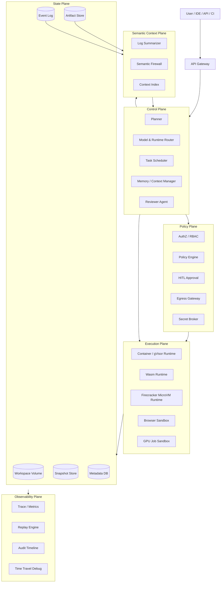
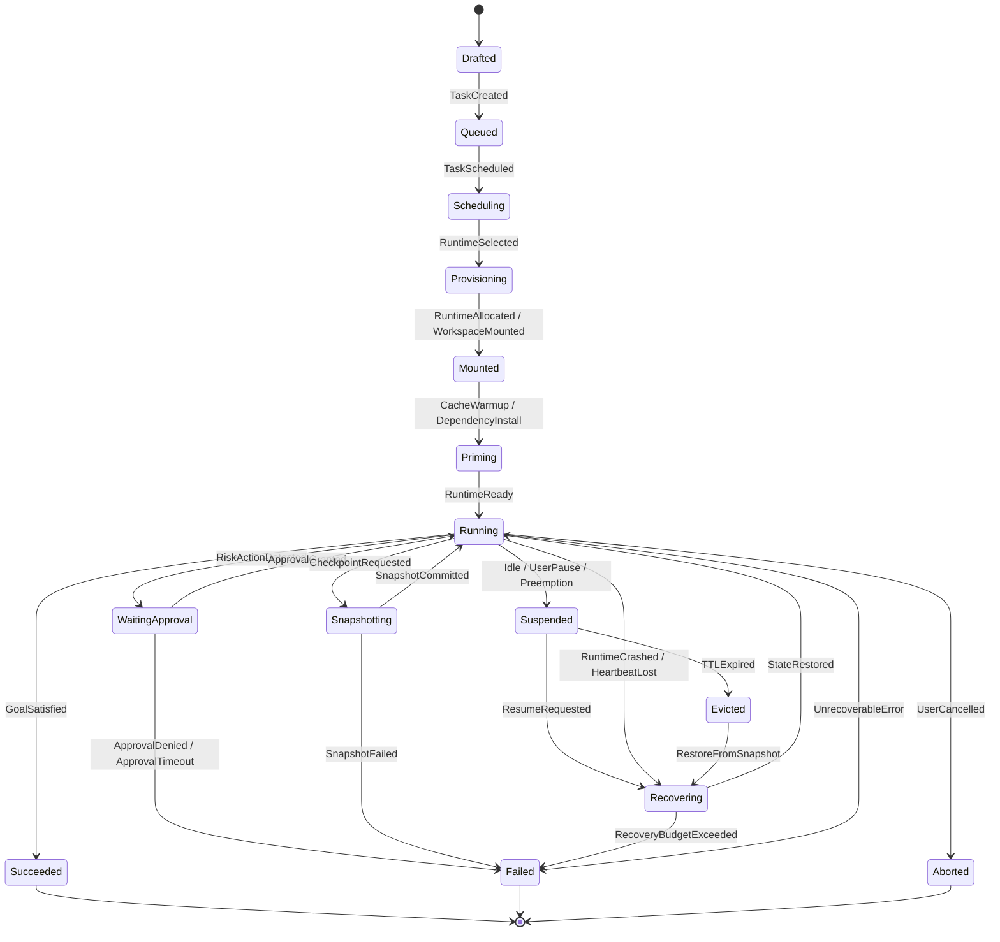
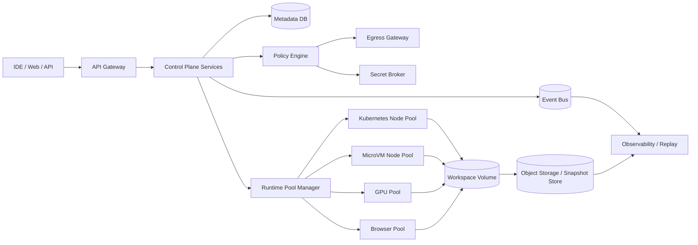

# AgentRuntimeFabric方案设计

## 0. 摘要

AgentRuntimeFabric 是面向复杂 Multi Agent 任务的执行基础设施。它不是把 Agent 简单放进一个 sandbox，也不是给模型一个 remote shell，而是把 Agent 执行问题拆成可治理的分布式系统问题：控制面负责规划和决策，执行面负责隔离计算，状态面负责 workspace、snapshot、event 和 artifact 的持久化，策略面负责权限、审批和网络出口，可观测面负责追踪、回放和故障复盘。

该架构的核心判断是：长时 Multi Agent 任务的成功率不只取决于模型能力，还取决于 runtime 是否可恢复、workspace 是否完整、状态是否可分支、安全策略是否可声明、执行过程是否可回放。OpenAI 的 sandbox agent 把 harness/control plane 与 sandbox compute plane 明确拆分，Codex 把 sandbox 边界与 approval policy 区分开来；Anthropic 强调工具由客户端或服务端执行、应用需要控制 agentic loop；E2B、Modal、Firecracker 和 OpenHands 则分别提供了持久化 sandbox、snapshot、microVM 隔离、agent server/runtime 拆分等工程参考。[^openai-sandbox-agents][^openai-codex-sandbox][^anthropic-tool-use][^e2b-persistence][^modal-sandbox-snapshots][^firecracker-snapshot][^openhands-runtime]

## 1. 业务场景

### 1.1 复杂软件工程任务

典型任务包括修复大型仓库 bug、通过 SWE-bench 类评测、迁移框架版本、重构模块、补齐测试、运行构建链和生成 PR。此类任务的 runtime 需要完整持有仓库、依赖缓存、构建产物、日志、端口、浏览器状态和历史尝试。单轮对话上下文无法承载真实工程现场，workspace 必须成为长期状态的主载体。

### 1.2 长时后台任务

企业会把 “升级一个服务依赖并验证兼容性” 这类目标交给 Agent 后台运行数十分钟到数小时。任务期间会遇到依赖下载、测试矩阵、网络抖动、进程挂死、机器抢占、审批等待。AgentRuntimeFabric 必须支持暂停、恢复、迁移、重试和人工接管，不能把任务生命绑定到单个容器进程。

### 1.3 多 Agent 并发协作

一个大目标可能拆成多个子任务：A Agent 修改后端接口，B Agent 调整前端调用，C Agent 写测试，Reviewer Agent 汇总 diff。并发执行需要 workspace branch、状态锁、merge/rebase、冲突检测和审计链路，否则多个 Agent 会在同一目录中互相覆盖。

### 1.4 浏览器与 UI 自动化

前端应用开发、网页登录、控制台操作、设计回归和端到端测试需要 headless browser 或可视化 browser sandbox。浏览器会产生本地缓存、会话、截图、trace、录屏和端口映射，这些状态应归入 workspace 与 artifact，而不是散落在一次性 runtime 中。

### 1.5 数据、模型与 GPU 任务

数据清洗、向量索引构建、模型微调、推理验证和大规模批处理可能需要 GPU、对象存储、专用镜像和长时间运行。AgentRuntimeFabric 不直接替代训练平台，而是把 GPU job sandbox 作为可插拔执行后端，纳入同一套 task、policy、snapshot、event 和 artifact 模型。

### 1.6 高安全执行环境

企业 Agent 会读取第三方仓库、安装依赖、运行脚本、访问内网 API、操作密钥和提交代码。这些动作天然带来 supply chain、数据泄露、prompt injection、越权网络访问和误发布风险。平台需要默认最小权限、网络出口白名单、敏感动作审批、密钥代理和可审计日志。

## 2. 问题挑战

| 挑战 | 现象 | 架构含义 |
| --- | --- | --- |
| 状态与执行耦合 | container crash 后进程、缓存、日志和现场一起丢失 | runtime 不能作为状态边界，状态必须外置 |
| Workspace 不完整 | Agent 只看到片段日志，无法复现构建现场 | workspace 应包含 repo、deps、cache、logs、ports、browser state |
| 长任务不可恢复 | 抢占、超时、OOM、断网后只能重跑 | 需要 snapshot、event log 和 task-level lifecycle |
| 安全策略粗糙 | 只有 “能不能联网/能不能执行” 的粗粒度开关 | 需要声明式 policy、approval、egress control、secret scope |
| Prompt injection | README、网页、测试输出诱导 Agent 忽略系统约束 | 工具结果和外部内容必须进入安全过滤与上下文分级 |
| 多 Agent 冲突 | 多个 Agent 改同一文件，谁覆盖谁不可追踪 | 需要 workspace branch、lock、merge queue 和 reviewer |
| 可观测不足 | 只保存最终回答，无法解释失败路径 | every command/event/artifact 都要可追踪、可回放 |
| 成本与延迟 | 大量全量复制 workspace、重复安装依赖、冷启动慢 | 需要 CoW delta snapshot、缓存分层和 runtime pool |

这些问题的共同点是：Agent 执行不是单模型调用问题，而是一个有生命周期、有状态、有权限、有恢复语义的系统问题。

## 3. 现有技术研究

### 3.1 OpenAI：控制面、沙箱和工具协议分离

OpenAI 的 sandbox agent 把系统拆为 harness 和 sandbox 两层：harness 保存状态、编排模型请求、执行工具调用，是控制面；sandbox 是隔离的计算环境，包含文件系统、shell、浏览器、端口和命令执行能力，是执行面。sandbox 可以在暂停后保留文件，并可用于复杂编程、数据分析、浏览器测试等任务。[^openai-sandbox-agents]

Codex sandbox进一步把 sandbox boundary 与 approval policy 分开：sandbox 限制文件系统和网络访问，approval policy 决定何时需要人类授权。这个边界对 AgentRuntimeFabric 很关键，因为隔离只能解决 “在哪里运行”，审批和策略解决的是 “是否允许运行”。[^openai-codex-sandbox]

OpenAI 的 MCP/connectors 文档说明工具边界正在标准化：模型通过结构化工具调用连接远端能力，宿主系统负责执行和回传结果。AgentRuntimeFabric 应把 MCP、tool call、ACI 类协议视为 control plane 与 execution/tool plane 之间的标准接口，而不是把所有能力写死在内部 SDK。[^openai-mcp]

### 3.2 Anthropic：工具执行位置与安全环路

Anthropic 的 Claude tool use 区分 client tools 与 server tools，并强调 agentic loop 由应用控制：模型发出工具使用请求，客户端或服务端执行，再把结果返回模型。这个模式说明 Agent 基础设施必须把 “模型推理” 和 “工具执行” 作为两个不同安全域处理。[^anthropic-tool-use]

Anthropic 的 Claude Code 安全文档强调 prompt injection 是核心风险，建议使用权限提示、受限工具、容器或 VM 隔离、网络限制和敏感操作确认。AgentRuntimeFabric 的 Semantic Firewall、HITL 审批、egress whitelist 和 secret broker 正是对这些原则的平台化实现。[^anthropic-security]

### 3.3 E2B：持久化 sandbox 与 pause/resume

E2B 提供面向 AI Agent 的 secure computer/sandbox，并支持 sandbox persistence。其关键价值不是单纯 “运行代码”，而是把 Agent 可操作的计算机环境持久化，支持任务恢复和跨请求继续执行。对 AgentRuntimeFabric 来说，E2B 证明了 workspace/runtime persistence 是 Agent 产品的基础能力，而非可选增强。[^e2b-persistence]

### 3.4 Modal：sandbox snapshot、内存快照与网络控制

Modal Sandboxes 支持 snapshotting，用于降低启动延迟、创建自定义环境、备份调试现场、基于同一初始状态运行实验、分支测试不同代码变更。Modal 文档还区分 filesystem snapshot、directory snapshot 和 memory snapshot，其中 memory snapshot 会复制 sandbox 的内存与文件系统，并可恢复为原 sandbox 的克隆。[^modal-sandbox-snapshots]

Modal 的 sandbox networking 文档提供了网络和安全控制参考，包括通过 `block_network` 禁止网络、通过 CIDR 配置限制访问范围等。AgentRuntimeFabric 的 egress control 应达到同等或更细粒度的声明式管控。[^modal-networking]

### 3.5 Firecracker：microVM 隔离与快照恢复

Firecracker 是面向 serverless workload 的 microVM 技术，强调安全隔离、快速启动和高密度运行。其 snapshot 文档说明 microVM 的内存和设备状态可以被保存并在之后恢复。对不可信代码、未知依赖和高隔离需求的 Agent 任务，Firecracker 类 microVM 比普通 container 更适合作为强隔离 execution backend。[^firecracker][^firecracker-snapshot]

### 3.6 OpenHands：Agent server 与 runtime 拆分

OpenHands 的架构将 agent server、runtime、workspace 等职责拆开，runtime 负责执行命令和文件操作，agent server 通过事件流协调交互。这个方向与 AgentRuntimeFabric 的 “控制面不直接执行危险动作，执行面只提供隔离计算能力” 一致。[^openhands-runtime][^openhands-agent-server]

### 3.7 技术收敛结论

行业前沿实现正在收敛到六个原则：

1. **Control/Execution 分离**：模型编排与危险执行不在同一安全域。
2. **Workspace-first**：真实工程状态由 workspace 承载，而不是由 prompt 承载。
3. **Snapshot-first**：恢复、分支、调试和冷启动优化都围绕 snapshot 设计。
4. **Policy as Code**：网络、文件、命令、密钥、审批都应声明式表达。
5. **Everything is Event**：每次命令、工具调用、文件变化、审批和产物都进入事件流。
6. **Tool Protocol Standardization**：MCP/tool call 是控制面和外部能力之间的标准边界。

## 4. AgentRuntimeFabric 方案

### 4.1 定义

AgentRuntimeFabric 是一个以控制面为大脑、以可恢复 workspace 为身体、以 snapshot 和 policy 为边界、以 event stream 为神经系统的 Agent 执行基础设施。它向上服务 IDE、Web、API、CI 和自动化平台，向下调度 container、gVisor、Wasm、microVM、browser sandbox、GPU job 等异构 runtime。

### 4.2 设计目标

| 目标 | 设计要求 |
| --- | --- |
| Durable Execution | task/session 可暂停、恢复、迁移、重试，不绑定单个 runtime |
| Workspace-first | repo、deps、cache、env、logs、ports、browser state 统一进入 workspace |
| Snapshot Recovery | 通过增量 snapshot 支持恢复、回滚、分支和调试 |
| Secure by Default | 默认最小权限，网络、文件、命令、密钥和审批可声明 |
| Multi-Agent Collaboration | workspace branch、stateful lock、merge/review 支持并发协作 |
| Replayable Execution | 所有命令、事件、diff、artifact、approval 可追踪和回放 |
| Pluggable Runtime | 按风险、资源和交互需求选择不同 execution backend |

### 4.3 非目标

AgentRuntimeFabric 不实现 LLM 本身，不替代 Kubernetes、CI/CD、数据库或对象存储，也不把某一种 sandbox 技术绑定为唯一实现。它定义的是 Agent 执行层的控制边界、状态模型、安全策略和运行时编排。

### 4.4 六个平面

| 平面 | 职责 | 典型组件 |
| --- | --- | --- |
| Control Plane | 规划、任务拆解、模型路由、审批决策、恢复编排 | Planner、Router、Memory Manager、Reviewer、Scheduler |
| Execution Plane | 运行命令、测试、浏览器、GPU job、工具调用 | Runtime Pool、Sandbox Adapter、Browser Pool、GPU Worker |
| State Plane | 持久化 workspace、snapshot、event、artifact、metadata | W-Volume、Snapshot Store、Event Log、Artifact Store、Metadata DB |
| Policy Plane | 权限、审批、网络出口、密钥、审计 | Policy Engine、Approval Service、Egress Gateway、Secret Broker |
| Observability Plane | trace、metrics、日志、replay、time-travel debug | Trace Store、Replay Engine、Timeline UI、Alerting |
| Semantic Context Plane | 日志压缩、上下文分级、外部内容安全过滤 | Log Summarizer、Semantic Firewall、Context Index |

## 5. AgentRuntimeFabric 架构

### 5.1 总体架构图



### 5.2 核心对象模型

| 对象 | 定义 | 关键字段 | 关系 |
| --- | --- | --- | --- |
| Session | 用户宏观目标和对话任务容器 | `session_id`, `owner`, `goal`, `status`, `policy_bundle_id`, `created_at` | 一个 Session 包含多个 Task |
| Task | 可调度、可恢复、可审计的执行单元 | `task_id`, `session_id`, `parent_task_id`, `status`, `priority`, `plan`, `runtime_profile` | Task 可递归拆分 |
| Workspace | 持久化工作区，是工程现场的事实源 | `workspace_id`, `base_image`, `mount_spec`, `env`, `branch_id`, `snapshot_head` | Task 绑定 Workspace |
| Snapshot | 某一时刻的增量检查点 | `snapshot_id`, `workspace_id`, `parent_snapshot_id`, `delta_ref`, `memory_ref`, `created_at` | Workspace 拥有 snapshot DAG |
| Policy | 声明式执行约束 | `policy_id`, `allowed_tools`, `allowed_paths`, `network_rules`, `approval_rules`, `secret_scope` | 可附着到 Session/Task/Workspace |
| Artifact | 执行证据和交付物 | `artifact_id`, `task_id`, `snapshot_id`, `type`, `uri`, `checksum`, `provenance` | 由 Task 产生并可被后续 Task 消费 |
| Runtime | 一次实际执行资源实例 | `runtime_id`, `backend`, `resource_spec`, `status`, `workspace_id`, `lease_ttl` | 可销毁、可恢复、可替换 |
| Event | 所有状态变化和动作结果 | `event_id`, `type`, `task_id`, `runtime_id`, `timestamp`, `payload` | Event Log 是 replay 基础 |

对象语义：

- Session 是目标容器，不是执行容器。
- Task 是调度和审计边界，不是长期状态边界。
- Workspace 是身体，承载代码、依赖、缓存、日志和交互状态。
- Snapshot 是恢复和分支边界。
- Policy 是安全边界。
- Artifact 是结果，也是证据链和后续推理输入。
- Runtime 是可替换执行后端，不是 Agent 身份。
- Event 是系统事实，不依赖模型总结。

### 5.3 Runtime 生命周期状态机



关键状态解释：

- `Drafted`：目标存在，尚未分配资源。
- `Queued`：等待调度。
- `Provisioning`：选择 backend，准备镜像、网络、密钥和资源。
- `Mounted`：workspace 已挂载。
- `Priming`：依赖安装、缓存预热、服务启动。
- `Running`：执行命令、工具调用或浏览器动作。
- `WaitingApproval`：触发高风险动作，runtime 挂起等待审批。
- `Snapshotting`：创建一致性检查点。
- `Suspended`：暂停或被抢占，状态仍可恢复。
- `Recovering`：从 snapshot/event 恢复现场并继续任务。
- `Evicted`：资源释放，task 仍可通过状态面恢复。

### 5.4 事件模型

标准事件结构：

```json
{
  "event_id": "uuid",
  "type": "CommandFinished",
  "session_id": "uuid",
  "task_id": "uuid",
  "workspace_id": "uuid",
  "runtime_id": "uuid",
  "timestamp": "2026-05-06T00:00:00Z",
  "actor": "agent|user|system|policy",
  "payload": {},
  "causation_id": "event_id",
  "correlation_id": "session_id"
}
```

核心事件类型：

- `SessionCreated`
- `TaskCreated`
- `TaskScheduled`
- `RuntimeAllocated`
- `WorkspaceMounted`
- `CommandStarted`
- `CommandFinished`
- `ToolCallRequested`
- `ToolCallFinished`
- `ApprovalRequested`
- `ApprovalGranted`
- `ApprovalDenied`
- `SnapshotCreated`
- `ArtifactEmitted`
- `RuntimeSuspended`
- `RuntimeRecovered`
- `TaskCompleted`
- `TaskFailed`

事件设计原则是 append-only、可重放、可索引、可关联 artifact 和 snapshot。模型总结可以辅助理解事件，但不能替代事件事实。

### 5.5 API 边界

AgentRuntimeFabric 的 API 以任务、状态和策略为中心，而不是以 “给 shell 发字符串” 为中心。

```http
POST /sessions
GET  /sessions/{session_id}

POST /tasks
POST /tasks/{task_id}/run
POST /tasks/{task_id}/cancel
POST /tasks/{task_id}/approve

POST /workspaces
POST /workspaces/{workspace_id}/snapshot
POST /workspaces/{workspace_id}/restore
POST /workspaces/{workspace_id}/branch
POST /workspaces/{workspace_id}/merge

POST /runtime/allocate
POST /runtime/{runtime_id}/execute
POST /runtime/{runtime_id}/pause
POST /runtime/{runtime_id}/resume

GET  /events?session_id=...
GET  /artifacts/{artifact_id}
GET  /replay/{session_id}
```

接口原则：

- Control Plane 只提交 intent、task 和 policy，不直接绕过策略面操作 runtime。
- Execution Plane 的命令执行必须绑定 task、workspace、runtime 和 policy。
- Snapshot/restore 必须产生日志事件，并绑定审批和审计上下文。
- Artifact 必须带 checksum、producer event 和 snapshot provenance。

### 5.6 Runtime 路由策略

| 任务类型 | 推荐后端 | 原因 |
| --- | --- | --- |
| 可信轻量脚本、格式化、静态分析 | container / gVisor | 启动快、成本低、隔离足够 |
| 高风险第三方依赖、不可信代码、编译脚本 | Firecracker microVM | 隔离强，适合运行未知代码 |
| 纯函数、插件、边缘轻任务 | Wasm runtime | 能力面小，权限易声明 |
| UI 测试、网页操作、截图和录屏 | browser sandbox | 需要 DOM、浏览器状态和端口 |
| 数据处理、训练、推理验证 | GPU job sandbox | 需要专用资源和长任务调度 |

路由输入包括：task risk、resource profile、network policy、secret scope、expected duration、interactive requirement、snapshot requirement。路由结果必须写入 Task 和 Runtime 元数据，便于审计和成本归因。

### 5.7 Workspace 与 Snapshot 架构

Workspace 建议采用 W-Volume 抽象：

```text
workspace/
  repo/
  deps/
  cache/
  logs/
  browser/
  ports/
  artifacts/
  snapshots/
  metadata/
```

Snapshot 建议采用 DAG：

```text
base-snapshot
  ├── task-a-step-001
  │   └── task-a-step-002
  └── task-b-branch-001
      └── reviewer-merge-001
```

设计原则：

- 文件系统 snapshot 优先使用 CoW/delta，而不是全量复制。
- 内存 snapshot 只用于需要恢复运行态的高价值场景，默认以文件系统和事件恢复为主。
- snapshot 必须包含一致性级别：`fs-only`、`fs+process-metadata`、`fs+memory`。
- 每个 snapshot 记录 parent、producer event、workspace branch、policy version 和 checksum。
- snapshot GC 按 session TTL、artifact retention、审计要求和人工 pin 规则执行。

### 5.8 多 Agent 协作模型

多 Agent 协作以 workspace branch 为边界：

```text
main
  ├── branch/task-backend-api
  ├── branch/task-frontend-ui
  └── branch/task-tests
       └── reviewer-merge
```

协作流程：

1. Planner 将目标拆成多个 Task。
2. 每个 Task 从同一 base snapshot fork 出独立 workspace branch。
3. Agent 在分支内执行，生成 patch、artifact 和 event。
4. Reviewer Agent 对分支结果做测试、diff review 和冲突检测。
5. Merge Queue 合并到 main workspace branch。
6. 合并后创建 reviewer snapshot，作为后续任务基线。

冲突控制：

- 文件级 optimistic lock 用于低冲突任务。
- 目录级 stateful lock 用于高风险改动。
- merge 前必须运行最低测试集。
- 任何自动合并都保留可回滚 snapshot。

### 5.9 Policy Plane 设计

Policy 使用声明式策略表达：

```yaml
policy_id: policy-prod-code-agent
filesystem:
  allow_write:
    - /workspace/repo
    - /workspace/artifacts
  deny_write:
    - /workspace/secrets
network:
  default: deny
  allow:
    - domain: registry.npmjs.org
      ports: [443]
    - domain: api.github.com
      ports: [443]
commands:
  allow:
    - npm
    - node
    - git
    - pytest
  require_approval:
    - git push
    - npm publish
    - terraform apply
secrets:
  scope: task
  expose_as: brokered
approvals:
  timeout_seconds: 3600
  approver_groups:
    - repo-maintainers
```

关键机制：

- 默认拒绝网络，按域名、CIDR、端口和协议放行。
- 密钥不直接写入 workspace，通过 Secret Broker 注入短期凭证。
- 高风险动作进入 `WaitingApproval`，审批结果写入 event log。
- 策略版本固定到 task execution，避免运行中策略漂移不可解释。
- 对外部网页、README、日志、测试输出进入 Semantic Firewall，降低 prompt injection 风险。

### 5.10 Semantic Context Plane

Semantic Context Plane 解决两类问题：日志太大和外部内容不可信。

能力：

- 将 GB 级 stdout/stderr、构建日志、测试失败压缩成 KB 级高信号摘要。
- 将 artifact、event、diff 和 snapshot 编入 Context Index，供模型按需检索。
- 标记上下文来源：`trusted-system`、`user-provided`、`tool-output`、`external-web`、`untrusted-repo`。
- 对不可信内容做 prompt injection 检测，禁止其覆盖系统策略、审批规则和安全边界。
- 保留原始日志引用，摘要只作为模型输入，不作为审计事实。

### 5.11 Observability 与 Replay

可观测性不是 “能看日志”，而是 “能重建现场”。

核心能力：

- Session/Task/Runtime/Command 级 trace。
- stdout/stderr、exit code、duration、resource usage 结构化采集。
- 文件 diff、artifact、snapshot 与 command event 关联。
- Replay Engine 可按事件顺序重放执行轨迹。
- Time Travel Debug 可恢复到指定 snapshot，由人类接管 shell/browser，再交还 Agent。
- 审计视图显示谁批准了什么动作、在哪个策略版本下执行、产生了哪些外部访问。

### 5.12 部署拓扑



推荐技术组合：

- Control Plane：微服务或模块化单体，优先保证幂等、重试和事件一致性。
- Event Bus：Kafka、Redpanda、Pulsar 或云原生事件流。
- Metadata DB：PostgreSQL，保存 session/task/runtime/snapshot/artifact 元数据。
- Workspace：高性能块存储 + OverlayFS/ZFS/Btrfs/自研 CoW 层。
- Snapshot Store：S3 兼容对象存储，热快照可放高性能缓存层。
- Runtime：container/gVisor 作为 MVP，microVM 作为高风险任务增强，browser/GPU 作为专用池。
- Observability：OpenTelemetry + 日志索引 + replay service。

## 6. 关键技术

### 6.1 Workspace-first

Workspace 是 Agent 执行的事实源。模型上下文只携带当前需要推理的信息，真实现场必须保留在 workspace 中。设计上应避免把文件内容、日志和依赖状态复制到控制面内存；控制面只持有 metadata、summary、event cursor 和策略状态。

### 6.2 Delta Snapshot 与 CoW

Snapshot 的目标是降低恢复成本、支持分支和提升调试能力。全量复制 workspace 会造成不可接受的 I/O 与存储成本，因此默认采用 CoW delta。内存 snapshot 用于浏览器会话、长进程、REPL、调试现场等高价值场景；普通构建任务优先通过文件系统 snapshot + event replay 恢复。

### 6.3 Durable Task Lifecycle

Task 生命周期与 runtime 生命周期解耦。runtime 可以崩溃、被抢占或释放，task 仍可根据 event log、snapshot 和 policy 恢复。所有外部副作用动作必须具有 idempotency key 或至少写入 compensating event，避免恢复后重复发布、重复提交或重复调用生产 API。

### 6.4 Pluggable Sandbox Adapter

Execution Plane 通过 adapter 接入不同后端：

```text
RuntimeAdapter
  allocate(profile, policy, workspace)
  execute(command, env, timeout)
  snapshot(level)
  restore(snapshot)
  pause()
  resume()
  stream_events()
  teardown()
```

adapter 屏蔽容器、microVM、browser、GPU job 的实现差异，但必须向上暴露一致的 event、artifact、exit status、resource usage 和 snapshot handle。

### 6.5 Egress Control

Agent 运行第三方代码时，网络出口是主要风险面。Egress Gateway 应支持 domain allowlist、CIDR allowlist、port/protocol 控制、DNS 审计、TLS SNI 记录、速率限制和任务级网络身份。默认策略应为 deny all，只为任务需要的 registry、GitHub、包管理源、目标 API 开口。

### 6.6 Secret Broker

密钥不应直接落入 workspace 或日志。Secret Broker 提供短期、可撤销、最小权限凭证，并根据 task、runtime、policy、approval 状态动态发放。任何 secret access 都必须产生日志事件，并在 stdout/stderr 采集层进行泄露检测和脱敏。

### 6.7 HITL 审批

高风险动作包括但不限于：

- `git push`、创建 release、合并 PR。
- `npm publish`、`pip publish`、发布容器镜像。
- `terraform apply`、修改生产基础设施。
- 访问生产数据库或生产 API。
- 发送外部邮件、消息、付款或删除数据。

审批卡点必须暂停状态机，保留 runtime 或创建 snapshot 后释放 runtime。审批结果进入 event log，并固定到后续执行上下文。

### 6.8 Semantic Firewall

Semantic Firewall 不试图 “完全理解恶意内容”，而是执行来源分级和策略隔离：

- 不可信内容不能修改系统指令、policy、approval rule 和 secret scope。
- 外部网页、README、issue、日志只作为 data，不作为 instruction。
- 工具输出中的命令建议必须再次经过 policy engine。
- 检测到注入风险时，生成安全摘要而不是把原文直接送入模型。

### 6.9 Replay 与 Time Travel Debug

Replay 依赖三类数据：event log、snapshot、artifact。用户可以从 timeline 选择某个失败点，恢复当时 workspace，查看命令、日志、diff、资源指标和策略状态。人类修复后创建新的 snapshot，Agent 从该点继续执行。这是复杂工程任务从 “黑箱自动化” 走向 “可协作自动化” 的关键。

### 6.10 多 Agent Branch/Merge

多 Agent 并发不是共享同一个目录，而是共享同一个 base snapshot。每个 Agent 在 branch 中工作，输出 patch 和 artifact，由 reviewer 合并。这样可以把并发协作转化为版本控制问题，沿用 diff、test、review、merge queue、rollback 等成熟工程机制。

## 7. MVP 落地方案

### 7.1 Phase 1：可恢复单 Agent 执行

目标：支持一个 Agent 在持久化 workspace 中执行命令、生成 artifact、创建 snapshot，并能从失败中恢复。

范围：

- 核心对象：Session、Task、Workspace、Snapshot、Policy、Artifact、Runtime、Event。
- Runtime：container/gVisor。
- Workspace：持久化目录 + 基础 snapshot。
- Event：命令级、artifact 级、approval 级事件。
- Policy：文件写路径、命令 allowlist、网络开关。
- Observability：task timeline 和日志查看。

验收标准：

- runtime crash 后可从最近 snapshot 恢复并继续 task。
- 每条命令有 event、stdout/stderr、exit code 和 artifact 关联。
- 高风险命令会进入 WaitingApproval。

### 7.2 Phase 2：安全增强与多后端 runtime

目标：支持高风险代码、浏览器任务和更细粒度安全治理。

范围：

- 增加 Firecracker microVM adapter。
- 增加 browser sandbox。
- 引入 egress whitelist 和 Secret Broker。
- 引入 Semantic Firewall。
- snapshot 支持 delta 和分层存储。

验收标准：

- 高风险任务自动路由到 microVM。
- 默认无网络，按 policy 放行。
- 外部内容不能绕过 approval 和 policy。

### 7.3 Phase 3：多 Agent 协作与 Replay

目标：支持复杂项目的并发协作、reviewer 合并和时间旅行调试。

范围：

- Workspace branch/merge。
- Reviewer Agent。
- Replay Engine。
- Time Travel Debug UI。
- 成本归因和 snapshot GC。

验收标准：

- 多个 Agent 可从同一 base snapshot 并发执行。
- 自动合并前可运行测试并检测冲突。
- 用户可恢复到任意关键 snapshot 接管修复。

## 8. 风险与缓解

| 风险 | 缓解 |
| --- | --- |
| Snapshot 数量膨胀 | TTL、GC、分层存储、人工 pin、按 session 归档 |
| Workspace 过大 | cache 分层、artifact 生命周期、依赖缓存去重 |
| 内存 snapshot 不稳定 | 默认 fs-only，memory snapshot 只用于特定 runtime/profile |
| 多 Agent 合并冲突 | branch 隔离、merge queue、reviewer、测试门禁 |
| Prompt injection | 来源分级、Semantic Firewall、policy 不受工具输出影响 |
| 密钥泄露 | Secret Broker、短期 token、日志脱敏、访问审计 |
| 网络滥用 | 默认 deny、egress gateway、DNS/TLS 审计、速率限制 |
| 成本失控 | runtime TTL、idle eviction、资源配额、成本归因 |
| 恢复重复副作用 | idempotency key、approval event、外部动作补偿日志 |

## 9. 架构设计原则总结

AgentRuntimeFabric 的专业架构原则可以压缩为十条：

1. 模型不直接拥有执行权，执行权由宿主和策略面授予。
2. Runtime 可丢弃，Workspace 才是长期事实源。
3. Snapshot 是恢复、回滚、分支和调试的统一原语。
4. Event log 是系统事实，模型摘要不是事实源。
5. Policy 必须声明式、版本化、可审计。
6. 网络出口和密钥访问默认拒绝。
7. 外部内容只能作为数据，不能升级为指令。
8. 多 Agent 协作走 branch、review、merge，而不是共享目录互写。
9. 可观测性必须支持 replay，而不仅是日志检索。
10. 执行后端必须可插拔，按风险和资源需求路由。

## 10. 结论

AgentRuntimeFabric 把 Agent 从 “一次模型调用 + 一个沙箱” 提升为 “可恢复、可治理、可审计、可并发协作的执行织网”。它参考 OpenAI、Anthropic 等前沿 Agent 产品和 API 设计中的控制边界，结合 E2B、Modal、Firecracker、OpenHands 等运行时基础设施的工程实践，形成一套适合企业级 Agent 平台落地的架构。

最终目标不是让 Agent 看起来更像一个会话机器人，而是让 Agent 像一个受控的分布式执行系统：能接任务，能拆任务，能安全运行，能失败恢复，能解释过程，能与人类和其他 Agent 协作，并能在生产级约束下持续交付结果。

## References

[^openai-sandbox-agents]: OpenAI Developers, "Sandbox agents", https://developers.openai.com/api/docs/guides/agents/sandboxes
[^openai-codex-sandbox]: OpenAI Developers, "Sandbox - Codex", https://developers.openai.com/codex/concepts/sandboxing
[^openai-mcp]: OpenAI Platform Docs, "MCP and connectors", https://platform.openai.com/docs/guides/tools-connectors-mcp
[^anthropic-tool-use]: Anthropic Claude Docs, "Tool use with Claude", https://docs.anthropic.com/en/docs/agents-and-tools/tool-use/overview
[^anthropic-security]: Anthropic Claude Docs, "Claude Code security", https://docs.anthropic.com/en/docs/claude-code/security
[^e2b-persistence]: E2B Docs, "Sandbox persistence", https://e2b.dev/docs/sandbox/persistence
[^modal-sandbox-snapshots]: Modal Docs, "Sandbox snapshots", https://modal.com/docs/guide/sandbox-snapshots
[^modal-networking]: Modal Docs, "Sandbox networking and security", https://modal.com/docs/guide/sandbox-networking
[^firecracker]: Firecracker, "Firecracker MicroVM", https://firecracker-microvm.github.io/
[^firecracker-snapshot]: Firecracker GitHub Docs, "Snapshot support", https://github.com/firecracker-microvm/firecracker/blob/main/docs/snapshotting/snapshot-support.md
[^openhands-runtime]: OpenHands Docs, "Runtime architecture", https://docs.openhands.dev/openhands/usage/architecture/runtime
[^openhands-agent-server]: OpenHands Docs, "Agent server overview", https://docs.openhands.dev/sdk/guides/agent-server/overview
