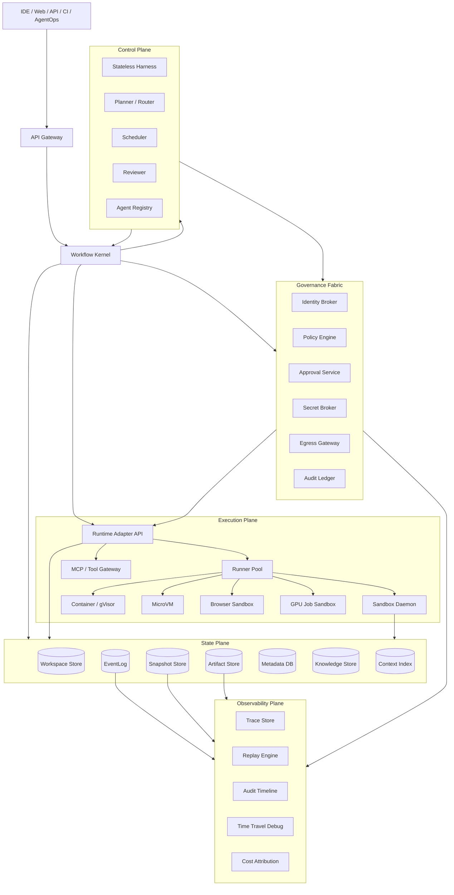
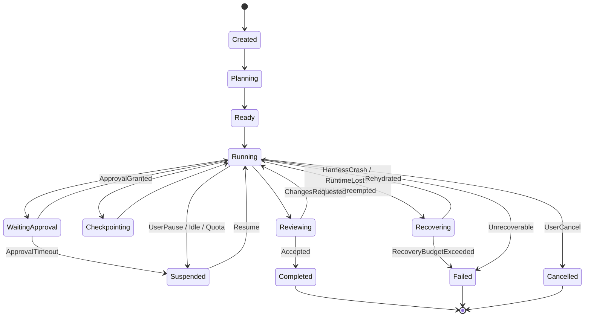
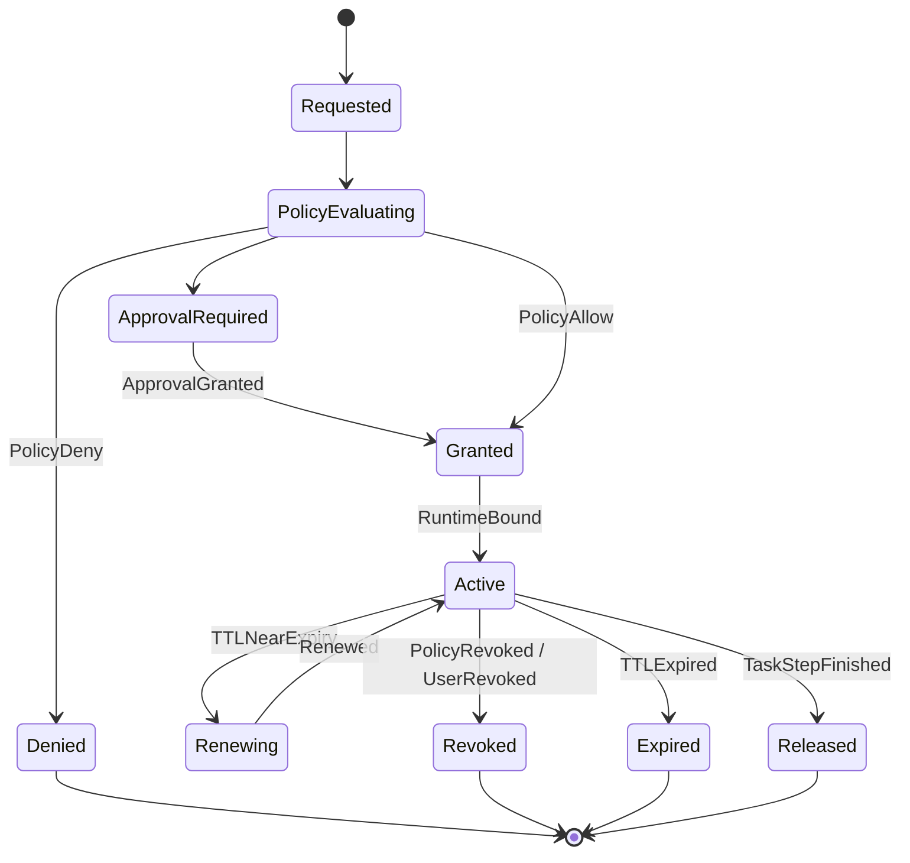
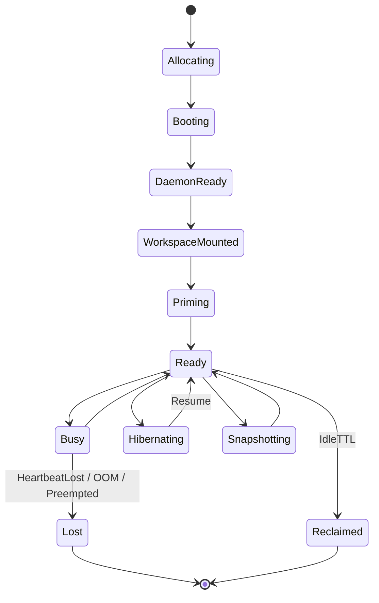

# AgentRuntimeFabric v2 方案

## 0. 摘要

AgentRuntimeFabric v2 的核心定位是 Agentic Workflow Operating Layer。它不做另一个聊天式 Agent 框架，也不把 Agent 简化成一个远程 shell，而是在模型编排层和 sandbox 执行层之间提供一套可恢复、可审计、可治理、可扩展、可分权的执行织网。

v2 的基本判断是：下一代 Agent 基础设施的竞争焦点不是“函数调用格式”，而是“控制面与执行面分离后的持久化工作流”。控制面负责规划、编排、审批、观测、记忆和恢复决策；执行面只在隔离 sandbox、microVM、container、workspace 或 browser/GPU runtime 中执行代码、安装依赖、跑测试、开端口和处理长任务。所有真正的系统事实落在 Workspace、Snapshot、EventLog、Artifact、PolicyDecision 和 WorkflowRun 中，而不是落在模型上下文或临时容器进程里。

从硅谷顶级基础设施视角看，OpenAI Agents SDK + Codex、Google Gemini Enterprise Agent Platform、AWS Bedrock AgentCore、E2B、Modal Sandboxes、Daytona、OpenHands Runtime、AutoGen 和 Vercel Open Agents 正在把 Agent 基础设施收敛到同一个方向：Agent 是可治理的工作流主体，sandbox 是可替换的执行身体，workspace 是长期现场，policy 是权限边界，event log 是审计事实，identity 是平台化治理入口。

v2 相比 v1 的关键升级：

1. 从“六平面架构”升级为“durable workflow kernel + runtime adapter contract + workspace lineage + identity governance fabric”。
2. 从“Runtime 生命周期”升级为“WorkflowRun / Task / ExecutionLease / RuntimeInstance 四层生命周期分离”。
3. 从“沙箱可插拔”升级为“可声明能力矩阵的 RuntimeAdapter 标准契约”。
4. 从“Policy 配置”升级为“每个跨边界动作都有 PolicyDecision、Approval、SecretBroker、EgressIdentity 和 AuditEvent”。
5. 从“Workspace-first”升级为“Workspace lineage DAG + Snapshot class + branch/merge/lock + provenance”。
6. 从“可观测日志”升级为“replayable event fabric + time travel debug + determinism budget”。
7. 从“多 Agent 协作”升级为“actor/runtime 模型：Agent identity、message routing、backpressure、handoff、lease、checkpoint 全部事件化”。

## 1. 行业技术研究与借鉴

### 1.1 OpenAI Agents SDK + Codex

OpenAI Agents SDK 提供 agent、handoff、guardrail、tool、tracing 等编排原语；Codex 和 sandbox 文档强调代码任务需要清晰的 sandbox 边界、网络/文件系统限制和审批策略。它们的关键启发不是“写一个更好的 SDK”，而是把模型动作、工具执行、追踪、审批和 sandbox 行为统一进同一条可审计事实流。[^openai-agents-sdk][^openai-codex-sandbox]

对 AgentRuntimeFabric v2 的借鉴：

- Harness 要像 SDK 一样轻，负责规划和 tool intent，不直接拥有执行权。
- Tool execution 和 sandbox execution 必须是宿主平台能力，不能让模型直接继承 shell 权限。
- tracing 不应只是调试 UI，应成为 EventLog 的上游数据源。
- approval policy 和 sandbox boundary 要分层：sandbox 限制“物理能不能做”，policy 决定“业务允不允许做”。
- Codex 背景执行说明代码任务天然需要后台运行、断线恢复、日志流、文件 diff 和最终 PR 产物。

### 1.2 OpenAI Agents SDK + sandbox

OpenAI 的 sandbox agents 形态把 agent harness/control side 与 contained compute side 分开。对 v2 而言，这直接验证“agent is not the sandbox”：AgentRuntimeFabric 的控制面可以运行在可信服务域，sandbox 是受限执行域，二者通过命令、文件、artifact、port 和 event 协议交互。[^openai-agents-sdk-sandbox]

对 AgentRuntimeFabric v2 的借鉴：

- Sandbox 是 compute plane，不是 control plane。
- 每次执行都要绑定 session、task、workspace、policy 和 identity。
- sandbox 输出是 observation，不是事实源的全部；事实源必须写入 EventLog 和 ArtifactStore。
- sandbox 权限应按任务临时授予，执行结束后 lease 过期。

### 1.3 Google Gemini Enterprise Agent Platform / ADK / Agent Engine

Google 的路线是从 ADK 的代码优先 agent 开发，上升到 Gemini Enterprise 的企业级 agent 注册、连接、集中管理和治理，再由 Vertex AI Agent Engine/Runtime 承接生产化运行。这说明企业 Agent 平台的核心资产不是某个 agent loop，而是 agent registry、identity、tool gateway、deployment、observability 和 governance。[^google-adk][^google-gemini-enterprise][^google-gemini-enterprise-agents][^google-agent-engine]

对 AgentRuntimeFabric v2 的借鉴：

- 需要 Agent Registry，不只保存 prompt，还保存 owner、能力、工具、策略、版本、评测结果和生产状态。
- 用户身份、Agent 身份、工具身份、runtime 身份要分离，不能让 Agent 直接继承用户全量权限。
- 企业连接器和内部工具要通过 gateway/proxy 纳入审计，而不是把密钥塞进 sandbox。
- Agent deployment 应该像服务部署一样有版本、环境、流量、回滚、观测和准入。

### 1.4 AWS Bedrock AgentCore

AWS Bedrock AgentCore 代表强托管、强治理、云原生 agent runtime 路线。它强调 framework-neutral、model-neutral 的 agent/tool 运行环境，并围绕 runtime、identity、gateway、memory、observability、browser/code interpreter 等能力平台化。[^aws-agentcore-overview][^aws-agentcore-runtime]

对 AgentRuntimeFabric v2 的借鉴：

- Runtime 层必须模型无关、框架无关、协议无关。
- Identity、Gateway、Memory、Observability 不能作为插件补丁，应是一等平面。
- Tool 和 Agent 都可以被托管，关键是统一身份、策略、网络、日志、审计。
- 多 Agent 工作流需要平台级 runtime，而不是单进程线程池。

### 1.5 E2B

E2B 把 sandbox 定义成给 AI Agent 使用的安全云端计算机，并强化 filesystem、process、timeout、reconnect、pause/resume 和持久化能力。它证明 Agent 执行面不应是一次性容器，而应是可重连、可恢复、可管理生命周期的计算机。[^e2b-sandbox][^e2b-persistence]

对 AgentRuntimeFabric v2 的借鉴：

- RuntimeAdapter 必须暴露 `connect/reconnect` 语义。
- pause/resume 不是体验增强，而是长任务可用性的基础能力。
- filesystem persistence 和 process/memory persistence 要区分能力等级。
- sandbox_id/runtime_id 必须进入事件和元数据，便于断线恢复和审计。

### 1.6 Modal Sandboxes

Modal Sandboxes 强调安全默认值、程序化创建、命令执行、端口、网络限制和 snapshot。其 snapshot 能力覆盖 filesystem、directory、memory 等不同层级，也明确提示内存快照存在连接、GPU、运行命令等限制。[^modal-sandboxes][^modal-networking][^modal-snapshots]

对 AgentRuntimeFabric v2 的借鉴：

- Snapshot 不是单一功能，而是恢复、分支、调试、冷启动和并行实验的统一原语。
- Snapshot 必须记录 consistency class：`fs`、`directory`、`process-metadata`、`memory`。
- RuntimeAdapter 要暴露能力矩阵，不能假设所有后端都支持 memory snapshot、GPU、开放端口或网络细粒度控制。
- egress control 要内建，默认 deny，按 CIDR、domain、port、protocol 放行。

### 1.7 Daytona

Daytona 将 sandbox 描述为可组合的计算机，并采用 runner 与 sandbox daemon 的分层方式：runner 提供 compute plane，sandbox 内 daemon 负责执行命令、文件和进程操作。这给 v2 一个清晰实现模型：控制面不进入 sandbox，sandbox daemon 是执行代理。[^daytona-sandboxes]

对 AgentRuntimeFabric v2 的借鉴：

- Execution Plane 可抽象成 `Runner + SandboxDaemon + WorkspaceMount`。
- SandboxDaemon 是不可信执行域中的最小代理，接受已授权 action，返回 observation。
- Runner 负责资源调度、镜像、网络、端口、TTL 和回收。
- 这比“控制面 SSH 进容器”更可治理，也更容易做审计和策略执行。

### 1.8 OpenHands Runtime

OpenHands 将 backend/agent/event stream 与 runtime/action executor 拆开，runtime 在容器中初始化 bash、browser、plugins、Jupyter 等能力，通过 action execution server 执行动作并返回 observation。它是自建 AgentRuntimeFabric 的重要开源参考。[^openhands-runtime]

对 AgentRuntimeFabric v2 的借鉴：

- EventStream 是 agent 与 runtime 之间的核心协调机制。
- ActionExecutor/SandboxDaemon 模式比裸 shell 更适合作为执行面协议。
- runtime image 要有可复现标签、依赖缓存和可控插件系统。
- workspace mount、overlay、port allocation、browser/Jupyter/VSCode 这类工程细节必须进入 v2 设计，不能停留在抽象图。

### 1.9 AutoGen

AutoGen 从多 Agent runtime 角度强调 message passing、event-driven agents、local/distributed runtime、agent lifecycle 和工具扩展。虽然 AutoGen 已进入维护模式，新项目更应关注 Microsoft Agent Framework，但它在 actor/runtime 抽象上的经验仍值得借鉴。[^autogen-readme]

对 AgentRuntimeFabric v2 的借鉴：

- 多 Agent 协作的稳定边界是 actor identity、message routing、lifecycle、backpressure、checkpoint 和 replay。
- Agent-to-Agent 不是普通函数调用，而是带 causation/correlation 的事件通信。
- Runtime 要区分 agent runtime、tool runtime 和 sandbox runtime。
- 多 Agent 失败恢复需要 mailbox、lease、checkpoint 和幂等处理。

### 1.10 Vercel Labs Open Agents

Open Agents 的核心架构是 `Web -> Agent workflow -> Sandbox VM`，并明确“agent is not the sandbox”。Web 负责 auth、session、chat 和 streaming UI；agent 作为 durable workflow 运行；sandbox VM 只负责 filesystem、shell、git、dev server 和 preview ports。它是 AgentRuntimeFabric v2 最贴近产品落地的参考。[^vercel-open-agents]

对 AgentRuntimeFabric v2 的借鉴：

- Chat request 不应 inline 执行 Agent，而应启动/唤醒 workflow run。
- Agent turn 可以跨多个 persisted workflow step。
- stream 重连应恢复同一个 workflow，而不是重新跑。
- sandbox 可以 hibernate/resume，workflow 和 sandbox 生命周期独立。
- auto-commit、push、PR 创建必须是偏好和审批驱动，不应默认开启。

## 2. 顶级专家视角：Agent Runtime 的长期边界

这些平台共同证明，AgentRuntimeFabric 的长期壁垒不是 planner、prompt、模型路由或某个 sandbox 后端，而是七个稳定系统边界：

| 边界 | v2 稳定接口 | 为什么重要 |
| --- | --- | --- |
| Workflow Boundary | `WorkflowRun`, `TaskGraph`, `Checkpoint`, `Compensation` | 长任务可暂停、恢复、迁移、重试 |
| Computer Boundary | `Workspace`, `RuntimeInstance`, `Port`, `Process`, `Snapshot` | Agent 真实工程现场 |
| Governance Boundary | `Identity`, `PolicyDecision`, `Approval`, `SecretGrant`, `AuditEvent` | 企业权限、合规和安全 |
| Protocol Boundary | `ToolCall`, `MCPProxy`, `RuntimeAdapter`, `A2AEnvelope` | 模型、框架、后端可替换 |
| Collaboration Boundary | `AgentActor`, `Mailbox`, `Assignment`, `Blocker`, `Review`, `MergeRequest` | 多 Agent 协作可控 |
| Context Boundary | `KnowledgeMount`, `ContextIndex`, `SemanticFirewall`, `MemoryRecord` | 上下文可治理、可追溯 |
| Evidence Boundary | `EventLog`, `Artifact`, `TraceSpan`, `ReplayFrame` | 可观测、可回放、可审计 |

v2 应该坚持一个原则：把会随模型快速变化的东西放在 Harness，把十年后仍有价值的东西放进平台内核。Planner、prompt repair、日志摘要策略、上下文拼装都可能被更强模型替换；但 Workspace lineage、PolicyDecision、Identity、EventLog、RuntimeAdapter、Snapshot 和 Artifact provenance 不会消失。

## 3. v2 架构定义

### 3.1 一句话定义

AgentRuntimeFabric v2 是一个以 durable workflow 为内核、以 workspace lineage 为状态身体、以 policy/identity 为安全边界、以 runtime adapter 为执行手臂、以 replayable event fabric 为神经系统的 Agent 执行操作层。

### 3.2 总体架构图



### 3.3 平面职责

| 平面 | v2 职责 | 不该做什么 |
| --- | --- | --- |
| AgentOps/UI | 任务入口、审批入口、看板、评论、进度流 | 不直接调用 runtime，不持有安全事实 |
| Workflow Kernel | durable state machine、task graph、checkpoint、retry、compensation | 不做模型 prompt 细节，不执行命令 |
| Control Plane | stateless harness、规划、路由、review、上下文构造 | 不绕过 policy，不保存不可恢复状态 |
| Governance Fabric | 身份、策略、审批、密钥、网络出口、审计 | 不依赖模型自觉遵守权限 |
| Execution Plane | 分配 runtime、挂载 workspace、执行 action、开放端口、采集 observation | 不保存长期事实，不决定业务授权 |
| State Plane | workspace、snapshot、event、artifact、metadata、knowledge、index | 不把摘要当事实源 |
| Observability Plane | tracing、replay、time travel、审计时间线、成本归因 | 不只做日志搜索 |

## 4. v2 核心对象模型

| 对象 | 定义 | 关键字段 |
| --- | --- | --- |
| `AgentSpec` | Agent 能力与版本定义 | `agent_spec_id`, `model_provider`, `model`, `tools`, `mcp_servers`, `policy_defaults`, `owner`, `version`, `eval_score` |
| `AgentActor` | 一次协作中的 Agent 身份实例 | `actor_id`, `agent_spec_id`, `session_id`, `mailbox_id`, `role`, `lease_state` |
| `EnvironmentSpec` | 执行环境模板 | `environment_spec_id`, `image_ref`, `resources`, `network_profile`, `mounts`, `snapshot_capability`, `daemon_version` |
| `Session` | 用户目标容器 | `session_id`, `owner_identity`, `goal`, `status`, `policy_bundle_id`, `workflow_run_id` |
| `WorkflowRun` | durable workflow 内核实例 | `workflow_run_id`, `session_id`, `state`, `cursor`, `task_graph_ref`, `checkpoint_ref`, `retry_policy`, `compensation_log_ref` |
| `Task` | 可调度、可审计工作单元 | `task_id`, `workflow_run_id`, `parent_task_id`, `assignee_actor_id`, `status`, `risk`, `runtime_profile`, `workspace_branch_id` |
| `ExecutionLease` | 一段被授权的执行租约 | `lease_id`, `task_id`, `runtime_id`, `identity_id`, `policy_version`, `expires_at`, `allowed_actions` |
| `RuntimeInstance` | 实际执行资源 | `runtime_id`, `backend`, `runner_id`, `daemon_id`, `status`, `resource_spec`, `ports`, `heartbeat_at` |
| `Workspace` | 长期工程现场 | `workspace_id`, `repo_ref`, `base_snapshot_id`, `head_snapshot_id`, `branches`, `retention_policy` |
| `WorkspaceBranch` | 多 Agent 并发分支 | `branch_id`, `workspace_id`, `parent_branch_id`, `head_snapshot_id`, `lock_state`, `merge_state` |
| `Snapshot` | 可恢复检查点 | `snapshot_id`, `workspace_id`, `branch_id`, `parent_snapshot_id`, `class`, `delta_ref`, `producer_event_id`, `checksum` |
| `PolicyDecision` | 单次跨边界动作授权结果 | `decision_id`, `subject`, `action`, `resource`, `effect`, `reason`, `policy_version`, `approval_ref` |
| `Approval` | 人类或策略审批 | `approval_id`, `task_id`, `requested_action`, `approver`, `status`, `expires_at`, `decision_ref` |
| `SecretGrant` | 短期凭证授权 | `grant_id`, `subject`, `secret_ref`, `scope`, `ttl`, `broker_event_id` |
| `ToolCall` | 工具调用意图与结果 | `tool_call_id`, `task_id`, `tool_name`, `input_ref`, `result_ref`, `policy_decision_id` |
| `A2AEnvelope` | Agent 间消息信封 | `message_id`, `from_actor`, `to_actor`, `type`, `payload_ref`, `causation_id`, `correlation_id` |
| `Artifact` | 交付物和证据 | `artifact_id`, `task_id`, `snapshot_id`, `type`, `uri`, `checksum`, `provenance` |
| `Event` | append-only 系统事实 | `event_id`, `type`, `actor`, `subject`, `payload_ref`, `causation_id`, `correlation_id`, `timestamp` |

### 4.1 v2 建模原则

- `WorkflowRun` 是长任务生命，不是 HTTP request，也不是容器进程。
- `ExecutionLease` 是执行授权边界，不是 runtime 本身。
- `RuntimeInstance` 可销毁、可替换、可迁移；`Workspace` 才是状态事实。
- `AgentActor` 有身份、mailbox、role 和 lease，但不直接拥有 workspace 写权限。
- `PolicyDecision` 是审计事实，每次 shell、网络、密钥、MCP、PR、发布都必须产生。
- `Snapshot` 是 lineage DAG 中的节点，必须能解释来自哪个 branch、event、policy 和 runtime。
- `Artifact` 是结果，也是证据；所有 artifact 必须可追溯到 command/tool/snapshot。

## 5. 生命周期设计

### 5.1 四层生命周期分离

v1 把 Runtime 生命周期作为主要状态机，v2 必须拆成四层：

1. `WorkflowRun` 生命周期：目标级 durable state machine。
2. `Task` 生命周期：可调度工作单元。
3. `ExecutionLease` 生命周期：授权执行窗口。
4. `RuntimeInstance` 生命周期：实际计算资源。

这样做的原因是：审批等待不应占用昂贵 runtime；runtime crash 不应导致 workflow 失败；task 重试不应重复外部副作用；sandbox hibernate/resume 不应改变 Agent 身份。

### 5.2 WorkflowRun 状态机



### 5.3 ExecutionLease 状态机



### 5.4 RuntimeInstance 状态机



## 6. RuntimeAdapter v2 契约

Execution Plane 必须通过标准 adapter 接入 E2B、Modal、Daytona、OpenHands Runtime、自建 container/gVisor、Firecracker microVM、browser sandbox 或 GPU job。

```text
RuntimeAdapter
  describe_capabilities() -> RuntimeCapabilities
  allocate(environment, workspace, policy_context) -> RuntimeInstance
  connect(runtime_id) -> RuntimeConnection
  reconnect(runtime_id) -> RuntimeConnection
  mount_workspace(runtime_id, workspace_ref, branch_id, mode) -> MountResult
  execute(runtime_id, action, lease_id, timeout) -> ActionHandle
  stream(runtime_id, action_handle) -> EventStream
  open_port(runtime_id, port, lease_id) -> PortHandle
  snapshot(runtime_id, class, consistency) -> SnapshotHandle
  restore(snapshot_id, environment) -> RuntimeInstance
  pause(runtime_id, reason) -> PauseResult
  resume(runtime_id) -> RuntimeInstance
  teardown(runtime_id, reason) -> TeardownResult
```

### 6.1 RuntimeCapabilities

```yaml
backend: modal|e2b|daytona|openhands|container|microvm|browser|gpu
isolation:
  level: process|container|gvisor|microvm|managed
  untrusted_code_supported: true
state:
  filesystem_persistence: true
  process_persistence: false
  memory_snapshot: experimental
  reconnect: true
  pause_resume: true
workspace:
  cow_snapshot: true
  branch_mount: true
  overlay_mount: true
network:
  default_deny: true
  domain_allowlist: true
  cidr_allowlist: true
  inbound_ports: true
security:
  secret_injection: brokered
  egress_identity: true
  audit_stream: true
resources:
  gpu: false
  max_runtime_seconds: 14400
  hibernate_after_idle: true
```

### 6.2 Adapter 设计要求

- 所有 adapter 必须返回结构化 `ActionStarted`、`ActionOutput`、`ActionFinished`、`ArtifactEmitted`、`ResourceUsageReported` 事件。
- adapter 不做最终授权，只执行已经绑定 `ExecutionLease` 的动作。
- adapter 必须明确声明 snapshot 能力，不能由上层猜测。
- adapter 需要支持 reconnect；如果底层不支持，必须通过 snapshot + event replay 模拟恢复。
- 对 memory snapshot、GPU、browser session、long-running process 这类能力要标明成熟度和限制。
- `teardown` 不能删除 workspace 和 event，只能释放 runtime resource。

## 7. Workspace Lineage v2

### 7.1 Workspace 目录建议

```text
workspace/
  repo/
  deps/
  cache/
  logs/
  ports/
  browser/
  processes/
  artifacts/
  snapshots/
  metadata/
```

### 7.2 Snapshot class

| Class | 内容 | 适用场景 | 风险 |
| --- | --- | --- | --- |
| `fs-delta` | 文件系统增量 | 默认恢复、分支、回滚 | 无法恢复运行中进程 |
| `dir-image` | 指定目录镜像 | 依赖缓存、环境模板 | 可能遗漏跨目录状态 |
| `process-metadata` | 进程、端口、命令元数据 | crash 后重建服务 | 不是完整内存态 |
| `browser-state` | cookie、storage、trace、screenshot | UI 自动化 | 敏感数据治理复杂 |
| `memory` | 文件系统 + 内存态 | REPL、长进程、debug fork | 后端限制多，成本高 |

### 7.3 Lineage DAG

```text
base
  ├── task-api@001
  │   ├── task-api@002
  │   └── debug-fork@001
  ├── task-ui@001
  └── task-test@001
      └── reviewer-merge@001
```

每个 snapshot 必须记录：

- `parent_snapshot_id`
- `branch_id`
- `producer_event_id`
- `runtime_id`
- `environment_spec_id`
- `policy_version`
- `dependency_lock_hash`
- `workspace_checksum`
- `retention_class`

### 7.4 Branch/Merge 规则

- 每个并发 Task 从同一 base snapshot fork 独立 branch。
- 写冲突通过 file lock、directory lock、semantic ownership 和 merge queue 处理。
- merge 前必须产生 `ReviewRequested`、`DiffGenerated`、`TestGateFinished`、`MergeDecision` 事件。
- 自动 merge 只能在 policy 允许且测试门禁通过后发生。
- merge 后创建 reviewer snapshot，作为后续任务基线。

## 8. Governance Fabric v2

### 8.1 Identity 分层

v2 至少定义五类身份：

| 身份 | 说明 | 权限原则 |
| --- | --- | --- |
| UserIdentity | 人类用户或服务账号 | 发起目标、审批、接收结果 |
| AgentIdentity | AgentSpec/AgentActor 身份 | 只能请求 action，不能直接继承用户权限 |
| ToolIdentity | MCP server、GitHub、CI、内部 API | 每个工具独立 scope |
| RuntimeIdentity | sandbox/container/microVM 实例 | 只获得 task lease 内权限 |
| SecretIdentity | secret grant 和 vault subject | 短期、最小权限、可撤销 |

### 8.2 PolicyDecision

每个跨边界动作都要先产生 PolicyDecision：

```json
{
  "decision_id": "uuid",
  "subject": {
    "user": "user_123",
    "agent": "agent_refactor_v4",
    "runtime": "runtime_abc"
  },
  "action": "shell.execute",
  "resource": {
    "workspace": "ws_123",
    "path": "/workspace/repo",
    "command": "npm test"
  },
  "effect": "allow",
  "reason": "command allowlisted and no secret scope requested",
  "policy_version": "policy@2026-05-06",
  "approval_ref": null
}
```

### 8.3 高风险动作

以下动作默认需要审批或强策略门禁：

- `git push`、创建 release、合并 PR。
- `npm publish`、`pip publish`、发布容器镜像。
- `terraform apply`、修改云资源、生产部署。
- 访问生产数据库、生产 API、客户数据。
- 发送外部邮件、消息、付款或删除数据。
- 扩大网络出口、挂载新知识源、申请长期密钥。

### 8.4 Secret Broker

真实密钥不得进入模型上下文、workspace、普通环境变量、stdout/stderr 或 artifact。推荐模式：

```text
Agent/Harness -> Tool Intent -> PolicyDecision -> SecretBroker -> short-lived grant -> MCP/Tool Gateway -> external service
```

SecretBroker 要求：

- grant 绑定 user、agent、task、tool、runtime、policy 和 approval。
- 默认短 TTL，可撤销，可审计。
- stdout/stderr 采集层做 secret scanning 和脱敏。
- replay 中显示 secret grant 元数据，不显示真实 secret。

### 8.5 Egress Gateway

网络出口使用 task-level egress identity：

- 默认 deny all。
- 支持 domain、CIDR、port、protocol、DNS、TLS SNI 记录。
- 每次外连写入 `NetworkAccessed` 事件。
- 包管理源、GitHub、企业 API 使用不同 egress profile。
- 不可信代码任务默认禁止访问内网。

## 9. Durable Workflow Kernel

### 9.1 内核职责

Workflow Kernel 是 v2 的核心，不是后台线程管理器。最小职责：

- 创建和推进 `WorkflowRun`。
- 管理 Task DAG / dynamic task graph。
- 为每个 step 写入 checkpoint、input、output、idempotency key。
- 处理 retry、timeout、approval wait、runtime lost、quota limit。
- 记录外部副作用和 compensation。
- 将 handoff、blocker、review、merge、skill proposal 纳入同一状态机。

### 9.2 幂等与补偿

所有外部副作用动作必须满足其一：

- 提供 idempotency key。
- 先创建 pending event，成功后 commit event。
- 提供 compensation action。
- 需要人工确认后才能重试。

典型例子：

| 动作 | v2 处理 |
| --- | --- |
| 创建 PR | 以 branch + title + session id 生成 idempotency key |
| 发布包 | 默认需要审批，重试前检查 registry state |
| 修改云资源 | 记录 plan artifact，审批后 apply，失败后 compensation |
| 写数据库 | 默认禁止，或必须通过 tool gateway 执行事务化动作 |

## 10. Protocol Fabric

### 10.1 三类协议

| 协议 | 用途 | v2 承载对象 |
| --- | --- | --- |
| Tool protocol / MCP | 调用外部工具和连接器 | `ToolCall`, `PolicyDecision`, `SecretGrant` |
| Runtime protocol | 控制 sandbox、shell、file、port、snapshot | `RuntimeAdapter`, `ExecutionLease`, `ActionEvent` |
| A2A protocol | Agent 间消息、handoff、review、blocker | `A2AEnvelope`, `AgentActor`, `Mailbox` |

### 10.2 A2AEnvelope

```json
{
  "message_id": "uuid",
  "from_actor": "agent_backend",
  "to_actor": "agent_reviewer",
  "type": "ReviewRequested",
  "payload_ref": "artifact://patch_123",
  "causation_id": "event_456",
  "correlation_id": "session_789",
  "delivery": {
    "attempt": 1,
    "deadline": "2026-05-06T12:00:00Z",
    "requires_ack": true
  }
}
```

### 10.3 Mailbox 与 backpressure

- 每个 AgentActor 有 mailbox。
- 消息处理必须 ack，并写入 event。
- 超时未 ack 的消息可重新投递或转人工。
- Reviewer、MergeQueue、ApprovalService 都可视为 actor。
- 高优先级安全消息可抢占普通任务。

## 11. Semantic Context Plane

### 11.1 职责

Semantic Context Plane 不保存系统事实，只生成模型可消费的投影：

- 日志摘要：把 GB 级构建/测试日志压缩成 KB 级 failure digest。
- 来源分级：trusted-system、user-provided、tool-output、external-web、untrusted-repo。
- 语义防火墙：外部内容只能作为 data，不能覆盖 policy、system instruction、approval。
- 上下文索引：Workspace、Event、Artifact、Knowledge、Skill 的统一检索。
- 记忆写入审计：MemoryRecord 可导出、可回滚、可删除。

### 11.2 上下文构造原则

- 原始 EventLog、Workspace 和 Artifact 是事实；摘要只是投影。
- 不可信 repo、README、网页、issue、日志中的命令建议必须重新过 PolicyDecision。
- ContextIndex 保存引用和版本，不成为不可解释的隐藏记忆。
- Harness 可替换，Context Plane 的算法也可替换。

## 12. Observability 与 Replay

### 12.1 Replayable Event Fabric

Event 结构：

```json
{
  "event_id": "uuid",
  "type": "CommandFinished",
  "actor": "runtime_daemon",
  "subject": "task_123",
  "session_id": "session_456",
  "workflow_run_id": "wf_789",
  "task_id": "task_123",
  "workspace_id": "ws_123",
  "runtime_id": "rt_123",
  "policy_decision_id": "pd_123",
  "payload_ref": "object://events/payloads/...",
  "causation_id": "event_prev",
  "correlation_id": "session_456",
  "timestamp": "2026-05-06T00:00:00Z"
}
```

### 12.2 必须观测的数据

- command、stdout/stderr、exit code、duration、resource usage。
- file diff、artifact、snapshot、checksum。
- policy decision、approval、secret grant、network access。
- model call、tool call、handoff、A2A message、review decision。
- runtime allocation、heartbeat、pause/resume、teardown。
- cost attribution：model token、runtime seconds、storage、network、GPU。

### 12.3 Time Travel Debug

用户可从 timeline 选择失败点：

1. 恢复对应 snapshot 到调试 runtime。
2. 查看当时 policy、env、diff、日志、artifact。
3. 人类接管 shell/browser 修改。
4. 生成新的 snapshot 和 event。
5. WorkflowRun 从新 checkpoint 继续。

这将 Agent 从黑箱自动化变成可协作的分布式执行系统。

## 13. 安全模型

### 13.1 威胁模型

v2 默认要面对：

- 不可信代码和依赖安装脚本。
- prompt injection 和 tool output injection。
- sandbox 逃逸、横向移动和内网扫描。
- 密钥泄露和日志泄露。
- 误发布、误删库、误部署。
- 多 Agent 相互覆盖文件或污染知识库。
- 恢复/重试导致重复外部副作用。

### 13.2 防线

| 风险 | v2 防线 |
| --- | --- |
| 不可信代码 | microVM/gVisor/container 分级隔离，默认无内网 |
| Prompt injection | Semantic Firewall，外部内容只作为 data |
| 密钥泄露 | SecretBroker，短 TTL grant，日志脱敏 |
| 网络滥用 | Egress Gateway，default deny，任务级身份 |
| 误发布 | Approval + idempotency + compensation |
| 多 Agent 冲突 | branch/lock/merge queue/reviewer |
| 恢复重复副作用 | pending/commit event，idempotency key |
| 审计缺失 | append-only EventLog + AuditLedger |

## 14. MVP 到 v2 的演进路线

### Phase 0：v2 内核切片

目标：先建立正确的长期接口。

- PostgreSQL：Session、WorkflowRun、Task、Workspace、Snapshot、Event、PolicyDecision。
- 本地/container RuntimeAdapter。
- append-only EventLog。
- fs-delta snapshot。
- 简单 PolicyEngine：command allowlist、path allowlist、network off/on。
- 基础 timeline。

验收：

- workflow crash 后可从 event cursor 恢复。
- runtime crash 后 task 可从最近 snapshot 继续。
- 每条命令都有 PolicyDecision 和 Event。

### Phase 1：ExecutionLease + SandboxDaemon

目标：把执行权从控制面剥离。

- 引入 ExecutionLease。
- sandbox daemon 执行 shell/file/port action。
- RuntimeAdapter 支持 connect/reconnect/stream/teardown。
- stdout/stderr artifact 化。
- 端口开放需要 lease。

验收：

- Harness 只能提交 action intent，不能直接 shell。
- lease 过期后 runtime 拒绝继续执行。
- 断线重连可恢复 stream。

### Phase 2：Governance Fabric

目标：企业级身份和策略。

- IdentityBroker。
- SecretBroker + Vault。
- EgressGateway。
- ApprovalService。
- AuditLedger。

验收：

- 高风险命令自动 WaitingApproval。
- secret 不进入 workspace 和日志。
- 默认无网络，按 policy 放行。

### Phase 3：Workspace Lineage 与多 Agent

目标：并发协作可控。

- WorkspaceBranch。
- snapshot DAG。
- file/directory lock。
- MergeQueue。
- Reviewer actor。
- A2AEnvelope 和 mailbox。

验收：

- 多 Agent 从同一 base snapshot 并发工作。
- 合并前生成 diff、运行测试、记录 review。
- 冲突可回滚到任意 snapshot。

### Phase 4：多后端 RuntimeAdapter

目标：接入真实产业后端。

- E2B adapter：persistence/reconnect/pause-resume。
- Modal adapter：snapshot/networking/port。
- Daytona adapter：runner + daemon。
- OpenHands adapter：action executor/event stream。
- Firecracker adapter：高隔离后端。
- Browser/GPU 专用 adapter。

验收：

- 同一 Task 可按 risk profile 路由到不同 backend。
- capability matrix 决定是否允许 memory snapshot、GPU、port、resume。
- adapter 失败不影响 WorkflowRun 事实恢复。

### Phase 5：Knowledge / Skill / Replay

目标：形成长期经验闭环。

- KnowledgeMount。
- ContextIndex。
- SemanticFirewall。
- Skill/Playbook registry。
- ReplayEngine。
- TimeTravel Debug UI。

验收：

- 知识挂载有版本、来源、trust level 和事件。
- 成功任务可生成 Skill 候选，审批后复用。
- 用户可按事件恢复现场并人工接管。

## 15. 选型建议

### 15.1 自建 vs 借力

AgentRuntimeFabric v2 应自建的部分：

- WorkflowRun、TaskGraph、EventLog、PolicyDecision、Identity 模型。
- Workspace lineage、Snapshot metadata、Artifact provenance。
- RuntimeAdapter 标准。
- Governance Fabric。
- Replay 和 AgentOps 投影。

应该通过 adapter 借力的部分：

- E2B：快速获得可恢复 cloud sandbox。
- Modal：snapshot、网络控制、弹性 sandbox 和 GPU 生态。
- Daytona：runner + sandbox daemon 模式和 workspace API。
- OpenHands：action executor、runtime image、browser/Jupyter/plugin 参考。
- Firecracker：高隔离 microVM 自建底座。
- Vercel Open Agents：durable workflow + sandbox 产品形态参考。

### 15.2 推荐优先级

如果目标是最快实现可用 MVP：

1. Workflow Kernel + container adapter + fs snapshot。
2. OpenHands Runtime 思路实现 SandboxDaemon。
3. 接 E2B 或 Modal 作为托管 sandbox 后端。
4. 加 PolicyDecision、Approval、SecretBroker、EgressGateway。
5. 做 WorkspaceBranch、MergeQueue、Replay。

如果目标是企业私有化和高隔离：

1. container/gVisor MVP。
2. Firecracker microVM pool。
3. 自建 Workspace Store + CoW snapshot。
4. Vault + OPA/Cedar 类 PolicyEngine。
5. OpenTelemetry + immutable audit log。

## 16. v2 架构原则

1. Agent 不等于 sandbox，sandbox 只是执行身体。
2. WorkflowRun 不等于 request，长任务必须 durable。
3. Runtime 可销毁，Workspace 和 EventLog 才是事实。
4. 执行权用 ExecutionLease 授予，而不是由 Agent 默认拥有。
5. 每个跨边界动作都要有 PolicyDecision。
6. Approval 是状态机节点，不是 UI 弹窗。
7. Secret 只能通过 Broker 使用，不能进入模型、workspace 或日志。
8. 网络出口默认拒绝，按任务和身份放行。
9. Snapshot 是恢复、分支、调试、冷启动和实验的统一原语。
10. Snapshot 能力必须声明 class 和限制。
11. 多 Agent 协作走 branch、mailbox、review、merge queue。
12. Agent 间通信是事件消息，不是任意函数调用。
13. Tool/MCP、Runtime、A2A 是三类协议，不要混成一个 RPC。
14. Harness 无状态、可替换，不保存不可恢复事实。
15. Context 是事实投影，不是事实本身。
16. 外部内容只能作为 data，不能修改系统策略。
17. RuntimeAdapter 必须能力声明、事件流、可重连。
18. Replay 能重建因果链，而不是只检索日志。
19. Skill 只能复用经验，不能扩大权限。
20. 平台长期边界围绕 identity、policy、workspace、event、runtime adapter，而不是 prompt。

## 17. 结论

AgentRuntimeFabric v2 的目标不是追赶某一个 Agent 产品，而是抽象出这些前沿系统背后稳定的基础设施层：控制面和执行面分离，workflow 和 runtime 分离，identity 和 secret 分离，policy 和 sandbox 分离，workspace 和模型上下文分离，event fact 和 summary 分离。

这套设计让 Agent 从“聊天式函数调用”进入“受控、持久、可恢复的分布式执行系统”。OpenAI、Google、AWS 提供了平台化治理方向；E2B、Modal、Daytona 提供了执行后端方向；OpenHands 提供了开源 runtime 参考；AutoGen 提供了 actor/runtime 协作视角；Vercel Open Agents 提供了产品落地形态。AgentRuntimeFabric v2 应把这些能力沉淀为自己的长期接口，而不是绑定任一厂商或某一代模型。

## References

[^openai-agents-sdk]: OpenAI Agents SDK, https://openai.github.io/openai-agents-python/
[^openai-agents-sdk-sandbox]: OpenAI Agents SDK Sandbox Guide, https://openai.github.io/openai-agents-python/sandbox/guide/
[^openai-codex-sandbox]: OpenAI Developers, "Sandbox - Codex", https://developers.openai.com/codex/concepts/sandboxing
[^google-adk]: Google Agent Development Kit, https://google.github.io/adk-docs/
[^google-agent-engine]: Google Cloud Vertex AI Agent Engine, https://cloud.google.com/vertex-ai/generative-ai/docs/agent-engine/overview
[^google-gemini-enterprise-agents]: Google Cloud, "Agents overview", https://cloud.google.com/gemini/enterprise/docs/agents-overview
[^google-gemini-enterprise]: Google Cloud, "What is Gemini Enterprise?", https://cloud.google.com/gemini/enterprise/docs
[^aws-agentcore-overview]: AWS Documentation, "Overview - Amazon Bedrock AgentCore", https://docs.aws.amazon.com/bedrock-agentcore/latest/devguide/what-is-bedrock-agentcore.html
[^aws-agentcore-runtime]: AWS Documentation, "Host agent workloads with Amazon Bedrock AgentCore Runtime", https://docs.aws.amazon.com/bedrock-agentcore/latest/devguide/agents-tools-runtime.html
[^e2b-sandbox]: E2B Docs, "Sandbox lifecycle", https://e2b.dev/docs/sandbox
[^e2b-persistence]: E2B Docs, "Sandbox persistence", https://e2b.dev/docs/sandbox/persistence
[^modal-sandboxes]: Modal Docs, "Sandboxes", https://modal.com/docs/guide/sandboxes
[^modal-networking]: Modal Docs, "Networking and security", https://modal.com/docs/guide/sandbox-networking
[^modal-snapshots]: Modal Docs, "Snapshots", https://modal.com/docs/guide/sandbox-snapshots
[^daytona-sandboxes]: Daytona Docs, "Sandboxes", https://www.daytona.io/docs/en/sandboxes/
[^openhands-runtime]: OpenHands Docs, "Runtime Architecture", https://docs.openhands.dev/openhands/usage/architecture/runtime
[^autogen-readme]: Microsoft AutoGen README, https://github.com/microsoft/autogen
[^vercel-open-agents]: Vercel Labs Open Agents, https://github.com/vercel-labs/open-agents
