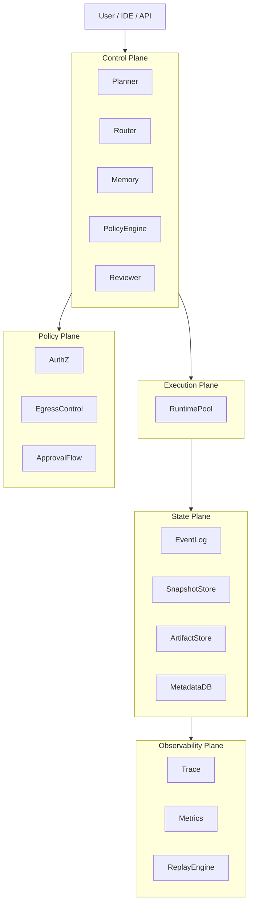
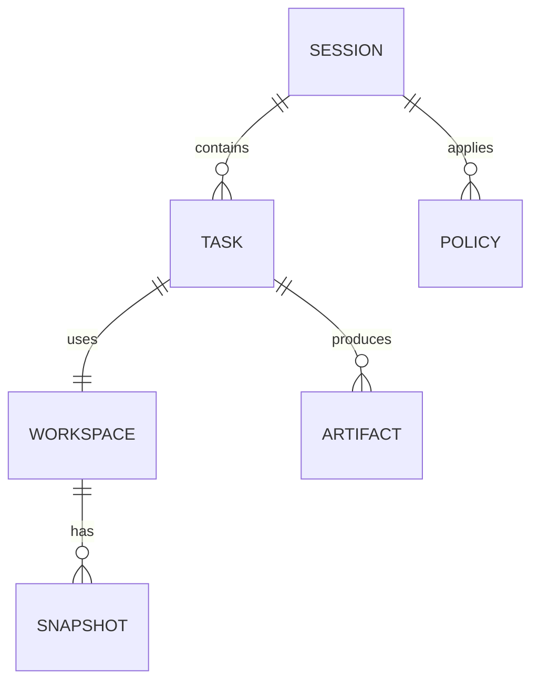
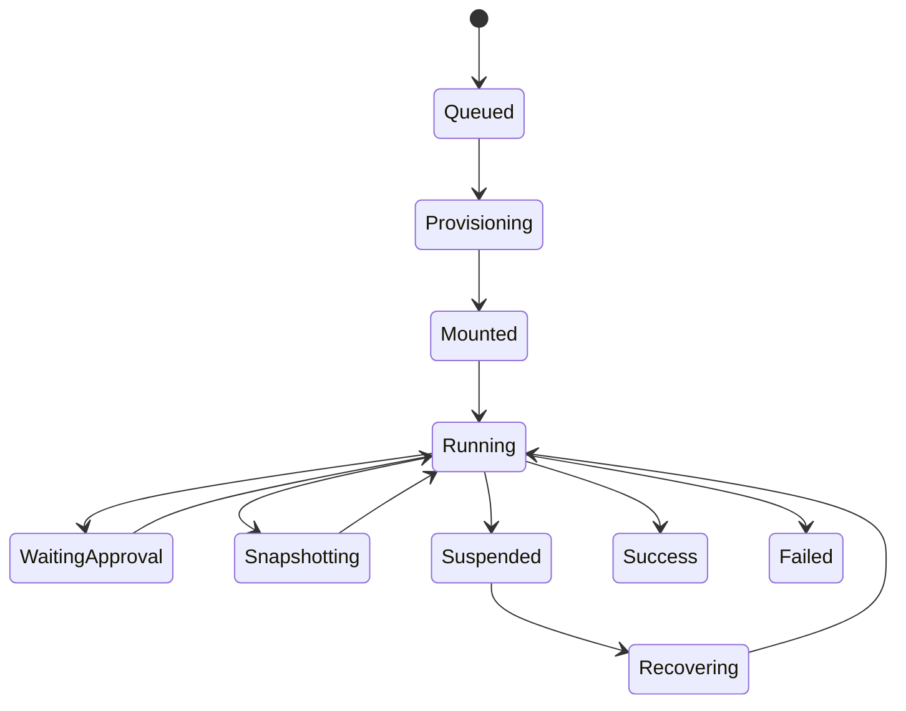
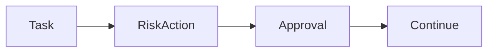

《Agent Runtime Fabric（智能体执行织网）架构设计文档》, 结构遵循企业级架构文档规范（背景→目标→约束→架构→模型→接口→数据→状态机→安全→可观测→部署→演进）。

---

# **Agent Runtime Fabric 架构设计文档**

## 1. 引言（Introduction）

### 1.1 背景

当前 Agent 系统在复杂软件工程（SWE-bench 类任务）、长时执行、多 Agent 协作场景中存在核心瓶颈：

* 执行不可恢复（runtime crash = 全部丢失）
* 状态与执行耦合（agent = container）
* 安全不可控（执行与策略混杂）
* 缺乏可观测性（不可 replay/debug）
* 无法支持并发协作（workspace 无分支/锁）

行业实践已收敛到：

> **控制面 / 执行面 / 状态面 解耦 + Workspace-first + Snapshot-first**

---

### 1.2 设计目标

| 目标                | 说明                |
| ----------------- | ----------------- |
| Durable Execution | 支持任务暂停 / 恢复 / 迁移  |
| Workspace-first   | 所有状态归一到 Workspace |
| Snapshot Recovery | 秒级恢复执行现场          |
| Secure-by-default | 最小权限 + 网络控制 + 审批  |
| Multi-Agent       | 支持并发 + 分支协作       |
| Replayable        | 可完整回放执行过程         |

---

### 1.3 非目标（Non-goals）

* 不实现 LLM 本身（依赖外部模型）
* 不实现完整 CI/CD（仅提供执行能力）
* 不替代 Kubernetes（而是运行其之上）

---

## 2. 系统总体架构

### 2.1 分层架构



---

### 2.2 核心设计原则

1. **Execution is Stateless, State is Externalized**
2. **Workspace is the Single Source of Truth**
3. **Snapshot is the Recovery Primitive**
4. **Policy is Declarative**
5. **Everything is Event**

---

## 3. 核心对象模型（Core Domain Model）

### 3.1 ER 模型



---

### 3.2 对象定义

#### Session

```json
{
  "session_id": "uuid",
  "goal": "string",
  "status": "ACTIVE|DONE|FAILED",
  "policy_bundle_id": "uuid",
  "created_at": "timestamp"
}
```

---

#### Task

```json
{
  "task_id": "uuid",
  "session_id": "uuid",
  "parent_task_id": "uuid|null",
  "status": "QUEUED|RUNNING|WAITING_APPROVAL|DONE|FAILED",
  "plan": {},
  "workspace_id": "uuid"
}
```

---

#### Workspace

```json
{
  "workspace_id": "uuid",
  "base_image": "string",
  "mounts": [],
  "env": {},
  "branch": "main|feature-x",
  "snapshot_head": "snapshot_id"
}
```

---

#### Snapshot（Delta）

```json
{
  "snapshot_id": "uuid",
  "workspace_id": "uuid",
  "parent_id": "uuid",
  "fs_diff": "blob_ref",
  "memory_ref": "blob_ref",
  "created_at": "timestamp"
}
```

---

#### Policy

```json
{
  "policy_id": "uuid",
  "allowed_commands": [],
  "allowed_paths": [],
  "network_rules": {},
  "approval_rules": {}
}
```

---

#### Artifact

```json
{
  "artifact_id": "uuid",
  "task_id": "uuid",
  "type": "log|binary|report|patch",
  "uri": "string"
}
```

---

## 4. Runtime 生命周期设计

### 4.1 状态机



---

### 4.2 状态转移事件

| 事件                | 描述     |
| ----------------- | ------ |
| TaskScheduled     | 进入队列   |
| RuntimeAllocated  | 分配执行资源 |
| WorkspaceMounted  | 挂载完成   |
| CommandExecuted   | 命令执行   |
| SnapshotCreated   | 创建快照   |
| ApprovalRequested | 请求审批   |
| RuntimePaused     | 挂起     |
| RuntimeResumed    | 恢复     |

---

## 5. Workspace & Snapshot 设计

### 5.1 Workspace 架构

```text
Workspace
 ├── repo/
 ├── deps/
 ├── cache/
 ├── logs/
 ├── ports/
 └── snapshots/
```

---

### 5.2 Snapshot 机制

| 特性 | 设计             |
| -- | -------------- |
| 类型 | 增量（CoW）        |
| 粒度 | 文件 + 内存        |
| 性能 | ms 级           |
| 存储 | object storage |

---

### 5.3 Branching（多 Agent 协作）

```text
main
 ├── agent-A-branch
 └── agent-B-branch
```

支持：

* fork workspace
* merge diff
* conflict resolution

---

## 6. API 设计（核心接口）

### 6.1 Session API

```
POST /sessions
GET  /sessions/{id}
```

---

### 6.2 Task API

```
POST /tasks
POST /tasks/{id}/run
POST /tasks/{id}/approve
```

---

### 6.3 Workspace API

```
POST /workspaces
POST /workspaces/{id}/snapshot
POST /workspaces/{id}/restore
POST /workspaces/{id}/branch
```

---

### 6.4 Runtime API

```
POST /runtime/allocate
POST /runtime/execute
POST /runtime/pause
POST /runtime/resume
```

---

## 7. 事件模型（Event Schema）

### 7.1 标准事件结构

```json
{
  "event_id": "uuid",
  "type": "CommandExecuted",
  "task_id": "uuid",
  "timestamp": "ts",
  "payload": {}
}
```

---

### 7.2 核心事件类型

* TaskCreated
* RuntimeStarted
* CommandStarted / Finished
* SnapshotCreated
* ArtifactGenerated
* ApprovalRequested

---

## 8. 安全与策略设计

### 8.1 权限模型

| 层级 | 控制               |
| -- | ---------------- |
| 文件 | 路径白名单            |
| 命令 | allowlist        |
| 网络 | egress whitelist |
| 数据 | secret scope     |

---

### 8.2 审批流（HITL）



---

### 8.3 防护机制

* Prompt Injection 防护（Semantic Firewall）
* Secret 隔离
* 沙箱网络隔离

---

## 9. 可观测性设计

### 9.1 Trace 模型

```text
Session
 └── Task
      └── Command
           └── Output
```

---

### 9.2 Replay（时间旅行）

能力：

* 任意 snapshot restore
* 重放 command
* diff 对比

---

## 10. 部署架构

### 10.1 运行环境

| 组件            | 技术                  |
| ------------- | ------------------- |
| Control Plane | 微服务                 |
| Runtime       | container / microVM |
| State         | S3 + DB             |
| Event         | Kafka               |

---

### 10.2 扩展性设计

* Runtime Pool Auto Scaling
* Snapshot 分层存储（热/冷）
* Event 流分区

---

## 11. 性能与成本优化

| 问题       | 方案                |
| -------- | ----------------- |
| 冷启动      | snapshot restore  |
| IO 成本    | delta snapshot    |
| token 成本 | log summarization |
| 资源浪费     | runtime eviction  |

---

## 12. 风险与边界

| 风险           | 对策            |
| ------------ | ------------- |
| Snapshot 过多  | GC            |
| Workspace 膨胀 | 分层存储          |
| 多 Agent 冲突   | branch + lock |
| 安全逃逸         | microVM       |

---

## 13. 演进路线（Roadmap）

### Phase 1（MVP）

* Task + Workspace + Snapshot
* 单 runtime 类型
* 基础 replay

### Phase 2

* 多 runtime backend
* policy engine
* branching

### Phase 3

* 多 agent 协作
* semantic context plane
* 自优化执行

---

## 14. 总结

Agent Runtime Fabric 的本质不是“更强的 Agent”，而是：

> **把 Agent 执行问题，从“prompt engineering”，升级为“分布式系统工程问题”。**

其核心突破点只有三个：

1. **状态外置（State Externalization）**
2. **执行可恢复（Durable Execution）**
3. **过程可回放（Replayable Execution）**

---

如果你要继续往“可落地工程实现”推进，我可以下一步直接给你：

* **数据库表结构（DDL 级别）**
* **Kafka Topic & Event Schema（生产可用）**
* **Snapshot 存储格式设计（含 CoW 实现）**
* **Workspace 文件系统选型（ZFS / OverlayFS / 自研）**
* **以及：一个最小可运行的 MVP 技术栈（含 repo 结构）**

这一步会从“架构设计”进入“系统设计 + 可编码实现”。
