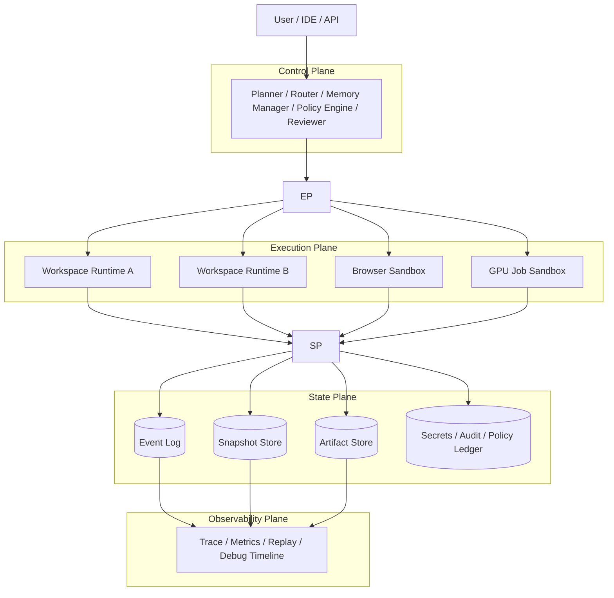
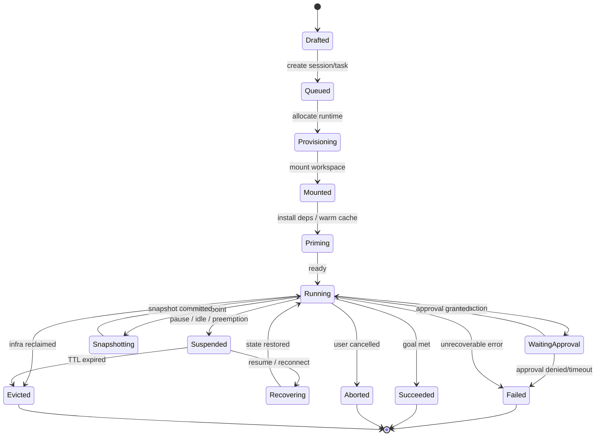

《Agent Runtime Fabric（智能体执行织网）》设计吸收当前主流实现的共同分层：OpenAI 把 sandbox、approvals、network controls 与 MCP/connectors 作为不同控制面能力；OpenHands 把 agent server 与 workspace/runtime 明确拆分；E2B 支持 pause/resume 并持久化 filesystem + memory；Modal 提供 snapshotting 与细粒度网络控制；Firecracker 则提供 microVM 级隔离与高密度运行基础。基于这些材料，可以把 Agent Runtime Fabric 归纳为“控制面负责决策、执行面负责计算、状态面负责持久化、策略面负责约束、观测面负责可回放”的基础设施。([OpenAI Developers][1])

## 1. 总体架构

### 架构要点

1. **控制面不直接执行危险动作**，只做规划、路由、审批、恢复决策。
2. **执行面是可丢弃、可恢复、可克隆的 Runtime Fleet**，按任务风险选择容器、gVisor、microVM、浏览器沙箱或 GPU 沙箱。
3. **状态面完全外置**：事件日志、快照、产物、审计与策略独立保存，Runtime 只保留短时执行状态。
4. **观测面可回放**：每一次命令、文件变更、错误、快照点都可重建执行轨迹。

---

## 2. 五平面职责

### 2.1 Control Plane

负责 Session 级目标管理、Task 拆解、模型路由、记忆摘要、审批决策、失败重试与恢复编排。它接收“高层意图”，输出“可执行计划”。

### 2.2 Execution Plane

负责真正跑命令、安装依赖、编译、测试、浏览器操作、GPU 推理等。Runtime 只关注“算”，不承担长期状态。

### 2.3 State Plane

负责三类持久化：

* **Event Log**：记录所有动作与结果；
* **Snapshot**：保存某一时刻的 workspace + memory + 运行态；
* **Artifact Store**：保存补丁、日志、构建产物、测试报告。

### 2.4 Policy Plane

负责 least privilege、网络出口、文件路径、命令白名单、密钥可见性、审批卡点。OpenAI 已明确把 sandbox boundary 与 approval policy 分成两层；默认网络也可关闭或受控。([OpenAI Developers][1])

### 2.5 Observability Plane

负责 replay、时间旅行调试、故障归因、执行对比、回滚证据链。其核心不是“看日志”，而是“可复现整个执行现场”。

---

## 3. 核心对象模型

| 对象        | 定义                              | 核心字段                                                                                 | 关系                                      |
| --------- | ------------------------------- | ------------------------------------------------------------------------------------ | --------------------------------------- |
| Session   | 用户宏观目标，如“完成一个 Chrome 插件”        | session_id, owner, goal, sla, status, policy_bundle                                  | 1 个 Session 包含多个 Task                   |
| Task      | 可执行单元，如“初始化工程”“修复 build”        | task_id, session_id, parent_task_id, plan, status, priority, model_route             | Task 可递归分解 Sub-task                     |
| Workspace | 持久化工作区，承载仓库、依赖缓存、环境变量、端口、浏览器状态  | workspace_id, base_image, mount_spec, git_ref, env, cache_policy, branch_id          | 1 个 Task 绑定 1 个主 Workspace，可派生多个 Branch |
| Snapshot  | 某时刻的增量检查点，包含文件 diff、内存态、进程态、元数据 | snapshot_id, workspace_id, parent_snapshot_id, delta, timestamp, consistency_level   | Workspace 可有多个 Snapshot                 |
| Policy    | 声明式执行约束                         | policy_id, allowed_tools, allowed_paths, network_rules, approval_rules, secret_scope | 可附着在 Session/Task/Workspace             |
| Artifact  | 执行产物                            | artifact_id, task_id, snapshot_id, type, uri, checksum                               | 由 Task 产生，可被后续 Task 消费                  |

### 对象之间的关键语义

* **Session 是目标容器**，不是执行容器。
* **Task 是调度边界**，不是状态边界。
* **Workspace 是身体**，把“代码 + 依赖 + 运行态 + 外部挂载”统一起来。
* **Snapshot 是记忆边界**，用来实现秒级恢复与分支。
* **Policy 是安全边界**，决定“能做什么、在哪做、何时需审批”。
* **Artifact 是证据与结果**，是交付物，也是后续推理输入。

---

## 4. Workspace / Snapshot 设计原则

### Workspace-first

真正决定长任务成功率的，不是对话长度，而是 workspace 是否完整：仓库、依赖、构建缓存、测试产物、端口、浏览器状态、日志、历史快照都在同一工作区内。

### Snapshot-first

Snapshot 不做全量复制，而做**增量化、可恢复、可分叉**的检查点。Modal 和 E2B 都已经把 snapshotting / pause-resume 作为沙箱关键原语；Modal 还强调只保存变更部分以降低恢复和存储成本。([e2b.dev][2])

### Runtime 可插拔

Runtime 只是执行后端：

* 可信轻任务：container / gVisor / wasm；
* 不可信编译：microVM；
* 浏览器操作：browser sandbox；
* 大模型推理或 GPU 任务：GPU sandbox。
  Firecracker 的 microVM 路线正对应“高隔离 + 快启动 + 高密度”的执行层需求。([firecracker-microvm.github.io][3])

---

## 5. Runtime 生命周期状态机

### 状态解释

* **Drafted**：只存在目标，不存在执行资源。
* **Queued**：等待调度。
* **Provisioning**：拉起 runtime、挂载网络策略、注入 secrets。
* **Mounted**：workspace 已挂载，仍未进入稳定执行。
* **Priming**：安装依赖、预热缓存、启动服务。
* **Running**：正常执行。
* **WaitingApproval**：触发高风险动作，暂停等待人类或策略引擎审批。
* **Snapshotting**：生成检查点。
* **Suspended**：挂起但保留状态。E2B 的 pause/resume 就是这一类语义。([e2b.dev][2])
* **Recovering**：从快照或挂起态恢复。
* **Succeeded / Failed / Aborted / Evicted**：终止态。

### 关键事件

建议统一事件命名：
`TaskCreated / RuntimeProvisioned / WorkspaceMounted / CommandStarted / CommandFinished / ApprovalRequested / ApprovalGranted / SnapshotCreated / ArtifactEmitted / RuntimeSuspended / RuntimeRecovered / TaskCompleted / TaskFailed`

---

## 6. 推荐的工程落地方式

### 最小可行版本

1. **Task + Workspace + Snapshot + Policy + Artifact** 六对象先落库。
2. Runtime 先支持两类后端：`container` 与 `microVM`。
3. 事件流先接入命令级、文件级、审批级三种事件。
4. 先做手动审批，再做策略审批。
5. 先做“崩溃恢复”，再做“分支协作”。

### 中期增强

* Workspace branching：一任务一分支，reviewer 合并；
* Semantic Context Plane：长日志自动摘要压缩；
* Replay UI：时间轴回放与人工接管；
* Egress firewall：域名/端口/协议级控制；
* Artifact provenance：每个产物绑定快照与命令链。

---

## 7. 一句话定义

**Agent Runtime Fabric 不是“Agent inside Sandbox”，而是“以控制面为脑、以 Workspace 为体、以 Snapshot 为记忆、以 Policy 为边界、以 Event Stream 为神经系统”的智能体执行基础设施。**

[1]: https://developers.openai.com/codex/concepts/sandboxing "Sandbox – Codex | OpenAI Developers"
[2]: https://e2b.dev/docs/sandbox/persistence "Documentation - E2B"
[3]: https://firecracker-microvm.github.io/ "Firecracker"
